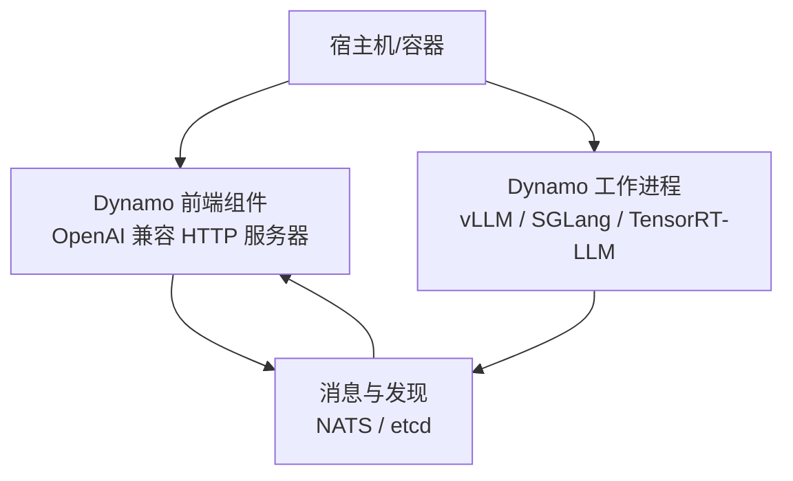
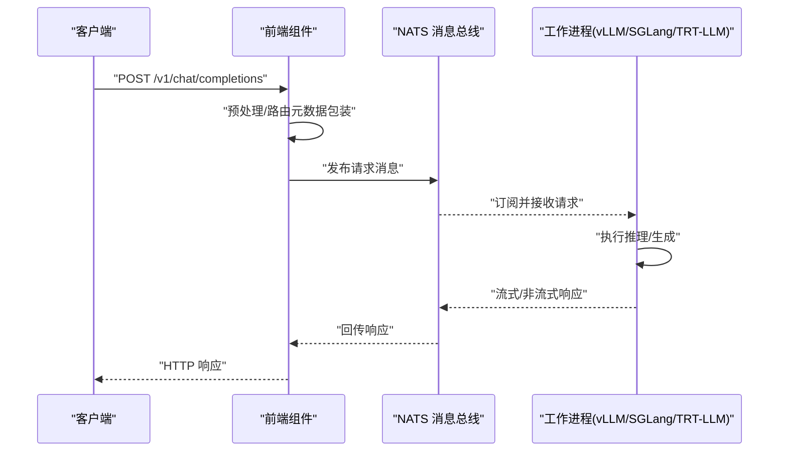
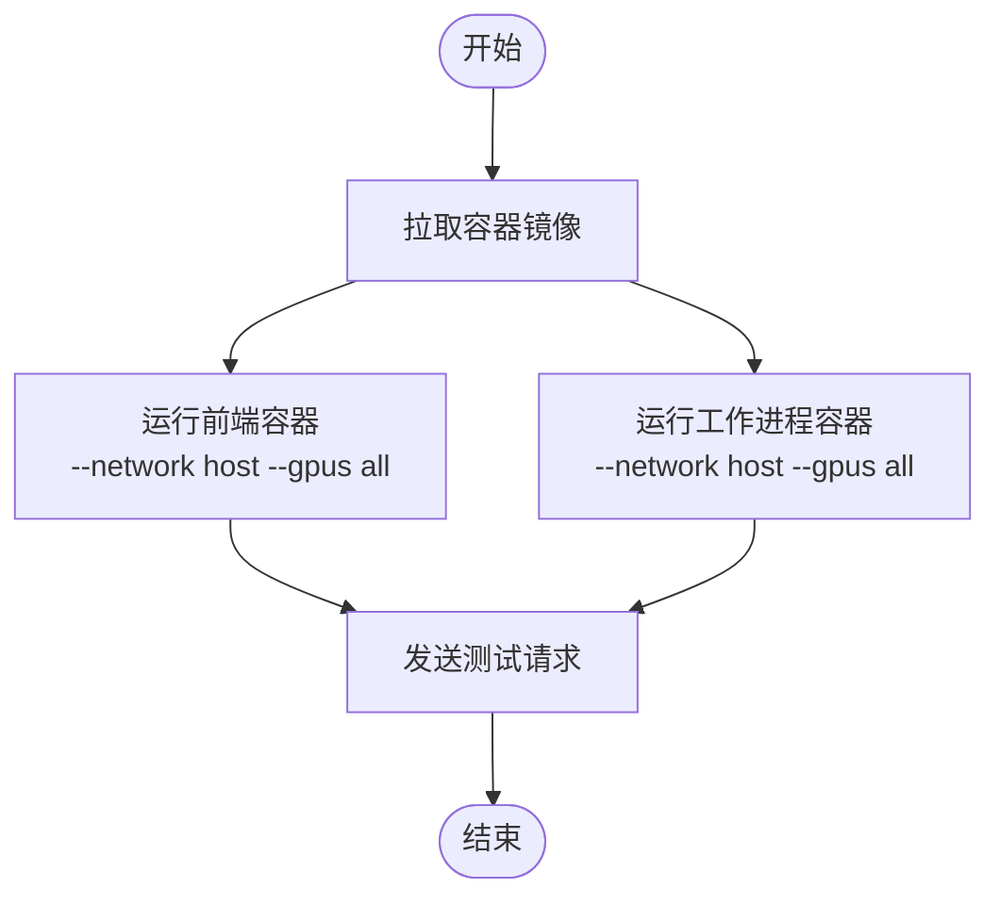
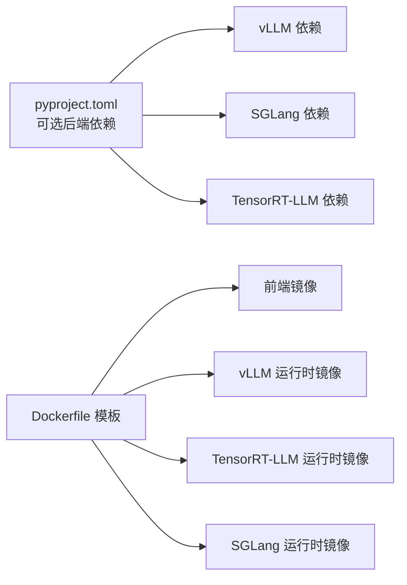

# 快速开始

<cite>
**本文引用的文件**
- [README.md](file://README.md)
- [pyproject.toml](file://pyproject.toml)
- [container/Dockerfile.template](file://container/Dockerfile.template)
- [container/templates/frontend.Dockerfile](file://container/templates/frontend.Dockerfile)
- [container/templates/vllm_runtime.Dockerfile](file://container/templates/vllm_runtime.Dockerfile)
- [container/templates/trtllm_runtime.Dockerfile](file://container/templates/trtllm_runtime.Dockerfile)
- [container/templates/sglang_runtime.Dockerfile](file://container/templates/sglang_runtime.Dockerfile)
- [components/src/dynamo/frontend/__main__.py](file://components/src/dynamo/frontend/__main__.py)
- [components/src/dynamo/sglang/__main__.py](file://components/src/dynamo/sglang/__main__.py)
- [components/src/dynamo/trtllm/__main__.py](file://components/src/dynamo/trtllm/__main__.py)
- [components/src/dynamo/vllm/__main__.py](file://components/src/dynamo/vllm/__main__.py)
- [examples/basics/quickstart/README.md](file://examples/basics/quickstart/README.md)
- [docs/pages/performance/tuning.md](file://docs/pages/performance/tuning.md)
- [docs/pages/reference/support-matrix.md](file://docs/pages/reference/support-matrix.md)
- [.devcontainer/README.md](file://.devcontainer/README.md)
- [.devcontainer/devcontainer.json.j2](file://.devcontainer/devcontainer.json.j2)
- [deploy/sanity_check.py](file://deploy/sanity_check.py)
</cite>

## 目录
1. [简介](#简介)
2. [项目结构](#项目结构)
3. [核心组件](#核心组件)
4. [架构总览](#架构总览)
5. [详细组件分析](#详细组件分析)
6. [依赖关系分析](#依赖关系分析)
7. [性能考虑](#性能考虑)
8. [故障排查指南](#故障排查指南)
9. [结论](#结论)
10. [附录](#附录)

## 简介
本指南面向首次接触 NVIDIA Dynamo 的用户，目标是在 5–10 分钟内完成一次可运行的本地实例演示。内容覆盖系统要求验证、容器化部署（推荐）、从 PyPI 安装、从源码构建与本地开发环境搭建，并提供完整的启动前端服务、启动工作进程、发送测试请求的步骤。同时给出常见问题排查、性能优化建议与后续学习路径。

## 项目结构
Dynamo 采用多语言混合架构：核心以 Rust 实现高性能运行时，Python 层提供易用的组件入口与可选功能；容器层提供开箱即用的运行时镜像；examples 与 docs 提供示例与参考文档。

图示来源
- [examples/basics/quickstart/README.md](file://examples/basics/quickstart/README.md#L23-L34)

章节来源
- [README.md](file://README.md#L77-L112)
- [examples/basics/quickstart/README.md](file://examples/basics/quickstart/README.md#L1-L35)

## 核心组件
- 前端组件（Frontend）：内置 OpenAI 兼容 HTTP API，负责请求预处理、路由与响应聚合。
- 路由器（Router）：基于 KV 缓存感知的智能路由，支持前填充与解码分离调度。
- 工作进程（Workers）：封装 vLLM、SGLang、TensorRT-LLM 等推理引擎，作为 NATS 订阅者执行请求。
- 发现与消息（Discovery & Messaging）：使用 etcd 进行服务注册与发现，使用 NATS 进行跨组件通信。

章节来源
- [README.md](file://README.md#L155-L215)
- [examples/basics/quickstart/README.md](file://examples/basics/quickstart/README.md#L18-L35)

## 架构总览
下图展示了典型请求在 Dynamo 内部的流转过程：客户端通过前端组件发起 OpenAI 风格的 HTTP 请求，前端将请求转换为内部消息并通过 NATS 投递到后端工作进程，工作进程执行推理并将结果回流至前端，最终以 HTTP 响应返回给客户端。

图示来源
- [examples/basics/quickstart/README.md](file://examples/basics/quickstart/README.md#L140-L161)

章节来源
- [examples/basics/quickstart/README.md](file://examples/basics/quickstart/README.md#L140-L161)

## 详细组件分析

### 容器化部署（推荐）
- 使用官方容器镜像，一键启动前端与工作进程，避免环境依赖问题。
- 支持 SGLang、TensorRT-LLM、vLLM 三类后端镜像，按需选择。
- 可在同一容器中后台运行多个进程，或通过 docker exec 在同一容器内分屏操作。

图示来源
- [README.md](file://README.md#L94-L111)

章节来源
- [README.md](file://README.md#L94-L111)
- [container/Dockerfile.template](file://container/Dockerfile.template#L1-L73)
- [container/templates/frontend.Dockerfile](file://container/templates/frontend.Dockerfile#L1-L121)
- [container/templates/vllm_runtime.Dockerfile](file://container/templates/vllm_runtime.Dockerfile#L1-L289)
- [container/templates/trtllm_runtime.Dockerfile](file://container/templates/trtllm_runtime.Dockerfile#L1-L272)
- [container/templates/sglang_runtime.Dockerfile](file://container/templates/sglang_runtime.Dockerfile#L1-L150)

### 从 PyPI 安装
- 推荐使用 uv 作为包管理器，创建虚拟环境并安装对应后端的可选依赖。
- 三类后端的安装命令与前置系统依赖见下方“安装步骤”。

章节来源
- [README.md](file://README.md#L113-L154)
- [pyproject.toml](file://pyproject.toml#L50-L70)

### 从源码构建
- 适用于需要贡献代码或定制构建的用户。
- 步骤包括：安装系统库、Rust 工具链、Python 虚拟环境、构建 Rust 绑定、安装 GPU 内存服务与主包，最后运行前端组件。

章节来源
- [README.md](file://README.md#L243-L342)

### 本地开发环境搭建
- 使用 VS Code/Cursor + Dev Containers，自动挂载代码、缓存与工具链，一键构建与调试。
- 支持 vLLM、SGLang、TensorRT-LLM 三类框架的专用 devcontainer 配置。

章节来源
- [.devcontainer/README.md](file://.devcontainer/README.md#L1-L478)
- [.devcontainer/devcontainer.json.j2](file://.devcontainer/devcontainer.json.j2#L1-L79)

### 启动前端服务
- 通过 Python 模块方式启动前端组件，支持交互模式与 HTTP 模式。
- 建议在本地开发时使用 --store-kv file 避免外部依赖。

章节来源
- [components/src/dynamo/frontend/__main__.py](file://components/src/dynamo/frontend/__main__.py#L1-L8)
- [README.md](file://README.md#L155-L173)

### 启动工作进程（后端选择）
- vLLM：使用 --model 参数（注意与 --model-path 的差异）。
- SGLang：默认禁用 KV 事件。
- TensorRT-LLM：默认禁用 KV 事件。

章节来源
- [components/src/dynamo/vllm/__main__.py](file://components/src/dynamo/vllm/__main__.py#L1-L13)
- [components/src/dynamo/sglang/__main__.py](file://components/src/dynamo/sglang/__main__.py#L1-L13)
- [components/src/dynamo/trtllm/__main__.py](file://components/src/dynamo/trtllm/__main__.py#L1-L13)
- [README.md](file://README.md#L175-L196)

### 发送测试请求
- 使用 curl 发送 OpenAI 兼容的聊天补全请求，支持非流式与流式两种模式。
- 可通过修改 stream 字段与 max_tokens 控制输出行为。

章节来源
- [README.md](file://README.md#L198-L215)

## 依赖关系分析
- Python 与可选后端依赖通过可选组定义，分别针对 vLLM、SGLang、TensorRT-LLM。
- 容器镜像模板按框架与目标阶段组织，统一构建前端与运行时层。

图示来源
- [pyproject.toml](file://pyproject.toml#L50-L70)
- [container/Dockerfile.template](file://container/Dockerfile.template#L1-L73)

章节来源
- [pyproject.toml](file://pyproject.toml#L50-L70)
- [container/Dockerfile.template](file://container/Dockerfile.template#L1-L73)

## 性能考虑
- 张量并行（TP）与流水并行（PP）策略对吞吐与延迟的影响显著，需结合模型规模与硬件资源进行权衡。
- 块大小（block size）影响前缀缓存命中率与内存碎片；对于密集模型，128 是常见起点。
- 解码引擎的批大小与最大生成长度影响中间张量尺寸与 KV 缓存占用。
- 在高负载场景，减少预填充引擎数量、增大本地预填充长度可提升解码阶段的 KV 缓存利用率。

章节来源
- [docs/pages/performance/tuning.md](file://docs/pages/performance/tuning.md#L1-L137)

## 故障排查指南
- 系统要求与兼容性：确认操作系统、GPU 架构、CUDA 版本满足后端要求。
- 容器网络与共享内存：容器内 /dev/shm 太小会导致共享内存重用失败；必要时调整 --shm-size 或映射必要端口。
- 环境变量：检查 DYN_*、CUDA_VISIBLE_DEVICES、NVIDIA_VISIBLE_DEVICES 等变量是否符合预期。
- 开发环境：Dev Containers 与 Docker 版本兼容性问题可能导致连接失败，建议使用推荐版本。
- 运行前自检：使用 deploy/sanity_check.py 输出系统状态树，定位缺失组件或权限问题。

章节来源
- [docs/pages/reference/support-matrix.md](file://docs/pages/reference/support-matrix.md#L1-L178)
- [.devcontainer/README.md](file://.devcontainer/README.md#L10-L23)
- [deploy/sanity_check.py](file://deploy/sanity_check.py#L1-L149)

## 结论
通过本指南，您可以在 5–10 分钟内完成 Dynamo 的首次运行：选择容器镜像或 PyPI 安装，启动前端与工作进程，发送测试请求并获得响应。随后可根据实际需求深入性能调优与生产部署。

## 附录
- 快速开始示例与请求流程详见基础示例文档。
- 进一步阅读：性能调优、支持矩阵、容器模板与开发容器说明。

章节来源
- [examples/basics/quickstart/README.md](file://examples/basics/quickstart/README.md#L1-L162)
- [docs/pages/performance/tuning.md](file://docs/pages/performance/tuning.md#L1-L137)
- [docs/pages/reference/support-matrix.md](file://docs/pages/reference/support-matrix.md#L1-L178)
- [.devcontainer/README.md](file://.devcontainer/README.md#L1-L478)