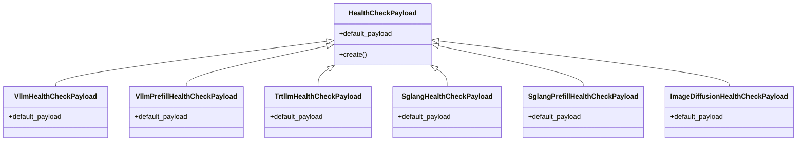

# 健康检查与告警

<cite>
**本文引用的文件**   
- [docs/pages/observability/health-checks.md](file://docs/pages/observability/health-checks.md)
- [components/src/dynamo/vllm/health_check.py](file://components/src/dynamo/vllm/health_check.py)
- [components/src/dynamo/trtllm/health_check.py](file://components/src/dynamo/trtllm/health_check.py)
- [components/src/dynamo/sglang/health_check.py](file://components/src/dynamo/sglang/health_check.py)
- [deploy/observability/prometheus.yml](file://deploy/observability/prometheus.yml)
- [deploy/observability/grafana-datasources.yml](file://deploy/observability/grafana-datasources.yml)
- [deploy/operator/config/manager/manager.yaml](file://deploy/operator/config/manager/manager.yaml)
- [deploy/sanity_check.py](file://deploy/sanity_check.py)
- [tests/fault_tolerance/hardware/fault_injection_service/api_service/main.py](file://tests/fault_tolerance/hardware/fault_injection_service/api_service/main.py)
- [tests/fault_tolerance/deploy/README.md](file://tests/fault_tolerance/deploy/README.md)
- [tests/fault_tolerance/deploy/checkers.py](file://tests/fault_tolerance/deploy/checkers.py)
- [.github/workflows/ci-test-suite.yml](file://.github/workflows/ci-test-suite.yml)
</cite>

## 目录
1. [简介](#简介)
2. [项目结构](#项目结构)
3. [核心组件](#核心组件)
4. [架构总览](#架构总览)
5. [详细组件分析](#详细组件分析)
6. [依赖关系分析](#依赖关系分析)
7. [性能考量](#性能考量)
8. [故障排查指南](#故障排查指南)
9. [结论](#结论)
10. [附录](#附录)

## 简介
本指南面向Dynamo健康检查与告警系统，覆盖以下主题：
- 健康检查机制：存活探针(liveness)、就绪探针(readiness)、启动探针(startup)的配置与行为
- 服务可用性监控：响应时间、错误率、依赖服务健康检查
- 告警配置策略：规则定义、通知渠道、告警抑制
- 故障检测与自动恢复：熔断、降级、故障转移
- SLA监控、容量预警与性能阈值
- 告警配置模板、监控脚本与运维自动化工具

## 项目结构
Dynamo在多处提供健康检查与可观测性能力：
- 文档层：健康检查使用说明与环境变量
- 后端层：各后端(vLLM/TRT-LLM/SGLang)的健康检查载荷定义
- 运维层：Prometheus/Grafana配置、Operator探针配置、预部署检查脚本
- 测试层：故障注入API服务、SLA与恢复验证脚本、CI通知工作流

**图表来源**
- [docs/pages/observability/health-checks.md](file://docs/pages/observability/health-checks.md#L1-L351)
- [components/src/dynamo/vllm/health_check.py](file://components/src/dynamo/vllm/health_check.py#L1-L197)
- [components/src/dynamo/trtllm/health_check.py](file://components/src/dynamo/trtllm/health_check.py#L1-L92)
- [components/src/dynamo/sglang/health_check.py](file://components/src/dynamo/sglang/health_check.py#L1-L147)
- [deploy/observability/prometheus.yml](file://deploy/observability/prometheus.yml#L1-L63)
- [deploy/observability/grafana-datasources.yml](file://deploy/observability/grafana-datasources.yml#L1-L24)
- [deploy/operator/config/manager/manager.yaml](file://deploy/operator/config/manager/manager.yaml#L88-L106)
- [deploy/sanity_check.py](file://deploy/sanity_check.py#L1-L800)
- [tests/fault_tolerance/hardware/fault_injection_service/api_service/main.py](file://tests/fault_tolerance/hardware/fault_injection_service/api_service/main.py#L1040-L1468)
- [tests/fault_tolerance/deploy/README.md](file://tests/fault_tolerance/deploy/README.md#L286-L770)
- [tests/fault_tolerance/deploy/checkers.py](file://tests/fault_tolerance/deploy/checkers.py#L298-L332)
- [.github/workflows/ci-test-suite.yml](file://.github/workflows/ci-test-suite.yml#L1127-L1177)

**章节来源**
- [docs/pages/observability/health-checks.md](file://docs/pages/observability/health-checks.md#L1-L351)
- [deploy/observability/prometheus.yml](file://deploy/observability/prometheus.yml#L1-L63)
- [deploy/observability/grafana-datasources.yml](file://deploy/observability/grafana-datasources.yml#L1-L24)
- [deploy/operator/config/manager/manager.yaml](file://deploy/operator/config/manager/manager.yaml#L88-L106)
- [deploy/sanity_check.py](file://deploy/sanity_check.py#L1-L800)

## 核心组件
- 健康检查HTTP端点与环境变量：前端与工作节点的/liveness、/health、/ready等端点，以及可配置的路径、初始状态、端点就绪要求、主动健康检查开关与参数
- 后端健康检查载荷：为不同后端(vLLM/TRT-LLM/SGLang)定义最小化、快速完成的健康检查请求载荷，确保全栈可用性验证
- 运维监控：Prometheus抓取配置、Grafana数据源、Operator管理器探针配置
- 预部署检查：sanity_check.py用于系统资源、容器上下文、框架安装、CUDA/NVIDIA信息等的诊断
- 测试与自动化：故障注入API服务、SLA与恢复校验器、CI告警通知

**章节来源**
- [docs/pages/observability/health-checks.md](file://docs/pages/observability/health-checks.md#L14-L286)
- [components/src/dynamo/vllm/health_check.py](file://components/src/dynamo/vllm/health_check.py#L53-L197)
- [components/src/dynamo/trtllm/health_check.py](file://components/src/dynamo/trtllm/health_check.py#L51-L92)
- [components/src/dynamo/sglang/health_check.py](file://components/src/dynamo/sglang/health_check.py#L50-L147)
- [deploy/observability/prometheus.yml](file://deploy/observability/prometheus.yml#L20-L62)
- [deploy/observability/grafana-datasources.yml](file://deploy/observability/grafana-datasources.yml#L18-L24)
- [deploy/operator/config/manager/manager.yaml](file://deploy/operator/config/manager/manager.yaml#L88-L106)
- [deploy/sanity_check.py](file://deploy/sanity_check.py#L1-L800)

## 架构总览
Dynamo健康检查与告警的整体流程如下：
- 组件通过HTTP端点暴露健康状态（/live、/health、/ready），由编排系统(Kubernetes)定期探测
- 工作节点可启用“主动健康检查”(canary)，在空闲期对关键端点发送轻量请求以提前发现异常
- Prometheus按配置抓取各组件指标，Grafana可视化展示；Operator管理器内置探针参数
- 预部署检查脚本保障运行环境满足要求；测试用例验证SLA与恢复能力；CI工作流在失败时触发通知

**图表来源**
- [docs/pages/observability/health-checks.md](file://docs/pages/observability/health-checks.md#L14-L286)
- [deploy/observability/prometheus.yml](file://deploy/observability/prometheus.yml#L20-L62)
- [deploy/observability/grafana-datasources.yml](file://deploy/observability/grafana-datasources.yml#L18-L24)
- [deploy/operator/config/manager/manager.yaml](file://deploy/operator/config/manager/manager.yaml#L88-L106)

## 详细组件分析

### 健康检查机制与探针配置
- 端点与状态
  - /live：仅反映进程存活
  - /health：反映服务整体健康，前端在注册后会列出已注册实例
  - /ready：反映就绪状态，可通过环境变量控制初始状态与必需端点
- 探针配置
  - Kubernetes中，Operator管理器配置了/healthz与/readyz探针的路径、端口与延迟
- 主动健康检查(canary)
  - 在空闲期触发，使用最小化payload验证端点可用性，支持超时与等待时间配置

**图表来源**
- [docs/pages/observability/health-checks.md](file://docs/pages/observability/health-checks.md#L225-L344)

**章节来源**
- [docs/pages/observability/health-checks.md](file://docs/pages/observability/health-checks.md#L14-L344)
- [deploy/operator/config/manager/manager.yaml](file://deploy/operator/config/manager/manager.yaml#L88-L106)

### 后端健康检查载荷
- vLLM
  - 默认生成1个token的最小化请求，优先从引擎获取BOS token ID，否则回退
  - 支持文本输入与token输入两种模式
- TRT-LLM
  - 使用stop_conditions与sampling_options的最小化请求，包含BOS token ID
- SGLang
  - 解码与预填充(worker)分别有对应载荷；图像扩散有专用载荷
  - 支持文本输入与token输入

**图表来源**
- [components/src/dynamo/vllm/health_check.py](file://components/src/dynamo/vllm/health_check.py#L53-L197)
- [components/src/dynamo/trtllm/health_check.py](file://components/src/dynamo/trtllm/health_check.py#L51-L92)
- [components/src/dynamo/sglang/health_check.py](file://components/src/dynamo/sglang/health_check.py#L50-L147)

**章节来源**
- [components/src/dynamo/vllm/health_check.py](file://components/src/dynamo/vllm/health_check.py#L53-L197)
- [components/src/dynamo/trtllm/health_check.py](file://components/src/dynamo/trtllm/health_check.py#L51-L92)
- [components/src/dynamo/sglang/health_check.py](file://components/src/dynamo/sglang/health_check.py#L50-L147)

### 服务可用性监控
- 指标采集
  - Prometheus按job抓取nats、etcd、dcgm、前端、后端、KVBM等目标
  - Grafana数据源指向Prometheus
- 可视化
  - Grafana侧车自动加载仪表盘配置
- 运行时诊断
  - sanity_check.py输出系统资源、容器上下文、框架安装、CUDA/NVIDIA信息、DYN_*环境变量等

**图表来源**
- [deploy/observability/prometheus.yml](file://deploy/observability/prometheus.yml#L20-L62)
- [deploy/observability/grafana-datasources.yml](file://deploy/observability/grafana-datasources.yml#L18-L24)

**章节来源**
- [deploy/observability/prometheus.yml](file://deploy/observability/prometheus.yml#L1-L63)
- [deploy/observability/grafana-datasources.yml](file://deploy/observability/grafana-datasources.yml#L1-L24)
- [deploy/sanity_check.py](file://deploy/sanity_check.py#L1-L800)

### 告警配置策略
- 规则定义
  - 在Prometheus中编写规则，结合Grafana告警通道进行告警
- 通知渠道
  - CI工作流在失败时向Slack发送通知
- 告警抑制
  - 可通过告警管理策略在特定窗口内抑制重复告警

**图表来源**
- [.github/workflows/ci-test-suite.yml](file://.github/workflows/ci-test-suite.yml#L1127-L1177)

**章节来源**
- [.github/workflows/ci-test-suite.yml](file://.github/workflows/ci-test-suite.yml#L1127-L1177)

### 故障检测与自动恢复
- 故障注入与恢复
  - 提供故障注入API服务，支持网络分区与GPU故障注入与恢复
  - 支持在关闭时自动恢复活动故障
- SLA与恢复校验
  - 通过测试用例验证成功率、恢复时间等指标
  - 包含高可用与单实例场景的阈值与期望

**图表来源**
- [tests/fault_tolerance/hardware/fault_injection_service/api_service/main.py](file://tests/fault_tolerance/hardware/fault_injection_service/api_service/main.py#L1280-L1468)

**章节来源**
- [tests/fault_tolerance/hardware/fault_injection_service/api_service/main.py](file://tests/fault_tolerance/hardware/fault_injection_service/api_service/main.py#L1040-L1468)
- [tests/fault_tolerance/deploy/README.md](file://tests/fault_tolerance/deploy/README.md#L286-L770)
- [tests/fault_tolerance/deploy/checkers.py](file://tests/fault_tolerance/deploy/checkers.py#L298-L332)

### SLA监控、容量预警与性能阈值
- 成功率与恢复时间
  - 高可用场景：成功率≥99%，恢复时间<60秒
  - 单实例场景：成功率≥10%，恢复时间<180秒
- 性能基线
  - 通过基准测试与规划器工具评估吞吐与延迟
- 容量预警
  - 结合Prometheus/Grafana监控队列长度、服务时间、超时等指标进行预警

**章节来源**
- [tests/fault_tolerance/deploy/README.md](file://tests/fault_tolerance/deploy/README.md#L286-L770)
- [tests/fault_tolerance/deploy/checkers.py](file://tests/fault_tolerance/deploy/checkers.py#L298-L332)

### 告警配置模板、监控脚本与运维自动化
- 告警配置模板
  - Prometheus规则与Grafana告警通道配置
- 监控脚本
  - sanity_check.py：系统与运行时环境诊断
- 运维自动化
  - Operator管理器内置探针参数
  - CI工作流自动通知

**章节来源**
- [deploy/observability/prometheus.yml](file://deploy/observability/prometheus.yml#L1-L63)
- [deploy/observability/grafana-datasources.yml](file://deploy/observability/grafana-datasources.yml#L1-L24)
- [deploy/operator/config/manager/manager.yaml](file://deploy/operator/config/manager/manager.yaml#L88-L106)
- [deploy/sanity_check.py](file://deploy/sanity_check.py#L1-L800)
- [.github/workflows/ci-test-suite.yml](file://.github/workflows/ci-test-suite.yml#L1127-L1177)

## 依赖关系分析
- 组件耦合
  - 健康检查载荷与具体后端引擎紧密耦合，但通过统一接口抽象降低变更成本
  - Operator探针配置与组件HTTP端点强关联
- 外部依赖
  - Prometheus与Grafana作为外部观测平台
  - CI系统负责告警通知

**图表来源**
- [docs/pages/observability/health-checks.md](file://docs/pages/observability/health-checks.md#L14-L344)
- [components/src/dynamo/vllm/health_check.py](file://components/src/dynamo/vllm/health_check.py#L53-L197)
- [components/src/dynamo/trtllm/health_check.py](file://components/src/dynamo/trtllm/health_check.py#L51-L92)
- [components/src/dynamo/sglang/health_check.py](file://components/src/dynamo/sglang/health_check.py#L50-L147)
- [deploy/operator/config/manager/manager.yaml](file://deploy/operator/config/manager/manager.yaml#L88-L106)
- [deploy/observability/prometheus.yml](file://deploy/observability/prometheus.yml#L20-L62)
- [deploy/observability/grafana-datasources.yml](file://deploy/observability/grafana-datasources.yml#L18-L24)
- [deploy/sanity_check.py](file://deploy/sanity_check.py#L1-L800)
- [tests/fault_tolerance/hardware/fault_injection_service/api_service/main.py](file://tests/fault_tolerance/hardware/fault_injection_service/api_service/main.py#L1040-L1468)

**章节来源**
- [docs/pages/observability/health-checks.md](file://docs/pages/observability/health-checks.md#L14-L344)
- [deploy/observability/prometheus.yml](file://deploy/observability/prometheus.yml#L1-L63)
- [deploy/observability/grafana-datasources.yml](file://deploy/observability/grafana-datasources.yml#L1-L24)
- [deploy/operator/config/manager/manager.yaml](file://deploy/operator/config/manager/manager.yaml#L88-L106)
- [deploy/sanity_check.py](file://deploy/sanity_check.py#L1-L800)
- [tests/fault_tolerance/hardware/fault_injection_service/api_service/main.py](file://tests/fault_tolerance/hardware/fault_injection_service/api_service/main.py#L1040-L1468)

## 性能考量
- 主动健康检查频率与超时
  - 通过环境变量调节canary等待时间与请求超时，平衡检测灵敏度与开销
- 指标采集间隔
  - Prometheus抓取间隔需与组件最大延迟保持一致，避免误报
- 资源与容量
  - sanity_check.py帮助识别共享内存、设备可见性、CUDA版本等瓶颈

**章节来源**
- [docs/pages/observability/health-checks.md](file://docs/pages/observability/health-checks.md#L279-L344)
- [deploy/observability/prometheus.yml](file://deploy/observability/prometheus.yml#L16-L18)
- [deploy/sanity_check.py](file://deploy/sanity_check.py#L1-L800)

## 故障排查指南
- 健康检查相关
  - 若/health返回503，检查DYN_SYSTEM_USE_ENDPOINT_HEALTH_STATUS是否包含所需端点
  - 若canary健康检查超时，提高DYN_HEALTH_CHECK_REQUEST_TIMEOUT或检查网络连通性
- 监控相关
  - Grafana仪表盘未出现：检查ConfigMap标签与sidecar配置，必要时重启Grafana
- 运行环境
  - 使用sanity_check.py核对系统资源、容器上下文、CUDA/NVIDIA信息、DYN_*环境变量
- 故障注入
  - 通过故障注入API服务验证网络与GPU故障的注入与恢复流程

**章节来源**
- [docs/pages/observability/health-checks.md](file://docs/pages/observability/health-checks.md#L330-L344)
- [deploy/observability/grafana-datasources.yml](file://deploy/observability/grafana-datasources.yml#L18-L24)
- [deploy/sanity_check.py](file://deploy/sanity_check.py#L1-L800)
- [tests/fault_tolerance/hardware/fault_injection_service/api_service/main.py](file://tests/fault_tolerance/hardware/fault_injection_service/api_service/main.py#L1182-L1251)

## 结论
Dynamo提供了完善的健康检查与告警体系：统一的HTTP端点、可配置的探针、针对不同后端的最小化健康检查载荷、Prometheus/Grafana可观测性、Operator探针集成、预部署诊断与CI通知。通过主动健康检查、SLA校验与故障注入测试，系统能够在生产环境中实现快速故障检测与恢复，并通过可视化仪表板持续监控服务可用性。

## 附录
- 快速开始
  - 启用系统状态服务器与健康检查端点，查询/health与/ready状态
- 关键环境变量
  - DYN_SYSTEM_PORT、DYN_SYSTEM_HEALTH_PATH、DYN_SYSTEM_USE_ENDPOINT_HEALTH_STATUS、DYN_HEALTH_CHECK_ENABLED、DYN_CANARY_WAIT_TIME、DYN_HEALTH_CHECK_REQUEST_TIMEOUT
- 监控与告警
  - Prometheus抓取配置与Grafana数据源配置
- 运维工具
  - sanity_check.py、Operator探针配置、CI通知工作流

**章节来源**
- [docs/pages/observability/health-checks.md](file://docs/pages/observability/health-checks.md#L27-L344)
- [deploy/observability/prometheus.yml](file://deploy/observability/prometheus.yml#L1-L63)
- [deploy/observability/grafana-datasources.yml](file://deploy/observability/grafana-datasources.yml#L1-L24)
- [deploy/operator/config/manager/manager.yaml](file://deploy/operator/config/manager/manager.yaml#L88-L106)
- [deploy/sanity_check.py](file://deploy/sanity_check.py#L1-L800)
- [.github/workflows/ci-test-suite.yml](file://.github/workflows/ci-test-suite.yml#L1127-L1177)