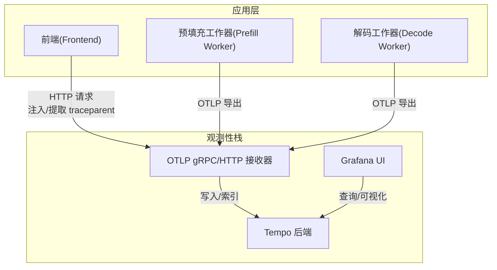
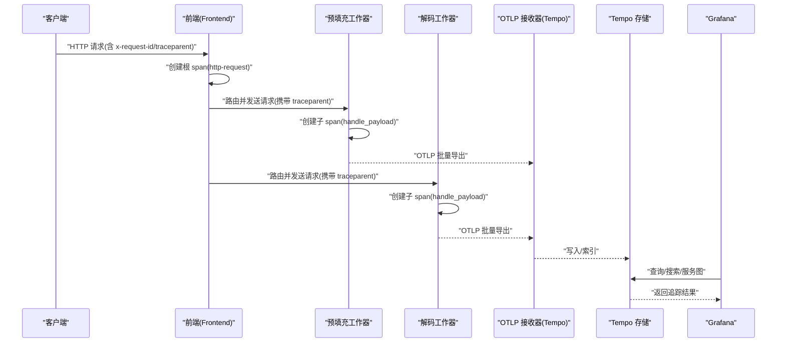
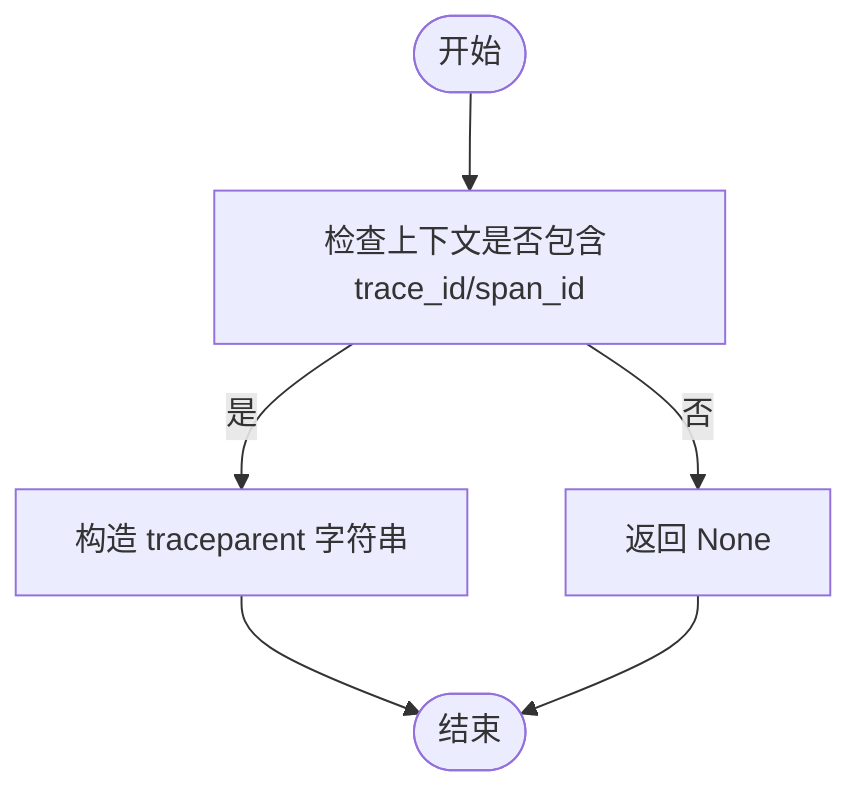
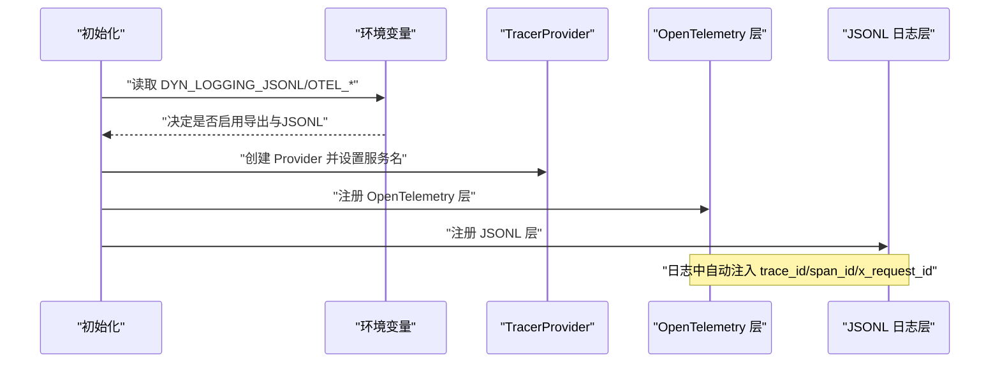
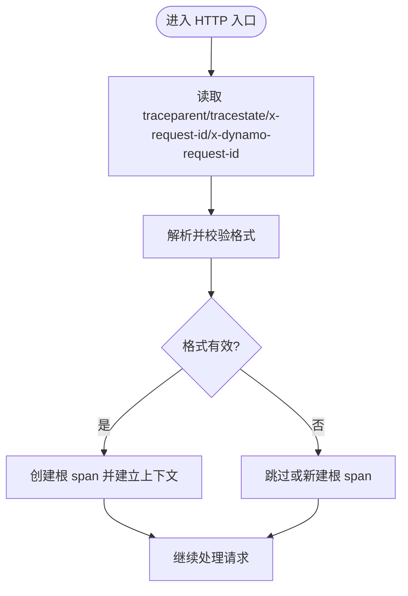
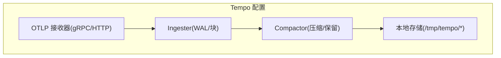
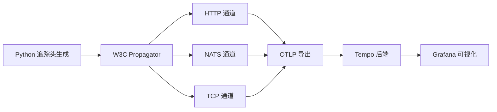

# 分布式链路追踪

<cite>
**本文引用的文件**
- [otel_tracing.py](file://components/src/dynamo/common/utils/otel_tracing.py)
- [tracing.md](file://docs/pages/observability/tracing.md)
- [logging.md](file://docs/pages/observability/logging.md)
- [tempo.yaml](file://deploy/observability/tempo.yaml)
- [tempo-datasource.yml](file://deploy/observability/tempo-datasource.yml)
- [logging.rs](file://lib/runtime/src/logging.rs)
- [http_endpoint.rs](file://lib/runtime/src/pipeline/network/ingress/http_endpoint.rs)
</cite>

## 目录
1. [简介](#简介)
2. [项目结构](#项目结构)
3. [核心组件](#核心组件)
4. [架构总览](#架构总览)
5. [详细组件分析](#详细组件分析)
6. [依赖分析](#依赖分析)
7. [性能考虑](#性能考虑)
8. [故障排查指南](#故障排查指南)
9. [结论](#结论)
10. [附录](#附录)

## 简介
本指南面向在Dynamo中实现分布式链路追踪的工程师与运维人员，系统讲解如何基于OpenTelemetry进行追踪配置（采样策略、span属性、上下文传播），对接Jaeger或Tempo追踪后端（数据存储、查询API与UI），并提供服务间调用、异步任务与错误追踪的最佳实践。同时覆盖性能瓶颈分析方法（调用链分析、延迟热点识别、依赖关系可视化）、追踪数据导出与存储优化、查询性能调优，以及配置模板、查询示例与故障诊断方法。

## 项目结构
Dynamo的分布式追踪能力由以下部分组成：
- Python侧：提供W3C Trace Context格式的追踪头生成工具，便于跨语言组件传播上下文。
- Rust侧：统一的日志与追踪初始化逻辑，支持OTLP批量导出、服务名资源标签、W3C Trace Context传播器、HTTP/NATS/TCP等多通道上下文提取与注入。
- 文档：分布式追踪与日志配置文档，涵盖环境变量、启动步骤、Grafana Tempo查询方式与示例。
- 部署：Tempo后端配置与数据源定义，用于接收OTLP并提供查询与UI。

图表来源
- [tracing.md](file://docs/pages/observability/tracing.md#L1-L215)
- [tempo.yaml](file://deploy/observability/tempo.yaml#L1-L37)
- [tempo-datasource.yml](file://deploy/observability/tempo-datasource.yml#L1-L28)

章节来源
- [tracing.md](file://docs/pages/observability/tracing.md#L1-L215)
- [logging.md](file://docs/pages/observability/logging.md#L1-L269)

## 核心组件
- 追踪头生成工具（Python）：从当前上下文构建W3C Trace Context的traceparent头，用于跨进程/跨语言传播。
- 日志与追踪初始化（Rust）：根据环境变量启用JSONL日志与OTLP导出；创建TracerProvider并注册OpenTelemetry层；解析/注入W3C Trace Context；在HTTP/NATS/TCP通道中提取/注入追踪上下文。
- Tempo后端与数据源：配置OTLP接收端点、本地存储路径、压缩与保留策略，并在Grafana中配置Tempo数据源以支持搜索与图谱展示。

章节来源
- [otel_tracing.py](file://components/src/dynamo/common/utils/otel_tracing.py#L1-L25)
- [logging.rs](file://lib/runtime/src/logging.rs#L135-L996)
- [tempo.yaml](file://deploy/observability/tempo.yaml#L1-L37)
- [tempo-datasource.yml](file://deploy/observability/tempo-datasource.yml#L1-L28)

## 架构总览
下图展示了Dynamo组件如何通过OpenTelemetry与Tempo协作，完成请求在Frontend与Worker之间的跨服务追踪：

图表来源
- [tracing.md](file://docs/pages/observability/tracing.md#L115-L141)
- [logging.rs](file://lib/runtime/src/logging.rs#L317-L351)
- [logging.rs](file://lib/runtime/src/logging.rs#L483-L523)
- [tempo.yaml](file://deploy/observability/tempo.yaml#L7-L14)

## 详细组件分析

### 组件A：追踪头生成与传播（Python）
- 功能要点
  - 从上下文提取trace_id与span_id，生成符合W3C Trace Context规范的traceparent字符串。
  - 当trace_id或span_id缺失时返回空，避免无效头传播。
  - 采样标志位固定为“已采样”，后续可扩展为从当前span继承。
- 使用场景
  - 在HTTP/NATS/TCP等通道中，将traceparent注入到下游请求头，确保跨服务链路连通。
- 注意事项
  - 若上游未携带有效traceparent，应降级为新建根span，避免污染追踪树。

图表来源
- [otel_tracing.py](file://components/src/dynamo/common/utils/otel_tracing.py#L12-L24)

章节来源
- [otel_tracing.py](file://components/src/dynamo/common/utils/otel_tracing.py#L1-L25)

### 组件B：Rust侧追踪初始化与上下文传播
- 追踪初始化
  - 依据环境变量决定是否启用OTLP导出与JSONL日志；若启用导出，则创建OTLP SpanExporter并通过batch处理器导出至指定端点。
  - 设置服务名作为资源标签，保证不同组件可被区分。
- 上下文传播
  - 使用静态W3C Trace Context Propagator实例，避免重复分配。
  - 支持从HTTP、NATS、TCP头部提取traceparent/tracestate，解析为OpenTelemetry Context。
  - 将traceparent注入到NATS与HTTP请求头，确保跨进程传播。
- 日志与追踪关联
  - 在JSONL格式日志中自动注入trace_id、span_id、parent_id、x_request_id、tracestate等字段，便于无后端时快速定位问题。
- 关键函数与职责
  - 初始化与导出控制：[logging.rs](file://lib/runtime/src/logging.rs#L920-L970)
  - W3C Propagator与验证：[logging.rs](file://lib/runtime/src/logging.rs#L1113-L1118)、[logging.rs](file://lib/runtime/src/logging.rs#L146-L156)
  - HTTP头提取：[logging.rs](file://lib/runtime/src/logging.rs#L317-L351)
  - NATS头提取与注入：[logging.rs](file://lib/runtime/src/logging.rs#L483-L523)、[logging.rs](file://lib/runtime/src/logging.rs#L525-L538)
  - 日志字段注入：[logging.rs](file://lib/runtime/src/logging.rs#L1213-L1245)

图表来源
- [logging.rs](file://lib/runtime/src/logging.rs#L920-L970)
- [logging.rs](file://lib/runtime/src/logging.rs#L1213-L1245)

章节来源
- [logging.rs](file://lib/runtime/src/logging.rs#L135-L996)
- [logging.rs](file://lib/runtime/src/logging.rs#L1113-L1118)
- [logging.rs](file://lib/runtime/src/logging.rs#L146-L156)
- [logging.rs](file://lib/runtime/src/logging.rs#L317-L351)
- [logging.rs](file://lib/runtime/src/logging.rs#L483-L538)
- [logging.rs](file://lib/runtime/src/logging.rs#L1213-L1245)

### 组件C：HTTP入口与追踪头采集
- 功能要点
  - 在HTTP入口处收集traceparent、tracestate、x-request-id、x-dynamo-request-id等头部信息，便于后续追踪与日志关联。
- 应用场景
  - 前端接收请求时，先解析traceparent建立父级上下文，再创建根span，确保端到端追踪连贯。

图表来源
- [http_endpoint.rs](file://lib/runtime/src/pipeline/network/ingress/http_endpoint.rs#L276-L302)

章节来源
- [http_endpoint.rs](file://lib/runtime/src/pipeline/network/ingress/http_endpoint.rs#L276-L302)

### 组件D：Tempo后端与数据源配置
- Tempo配置要点
  - OTLP接收器：支持gRPC与HTTP端点，默认监听4317/4318。
  - 存储：本地后端，配置WAL与块目录路径，设置块大小与最大块持续时间。
  - 压缩与保留：按小时窗口压缩，保留策略控制旧块清理。
- Grafana数据源
  - 指定Tempo URL，启用服务图与搜索功能，支持时间偏移与标签查询。

图表来源
- [tempo.yaml](file://deploy/observability/tempo.yaml#L7-L37)

章节来源
- [tempo.yaml](file://deploy/observability/tempo.yaml#L1-L37)
- [tempo-datasource.yml](file://deploy/observability/tempo-datasource.yml#L1-L28)

## 依赖分析
- 组件耦合
  - Python侧的追踪头生成与Rust侧的W3C Propagator相互补充，共同保证跨语言传播一致性。
  - HTTP/NATS/TCP三种通道均支持traceparent/tracestate提取与注入，降低传播复杂度。
- 外部依赖
  - OTLP gRPC/HTTP：与Tempo后端对接的标准协议。
  - Grafana：提供查询、搜索与服务图可视化能力。
- 潜在风险
  - 未正确传递traceparent会导致追踪树断裂。
  - JSONL日志开启但未导出OTLP时，仅能离线分析，无法在Grafana中检索。

图表来源
- [otel_tracing.py](file://components/src/dynamo/common/utils/otel_tracing.py#L12-L24)
- [logging.rs](file://lib/runtime/src/logging.rs#L317-L351)
- [logging.rs](file://lib/runtime/src/logging.rs#L483-L538)
- [tempo.yaml](file://deploy/observability/tempo.yaml#L7-L14)

章节来源
- [logging.rs](file://lib/runtime/src/logging.rs#L1113-L1118)
- [logging.rs](file://lib/runtime/src/logging.rs#L317-L351)
- [logging.rs](file://lib/runtime/src/logging.rs#L483-L538)
- [tempo.yaml](file://deploy/observability/tempo.yaml#L7-L14)

## 性能考虑
- 调用链分析
  - 利用Grafana Tempo的“Search”与“TraceQL”对比查看根span与子span耗时，识别长尾与阻塞点。
  - 结合“服务图”观察依赖关系与调用频率，定位热点服务。
- 延迟热点识别
  - 关注“总时长=忙碌时长+空闲时长”的关系，空闲时长占比高通常意味着等待（网络/队列/锁）。
  - 对比预填充与解码阶段的耗时，评估拆分部署收益。
- 依赖关系可视化
  - 使用Grafana服务图与节点图，结合标签过滤（如服务名、状态码、x-request-id）快速定位异常路径。
- 存储与导出优化
  - 调整Tempo的块大小与最大块持续时间，平衡内存占用与查询性能。
  - 控制OTLP批量导出批次大小与间隔，避免峰值时段对后端造成压力。
- 查询性能调优
  - 使用时间范围与标签组合缩小查询范围；优先使用服务名与span名称过滤。
  - 合理设置保留策略，避免历史数据过多影响查询效率。

## 故障排查指南
- 常见问题
  - 未看到trace_id/span_id：确认DYN_LOGGING_JSONL已启用，且日志输出为JSONL格式。
  - 追踪未显示在Grafana：检查OTEL_EXPORT_ENABLED与OTEL_EXPORTER_OTLP_TRACES_ENDPOINT是否正确，确认Tempo可达。
  - 跨服务链路断裂：检查HTTP/NATS/TCP通道是否正确注入/提取traceparent与tracestate。
  - 自定义请求ID无效：确认请求头x-request-id是否传入，且在日志中可见。
- 定位步骤
  - 在前端与各Worker上同时开启JSONL与OTLP导出，发送一次完整请求，核对同一trace_id贯穿所有组件。
  - 使用Grafana的“Search”按服务名、span名称与x-request-id筛选，查看火焰图与服务图。
  - 若仅需离线分析，可在关闭OTEL_EXPORT_ENABLED的情况下，仅启用JSONL，通过日志字段定位问题。

章节来源
- [logging.md](file://docs/pages/observability/logging.md#L97-L138)
- [tracing.md](file://docs/pages/observability/tracing.md#L113-L141)

## 结论
Dynamo通过OpenTelemetry与Tempo实现了端到端的分布式追踪，配合Grafana可完成从调用链到服务图的全链路可观测。建议在生产环境中启用OTLP导出与服务名标注，合理配置Tempo存储与保留策略，并结合服务图与TraceQL进行性能分析与故障定位。

## 附录

### A. OpenTelemetry集成配置清单
- 环境变量
  - DYN_LOGGING_JSONL：启用JSONL日志（必需于追踪）
  - OTEL_EXPORT_ENABLED：启用OTLP导出
  - OTEL_EXPORTER_OTLP_TRACES_ENDPOINT：OTLP gRPC端点（默认4317）
  - OTEL_SERVICE_NAME：服务名（如dynamo-frontend、dynamo-worker-*）
- Python侧
  - 使用追踪头生成工具将traceparent注入到HTTP/NATS/TCP请求头。
- Rust侧
  - 初始化TracerProvider并注册OpenTelemetry层；在HTTP/NATS/TCP入口提取traceparent/tracestate；在日志中注入trace_id/span_id/x_request_id等字段。

章节来源
- [tracing.md](file://docs/pages/observability/tracing.md#L18-L26)
- [logging.md](file://docs/pages/observability/logging.md#L15-L27)
- [otel_tracing.py](file://components/src/dynamo/common/utils/otel_tracing.py#L12-L24)
- [logging.rs](file://lib/runtime/src/logging.rs#L920-L970)

### B. Tempo后端配置模板
- 接收器
  - gRPC: 0.0.0.0:4317
  - HTTP: 0.0.0.0:4318
- 存储
  - 后端: local
  - WAL路径: /tmp/tempo/wal
  - 块路径: /tmp/tempo/blocks
- 压缩与保留
  - 压缩窗口: 1小时
  - 块保留: 1小时
  - 已压缩块保留: 10分钟

章节来源
- [tempo.yaml](file://deploy/observability/tempo.yaml#L7-L37)

### C. Grafana Tempo查询示例
- 搜索方式
  - 选择数据源为Tempo
  - 使用“Search”标签过滤：服务名、span名称、x-request-id
- 示例查询
  - 按服务名过滤：dynamo-frontend
  - 按span名称过滤：http-request、handle_payload
  - 按自定义请求ID过滤：x_request_id=your-id

章节来源
- [tracing.md](file://docs/pages/observability/tracing.md#L130-L141)

### D. 最佳实践清单
- 服务间调用
  - 在HTTP/NATS/TCP请求头中始终注入traceparent/tracestate，确保链路连通。
- 异步任务
  - 在消息发布前注入trace上下文，在消费端恢复上下文，保持跨任务追踪一致。
- 错误追踪
  - 为错误事件设置明确的span名称与标签（如status、error.type），便于在Grafana中筛选与告警。
- 性能分析
  - 使用服务图识别依赖热点；结合TraceQL统计P50/P95延迟与错误率。
- 数据导出与存储
  - 合理设置OTLP批量参数与Tempo块参数，平衡吞吐与查询性能。
- 故障诊断
  - 优先使用x-request-id串联一次完整请求；若无后端，启用JSONL离线分析。