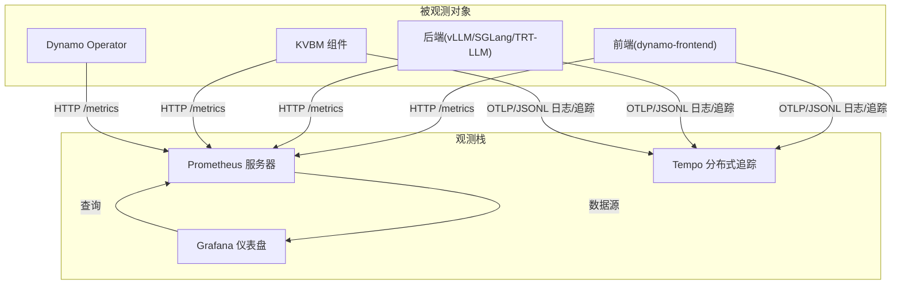
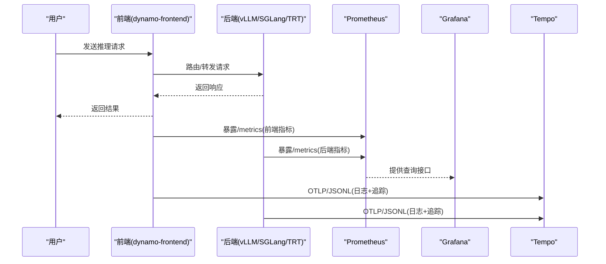
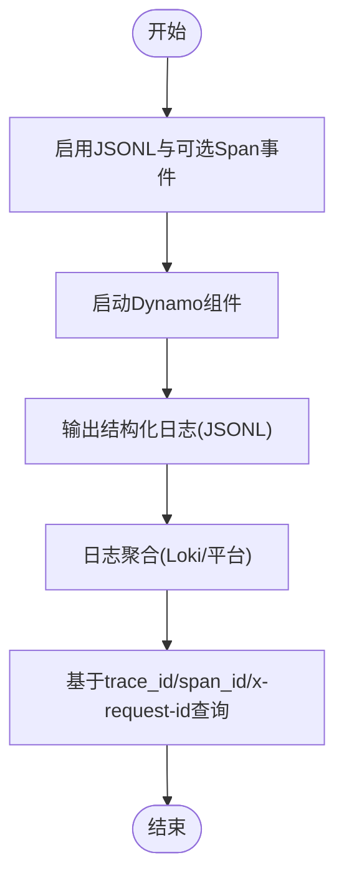
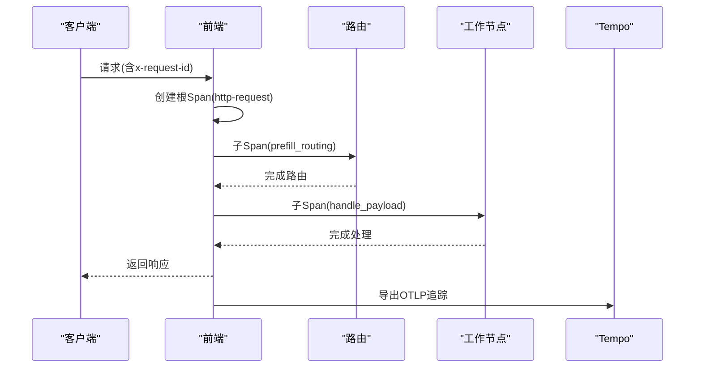
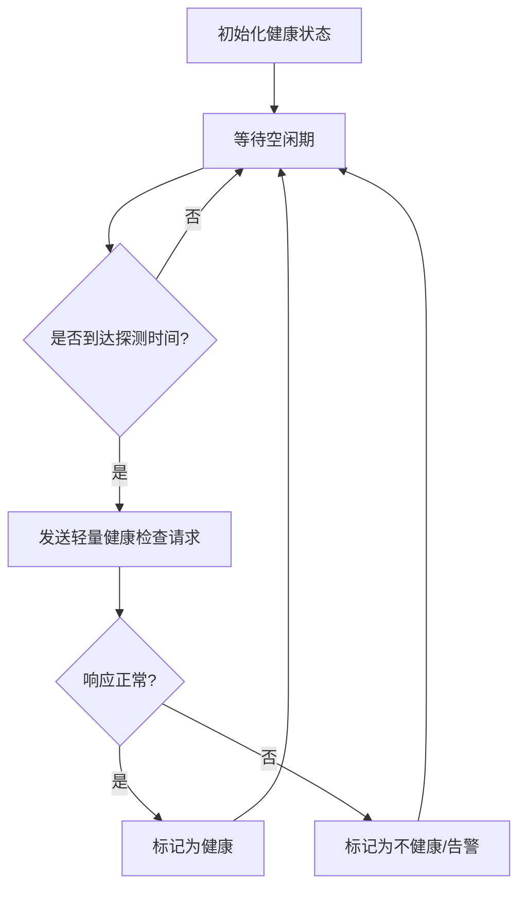
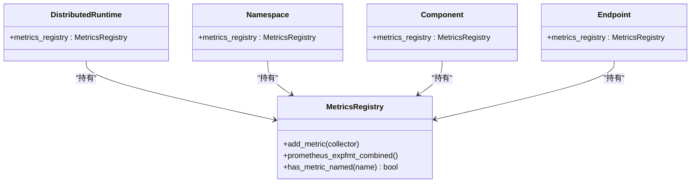
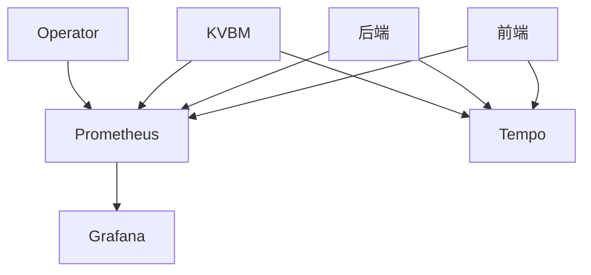

# 性能监控与观测性

<cite>
**本文引用的文件**
- [prometheus.yml](file://deploy/observability/prometheus.yml)
- [grafana-datasources.yml](file://deploy/observability/grafana-datasources.yml)
- [tempo.yaml](file://deploy/observability/tempo.yaml)
- [dynamo.json](file://deploy/observability/grafana_dashboards/dynamo.json)
- [kvbm.json](file://deploy/observability/grafana_dashboards/kvbm.json)
- [dcgm-metrics.json](file://deploy/observability/grafana_dashboards/dcgm-metrics.json)
- [dynamo-operator.json](file://deploy/observability/grafana_dashboards/dynamo-operator.json)
- [dashboard-providers.yml](file://deploy/observability/grafana_dashboards/dashboard-providers.yml)
- [metrics.md](file://docs/pages/observability/metrics.md)
- [logging.md](file://docs/pages/observability/logging.md)
- [tracing.md](file://docs/pages/observability/tracing.md)
- [prometheus-grafana.md](file://docs/pages/observability/prometheus-grafana.md)
- [health-checks.md](file://docs/pages/observability/health-checks.md)
- [system_health.rs](file://lib/runtime/src/system_health.rs)
- [health_check.rs](file://lib/runtime/src/health_check.rs)
- [metrics.rs](file://lib/runtime/src/metrics.rs)
- [logging.rs](file://lib/runtime/src/logging.rs)
</cite>

## 目录
1. [简介](#简介)
2. [项目结构](#项目结构)
3. [核心组件](#核心组件)
4. [架构总览](#架构总览)
5. [详细组件分析](#详细组件分析)
6. [依赖关系分析](#依赖关系分析)
7. [性能考量](#性能考量)
8. [故障排查指南](#故障排查指南)
9. [结论](#结论)
10. [附录](#附录)

## 简介
本指南面向Dynamo系统的性能监控与观测性建设，覆盖指标采集与可视化（Prometheus + Grafana）、日志管理与分析（结构化日志、日志聚合与查询优化）、分布式链路追踪（OpenTelemetry + Tempo）、健康检查与告警、性能基准测试与容量规划等主题。文档以仓库中已有的配置与文档为依据，提供可操作的实施建议与最佳实践。

## 项目结构
Dynamo的可观测性由“观测栈”（Prometheus、Grafana、Tempo）与“被观测对象”（前端、后端、KVBM等组件）组成。观测栈通过Prometheus抓取各组件暴露的/metrics端点，Grafana消费Prometheus数据源并加载预置仪表板；同时，Dynamo支持结构化日志与OpenTelemetry链路追踪，可将日志与追踪统一接入Loki/Tempo进行查询与可视化。

图示来源
- [prometheus.yml](file://deploy/observability/prometheus.yml#L20-L62)
- [grafana-datasources.yml](file://deploy/observability/grafana-datasources.yml#L18-L24)
- [tempo.yaml](file://deploy/observability/tempo.yaml#L1-L37)

章节来源
- [prometheus.yml](file://deploy/observability/prometheus.yml#L1-L63)
- [grafana-datasources.yml](file://deploy/observability/grafana-datasources.yml#L1-L24)
- [tempo.yaml](file://deploy/observability/tempo.yaml#L1-L37)

## 核心组件
- 指标系统：Dynamo在分布式运行时框架下提供统一指标API，默认在系统状态端口暴露Prometheus格式指标，涵盖前端请求、处理耗时、字节流量、引擎指标等。
- 日志系统：支持文本与JSONL两种格式，启用JSONL后可在日志中注入trace_id/span_id，便于与追踪关联；可选开启Span事件记录。
- 追踪系统：基于OpenTelemetry，支持将追踪导出到Tempo并通过Grafana Explore查看；亦可在本地仅记录日志中的追踪上下文。
- 健康检查：提供/health与/liveness端点，支持按端点维度的就绪态控制与“金丝雀”主动健康检查（空闲期探测）。

章节来源
- [metrics.md](file://docs/pages/observability/metrics.md#L1-L224)
- [logging.md](file://docs/pages/observability/logging.md#L1-L269)
- [tracing.md](file://docs/pages/observability/tracing.md#L1-L215)
- [health-checks.md](file://docs/pages/observability/health-checks.md#L1-L351)

## 架构总览
下图展示Dynamo在单机演示场景下的观测性架构：前端与后端组件分别在不同端口暴露指标；Prometheus按配置周期抓取；Grafana通过Prometheus数据源加载多块仪表板；同时，Dynamo可输出结构化日志与追踪，供Loki/Tempo消费。

图示来源
- [prometheus.yml](file://deploy/observability/prometheus.yml#L39-L49)
- [prometheus-grafana.md](file://docs/pages/observability/prometheus-grafana.md#L30-L76)
- [tracing.md](file://docs/pages/observability/tracing.md#L27-L61)

## 详细组件分析

### 指标采集与可视化（Prometheus + Grafana）
- 抓取配置：Prometheus通过静态配置抓取前端、后端、KVBM、NATS、etcd、DCGM等目标，抓取间隔按组件特性设置。
- 数据源：Grafana使用Prometheus作为默认数据源，自动发现并加载仪表板。
- 预置仪表板：
  - Dynamo仪表板：展示前端请求速率、首Token耗时、Inter-token延迟、请求时延、输入/输出序列长度、GPU利用率与功耗等。
  - KVBM仪表板：展示缓存命中率、跨设备/主机/磁盘的块迁移等。
  - DCGM仪表板：展示GPU利用率、显存占用、温度、功耗、时钟频率、引擎活动、PCIe带宽等。
  - Dynamo Operator仪表板：展示控制器的协调速率、持续时间、错误数以及资源库存状态等。

图示来源
- [prometheus.yml](file://deploy/observability/prometheus.yml#L20-L62)
- [grafana-datasources.yml](file://deploy/observability/grafana-datasources.yml#L18-L24)
- [dynamo.json](file://deploy/observability/grafana_dashboards/dynamo.json#L1-L120)
- [kvbm.json](file://deploy/observability/grafana_dashboards/kvbm.json#L1-L140)
- [dcgm-metrics.json](file://deploy/observability/grafana_dashboards/dcgm-metrics.json#L108-L122)
- [dynamo-operator.json](file://deploy/observability/grafana_dashboards/dynamo-operator.json#L120-L128)

章节来源
- [prometheus.yml](file://deploy/observability/prometheus.yml#L1-L63)
- [grafana-datasources.yml](file://deploy/observability/grafana-datasources.yml#L1-L24)
- [dashboard-providers.yml](file://deploy/observability/grafana_dashboards/dashboard-providers.yml#L18-L29)
- [dynamo.json](file://deploy/observability/grafana_dashboards/dynamo.json#L1-L120)
- [kvbm.json](file://deploy/observability/grafana_dashboards/kvbm.json#L1-L140)
- [dcgm-metrics.json](file://deploy/observability/grafana_dashboards/dcgm-metrics.json#L108-L122)
- [dynamo-operator.json](file://deploy/observability/grafana_dashboards/dynamo-operator.json#L120-L128)

### 日志管理与分析（结构化日志、日志聚合与查询优化）
- 结构化日志：启用JSONL后，日志包含trace_id、span_id等字段，便于与追踪关联；可选开启Span事件记录。
- 日志聚合：可通过Grafana Loki或Kubernetes日志采集方案进行聚合与查询。
- 查询优化：利用日志中的trace_id、span_id与x-request-id进行跨服务关联查询；在大规模日志场景下建议使用索引字段与过滤条件。

图示来源
- [logging.md](file://docs/pages/observability/logging.md#L15-L27)
- [logging.md](file://docs/pages/observability/logging.md#L97-L119)
- [logging.md](file://docs/pages/observability/logging.md#L226-L249)

章节来源
- [logging.md](file://docs/pages/observability/logging.md#L1-L269)

### 分布式链路追踪（OpenTelemetry + Tempo）
- 追踪导出：通过OTLP协议将追踪导出至Tempo；Grafana Explore支持按服务名、Span名、标签（如x-request-id）检索。
- 追踪内容：前端根Span、路由Span、后端处理Span等，Span包含时长、忙碌/空闲时间等度量。
- 本地调试：无需导出也可在日志中看到trace_id/span_id，便于快速定位问题。

图示来源
- [tracing.md](file://docs/pages/observability/tracing.md#L18-L26)
- [tracing.md](file://docs/pages/observability/tracing.md#L130-L142)
- [logging.md](file://docs/pages/observability/logging.md#L150-L210)

章节来源
- [tracing.md](file://docs/pages/observability/tracing.md#L1-L215)
- [logging.md](file://docs/pages/observability/logging.md#L1-L269)

### 健康检查机制、告警与故障检测
- 健康端点：/health与/liveness，前端与后端均可提供；后端可按端点集合控制就绪态。
- 金丝雀健康检查：在无活跃流量的空闲期内定期探测后端端点，超时则标记为不健康；支持在Kubernetes中自动启用。
- 告警配置：结合Grafana与Prometheus规则，对关键指标（如请求失败率、P95时延、队列长度、GPU异常）设置阈值与告警。

图示来源
- [health-checks.md](file://docs/pages/observability/health-checks.md#L225-L286)
- [system_health.rs](file://lib/runtime/src/system_health.rs#L36-L96)
- [health_check.rs](file://lib/runtime/src/health_check.rs#L529-L551)

章节来源
- [health-checks.md](file://docs/pages/observability/health-checks.md#L1-L351)
- [system_health.rs](file://lib/runtime/src/system_health.rs#L36-L96)
- [health_check.rs](file://lib/runtime/src/health_check.rs#L529-L551)

### 自定义指标定义与扩展
- 指标层次：Dynamo指标API在分布式运行时框架下提供分层注册能力（全局/命名空间/组件/端点），便于按粒度收集与聚合。
- 指标类型：计数器、直方图、仪表盘等；Dynamo内置大量与请求处理、序列长度、吞吐、字节流量、引擎指标相关的指标。
- 暴露方式：统一在系统状态端口的/metrics路径以Prometheus文本格式输出，带有命名空间、组件、端点等标签。

图示来源
- [metrics.rs](file://lib/runtime/src/metrics.rs#L487-L538)
- [metrics.rs](file://lib/runtime/src/metrics.rs#L605-L630)
- [metrics.rs](file://lib/runtime/src/metrics.rs#L880-L895)
- [metrics.md](file://docs/pages/observability/metrics.md#L90-L100)

章节来源
- [metrics.md](file://docs/pages/observability/metrics.md#L1-L224)
- [metrics.rs](file://lib/runtime/src/metrics.rs#L487-L538)
- [metrics.rs](file://lib/runtime/src/metrics.rs#L605-L630)
- [metrics.rs](file://lib/runtime/src/metrics.rs#L880-L895)

### 性能基准测试、SLA监控与容量规划
- 基准测试：仓库提供多类基准脚本与工具（吞吐、延迟、图像/视频等多模态），可用于评估不同配置与部署模式下的性能表现。
- SLA监控：结合Prometheus指标与Grafana仪表板，对P95/P99时延、成功率、队列长度等关键SLA指标进行持续观测。
- 容量规划：通过前端/后端指标与GPU指标（DCGM）推断资源瓶颈，结合历史趋势与峰值预测制定扩容策略。

章节来源
- [prometheus-grafana.md](file://docs/pages/observability/prometheus-grafana.md#L1-L113)
- [metrics.md](file://docs/pages/observability/metrics.md#L1-L224)
- [dcgm-metrics.json](file://deploy/observability/grafana_dashboards/dcgm-metrics.json#L108-L122)

## 依赖关系分析
- 组件耦合：前端与后端通过消息总线/网络协议通信，指标与日志/追踪均独立于业务逻辑，降低耦合度。
- 外部依赖：Prometheus负责指标抓取与存储；Grafana提供可视化与告警；Tempo负责追踪导出与检索；Loki用于日志聚合（可选）。
- 可观测性配置：Prometheus抓取目标、Grafana数据源与仪表板、Tempo导出端点均在部署目录中集中管理。

图示来源
- [prometheus.yml](file://deploy/observability/prometheus.yml#L20-L62)
- [grafana-datasources.yml](file://deploy/observability/grafana-datasources.yml#L18-L24)
- [tempo.yaml](file://deploy/observability/tempo.yaml#L1-L37)

章节来源
- [prometheus.yml](file://deploy/observability/prometheus.yml#L1-L63)
- [grafana-datasources.yml](file://deploy/observability/grafana-datasources.yml#L1-L24)
- [tempo.yaml](file://deploy/observability/tempo.yaml#L1-L37)

## 性能考量
- 抓取间隔与样本保留：根据组件负载调整抓取间隔，避免过密导致Prometheus压力过大；合理设置样本保留时长以平衡存储成本与回溯需求。
- 指标基数控制：避免动态标签爆炸（如过多唯一值），优先使用常量标签与有限枚举值，减少Series数量。
- 追踪采样：在高并发场景下适度降低追踪采样率，确保可观测性与性能的平衡。
- 日志级别与过滤：生产环境建议使用INFO/WARN级别，必要时开启Span事件以减少噪声。

## 故障排查指南
- 指标不可见：检查Prometheus targets状态、抓取间隔与目标可达性；确认组件/metrics端口正确且未被防火墙阻断。
- 追踪缺失：确认已启用JSONL与OTEL导出，检查OTLP端点可达性；在Grafana Explore中按服务名/标签检索。
- 健康检查异常：核对/health与/liveness端点返回状态；检查金丝雀探测等待时间与超时设置；关注后端端点就绪要求。
- 日志关联困难：确保日志中包含trace_id/span_id/x-request-id；在查询界面按这些字段过滤与关联。

章节来源
- [prometheus-grafana.md](file://docs/pages/observability/prometheus-grafana.md#L94-L107)
- [tracing.md](file://docs/pages/observability/tracing.md#L130-L152)
- [health-checks.md](file://docs/pages/observability/health-checks.md#L330-L345)
- [logging.md](file://docs/pages/observability/logging.md#L97-L119)

## 结论
Dynamo提供了完善的可观测性基础设施：统一的指标体系、结构化日志与OpenTelemetry追踪、健康检查与告警机制，配合丰富的Grafana仪表板，能够有效支撑从性能调优到故障定位的全链路观测。建议在生产环境中结合SLA监控与容量规划工具，持续迭代观测策略与告警阈值，保障系统稳定与高性能。

## 附录
- 仪表板模板
  - Dynamo仪表板：前端请求速率、首Token/Inter-token延迟、请求时延、序列长度、GPU指标等。
  - KVBM仪表板：缓存命中率、跨设备/主机/磁盘块迁移。
  - DCGM仪表板：GPU利用率、显存、温度、功耗、时钟频率、引擎活动、PCIe带宽。
  - Dynamo Operator仪表板：协调速率/时延/错误、Webhook请求与拒绝、资源库存状态。
- 告警规则示例（概念性）
  - 请求失败率 > 阈值（例如5分钟内错误率>1%）
  - P95请求时延 > 阈值（例如>2s）
  - 队列长度持续>阈值（例如>100）
  - GPU利用率/温度/功耗异常（例如>90%、>85°C、>300W）
  - 健康检查超时/失败（例如连续3次超时）
- 运维最佳实践
  - 明确职责边界：前端/后端/Operator分别承担不同观测职责，避免重复与遗漏。
  - 分层治理：按命名空间/组件/端点分层收集指标，便于定位与归因。
  - 渐进增强：先建立基础指标与告警，再逐步引入更细粒度的追踪与日志分析。
  - 安全与合规：限制/metrics访问权限，遵循最小暴露原则；日志脱敏与合规存储。