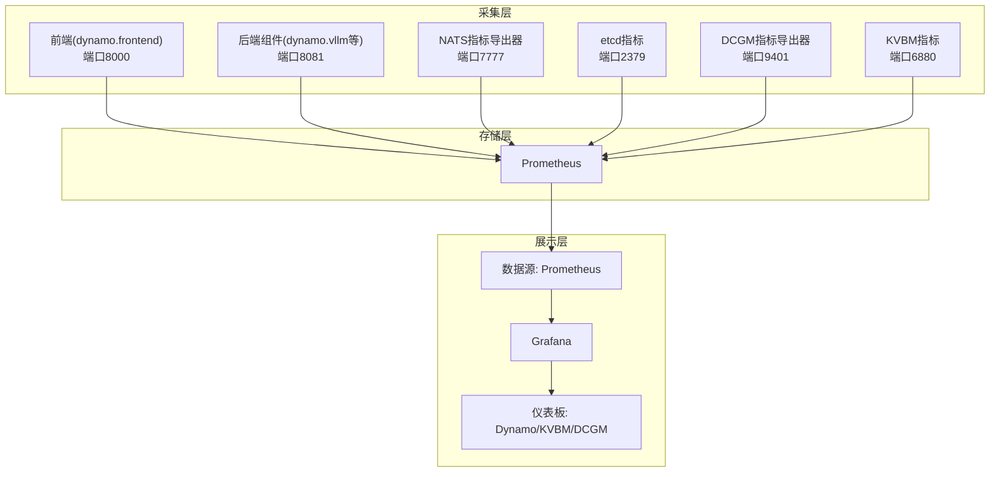
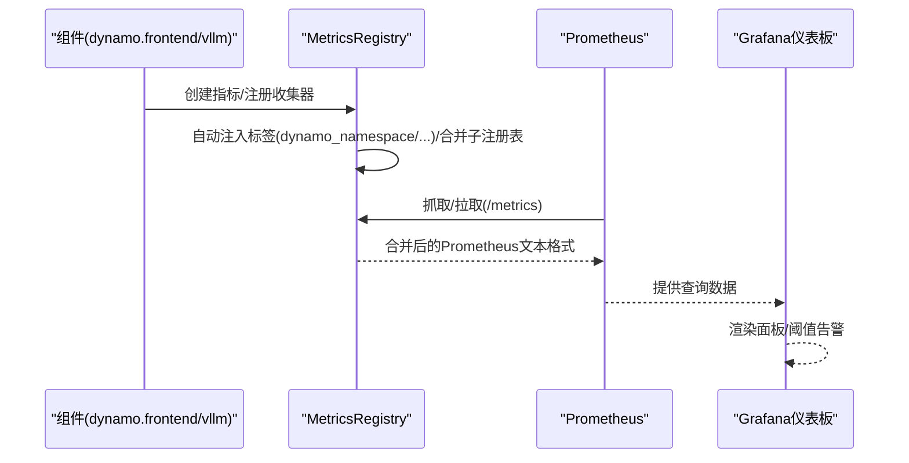
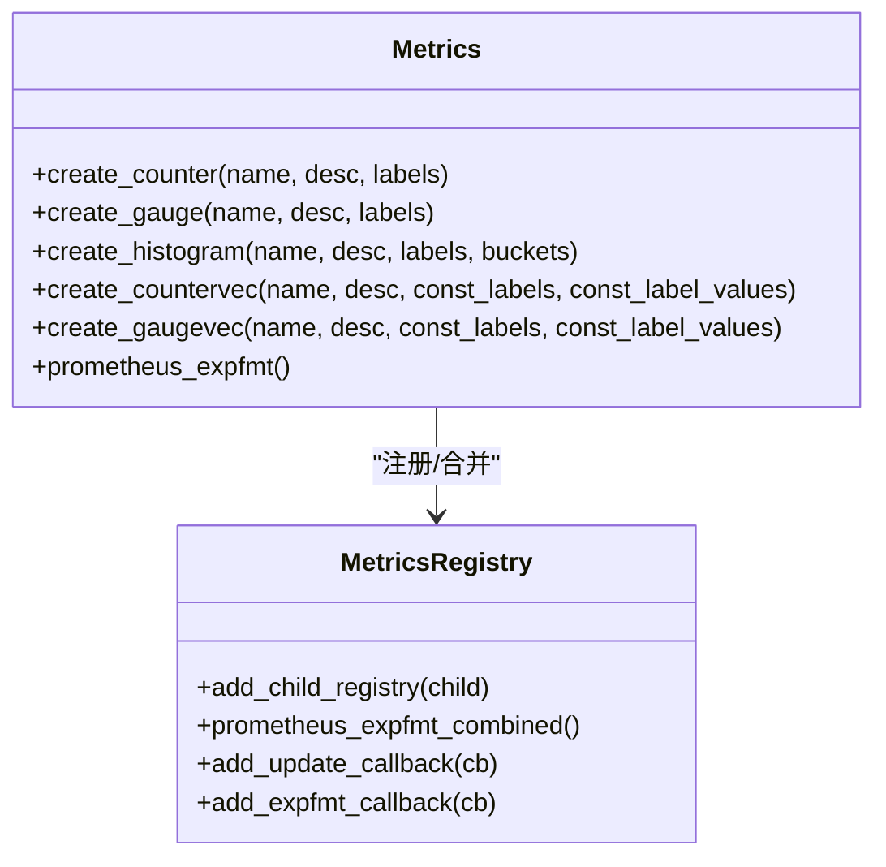
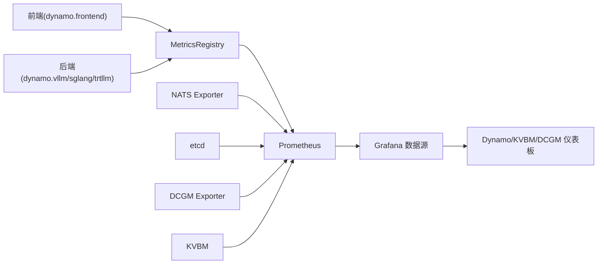

# 指标收集与可视化

<cite>
**本文引用的文件**
- [prometheus.yml](file://deploy/observability/prometheus.yml)
- [grafana-datasources.yml](file://deploy/observability/grafana-datasources.yml)
- [dashboard-providers.yml](file://deploy/observability/grafana_dashboards/dashboard-providers.yml)
- [dynamo.json](file://deploy/observability/grafana_dashboards/dynamo.json)
- [kvbm.json](file://deploy/observability/grafana_dashboards/kvbm.json)
- [dcgm-metrics.json](file://deploy/observability/grafana_dashboards/dcgm-metrics.json)
- [metrics.md](file://docs/pages/observability/metrics.md)
- [metrics-developer-guide.md](file://docs/pages/observability/metrics-developer-guide.md)
- [metrics.rs](file://lib/runtime/src/metrics.rs)
- [prometheus.py（planner）](file://components/src/dynamo/planner/utils/prometheus.py)
- [prometheus.py（common）](file://components/src/dynamo/common/utils/prometheus.py)
- [test_prometheus_exposition_format_injection.py](file://tests/serve/test_prometheus_exposition_format_injection.py)
- [metrics.go](file://deploy/operator/internal/observability/metrics.go)
</cite>

## 目录
1. [简介](#简介)
2. [项目结构](#项目结构)
3. [核心组件](#核心组件)
4. [架构总览](#架构总览)
5. [详细组件分析](#详细组件分析)
6. [依赖关系分析](#依赖关系分析)
7. [性能考虑](#性能考虑)
8. [故障排查指南](#故障排查指南)
9. [结论](#结论)
10. [附录](#附录)

## 简介
本指南面向在Dynamo平台中进行指标收集与可视化的工程实践，覆盖以下关键主题：
- Prometheus指标采集配置：自定义指标定义、指标标签设计、指标暴露机制
- Grafana仪表板配置：预构建仪表板模板、自定义面板创建、数据源连接
- 指标分类体系：系统指标、业务指标、性能指标
- 指标查询语法、聚合函数与阈值设置
- 指标导出格式、数据保留策略与存储优化
- 常见监控场景的指标配置示例与最佳实践

## 项目结构
Dynamo的可观测性由“采集-存储-展示”三层组成：
- 采集层：各组件通过内置metrics API暴露Prometheus指标，或通过外部exporter（如NATS、etcd、DCGM）暴露硬件/中间件指标
- 存储层：Prometheus负责抓取与持久化
- 展示层：Grafana加载Prometheus数据源，渲染预置与自定义仪表板

图表来源
- [prometheus.yml](file://deploy/observability/prometheus.yml#L20-L62)
- [grafana-datasources.yml](file://deploy/observability/grafana-datasources.yml#L18-L24)
- [dashboard-providers.yml](file://deploy/observability/grafana_dashboards/dashboard-providers.yml#L18-L29)

章节来源
- [prometheus.yml](file://deploy/observability/prometheus.yml#L16-L62)
- [grafana-datasources.yml](file://deploy/observability/grafana-datasources.yml#L18-L24)
- [dashboard-providers.yml](file://deploy/observability/grafana_dashboards/dashboard-providers.yml#L18-L29)

## 核心组件
- 指标暴露与命名规范
  - Dynamo组件通过统一的metrics API自动暴露指标，指标前缀为dynamo_*，并带有自动标签（dynamo_namespace、dynamo_component、dynamo_endpoint），便于分层聚合与过滤
  - 文档明确了可用指标类别与端口，默认前端端口8000，后端组件默认8081
- 指标采集配置
  - Prometheus通过静态配置抓取各目标，包含前端、后端、NATS、etcd、DCGM、KVBM等
- 可视化与仪表板
  - Grafana数据源指向Prometheus；仪表板通过文件提供器从目录加载，包含Dynamo、KVBM、DCGM等预置模板

章节来源
- [metrics.md](file://docs/pages/observability/metrics.md#L61-L156)
- [prometheus.yml](file://deploy/observability/prometheus.yml#L20-L62)
- [grafana-datasources.yml](file://deploy/observability/grafana-datasources.yml#L18-L24)
- [dashboard-providers.yml](file://deploy/observability/grafana_dashboards/dashboard-providers.yml#L18-L29)

## 架构总览
下图展示了从组件到Prometheus再到Grafana的完整链路，以及指标的自动标签注入与合并输出机制。

图表来源
- [metrics.rs](file://lib/runtime/src/metrics.rs#L534-L539)
- [metrics.rs](file://lib/runtime/src/metrics.rs#L724-L830)
- [prometheus.yml](file://deploy/observability/prometheus.yml#L20-L62)
- [grafana-datasources.yml](file://deploy/observability/grafana-datasources.yml#L18-L24)

章节来源
- [metrics.rs](file://lib/runtime/src/metrics.rs#L534-L539)
- [metrics.rs](file://lib/runtime/src/metrics.rs#L724-L830)

## 详细组件分析

### Prometheus采集配置
- 抓取目标
  - 前端：host.docker.internal:8000（dynamo.frontend）
  - 后端：host.docker.internal:8081（dynamo.vllm/sglang/trtllm等）
  - NATS：nats-prometheus-exporter:7777
  - etcd：etcd-server:2379
  - DCGM：dcgm-exporter:9401
  - KVBM：host.docker.internal:6880
- 抓取间隔
  - 全局抓取间隔10s，部分目标（如NATS、etcd、DCGM、KVBM）使用更短间隔以提升实时性
- 注意事项
  - 若修改后端抓取间隔，请同步调整对应组件中的MAX_DELAY等参数

章节来源
- [prometheus.yml](file://deploy/observability/prometheus.yml#L16-L62)

### Grafana数据源与仪表板
- 数据源
  - Grafana通过HTTP访问Prometheus（http://prometheus:9090），并设为默认数据源
- 仪表板提供器
  - 从本地路径加载仪表板，支持按文件夹结构组织
- 预置仪表板
  - Dynamo仪表板：包含前端请求速率、首Token耗时、请求时延、输入/输出序列长度、GPU利用率与功耗等
  - KVBM仪表板：缓存命中率、跨设备/主机/磁盘的块迁移与卸载/上载
  - DCGM仪表板：GPU利用率、显存占用、温度、功耗、时钟频率、引擎活动、PCIe带宽等

章节来源
- [grafana-datasources.yml](file://deploy/observability/grafana-datasources.yml#L18-L24)
- [dashboard-providers.yml](file://deploy/observability/grafana_dashboards/dashboard-providers.yml#L18-L29)
- [dynamo.json](file://deploy/observability/grafana_dashboards/dynamo.json#L1-L120)
- [kvbm.json](file://deploy/observability/grafana_dashboards/kvbm.json#L1-L140)
- [dcgm-metrics.json](file://deploy/observability/grafana_dashboards/dcgm-metrics.json#L1-L120)

### 指标分类体系
- 系统指标
  - 前端/后端运行时指标：请求总量、并发请求数、队列长度、请求时长、吞吐字节数、进程运行时长
  - 硬件/中间件指标：GPU利用率、温度、功耗、显存占用、NATS/etcd状态
- 业务指标
  - 令牌生成速率、首Token时间、平均/交互式Token耗时、输入/输出序列长度
  - 模型配置指标：上下文长度、KV块大小、最大批处理令牌数、最大并发序列数
- 性能指标
  - KVBM缓存命中率、跨介质块迁移/卸载/上载速率

章节来源
- [metrics.md](file://docs/pages/observability/metrics.md#L81-L175)
- [dynamo.json](file://deploy/observability/grafana_dashboards/dynamo.json#L106-L210)
- [kvbm.json](file://deploy/observability/grafana_dashboards/kvbm.json#L120-L320)
- [dcgm-metrics.json](file://deploy/observability/grafana_dashboards/dcgm-metrics.json#L108-L433)

### 指标查询语法、聚合与阈值
- 查询语法与聚合
  - 使用PromQL对计数器求增量（rate）、直方图求均值（sum/count）、直方图分位数（histogram_quantile）
  - 示例（来自预置仪表板）：
    - 前端请求速率：rate(dynamo_frontend_requests_total[30s])
    - 平均首Token耗时：1000*(sum_over_time(dynamo_frontend_time_to_first_token_seconds_sum[1m]) / sum_over_time(dynamo_frontend_time_to_first_token_seconds_count[1m]))
    - P95重调度时延：histogram_quantile(0.95, sum by (resource_type, le) (rate(..._duration_seconds_bucket[5m])))
- 阈值设置
  - 仪表板中可为面板设置阈值（如红色阈值），用于告警示意
- 过滤与前缀控制
  - 可通过前缀过滤仅保留特定指标族（如vllm:、trtllm_），或排除某些前缀

章节来源
- [dynamo.json](file://deploy/observability/grafana_dashboards/dynamo.json#L106-L210)
- [dynamo-operator.json](file://deploy/observability/grafana_dashboards/dynamo-operator.json#L113-L218)
- [test_prometheus_exposition_format_injection.py](file://tests/serve/test_prometheus_exposition_format_injection.py#L103-L178)

### 指标导出格式、保留策略与存储优化
- 导出格式
  - Dynamo指标以Prometheus文本格式暴露，包含HELP/TYPE注释与系列标签
- 保留策略与存储优化
  - Prometheus配置文件中定义了全局抓取与评估间隔，可根据负载调优
  - 对高频指标（如NATS、etcd、DCGM、KVBM）采用较短抓取间隔以提升实时性
  - 通过前缀过滤与标签注入减少无关指标传输，降低网络与存储开销

章节来源
- [metrics.md](file://docs/pages/observability/metrics.md#L61-L80)
- [prometheus.yml](file://deploy/observability/prometheus.yml#L16-L18)

### 自定义指标开发与标签设计
- 指标类型与创建
  - 支持Counter/Gauge/Histogram及其向量变体；可指定常量标签与动态标签
  - 指标名称与标签名遵循Prometheus命名规范，避免冲突
- 自动标签注入
  - 自动注入dynamo_namespace、dynamo_component、dynamo_endpoint三类标签，层级来源于DistributedRuntime/命名空间/组件/端点
- 标签注入与过滤
  - 通过工具函数实现标签注入与前缀过滤，确保输出符合预期

图表来源
- [metrics.rs](file://lib/runtime/src/metrics.rs#L410-L539)
- [metrics.rs](file://lib/runtime/src/metrics.rs#L662-L830)

章节来源
- [metrics-developer-guide.md](file://docs/pages/observability/metrics-developer-guide.md#L23-L129)
- [metrics.rs](file://lib/runtime/src/metrics.rs#L197-L376)
- [prometheus.py（common）](file://components/src/dynamo/common/utils/prometheus.py#L250-L286)

### 运维侧指标（Operator）
- 指标类别
  - 资源编排：重调度次数/时延/错误、资源总数
  - Webhook：准入请求次数/时延/拒绝次数与原因
- 标签与桶
  - 使用HistogramVec记录时延，CounterVec统计事件与错误类型
  - 错误按语义分类（not_found/conflict/validation等）

章节来源
- [metrics.go](file://deploy/operator/internal/observability/metrics.go#L32-L99)

### 常见监控场景与最佳实践
- 场景一：前端吞吐与延迟
  - 关注dynamo_frontend_requests_total、dynamo_frontend_request_duration_seconds、dynamo_frontend_time_to_first_token_seconds
  - 使用rate与直方图均值计算，结合面板阈值预警
- 场景二：后端吞吐与字节流量
  - 关注dynamo_component_requests_total、dynamo_component_request_bytes_total、dynamo_component_response_bytes_total
  - 结合dynamo_component_uptime_seconds评估稳定性
- 场景三：KVBM缓存与迁移
  - 关注kvbm_host_cache_hit_rate、kvbm_disk_cache_hit_rate、kvbm_offload_blocks_*、kvbm_onboard_blocks_*
- 场景四：GPU健康
  - 关注DCGM_FI_DEV_GPU_UTIL、DCGM_FI_DEV_POWER_USAGE、DCGM_FI_DEV_GPU_TEMP等

章节来源
- [dynamo.json](file://deploy/observability/grafana_dashboards/dynamo.json#L106-L210)
- [kvbm.json](file://deploy/observability/grafana_dashboards/kvbm.json#L120-L320)
- [dcgm-metrics.json](file://deploy/observability/grafana_dashboards/dcgm-metrics.json#L108-L433)

## 依赖关系分析
- 指标来源与抓取目标
  - 前端/后端组件：dynamo.frontend与dynamo.vllm等
  - 外部系统：NATS、etcd、DCGM、KVBM
- 数据流
  - 组件指标经MetricsRegistry合并后暴露于HTTP端点，Prometheus按job抓取，Grafana通过数据源查询

图表来源
- [prometheus.yml](file://deploy/observability/prometheus.yml#L20-L62)
- [metrics.rs](file://lib/runtime/src/metrics.rs#L724-L830)
- [grafana-datasources.yml](file://deploy/observability/grafana-datasources.yml#L18-L24)

章节来源
- [prometheus.yml](file://deploy/observability/prometheus.yml#L20-L62)
- [metrics.rs](file://lib/runtime/src/metrics.rs#L724-L830)

## 性能考虑
- 抓取间隔权衡
  - 高频目标（NATS/etcd/DCGM/KVBM）使用短间隔，保证实时性；其他目标保持默认间隔
- 指标体积控制
  - 使用前缀过滤仅暴露必要指标，避免无关指标增加网络与存储压力
- 合并输出与重复检测
  - MetricsRegistry在合并子注册表输出时，会去重相同系列，避免重复样本导致的存储膨胀

章节来源
- [prometheus.yml](file://deploy/observability/prometheus.yml#L16-L18)
- [metrics.rs](file://lib/runtime/src/metrics.rs#L724-L830)
- [prometheus.py（common）](file://components/src/dynamo/common/utils/prometheus.py#L250-L286)

## 故障排查指南
- 无法看到指标
  - 确认DYN_SYSTEM_PORT/DYN_HTTP_PORT已正确设置，且端口可达
  - 检查Prometheus job是否包含对应target
- 指标缺失或重复
  - 使用前缀过滤或排除规则定位问题
  - 检查标签注入是否与自动标签冲突
- 仪表板异常
  - 检查数据源URL与鉴权
  - 确认面板查询表达式与指标命名一致

章节来源
- [metrics.md](file://docs/pages/observability/metrics.md#L16-L22)
- [prometheus.yml](file://deploy/observability/prometheus.yml#L20-L62)
- [test_prometheus_exposition_format_injection.py](file://tests/serve/test_prometheus_exposition_format_injection.py#L180-L244)

## 结论
Dynamo提供了完善的指标采集与可视化能力：统一的指标API与自动标签注入简化了指标开发；Prometheus与Grafana的组合提供了灵活的采集与展示；预置仪表板覆盖了系统、业务与性能三大维度的关键观测点。通过合理的抓取策略、前缀过滤与阈值设置，可在保证实时性的前提下优化存储与网络开销，并快速定位性能瓶颈与异常。

## 附录
- 快速开始
  - 启动可观测性栈与Dynamo组件，访问http://localhost:8000/metrics与http://localhost:8081/metrics验证指标
- 常用查询参考
  - 前端请求速率：rate(dynamo_frontend_requests_total[30s])
  - 平均首Token耗时：1000*(sum_over_time(..._time_to_first_token_seconds_sum[1m]) / sum_over_time(..._count[1m]))
  - P95重调度时延：histogram_quantile(0.95, sum by (resource_type, le) (rate(..._duration_seconds_bucket[5m])))

章节来源
- [metrics.md](file://docs/pages/observability/metrics.md#L32-L59)
- [dynamo.json](file://deploy/observability/grafana_dashboards/dynamo.json#L106-L210)
- [dynamo-operator.json](file://deploy/observability/grafana_dashboards/dynamo-operator.json#L113-L218)