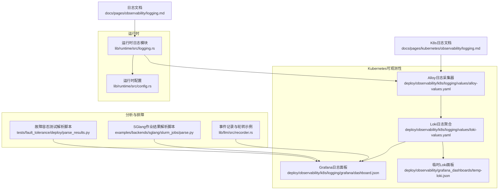
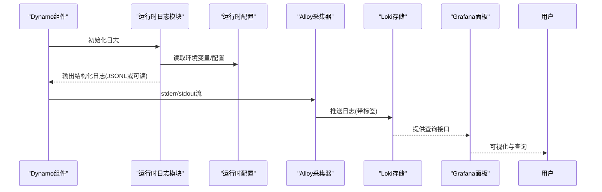
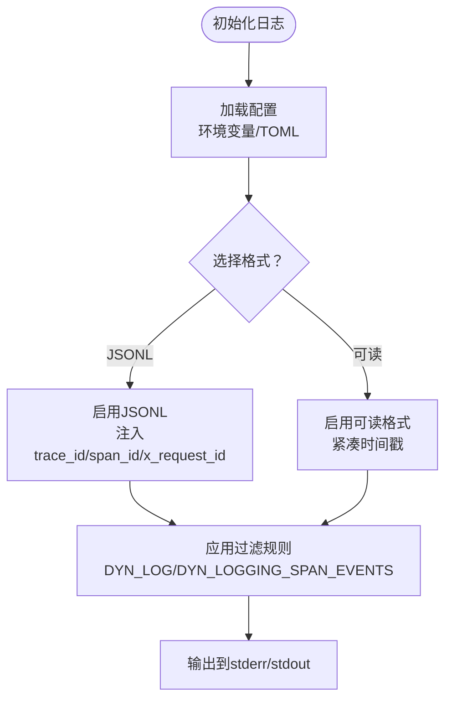
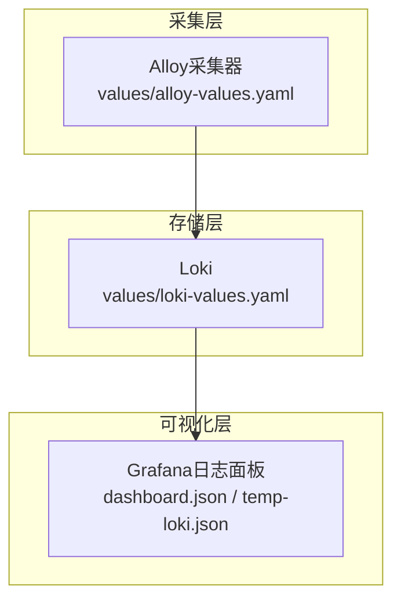
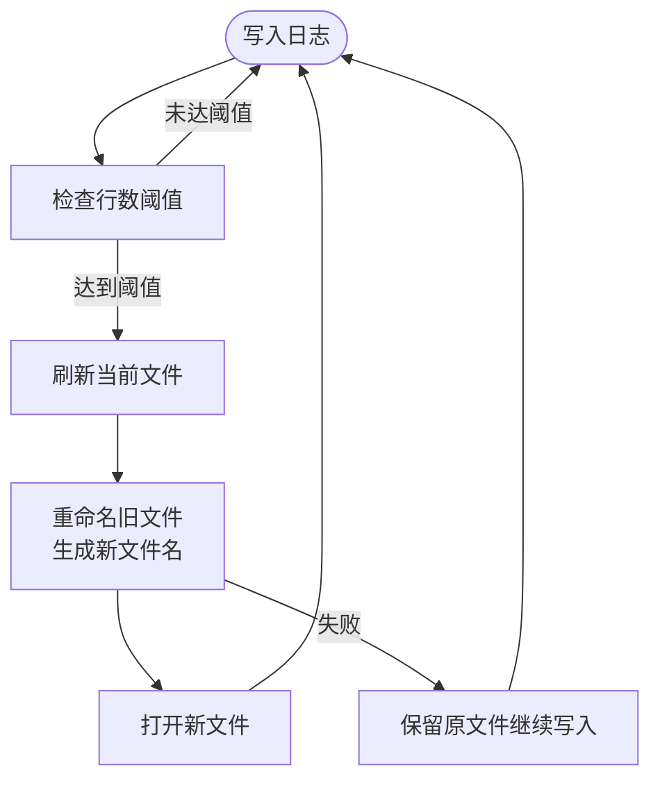
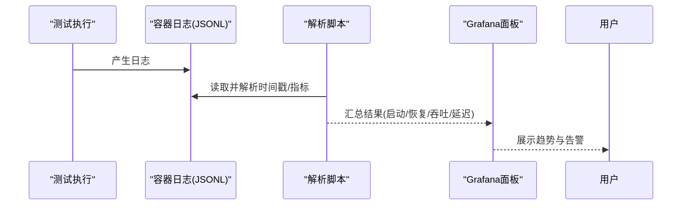
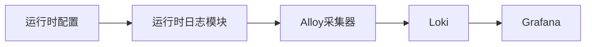

# 日志管理与分析

<cite>
**本文引用的文件**
- [lib/runtime/src/logging.rs](file://lib/runtime/src/logging.rs)
- [lib/runtime/src/config.rs](file://lib/runtime/src/config.rs)
- [docs/pages/observability/logging.md](file://docs/pages/observability/logging.md)
- [docs/pages/kubernetes/observability/logging.md](file://docs/pages/kubernetes/observability/logging.md)
- [deploy/observability/k8s/logging/values/loki-values.yaml](file://deploy/observability/k8s/logging/values/loki-values.yaml)
- [deploy/observability/k8s/logging/values/alloy-values.yaml](file://deploy/observability/k8s/logging/values/alloy-values.yaml)
- [deploy/observability/k8s/logging/grafana/dashboard.json](file://deploy/observability/k8s/logging/grafana/dashboard.json)
- [deploy/observability/grafana_dashboards/temp-loki.json](file://deploy/observability/grafana_dashboards/temp-loki.json)
- [lib/llm/src/recorder.rs](file://lib/llm/src/recorder.rs)
- [tests/fault_tolerance/deploy/parse_results.py](file://tests/fault_tolerance/deploy/parse_results.py)
- [examples/backends/sglang/slurm_jobs/parse.py](file://examples/backends/sglang/slurm_jobs/parse.py)
</cite>

## 目录
1. [简介](#简介)
2. [项目结构](#项目结构)
3. [核心组件](#核心组件)
4. [架构总览](#架构总览)
5. [详细组件分析](#详细组件分析)
6. [依赖关系分析](#依赖关系分析)
7. [性能考量](#性能考量)
8. [故障排查指南](#故障排查指南)
9. [结论](#结论)
10. [附录](#附录)

## 简介
本指南面向Dynamo的日志管理与分析，覆盖结构化日志配置（格式、字段、级别）、日志聚合（ELK/LoKi集成、采集器部署）、查询优化（索引、语法、调优）、日志轮转与归档、分析工具与异常检测、趋势分析、配置模板与查询示例，以及故障排查方法。内容基于仓库中的运行时日志模块、Kubernetes可观测性文档与配置、以及测试与示例脚本。

## 项目结构
Dynamo的日志能力由运行时模块统一提供，并在Kubernetes环境中通过Loki与Alloy进行采集与可视化；同时配套仪表盘与解析脚本用于分析与排障。

**图表来源**
- [lib/runtime/src/logging.rs](file://lib/runtime/src/logging.rs#L1-L1464)
- [lib/runtime/src/config.rs](file://lib/runtime/src/config.rs#L458-L483)
- [deploy/observability/k8s/logging/values/alloy-values.yaml](file://deploy/observability/k8s/logging/values/alloy-values.yaml#L1-L60)
- [deploy/observability/k8s/logging/values/loki-values.yaml](file://deploy/observability/k8s/logging/values/loki-values.yaml#L1-L80)
- [deploy/observability/k8s/logging/grafana/dashboard.json](file://deploy/observability/k8s/logging/grafana/dashboard.json#L1-L215)
- [deploy/observability/grafana_dashboards/temp-loki.json](file://deploy/observability/grafana_dashboards/temp-loki.json#L1-L215)
- [tests/fault_tolerance/deploy/parse_results.py](file://tests/fault_tolerance/deploy/parse_results.py#L1-L935)
- [examples/backends/sglang/slurm_jobs/parse.py](file://examples/backends/sglang/slurm_jobs/parse.py#L1-L213)
- [lib/llm/src/recorder.rs](file://lib/llm/src/recorder.rs#L169-L605)

**章节来源**
- [lib/runtime/src/logging.rs](file://lib/runtime/src/logging.rs#L1-L1464)
- [docs/pages/observability/logging.md](file://docs/pages/observability/logging.md#L1-L269)
- [docs/pages/kubernetes/observability/logging.md](file://docs/pages/kubernetes/observability/logging.md#L1-L80)

## 核心组件
- 运行时日志模块：支持可读文本与JSONL两种格式，具备按模块/目标的过滤、时间戳本地化、OpenTelemetry trace/span上下文注入、可选Span事件输出等能力。
- 运行时配置：提供环境变量开关以启用JSONL、禁用ANSI、使用本地时区、开启Span事件等。
- Kubernetes日志栈：通过Alloy作为采集器推送至Loki，Grafana提供日志面板与查询。
- 分析与排障：测试脚本解析容器日志中的时间戳与指标，示例脚本解析性能分析输出；事件记录器展示轮转与多文件写入实践。

**章节来源**
- [lib/runtime/src/logging.rs](file://lib/runtime/src/logging.rs#L1-L1464)
- [lib/runtime/src/config.rs](file://lib/runtime/src/config.rs#L458-L483)
- [docs/pages/kubernetes/observability/logging.md](file://docs/pages/kubernetes/observability/logging.md#L1-L80)

## 架构总览
下图展示了从组件到采集、存储与可视化的端到端流程。

**图表来源**
- [lib/runtime/src/logging.rs](file://lib/runtime/src/logging.rs#L972-L996)
- [lib/runtime/src/config.rs](file://lib/runtime/src/config.rs#L458-L483)
- [deploy/observability/k8s/logging/values/alloy-values.yaml](file://deploy/observability/k8s/logging/values/alloy-values.yaml#L1-L60)
- [deploy/observability/k8s/logging/values/loki-values.yaml](file://deploy/observability/k8s/logging/values/loki-values.yaml#L1-L80)
- [deploy/observability/k8s/logging/grafana/dashboard.json](file://deploy/observability/k8s/logging/grafana/dashboard.json#L51-L62)

## 详细组件分析

### 结构化日志配置与字段
- 格式选择
  - 可读格式：默认，适合人类阅读与快速定位问题。
  - JSONL格式：启用后便于机器解析与自动化处理，支持trace_id、span_id、x_request_id等分布式追踪字段。
- 字段定义
  - 时间戳：UTC或本地时区可选。
  - 级别：ERROR/WARN/INFO/DEBUG/TRACE。
  - 目标模块：如dynamo_runtime::xxx。
  - 消息体：字符串或JSON值。
  - 结构化字段：file、line、target等。
  - 追踪上下文：trace_id、span_id、span_name、x_request_id（当启用JSONL并存在请求上下文时）。
- 日志级别与过滤
  - 支持通过环境变量DYN_LOG设置默认级别与模块级过滤。
  - 支持通过DYN_LOGGING_SPAN_EVENTS开启Span事件记录。
- 配置加载优先级
  - 环境变量最高优先级。
  - 可选TOML配置文件（路径由DYN_LOGGING_CONFIG_PATH指定），默认路径/opt/dynamo/etc/logging.toml。
- 时间与时区
  - DYN_LOG_USE_LOCAL_TZ控制是否使用本地时区。
  - ANSI颜色可通过DYN_SDK_DISABLE_ANSI_LOGGING关闭。

**图表来源**
- [lib/runtime/src/logging.rs](file://lib/runtime/src/logging.rs#L1046-L1055)
- [lib/runtime/src/logging.rs](file://lib/runtime/src/logging.rs#L998-L1022)
- [lib/runtime/src/config.rs](file://lib/runtime/src/config.rs#L458-L483)

**章节来源**
- [lib/runtime/src/logging.rs](file://lib/runtime/src/logging.rs#L1-L1464)
- [lib/runtime/src/config.rs](file://lib/runtime/src/config.rs#L458-L483)
- [docs/pages/observability/logging.md](file://docs/pages/observability/logging.md#L15-L118)

### 日志聚合与采集（Loki + Alloy）
- Loki安装与配置
  - 单机模式部署，使用MinIO作为对象存储。
  - 允许结构化元数据，启用查询前端并发参数等。
- Alloy采集器
  - 将Dynamo命名空间内的Pod日志采集到Loki。
  - 保留关键标签（如level、namespace、service_name等），并映射结构化元数据。
  - 限定采集范围为DYN_NAMESPACE命名空间。
- Grafana日志面板
  - 提供按命名空间、DynamoGraph部署、组件类型筛选的日志面板。
  - 支持Trace ID与自定义搜索条件。

**图表来源**
- [deploy/observability/k8s/logging/values/alloy-values.yaml](file://deploy/observability/k8s/logging/values/alloy-values.yaml#L1-L60)
- [deploy/observability/k8s/logging/values/loki-values.yaml](file://deploy/observability/k8s/logging/values/loki-values.yaml#L1-L80)
- [deploy/observability/k8s/logging/grafana/dashboard.json](file://deploy/observability/k8s/logging/grafana/dashboard.json#L51-L62)
- [deploy/observability/grafana_dashboards/temp-loki.json](file://deploy/observability/grafana_dashboards/temp-loki.json#L51-L62)

**章节来源**
- [docs/pages/kubernetes/observability/logging.md](file://docs/pages/kubernetes/observability/logging.md#L1-L80)
- [deploy/observability/k8s/logging/values/loki-values.yaml](file://deploy/observability/k8s/logging/values/loki-values.yaml#L1-L80)
- [deploy/observability/k8s/logging/values/alloy-values.yaml](file://deploy/observability/k8s/logging/values/alloy-values.yaml#L1-L60)
- [deploy/observability/k8s/logging/grafana/dashboard.json](file://deploy/observability/k8s/logging/grafana/dashboard.json#L1-L215)

### 日志查询优化与索引设计
- 查询语法
  - 使用Grafana Loki查询构建器表达式，结合标签过滤与文本匹配。
  - 示例表达式包含命名空间、DynamoGraph部署、组件类型、Trace ID与自定义搜索词。
- 索引与标签
  - 保留level、namespace、service_name、nvidia_com_dynamo_component_type等常用标签，提升过滤效率。
  - 建议在Loki schema中对高频查询字段建立索引，减少扫描范围。
- 性能调优
  - 控制查询窗口大小，避免长时间跨度导致内存压力。
  - 合理使用标签过滤，优先利用高基数低分布的标签进行分区。
  - 对于大规模日志，建议分环境/命名空间隔离，限制查询范围。

**章节来源**
- [deploy/observability/k8s/logging/grafana/dashboard.json](file://deploy/observability/k8s/logging/grafana/dashboard.json#L51-L62)
- [deploy/observability/k8s/logging/values/loki-values.yaml](file://deploy/observability/k8s/logging/values/loki-values.yaml#L22-L30)

### 日志轮转、存储与归档策略
- 轮转机制
  - 事件记录器演示了基于行数的轮转：达到阈值后刷新当前文件、重命名并打开新文件，确保单文件行数可控。
  - 轮转失败时会保留原文件继续写入，避免丢失数据。
- 存储与归档
  - Loki采用TSDB索引与对象存储（如MinIO）保存块数据，支持周期性索引前缀与压缩策略。
  - 建议结合业务生命周期策略，对旧日志进行归档或删除，控制成本与查询性能。
- 多文件管理
  - 轮转后文件数量与大小应满足监控与审计要求，定期清理过期文件。

**图表来源**
- [lib/llm/src/recorder.rs](file://lib/llm/src/recorder.rs#L172-L202)

**章节来源**
- [lib/llm/src/recorder.rs](file://lib/llm/src/recorder.rs#L169-L605)
- [deploy/observability/k8s/logging/values/loki-values.yaml](file://deploy/observability/k8s/logging/values/loki-values.yaml#L1-L80)

### 日志分析工具、异常检测与趋势分析
- 故障容忍测试解析
  - 解析容器日志中的时间戳，计算启动与恢复耗时；提取AI-Perf指标（请求量、成功率、延迟、吞吐等）并汇总统计。
  - 支持溢出阶段与恢复阶段分别评估。
- SGlang作业结果解析
  - 从输出目录解析不同后端（如sglang、vllm、gap）的性能指标，按并发、请求率、ITL、TTFT、TPOT等排序与汇总。
- 异常检测与趋势
  - 基于JSONL日志中的trace_id、span_id与x_request_id，可快速定位请求链路异常。
  - 利用Grafana面板对错误级别、组件负载、延迟分布进行趋势观察。

**图表来源**
- [tests/fault_tolerance/deploy/parse_results.py](file://tests/fault_tolerance/deploy/parse_results.py#L131-L176)
- [examples/backends/sglang/slurm_jobs/parse.py](file://examples/backends/sglang/slurm_jobs/parse.py#L64-L102)

**章节来源**
- [tests/fault_tolerance/deploy/parse_results.py](file://tests/fault_tolerance/deploy/parse_results.py#L1-L935)
- [examples/backends/sglang/slurm_jobs/parse.py](file://examples/backends/sglang/slurm_jobs/parse.py#L1-L213)
- [docs/pages/observability/logging.md](file://docs/pages/observability/logging.md#L139-L269)

### 配置模板与查询示例
- 运行时日志环境变量
  - DYN_LOGGING_JSONL：启用JSONL（配合Loki）。
  - DYN_LOG：模块级日志级别过滤。
  - DYN_LOG_USE_LOCAL_TZ：本地时区。
  - DYN_LOGGING_SPAN_EVENTS：Span事件记录。
  - DYN_LOGGING_CONFIG_PATH：自定义TOML配置路径。
- Loki与Alloy配置要点
  - Alloy仅采集DYN_NAMESPACE命名空间，保留必要标签并映射结构化元数据。
  - Loki启用结构化元数据与查询并发参数，单机模式部署。
- Grafana查询表达式
  - 示例表达式包含命名空间、DynamoGraph部署、组件类型、Trace ID与自定义搜索词。

**章节来源**
- [docs/pages/observability/logging.md](file://docs/pages/observability/logging.md#L15-L118)
- [docs/pages/kubernetes/observability/logging.md](file://docs/pages/kubernetes/observability/logging.md#L42-L80)
- [deploy/observability/k8s/logging/values/alloy-values.yaml](file://deploy/observability/k8s/logging/values/alloy-values.yaml#L1-L60)
- [deploy/observability/k8s/logging/values/loki-values.yaml](file://deploy/observability/k8s/logging/values/loki-values.yaml#L1-L80)
- [deploy/observability/k8s/logging/grafana/dashboard.json](file://deploy/observability/k8s/logging/grafana/dashboard.json#L51-L62)

## 依赖关系分析
- 组件耦合
  - 运行时日志模块依赖运行时配置模块以读取环境变量与开关。
  - Kubernetes采集依赖Alloy与Loki配置，Grafana依赖Loki数据源与面板模板。
- 外部依赖
  - OpenTelemetry库用于trace/span上下文注入（在JSONL启用时）。
  - Grafana Loki与Grafana用于日志可视化与查询。
- 潜在风险
  - JSONL启用但未正确配置Alloy/Loki可能导致日志丢失。
  - 过多Span事件可能带来额外开销，需按需开启。

**图表来源**
- [lib/runtime/src/config.rs](file://lib/runtime/src/config.rs#L458-L483)
- [lib/runtime/src/logging.rs](file://lib/runtime/src/logging.rs#L972-L996)
- [deploy/observability/k8s/logging/values/alloy-values.yaml](file://deploy/observability/k8s/logging/values/alloy-values.yaml#L1-L60)
- [deploy/observability/k8s/logging/values/loki-values.yaml](file://deploy/observability/k8s/logging/values/loki-values.yaml#L1-L80)

**章节来源**
- [lib/runtime/src/logging.rs](file://lib/runtime/src/logging.rs#L1-L1464)
- [lib/runtime/src/config.rs](file://lib/runtime/src/config.rs#L458-L483)

## 性能考量
- 日志级别与过滤
  - 在生产中建议默认INFO或WARN，仅在调试时提高到DEBUG/TRACE。
  - 使用模块级过滤减少噪声，避免全局过细粒度日志带来的I/O与CPU开销。
- JSONL与Span事件
  - JSONL便于机器解析，但会增加序列化与网络传输开销；按需启用。
  - Span事件会引入额外事件与过滤逻辑，建议仅在短时调试场景开启。
- Loki与查询
  - 控制查询窗口与标签过滤，避免全量扫描。
  - 合理设置Loki资源限制与缓存参数，防止内存压力。
- 轮转与存储
  - 合理设置轮转阈值，平衡文件数量与单文件大小。
  - 对历史日志进行归档或删除，降低存储成本与查询复杂度。

[本节为通用指导，无需特定文件引用]

## 故障排查指南
- 快速定位
  - 使用Grafana日志面板按命名空间、组件、Trace ID与搜索词过滤。
  - 在JSONL中查找trace_id、span_id、x_request_id，串联请求链路。
- 容器日志解析
  - 使用测试脚本解析容器日志中的时间戳，计算启动/恢复耗时。
  - 从AI-Perf输出中提取延迟、吞吐、成功率等关键指标。
- 配置核验
  - 确认DYN_LOGGING_JSONL已启用且Alloy/Loki正常工作。
  - 检查DYN_NAMESPACE与采集标签是否一致。
- 常见问题
  - 日志缺失：检查Alloy采集范围与命名空间配置。
  - 查询缓慢：缩小时间窗口、减少标签过滤、优化索引。
  - 轮转失败：确认磁盘权限与路径可用性，关注错误日志。

**章节来源**
- [tests/fault_tolerance/deploy/parse_results.py](file://tests/fault_tolerance/deploy/parse_results.py#L131-L176)
- [docs/pages/observability/logging.md](file://docs/pages/observability/logging.md#L139-L269)
- [deploy/observability/k8s/logging/grafana/dashboard.json](file://deploy/observability/k8s/logging/grafana/dashboard.json#L51-L62)

## 结论
Dynamo提供了完善的结构化日志能力与Kubernetes可观测性集成方案。通过合理配置日志格式与级别、启用Span事件、部署Alloy与Loki、以及利用Grafana面板与解析脚本，可以实现高效的问题定位、性能分析与趋势监控。建议在生产中采用JSONL与模块化过滤，在需要时开启Span事件，并结合轮转与归档策略保障长期可维护性。

[本节为总结，无需特定文件引用]

## 附录
- 环境变量清单（摘自文档）
  - DYN_LOGGING_JSONL：启用JSONL（配合Loki）。
  - DYN_LOG：模块级日志级别过滤。
  - DYN_LOG_USE_LOCAL_TZ：本地时区。
  - DYN_LOGGING_SPAN_EVENTS：Span事件记录。
  - DYN_LOGGING_CONFIG_PATH：自定义TOML配置路径。
  - OTEL_SERVICE_NAME、OTEL_EXPORT_ENABLED、OTEL_EXPORTER_OTLP_TRACES_ENDPOINT：追踪导出相关（可选）。
- 查询表达式示例（摘自Grafana面板）
  - 包含命名空间、DynamoGraph部署、组件类型、Trace ID与自定义搜索词的组合过滤。

**章节来源**
- [docs/pages/observability/logging.md](file://docs/pages/observability/logging.md#L15-L118)
- [deploy/observability/k8s/logging/grafana/dashboard.json](file://deploy/observability/k8s/logging/grafana/dashboard.json#L51-L62)