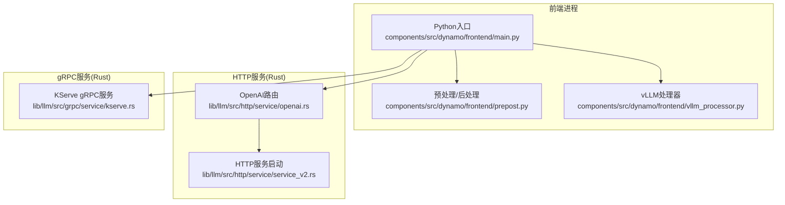
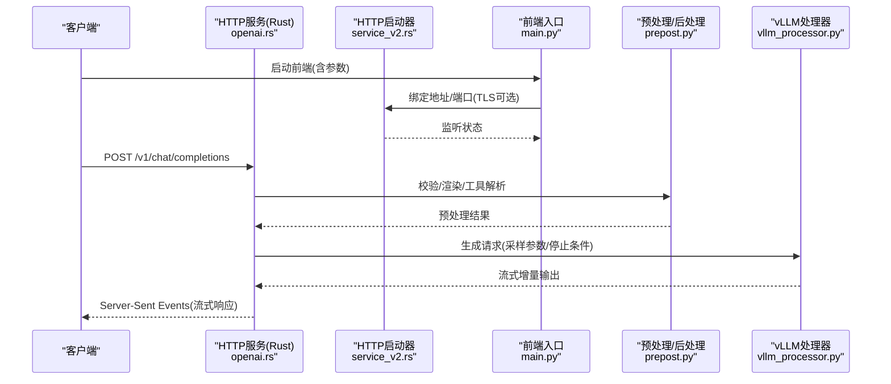
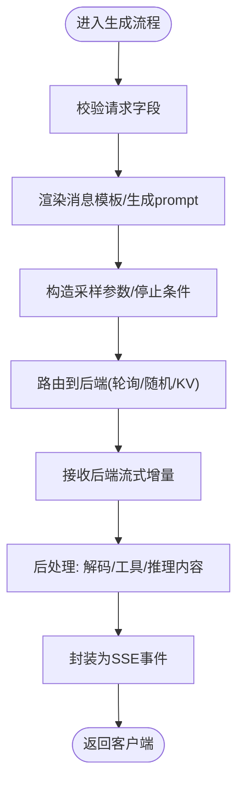
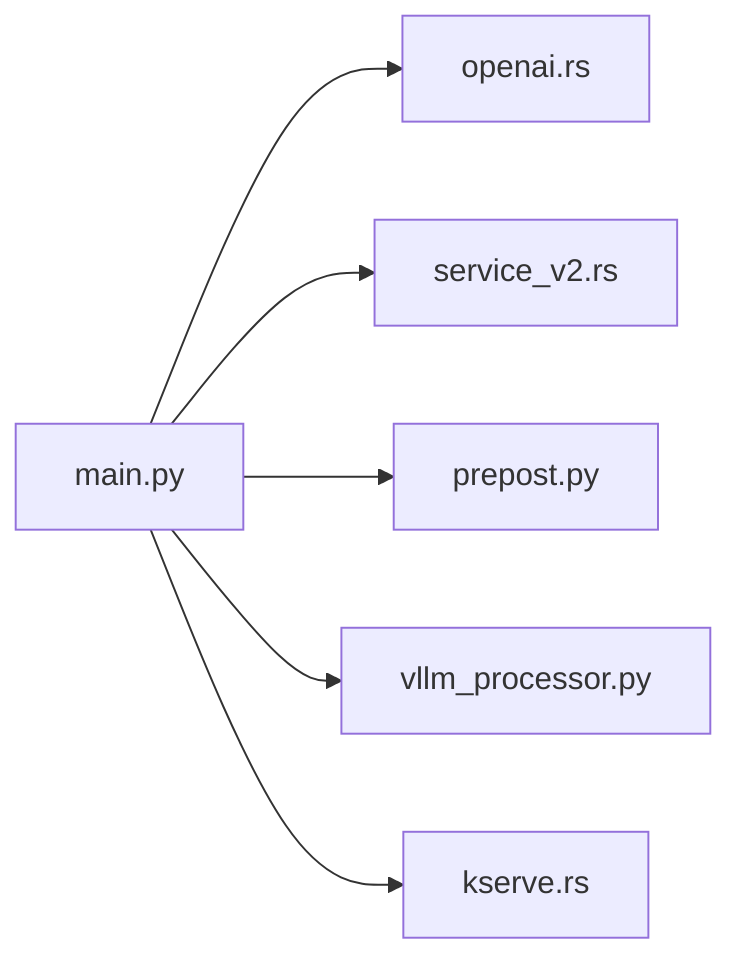

# API路由与端点

<cite>
**本文引用的文件列表**
- [main.py](file://components/src/dynamo/frontend/main.py)
- [__main__.py](file://components/src/dynamo/frontend/__main__.py)
- [prepost.py](file://components/src/dynamo/frontend/prepost.py)
- [vllm_processor.py](file://components/src/dynamo/frontend/vllm_processor.py)
- [openai.rs](file://lib/llm/src/http/service/openai.rs)
- [service_v2.rs](file://lib/llm/src/http/service/service_v2.rs)
- [kserve.rs](file://lib/llm/src/grpc/service/kserve.rs)
- [test_vllm.py](file://tests/frontend/test_vllm.py)
</cite>

## 目录
1. [简介](#简介)
2. [项目结构](#项目结构)
3. [核心组件](#核心组件)
4. [架构总览](#架构总览)
5. [详细组件分析](#详细组件分析)
6. [依赖关系分析](#依赖关系分析)
7. [性能考量](#性能考量)
8. [故障排查指南](#故障排查指南)
9. [结论](#结论)
10. [附录](#附录)

## 简介
本文件面向Dynamo前端服务，系统性梳理其OpenAI兼容API的路由与端点实现，涵盖：
- OpenAI兼容HTTP路由：/v1/chat/completions 与 /v1/completions 的HTTP方法、URL模式、请求响应模式
- 与后端组件（路由器、引擎）的通信协议与数据流
- KServe gRPC服务器的集成方式与端口配置
- 命令行参数解析机制（HTTP主机、端口、TLS证书等）
- 典型API使用示例（请求格式、响应结构、错误处理）

## 项目结构
Dynamo前端由Python入口负责启动HTTP/GRPC服务、解析参数、初始化运行时与路由器；OpenAI兼容HTTP路由在Rust侧实现，通过Axum提供REST接口；可选地启动KServe gRPC服务以适配特定推理框架。

图表来源
- [main.py](file://components/src/dynamo/frontend/main.py#L368-L518)
- [openai.rs](file://lib/llm/src/http/service/openai.rs#L1540-L1587)
- [service_v2.rs](file://lib/llm/src/http/service/service_v2.rs#L238-L300)
- [kserve.rs](file://lib/llm/src/grpc/service/kserve.rs#L212-L248)

章节来源
- [main.py](file://components/src/dynamo/frontend/main.py#L1-L518)
- [openai.rs](file://lib/llm/src/http/service/openai.rs#L1540-L1587)
- [service_v2.rs](file://lib/llm/src/http/service/service_v2.rs#L238-L300)
- [kserve.rs](file://lib/llm/src/grpc/service/kserve.rs#L212-L248)

## 核心组件
- Python前端入口：解析命令行参数、构建分布式运行时、选择HTTP或gRPC模式、启动服务与交互模式
- 预处理/后处理模块：对OpenAI风格请求进行校验、模板渲染、工具调用解析、流式输出拼接
- vLLM处理器：将OpenAI请求映射到vLLM输入/采样参数，对接路由器并聚合流式输出
- OpenAI兼容HTTP路由：定义/v1/chat/completions与/v1/completions路由，绑定处理器
- HTTP服务启动：根据是否启用TLS选择HTTPS或HTTP监听，支持优雅关闭
- KServe gRPC服务：按配置启动gRPC服务，支持窗口大小调优

章节来源
- [main.py](file://components/src/dynamo/frontend/main.py#L82-L365)
- [prepost.py](file://components/src/dynamo/frontend/prepost.py#L18-L117)
- [vllm_processor.py](file://components/src/dynamo/frontend/vllm_processor.py#L74-L363)
- [openai.rs](file://lib/llm/src/http/service/openai.rs#L1540-L1587)
- [service_v2.rs](file://lib/llm/src/http/service/service_v2.rs#L238-L300)
- [kserve.rs](file://lib/llm/src/grpc/service/kserve.rs#L212-L248)

## 架构总览
Dynamo前端同时提供OpenAI兼容HTTP与KServe gRPC两种接入面。HTTP路径由Rust Axum路由分发至对应处理器；gRPC路径由Rust gRPC服务实现。Python入口负责参数解析与运行时装配，并在不同模式间切换。

图表来源
- [openai.rs](file://lib/llm/src/http/service/openai.rs#L1556-L1571)
- [service_v2.rs](file://lib/llm/src/http/service/service_v2.rs#L238-L300)
- [main.py](file://components/src/dynamo/frontend/main.py#L368-L518)
- [prepost.py](file://components/src/dynamo/frontend/prepost.py#L56-L117)
- [vllm_processor.py](file://components/src/dynamo/frontend/vllm_processor.py#L95-L363)

## 详细组件分析

### OpenAI兼容HTTP路由与端点
- 路由定义
  - /v1/chat/completions：POST，用于聊天补全，支持流式返回
  - /v1/completions：POST，用于文本补全，支持流式返回
- 请求/响应模式
  - 请求体遵循OpenAI风格字段（如messages、model、max_tokens、temperature、stream等）
  - 响应采用OpenAI兼容格式，流式场景使用Server-Sent Events
  - 错误响应统一为包含message、type、code的JSON对象
- 路由实现位置
  - 路由注册与中间件在Rust模块中完成，绑定到对应处理器函数

章节来源
- [openai.rs](file://lib/llm/src/http/service/openai.rs#L1540-L1587)
- [openai.rs](file://lib/llm/src/http/service/openai.rs#L1556-L1571)
- [openai.rs](file://lib/llm/src/http/service/openai.rs#L80-L200)

### 命令行参数解析机制
- HTTP相关
  - --http-host：HTTP监听主机，默认0.0.0.0
  - --http-port：HTTP监听端口，默认8000
  - --tls-cert-path、--tls-key-path：TLS证书与私钥路径，二者必须同时提供
- gRPC相关
  - --kserve-grpc-server：启用KServe gRPC服务
  - --grpc-metrics-port：gRPC服务HTTP指标端口，默认8788
- 其他关键参数
  - --router-mode、--kv-*、--router-*、--request-plane、--event-plane、--chat-processor等
- 参数校验
  - TLS证书与密钥需成对出现
  - 迁移上限范围校验

章节来源
- [main.py](file://components/src/dynamo/frontend/main.py#L118-L365)

### 与后端组件的通信协议与数据流
- 预处理阶段
  - 将OpenAI风格请求校验为内部模型，必要时调整工具调用
  - 渲染消息模板，得到prompt与token序列
- 采样与停止条件
  - 将请求映射为采样参数（温度、top_p、max_tokens等）
  - 设置停止条件（stop、stop_token_ids、ignore_eos等）
- 路由与生成
  - 通过路由器（轮询/随机/KV）提交请求
  - 接收后端流式增量输出
- 后处理与流式聚合
  - 对增量token进行解码、工具调用与推理内容提取
  - 按OpenAI兼容格式聚合为SSE事件发送给客户端

图表来源
- [prepost.py](file://components/src/dynamo/frontend/prepost.py#L56-L117)
- [vllm_processor.py](file://components/src/dynamo/frontend/vllm_processor.py#L95-L363)

章节来源
- [prepost.py](file://components/src/dynamo/frontend/prepost.py#L18-L117)
- [vllm_processor.py](file://components/src/dynamo/frontend/vllm_processor.py#L74-L363)

### KServe gRPC服务器集成与端口配置
- 启用方式
  - 命令行开启--kserve-grpc-server后，前端入口将启动gRPC服务
- 端口与指标
  - gRPC服务默认监听地址为“0.0.0.0:port”，其中port来自运行时配置
  - HTTP指标端口可通过--grpc-metrics-port指定，默认8788
- gRPC调优
  - 支持通过环境变量设置初始连接/流窗口大小，提升吞吐
- 优雅关闭
  - 与HTTP服务一致，支持取消令牌触发的优雅关闭

章节来源
- [main.py](file://components/src/dynamo/frontend/main.py#L494-L496)
- [kserve.rs](file://lib/llm/src/grpc/service/kserve.rs#L212-L248)
- [kserve.rs](file://lib/llm/src/grpc/service/kserve.rs#L171-L184)

### API使用示例与错误处理
- 示例请求（基于测试用例）
  - /v1/chat/completions：携带messages、model、max_tokens、stream等字段
  - /v1/completions：携带prompt、model、max_tokens、stream等字段
- 响应结构
  - 成功：OpenAI兼容的聊天补全/补全响应，流式场景为SSE
  - 失败：统一错误对象，包含message、type、code
- 错误处理
  - 4xx：参数/模型未找到/功能未实现等
  - 5xx：内部错误或服务过载
  - TLS错误：证书/密钥不匹配或加载失败

章节来源
- [test_vllm.py](file://tests/frontend/test_vllm.py#L142-L157)
- [openai.rs](file://lib/llm/src/http/service/openai.rs#L80-L200)
- [service_v2.rs](file://lib/llm/src/http/service/service_v2.rs#L238-L300)

## 依赖关系分析
- Python前端入口依赖运行时与路由器配置，决定HTTP或gRPC模式
- OpenAI路由依赖HTTP服务启动器，后者负责TLS与监听
- vLLM处理器依赖输入/输出处理器与路由器，负责将OpenAI请求映射为引擎输入并聚合输出
- KServe gRPC服务独立于HTTP路由，但共享运行时配置

图表来源
- [main.py](file://components/src/dynamo/frontend/main.py#L368-L518)
- [openai.rs](file://lib/llm/src/http/service/openai.rs#L1540-L1587)
- [service_v2.rs](file://lib/llm/src/http/service/service_v2.rs#L238-L300)
- [prepost.py](file://components/src/dynamo/frontend/prepost.py#L18-L117)
- [vllm_processor.py](file://components/src/dynamo/frontend/vllm_processor.py#L74-L363)
- [kserve.rs](file://lib/llm/src/grpc/service/kserve.rs#L212-L248)

章节来源
- [main.py](file://components/src/dynamo/frontend/main.py#L368-L518)

## 性能考量
- 流式传输：SSE与增量输出减少首字节延迟，适合长对话与大模型推理
- 路由策略：KV路由在无事件模式下支持TTL、树大小裁剪与目标比例，平衡内存占用与命中率
- gRPC窗口调优：通过环境变量调整连接/流窗口大小，提升高并发下的吞吐
- 请求体限制：默认45MB，可按环境变量调整以支持超长提示词

章节来源
- [openai.rs](file://lib/llm/src/http/service/openai.rs#L67-L76)
- [kserve.rs](file://lib/llm/src/grpc/service/kserve.rs#L181-L184)

## 故障排查指南
- TLS配置问题
  - 症状：启动失败或握手错误
  - 排查：确认--tls-cert-path与--tls-key-path成对提供且文件存在
- 端口冲突
  - 症状：HTTP或gRPC端口被占用
  - 排查：检查--http-port/--grpc-metrics-port，或更换端口
- 服务未就绪
  - 症状：返回503或健康检查失败
  - 排查：确认后端工作节点已注册、模型已加载、事件平面可用
- 错误响应定位
  - 使用统一错误对象中的type与code快速定位问题类型（参数、实现、内部）

章节来源
- [service_v2.rs](file://lib/llm/src/http/service/service_v2.rs#L238-L300)
- [openai.rs](file://lib/llm/src/http/service/openai.rs#L80-L200)

## 结论
Dynamo前端通过Rust实现的OpenAI兼容HTTP路由与可选的KServe gRPC服务，结合Python入口的参数解析与运行时装配，提供了灵活、高性能的推理接入面。其数据流从OpenAI风格请求开始，经预处理、采样与路由，最终以SSE形式返回流式响应，满足现代多模态与工具调用场景的需求。

## 附录

### OpenAI兼容端点清单
- /v1/chat/completions
  - 方法：POST
  - 功能：聊天补全，支持流式
  - 关键字段：messages、model、max_tokens、temperature、stream等
- /v1/completions
  - 方法：POST
  - 功能：文本补全，支持流式
  - 关键字段：prompt、model、max_tokens、temperature、stream等

章节来源
- [openai.rs](file://lib/llm/src/http/service/openai.rs#L1540-L1587)
- [test_vllm.py](file://tests/frontend/test_vllm.py#L142-L157)