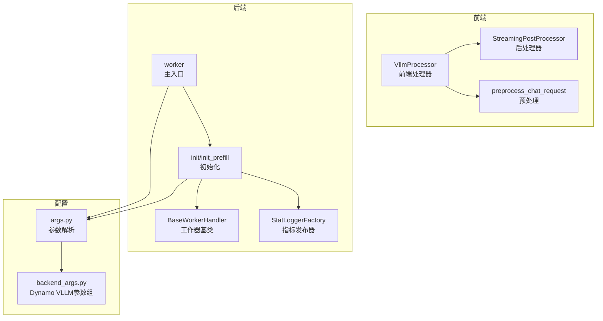
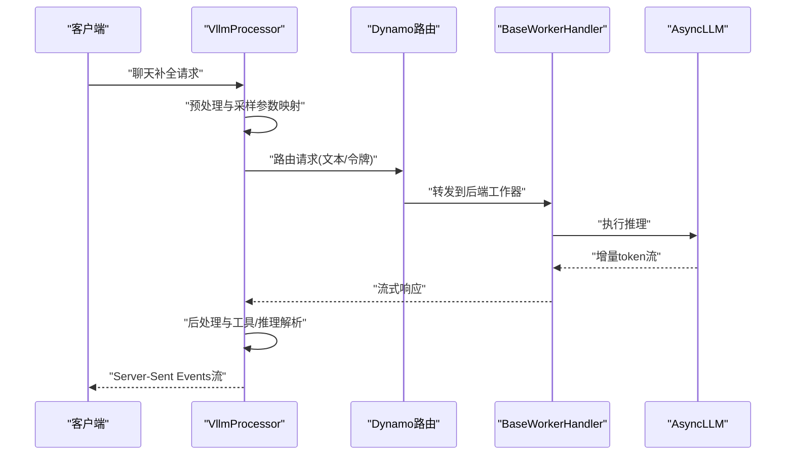
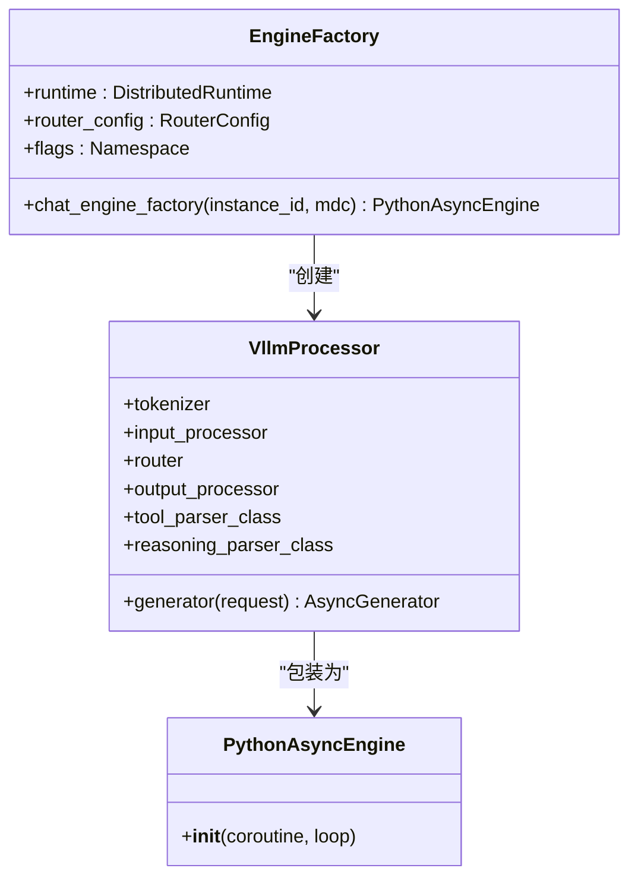
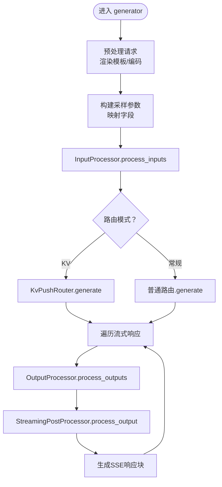
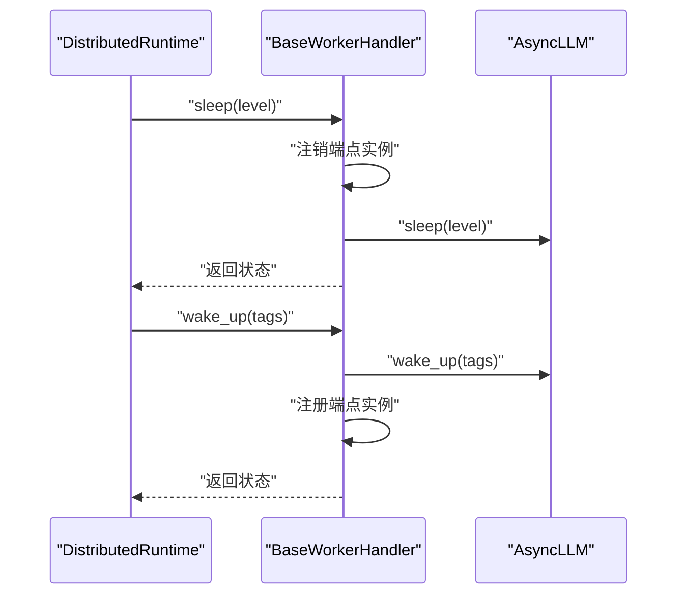
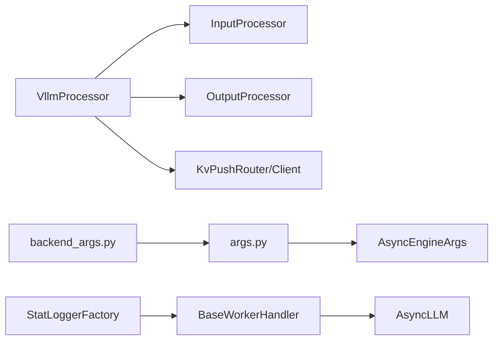

# VLLM处理器集成

<cite>
**本文档引用的文件**
- [vllm_processor.py](file://components/src/dynamo/frontend/vllm_processor.py)
- [prepost.py](file://components/src/dynamo/frontend/prepost.py)
- [main.py](file://components/src/dynamo/vllm/main.py)
- [handlers.py](file://components/src/dynamo/vllm/handlers.py)
- [args.py](file://components/src/dynamo/vllm/args.py)
- [backend_args.py](file://components/src/dynamo/vllm/backend_args.py)
- [publisher.py](file://components/src/dynamo/vllm/publisher.py)
- [vllm_agg_qwen.yaml](file://deploy/inference-gateway/standalone/vllm_agg_qwen.yaml)
- [vllm-2p1d.yaml](file://examples/hierarchical_planner/vllm-2p1d.yaml)
</cite>

## 目录
1. [简介](#简介)
2. [项目结构](#项目结构)
3. [核心组件](#核心组件)
4. [架构概览](#架构概览)
5. [详细组件分析](#详细组件分析)
6. [依赖关系分析](#依赖关系分析)
7. [性能考虑](#性能考虑)
8. [故障排查指南](#故障排查指南)
9. [结论](#结论)
10. [附录](#附录)

## 简介
本文件面向Dynamo前端服务的VLLM处理器集成，系统性阐述EngineFactory的实现机制（引擎创建、配置管理、生命周期控制），以及VLLM处理器在Dynamo中的集成方式（参数传递、性能优化、资源管理）。同时对比VLLM处理器与Dynamo原生处理器的差异与适用场景，提供配置示例、使用指南、处理器切换机制与兼容性注意事项。

## 项目结构
Dynamo的VLLM集成主要分布在以下模块：
- 前端处理器：负责请求预处理、后处理与流式输出
- 后端工作器：负责引擎初始化、路由注册、指标收集与生命周期管理
- 配置系统：统一解析Dynamo运行时参数与VLLM引擎参数
- 发布器：负责指标发布与统计日志

**图表来源**
- [vllm_processor.py](file://components/src/dynamo/frontend/vllm_processor.py#L74-L465)
- [main.py](file://components/src/dynamo/vllm/main.py#L68-L190)
- [handlers.py](file://components/src/dynamo/vllm/handlers.py#L233-L448)
- [args.py](file://components/src/dynamo/vllm/args.py#L76-L127)
- [backend_args.py](file://components/src/dynamo/vllm/backend_args.py#L15-L191)

**章节来源**
- [vllm_processor.py](file://components/src/dynamo/frontend/vllm_processor.py#L1-L465)
- [main.py](file://components/src/dynamo/vllm/main.py#L1-L800)
- [handlers.py](file://components/src/dynamo/vllm/handlers.py#L1-L800)
- [args.py](file://components/src/dynamo/vllm/args.py#L1-L437)
- [backend_args.py](file://components/src/dynamo/vllm/backend_args.py#L1-L289)

## 核心组件
- VllmProcessor：前端异步生成器，封装预处理、采样参数映射、路由调用与后处理，负责将Dynamo内部协议转换为vLLM输入，并将vLLM输出转换回Dynamo流式响应。
- EngineFactory：工厂类，根据模型部署卡与运行时配置创建Python异步引擎实例，负责引擎生命周期管理与路由选择（KV或常规路由）。
- BaseWorkerHandler：后端工作器基类，提供睡眠/唤醒、LoRA动态加载卸载、KV事件发布等能力。
- 参数系统：统一解析Dynamo运行时参数与VLLM引擎参数，支持连接器配置（NIXL、LMCache、KVBM）与多模态选项。
- 指标发布器：将vLLM调度器统计与Dynamo组件指标合并发布。

**章节来源**
- [vllm_processor.py](file://components/src/dynamo/frontend/vllm_processor.py#L74-L465)
- [handlers.py](file://components/src/dynamo/vllm/handlers.py#L233-L448)
- [args.py](file://components/src/dynamo/vllm/args.py#L76-L127)
- [publisher.py](file://components/src/dynamo/vllm/publisher.py#L103-L148)

## 架构概览
Dynamo前端通过VllmProcessor将OpenAI风格请求转换为vLLM可执行的EngineCoreRequest，交由路由器分发到后端工作器；后端工作器基于AsyncLLM执行推理，返回增量token流，前端再通过StreamingPostProcessor进行最终格式化与工具/推理解析。

**图表来源**
- [vllm_processor.py](file://components/src/dynamo/frontend/vllm_processor.py#L95-L363)
- [handlers.py](file://components/src/dynamo/vllm/handlers.py#L349-L448)
- [main.py](file://components/src/dynamo/vllm/main.py#L676-L800)

## 详细组件分析

### EngineFactory 实现机制
EngineFactory负责在模型发现时创建Python异步引擎实例，关键流程如下：
- 模型类型校验：确保模型类型支持聊天
- 模型下载：若源路径不存在则从远程拉取
- 配置构建：构造ModelConfig、VllmConfig、LoadConfig与CacheConfig
- 处理器装配：创建InputProcessor、Tokenizer、OutputProcessor与可选的工具/推理解析器
- 路由选择：根据RouterMode创建KvPushRouter或普通客户端路由
- 引擎包装：将VllmProcessor.generator包装为PythonAsyncEngine

**图表来源**
- [vllm_processor.py](file://components/src/dynamo/frontend/vllm_processor.py#L365-L465)

**章节来源**
- [vllm_processor.py](file://components/src/dynamo/frontend/vllm_processor.py#L365-L465)

### VllmProcessor 请求处理流程
VllmProcessor的generator方法完成完整的请求生命周期：
- 预处理：将OpenAI请求转为ChatCompletionRequest，渲染模板，编码为token_ids
- 采样参数映射：从请求与生成配置中提取并设置SamplingParams
- 输入处理：使用InputProcessor将prompt与采样参数转换为EngineCoreRequest
- 路由调用：根据路由模式（KV或常规）发起生成请求
- 输出处理：将后端返回的增量token转换为vLLM OutputProcessorOutput，再经StreamingPostProcessor格式化
- 流式返回：逐块生成Server-Sent Events响应

**图表来源**
- [vllm_processor.py](file://components/src/dynamo/frontend/vllm_processor.py#L95-L363)
- [prepost.py](file://components/src/dynamo/frontend/prepost.py#L120-L318)

**章节来源**
- [vllm_processor.py](file://components/src/dynamo/frontend/vllm_processor.py#L95-L363)
- [prepost.py](file://components/src/dynamo/frontend/prepost.py#L120-L318)

### 后端工作器与生命周期管理
后端工作器提供睡眠/唤醒接口以释放/恢复GPU资源，支持LoRA动态加载与注销，并可发布KV事件用于前缀缓存协同：
- sleep/wake_up：按级别（权重/缓冲区/全部）睡眠/唤醒引擎，先注销再注册端点实例
- LoRA管理：并发锁保证同名LoRA的串行加载/卸载，支持URI下载与注册
- KV事件发布：在启用前缀缓存时，为每个数据并行rank创建ZMQ发布器

**图表来源**
- [handlers.py](file://components/src/dynamo/vllm/handlers.py#L287-L347)

**章节来源**
- [handlers.py](file://components/src/dynamo/vllm/handlers.py#L233-L448)

### 参数系统与配置管理
参数系统分为三部分：
- 运行时参数：DynamoRuntimeArgGroup，定义命名空间、组件、端点、平面等
- Dynamo VLLM参数：DynamoVllmArgGroup，定义多模态、EC、Omni、睡眠模式等选项
- VLLM引擎参数：通过AsyncEngineArgs注入，自动与Dynamo配置交叉验证与默认值设置

关键特性：
- 连接器配置：支持NIXL、LMCache、KVBM组合，自动生成KVTransferConfig
- 多模态支持：模板、前端解码、ECConnector等
- 默认行为：前缀缓存默认开启，块大小默认16，必要时强制分布式执行后端避免GIL竞争

**章节来源**
- [args.py](file://components/src/dynamo/vllm/args.py#L76-L127)
- [backend_args.py](file://components/src/dynamo/vllm/backend_args.py#L15-L191)

### 指标发布与监控
- 统一指标注册：DYNAMO_COMPONENT_REGISTRY隔离Dynamo组件指标
- 统计日志：StatLoggerFactory在引擎初始化时注入，记录调度器统计与GPU缓存使用
- 多进程支持：在PROMETHEUS_MULTIPROC_DIR存在时分别注册全局与多进程收集器

**章节来源**
- [publisher.py](file://components/src/dynamo/vllm/publisher.py#L103-L148)

## 依赖关系分析
- 前端依赖后端：VllmProcessor依赖InputProcessor/OutputProcessor与路由器
- 后端依赖引擎：BaseWorkerHandler依赖AsyncLLM执行推理
- 配置依赖：args.py与backend_args.py共同决定组件/端点与连接器策略
- 指标依赖：publisher.py与vLLM统计日志耦合

**图表来源**
- [vllm_processor.py](file://components/src/dynamo/frontend/vllm_processor.py#L411-L462)
- [handlers.py](file://components/src/dynamo/vllm/handlers.py#L733-L746)
- [args.py](file://components/src/dynamo/vllm/args.py#L260-L302)
- [publisher.py](file://components/src/dynamo/vllm/publisher.py#L103-L148)

**章节来源**
- [vllm_processor.py](file://components/src/dynamo/frontend/vllm_processor.py#L411-L462)
- [handlers.py](file://components/src/dynamo/vllm/handlers.py#L733-L746)
- [args.py](file://components/src/dynamo/vllm/args.py#L260-L302)
- [publisher.py](file://components/src/dynamo/vllm/publisher.py#L103-L148)

## 性能考虑
- 流式输出：前端使用StreamingPostProcessor进行增量解码与格式化，避免vLLM内置缓冲带来的延迟
- 前缀缓存：默认启用，结合KV事件发布提升重复请求吞吐
- 多模态：支持前端解码（NIXL RDMA）减少后端负载，需注意TP=1时的GIL竞争问题
- 资源管理：sleep/wake_up按级别释放显存，适合高负载间歇场景
- 指标监控：通过StatLoggerFactory与DYNAMO_COMPONENT_REGISTRY实时观测GPU缓存使用率

[本节为通用指导，无需具体文件分析]

## 故障排查指南
常见问题与定位建议：
- 引擎未就绪：检查worker函数是否成功完成初始化与端点注册
- 路由异常：确认RouterMode与端点类型匹配，KV模式下需正确配置块大小
- 多模态失败：检查前端解码开关与NIXL侧通道主机设置
- LoRA加载冲突：查看并发锁与URI下载日志，确认唯一性与幂等性
- 指标缺失：确认PROMETHEUS_MULTIPROC_DIR环境变量与注册回调

**章节来源**
- [main.py](file://components/src/dynamo/vllm/main.py#L86-L97)
- [handlers.py](file://components/src/dynamo/vllm/handlers.py#L440-L641)
- [args.py](file://components/src/dynamo/vllm/args.py#L424-L437)

## 结论
Dynamo的VLLM处理器集成通过EngineFactory实现引擎的标准化创建与生命周期管理，前端VllmProcessor与后端BaseWorkerHandler形成清晰的职责分离。参数系统与指标发布器进一步增强了可运维性与可观测性。相比Dynamo原生处理器，VLLM集成在推理性能与生态兼容性方面具有优势，适用于大规模部署与复杂多模态场景。

[本节为总结性内容，无需具体文件分析]

## 附录

### 与Dynamo原生处理器的差异与适用场景
- 差异点
  - 推理引擎：VLLM采用vLLM AsyncLLM，原生处理器可能使用其他引擎
  - 处理器职责：VLLM集成强调前后端分离与流式处理，原生处理器可能更偏向本地化
  - 多模态：VLLM集成提供前端解码与ECConnector支持，原生处理器可能不支持
- 适用场景
  - VLLM：高吞吐、多模态、前缀缓存、LoRA动态适配
  - 原生：轻量部署、低延迟、简单场景

[本节为概念性内容，无需具体文件分析]

### 配置示例与使用指南
- 基础部署
  - 聚合模式：参考部署示例文件，设置命名空间、组件与端点
  - 分布式模式：配置多节点与路由策略
- VLLM参数设置
  - 连接器：NIXL/LMCache/KVBM组合，自动推导KVTransferConfig
  - 多模态：启用前端解码与模板定制
  - 前缀缓存：默认开启，可调整块大小与事件发布端口
- 性能调优
  - 合理设置block_size与enable_prefix_caching
  - 在TP=1且使用NIXL时强制分布式执行后端
  - 利用sleep/wake_up进行资源弹性调度
- 故障排查
  - 查看worker初始化日志与端点注册状态
  - 检查LoRA加载/卸载的并发锁与URI可达性
  - 核对PROMETHEUS_MULTIPROC_DIR与指标注册

**章节来源**
- [vllm_agg_qwen.yaml](file://deploy/inference-gateway/standalone/vllm_agg_qwen.yaml)
- [vllm-2p1d.yaml](file://examples/hierarchical_planner/vllm-2p1d.yaml)
- [args.py](file://components/src/dynamo/vllm/args.py#L260-L302)
- [backend_args.py](file://components/src/dynamo/vllm/backend_args.py#L15-L191)

### 处理器切换机制与兼容性注意事项
- 切换机制
  - 通过EngineFactory根据模型部署卡与运行时配置动态创建引擎
  - 路由模式自动选择KV或常规客户端路由
- 兼容性
  - 采样参数映射遵循OpenAI规范，但忽略不支持的logprobs请求
  - n>1当前仅支持n=1，需要业务层降级
  - 多模态模板与前端解码需与Tokenizer兼容

**章节来源**
- [vllm_processor.py](file://components/src/dynamo/frontend/vllm_processor.py#L125-L200)
- [handlers.py](file://components/src/dynamo/vllm/handlers.py#L78-L175)