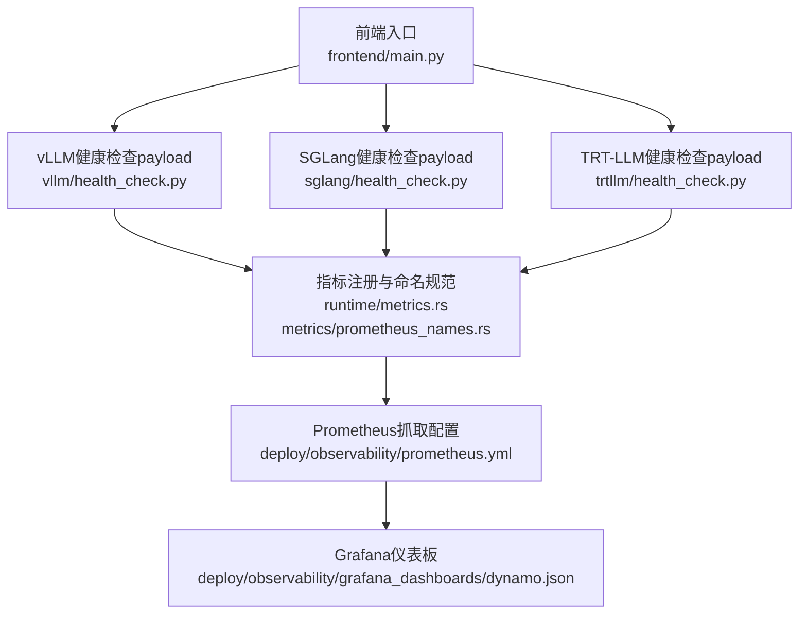
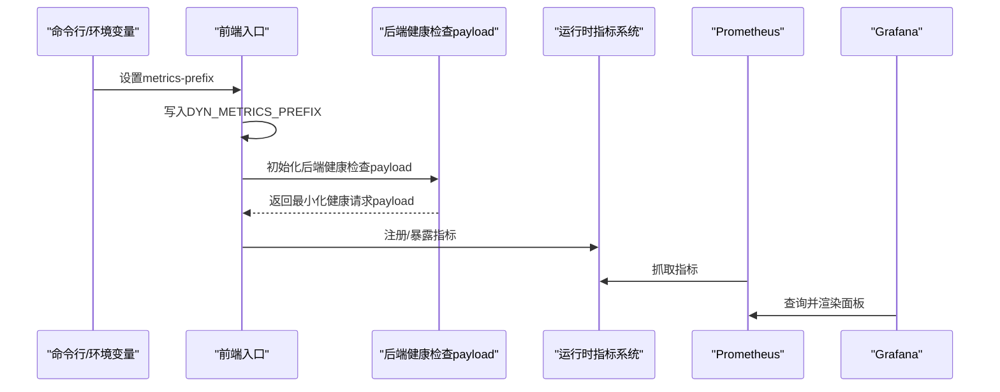
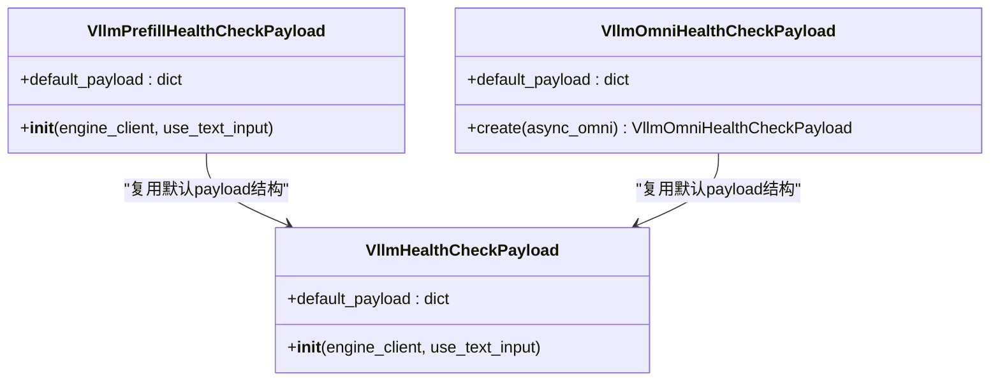
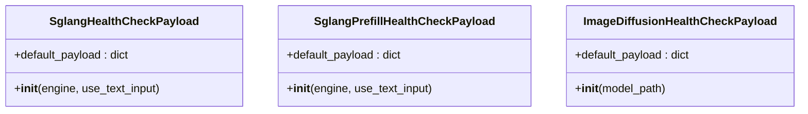
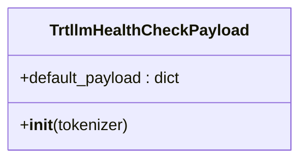
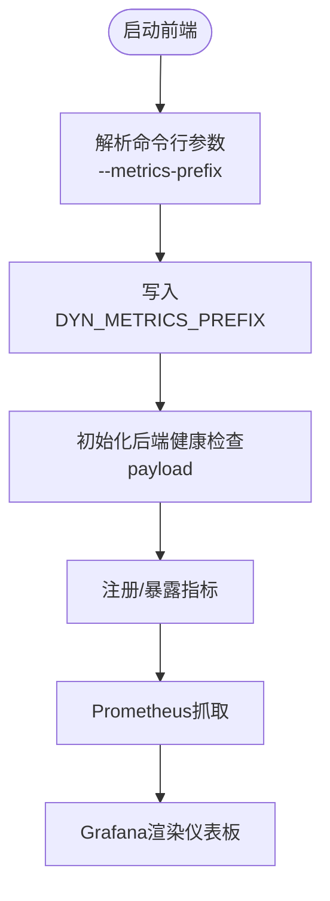
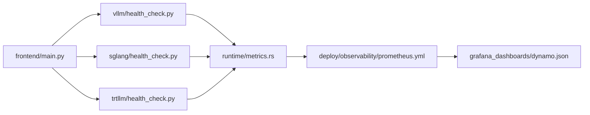

# 健康检查与监控

<cite>
**本文引用的文件**   
- [components/src/dynamo/frontend/main.py](file://components/src/dynamo/frontend/main.py)
- [components/src/dynamo/vllm/health_check.py](file://components/src/dynamo/vllm/health_check.py)
- [components/src/dynamo/sglang/health_check.py](file://components/src/dynamo/sglang/health_check.py)
- [components/src/dynamo/trtllm/health_check.py](file://components/src/dynamo/trtllm/health_check.py)
- [docs/pages/kubernetes/observability/metrics.md](file://docs/pages/kubernetes/observability/metrics.md)
- [deploy/observability/prometheus.yml](file://deploy/observability/prometheus.yml)
- [deploy/observability/grafana-datasources.yml](file://deploy/observability/grafana-datasources.yml)
- [deploy/observability/grafana_dashboards/dynamo.json](file://deploy/observability/grafana_dashboards/dynamo.json)
- [lib/runtime/src/metrics/prometheus_names.rs](file://lib/runtime/src/metrics/prometheus_names.rs)
- [lib/runtime/src/metrics.rs](file://lib/runtime/src/metrics.rs)
- [lib/runtime/src/config.rs](file://lib/runtime/src/config.rs)
- [lib/runtime/src/system_health.rs](file://lib/runtime/src/system_health.rs)
</cite>

## 目录
1. [简介](#简介)
2. [项目结构](#项目结构)
3. [核心组件](#核心组件)
4. [架构总览](#架构总览)
5. [详细组件分析](#详细组件分析)
6. [依赖关系分析](#依赖关系分析)
7. [性能考虑](#性能考虑)
8. [故障排查指南](#故障排查指南)
9. [结论](#结论)
10. [附录](#附录)

## 简介
本文件系统性阐述Dynamo前端服务的健康检查与监控能力，覆盖以下主题：
- 健康检查实现机制：服务状态监控、依赖服务检查与故障检测
- 监控指标采集：HTTP请求统计、响应时间监控与错误率统计
- 配置项说明：metrics-prefix的作用与设置方法
- 监控配置示例：Prometheus指标导出、Grafana仪表板集成与告警规则
- 性能优化策略与故障排查指南

## 项目结构
Dynamo健康检查与监控涉及多个层次：
- 前端入口与参数解析：负责启动HTTP服务、路由配置与指标前缀设置
- 后端引擎健康检查payload：针对不同后端（vLLM、SGLang、TRT-LLM）生成最小化健康请求
- 运行时系统健康与指标注册：统一的指标命名规范、指标解析与系统健康状态管理
- 观测性配置：Prometheus抓取配置、Grafana数据源与仪表板

图表来源
- [components/src/dynamo/frontend/main.py](file://components/src/dynamo/frontend/main.py#L300-L405)
- [components/src/dynamo/vllm/health_check.py](file://components/src/dynamo/vllm/health_check.py#L83-L102)
- [components/src/dynamo/sglang/health_check.py](file://components/src/dynamo/sglang/health_check.py#L50-L85)
- [components/src/dynamo/trtllm/health_check.py](file://components/src/dynamo/trtllm/health_check.py#L51-L91)
- [lib/runtime/src/metrics.rs](file://lib/runtime/src/metrics.rs#L995-L1015)
- [lib/runtime/src/metrics/prometheus_names.rs](file://lib/runtime/src/metrics/prometheus_names.rs#L29-L50)
- [deploy/observability/prometheus.yml](file://deploy/observability/prometheus.yml#L39-L50)
- [deploy/observability/grafana_dashboards/dynamo.json](file://deploy/observability/grafana_dashboards/dynamo.json#L106-L116)

章节来源
- [components/src/dynamo/frontend/main.py](file://components/src/dynamo/frontend/main.py#L300-L405)
- [docs/pages/kubernetes/observability/metrics.md](file://docs/pages/kubernetes/observability/metrics.md#L1-L186)

## 核心组件
- 前端指标前缀配置
  - 前端支持通过命令行参数或环境变量设置指标前缀，用于区分不同实例或部署的指标命名空间
  - 当设置metrics-prefix时，会写入环境变量以供运行时使用
- vLLM/SGLang/TRT-LLM健康检查payload
  - 针对各后端生成最小化、快速完成的健康请求，避免真实推理负载影响
  - 自动从模型tokenizer提取BOS token ID，确保payload与模型一致
- 指标命名规范与解析
  - 统一的指标命名风格，便于Prometheus聚合与Grafana展示
  - 提供指标解析工具，支持从文本格式中解析指标名称、标签与数值
- 系统健康与状态管理
  - 定义健康检查目标结构体，承载实例信息与payload
  - 支持系统健康状态路径与存活路径等配置映射

章节来源
- [components/src/dynamo/frontend/main.py](file://components/src/dynamo/frontend/main.py#L300-L405)
- [components/src/dynamo/vllm/health_check.py](file://components/src/dynamo/vllm/health_check.py#L83-L102)
- [components/src/dynamo/sglang/health_check.py](file://components/src/dynamo/sglang/health_check.py#L50-L85)
- [components/src/dynamo/trtllm/health_check.py](file://components/src/dynamo/trtllm/health_check.py#L51-L91)
- [lib/runtime/src/metrics/prometheus_names.rs](file://lib/runtime/src/metrics/prometheus_names.rs#L29-L50)
- [lib/runtime/src/metrics.rs](file://lib/runtime/src/metrics.rs#L995-L1015)
- [lib/runtime/src/system_health.rs](file://lib/runtime/src/system_health.rs#L29-L34)

## 架构总览
Dynamo前端服务的健康检查与监控流程如下：
- 前端启动时解析参数并设置指标前缀
- 各后端引擎根据自身接口与模型特性构造健康检查payload
- 运行时统一注册与暴露指标，Prometheus按配置抓取
- Grafana通过数据源连接Prometheus并展示仪表板

图表来源
- [components/src/dynamo/frontend/main.py](file://components/src/dynamo/frontend/main.py#L398-L403)
- [components/src/dynamo/vllm/health_check.py](file://components/src/dynamo/vllm/health_check.py#L83-L102)
- [components/src/dynamo/sglang/health_check.py](file://components/src/dynamo/sglang/health_check.py#L50-L85)
- [components/src/dynamo/trtllm/health_check.py](file://components/src/dynamo/trtllm/health_check.py#L51-L91)
- [lib/runtime/src/metrics.rs](file://lib/runtime/src/metrics.rs#L995-L1015)
- [deploy/observability/prometheus.yml](file://deploy/observability/prometheus.yml#L39-L50)
- [deploy/observability/grafana_dashboards/dynamo.json](file://deploy/observability/grafana_dashboards/dynamo.json#L106-L116)

## 详细组件分析

### 健康检查payload设计（vLLM）
- 设计要点
  - 使用最小化采样与停止条件，仅生成1个token，保证快速返回
  - 支持文本输入与token_ids两种形式，后者优先从tokenizer提取BOS token ID
  - 预填充（prefill）场景提供专用payload结构，满足预处理请求格式
- 关键类与方法
  - VllmHealthCheckPayload：构造默认payload
  - VllmPrefillHealthCheckPayload：预填充场景payload
  - 异步获取BOS token（Omni模式）

图表来源
- [components/src/dynamo/vllm/health_check.py](file://components/src/dynamo/vllm/health_check.py#L83-L121)
- [components/src/dynamo/vllm/health_check.py](file://components/src/dynamo/vllm/health_check.py#L153-L197)

章节来源
- [components/src/dynamo/vllm/health_check.py](file://components/src/dynamo/vllm/health_check.py#L53-L121)
- [components/src/dynamo/vllm/health_check.py](file://components/src/dynamo/vllm/health_check.py#L124-L197)

### 健康检查payload设计（SGLang）
- 设计要点
  - 从SGLang引擎的tokenizer提取BOS token ID，若失败则回退为默认值
  - 支持文本输入与token_ids两种形式
  - 预填充场景提供包裹结构，包含sampling_params与request字段
- 关键类与方法
  - SglangHealthCheckPayload
  - SglangPrefillHealthCheckPayload
  - ImageDiffusionHealthCheckPayload：图像扩散场景的最小化请求

图表来源
- [components/src/dynamo/sglang/health_check.py](file://components/src/dynamo/sglang/health_check.py#L50-L85)
- [components/src/dynamo/sglang/health_check.py](file://components/src/dynamo/sglang/health_check.py#L88-L121)
- [components/src/dynamo/sglang/health_check.py](file://components/src/dynamo/sglang/health_check.py#L123-L147)

章节来源
- [components/src/dynamo/sglang/health_check.py](file://components/src/dynamo/sglang/health_check.py#L20-L147)

### 健康检查payload设计（TRT-LLM）
- 设计要点
  - 从TRT-LLM tokenizer提取BOS token ID；对于包装的HuggingFace tokenizer，通过内部对象访问
  - payload包含token_ids、stop_conditions与sampling_options
- 关键类与方法
  - TrtllmHealthCheckPayload

图表来源
- [components/src/dynamo/trtllm/health_check.py](file://components/src/dynamo/trtllm/health_check.py#L51-L91)

章节来源
- [components/src/dynamo/trtllm/health_check.py](file://components/src/dynamo/trtllm/health_check.py#L17-L91)

### 指标前缀与系统健康
- 指标前缀（metrics-prefix）
  - 作用：为前端指标添加统一前缀，便于在多实例或多集群环境下区分与聚合
  - 设置方式：命令行参数--metrics-prefix或环境变量DYN_METRICS_PREFIX
  - 影响范围：影响运行时指标注册与暴露的命名
- 系统健康与状态
  - 定义健康检查目标结构体，包含实例信息与payload
  - 支持系统健康状态路径与存活路径的配置映射

图表来源
- [components/src/dynamo/frontend/main.py](file://components/src/dynamo/frontend/main.py#L398-L403)
- [lib/runtime/src/system_health.rs](file://lib/runtime/src/system_health.rs#L29-L34)

章节来源
- [components/src/dynamo/frontend/main.py](file://components/src/dynamo/frontend/main.py#L300-L405)
- [lib/runtime/src/system_health.rs](file://lib/runtime/src/system_health.rs#L29-L34)

## 依赖关系分析
- 前端到健康检查payload
  - 前端根据后端类型选择对应的payload类，确保payload与后端接口一致
- 健康检查payload到指标系统
  - payload用于触发最小化请求，运行时注册相关指标（如请求总数、延迟、字节数等）
- 指标系统到观测性栈
  - 运行时指标通过统一命名规范暴露，Prometheus按配置抓取，Grafana渲染面板

图表来源
- [components/src/dynamo/frontend/main.py](file://components/src/dynamo/frontend/main.py#L300-L405)
- [components/src/dynamo/vllm/health_check.py](file://components/src/dynamo/vllm/health_check.py#L83-L102)
- [components/src/dynamo/sglang/health_check.py](file://components/src/dynamo/sglang/health_check.py#L50-L85)
- [components/src/dynamo/trtllm/health_check.py](file://components/src/dynamo/trtllm/health_check.py#L51-L91)
- [lib/runtime/src/metrics.rs](file://lib/runtime/src/metrics.rs#L995-L1015)
- [deploy/observability/prometheus.yml](file://deploy/observability/prometheus.yml#L39-L50)
- [deploy/observability/grafana_dashboards/dynamo.json](file://deploy/observability/grafana_dashboards/dynamo.json#L106-L116)

章节来源
- [lib/runtime/src/metrics/prometheus_names.rs](file://lib/runtime/src/metrics/prometheus_names.rs#L29-L50)
- [docs/pages/kubernetes/observability/metrics.md](file://docs/pages/kubernetes/observability/metrics.md#L110-L179)

## 性能考虑
- 健康检查payload最小化
  - 仅生成1个token或极短推理，降低对后端资源的压力
  - 采用固定采样参数，避免动态调度开销
- 指标命名与抓取
  - 统一指标命名规范，减少Prometheus聚合与查询复杂度
  - 合理设置抓取间隔，避免过度频繁抓取导致额外负载
- 前端指标前缀
  - 通过metrics-prefix隔离指标，便于按实例/命名空间聚合，减少无关指标干扰

## 故障排查指南
- 健康检查失败
  - 检查后端payload是否与模型tokenizer一致（BOS token ID）
  - 确认后端接口版本与payload结构匹配（如预填充场景）
- 指标缺失或不更新
  - 确认DYN_METRICS_PREFIX已正确设置且未被前端覆盖
  - 检查Prometheus抓取配置中的job名称与目标地址
- Grafana面板无数据
  - 确认数据源配置正确（Prometheus URL）
  - 检查仪表板查询表达式与指标前缀是否一致
- 系统健康状态异常
  - 检查系统健康路径与存活路径配置映射
  - 查看运行时日志，定位健康检查执行过程中的异常

章节来源
- [components/src/dynamo/vllm/health_check.py](file://components/src/dynamo/vllm/health_check.py#L22-L50)
- [components/src/dynamo/sglang/health_check.py](file://components/src/dynamo/sglang/health_check.py#L20-L47)
- [components/src/dynamo/trtllm/health_check.py](file://components/src/dynamo/trtllm/health_check.py#L17-L48)
- [lib/runtime/src/config.rs](file://lib/runtime/src/config.rs#L273-L274)
- [deploy/observability/prometheus.yml](file://deploy/observability/prometheus.yml#L39-L50)
- [deploy/observability/grafana-datasources.yml](file://deploy/observability/grafana-datasources.yml#L18-L24)
- [deploy/observability/grafana_dashboards/dynamo.json](file://deploy/observability/grafana_dashboards/dynamo.json#L106-L116)

## 结论
Dynamo前端服务通过可配置的指标前缀与标准化的健康检查payload，实现了对多后端引擎的一致健康监测与可观测性支撑。结合Prometheus与Grafana，用户可以快速建立端到端的监控体系，并通过合理的抓取策略与命名规范获得稳定、可扩展的指标视图。

## 附录

### 配置项说明：metrics-prefix
- 作用：为前端指标添加统一前缀，便于多实例/多集群区分与聚合
- 设置方法
  - 命令行：--metrics-prefix
  - 环境变量：DYN_METRICS_PREFIX
- 影响范围：运行时指标注册与暴露的命名

章节来源
- [components/src/dynamo/frontend/main.py](file://components/src/dynamo/frontend/main.py#L300-L405)

### 监控配置示例
- Prometheus抓取配置
  - 示例job名称与目标地址参考：dynamo-frontend、dynamo-backend
- Grafana数据源
  - 数据源名称与URL：Prometheus
- Grafana仪表板
  - Dynamo仪表板包含前端请求速率、首Token时间、令牌间延迟、请求时延、输入/输出序列长度、GPU利用率等面板

章节来源
- [deploy/observability/prometheus.yml](file://deploy/observability/prometheus.yml#L39-L50)
- [deploy/observability/grafana-datasources.yml](file://deploy/observability/grafana-datasources.yml#L18-L24)
- [deploy/observability/grafana_dashboards/dynamo.json](file://deploy/observability/grafana_dashboards/dynamo.json#L106-L116)