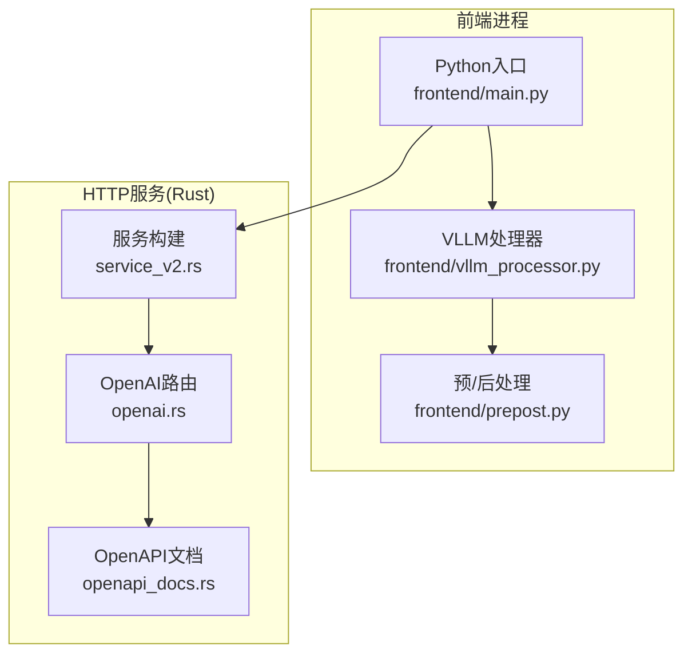
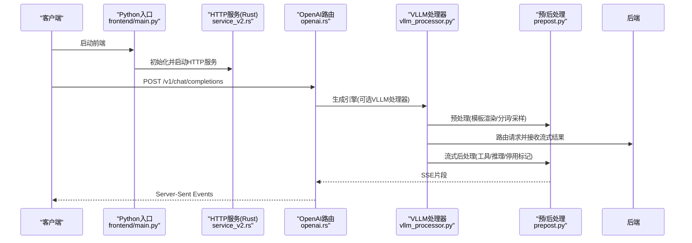
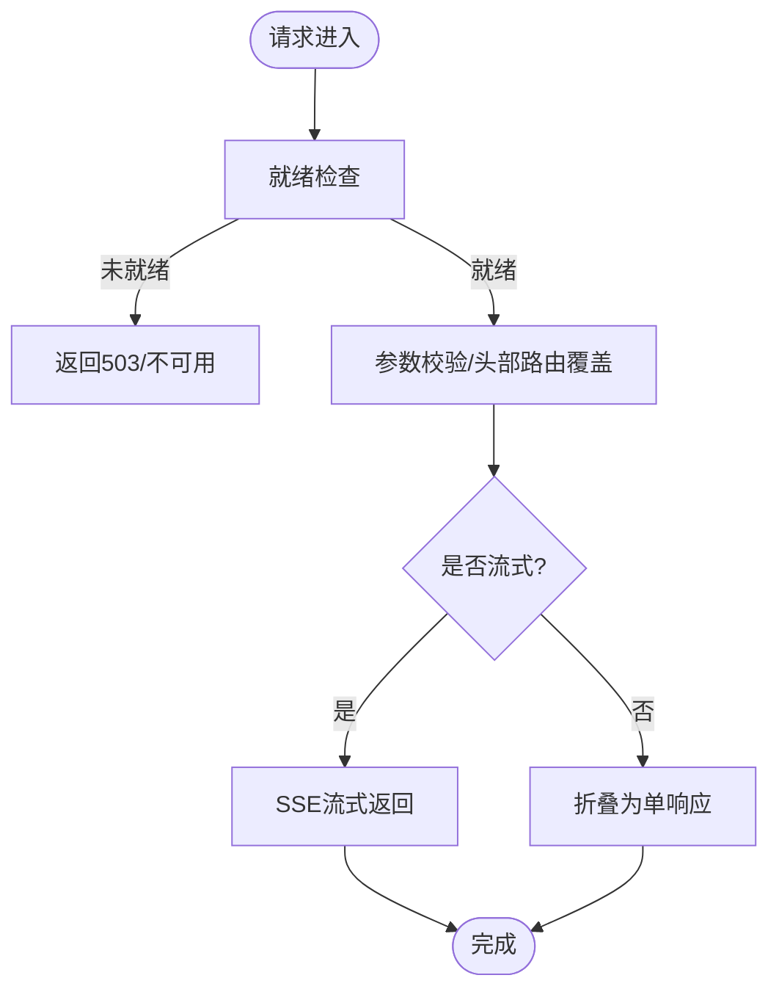
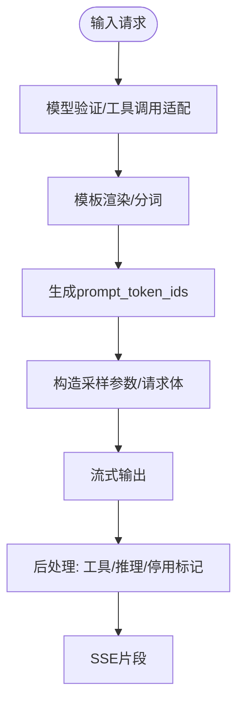
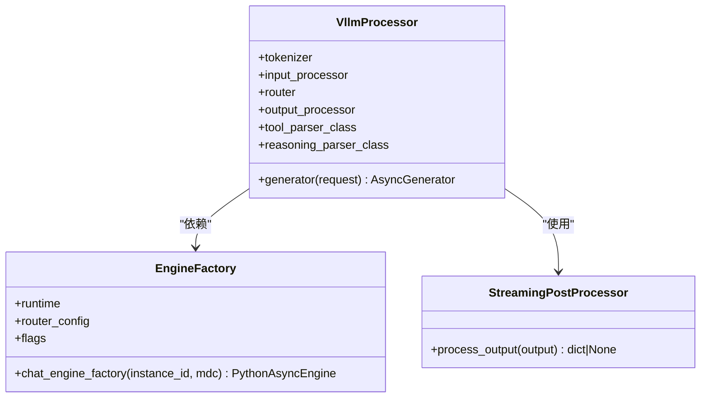
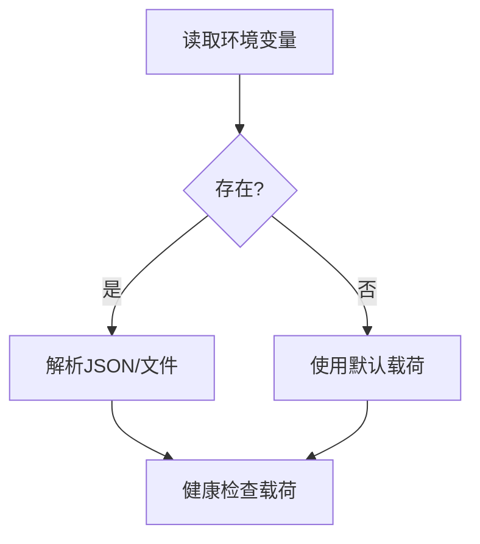
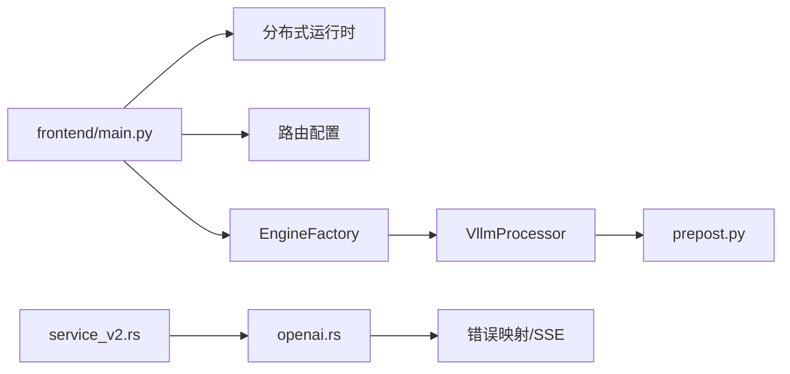

# 前端服务

<cite>
**本文引用的文件**
- [components/src/dynamo/frontend/main.py](file://components/src/dynamo/frontend/main.py)
- [components/src/dynamo/frontend/__main__.py](file://components/src/dynamo/frontend/__main__.py)
- [components/src/dynamo/frontend/prepost.py](file://components/src/dynamo/frontend/prepost.py)
- [components/src/dynamo/frontend/vllm_processor.py](file://components/src/dynamo/frontend/vllm_processor.py)
- [lib/llm/src/http/service/service_v2.rs](file://lib/llm/src/http/service/service_v2.rs)
- [lib/llm/src/http/service/openai.rs](file://lib/llm/src/http/service/openai.rs)
- [lib/llm/src/http/service/openapi_docs.rs](file://lib/llm/src/http/service/openapi_docs.rs)
- [components/src/dynamo/vllm/health_check.py](file://components/src/dynamo/vllm/health_check.py)
- [lib/bindings/python/src/dynamo/health_check.py](file://lib/bindings/python/src/dynamo/health_check.py)
- [tests/frontend/test_vllm.py](file://tests/frontend/test_vllm.py)
</cite>

## 目录
1. [简介](#简介)
2. [项目结构](#项目结构)
3. [核心组件](#核心组件)
4. [架构总览](#架构总览)
5. [详细组件分析](#详细组件分析)
6. [依赖关系分析](#依赖关系分析)
7. [性能考量](#性能考量)
8. [故障排查指南](#故障排查指南)
9. [结论](#结论)
10. [附录：API与配置参考](#附录api与配置参考)

## 简介
本文件面向Dynamo前端服务（Frontend），系统性梳理其作为OpenAI兼容HTTP服务器的实现，涵盖路由处理、请求预处理与后处理、与后端VLLM处理器的集成、健康检查、错误处理策略与性能优化，并提供可操作的配置项与最佳实践。

## 项目结构
前端服务由Python入口模块启动，内部通过Rust HTTP服务承载OpenAI兼容路由；同时提供可选的VLLM本地预/后处理能力。关键目录与文件如下：
- Python入口与主流程：frontend/main.py、frontend/__main__.py
- OpenAI兼容HTTP服务（Rust）：lib/llm/src/http/service/*.rs
- 前端预/后处理（VLLM）：frontend/prepost.py、frontend/vllm_processor.py
- 健康检查（后端vLLM）：components/src/dynamo/vllm/health_check.py 及通用基类 lib/bindings/python/src/dynamo/health_check.py
- 示例测试：tests/frontend/test_vllm.py

**图表来源**
- [components/src/dynamo/frontend/main.py](file://components/src/dynamo/frontend/main.py#L368-L518)
- [components/src/dynamo/frontend/vllm_processor.py](file://components/src/dynamo/frontend/vllm_processor.py#L365-L465)
- [components/src/dynamo/frontend/prepost.py](file://components/src/dynamo/frontend/prepost.py#L1-L318)
- [lib/llm/src/http/service/service_v2.rs](file://lib/llm/src/http/service/service_v2.rs#L147-L505)
- [lib/llm/src/http/service/openai.rs](file://lib/llm/src/http/service/openai.rs#L1526-L1587)
- [lib/llm/src/http/service/openapi_docs.rs](file://lib/llm/src/http/service/openapi_docs.rs#L365-L412)

**章节来源**
- [components/src/dynamo/frontend/main.py](file://components/src/dynamo/frontend/main.py#L1-L518)
- [components/src/dynamo/frontend/__main__.py](file://components/src/dynamo/frontend/__main__.py#L1-L8)
- [lib/llm/src/http/service/service_v2.rs](file://lib/llm/src/http/service/service_v2.rs#L147-L505)

## 核心组件
- HTTP服务与路由
  - Rust侧提供HTTP服务构建器，注册OpenAI兼容路由（聊天补全、补全、嵌入、图片、响应等），支持SSE流式输出与OpenAPI文档。
- 请求处理管线
  - Python前端负责解析参数、初始化分布式运行时、选择路由模式、按需启用VLLM处理器工厂，并将请求交由Rust HTTP服务处理。
- 预/后处理（VLLM）
  - 前端可使用VLLM进行提示模板渲染、分词、采样参数映射、流式后处理与工具调用/推理内容抽取。
- 健康检查
  - 提供通用健康检查载荷基类与vLLM特定实现，支持从环境变量覆盖默认载荷。

**章节来源**
- [lib/llm/src/http/service/openai.rs](file://lib/llm/src/http/service/openai.rs#L1-L280)
- [components/src/dynamo/frontend/main.py](file://components/src/dynamo/frontend/main.py#L368-L518)
- [components/src/dynamo/frontend/vllm_processor.py](file://components/src/dynamo/frontend/vllm_processor.py#L74-L465)
- [components/src/dynamo/vllm/health_check.py](file://components/src/dynamo/vllm/health_check.py#L63-L197)
- [lib/bindings/python/src/dynamo/health_check.py](file://lib/bindings/python/src/dynamo/health_check.py#L63-L105)

## 架构总览
下图展示从前端入口到HTTP服务、再到VLLM处理器与后端的工作流。

**图表来源**
- [components/src/dynamo/frontend/main.py](file://components/src/dynamo/frontend/main.py#L368-L518)
- [lib/llm/src/http/service/service_v2.rs](file://lib/llm/src/http/service/service_v2.rs#L478-L505)
- [lib/llm/src/http/service/openai.rs](file://lib/llm/src/http/service/openai.rs#L711-L745)
- [components/src/dynamo/frontend/vllm_processor.py](file://components/src/dynamo/frontend/vllm_processor.py#L95-L363)
- [components/src/dynamo/frontend/prepost.py](file://components/src/dynamo/frontend/prepost.py#L56-L318)

## 详细组件分析

### HTTP服务器与OpenAI兼容路由
- 路由注册
  - 服务端在构建阶段注册多个OpenAI兼容端点（聊天补全、补全、嵌入、图片、响应），并可按环境变量自定义路径。
- SSE与错误中间件
  - 统一使用SSE返回流式响应；对JSON校验失败场景，将422转换为400以兼容OpenAI生态。
- 文档与可观测性
  - 支持生成OpenAPI规范并通过Swagger UI暴露文档端点。

**图表来源**
- [lib/llm/src/http/service/openai.rs](file://lib/llm/src/http/service/openai.rs#L224-L246)
- [lib/llm/src/http/service/openai.rs](file://lib/llm/src/http/service/openai.rs#L711-L745)
- [lib/llm/src/http/service/openapi_docs.rs](file://lib/llm/src/http/service/openapi_docs.rs#L365-L412)

**章节来源**
- [lib/llm/src/http/service/service_v2.rs](file://lib/llm/src/http/service/service_v2.rs#L478-L505)
- [lib/llm/src/http/service/openai.rs](file://lib/llm/src/http/service/openai.rs#L1526-L1587)
- [lib/llm/src/http/service/openapi_docs.rs](file://lib/llm/src/http/service/openapi_docs.rs#L365-L412)

### 请求预处理与后处理（VLLM）
- 预处理
  - 将OpenAI风格请求模型化，必要时调整工具调用；根据模板与分词器渲染提示，得到引擎可用的prompt与token序列。
- 后处理
  - 流式聚合Delta消息，处理工具调用增量拼接、推理内容抽取、控制字符过滤与停用标记清理，最终生成符合OpenAI格式的SSE片段。

**图表来源**
- [components/src/dynamo/frontend/prepost.py](file://components/src/dynamo/frontend/prepost.py#L56-L118)
- [components/src/dynamo/frontend/prepost.py](file://components/src/dynamo/frontend/prepost.py#L120-L318)

**章节来源**
- [components/src/dynamo/frontend/prepost.py](file://components/src/dynamo/frontend/prepost.py#L1-L318)

### VLLM处理器集成与请求转换
- 处理器职责
  - 使用VLLM InputProcessor/OutputProcessor完成输入/输出转换；将OpenAI请求映射为vLLM内部请求；在KV路由器与普通路由器间切换。
- 请求转换
  - 将OpenAI字段映射到SamplingParams；构造EngineCoreRequest；将多模态数据与缓存盐值传递给后端。
- 响应格式
  - 将后端增量token转为vLLM输出，再经OutputProcessor与前端后处理器，最终生成OpenAI兼容的SSE chunk。

**图表来源**
- [components/src/dynamo/frontend/vllm_processor.py](file://components/src/dynamo/frontend/vllm_processor.py#L74-L465)
- [components/src/dynamo/frontend/prepost.py](file://components/src/dynamo/frontend/prepost.py#L120-L318)

**章节来源**
- [components/src/dynamo/frontend/vllm_processor.py](file://components/src/dynamo/frontend/vllm_processor.py#L74-L465)

### 健康检查实现
- 通用基类
  - 支持从环境变量加载或覆盖健康检查载荷；提供统一的to_dict接口。
- vLLM特定实现
  - 提供文本/令牌两种输入的默认载荷；Omni模式提供异步提取BOS token的实现。
- 使用建议
  - 在容器编排中通过环境变量注入自定义载荷，确保探活与实际工作负载一致。

**图表来源**
- [lib/bindings/python/src/dynamo/health_check.py](file://lib/bindings/python/src/dynamo/health_check.py#L21-L105)
- [components/src/dynamo/vllm/health_check.py](file://components/src/dynamo/vllm/health_check.py#L53-L103)

**章节来源**
- [lib/bindings/python/src/dynamo/health_check.py](file://lib/bindings/python/src/dynamo/health_check.py#L1-L105)
- [components/src/dynamo/vllm/health_check.py](file://components/src/dynamo/vllm/health_check.py#L1-L197)

## 依赖关系分析
- Python前端依赖
  - 分布式运行时、引擎工厂、路由配置；可选VLLM参数解析器。
- HTTP服务依赖
  - OpenAI协议适配层、SSE中间件、OpenAPI文档生成。
- 错误处理耦合
  - HTTP层统一错误映射与SSE错误传播；后端错误事件可被识别并转化为标准错误响应。

**图表来源**
- [components/src/dynamo/frontend/main.py](file://components/src/dynamo/frontend/main.py#L368-L518)
- [components/src/dynamo/frontend/vllm_processor.py](file://components/src/dynamo/frontend/vllm_processor.py#L365-L465)
- [lib/llm/src/http/service/service_v2.rs](file://lib/llm/src/http/service/service_v2.rs#L478-L505)
- [lib/llm/src/http/service/openai.rs](file://lib/llm/src/http/service/openai.rs#L747-L800)

**章节来源**
- [components/src/dynamo/frontend/main.py](file://components/src/dynamo/frontend/main.py#L368-L518)
- [lib/llm/src/http/service/openai.rs](file://lib/llm/src/http/service/openai.rs#L747-L800)

## 性能考量
- 流式传输
  - SSE默认开启，减少首字延迟；连接监控与断开检测避免资源泄露。
- 负载均衡与路由
  - 支持轮询、随机与KV路由器；KV模式可结合事件平面与快照阈值提升一致性与吞吐。
- 体限制与超大负载
  - 默认请求体上限可按环境变量调整，满足长上下文场景。
- 模型发现与懒加载
  - 按需拉取模型权重，降低冷启动成本。

[本节为通用指导，无需列出具体文件来源]

## 故障排查指南
- 常见错误类型
  - 参数校验失败：统一转为400；模型未找到：404；服务过载/不可用：503；内部错误：500。
- 排查步骤
  - 检查HTTP服务就绪状态与SSE连接；确认路由模式与后端可用性；核对健康检查载荷与模型路径。
- 工具与测试
  - 使用测试用例中的负载脚本与端到端验证，定位工具调用与推理内容的流式输出问题。

**章节来源**
- [lib/llm/src/http/service/openai.rs](file://lib/llm/src/http/service/openai.rs#L95-L219)
- [tests/frontend/test_vllm.py](file://tests/frontend/test_vllm.py#L340-L382)

## 结论
Dynamo前端服务以Rust HTTP服务为核心，提供OpenAI兼容路由与SSE流式响应；通过可插拔的VLLM处理器实现高质量的预/后处理；配合灵活的路由与健康检查机制，满足生产级部署需求。建议在高并发与长上下文场景下，结合KV路由与合理的体限制配置，持续观测SSE与指标以优化端到端延迟。

## 附录：API与配置参考

### OpenAI兼容端点
- 路由注册位置
  - 聊天补全：/v1/chat/completions
  - 补全：/v1/completions
  - 嵌入：/v1/embeddings
  - 图片：/v1/images
  - 响应：/v1/responses
- 自定义路径
  - 可通过环境变量覆盖默认路径。

**章节来源**
- [lib/llm/src/http/service/service_v2.rs](file://lib/llm/src/http/service/service_v2.rs#L478-L505)
- [lib/llm/src/http/service/openai.rs](file://lib/llm/src/http/service/openai.rs#L1526-L1587)

### 健康检查配置
- 通用基类
  - 支持从环境变量加载JSON或文件路径；若未设置则使用默认载荷。
- vLLM特定
  - 提供文本/令牌两种输入的默认载荷；Omni模式提供异步BOS token提取。
- 环境变量
  - DYN_HEALTH_CHECK_PAYLOAD 支持JSON字符串或“@/path”文件路径。

**章节来源**
- [lib/bindings/python/src/dynamo/health_check.py](file://lib/bindings/python/src/dynamo/health_check.py#L21-L105)
- [components/src/dynamo/vllm/health_check.py](file://components/src/dynamo/vllm/health_check.py#L53-L197)

### Python前端命令行与环境变量
- 关键参数
  - --http-host/--http-port：HTTP监听地址与端口（支持环境变量DYN_HTTP_HOST/DYN_HTTP_PORT）
  - --tls-cert-path/--tls-key-path：TLS证书与私钥
  - --router-mode：路由模式（round-robin/random/kv）
  - --kv-*：KV路由器相关参数（权重、温度、事件、TTL、树大小、裁剪比例、线程数等）
  - --migration-limit：请求迁移上限
  - --model-name/--model-path：模型名称与路径
  - --metrics-prefix：指标前缀
  - --kserve-grpc-server/--grpc-metrics-port：KServe gRPC服务
  - --store-kv：键值存储后端（etcd/mem/file）
  - --request-plane/--event-plane：请求/事件平面（nats/http/tcp、nats/zmq）
  - --chat-processor：预/后处理引擎（dynamo/vllm）
- 典型组合
  - 使用VLLM处理器时，需确保已安装vLLM并正确传入相应CLI参数。

**章节来源**
- [components/src/dynamo/frontend/main.py](file://components/src/dynamo/frontend/main.py#L82-L365)

### API使用示例（路径引用）
- 工具调用与多轮对话
  - 示例请求结构与期望响应可在以下测试文件中查看：
    - [tests/frontend/test_vllm.py](file://tests/frontend/test_vllm.py#L340-L382)

**章节来源**
- [tests/frontend/test_vllm.py](file://tests/frontend/test_vllm.py#L340-L382)