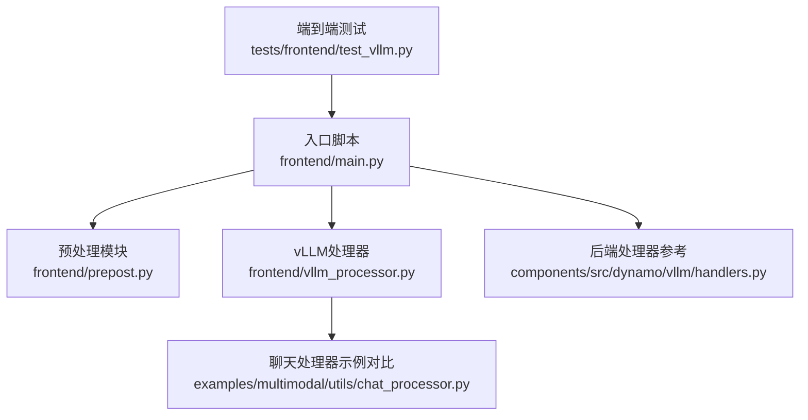
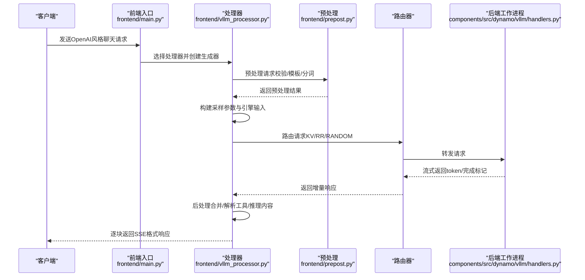
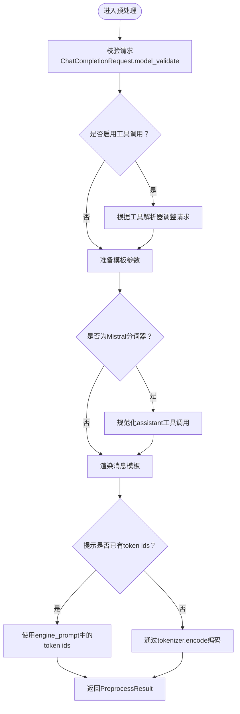
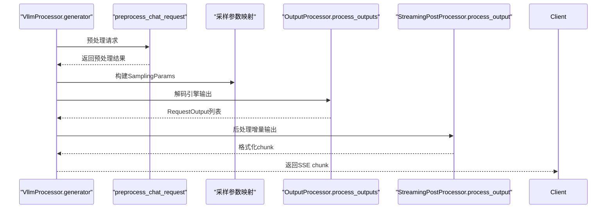
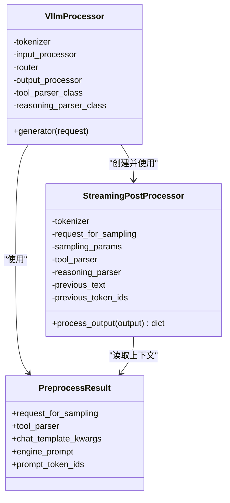

# 请求预处理与后处理

<cite>
**本文引用的文件**
- [prepost.py](file://components/src/dynamo/frontend/prepost.py)
- [vllm_processor.py](file://components/src/dynamo/frontend/vllm_processor.py)
- [main.py](file://components/src/dynamo/frontend/main.py)
- [chat_processor.py](file://examples/multimodal/utils/chat_processor.py)
- [test_vllm.py](file://tests/frontend/test_vllm.py)
- [handlers.py](file://components/src/dynamo/vllm/handlers.py)
</cite>

## 目录
1. [简介](#简介)
2. [项目结构](#项目结构)
3. [核心组件](#核心组件)
4. [架构总览](#架构总览)
5. [详细组件分析](#详细组件分析)
6. [依赖关系分析](#依赖关系分析)
7. [性能考量](#性能考量)
8. [故障排查指南](#故障排查指南)
9. [结论](#结论)
10. [附录](#附录)

## 简介
本文件聚焦Dynamo前端服务的请求预处理与后处理模块，系统性阐述以下内容：
- 预处理：提示模板化、分词与tokenization、输入验证与规范化
- 后处理：响应格式化、流式输出处理、错误响应构建
- 处理器差异：Dynamo处理器与vLLM处理器的区别与切换机制
- 集成实践：与聊天处理器的对接与最佳实践
- 性能优化：关键路径上的优化策略与注意事项

## 项目结构
前端相关代码主要位于components/src/dynamo/frontend目录，包含预处理、vLLM处理器以及入口脚本；同时在examples与tests中提供了与vLLM聊天处理器的对比与端到端验证。

图表来源
- [main.py](file://components/src/dynamo/frontend/main.py#L368-L518)
- [prepost.py](file://components/src/dynamo/frontend/prepost.py#L56-L117)
- [vllm_processor.py](file://components/src/dynamo/frontend/vllm_processor.py#L74-L465)
- [chat_processor.py](file://examples/multimodal/utils/chat_processor.py#L128-L348)
- [handlers.py](file://components/src/dynamo/vllm/handlers.py#L78-L231)

章节来源
- [main.py](file://components/src/dynamo/frontend/main.py#L1-L518)

## 核心组件
- 预处理模块（frontend/prepost.py）
  - 负责将OpenAI风格的聊天请求进行校验、工具调用规范化、模板渲染与分词
  - 输出包含用于采样的请求对象、工具解析器、模板参数、引擎提示与prompt token序列
- vLLM处理器（frontend/vllm_processor.py）
  - 封装了完整的请求生命周期：预处理、采样参数映射、路由转发、后处理与流式输出
  - 支持KV路由器与普通路由器两种模式，并对finish_reason进行统一映射
- 入口脚本（frontend/main.py）
  - 提供命令行参数解析与运行时配置，支持切换“dynamo”或“vllm”聊天处理器
  - 基于RouterMode选择路由策略（轮询、随机、KV）

章节来源
- [prepost.py](file://components/src/dynamo/frontend/prepost.py#L18-L117)
- [vllm_processor.py](file://components/src/dynamo/frontend/vllm_processor.py#L74-L465)
- [main.py](file://components/src/dynamo/frontend/main.py#L82-L366)

## 架构总览
下图展示了从客户端到后端的请求流经前端处理器的关键步骤，以及与聊天处理器的对比位置。

图表来源
- [main.py](file://components/src/dynamo/frontend/main.py#L482-L487)
- [vllm_processor.py](file://components/src/dynamo/frontend/vllm_processor.py#L95-L363)
- [prepost.py](file://components/src/dynamo/frontend/prepost.py#L56-L117)
- [handlers.py](file://components/src/dynamo/vllm/handlers.py#L349-L425)

## 详细组件分析

### 预处理模块（frontend/prepost.py）
- 输入验证与规范化
  - 使用ChatCompletionRequest进行模型级校验，确保字段类型与取值合法
  - 工具调用规范化：针对Mistral等特定分词器，将assistant的tool_calls标准化为列表形式，避免模板渲染异常
- 模板化与分词
  - 通过renderer.render_messages_async进行消息模板渲染，支持工具、文档、推理强度等参数
  - 若引擎提示中已包含prompt_token_ids，则直接使用；否则通过tokenizer.encode生成
- 输出结构
  - 返回PreprocessResult，包含request_for_sampling、tool_parser、chat_template_kwargs、engine_prompt、prompt_token_ids

图表来源
- [prepost.py](file://components/src/dynamo/frontend/prepost.py#L56-L117)

章节来源
- [prepost.py](file://components/src/dynamo/frontend/prepost.py#L18-L117)

### vLLM处理器（frontend/vllm_processor.py）
- 生成器主流程
  - 预处理：调用preprocess_chat_request获取预处理结果
  - 采样参数映射：将OpenAI字段映射到SamplingParams，兼容logprobs等特性
  - 引擎输入构造：将token ids与多模态数据封装为TokensPrompt
  - 路由与转发：根据RouterMode选择KvPushRouter或普通客户端，发送请求
  - 后处理：使用OutputProcessor解码token，再交由StreamingPostProcessor进行增量格式化
- 流式输出与错误处理
  - 对每个增量响应，构造chat.completion.chunk格式，包含delta、finish_reason、logprobs
  - finish_reason映射：统一映射到内部FinishReason枚举，处理error/abort/content_filter等情况
  - 错误兜底：当引擎无输出或异常时，返回标准错误结构
- 处理器差异与切换
  - 通过命令行参数--chat-processor选择“dynamo”或“vllm”
  - “vllm”模式下，前端仍负责预处理与后处理，但后端可采用vLLM原生的InputProcessor/OutputProcessor

图表来源
- [vllm_processor.py](file://components/src/dynamo/frontend/vllm_processor.py#L95-L363)
- [prepost.py](file://components/src/dynamo/frontend/prepost.py#L120-L318)

章节来源
- [vllm_processor.py](file://components/src/dynamo/frontend/vllm_processor.py#L74-L465)

### 与聊天处理器的集成与对比（examples/multimodal/utils/chat_processor.py）
- 预处理对比
  - Dynamo前端使用vLLM的InputProcessor/renderer进行模板渲染与分词
  - 示例聊天处理器通过OpenAIServingChat的_preprocess_chat实现相同目标，便于独立验证
- 流式输出对比
  - Dynamo前端将增量token交给vLLM OutputProcessor解码后再由自定义后处理器格式化
  - 示例聊天处理器直接消费引擎生成器，按需提取delta内容并拼接完整文本

章节来源
- [chat_processor.py](file://examples/multimodal/utils/chat_processor.py#L128-L348)

### 端到端验证（tests/frontend/test_vllm.py）
- 推理强度与工具调用
  - 通过高/低推理强度比较推理内容长度与token数，验证模板参数传递
  - 工具调用测试覆盖单轮与多轮（含tool message），验证工具解析与后续回复
- 测试要点
  - 前端启动与后端worker注册健康检查
  - 正确返回choices与usage信息，断言推理内容与工具调用命中

章节来源
- [test_vllm.py](file://tests/frontend/test_vllm.py#L225-L433)

## 依赖关系分析
- 组件耦合
  - VllmProcessor依赖TokenizerLike、InputProcessor、OutputProcessor、KvPushRouter或普通客户端
  - StreamingPostProcessor依赖tokenizer、SamplingParams、tool_parser与reasoning_parser
- 外部依赖
  - vLLM的InputProcessor/OutputProcessor、SamplingParams、EngineCoreOutput
  - Dynamo的RouterConfig、RouterMode、KvPushRouter

图表来源
- [vllm_processor.py](file://components/src/dynamo/frontend/vllm_processor.py#L74-L255)
- [prepost.py](file://components/src/dynamo/frontend/prepost.py#L18-L117)

章节来源
- [vllm_processor.py](file://components/src/dynamo/frontend/vllm_processor.py#L74-L255)
- [prepost.py](file://components/src/dynamo/frontend/prepost.py#L18-L117)

## 性能考量
- 分词与模板渲染
  - 在Mistral分词器场景下，提前规范化assistant工具调用，避免模板渲染重复尝试导致的开销
  - 若engine_prompt已包含token ids，直接复用以减少encode成本
- 采样参数映射
  - 仅映射OpenAI兼容字段，避免不必要的参数拷贝与类型转换
  - logprobs在分布式推理模式下不支持，需发出警告并跳过
- 流式输出
  - OutputProcessor已内置停止字符串/标记裁剪，避免二次解码引入停用符
  - 合并增量delta时，优先保留content与reasoning内容，减少空chunk产生
- 路由与后处理
  - KV路由器在无事件模式下可通过TTL/树大小阈值控制内存占用
  - 后处理阶段尽量保持轻量，避免在循环内执行昂贵操作

[本节为通用指导，无需列出具体文件来源]

## 故障排查指南
- 无效n值
  - 当SamplingParams.n!=1时，前端直接返回错误响应，提示仅支持n=1
- 引擎无输出
  - 若engine_response缺少token_ids，前端返回标准错误chunk并终止流
- finish_reason映射
  - 将外部finish_reason映射为内部枚举，对error/abort/content_filter进行特殊处理
- 日志与可观测性
  - 关注日志中关于logprobs不支持、未知finish_reason等告警
  - 在KV路由器场景下，留意TTL/树修剪参数对吞吐的影响

章节来源
- [vllm_processor.py](file://components/src/dynamo/frontend/vllm_processor.py#L185-L302)
- [vllm_processor.py](file://components/src/dynamo/frontend/vllm_processor.py#L58-L71)

## 结论
- Dynamo前端通过明确的预处理与后处理边界，实现了与vLLM生态的无缝衔接
- vLLM处理器在保持一致的OpenAI接口语义的同时，充分利用vLLM的输入/输出处理能力
- 通过命令行开关可灵活切换处理器，满足不同部署与验证需求
- 建议在生产环境中结合KV路由器参数与日志监控，持续优化吞吐与延迟

[本节为总结性内容，无需列出具体文件来源]

## 附录

### 切换机制与最佳实践
- 切换处理器
  - 通过--chat-processor参数选择“dynamo”或“vllm”，前端入口会据此注入对应的EngineFactory
- 最佳实践
  - 在需要严格控制前后处理行为时使用“dynamo”处理器
  - 在追求与vLLM生态一致的体验时使用“vllm”处理器
  - 对于工具调用与推理内容，建议在预处理阶段完成参数传递，在后处理阶段完成增量解析与格式化

章节来源
- [main.py](file://components/src/dynamo/frontend/main.py#L482-L487)
- [vllm_processor.py](file://components/src/dynamo/frontend/vllm_processor.py#L455-L465)