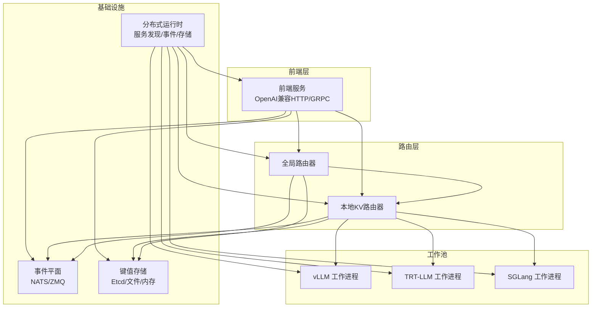
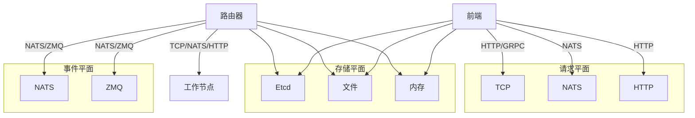
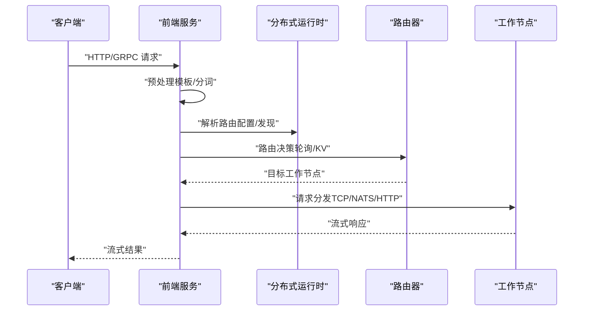
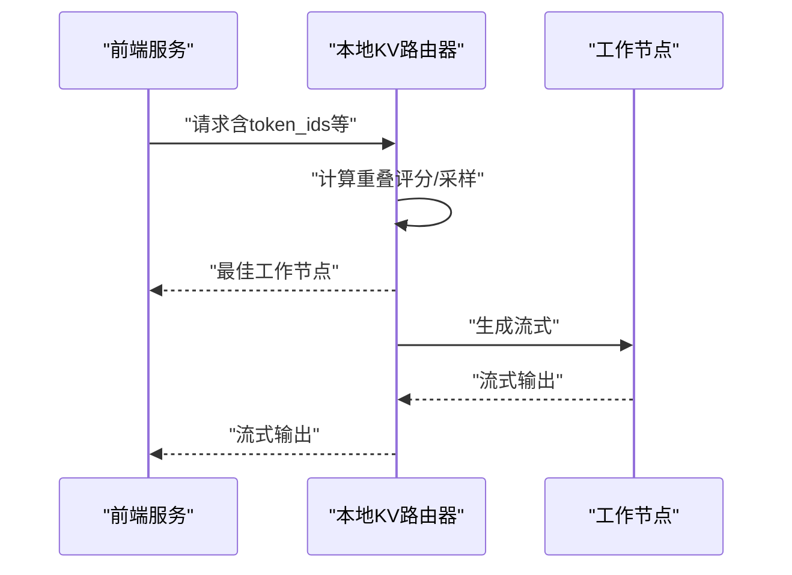
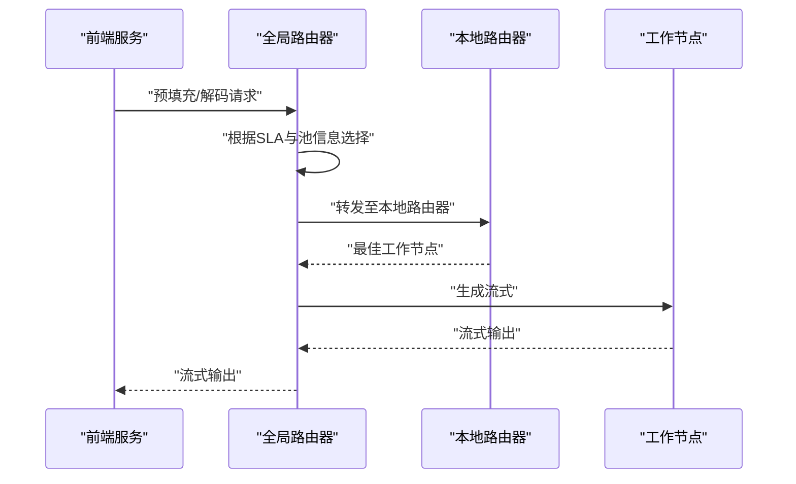
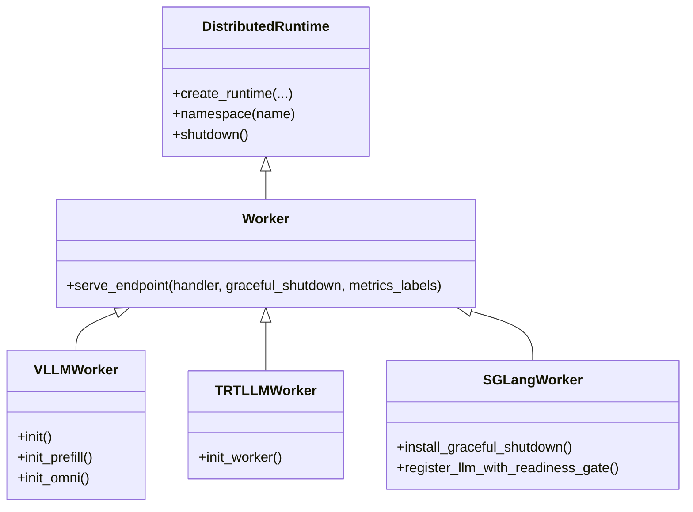
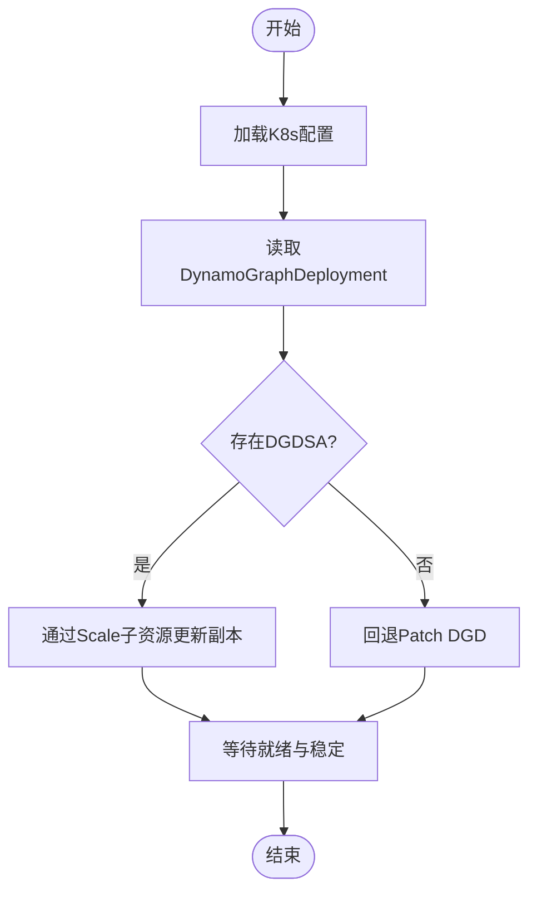
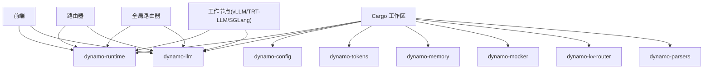
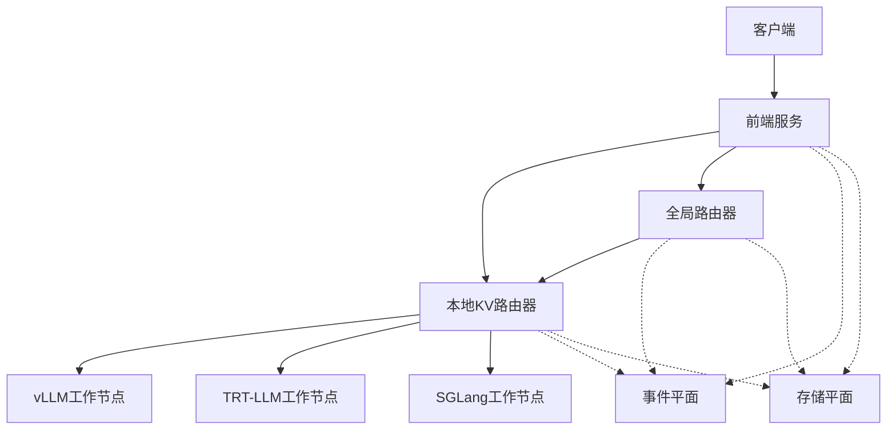

# 核心组件架构

<cite>
**本文引用的文件**
- [components/src/dynamo/frontend/main.py](file://components/src/dynamo/frontend/main.py)
- [components/src/dynamo/router/__main__.py](file://components/src/dynamo/router/__main__.py)
- [components/src/dynamo/global_router/__main__.py](file://components/src/dynamo/global_router/__main__.py)
- [components/src/dynamo/vllm/main.py](file://components/src/dynamo/vllm/main.py)
- [components/src/dynamo/trtllm/main.py](file://components/src/dynamo/trtllm/main.py)
- [components/src/dynamo/sglang/main.py](file://components/src/dynamo/sglang/main.py)
- [lib/runtime/src/lib.rs](file://lib/runtime/src/lib.rs)
- [lib/llm/src/lib.rs](file://lib/llm/src/lib.rs)
- [Cargo.toml](file://Cargo.toml)
- [components/src/dynamo/planner/kube.py](file://components/src/dynamo/planner/kube.py)
- [components/src/dynamo/planner/planner_connector.py](file://components/src/dynamo/planner/planner_connector.py)
- [README.md](file://README.md)
</cite>

## 目录
1. [引言](#引言)
2. [项目结构](#项目结构)
3. [核心组件](#核心组件)
4. [架构总览](#架构总览)
5. [组件详细分析](#组件详细分析)
6. [依赖关系分析](#依赖关系分析)
7. [性能考量](#性能考量)
8. [故障排查指南](#故障排查指南)
9. [结论](#结论)
10. [附录](#附录)

## 引言
本文件面向Dynamo核心组件架构，聚焦于高层设计、架构模式与系统边界，系统性阐述前端服务（Frontend）、路由器（Router）、全局路由器（Global Router）、规划器（Planner）与工作池（Worker Pool）等核心组件的职责、交互与数据流。文档同时覆盖通信机制、集成模式、技术决策与权衡、基础设施与可扩展性、部署拓扑以及安全、可观测性与灾难恢复等横切关注点，并给出技术栈、第三方依赖与版本兼容性说明。

## 项目结构
Dynamo采用“Rust内核 + Python扩展”的混合架构：核心运行时与分布式能力由Rust库提供，Python侧负责组件编排、后端适配与运维工具。关键模块包括：
- 前端服务：统一入口，提供OpenAI兼容HTTP/GRPC接口、预处理、路由与发现。
- 路由器：支持轮询、随机与KV感知路由，具备事件平面与状态树管理。
- 全局路由器：在多池/多命名空间场景下进行分层路由与注册。
- 规划器：基于SLA与资源画像的动态调度与扩缩容。
- 工作池：以组件形式承载不同后端（vLLM、TensorRT-LLM、SGLang），通过统一运行时进行服务注册与请求分发。

图表来源
- [components/src/dynamo/frontend/main.py](file://components/src/dynamo/frontend/main.py#L368-L518)
- [components/src/dynamo/router/__main__.py](file://components/src/dynamo/router/__main__.py#L270-L359)
- [components/src/dynamo/global_router/__main__.py](file://components/src/dynamo/global_router/__main__.py#L91-L180)
- [components/src/dynamo/vllm/main.py](file://components/src/dynamo/vllm/main.py#L99-L191)
- [components/src/dynamo/trtllm/main.py](file://components/src/dynamo/trtllm/main.py#L29-L51)
- [components/src/dynamo/sglang/main.py](file://components/src/dynamo/sglang/main.py#L191-L200)
- [lib/runtime/src/lib.rs](file://lib/runtime/src/lib.rs#L1-L62)

章节来源
- [README.md](file://README.md#L63-L70)

## 核心组件
- 前端服务（Frontend）
  - 提供OpenAI兼容HTTP/GRPC接口，内置预处理（提示模板与分词）与路由选择（轮询、随机、KV感知）。
  - 支持TLS、KServe gRPC、指标前缀配置、请求迁移限制、多请求平面（NATS/TCP/HTTP）与事件平面（NATS/ZMQ）。
  - 通过分布式运行时完成服务注册、发现与事件订阅。

- 路由器（Router）
  - 本地KV感知路由器，支持基于KV缓存重用的重叠评分与温度采样，可选事件驱动或TTL预测模式。
  - 支持副本同步、快照阈值、活跃块跟踪、输出块跟踪与并发事件线程数。
  - 可作为独立服务对外暴露生成与最佳工作节点查询端点。

- 全局路由器（Global Router）
  - 在多池/多命名空间场景中进行分层路由，结合SLA目标（TTFT/ITL）选择预填充/解码池。
  - 同时注册为预填充与解码工作节点，内部连接本地路由器实现跨池调度。

- 规划器（Planner）
  - 提供Kubernetes API封装，支持按DynamoGraphDeployment更新副本数、等待就绪与稳定性判断。
  - 通过抽象接口定义组件增删能力，便于与Operator或外部系统集成。

- 工作池（Worker Pool）
  - 统一由分布式运行时管理，各后端（vLLM、TRT-LLM、SGLang）以组件形式注册端点。
  - 支持多进程/多节点、非领导节点仅参与度量与事件转发、优雅停机与信号链路。

章节来源
- [components/src/dynamo/frontend/main.py](file://components/src/dynamo/frontend/main.py#L82-L366)
- [components/src/dynamo/router/__main__.py](file://components/src/dynamo/router/__main__.py#L156-L267)
- [components/src/dynamo/global_router/__main__.py](file://components/src/dynamo/global_router/__main__.py#L39-L88)
- [components/src/dynamo/planner/kube.py](file://components/src/dynamo/planner/kube.py#L40-L226)
- [components/src/dynamo/planner/planner_connector.py](file://components/src/dynamo/planner/planner_connector.py#L19-L30)
- [components/src/dynamo/vllm/main.py](file://components/src/dynamo/vllm/main.py#L99-L191)
- [components/src/dynamo/trtllm/main.py](file://components/src/dynamo/trtllm/main.py#L29-L51)
- [components/src/dynamo/sglang/main.py](file://components/src/dynamo/sglang/main.py#L191-L200)

## 架构总览
Dynamo采用“请求平面 + 事件平面 + 键值存储”的三层基础设施：
- 请求平面：TCP优先，支持NATS/HTTP，用于从路由器到工作节点的请求分发。
- 事件平面：NATS或ZMQ，用于KV事件发布/订阅与跨实例一致性。
- 键值存储：Etcd/文件/内存，用于服务发现与元数据持久化。

图表来源
- [components/src/dynamo/frontend/main.py](file://components/src/dynamo/frontend/main.py#L404-L418)
- [components/src/dynamo/router/__main__.py](file://components/src/dynamo/router/__main__.py#L156-L267)

## 组件详细分析

### 前端服务（Frontend）
- 职责
  - 提供OpenAI兼容HTTP/GRPC接口。
  - 预处理：提示模板与分词。
  - 路由：轮询、随机或KV感知路由；支持请求迁移与多请求平面。
  - 发现与注册：通过分布式运行时与键值存储进行服务发现。
- 关键参数
  - 端口、TLS证书与密钥、路由模式、KV权重与温度、事件平面、请求平面、指标前缀、KServe gRPC开关等。
- 数据流
  - 解析命令行 → 初始化分布式运行时 → 构造路由配置 → 创建引擎 → 启动HTTP/GRPC输入循环。

图表来源
- [components/src/dynamo/frontend/main.py](file://components/src/dynamo/frontend/main.py#L368-L518)

章节来源
- [components/src/dynamo/frontend/main.py](file://components/src/dynamo/frontend/main.py#L82-L366)

### 本地KV路由器（Router）
- 职责
  - 基于KV缓存重用评分与温度采样选择最优工作节点。
  - 支持事件驱动（NATS/ZMQ）与TTL预测两种模式；可启用副本同步、快照与活跃块跟踪。
- 关键参数
  - 重叠评分权重、温度、是否使用KV事件、TTL、最大树大小、修剪目标比例、事件线程数等。
- 数据流
  - 初始化 → 解析端点路径 → 获取工作节点客户端 → 构建KV推送路由器 → 暴露生成与最佳工作节点查询端点。

图表来源
- [components/src/dynamo/router/__main__.py](file://components/src/dynamo/router/__main__.py#L31-L154)

章节来源
- [components/src/dynamo/router/__main__.py](file://components/src/dynamo/router/__main__.py#L156-L267)

### 全局路由器（Global Router）
- 职责
  - 多池/多命名空间场景下的分层路由，结合SLA目标（TTFT/ITL）选择预填充/解码池。
  - 注册为预填充与解码工作节点，内部连接本地路由器。
- 关键参数
  - 配置文件路径、模型名、命名空间、组件名、默认TTFT/ITL目标等。
- 数据流
  - 初始化 → 加载配置 → 连接本地路由器 → 注册为预填充/解码端点 → 并发服务两个端点。

图表来源
- [components/src/dynamo/global_router/__main__.py](file://components/src/dynamo/global_router/__main__.py#L91-L180)

章节来源
- [components/src/dynamo/global_router/__main__.py](file://components/src/dynamo/global_router/__main__.py#L39-L88)

### 工作池（Worker Pool）
- vLLM工作进程
  - 支持多模态编码/解码、预填充/解码工作节点、全栈Omni模式、检查点与睡眠模式。
  - 通过分布式运行时创建、端点初始化与优雅停机。
- TRT-LLM工作进程
  - 基于命令行参数初始化工作节点，统一接入分布式运行时。
- SGLang工作进程
  - 支持图像扩散、嵌入、多模态等任务；非领导节点仅参与度量与事件转发。
- 共同特性
  - 信号处理与优雅停机、多进程Prometheus指标收集、KV事件发布与订阅。

图表来源
- [lib/runtime/src/lib.rs](file://lib/runtime/src/lib.rs#L1-L62)
- [components/src/dynamo/vllm/main.py](file://components/src/dynamo/vllm/main.py#L99-L191)
- [components/src/dynamo/trtllm/main.py](file://components/src/dynamo/trtllm/main.py#L29-L51)
- [components/src/dynamo/sglang/main.py](file://components/src/dynamo/sglang/main.py#L92-L189)

章节来源
- [components/src/dynamo/vllm/main.py](file://components/src/dynamo/vllm/main.py#L99-L191)
- [components/src/dynamo/trtllm/main.py](file://components/src/dynamo/trtllm/main.py#L29-L51)
- [components/src/dynamo/sglang/main.py](file://components/src/dynamo/sglang/main.py#L191-L200)

### 规划器（Planner）
- Kubernetes API封装
  - 获取当前命名空间、读取DynamoGraphDeployment、更新副本（DGDSA优先，回退DGD）、等待就绪与稳定性判断。
- 抽象接口
  - 定义组件增删能力，便于与Operator或外部系统集成。

图表来源
- [components/src/dynamo/planner/kube.py](file://components/src/dynamo/planner/kube.py#L40-L226)

章节来源
- [components/src/dynamo/planner/kube.py](file://components/src/dynamo/planner/kube.py#L40-L226)
- [components/src/dynamo/planner/planner_connector.py](file://components/src/dynamo/planner/planner_connector.py#L19-L30)

## 依赖关系分析
- 语言与构建
  - 工作区采用Rust（Cargo）与Python（Poetry/uv）双栈；Rust侧提供高性能运行时与LLM抽象，Python侧提供组件编排与后端适配。
- 外部依赖
  - NATS（异步）、ZMQ、Etcd、Prometheus、OpenTelemetry、Tokio生态等。
- 组件耦合
  - 前端与路由器通过分布式运行时耦合；路由器与工作节点通过请求/事件平面耦合；全局路由器作为上层协调者连接多个本地路由器。

图表来源
- [Cargo.toml](file://Cargo.toml#L4-L58)
- [lib/runtime/src/lib.rs](file://lib/runtime/src/lib.rs#L1-L62)
- [lib/llm/src/lib.rs](file://lib/llm/src/lib.rs#L1-L329)

章节来源
- [Cargo.toml](file://Cargo.toml#L1-L147)
- [lib/runtime/src/lib.rs](file://lib/runtime/src/lib.rs#L1-L62)
- [lib/llm/src/lib.rs](file://lib/llm/src/lib.rs#L1-L329)

## 性能考量
- 请求平面选择
  - TCP为首选，NATS/HTTP用于特定场景；KV事件开启时建议使用NATS以获得更低延迟与更强一致性。
- 路由策略
  - KV感知路由可显著减少重复KV计算；温度采样与活跃块跟踪有助于负载均衡；事件线程数可提升高并发吞吐。
- 工作池与后端
  - vLLM适合广泛功能与多模态；TRT-LLM追求极致性能；SGLang在多任务与调度灵活性方面表现突出。
- 指标与可观测性
  - 多进程Prometheus指标收集、OpenTelemetry追踪与Grafana仪表盘支持，便于端到端性能分析。

## 故障排查指南
- 前端
  - TLS参数必须成对提供；请求迁移限制需在合理范围内；注意前端不暴露系统指标服务器端口。
- 路由器
  - 当禁用KV事件时，需设置TTL、最大树大小与修剪目标比例；启用副本同步时需确保NATS JetStream可用。
- 工作池
  - 非领导节点仅参与度量与事件转发；优雅停机需正确安装信号处理器；多进程指标需配置Multiprocess Collector。
- 规划器
  - 若未找到DGDSA，将自动回退到DGD Patch；等待就绪时长可调，避免误判超时。

章节来源
- [components/src/dynamo/frontend/main.py](file://components/src/dynamo/frontend/main.py#L360-L366)
- [components/src/dynamo/router/__main__.py](file://components/src/dynamo/router/__main__.py#L194-L265)
- [components/src/dynamo/vllm/main.py](file://components/src/dynamo/vllm/main.py#L193-L200)
- [components/src/dynamo/planner/kube.py](file://components/src/dynamo/planner/kube.py#L96-L134)

## 结论
Dynamo通过“请求/事件/存储”三层基础设施与“前端-路由器-工作池-规划器”的清晰分层，实现了高性能、低延迟与强一致性的分布式推理框架。其KV感知路由与多后端适配能力在多节点、多池场景下提供了卓越的吞吐与灵活性；同时，完善的可观测性与运维工具链保障了生产级可靠性与可扩展性。

## 附录

### 系统上下文图

图表来源
- [components/src/dynamo/frontend/main.py](file://components/src/dynamo/frontend/main.py#L368-L518)
- [components/src/dynamo/router/__main__.py](file://components/src/dynamo/router/__main__.py#L270-L359)
- [components/src/dynamo/global_router/__main__.py](file://components/src/dynamo/global_router/__main__.py#L91-L180)

### 技术栈与版本兼容性
- 语言与包管理
  - Rust（Tokio、Axum、Hyper、OpenTelemetry、Prometheus等）
  - Python（uv/PyPI，后端适配）
- 第三方依赖
  - NATS（异步NATS）、ZMQ、Etcd、OpenTelemetry、Prometheus、Grafana、Tempo等
- 版本与兼容性
  - 详见工作区配置与各后端文档；容器镜像提供后端兼容矩阵与示例。

章节来源
- [Cargo.toml](file://Cargo.toml#L60-L134)
- [README.md](file://README.md#L113-L154)