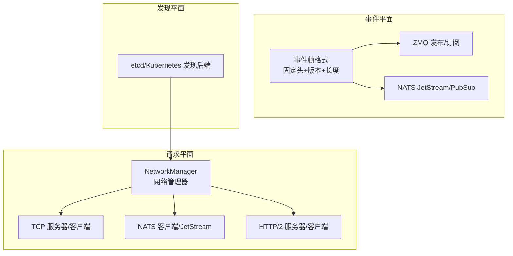
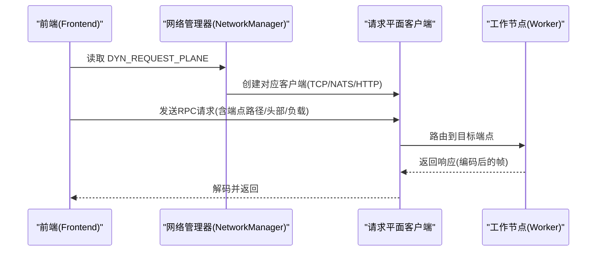
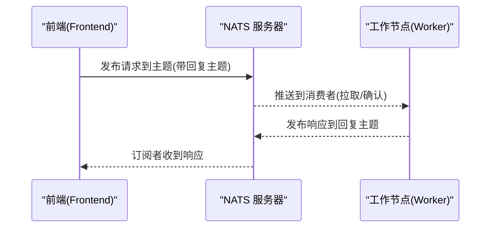
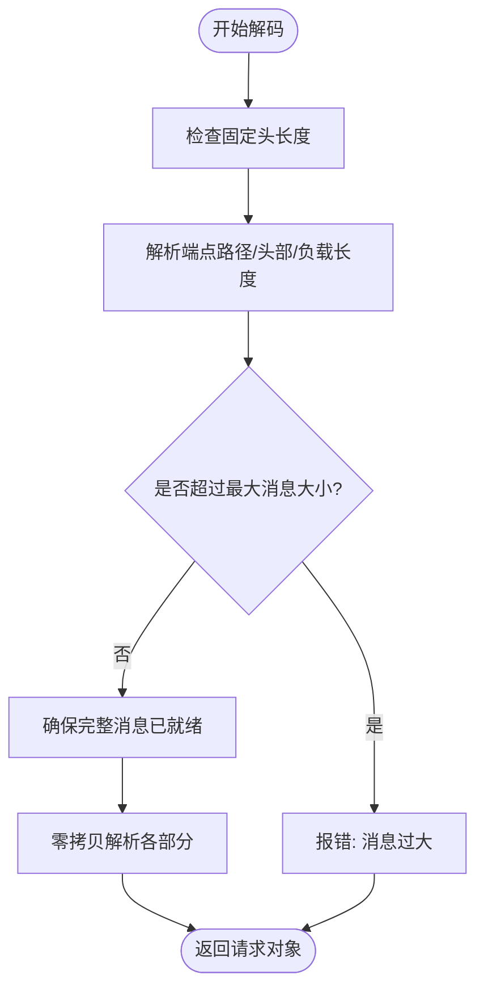
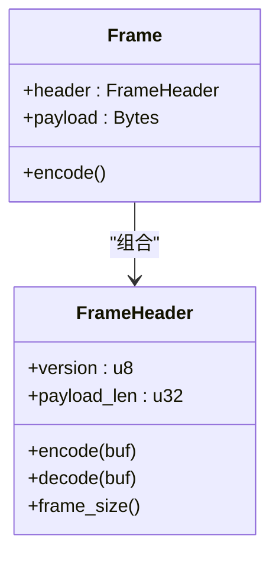
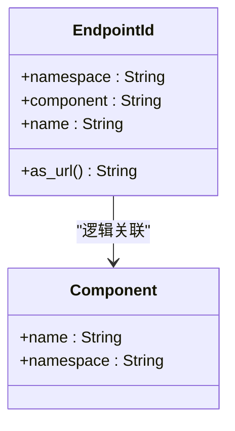
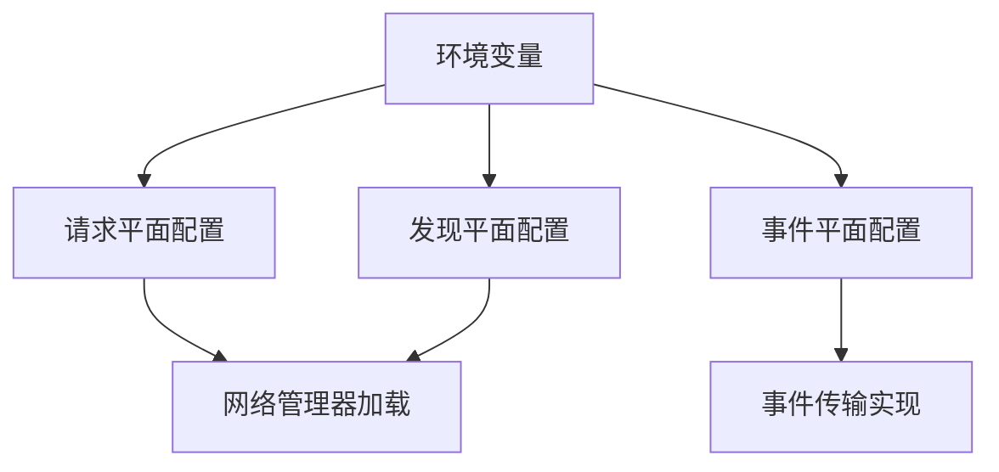
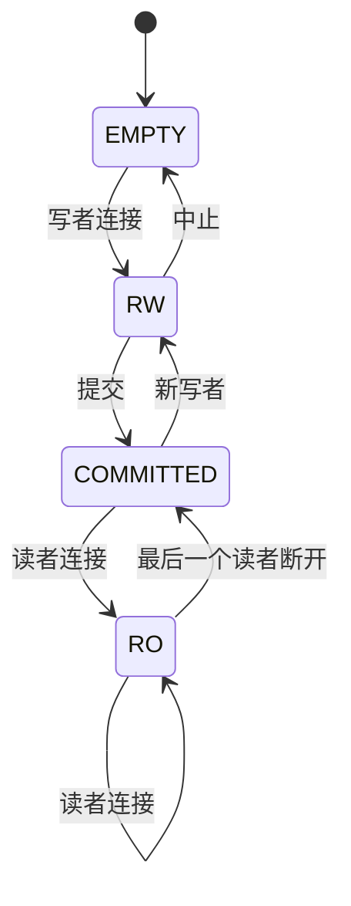
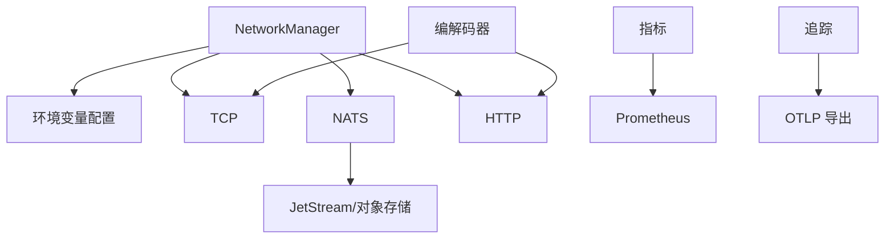

# 组件通信机制

<cite>
**本文引用的文件**
- [lib/runtime/src/transports/nats.rs](file://lib/runtime/src/transports/nats.rs)
- [lib/runtime/src/pipeline/network/manager.rs](file://lib/runtime/src/pipeline/network/manager.rs)
- [lib/runtime/src/pipeline/network/ingress/nats_server.rs](file://lib/runtime/src/pipeline/network/ingress/nats_server.rs)
- [lib/runtime/src/pipeline/network/egress/addressed_router.rs](file://lib/runtime/src/pipeline/network/egress/addressed_router.rs)
- [lib/runtime/src/pipeline/network/codec.rs](file://lib/runtime/src/pipeline/network/codec.rs)
- [lib/runtime/src/pipeline/network/codec/two_part.rs](file://lib/runtime/src/pipeline/network/codec/two_part.rs)
- [lib/runtime/src/pipeline/network/codec/zero_copy_decoder.rs](file://lib/runtime/src/pipeline/network/codec/zero_copy_decoder.rs)
- [lib/runtime/src/transports/event_plane/frame.rs](file://lib/runtime/src/transports/event_plane/frame.rs)
- [lib/runtime/src/protocols.rs](file://lib/runtime/src/protocols.rs)
- [lib/runtime/src/metrics.rs](file://lib/runtime/src/metrics.rs)
- [docs/pages/design-docs/request-plane.md](file://docs/pages/design-docs/request-plane.md)
- [docs/pages/design-docs/event-plane.md](file://docs/pages/design-docs/event-plane.md)
- [docs/pages/design-docs/discovery-plane.md](file://docs/pages/design-docs/discovery-plane.md)
- [docs/pages/observability/tracing.md](file://docs/pages/observability/tracing.md)
- [lib/gpu_memory_service/README.md](file://lib/gpu_memory_service/README.md)
- [lib/gpu_memory_service/server/locking.py](file://lib/gpu_memory_service/server/locking.py)
- [components/src/dynamo/planner/utils/planner_core.py](file://components/src/dynamo/planner/utils/planner_core.py)
- [components/src/dynamo/planner/utils/trace_data_extractor.py](file://components/src/dynamo/planner/utils/trace_data_extractor.py)
</cite>

## 目录
1. [引言](#引言)
2. [项目结构](#项目结构)
3. [核心组件](#核心组件)
4. [架构总览](#架构总览)
5. [详细组件分析](#详细组件分析)
6. [依赖关系分析](#依赖关系分析)
7. [性能考虑](#性能考虑)
8. [故障排查指南](#故障排查指南)
9. [结论](#结论)
10. [附录](#附录)

## 引言
本文件系统性梳理Dynamo组件间通信机制，覆盖请求平面与事件平面的协议、消息传递模式、数据流、路径管理、链路追踪与指标采集、配置管理与参数传递、状态同步、网络拓扑与性能优化、安全机制、错误处理与故障恢复等。文档以代码为依据，提供分层讲解与可视化图示，帮助读者快速理解并高效运维。

## 项目结构
Dynamo的通信体系由“请求平面（Request Plane）”和“事件平面（Event Plane）”构成，分别负责服务间RPC请求与近实时事件分发；同时通过“发现平面（Discovery Plane）”完成服务注册与发现。运行时在lib/runtime中抽象出统一的网络管理器，按环境变量选择具体传输实现（TCP/NATS/HTTP），并在组件层提供端点与命名空间语义。

图表来源
- [lib/runtime/src/pipeline/network/manager.rs](file://lib/runtime/src/pipeline/network/manager.rs#L161-L182)
- [docs/pages/design-docs/request-plane.md](file://docs/pages/design-docs/request-plane.md#L195-L213)
- [docs/pages/design-docs/event-plane.md](file://docs/pages/design-docs/event-plane.md#L20-L30)
- [docs/pages/design-docs/discovery-plane.md](file://docs/pages/design-docs/discovery-plane.md#L13-L21)

章节来源
- [docs/pages/design-docs/request-plane.md](file://docs/pages/design-docs/request-plane.md#L1-L60)
- [docs/pages/design-docs/event-plane.md](file://docs/pages/design-docs/event-plane.md#L1-L40)
- [docs/pages/design-docs/discovery-plane.md](file://docs/pages/design-docs/discovery-plane.md#L1-L40)

## 核心组件
- 网络管理器：集中读取请求平面模式与传输配置，创建对应服务器/客户端，屏蔽底层差异。
- NATS传输：支持JetStream队列、对象存储、广播统计等能力，用于请求与事件传输。
- 编解码器：定义请求/响应二进制帧格式与零拷贝解码流程，保障大消息与高吞吐。
- 事件帧：事件平面采用固定头+版本+长度的二进制帧，便于边界检测与版本演进。
- 协议模型：EndpointId/Component等统一标识，配合命名空间与端点名实现路由与寻址。
- 指标与追踪：Prometheus指标注册与OTLP追踪导出，支撑可观测性闭环。

章节来源
- [lib/runtime/src/transports/nats.rs](file://lib/runtime/src/transports/nats.rs#L1-L120)
- [lib/runtime/src/pipeline/network/manager.rs](file://lib/runtime/src/pipeline/network/manager.rs#L161-L182)
- [lib/runtime/src/pipeline/network/codec.rs](file://lib/runtime/src/pipeline/network/codec.rs#L379-L436)
- [lib/runtime/src/pipeline/network/codec/two_part.rs](file://lib/runtime/src/pipeline/network/codec/two_part.rs#L112-L147)
- [lib/runtime/src/transports/event_plane/frame.rs](file://lib/runtime/src/transports/event_plane/frame.rs#L1-L100)
- [lib/runtime/src/protocols.rs](file://lib/runtime/src/protocols.rs#L26-L90)
- [lib/runtime/src/metrics.rs](file://lib/runtime/src/metrics.rs#L378-L538)

## 架构总览
Dynamo的请求平面支持TCP/NATS/HTTP三种模式，通过环境变量动态切换；事件平面默认使用NATS（可选ZMQ），用于KV缓存事件、负载度量与序列跟踪。网络管理器在启动时解析配置并创建相应传输实例，组件通过统一接口进行请求发送与接收。

图表来源
- [docs/pages/design-docs/request-plane.md](file://docs/pages/design-docs/request-plane.md#L195-L213)
- [lib/runtime/src/pipeline/network/manager.rs](file://lib/runtime/src/pipeline/network/manager.rs#L161-L182)
- [lib/runtime/src/pipeline/network/codec.rs](file://lib/runtime/src/pipeline/network/codec.rs#L379-L436)

章节来源
- [docs/pages/design-docs/request-plane.md](file://docs/pages/design-docs/request-plane.md#L18-L44)

## 详细组件分析

### 请求平面：NATS传输与队列
- NATS客户端支持JetStream队列、消费者持久化、对象存储上传/下载、广播统计等。
- 队列连接时自动创建/获取流，支持消费者名称区分广播组，具备超时与确认机制。
- 通过服务组查找与主题构造，实现端到端的请求路由与应答回传。

图表来源
- [lib/runtime/src/transports/nats.rs](file://lib/runtime/src/transports/nats.rs#L101-L119)
- [lib/runtime/src/transports/nats.rs](file://lib/runtime/src/transports/nats.rs#L412-L568)
- [lib/runtime/src/pipeline/network/ingress/nats_server.rs](file://lib/runtime/src/pipeline/network/ingress/nats_server.rs#L80-L105)

章节来源
- [lib/runtime/src/transports/nats.rs](file://lib/runtime/src/transports/nats.rs#L101-L119)
- [lib/runtime/src/transports/nats.rs](file://lib/runtime/src/transports/nats.rs#L412-L568)
- [lib/runtime/src/pipeline/network/ingress/nats_server.rs](file://lib/runtime/src/pipeline/network/ingress/nats_server.rs#L80-L105)

### 请求平面：TCP编解码与零拷贝解码
- 请求帧包含端点路径长度、路径、头部长度、头部JSON、负载长度与负载，确保边界清晰。
- 两段式消息（头/体）支持校验与最大消息大小限制，避免内存膨胀。
- 零拷贝解码器在缓冲区中直接解析长度字段，减少复制与分配。

图表来源
- [lib/runtime/src/pipeline/network/codec.rs](file://lib/runtime/src/pipeline/network/codec.rs#L379-L436)
- [lib/runtime/src/pipeline/network/codec/two_part.rs](file://lib/runtime/src/pipeline/network/codec/two_part.rs#L112-L147)
- [lib/runtime/src/pipeline/network/codec/zero_copy_decoder.rs](file://lib/runtime/src/pipeline/network/codec/zero_copy_decoder.rs#L128-L164)

章节来源
- [lib/runtime/src/pipeline/network/codec.rs](file://lib/runtime/src/pipeline/network/codec.rs#L379-L436)
- [lib/runtime/src/pipeline/network/codec/two_part.rs](file://lib/runtime/src/pipeline/network/codec/two_part.rs#L112-L147)
- [lib/runtime/src/pipeline/network/codec/zero_copy_decoder.rs](file://lib/runtime/src/pipeline/network/codec/zero_copy_decoder.rs#L128-L164)

### 事件平面：二进制帧与传输选择
- 事件帧采用固定5字节头（版本+负载长度），支持版本演进与边界检测。
- 支持NATS与ZMQ两种传输：NATS适合大规模部署与持久化，ZMQ适合低运维开销的对等网络。

图表来源
- [lib/runtime/src/transports/event_plane/frame.rs](file://lib/runtime/src/transports/event_plane/frame.rs#L35-L81)

章节来源
- [docs/pages/design-docs/event-plane.md](file://docs/pages/design-docs/event-plane.md#L20-L42)
- [lib/runtime/src/transports/event_plane/frame.rs](file://lib/runtime/src/transports/event_plane/frame.rs#L1-L100)

### 路径管理与端点寻址
- EndpointId统一表示命名空间/组件/端点三元组，支持多种输入格式与URL表示。
- 网络管理器根据模式创建服务器/客户端，NATS入口侧基于服务组与实例ID构造主题。

图表来源
- [lib/runtime/src/protocols.rs](file://lib/runtime/src/protocols.rs#L26-L90)
- [lib/runtime/src/pipeline/network/ingress/nats_server.rs](file://lib/runtime/src/pipeline/network/ingress/nats_server.rs#L80-L105)

章节来源
- [lib/runtime/src/protocols.rs](file://lib/runtime/src/protocols.rs#L26-L90)
- [lib/runtime/src/pipeline/network/ingress/nats_server.rs](file://lib/runtime/src/pipeline/network/ingress/nats_server.rs#L80-L105)

### 链路追踪与指标采集
- 追踪：通过OTLP导出到Tempo，结合Grafana Explore检索；需开启JSONL日志与OTEL导出。
- 指标：Prometheus指标注册在层次化命名空间下，支持Counter/Gauge/Histogram等类型与动态标签。
- 规范：指标命名遵循约定，避免歧义后缀，便于统一采集与告警。

图表来源
- [lib/runtime/src/metrics.rs](file://lib/runtime/src/metrics.rs#L378-L538)
- [docs/pages/observability/tracing.md](file://docs/pages/observability/tracing.md#L18-L42)

章节来源
- [lib/runtime/src/metrics.rs](file://lib/runtime/src/metrics.rs#L378-L538)
- [docs/pages/observability/tracing.md](file://docs/pages/observability/tracing.md#L1-L60)

### 配置管理与参数传递
- 请求平面：通过环境变量选择模式（tcp/nats/http），并设置传输特定参数（如TCP端口、HTTP根路径、NATS服务器地址等）。
- 事件平面：通过环境变量选择NATS或ZMQ，支持禁用事件平面以降低复杂度。
- 发现平面：支持etcd与Kubernetes后端，自动清理与租约心跳保障健康实例可见。

图表来源
- [docs/pages/design-docs/request-plane.md](file://docs/pages/design-docs/request-plane.md#L44-L80)
- [docs/pages/design-docs/event-plane.md](file://docs/pages/design-docs/event-plane.md#L30-L60)
- [docs/pages/design-docs/discovery-plane.md](file://docs/pages/design-docs/discovery-plane.md#L48-L84)

章节来源
- [docs/pages/design-docs/request-plane.md](file://docs/pages/design-docs/request-plane.md#L44-L104)
- [docs/pages/design-docs/event-plane.md](file://docs/pages/design-docs/event-plane.md#L30-L60)
- [docs/pages/design-docs/discovery-plane.md](file://docs/pages/design-docs/discovery-plane.md#L48-L84)

### 状态同步与一致性（GPU内存服务）
- 基于连接的锁语义：写者独占、读者共享，提交后进入只读态，断连自动释放锁。
- 明确的状态机与过渡记录，便于审计与排障。

图表来源
- [lib/gpu_memory_service/README.md](file://lib/gpu_memory_service/README.md#L133-L179)
- [lib/gpu_memory_service/server/locking.py](file://lib/gpu_memory_service/server/locking.py#L177-L350)

章节来源
- [lib/gpu_memory_service/README.md](file://lib/gpu_memory_service/README.md#L133-L179)
- [lib/gpu_memory_service/server/locking.py](file://lib/gpu_memory_service/server/locking.py#L177-L350)

### 安全机制
- NATS认证：支持用户名/密码、令牌、nkey、凭据文件等多种认证方式，优先级明确。
- TLS与访问控制：可通过环境变量配置etcd/TLS参数，实现安全连接。

章节来源
- [lib/runtime/src/transports/nats.rs](file://lib/runtime/src/transports/nats.rs#L351-L395)
- [docs/pages/design-docs/discovery-plane.md](file://docs/pages/design-docs/discovery-plane.md#L52-L62)

### 错误处理与故障恢复
- NATS队列：支持消费者计数、列出消费者、清空已确认消息、按序清理等操作，便于故障恢复与维护。
- 零拷贝解码：对不完整帧与超长消息进行显式错误处理，避免崩溃。
- 事件平面：NATS/ZMQ双栈，任一传输异常不影响其他组件；可禁用事件平面以简化拓扑。

章节来源
- [lib/runtime/src/transports/nats.rs](file://lib/runtime/src/transports/nats.rs#L636-L760)
- [lib/runtime/src/pipeline/network/codec/zero_copy_decoder.rs](file://lib/runtime/src/pipeline/network/codec/zero_copy_decoder.rs#L128-L164)
- [docs/pages/design-docs/event-plane.md](file://docs/pages/design-docs/event-plane.md#L102-L115)

## 依赖关系分析
- 网络管理器依赖环境变量与组件注册表，按模式创建具体传输实现。
- NATS传输依赖JetStream与对象存储，提供队列与广播能力。
- 编解码器独立于传输，保证请求帧格式一致。
- 指标与追踪模块贯穿组件生命周期，提供统一观测面。

图表来源
- [lib/runtime/src/pipeline/network/manager.rs](file://lib/runtime/src/pipeline/network/manager.rs#L161-L182)
- [lib/runtime/src/transports/nats.rs](file://lib/runtime/src/transports/nats.rs#L412-L568)
- [lib/runtime/src/metrics.rs](file://lib/runtime/src/metrics.rs#L378-L538)
- [docs/pages/observability/tracing.md](file://docs/pages/observability/tracing.md#L18-L42)

章节来源
- [lib/runtime/src/pipeline/network/manager.rs](file://lib/runtime/src/pipeline/network/manager.rs#L161-L182)
- [lib/runtime/src/transports/nats.rs](file://lib/runtime/src/transports/nats.rs#L412-L568)
- [lib/runtime/src/metrics.rs](file://lib/runtime/src/metrics.rs#L378-L538)

## 性能考虑
- 传输选择：TCP延迟最低，NATS灵活性最高，HTTP兼容性最好；根据场景权衡。
- 大消息与零拷贝：编解码器与两段式消息减少内存复制与分配，提升吞吐。
- NATS队列：消费者持久化与批量确认降低重复消费与网络抖动影响。
- 指标与追踪：合理设置指标维度与采样率，避免过度开销。

章节来源
- [docs/pages/design-docs/request-plane.md](file://docs/pages/design-docs/request-plane.md#L281-L295)
- [lib/runtime/src/pipeline/network/codec.rs](file://lib/runtime/src/pipeline/network/codec.rs#L379-L436)
- [lib/runtime/src/pipeline/network/codec/two_part.rs](file://lib/runtime/src/pipeline/network/codec/two_part.rs#L112-L147)

## 故障排查指南
- 服务无法通信：核对请求平面模式一致、端口未被占用、NATS可达。
- NATS消息过大：NATS对单次载荷有限制，建议改用TCP或拆分消息。
- 队列堆积：检查消费者数量与确认机制，必要时清理已确认消息。
- 追踪不可见：确认JSONL日志与OTEL导出已启用，服务名正确。

章节来源
- [docs/pages/design-docs/request-plane.md](file://docs/pages/design-docs/request-plane.md#L252-L280)
- [docs/pages/observability/tracing.md](file://docs/pages/observability/tracing.md#L18-L42)

## 结论
Dynamo通过统一的网络管理器与清晰的协议抽象，实现了请求平面与事件平面的灵活组合。借助NATS/JetStream、零拷贝编解码与完善的可观测性，系统在可扩展性、稳定性与可运维性之间取得良好平衡。生产部署建议结合业务特征选择合适传输与事件平面模式，并配套完善监控与故障演练。

## 附录
- 端到端调用序列参考
  - [请求序列](file://lib/runtime/src/pipeline/network/egress/addressed_router.rs#L94-L119)
  - [NATS广播统计](file://lib/runtime/src/transports/nats.rs#L101-L119)
- 指标与追踪配置
  - [指标注册与类型](file://lib/runtime/src/metrics.rs#L410-L538)
  - [OTLP导出与Grafana](file://docs/pages/observability/tracing.md#L18-L60)
- 规划器指标更新
  - [规划器指标更新](file://components/src/dynamo/planner/utils/planner_core.py#L585-L610)
  - [轨迹数据提取](file://components/src/dynamo/planner/utils/trace_data_extractor.py#L43-L68)