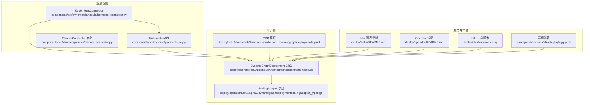
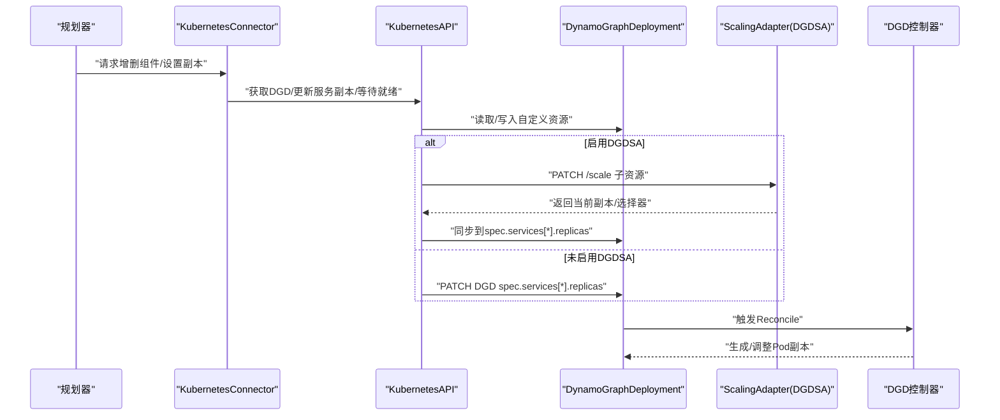
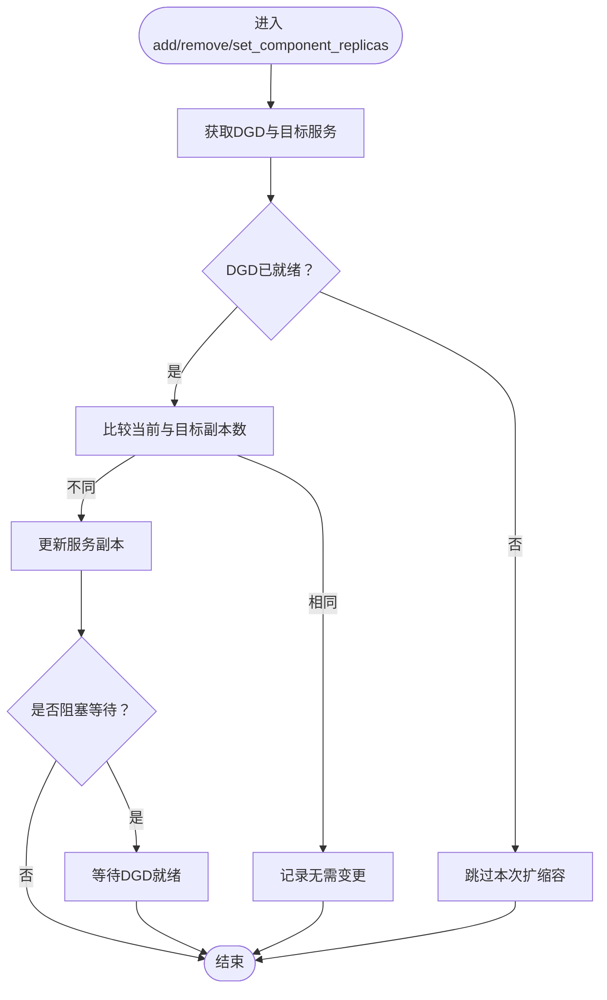
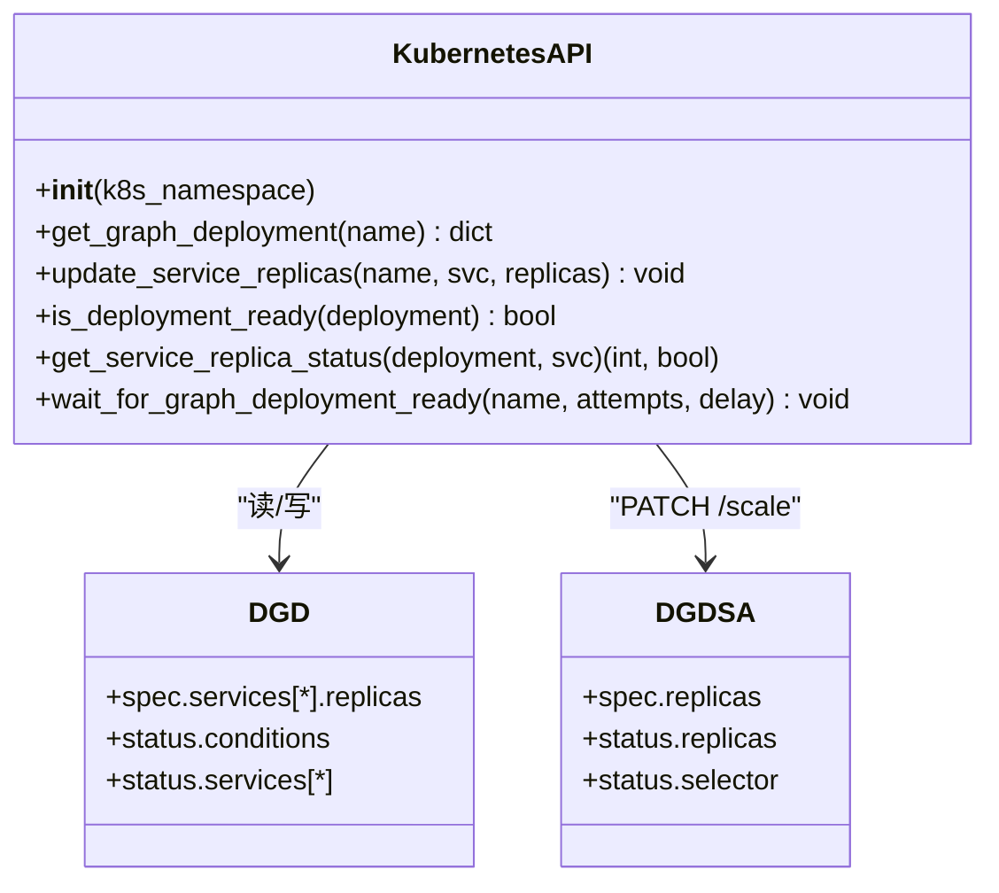
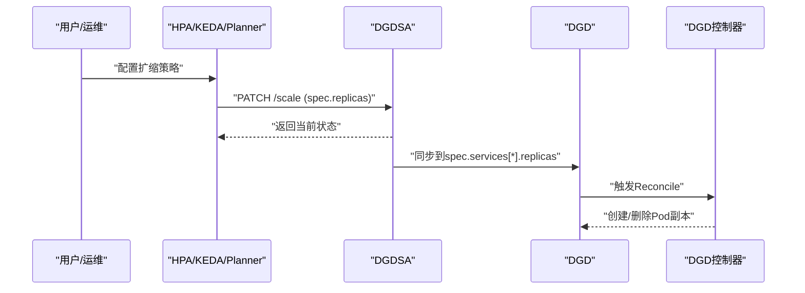
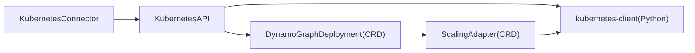

# Kubernetes集成

<cite>
**本文档引用的文件**
- [kubernetes_connector.py](file://components/src/dynamo/planner/kubernetes_connector.py)
- [kube.py](file://components/src/dynamo/planner/kube.py)
- [planner_connector.py](file://components/src/dynamo/planner/planner_connector.py)
- [kubernetes.py](file://deploy/utils/kubernetes.py)
- [README.md（Kubernetes总览）](file://docs/pages/kubernetes/README.md)
- [README.md（Helm图表）](file://deploy/helm/README.md)
- [README.md（Operator）](file://deploy/operator/README.md)
- [dynamographdeployment_types.go](file://deploy/operator/api/v1alpha1/dynamographdeployment_types.go)
- [dynamographdeploymentscalingadapter_types.go](file://deploy/operator/api/v1alpha1/dynamographdeploymentscalingadapter_types.go)
- [nvidia.com_dynamographdeployments.yaml](file://deploy/helm/charts/crds/templates/nvidia.com_dynamographdeployments.yaml)
- [autoscaling.md](file://docs/pages/kubernetes/autoscaling.md)
- [agg.yaml（vLLM聚合示例）](file://examples/backends/vllm/deploy/agg.yaml)
- [pvc-access-pod.yaml](file://deploy/utils/manifests/pvc-access-pod.yaml)
</cite>

## 目录
1. [简介](#简介)
2. [项目结构](#项目结构)
3. [核心组件](#核心组件)
4. [架构总览](#架构总览)
5. [详细组件分析](#详细组件分析)
6. [依赖关系分析](#依赖关系分析)
7. [性能考量](#性能考量)
8. [故障排查指南](#故障排查指南)
9. [结论](#结论)
10. [附录](#附录)

## 简介
本文件面向Dynamo规划器在Kubernetes上的集成，系统性阐述规划器如何与集群交互以完成Pod管理、资源调度与状态同步；解析Kubernetes连接器的实现原理、API客户端配置与集群发现机制；说明命名空间管理、资源限制设置与自动扩缩容触发条件；提供配置示例与与Helm图表的集成方式及部署最佳实践。

## 项目结构
围绕Kubernetes集成的关键代码与文档分布如下：
- 规划器侧连接器：planner子模块中的Kubernetes连接器与Kubernetes API封装
- 平台侧资源定义：Operator CRD与适配器类型定义
- 部署与工具：Helm图表、Operator说明、K8s工具脚本
- 示例与文档：部署示例、自动扩缩容指南、Kubernetes总览

**图示来源**
- [kubernetes_connector.py](file://components/src/dynamo/planner/kubernetes_connector.py#L48-L373)
- [kube.py](file://components/src/dynamo/planner/kube.py#L40-L226)
- [planner_connector.py](file://components/src/dynamo/planner/planner_connector.py#L19-L30)
- [dynamographdeployment_types.go](file://deploy/operator/api/v1alpha1/dynamographdeployment_types.go#L47-L206)
- [dynamographdeploymentscalingadapter_types.go](file://deploy/operator/api/v1alpha1/dynamographdeploymentscalingadapter_types.go#L26-L91)
- [nvidia.com_dynamographdeployments.yaml](file://deploy/helm/charts/crds/templates/nvidia.com_dynamographdeployments.yaml#L16-L11456)
- [README.md（Helm图表）](file://deploy/helm/README.md#L18-L23)
- [README.md（Operator）](file://deploy/operator/README.md#L1-L37)
- [kubernetes.py](file://deploy/utils/kubernetes.py#L27-L186)
- [agg.yaml（vLLM聚合示例）](file://examples/backends/vllm/deploy/agg.yaml#L1-L35)

**章节来源**
- [kubernetes_connector.py](file://components/src/dynamo/planner/kubernetes_connector.py#L1-L401)
- [kube.py](file://components/src/dynamo/planner/kube.py#L1-L226)
- [planner_connector.py](file://components/src/dynamo/planner/planner_connector.py#L1-L30)
- [README.md（Kubernetes总览）](file://docs/pages/kubernetes/README.md#L1-L242)
- [README.md（Helm图表）](file://deploy/helm/README.md#L18-L23)
- [README.md（Operator）](file://deploy/operator/README.md#L1-L37)
- [dynamographdeployment_types.go](file://deploy/operator/api/v1alpha1/dynamographdeployment_types.go#L1-L291)
- [dynamographdeploymentscalingadapter_types.go](file://deploy/operator/api/v1alpha1/dynamographdeploymentscalingadapter_types.go#L1-L125)
- [nvidia.com_dynamographdeployments.yaml](file://deploy/helm/charts/crds/templates/nvidia.com_dynamographdeployments.yaml#L16-L11456)
- [kubernetes.py](file://deploy/utils/kubernetes.py#L1-L186)
- [agg.yaml（vLLM聚合示例）](file://examples/backends/vllm/deploy/agg.yaml#L1-L35)

## 核心组件
- Kubernetes连接器（KubernetesConnector）
  - 负责与DynamoGraphDeployment（DGD）交互，增删组件副本、校验部署、查询模型名与GPU数量、等待就绪、批量设置副本数等
  - 通过环境变量读取父级DGD名称，使用KubernetesAPI访问CRD与状态
- KubernetesAPI（KubernetesAPI）
  - 封装K8s Python客户端，支持in-cluster/out-of-cluster两种配置加载
  - 提供DGD获取、服务副本更新（优先DGDSA Scale子资源，回退到直接修改DGD）、就绪检查、稳定状态判断、等待就绪等能力
- PlannerConnector抽象
  - 定义规划器扩展点：添加/移除组件
- 平台侧资源
  - DynamoGraphDeployment CRD与状态字段（含ServiceReplicaStatus）
  - DynamoGraphDeploymentScalingAdapter（DGDSA）实现Scale子资源，作为HPA/KEDA/Planner等外部控制器的入口

**章节来源**
- [kubernetes_connector.py](file://components/src/dynamo/planner/kubernetes_connector.py#L48-L373)
- [kube.py](file://components/src/dynamo/planner/kube.py#L40-L226)
- [planner_connector.py](file://components/src/dynamo/planner/planner_connector.py#L19-L30)
- [dynamographdeployment_types.go](file://deploy/operator/api/v1alpha1/dynamographdeployment_types.go#L101-L189)
- [dynamographdeploymentscalingadapter_types.go](file://deploy/operator/api/v1alpha1/dynamographdeploymentscalingadapter_types.go#L26-L91)

## 架构总览
规划器通过Kubernetes连接器与DGD交互，后者由Operator根据CRD定义进行管理。当启用ScalingAdapter时，外部控制器（HPA/KEDA/Planner）通过Scale子资源更新适配器，再由适配器同步到DGD，最终由DGD控制器驱动Pod生命周期。

**图示来源**
- [kubernetes_connector.py](file://components/src/dynamo/planner/kubernetes_connector.py#L71-L111)
- [kube.py](file://components/src/dynamo/planner/kube.py#L81-L144)
- [dynamographdeployment_types.go](file://deploy/operator/api/v1alpha1/dynamographdeployment_types.go#L47-L206)
- [dynamographdeploymentscalingadapter_types.go](file://deploy/operator/api/v1alpha1/dynamographdeploymentscalingadapter_types.go#L71-L91)

## 详细组件分析

### Kubernetes连接器（KubernetesConnector）
- 初始化与环境变量
  - 从环境变量读取父级DGD名称，若缺失则抛出部署验证错误
  - 可选传入用户提供的模型名，用于后续一致性校验
- 组件增删与批量设置
  - 增加/减少指定子组件副本数，支持阻塞等待DGD整体就绪
  - 批量设置多个组件目标副本，若DGD未就绪则跳过
- 部署校验与信息提取
  - 校验DGD中是否存在prefill/decode服务与模型名
  - 从服务中提取模型名与GPU数量，支持回退策略与一致性检查
- 实际工作副本与稳定性
  - 从DGD状态读取各服务实际就绪副本数与是否处于稳定滚动状态，避免在滚动中重复扩缩

**图示来源**
- [kubernetes_connector.py](file://components/src/dynamo/planner/kubernetes_connector.py#L71-L111)
- [kubernetes_connector.py](file://components/src/dynamo/planner/kubernetes_connector.py#L333-L373)
- [kube.py](file://components/src/dynamo/planner/kube.py#L146-L193)

**章节来源**
- [kubernetes_connector.py](file://components/src/dynamo/planner/kubernetes_connector.py#L48-L373)

### KubernetesAPI（KubernetesAPI）
- 配置加载
  - 优先尝试in-cluster配置；失败则回退到本地kubeconfig
  - 使用CustomObjectsApi访问DGD与DGDSA
- DGD访问与就绪判断
  - 通过group/version/plural定位DGD；捕获404转换为特定异常
  - 通过status.conditions判断整体就绪
- 副本更新策略
  - 优先通过DGDSA的Scale子资源更新replicas
  - 若DGDSA不存在则回退到直接PATCH DGD spec.services[*].replicas
- 状态读取与稳定性判定
  - 从status.services[*]读取available/ready/updated副本
  - 稳定条件：desired == updated == ready/available

**图示来源**
- [kube.py](file://components/src/dynamo/planner/kube.py#L40-L226)
- [dynamographdeployment_types.go](file://deploy/operator/api/v1alpha1/dynamographdeployment_types.go#L101-L189)
- [dynamographdeploymentscalingadapter_types.go](file://deploy/operator/api/v1alpha1/dynamographdeploymentscalingadapter_types.go#L26-L91)

**章节来源**
- [kube.py](file://components/src/dynamo/planner/kube.py#L40-L226)

### 自动扩缩容与触发条件
- ScalingAdapter（DGDSA）与Scale子资源
  - 每个DGD服务默认由Operator创建对应DGDSA，作为HPA/KEDA/Planner的目标
  - 通过PATCH /scale更新spec.replicas，再由控制器同步到DGD
- 外部控制器集成
  - HPA：基于CPU/内存或外部指标（需Prometheus Adapter）
  - KEDA：基于Prometheus查询的事件驱动扩缩容，更易配置
  - Planner：基于LLM推理指标（如TTFT、ITL、KV缓存利用率）的SLA感知扩缩
- 触发条件示例
  - TTFT p95阈值、队列深度、请求速率、GPU利用率等
  - 支持混合策略：前端HPA、解码KEDA/Planner

**图示来源**
- [autoscaling.md](file://docs/pages/kubernetes/autoscaling.md#L43-L82)
- [dynamographdeploymentscalingadapter_types.go](file://deploy/operator/api/v1alpha1/dynamographdeploymentscalingadapter_types.go#L71-L91)

**章节来源**
- [autoscaling.md](file://docs/pages/kubernetes/autoscaling.md#L1-L743)
- [dynamographdeploymentscalingadapter_types.go](file://deploy/operator/api/v1alpha1/dynamographdeploymentscalingadapter_types.go#L1-L125)

### 命名空间管理与资源限制
- 命名空间
  - Kubernetes命名空间：DGD所在逻辑命名空间
  - Dynamo命名空间：服务发现使用的逻辑命名空间，通过DGD服务字段指定
  - 两者相互独立，可一对多或多对一
- 资源限制
  - 在DGD服务中通过resources.limits设置GPU/CPU/内存
  - 示例中为worker服务设置GPU限额
- PVC与存储
  - 通过DGD的pvcs字段声明持久卷，示例中使用pvc-access-pod进行访问验证

**章节来源**
- [README.md（Kubernetes总览）](file://docs/pages/kubernetes/README.md#L10-L242)
- [dynamographdeployment_types.go](file://deploy/operator/api/v1alpha1/dynamographdeployment_types.go#L47-L69)
- [agg.yaml（vLLM聚合示例）](file://examples/backends/vllm/deploy/agg.yaml#L17-L26)
- [pvc-access-pod.yaml](file://deploy/utils/manifests/pvc-access-pod.yaml#L1-L41)

### Helm图表与部署最佳实践
- Helm图表
  - platform：安装完整平台（Operator/NATS/etcd/Grove/Kai Scheduler）
  - crds：仅安装CRD
- 部署流程
  - 先安装CRDs，再安装platform
  - 使用预检脚本检查kubectl连通性、StorageClass与GPU可用性
- 最佳实践
  - 为每个服务启用ScalingAdapter，避免多控制器冲突
  - 前端HPA（CPU/内存），解码KEDA/Planner按LLM指标扩缩
  - 设置合理的min/max副本与稳定窗口，防止抖动

**章节来源**
- [README.md（Helm图表）](file://deploy/helm/README.md#L18-L23)
- [README.md（Kubernetes总览）](file://docs/pages/kubernetes/README.md#L50-L74)
- [autoscaling.md](file://docs/pages/kubernetes/autoscaling.md#L635-L678)

## 依赖关系分析
- 组件耦合
  - KubernetesConnector依赖KubernetesAPI与DGD CRD
  - KubernetesAPI依赖K8s Python SDK与Operator暴露的CRD/Scale子资源
- 外部依赖
  - kubernetes-client库（Python）
  - Prometheus/KEDA/HPA（可选，用于扩缩容）

**图示来源**
- [kubernetes_connector.py](file://components/src/dynamo/planner/kubernetes_connector.py#L48-L56)
- [kube.py](file://components/src/dynamo/planner/kube.py#L20-L49)
- [dynamographdeployment_types.go](file://deploy/operator/api/v1alpha1/dynamographdeployment_types.go#L198-L206)
- [dynamographdeploymentscalingadapter_types.go](file://deploy/operator/api/v1alpha1/dynamographdeploymentscalingadapter_types.go#L85-L91)

**章节来源**
- [kubernetes_connector.py](file://components/src/dynamo/planner/kubernetes_connector.py#L1-L401)
- [kube.py](file://components/src/dynamo/planner/kube.py#L1-L226)

## 性能考量
- 扩缩容稳定性
  - 利用DGDSA的Scale子资源与DGD的稳定条件（desired==updated==ready/available）避免在滚动过程中的重复扩缩
- 指标选择
  - 解码服务优先关注ITL/队列深度；前端关注CPU/内存与请求速率
- 资源预留
  - 明确GPU/CPU/内存限额，结合HPA/KEDA阈值与Planner预测，降低排队与OOM风险

[本节为通用指导，不直接分析具体文件]

## 故障排查指南
- 连接器初始化失败
  - 确认环境变量DYN_PARENT_DGD_K8S_NAME已设置
  - 检查K8s访问权限与集群上下文
- DGD未就绪
  - 查看DGD status.conditions；使用等待函数重试
- DGDSA不存在
  - 确认Operator已安装且版本兼容；检查CRD是否正确安装
- 指标不可用
  - 确认Prometheus已抓取Dynamo指标；检查HPA/KEDA配置与过滤标签

**章节来源**
- [kubernetes_connector.py](file://components/src/dynamo/planner/kubernetes_connector.py#L63-L67)
- [kube.py](file://components/src/dynamo/planner/kube.py#L194-L226)
- [autoscaling.md](file://docs/pages/kubernetes/autoscaling.md#L679-L724)

## 结论
Dynamo规划器通过Kubernetes连接器与Operator管理的DGD/DGDSA协同工作，实现了对LLM推理服务的精细化扩缩容与状态同步。结合HPA/KEDA/Planner的多层策略，可在保证SLA的前提下高效利用集群资源。建议在生产环境中启用ScalingAdapter、合理配置指标阈值与稳定窗口，并通过Helm图表与示例部署快速落地。

[本节为总结性内容，不直接分析具体文件]

## 附录

### 配置示例（路径引用）
- 集群连接参数与认证
  - in-cluster配置：无需额外配置
  - out-of-cluster配置：使用本地kubeconfig
  - 参考路径：[kube.py](file://components/src/dynamo/planner/kube.py#L42-L46)
- 资源约束设置
  - GPU/CPU/内存限额：见示例DGD
  - 参考路径：[agg.yaml（vLLM聚合示例）](file://examples/backends/vllm/deploy/agg.yaml#L21-L26)
- 自动扩缩容触发条件
  - HPA/KEDA/Planner配置参考
  - 参考路径：[autoscaling.md](file://docs/pages/kubernetes/autoscaling.md#L178-L538)
- Helm安装与CRD
  - 安装顺序与参数
  - 参考路径：[README.md（Helm图表）](file://deploy/helm/README.md#L18-L23)、[README.md（Kubernetes总览）](file://docs/pages/kubernetes/README.md#L50-L74)