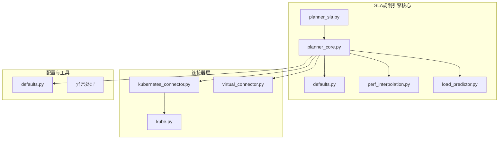
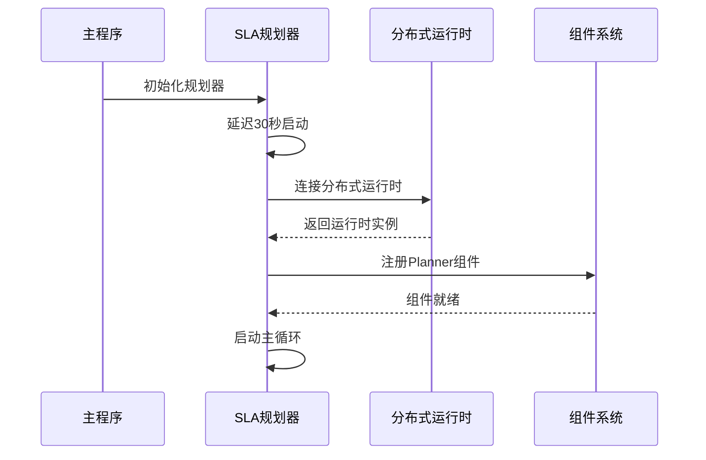
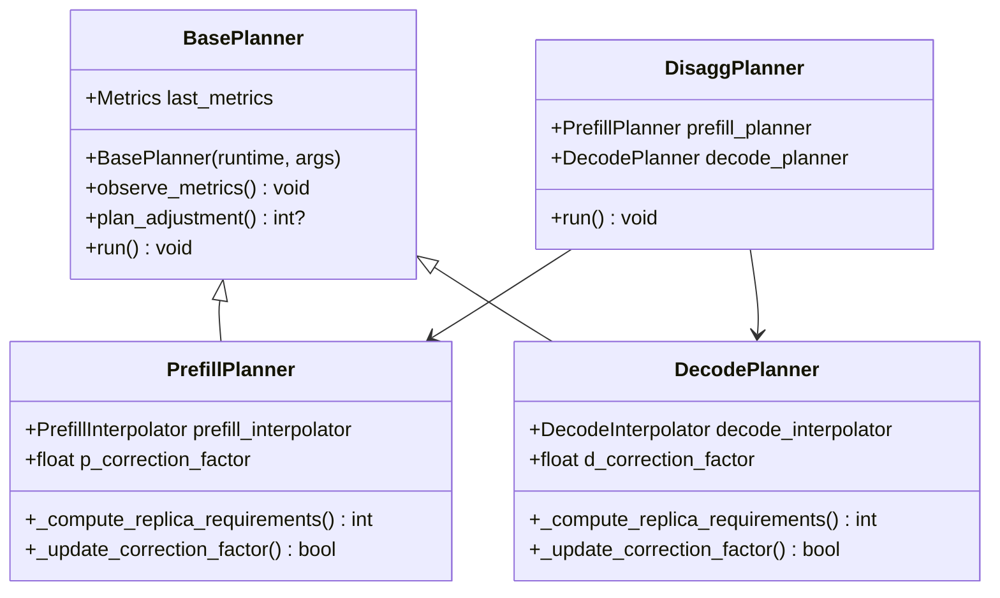
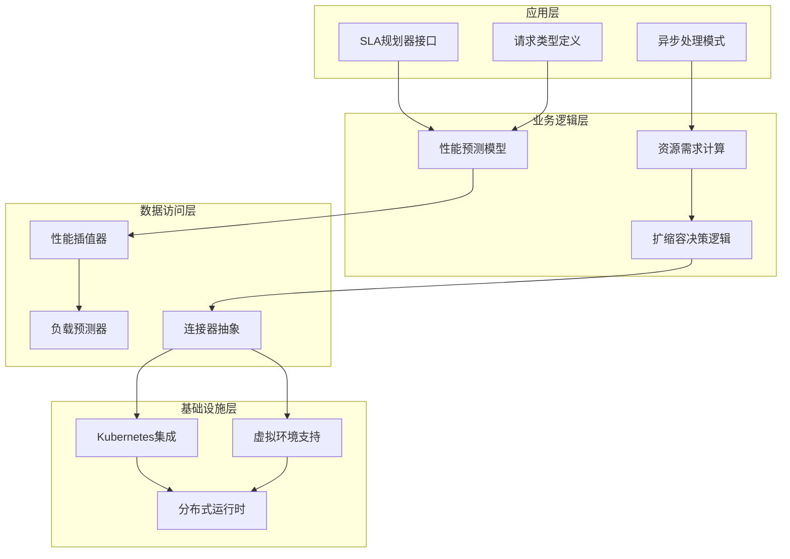
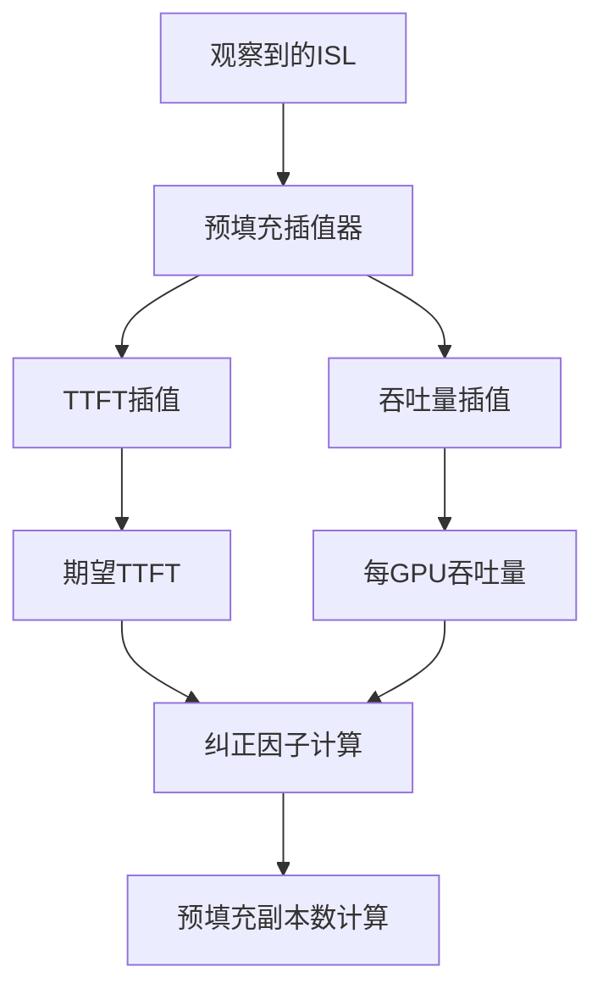
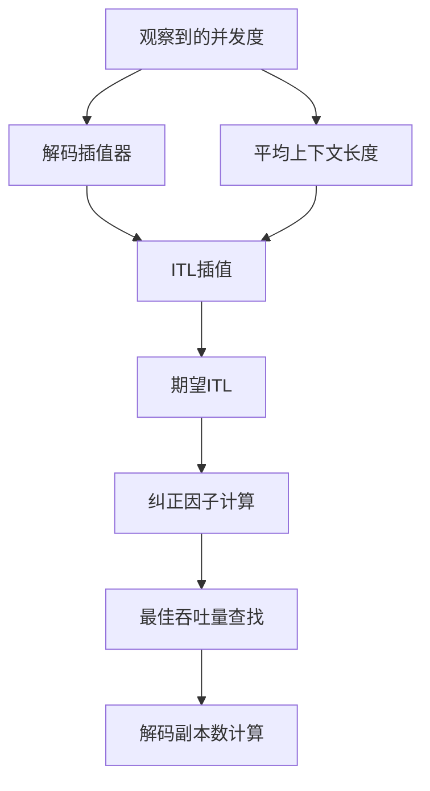
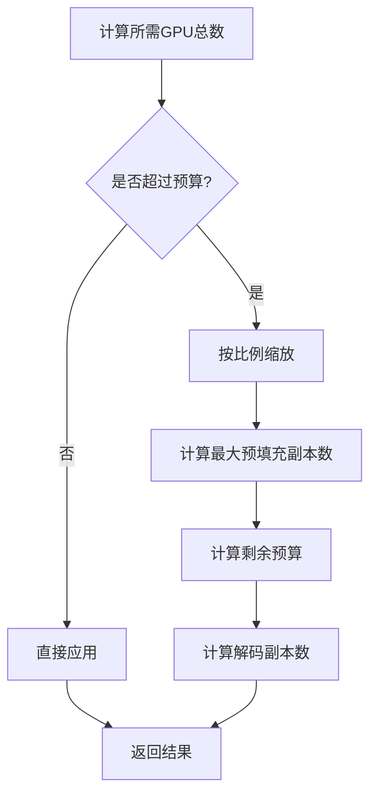
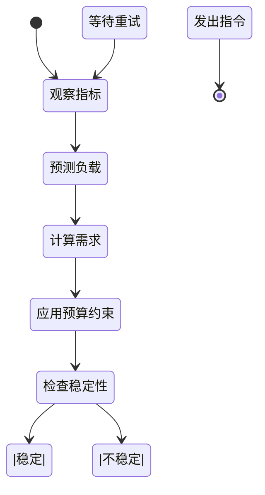
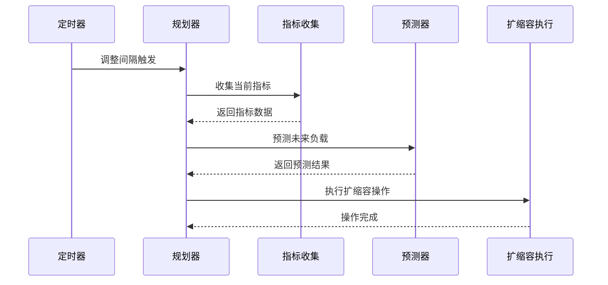
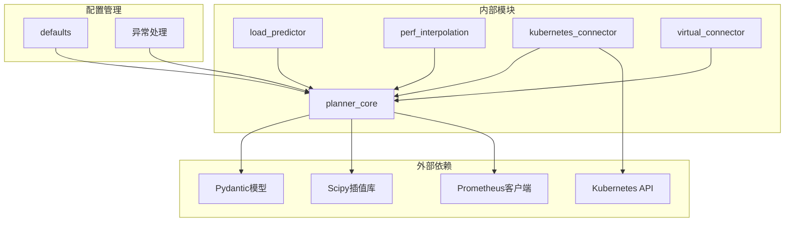

# SLA规划引擎

<cite>
**本文档引用的文件**
- [planner_sla.py](file://components/src/dynamo/planner/planner_sla.py)
- [planner_core.py](file://components/src/dynamo/planner/utils/planner_core.py)
- [defaults.py](file://components/src/dynamo/planner/defaults.py)
- [perf_interpolation.py](file://components/src/dynamo/planner/utils/perf_interpolation.py)
- [load_predictor.py](file://components/src/dynamo/planner/utils/load_predictor.py)
- [kubernetes_connector.py](file://components/src/dynamo/planner/kubernetes_connector.py)
- [virtual_connector.py](file://components/src/dynamo/planner/virtual_connector.py)
- [kube.py](file://components/src/dynamo/planner/kube.py)
- [planner_guide.md](file://docs/pages/components/planner/planner-guide.md)
</cite>

## 目录
1. [简介](#简介)
2. [项目结构](#项目结构)
3. [核心组件](#核心组件)
4. [架构概览](#架构概览)
5. [详细组件分析](#详细组件分析)
6. [依赖关系分析](#依赖关系分析)
7. [性能考虑](#性能考虑)
8. [故障排除指南](#故障排除指南)
9. [结论](#结论)
10. [附录](#附录)

## 简介

Dynamo SLA规划引擎是一个基于性能预测模型的智能扩缩容系统，专门用于分布式推理服务的自动资源管理。该引擎通过实时监控关键性能指标，结合预部署性能剖析数据，动态计算最优的预填充(Prefill)和解码(Decode)工作进程数量，确保在满足SLA(服务等级协议)的前提下实现资源的高效利用。

该系统的核心优势在于其数学化的性能预测模型，能够准确估算不同负载条件下的系统表现，并通过纠正因子机制适应实际运行环境的变化。系统支持多种推理后端(VLLM、SGLang、TensorRT-LLM)，并提供完整的分布式运行时集成能力。

## 项目结构

Dynamo SLA规划引擎位于`components/src/dynamo/planner/`目录下，采用模块化设计，主要包含以下核心子模块：



**图表来源**
- [planner_sla.py](file://components/src/dynamo/planner/planner_sla.py#L1-L56)
- [planner_core.py](file://components/src/dynamo/planner/utils/planner_core.py#L1-L981)

**章节来源**
- [planner_sla.py](file://components/src/dynamo/planner/planner_sla.py#L1-L56)
- [planner_core.py](file://components/src/dynamo/planner/utils/planner_core.py#L1-L981)

## 核心组件

### SLA规划器主入口

SLA规划器通过`planner_sla.py`作为主入口，实现了延迟启动机制和组件注册流程：



**图表来源**
- [planner_sla.py](file://components/src/dynamo/planner/planner_sla.py#L36-L50)

### 性能预测模型

规划器使用多层预测模型来估算未来的负载情况：



**图表来源**
- [planner_core.py](file://components/src/dynamo/planner/utils/planner_core.py#L258-L981)

**章节来源**
- [planner_sla.py](file://components/src/dynamo/planner/planner_sla.py#L27-L50)
- [planner_core.py](file://components/src/dynamo/planner/utils/planner_core.py#L258-L981)

## 架构概览

Dynamo SLA规划引擎采用分层架构设计，确保了系统的可扩展性和维护性：



**图表来源**
- [planner_core.py](file://components/src/dynamo/planner/utils/planner_core.py#L1-L981)
- [kubernetes_connector.py](file://components/src/dynamo/planner/kubernetes_connector.py#L1-L401)

## 详细组件分析

### 性能预测模型详解

#### 预填充阶段性能预测

预填充阶段的性能预测基于输入序列长度(ISL)进行插值计算：



**图表来源**
- [perf_interpolation.py](file://components/src/dynamo/planner/utils/perf_interpolation.py#L37-L100)
- [planner_core.py](file://components/src/dynamo/planner/utils/planner_core.py#L767-L794)

#### 解码阶段性能预测

解码阶段的性能预测综合考虑并发度、上下文长度和KV缓存使用率：



**图表来源**
- [perf_interpolation.py](file://components/src/dynamo/planner/utils/perf_interpolation.py#L102-L247)
- [planner_core.py](file://components/src/dynamo/planner/utils/planner_core.py#L804-L852)

### 资源需求计算算法

#### GPU预算约束应用

系统实现了严格的GPU预算约束，确保总GPU使用量不超过配置上限：



**图表来源**
- [planner_core.py](file://components/src/dynamo/planner/utils/planner_core.py#L132-L177)

#### 副本数量计算公式

预填充和解码阶段的副本数量计算遵循以下数学模型：

**预填充阶段：**
```
num_p = ceil((request_rate × avg_isl × min(1, correction_factor)) / (thpt_per_gpu × prefill_gpus))
```

**解码阶段：**
```
num_d = ceil((request_rate × avg_osl) / (best_thpt_per_gpu × decode_gpus))
```

其中纠正因子用于补偿实际性能与预期性能的差异。

**章节来源**
- [planner_core.py](file://components/src/dynamo/planner/utils/planner_core.py#L768-L852)

### 扩缩容决策逻辑

#### 多阶段决策流程



#### 纠正因子更新机制

系统通过比较实际性能与预期性能来动态调整纠正因子：

**预填充纠正因子：**
```
correction_factor = actual_ttft / expected_ttft
```

**解码纠正因子：**
```
correction_factor = actual_itl / expected_itl
```

**章节来源**
- [planner_core.py](file://components/src/dynamo/planner/utils/planner_core.py#L767-L821)

### 请求类型定义与异步处理

#### 请求类型结构

```python
class RequestType(BaseModel):
    text: str
```

该简单结构为规划器提供了统一的请求格式，便于后续扩展。

#### 异步处理模式

规划器采用异步事件驱动模式，通过以下机制实现高并发处理：



**图表来源**
- [planner_core.py](file://components/src/dynamo/planner/utils/planner_core.py#L703-L762)

**章节来源**
- [planner_sla.py](file://components/src/dynamo/planner/planner_sla.py#L32-L49)

### 端点服务实现

#### 组件注册过程

规划器通过分布式运行时的组件系统进行注册：


#### 端点服务配置

系统为每个组件提供标准的端点服务，包括健康检查和监控功能。

**章节来源**
- [planner_sla.py](file://components/src/dynamo/planner/planner_sla.py#L42-L49)

## 依赖关系分析

### 核心依赖图



**图表来源**
- [planner_core.py](file://components/src/dynamo/planner/utils/planner_core.py#L14-L32)
- [load_predictor.py](file://components/src/dynamo/planner/utils/load_predictor.py#L24-L28)

### 组件耦合度分析

系统采用了松耦合的设计原则，通过抽象接口实现模块间的解耦：

- **PlannerConnector抽象**：隔离具体部署环境的差异
- **性能插值器**：独立于具体硬件平台的性能建模
- **负载预测器**：支持多种时间序列预测算法
- **默认配置管理**：集中管理所有配置参数

**章节来源**
- [planner_core.py](file://components/src/dynamo/planner/utils/planner_core.py#L19-L31)
- [defaults.py](file://components/src/dynamo/planner/defaults.py#L35-L83)

## 性能考虑

### 时间复杂度分析

- **指标收集**：O(1) - 固定数量的Prometheus查询
- **负载预测**：O(n) - n为历史数据点数量，受预测器算法影响
- **性能插值**：O(log n) - 使用scipy的插值算法
- **副本计算**：O(1) - 基本的数学运算

### 内存使用优化

系统通过以下机制优化内存使用：
- 数据缓冲区大小限制
- 历史数据的时间窗口管理
- 插值网格的预计算和缓存
- 异步处理减少阻塞等待

### 并发性能

- **异步I/O**：Prometheus查询和Kubernetes API调用
- **预测器增量更新**：避免重复训练模型
- **指标缓存**：减少重复计算
- **批量扩缩容**：合并多个组件的扩缩容请求

## 故障排除指南

### 常见问题诊断

#### 性能预测失败

**症状**：负载预测返回None或异常值
**可能原因**：
- Prometheus连接失败
- 缺少历史数据
- 预测器配置错误

**解决方案**：
1. 检查Prometheus端点连通性
2. 验证历史数据完整性
3. 调整预测器参数

#### GPU预算超限

**症状**：扩缩容后GPU使用量超过配置上限
**可能原因**：
- 预测过于乐观
- 实际性能低于预期
- 纠正因子失效

**解决方案**：
1. 降低预测置信度
2. 增加安全系数
3. 检查纠正因子更新频率

#### Kubernetes集成问题

**症状**：扩缩容操作无法执行
**可能原因**：
- 权限不足
- DGD配置错误
- API版本不兼容

**解决方案**：
1. 检查RBAC权限
2. 验证DGD结构
3. 更新API版本

**章节来源**
- [planner_core.py](file://components/src/dynamo/planner/utils/planner_core.py#L622-L624)
- [kubernetes_connector.py](file://components/src/dynamo/planner/kubernetes_connector.py#L112-L163)

## 结论

Dynamo SLA规划引擎通过数学化的性能预测模型和智能的扩缩容决策机制，为分布式推理服务提供了高效的资源管理解决方案。系统的主要特点包括：

1. **精确的性能预测**：基于预部署性能剖析数据，结合实时监控指标
2. **灵活的扩缩容策略**：支持多种推理后端和部署环境
3. **强大的鲁棒性**：通过纠正因子和预算约束确保系统稳定性
4. **优秀的可扩展性**：模块化设计支持功能扩展和性能优化

该系统特别适用于需要严格SLA保证的生产环境，能够有效平衡服务质量、资源利用率和成本控制之间的关系。

## 附录

### SLA参数配置示例

#### 基本SLA配置
```yaml
sla:
  isl: 3000      # 输入序列长度
  osl: 150       # 输出序列长度  
  ttft: 200      # 首Token延迟(ms)
  itl: 20        # Token间延迟(ms)
```

#### 高级配置选项
- **负载预测器选择**：arima、prophet、kalman、constant
- **GPU预算限制**：根据集群资源合理设置
- **调整间隔**：平衡响应速度和系统开销
- **纠正因子**：启用/禁用性能自适应调整

**章节来源**
- [planner_guide.md](file://docs/pages/components/planner/planner-guide.md#L154-L170)
- [defaults.py](file://components/src/dynamo/planner/defaults.py#L59-L83)