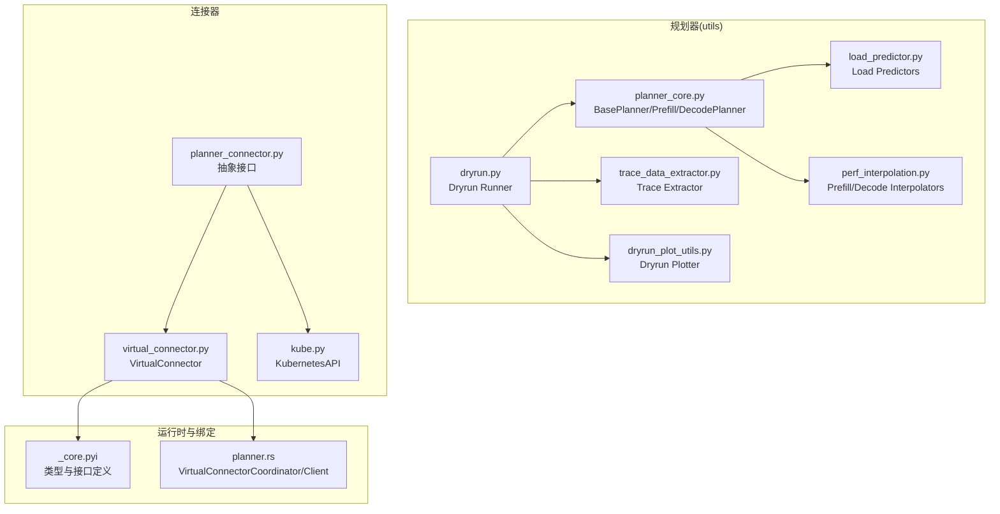
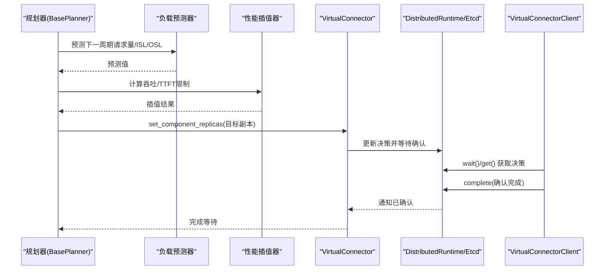
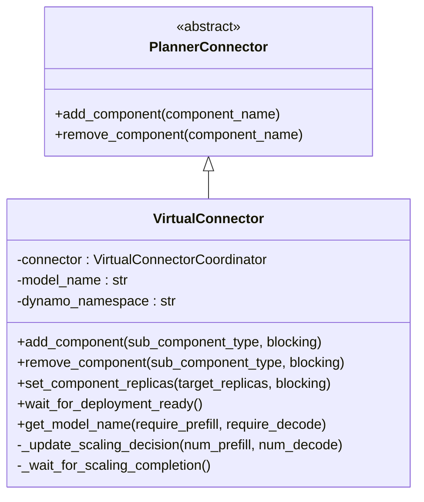
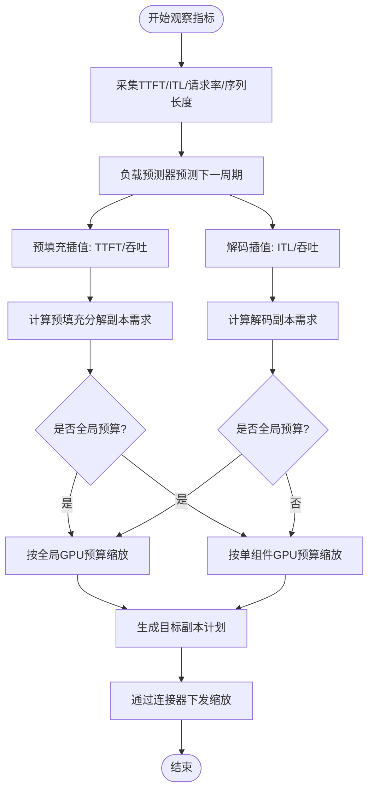
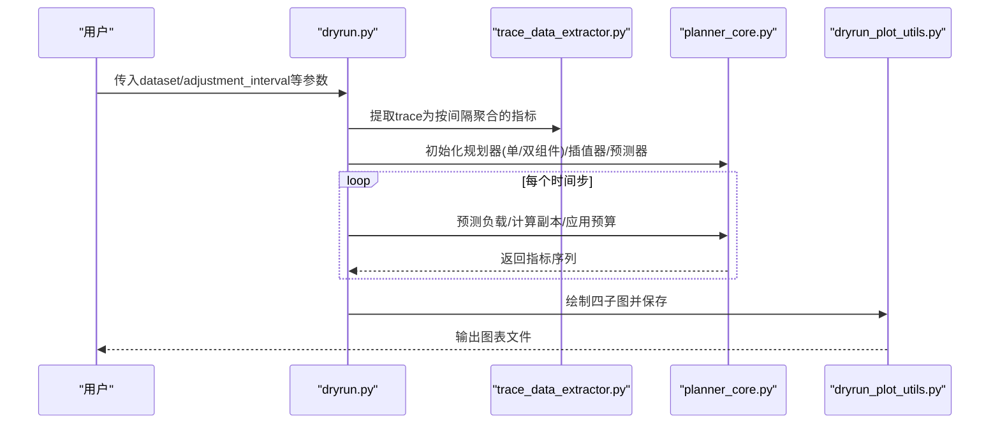
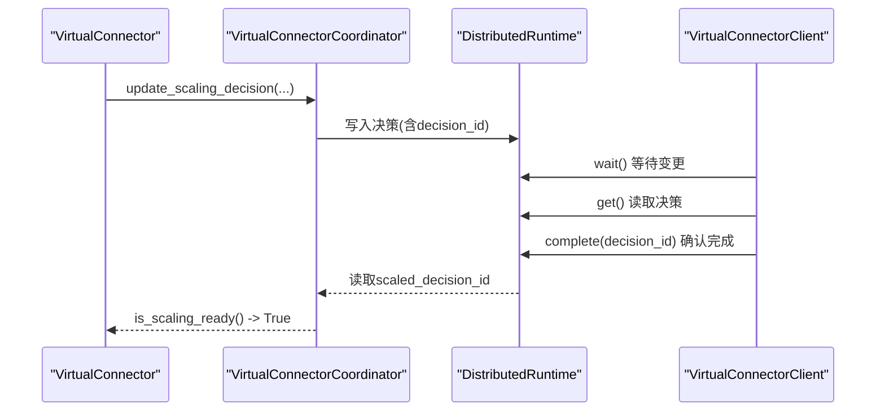
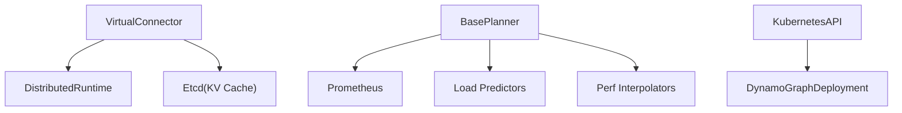

# 虚拟连接器

<cite>
**本文引用的文件**
- [virtual_connector.py](file://components/src/dynamo/planner/virtual_connector.py)
- [planner_connector.py](file://components/src/dynamo/planner/planner_connector.py)
- [dryrun.py](file://components/src/dynamo/planner/utils/dryrun.py)
- [planner_core.py](file://components/src/dynamo/planner/utils/planner_core.py)
- [perf_interpolation.py](file://components/src/dynamo/planner/utils/perf_interpolation.py)
- [load_predictor.py](file://components/src/dynamo/planner/utils/load_predictor.py)
- [dryrun_plot_utils.py](file://components/src/dynamo/planner/utils/dryrun_plot_utils.py)
- [trace_data_extractor.py](file://components/src/dynamo/planner/utils/trace_data_extractor.py)
- [planner-guide.md](file://docs/pages/components/planner/planner-guide.md)
- [planner.rs](file://lib/bindings/python/rust/planner.rs)
- [_core.pyi](file://lib/bindings/python/src/dynamo/_core.pyi)
- [kube.py](file://components/src/dynamo/planner/kube.py)
- [test_virtual_connector.py](file://tests/planner/unit/test_virtual_connector.py)
</cite>

## 目录
1. [简介](#简介)
2. [项目结构](#项目结构)
3. [核心组件](#核心组件)
4. [架构总览](#架构总览)
5. [详细组件分析](#详细组件分析)
6. [依赖关系分析](#依赖关系分析)
7. [性能考量](#性能考量)
8. [故障排查指南](#故障排查指南)
9. [结论](#结论)
10. [附录：使用示例与参数说明](#附录使用示例与参数说明)

## 简介
本文件面向Dynamo虚拟连接器（VirtualConnector）的技术文档，系统阐述其在规划过程中的作用、干运行（dryrun）功能的实现原理、执行计划生成与结果分析方法，并说明虚拟连接器如何模拟真实工作负载、计算资源消耗与性能指标。同时给出与实际连接器（如Kubernetes连接器）的差异与适用场景，以及可操作的使用示例与参数配置建议。

## 项目结构
虚拟连接器位于规划器子系统中，作为PlannerConnector的子类，负责在非原生环境（如自定义编排或测试环境）中输出缩放决策并等待外部确认完成。其核心交互通过分布式运行时与Etcd进行状态同步，配合负载预测器、性能插值器与干运行工具链共同完成规划闭环。

**图示来源**
- [planner_core.py](file://components/src/dynamo/planner/utils/planner_core.py#L258-L800)
- [load_predictor.py](file://components/src/dynamo/planner/utils/load_predictor.py#L1-L406)
- [perf_interpolation.py](file://components/src/dynamo/planner/utils/perf_interpolation.py#L1-L309)
- [dryrun.py](file://components/src/dynamo/planner/utils/dryrun.py#L1-L212)
- [dryrun_plot_utils.py](file://components/src/dynamo/planner/utils/dryrun_plot_utils.py#L1-L164)
- [trace_data_extractor.py](file://components/src/dynamo/planner/utils/trace_data_extractor.py#L1-L41)
- [planner_connector.py](file://components/src/dynamo/planner/planner_connector.py#L1-L30)
- [virtual_connector.py](file://components/src/dynamo/planner/virtual_connector.py#L1-L149)
- [kube.py](file://components/src/dynamo/planner/kube.py#L1-L226)
- [_core.pyi](file://lib/bindings/python/src/dynamo/_core.pyi#L1551-L1589)
- [planner.rs](file://lib/bindings/python/rust/planner.rs#L40-L516)

**章节来源**
- [virtual_connector.py](file://components/src/dynamo/planner/virtual_connector.py#L1-L149)
- [planner_connector.py](file://components/src/dynamo/planner/planner_connector.py#L1-L30)
- [planner_core.py](file://components/src/dynamo/planner/utils/planner_core.py#L258-L800)
- [planner-guide.md](file://docs/pages/components/planner/planner-guide.md#L290-L334)

## 核心组件
- 虚拟连接器（VirtualConnector）
  - 作用：在非原生环境中输出缩放决策，不直接管理资源，而是通过分布式运行时与Etcd协调，等待外部环境确认完成。
  - 关键行为：更新缩放决策、等待缩放完成、按组件增删副本、批量设置目标副本数、等待部署就绪、获取模型名。
- 规划器核心（BasePlanner/PrefillPlanner/DecodePlanner）
  - 作用：从Prometheus采集观测指标，训练/使用负载预测器，基于性能插值器计算所需副本数，应用GPU预算约束，最终通过连接器下发缩放指令。
- 干运行（dryrun）
  - 作用：在无真实部署的情况下，基于历史trace与插值器/预测器进行离线仿真，生成执行计划与性能曲线，辅助验证SLA与资源配置策略。
- 性能插值器（Prefill/Decode Interpolator）
  - 作用：基于预部署性能剖析数据，对TTFT/吞吐/GPU利用率等进行插值，支撑SLA约束下的安全吞吐估计。
- 负载预测器（Load Predictors）
  - 作用：对下一周期请求量、ISL、OSL进行预测，支持常量、ARIMA、Kalman、Prophet等模型。
- 运行时绑定（VirtualConnectorCoordinator/Client）
  - 作用：在分布式运行时中通过Etcd发布/订阅缩放决策，客户端轮询并完成确认。

**章节来源**
- [virtual_connector.py](file://components/src/dynamo/planner/virtual_connector.py#L28-L149)
- [planner_core.py](file://components/src/dynamo/planner/utils/planner_core.py#L258-L800)
- [dryrun.py](file://components/src/dynamo/planner/utils/dryrun.py#L18-L212)
- [perf_interpolation.py](file://components/src/dynamo/planner/utils/perf_interpolation.py#L37-L309)
- [load_predictor.py](file://components/src/dynamo/planner/utils/load_predictor.py#L55-L406)
- [planner.rs](file://lib/bindings/python/rust/planner.rs#L40-L516)
- [_core.pyi](file://lib/bindings/python/src/dynamo/_core.pyi#L1551-L1589)

## 架构总览
虚拟连接器在规划流程中的位置如下：

**图示来源**
- [planner_core.py](file://components/src/dynamo/planner/utils/planner_core.py#L511-L762)
- [virtual_connector.py](file://components/src/dynamo/planner/virtual_connector.py#L60-L128)
- [planner.rs](file://lib/bindings/python/rust/planner.rs#L338-L506)
- [_core.pyi](file://lib/bindings/python/src/dynamo/_core.pyi#L1551-L1589)

## 详细组件分析

### 组件A：虚拟连接器（VirtualConnector）
- 设计要点
  - 继承自PlannerConnector，提供add_component/remove_component/set_component_replicas/wait_for_deployment_ready等能力。
  - 通过VirtualConnectorCoordinator与分布式运行时对接，使用Etcd存储决策ID与完成状态，避免重复执行。
  - 提供阻塞/非阻塞两种模式：非阻塞立即返回，阻塞等待外部确认完成。
- 关键流程
  - 更新缩放决策：读取当前状态，计算新副本数并写入决策。
  - 等待完成：轮询Etcd中的“已确认决策ID”，直到满足条件或超时。
  - 批量设置：支持一次设定多个组件的目标副本数。
- 环境变量与等待策略
  - SCALING_CHECK_INTERVAL：检查间隔（默认10秒）。
  - SCALING_MAX_WAIT_TIME：最大等待时间（默认1800秒）。
  - 基于重试次数上限（最大重试=等待时间/检查间隔）控制超时。

**图示来源**
- [planner_connector.py](file://components/src/dynamo/planner/planner_connector.py#L19-L30)
- [virtual_connector.py](file://components/src/dynamo/planner/virtual_connector.py#L28-L149)

**章节来源**
- [virtual_connector.py](file://components/src/dynamo/planner/virtual_connector.py#L18-L149)
- [planner.rs](file://lib/bindings/python/rust/planner.rs#L40-L516)
- [_core.pyi](file://lib/bindings/python/src/dynamo/_core.pyi#L1551-L1589)

### 组件B：规划器核心（BasePlanner/Prefill/DecodePlanner）
- 指标采集与预测
  - 通过Prometheus查询TTFT/ITL/请求率/序列长度等指标，更新共享状态。
  - 使用负载预测器（常量/ARIMA/Kalman/Prophet）预测下一周期的请求量与序列长度。
- 性能插值与SLA约束
  - 预填充阶段：根据ISL插值TTFT与每GPU吞吐，结合TTFT SLA计算安全吞吐。
  - 解码阶段：根据上下文长度与KV占用插值ITL与每GPU吞吐，结合ITL SLA计算安全吞吐。
- GPU预算与副本计算
  - 单组件预算：按所需GPU总量与单副本GPU数计算最大副本数。
  - 全局预算：在预填充分解与解码解耦场景下，按总GPU预算比例缩放并保留最小端点副本。
- 干运行模式
  - 在dryrun=True时，禁用修正因子，直接使用插值器与预测器进行离线仿真。

**图示来源**
- [planner_core.py](file://components/src/dynamo/planner/utils/planner_core.py#L511-L762)
- [planner_core.py](file://components/src/dynamo/planner/utils/planner_core.py#L132-L207)
- [perf_interpolation.py](file://components/src/dynamo/planner/utils/perf_interpolation.py#L37-L309)

**章节来源**
- [planner_core.py](file://components/src/dynamo/planner/utils/planner_core.py#L258-L800)
- [perf_interpolation.py](file://components/src/dynamo/planner/utils/perf_interpolation.py#L37-L309)
- [load_predictor.py](file://components/src/dynamo/planner/utils/load_predictor.py#L55-L406)

### 组件C：干运行（dryrun）与结果可视化
- 数据准备
  - 从mooncake风格JSONL trace提取按调整间隔聚合的请求量、平均ISL、平均OSL。
- 干运行流程
  - 初始化规划器（单组件或双组件），加载warmup trace（可选）。
  - 循环推进：预测下一周期负载，计算副本需求，应用GPU预算，更新观测与安全吞吐。
  - 生成多子图对比：请求率、序列长度、预填充分解与吞吐、解码吞吐与副本数。
- 输出
  - 保存图表至指定路径，便于分析SLA满足度与资源分配合理性。

**图示来源**
- [dryrun.py](file://components/src/dynamo/planner/utils/dryrun.py#L18-L212)
- [trace_data_extractor.py](file://components/src/dynamo/planner/utils/trace_data_extractor.py#L9-L41)
- [planner_core.py](file://components/src/dynamo/planner/utils/planner_core.py#L354-L368)
- [dryrun_plot_utils.py](file://components/src/dynamo/planner/utils/dryrun_plot_utils.py#L19-L164)

**章节来源**
- [dryrun.py](file://components/src/dynamo/planner/utils/dryrun.py#L18-L212)
- [dryrun_plot_utils.py](file://components/src/dynamo/planner/utils/dryrun_plot_utils.py#L19-L164)
- [trace_data_extractor.py](file://components/src/dynamo/planner/utils/trace_data_extractor.py#L9-L41)

### 组件D：性能插值器与负载预测器
- 性能插值器
  - 预填充：基于ISL插值TTFT与每GPU吞吐；解码：基于KV占用与上下文长度插值ITL与每GPU吞吐。
  - 支持从NPZ或JSON加载原始数据，内置边界裁剪与NaN处理。
- 负载预测器
  - 常量：恒定预测。
  - ARIMA：自动选择阶数，支持log1p变换以应对尖峰序列。
  - Kalman：在线滤波，适合低延迟短周期预测。
  - Prophet：带趋势与季节性的时序预测，窗口大小可调。

**章节来源**
- [perf_interpolation.py](file://components/src/dynamo/planner/utils/perf_interpolation.py#L37-L309)
- [load_predictor.py](file://components/src/dynamo/planner/utils/load_predictor.py#L55-L406)

### 组件E：运行时绑定与外部客户端
- VirtualConnectorCoordinator
  - 在分布式运行时中初始化Etcd客户端，维护决策ID与完成状态，提供异步等待与状态读取。
- VirtualConnectorClient
  - 外部环境轮询等待新决策，获取决策后执行缩放，完成后通过Etcd写入“已确认决策ID”。

**图示来源**
- [virtual_connector.py](file://components/src/dynamo/planner/virtual_connector.py#L60-L128)
- [planner.rs](file://lib/bindings/python/rust/planner.rs#L338-L506)
- [_core.pyi](file://lib/bindings/python/src/dynamo/_core.pyi#L1551-L1589)

**章节来源**
- [planner.rs](file://lib/bindings/python/rust/planner.rs#L40-L516)
- [_core.pyi](file://lib/bindings/python/src/dynamo/_core.pyi#L1551-L1589)

## 依赖关系分析
- 组件耦合
  - VirtualConnector依赖DistributedRuntime与Etcd进行状态同步，与PlannerConnector接口解耦。
  - BasePlanner依赖Prometheus客户端、负载预测器与性能插值器，形成观测-预测-决策闭环。
- 外部依赖
  - Prometheus用于指标采集；Etcd用于跨进程/跨节点的状态共享；KubernetesAPI用于原生部署场景。
- 可能的循环依赖
  - 未发现直接循环依赖；各模块职责清晰，通过接口与运行时解耦。

**图示来源**
- [virtual_connector.py](file://components/src/dynamo/planner/virtual_connector.py#L41-L58)
- [planner_core.py](file://components/src/dynamo/planner/utils/planner_core.py#L299-L302)
- [kube.py](file://components/src/dynamo/planner/kube.py#L40-L145)

**章节来源**
- [virtual_connector.py](file://components/src/dynamo/planner/virtual_connector.py#L41-L58)
- [planner_core.py](file://components/src/dynamo/planner/utils/planner_core.py#L299-L302)
- [kube.py](file://components/src/dynamo/planner/kube.py#L40-L145)

## 性能考量
- 调整间隔与冷启动
  - 调整间隔需覆盖调度与模型加载时间，避免缩放决策重叠导致抖动。
- 修正因子稳定性
  - 在流量过渡期可能震荡，可通过禁用修正因子降低冷启动噪声影响。
- 插值精度与剖析成本
  - 插值粒度越高，准确性越好但剖析耗时越长；需在准确性和成本间权衡。
- 预测器预热
  - ARIMA/Prophet需要足够历史窗口；Kalman可在少量点后开始预测，适合突发场景。

**章节来源**
- [planner-core设计文档](file://docs/pages/design-docs/planner-design.md#L162-L167)

## 故障排查指南
- 无法读取GPU数量
  - 在虚拟模式下必须显式提供每组件GPU数；若DGD缺失GPU资源字段，将回退到CLI标志。
- 缩放未生效或重复执行
  - 检查Etcd中的“已确认决策ID”是否落后；确认外部客户端是否正确完成并写入。
- 干运行报空数据集
  - 确保trace文件存在且包含有效指标；检查调整间隔与数据聚合逻辑。
- Prometheus连接失败
  - 校验PROMETHEUS_ENDPOINT指向正确的服务地址。

**章节来源**
- [planner_core.py](file://components/src/dynamo/planner/utils/planner_core.py#L210-L256)
- [planner-guide.md](file://docs/pages/components/planner/planner-guide.md#L422-L448)

## 结论
虚拟连接器通过与分布式运行时和Etcd协作，在非原生环境中实现了与真实连接器一致的缩放决策输出与完成确认机制。结合负载预测器、性能插值器与干运行工具链，能够高效地进行资源评估、性能预测与SLA验证，适用于自定义编排、测试与离线仿真等多种场景。

## 附录：使用示例与参数说明

### 使用示例
- 虚拟连接器客户端示例（Python）
  - 创建VirtualConnectorClient，持续等待并处理缩放决策，完成后标记完成。
  - 示例参考：[test_virtual_connector.py](file://tests/planner/unit/test_virtual_connector.py#L65-L110)

- 干运行执行
  - 准备mooncake风格trace文件，调用干运行入口函数，生成可视化图表。
  - 示例参考：[dryrun.py](file://components/src/dynamo/planner/utils/dryrun.py#L18-L212)

- 虚拟部署配置
  - 在DGDR中设置environment为"virtual"，并提供后端类型。
  - 参考文档：[planner-guide.md](file://docs/pages/components/planner/planner-guide.md#L290-L334)

### 关键参数与配置
- 规划器参数
  - 调整间隔、TTFT/ITL/ISL/OSL目标、最大GPU预算、最小端点副本、每组件GPU数、是否仅观测等。
  - 参考：[planner-guide.md](file://docs/pages/components/planner/planner-guide.md#L233-L248)

- 负载预测器
  - 支持constant/arima/kalman/prophet，可配置log1p、窗口大小、最小观测点等。
  - 参考：[planner-guide.md](file://docs/pages/components/planner/planner-guide.md#L191-L225)

- 干运行参数
  - dataset、adjustment_interval、mode(disagg/prefill/decode)、start_num_p/start_num_d、输出图表路径等。
  - 参考：[dryrun.py](file://components/src/dynamo/planner/utils/dryrun.py#L18-L52)

**章节来源**
- [test_virtual_connector.py](file://tests/planner/unit/test_virtual_connector.py#L65-L110)
- [dryrun.py](file://components/src/dynamo/planner/utils/dryrun.py#L18-L52)
- [planner-guide.md](file://docs/pages/components/planner/planner-guide.md#L233-L248)
- [planner-guide.md](file://docs/pages/components/planner/planner-guide.md#L191-L225)
- [planner-guide.md](file://docs/pages/components/planner/planner-guide.md#L290-L334)