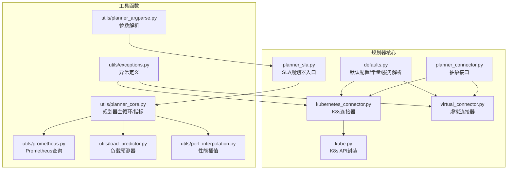
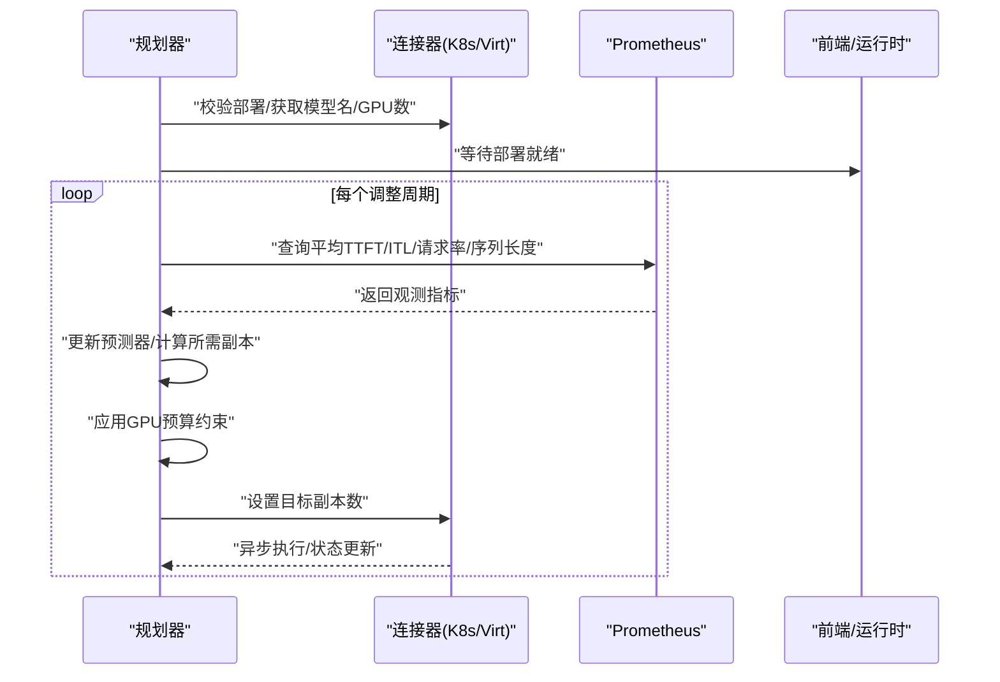
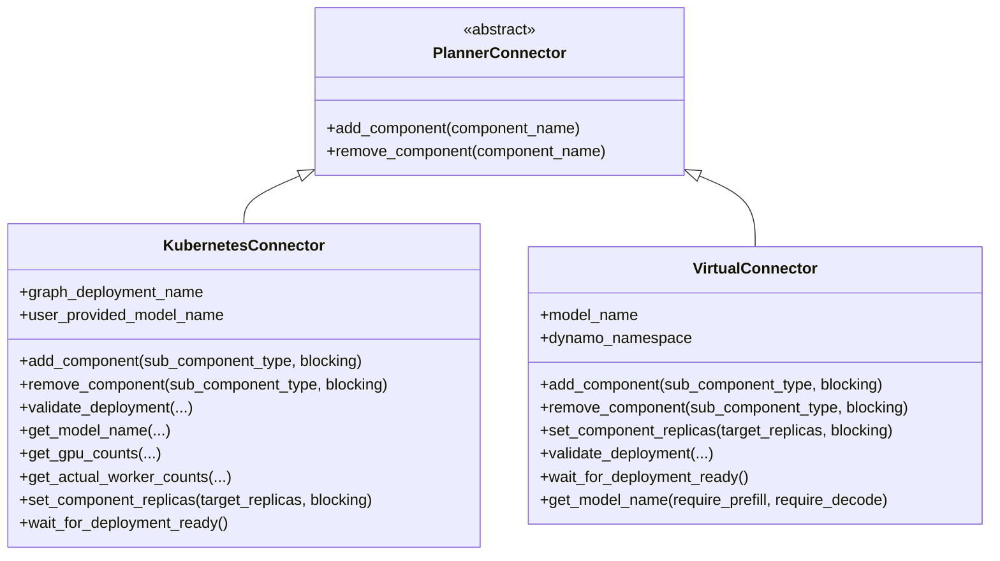
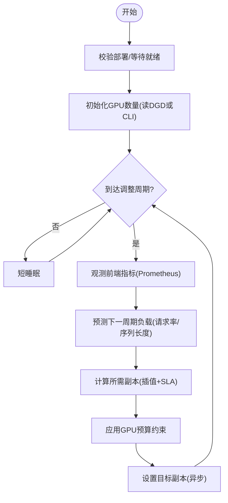
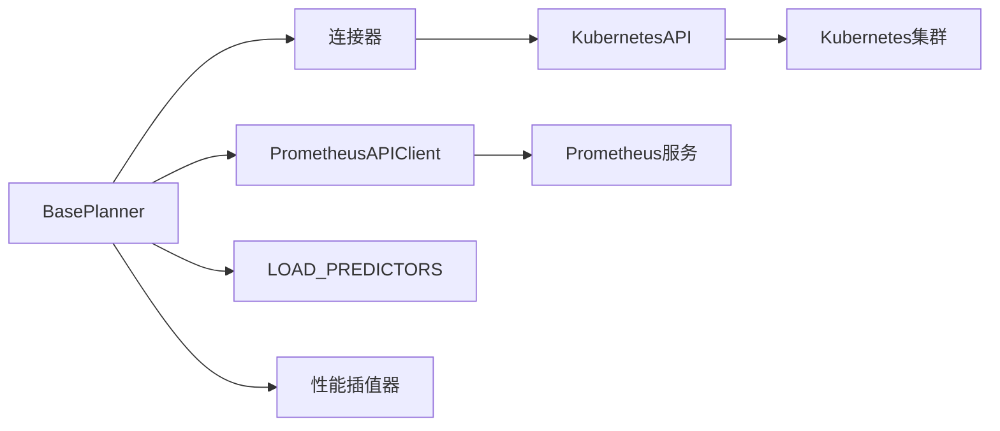

# 规划器工具集

<cite>
**本文引用的文件**
- [components/src/dynamo/planner/__init__.py](file://components/src/dynamo/planner/__init__.py)
- [components/src/dynamo/planner/defaults.py](file://components/src/dynamo/planner/defaults.py)
- [components/src/dynamo/planner/planner_connector.py](file://components/src/dynamo/planner/planner_connector.py)
- [components/src/dynamo/planner/kubernetes_connector.py](file://components/src/dynamo/planner/kubernetes_connector.py)
- [components/src/dynamo/planner/virtual_connector.py](file://components/src/dynamo/planner/virtual_connector.py)
- [components/src/dynamo/planner/planner_sla.py](file://components/src/dynamo/planner/planner_sla.py)
- [components/src/dynamo/planner/utils/prometheus.py](file://components/src/dynamo/planner/utils/prometheus.py)
- [components/src/dynamo/planner/utils/load_predictor.py](file://components/src/dynamo/planner/utils/load_predictor.py)
- [components/src/dynamo/planner/utils/planner_core.py](file://components/src/dynamo/planner/utils/planner_core.py)
- [components/src/dynamo/planner/utils/planner_argparse.py](file://components/src/dynamo/planner/utils/planner_argparse.py)
- [components/src/dynamo/planner/utils/exceptions.py](file://components/src/dynamo/planner/utils/exceptions.py)
- [components/src/dynamo/planner/utils/perf_interpolation.py](file://components/src/dynamo/planner/utils/perf_interpolation.py)
- [components/src/dynamo/planner/kube.py](file://components/src/dynamo/planner/kube.py)
- [docs/pages/components/planner/README.md](file://docs/pages/components/planner/README.md)
</cite>

## 目录
1. [简介](#简介)
2. [项目结构](#项目结构)
3. [核心组件](#核心组件)
4. [架构总览](#架构总览)
5. [详细组件分析](#详细组件分析)
6. [依赖关系分析](#依赖关系分析)
7. [性能与监控](#性能与监控)
8. [故障排查指南](#故障排查指南)
9. [结论](#结论)
10. [附录：配置与使用示例](#附录配置与使用示例)

## 简介
本文件系统性梳理 Dynamo 规划器工具集的功能与实现，涵盖默认配置管理、监控集成、负载预测、性能插值、Kubernetes/Virtal 扩缩容连接器、以及与前端/运行时的集成方式。文档面向不同技术背景的读者，既提供高层概览，也给出代码级的可视化图示与路径引用，便于快速定位实现细节。

## 项目结构
规划器相关代码集中在 components/src/dynamo/planner 及其 utils 子目录中，主要模块包括：
- 默认配置与常量：defaults.py
- 连接器抽象与实现：planner_connector.py、kubernetes_connector.py、virtual_connector.py
- SLA 规划器入口：planner_sla.py
- 工具函数：utils/*.py（Prometheus 查询、负载预测、性能插值、参数解析、异常定义）
- Kubernetes API 封装：kube.py

图表来源
- [components/src/dynamo/planner/defaults.py](file://components/src/dynamo/planner/defaults.py#L34-L134)
- [components/src/dynamo/planner/planner_connector.py](file://components/src/dynamo/planner/planner_connector.py#L19-L30)
- [components/src/dynamo/planner/kubernetes_connector.py](file://components/src/dynamo/planner/kubernetes_connector.py#L48-L111)
- [components/src/dynamo/planner/virtual_connector.py](file://components/src/dynamo/planner/virtual_connector.py#L28-L101)
- [components/src/dynamo/planner/planner_sla.py](file://components/src/dynamo/planner/planner_sla.py#L36-L50)
- [components/src/dynamo/planner/kube.py](file://components/src/dynamo/planner/kube.py#L40-L193)
- [components/src/dynamo/planner/utils/prometheus.py](file://components/src/dynamo/planner/utils/prometheus.py#L45-L170)
- [components/src/dynamo/planner/utils/load_predictor.py](file://components/src/dynamo/planner/utils/load_predictor.py#L55-L405)
- [components/src/dynamo/planner/utils/planner_core.py](file://components/src/dynamo/planner/utils/planner_core.py#L37-L122)
- [components/src/dynamo/planner/utils/planner_argparse.py](file://components/src/dynamo/planner/utils/planner_argparse.py#L21-L179)
- [components/src/dynamo/planner/utils/exceptions.py](file://components/src/dynamo/planner/utils/exceptions.py#L41-L207)
- [components/src/dynamo/planner/utils/perf_interpolation.py](file://components/src/dynamo/planner/utils/perf_interpolation.py#L37-L247)

章节来源
- [components/src/dynamo/planner/__init__.py](file://components/src/dynamo/planner/__init__.py#L1-L32)

## 核心组件
- 默认配置与常量
  - 基类与默认值：命名空间、环境、后端类型、调整间隔、最大GPU预算、最小端点数、每引擎GPU数、指标上报端口等。
  - SLA 配置：Prometheus 拉取端点、profiling 结果目录、SLA 指标阈值（TTFT/ITL）、预测器类型及参数、模式（解耦/仅prefill/仅decode）等。
  - 组件名映射：不同后端（vLLM/SGLang/TRTLLM/Mocker）的预填/解码工作组件名称。
  - 服务解析工具：从部署中提取服务副本数、模型名、GPU 数量，并校验唯一性和一致性。
- 连接器抽象与实现
  - 抽象接口：统一 add/remove 组件能力。
  - Kubernetes 连接器：读取/校验 DGD、获取实际工作副本、设置目标副本、等待就绪、拉取模型名/GPU 数等。
  - 虚拟连接器：在非原生环境输出扩缩容决策，通过运行时协调器与外部环境交互。
- SLA 规划器入口
  - 提供带延迟启动的 worker，初始化并启动 SLA 规划器主循环。
- 工具函数
  - Prometheus 查询：封装前端指标查询（平均 TTFT/ITL/请求时长/请求数/输入/输出序列长度），支持按模型名与命名空间过滤。
  - 负载预测：支持 constant/arima/kalman/prophet 四类预测器，含 log1p 变换、窗口大小、最小数据点等可调参数。
  - 性能插值：基于预部署 profiling 的插值器，分别对 prefill/decode 的 TTFT/吞吐/GPU 利用进行插值或网格查找。
  - 参数解析：集中定义 SLA 规划器命令行参数，覆盖环境、命名空间、后端、模式、GPU 预算、SLA 阈值、预测器参数、指标端点与上报端口等。
  - 异常体系：针对 DGD 查找、子组件缺失/重复、模型名不一致、GPU 数量缺失、空目标副本等场景的专用异常。

章节来源
- [components/src/dynamo/planner/defaults.py](file://components/src/dynamo/planner/defaults.py#L34-L271)
- [components/src/dynamo/planner/planner_connector.py](file://components/src/dynamo/planner/planner_connector.py#L19-L30)
- [components/src/dynamo/planner/kubernetes_connector.py](file://components/src/dynamo/planner/kubernetes_connector.py#L48-L373)
- [components/src/dynamo/planner/virtual_connector.py](file://components/src/dynamo/planner/virtual_connector.py#L28-L149)
- [components/src/dynamo/planner/planner_sla.py](file://components/src/dynamo/planner/planner_sla.py#L36-L56)
- [components/src/dynamo/planner/utils/prometheus.py](file://components/src/dynamo/planner/utils/prometheus.py#L45-L183)
- [components/src/dynamo/planner/utils/load_predictor.py](file://components/src/dynamo/planner/utils/load_predictor.py#L55-L406)
- [components/src/dynamo/planner/utils/planner_core.py](file://components/src/dynamo/planner/utils/planner_core.py#L37-L400)
- [components/src/dynamo/planner/utils/planner_argparse.py](file://components/src/dynamo/planner/utils/planner_argparse.py#L21-L180)
- [components/src/dynamo/planner/utils/exceptions.py](file://components/src/dynamo/planner/utils/exceptions.py#L41-L208)
- [components/src/dynamo/planner/utils/perf_interpolation.py](file://components/src/dynamo/planner/utils/perf_interpolation.py#L37-L309)

## 架构总览
规划器以“抽象接口 + 多环境连接器 + 工具函数库”的方式组织，核心流程如下：
- 初始化：解析参数、选择连接器（K8s 或 Virtual）、构建负载预测器与性能插值器、启动本地 Prometheus 指标服务器（可选）。
- 观测：周期性从 Prometheus 拉取前端指标，更新共享状态与本地指标。
- 预测：使用负载预测器预测下一周期的请求率与序列长度，结合插值器计算所需副本数。
- 预算约束：应用全局/单组件 GPU 预算，按比例缩放并保证最小端点数。
- 执行：通过连接器设置目标副本数，等待部署就绪（K8s）或等待外部确认（Virtual）。

图表来源
- [components/src/dynamo/planner/utils/planner_core.py](file://components/src/dynamo/planner/utils/planner_core.py#L703-L762)
- [components/src/dynamo/planner/utils/prometheus.py](file://components/src/dynamo/planner/utils/prometheus.py#L102-L169)
- [components/src/dynamo/planner/kubernetes_connector.py](file://components/src/dynamo/planner/kubernetes_connector.py#L112-L163)
- [components/src/dynamo/planner/virtual_connector.py](file://components/src/dynamo/planner/virtual_connector.py#L129-L141)

## 详细组件分析

### 默认配置与环境变量
- 关键默认项
  - 命名空间：来自 DYN_NAMESPACE（Operator 注入格式："{k8s_namespace}-{dgd_name}"），默认 "dynamo"。
  - 环境：默认 "kubernetes"。
  - 后端：默认 "vllm"。
  - no_operation：默认关闭，开启后不实际扩缩容。
  - 日志目录：None。
  - 调整间隔：180 秒。
  - 最大 GPU 预算：8；最小端点：1。
  - 每引擎 GPU 数：prefill/decode 默认 1。
  - 指标上报端口：PLANNER_PROMETHEUS_PORT（默认 0 表示禁用）。
- SLA 默认项
  - Prometheus 拉取端点：默认 Prometheus 地址。
  - profiling 结果目录：默认 "profiling_results"。
  - SLA 阈值：isl=3000，osl=150，ttft=500ms，itl=50ms。
  - 负载预测器：默认 "arima"，支持 ["constant","arima","kalman","prophet"]。
  - 预测器参数：prophet_window_size、load_predictor_log1p、kalman_q_level/q_trend/r/min_points。
  - 模式：默认 "disagg"（prefill+decode）。
- 组件名映射
  - vLLM/SGLang/TRTLLM/Mocker 的预填/解码组件名称与端点。
- 服务解析
  - 从 DGD 中按 subComponentType 或回退组件名获取服务，支持重复校验、GPU 数量解析（优先 limits，次选 requests）。

章节来源
- [components/src/dynamo/planner/defaults.py](file://components/src/dynamo/planner/defaults.py#L34-L134)
- [components/src/dynamo/planner/defaults.py](file://components/src/dynamo/planner/defaults.py#L157-L271)

### 连接器抽象与实现
- 抽象接口
  - PlannerConnector 定义 add_component/remove_component 两个异步方法，作为所有环境适配器的统一契约。
- Kubernetes 连接器
  - 依赖 DYN_PARENT_DGD_K8S_NAME 获取父级 DGD 名称；若未设置则抛出部署验证错误。
  - 支持 add/remove 组件（增加/减少一个副本），并可阻塞等待部署就绪。
  - 部署校验：确保存在 prefill/decode 两类子组件（或兼容回退组件名），并校验模型名一致性。
  - 模型名与 GPU 数：从 DGD 解析，支持用户提供的模型名回退与冲突检查。
  - 实际工作副本：从 DGD 状态读取 ready/available replicas，并判断是否处于稳定 rollout。
  - 批量设置：接收 TargetReplica 列表，避免重复设置，必要时等待就绪。
- 虚拟连接器
  - 在非原生环境中输出扩缩容决策，通过运行时 VirtualConnectorCoordinator 与外部环境交互。
  - 提供等待完成、更新决策、批量设置等能力。
  - 通过环境变量控制轮询间隔与最大等待时间。

图表来源
- [components/src/dynamo/planner/planner_connector.py](file://components/src/dynamo/planner/planner_connector.py#L19-L30)
- [components/src/dynamo/planner/kubernetes_connector.py](file://components/src/dynamo/planner/kubernetes_connector.py#L48-L373)
- [components/src/dynamo/planner/virtual_connector.py](file://components/src/dynamo/planner/virtual_connector.py#L28-L149)

章节来源
- [components/src/dynamo/planner/planner_connector.py](file://components/src/dynamo/planner/planner_connector.py#L19-L30)
- [components/src/dynamo/planner/kubernetes_connector.py](file://components/src/dynamo/planner/kubernetes_connector.py#L48-L373)
- [components/src/dynamo/planner/virtual_connector.py](file://components/src/dynamo/planner/virtual_connector.py#L28-L149)

### SLA 规划器入口与主循环
- 入口
  - 使用 @dynamo_worker 包装的 init_planner，在延迟后启动 start_sla_planner，并注册 dummy endpoint。
- 主循环（BasePlanner.run）
  - 部署校验与就绪等待。
  - 初始化 GPU 数量（优先从 DGD 读取，否则要求 CLI 指定）。
  - 获取模型名并归一化为小写。
  - 周期性观测指标、更新预测器、计算所需副本、应用预算约束、异步应用扩缩容。
  - 指标上报：本地 Prometheus 指标服务器（如启用）暴露工作副本数、观测/预测指标、GPU 小时累计等。

图表来源
- [components/src/dynamo/planner/utils/planner_core.py](file://components/src/dynamo/planner/utils/planner_core.py#L703-L762)
- [components/src/dynamo/planner/utils/planner_core.py](file://components/src/dynamo/planner/utils/planner_core.py#L511-L625)

章节来源
- [components/src/dynamo/planner/planner_sla.py](file://components/src/dynamo/planner/planner_sla.py#L36-L56)
- [components/src/dynamo/planner/utils/planner_core.py](file://components/src/dynamo/planner/utils/planner_core.py#L258-L762)

### Prometheus 指标采集与查询
- 查询封装
  - PrometheusAPIClient：封装前端指标查询，自动拼接指标前缀，支持按模型名与命名空间过滤。
  - 提供平均 TTFT、ITL、请求时长、请求数、输入/输出序列长度等查询方法。
  - 返回值为数值或 0（无数据时），并记录警告日志。
- 指标容器解析
  - FrontendMetric/FrontendMetricContainer：Pydantic 模型用于解析 Prometheus 返回的指标容器。
- 规划器指标
  - PlannerPrometheusMetrics：暴露工作副本数、观测/预测指标、校正因子、GPU 小时累计等指标，支持本地 HTTP 暴露。

章节来源
- [components/src/dynamo/planner/utils/prometheus.py](file://components/src/dynamo/planner/utils/prometheus.py#L45-L183)
- [components/src/dynamo/planner/utils/planner_core.py](file://components/src/dynamo/planner/utils/planner_core.py#L62-L122)

### 负载预测器
- 支持类型
  - constant：最近值外推。
  - arima：自动 ARIMA，支持原始/对数变换，必要时回退到 log1p 空间。
  - prophet：基于 Meta Prophet 的时间序列预测，支持窗口大小与步长。
  - kalman：一维卡尔曼滤波，适合低延迟平滑与短期预测。
- 关键参数
  - load_predictor_log1p：对选定预测器使用 log1p(y)。
  - prophet_window_size：Prophet 历史窗口大小。
  - kalman_q_level/q_trend/r/min_points：过程噪声/测量噪声与最小数据点。
- 数据处理
  - 自动忽略部署后的初始空闲时段（leading zeros），直到出现首个非零样本。

章节来源
- [components/src/dynamo/planner/utils/load_predictor.py](file://components/src/dynamo/planner/utils/load_predictor.py#L55-L406)

### 性能插值
- Prefill 插值器
  - 基于预部署 profiling 的 ISL 范围，对 TTFT 与每 GPU 吞吐进行 1D 插值。
- Decode 插值器
  - 基于 KV 使用率与上下文长度的二维网格，对 ITL 与每 GPU 吞吐进行插值，并填充 NaN。
  - 提供在给定 ITL 下寻找最佳吞吐与 KV 使用率的能力。
- 缺失数据提示
  - 若未找到 profiling 文件，抛出包含指引信息的错误。

章节来源
- [components/src/dynamo/planner/utils/perf_interpolation.py](file://components/src/dynamo/planner/utils/perf_interpolation.py#L37-L309)

### 参数解析与环境变量
- 参数解析器
  - create_sla_planner_parser：集中定义 SLA 规划器命令行参数，覆盖环境、命名空间、后端、模式、GPU 预算、SLA 阈值、预测器参数、指标端点与上报端口等。
- 环境变量
  - DYN_NAMESPACE：命名空间（Operator 注入）。
  - DYN_PARENT_DGD_K8S_NAME：父级 DGD 名称（K8s 连接器必需）。
  - PLANNER_PROMETHEUS_PORT：规划器本地指标上报端口（0 禁用）。
  - PROMETHEUS_ENDPOINT：Prometheus 拉取端点（SLA 默认值）。
  - SCALING_CHECK_INTERVAL/SCALING_MAX_WAIT_TIME：虚拟连接器轮询与等待上限（秒）。

章节来源
- [components/src/dynamo/planner/utils/planner_argparse.py](file://components/src/dynamo/planner/utils/planner_argparse.py#L21-L180)
- [components/src/dynamo/planner/defaults.py](file://components/src/dynamo/planner/defaults.py#L36-L48)
- [components/src/dynamo/planner/virtual_connector.py](file://components/src/dynamo/planner/virtual_connector.py#L18-L25)

### Kubernetes API 封装
- 配置加载：优先 in-cluster，失败则回退到 kubeconfig。
- DGD 获取：通过 CRD API 获取父级 DynamoGraphDeployment。
- 副本更新：优先通过 DynamcGraphDeploymentScalingAdapter 的 Scale 子资源更新；不存在时回退到直接修改 DGD。
- 就绪检查：根据 status.conditions 与服务状态字段判断 Ready 与稳定 rollout。

章节来源
- [components/src/dynamo/planner/kube.py](file://components/src/dynamo/planner/kube.py#L40-L226)

## 依赖关系分析
- 组件耦合
  - BasePlanner 依赖连接器、Prometheus 客户端、负载预测器、性能插值器、K8s API。
  - 连接器依赖 K8s API 与 DGD 结构约定。
  - 工具模块相互独立，通过参数与返回值耦合。
- 外部依赖
  - Kubernetes Python 客户端、Prometheus Python 客户端、Pydantic、NumPy/Pandas/scipy 等。

图表来源
- [components/src/dynamo/planner/utils/planner_core.py](file://components/src/dynamo/planner/utils/planner_core.py#L258-L400)
- [components/src/dynamo/planner/kubernetes_connector.py](file://components/src/dynamo/planner/kubernetes_connector.py#L48-L111)
- [components/src/dynamo/planner/kube.py](file://components/src/dynamo/planner/kube.py#L40-L193)
- [components/src/dynamo/planner/utils/prometheus.py](file://components/src/dynamo/planner/utils/prometheus.py#L45-L125)
- [components/src/dynamo/planner/utils/load_predictor.py](file://components/src/dynamo/planner/utils/load_predictor.py#L400-L406)
- [components/src/dynamo/planner/utils/perf_interpolation.py](file://components/src/dynamo/planner/utils/perf_interpolation.py#L37-L100)

## 性能与监控
- 指标暴露
  - 本地 Prometheus HTTP 服务器：当 metric_reporting_prometheus_port 非 0 时启动，暴露工作副本数、观测/预测指标、校正因子、GPU 小时累计等。
- 观测与预测
  - 每个调整周期从 Prometheus 拉取平均 TTFT/ITL/请求时长/请求数/序列长度，更新预测器并计算所需副本。
- 预算约束
  - 全局 GPU 预算：按比例缩放 prefill/decode 副本，保留最小端点数。
  - 单组件预算：单独限制某一组件的副本数。
- 监控集成
  - 文档化了 Grafana 仪表盘与 Prometheus 指标清单，展示 worker 数、GPU 使用、TTFT/ITL、请求速率、序列长度、预测负载与推荐副本数等。

章节来源
- [components/src/dynamo/planner/utils/planner_core.py](file://components/src/dynamo/planner/utils/planner_core.py#L62-L122)
- [components/src/dynamo/planner/utils/planner_core.py](file://components/src/dynamo/planner/utils/planner_core.py#L132-L208)
- [docs/pages/components/planner/README.md](file://docs/pages/components/planner/README.md#L103-L125)

## 故障排查指南
- 常见异常
  - DynamoGraphDeploymentNotFoundError：未找到父级 DGD 或未设置 DYN_PARENT_DGD_K8S_NAME。
  - SubComponentNotFoundError/DuplicateSubComponentError：缺少或重复的子组件类型。
  - ModelNameNotFoundError/DeploymentModelNameMismatchError/UserProvidedModelNameMismatchError：模型名缺失或不一致。
  - DeploymentValidationError：部署校验聚合错误。
  - EmptyTargetReplicasError：目标副本列表为空。
- 排查建议
  - 确认 DGD 中存在唯一的 prefill/decode 服务，且 subComponentType 正确。
  - 检查 DGD 中 resources.limits/requests.gpu 是否设置，或在虚拟模式下通过 CLI 指定。
  - 核对 PLANNER_PROMETHEUS_PORT 与 PROMETHEUS_ENDPOINT 是否正确。
  - 关注日志中的警告与错误，尤其是“无数据可用”“超出GPU预算”等提示。

章节来源
- [components/src/dynamo/planner/utils/exceptions.py](file://components/src/dynamo/planner/utils/exceptions.py#L41-L208)
- [components/src/dynamo/planner/kubernetes_connector.py](file://components/src/dynamo/planner/kubernetes_connector.py#L112-L163)
- [components/src/dynamo/planner/utils/prometheus.py](file://components/src/dynamo/planner/utils/prometheus.py#L74-L100)

## 结论
规划器工具集通过清晰的抽象与模块化设计，实现了跨环境的一致扩缩容能力。默认配置与环境变量提供了灵活的定制空间，Prometheus 指标与负载预测器共同驱动 SLA 友好的副本调度，性能插值器将预部署 profiling 结果转化为实时决策依据。配合 Kubernetes 与虚拟连接器，规划器可在真实集群与仿真环境中稳定运行。

## 附录：配置与使用示例
- 环境变量
  - DYN_NAMESPACE：规划器命名空间（由 Operator 注入）。
  - DYN_PARENT_DGD_K8S_NAME：父级 DGD 名称（K8s 连接器必需）。
  - PLANNER_PROMETHEUS_PORT：规划器本地指标端口（0 禁用）。
  - PROMETHEUS_ENDPOINT：Prometheus 拉取端点（SLA 默认值）。
  - SCALING_CHECK_INTERVAL/SCALING_MAX_WAIT_TIME：虚拟连接器轮询与等待上限。
- 命令行参数（节选）
  - --environment/--namespace/--backend/--mode/--no-operation/--log-dir/--adjustment-interval/--max-gpu-budget/--min-endpoint
  - --decode-engine-num-gpu/--prefill-engine-num-gpu/--profile-results-dir
  - --ttft/--itl/--load-predictor/--load-predictor-log1p/--prophet-window-size
  - --load-predictor-warmup-trace/--kalman-q-level/--kalman-q-trend/--kalman-r/--kalman-min-points
  - --metric-pulling-prometheus-endpoint/--metric-reporting-prometheus-port/--no-correction/--model-name
- 配置示例思路
  - 参数覆盖：通过 CLI 显式指定 --adjustment-interval、--max-gpu-budget、--prefill-engine-num-gpu 等，覆盖默认值。
  - 环境定制：在虚拟模式下必须提供 --model-name；在 K8s 模式下可从 DGD 自动读取 GPU 数量。
  - 监控指标：启用本地指标上报（设置 PLANNER_PROMETHEUS_PORT），并确保 Prometheus 能从前端 /metrics 拉取所需指标。
  - SLA 设置：根据业务目标调整 ttft/itl 阈值与预测器类型（如 --load-predictor=kalman），并提供合适的 profiling 结果目录。

章节来源
- [components/src/dynamo/planner/utils/planner_argparse.py](file://components/src/dynamo/planner/utils/planner_argparse.py#L21-L180)
- [components/src/dynamo/planner/defaults.py](file://components/src/dynamo/planner/defaults.py#L36-L83)
- [docs/pages/components/planner/README.md](file://docs/pages/components/planner/README.md#L103-L125)