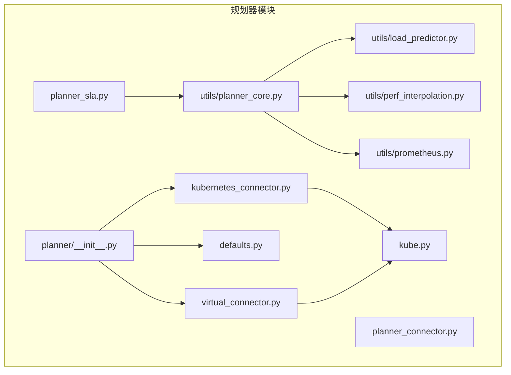
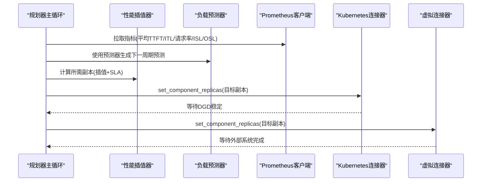
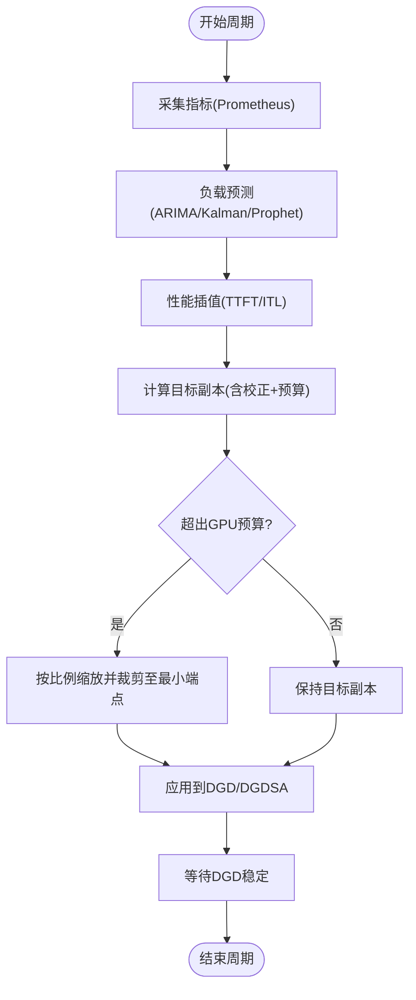
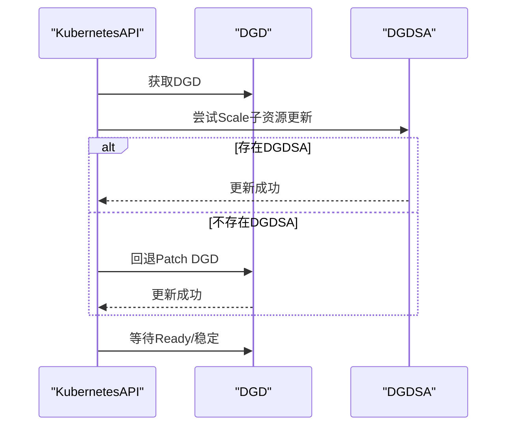
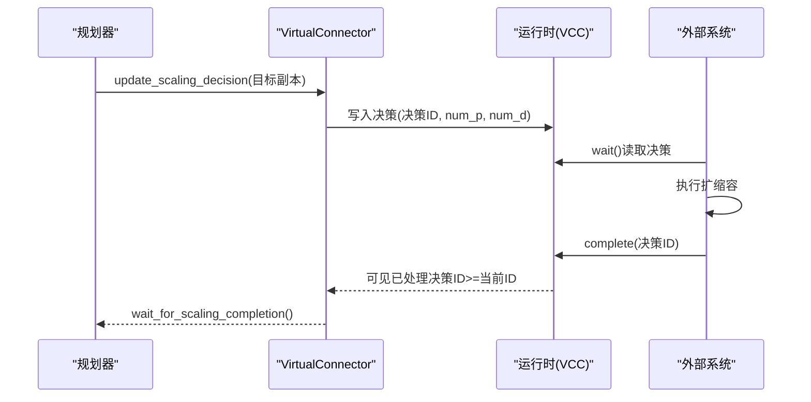
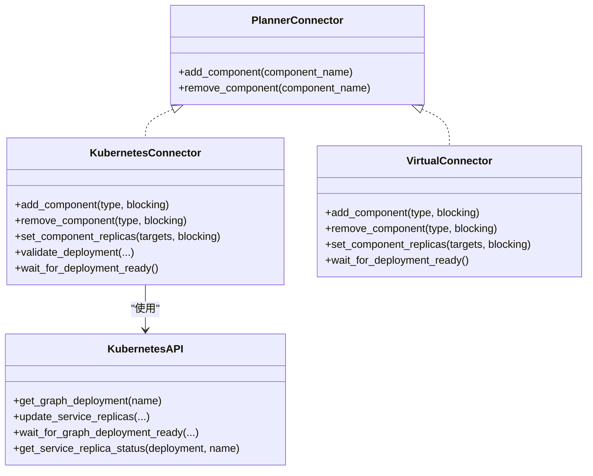

# 规划器组件

<cite>
**本文引用的文件**
- [planner/__init__.py](file://components/src/dynamo/planner/__init__.py)
- [planner_sla.py](file://components/src/dynamo/planner/planner_sla.py)
- [defaults.py](file://components/src/dynamo/planner/defaults.py)
- [kube.py](file://components/src/dynamo/planner/kube.py)
- [kubernetes_connector.py](file://components/src/dynamo/planner/kubernetes_connector.py)
- [virtual_connector.py](file://components/src/dynamo/planner/virtual_connector.py)
- [planner_connector.py](file://components/src/dynamo/planner/planner_connector.py)
- [planner_core.py](file://components/src/dynamo/planner/utils/planner_core.py)
- [load_predictor.py](file://components/src/dynamo/planner/utils/load_predictor.py)
- [perf_interpolation.py](file://components/src/dynamo/planner/utils/perf_interpolation.py)
- [prometheus.py](file://components/src/dynamo/planner/utils/prometheus.py)
- [planner-design.md](file://docs/pages/design-docs/planner-design.md)
- [test_scaling_e2e.py](file://tests/planner/test_scaling_e2e.py)
- [global_router_config.json](file://examples/hierarchical_planner/global_router_config.json)
</cite>

## 目录
1. [简介](#简介)
2. [项目结构](#项目结构)
3. [核心组件](#核心组件)
4. [架构总览](#架构总览)
5. [详细组件分析](#详细组件分析)
6. [依赖关系分析](#依赖关系分析)
7. [性能考量](#性能考量)
8. [故障排查指南](#故障排查指南)
9. [结论](#结论)
10. [附录：配置与使用示例](#附录配置与使用示例)

## 简介
本文件系统性梳理Dynamo规划器组件的设计与实现，重点覆盖以下方面：
- SLA驱动的自动扩缩容机制：性能预测模型、资源需求计算与扩缩容决策逻辑
- 与Kubernetes的集成方式：通过DGD/DGDSA进行原生扩缩容
- 虚拟连接器（VirtualConnector）工作原理与默认配置策略
- 事件平面协调机制、零停机调整与动态资源分配算法
- 性能监控指标与调优建议
- 与其他组件的协作模式与扩展接口

## 项目结构
规划器位于components/src/dynamo/planner目录下，采用“功能域+分层”的组织方式：
- 接口与默认值：planner_connector.py、defaults.py
- 连接器：kubernetes_connector.py、virtual_connector.py、kube.py
- 核心算法与运行时：planner_core.py、load_predictor.py、perf_interpolation.py、prometheus.py
- 启动入口与文档：planner_sla.py、planner-design.md

**图表来源**
- [planner/__init__.py](file://components/src/dynamo/planner/__init__.py#L1-L32)
- [planner_sla.py](file://components/src/dynamo/planner/planner_sla.py#L1-L56)
- [defaults.py](file://components/src/dynamo/planner/defaults.py#L1-L271)
- [planner_connector.py](file://components/src/dynamo/planner/planner_connector.py#L1-L30)
- [kubernetes_connector.py](file://components/src/dynamo/planner/kubernetes_connector.py#L1-L401)
- [virtual_connector.py](file://components/src/dynamo/planner/virtual_connector.py#L1-L149)
- [kube.py](file://components/src/dynamo/planner/kube.py#L1-L226)
- [planner_core.py](file://components/src/dynamo/planner/utils/planner_core.py#L1-L200)
- [load_predictor.py](file://components/src/dynamo/planner/utils/load_predictor.py#L1-L200)
- [perf_interpolation.py](file://components/src/dynamo/planner/utils/perf_interpolation.py#L1-L200)
- [prometheus.py](file://components/src/dynamo/planner/utils/prometheus.py#L1-L183)

**章节来源**
- [planner/__init__.py](file://components/src/dynamo/planner/__init__.py#L1-L32)
- [planner_sla.py](file://components/src/dynamo/planner/planner_sla.py#L1-L56)
- [planner-design.md](file://docs/pages/design-docs/planner-design.md#L1-L201)

## 核心组件
- 接口层：PlannerConnector抽象接口，定义add_component/remove_component等能力
- 连接器层：
  - KubernetesConnector：直接PATCH DGD/DGDSA以更新副本数
  - VirtualConnector：在非原生环境输出决策并通过事件平面协调
- 默认配置层：Base/Load/SLA三类默认值、后端组件名映射、子组件类型枚举
- 算法与运行时：负载预测、性能插值、Prometheus采集、主循环与指标上报
- 启动入口：SLA规划器入口脚本，延迟启动以等待其他组件就绪

**章节来源**
- [planner_connector.py](file://components/src/dynamo/planner/planner_connector.py#L1-L30)
- [kubernetes_connector.py](file://components/src/dynamo/planner/kubernetes_connector.py#L1-L401)
- [virtual_connector.py](file://components/src/dynamo/planner/virtual_connector.py#L1-L149)
- [defaults.py](file://components/src/dynamo/planner/defaults.py#L1-L271)
- [planner_core.py](file://components/src/dynamo/planner/utils/planner_core.py#L1-L200)
- [planner_sla.py](file://components/src/dynamo/planner/planner_sla.py#L1-L56)

## 架构总览
规划器采用“观测—预测—插值—决策—执行”的闭环：
- 观测：Prometheus采集前端指标（TTFT、ITL、请求率、ISL/OSL）
- 预测：基于历史数据的常量/ARIMA/Kalman/Prophet模型预测下一周期
- 插值：基于预部署性能剖析数据，对TTFT/ITL进行插值
- 决策：根据SLA目标与预测结果计算所需副本数，并应用GPU预算约束
- 执行：KubernetesConnector或VirtualConnector写入目标副本并等待稳定

**图表来源**
- [planner_core.py](file://components/src/dynamo/planner/utils/planner_core.py#L1-L200)
- [load_predictor.py](file://components/src/dynamo/planner/utils/load_predictor.py#L1-L200)
- [perf_interpolation.py](file://components/src/dynamo/planner/utils/perf_interpolation.py#L1-L200)
- [prometheus.py](file://components/src/dynamo/planner/utils/prometheus.py#L1-L183)
- [kubernetes_connector.py](file://components/src/dynamo/planner/kubernetes_connector.py#L1-L401)
- [virtual_connector.py](file://components/src/dynamo/planner/virtual_connector.py#L1-L149)

## 详细组件分析

### SLA驱动的自动扩缩容机制
- 指标采集与校正
  - 每个调整周期从Prometheus拉取平均TTFT/ITL/请求率/ISL/OSL
  - 维护校正因子：prefill_correction = 实际TTFT/期望TTFT；decode_correction = 实际ITL/期望ITL
  - 支持禁用校正（--no-correction）用于调试或冷启动主导场景
- 负载预测
  - 支持常量、ARIMA、卡尔曼、Prophet四种预测器
  - 支持从trace文件预热，Kalman需最少观测点
- 副本计算
  - Prefill副本：考虑预填修正因子与单批特性，按“预测负载/吞吐/GPU”估算
  - Decode副本：对ITL目标应用解码校正，通过插值器寻找满足目标的最优吞吐/GPU，再计算所需副本
- GPU预算约束
  - 在总GPU预算不足时按比例缩放，同时保证最小端点副本
- 执行与稳定等待
  - KubernetesConnector通过DGDSA Scale子资源或回退到DGD Patch更新副本
  - 等待DGD Ready或服务稳定（desired==updated==ready/available）

**图表来源**
- [planner_core.py](file://components/src/dynamo/planner/utils/planner_core.py#L123-L200)
- [load_predictor.py](file://components/src/dynamo/planner/utils/load_predictor.py#L1-L200)
- [perf_interpolation.py](file://components/src/dynamo/planner/utils/perf_interpolation.py#L1-L200)
- [prometheus.py](file://components/src/dynamo/planner/utils/prometheus.py#L1-L183)
- [kubernetes_connector.py](file://components/src/dynamo/planner/kubernetes_connector.py#L333-L373)

**章节来源**
- [planner-core.py](file://components/src/dynamo/planner/utils/planner_core.py#L1-L200)
- [load_predictor.py](file://components/src/dynamo/planner/utils/load_predictor.py#L1-L200)
- [perf_interpolation.py](file://components/src/dynamo/planner/utils/perf_interpolation.py#L1-L200)
- [prometheus.py](file://components/src/dynamo/planner/utils/prometheus.py#L1-L183)
- [planner-design.md](file://docs/pages/design-docs/planner-design.md#L18-L100)

### Kubernetes集成与零停机调整
- DGD/DGDSA解析与更新
  - 通过CustomObjectsApi访问DGD，优先使用DGDSA Scale子资源，不存在则回退到DGD Patch
  - 解析服务状态，判断可用副本与稳定状态（desired==updated==ready/available）
- 零停机调整策略
  - 仅在服务稳定时执行扩缩容，避免滚动过程中的并发调整
  - 等待DGD Ready或服务稳定后再进入下一周期
- 环境变量与命名空间
  - 通过DYN_PARENT_DGD_K8S_NAME定位父DGD
  - 自动探测当前K8s命名空间，支持in-cluster/out-of-cluster两种配置加载

**图表来源**
- [kube.py](file://components/src/dynamo/planner/kube.py#L40-L226)
- [kubernetes_connector.py](file://components/src/dynamo/planner/kubernetes_connector.py#L48-L111)

**章节来源**
- [kube.py](file://components/src/dynamo/planner/kube.py#L1-L226)
- [kubernetes_connector.py](file://components/src/dynamo/planner/kubernetes_connector.py#L1-L401)

### 虚拟连接器与事件平面协调
- 工作原理
  - 在非原生环境中，通过VirtualConnectorCoordinator向分布式运行时输出“决策ID+目标副本”
  - 外部系统通过VirtualConnectorClient轮询决策并执行扩缩容，完成后上报完成
  - 规划器等待“已处理决策ID≥当前决策ID”后继续
- 默认配置
  - 检查间隔与最大等待时间可由环境变量控制，默认约30分钟超时
  - 支持阻塞/非阻塞两种模式

**图表来源**
- [virtual_connector.py](file://components/src/dynamo/planner/virtual_connector.py#L1-L149)

**章节来源**
- [virtual_connector.py](file://components/src/dynamo/planner/virtual_connector.py#L1-L149)

### 默认配置策略与后端适配
- 默认参数
  - 基础：命名空间、环境、后端、调整周期、最大GPU预算、最小端点副本、每引擎GPU数、指标导出端口
  - SLA：Prometheus端点、剖析结果目录、SLA阈值（ISL/OSL/TTFT/ITL）、预测器类型与参数、模式（disagg/prefill/decode）
- 后端组件名映射
  - vLLM/SGLang/TRT-LLM/Mocker分别提供预填/解码组件名称与端点映射
- 服务解析
  - 优先按subComponentType解析服务，支持回退到旧式组件名
  - 提供GPU数解析与模型名提取

**章节来源**
- [defaults.py](file://components/src/dynamo/planner/defaults.py#L1-L271)

### 性能插值与预测模型
- 性能插值
  - 预填插值器：TTFT与吞吐/GPU关于ISL的1维插值
  - 解码插值器：ITL与吞吐/GPU关于KV利用率与上下文长度的2维插值，带NaN填充
- 预测模型
  - 常量：复制上一时刻
  - ARIMA：自动阶数选择，支持原始/对数变换
  - 卡尔曼：局部线性趋势滤波，支持最小观测点
  - Prophet：复杂季节性建模

**章节来源**
- [perf_interpolation.py](file://components/src/dynamo/planner/utils/perf_interpolation.py#L1-L200)
- [load_predictor.py](file://components/src/dynamo/planner/utils/load_predictor.py#L1-L200)

### 启动流程与初始化
- 启动延迟
  - SLA规划器入口在组件注册后延迟启动，确保前端与工作节点就绪
- 初始化步骤
  - 选择连接器（K8s/Virt），校验部署结构，加载剖析数据，构建插值器，初始化预测器，进入主循环

**章节来源**
- [planner_sla.py](file://components/src/dynamo/planner/planner_sla.py#L1-L56)
- [planner-design.md](file://docs/pages/design-docs/planner-design.md#L149-L161)

## 依赖关系分析
- 组件耦合
  - PlannerConnector为抽象接口，KubernetesConnector/VirtualConnector实现具体策略
  - planner_core依赖load_predictor、perf_interpolation、prometheus
  - kubernetes_connector依赖kube封装K8s API
- 外部依赖
  - Kubernetes: CustomObjectsApi、Scale子资源
  - Prometheus: 查询与聚合
  - 第三方库：pmdarima、filterpy、prophet、scipy等

**图表来源**
- [planner_connector.py](file://components/src/dynamo/planner/planner_connector.py#L1-L30)
- [kubernetes_connector.py](file://components/src/dynamo/planner/kubernetes_connector.py#L1-L401)
- [virtual_connector.py](file://components/src/dynamo/planner/virtual_connector.py#L1-L149)
- [kube.py](file://components/src/dynamo/planner/kube.py#L1-L226)

**章节来源**
- [planner_connector.py](file://components/src/dynamo/planner/planner_connector.py#L1-L30)
- [kubernetes_connector.py](file://components/src/dynamo/planner/kubernetes_connector.py#L1-L401)
- [virtual_connector.py](file://components/src/dynamo/planner/virtual_connector.py#L1-L149)
- [kube.py](file://components/src/dynamo/planner/kube.py#L1-L226)

## 性能考量
- 调整周期与扩容延迟匹配
  - 调整周期应长于添加/删除一个Worker所需时间（含调度、模型加载、注册），否则决策会堆积
- 校正因子稳定性
  - 在流量转换期可能振荡，必要时可禁用校正
- 插值精度与剖析成本
  - 插值粒度越高，准确性越好但剖析耗时越长
- 预测器预热
  - ARIMA/Prophet需要多个周期的历史数据；Kalman需达到最小观测点
- GPU预算与最小端点
  - 预算不足时按比例缩放，同时保留最小端点副本

**章节来源**
- [planner-design.md](file://docs/pages/design-docs/planner-design.md#L162-L176)

## 故障排查指南
- 部署校验失败
  - 现象：找不到prefill/decode服务或模型名不一致
  - 处理：检查DGD中subComponentType字段与服务args中的模型名
- DGD未就绪
  - 现象：等待超时
  - 处理：查看DGD Conditions与各服务状态，确认无滚动或错误
- 无指标数据
  - 现象：Prometheus查询为空
  - 处理：确认Frontend指标暴露、模型名大小写匹配、命名空间正确
- 虚拟连接器超时
  - 现象：长时间等待外部系统完成
  - 处理：检查外部系统是否轮询决策并上报完成；调整超时参数

**章节来源**
- [kubernetes_connector.py](file://components/src/dynamo/planner/kubernetes_connector.py#L112-L163)
- [kube.py](file://components/src/dynamo/planner/kube.py#L194-L226)
- [prometheus.py](file://components/src/dynamo/planner/utils/prometheus.py#L45-L183)
- [virtual_connector.py](file://components/src/dynamo/planner/virtual_connector.py#L18-L26)

## 结论
规划器通过“观测—预测—插值—决策—执行”的闭环，实现了面向SLA的自动扩缩容。其设计兼顾了Kubernetes原生集成与非原生环境的可扩展性，配合性能剖析与多模型预测，能够在不同负载模式下维持低时延与高吞吐。建议在生产中结合GPU预算、调整周期与预测器预热策略进行调优。

## 附录：配置与使用示例

- SLA规划器启动与参数
  - 入口脚本路径参考：[planner_sla.py](file://components/src/dynamo/planner/planner_sla.py#L52-L56)
  - 关键参数（示例）：Prometheus端点、剖析结果目录、SLA阈值、预测器类型、模式、调整周期、GPU预算
  - 参数解析参考：[planner_core.py](file://components/src/dynamo/planner/utils/planner_core.py#L1-L200)

- Kubernetes连接器使用
  - 初始化：传入命名空间与父DGD名称（通过环境变量注入）
  - 常用操作：add_component/remove_component/set_component_replicas
  - 稳定等待：wait_for_deployment_ready
  - 参考：[kubernetes_connector.py](file://components/src/dynamo/planner/kubernetes_connector.py#L48-L373)

- 虚拟连接器使用
  - 初始化：传入运行时、命名空间与模型名
  - 常用操作：add_component/remove_component/set_component_replicas（阻塞/非阻塞）
  - 参考：[virtual_connector.py](file://components/src/dynamo/planner/virtual_connector.py#L28-L149)

- 性能监控指标
  - 规划器指标容器：包含当前Worker数、观测与预测指标、校正因子、GPU小时累计
  - 指标定义参考：[planner_core.py](file://components/src/dynamo/planner/utils/planner_core.py#L62-L122)

- 端到端测试参考
  - 测试脚本展示了Graduated负载下的扩缩容行为与监控方法
  - 参考：[test_scaling_e2e.py](file://tests/planner/test_scaling_e2e.py#L1-L200)

- 层次化路由配置（全局路由器）
  - 示例配置展示了池数量、选择策略与映射
  - 参考：[global_router_config.json](file://examples/hierarchical_planner/global_router_config.json#L1-L24)