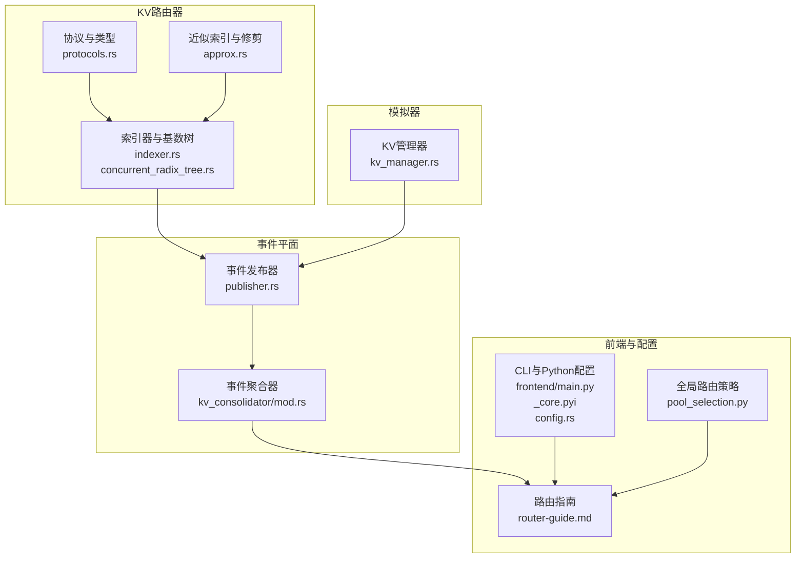
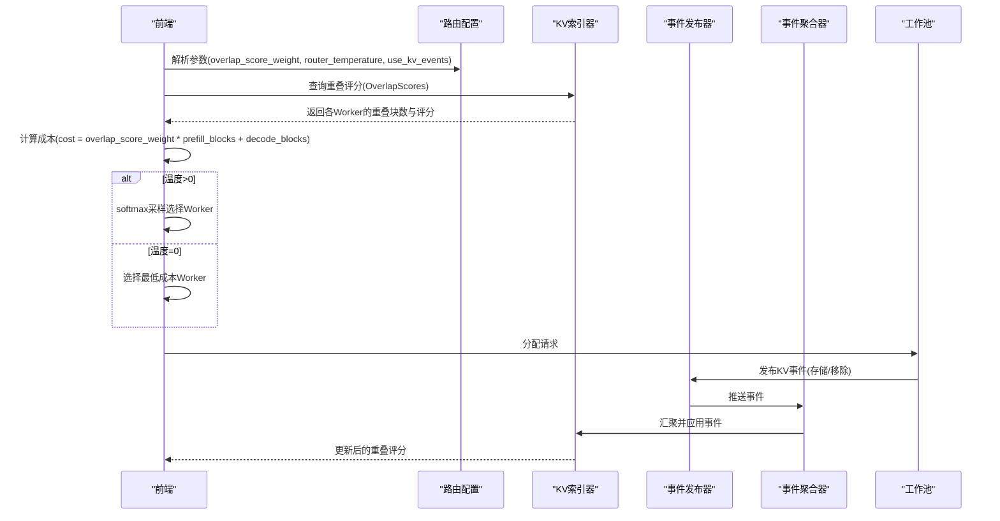
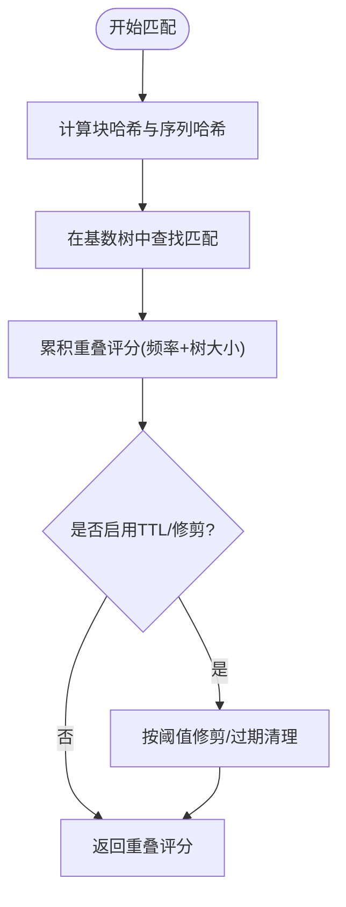
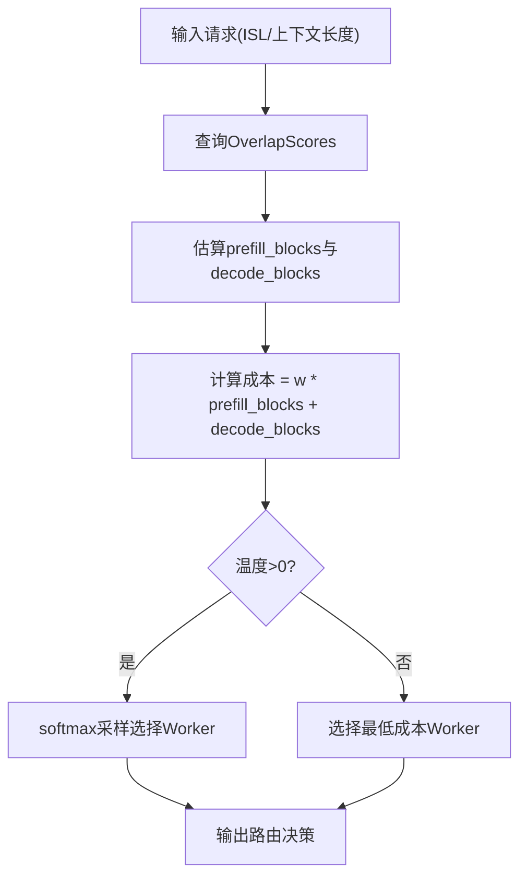
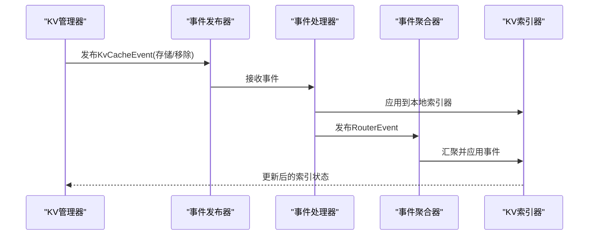
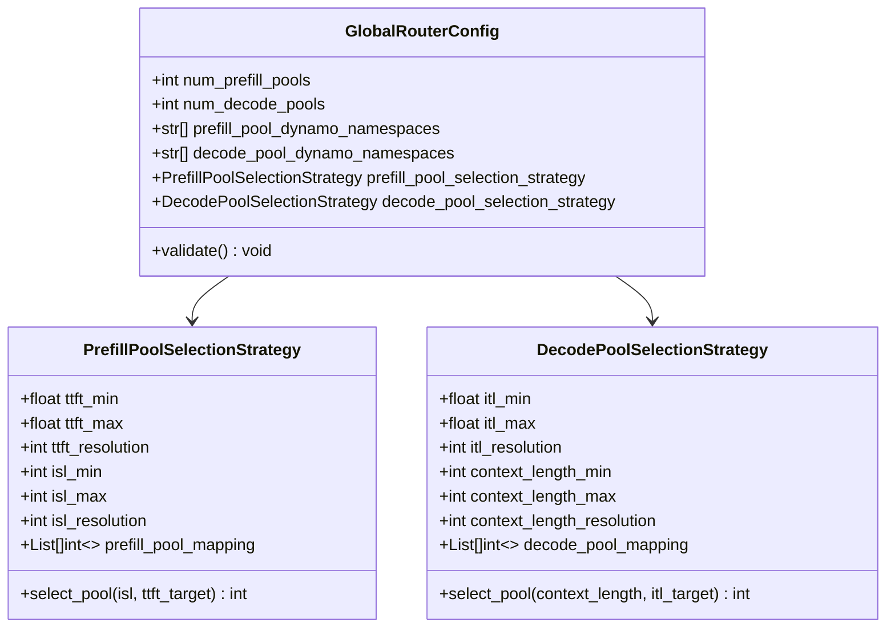
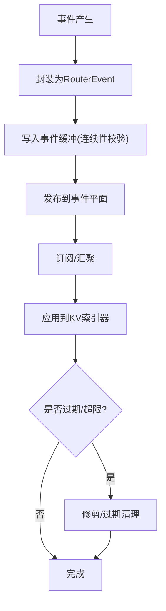
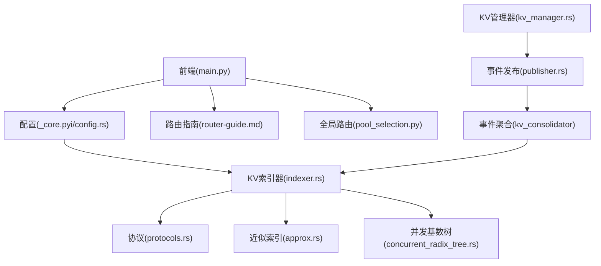

# KV缓存感知路由算法

<cite>
**本文档引用的文件**
- [lib/kv-router/src/lib.rs](file://lib/kv-router/src/lib.rs)
- [lib/kv-router/src/protocols.rs](file://lib/kv-router/src/protocols.rs)
- [lib/kv-router/src/approx.rs](file://lib/kv-router/src/approx.rs)
- [lib/kv-router/src/indexer.rs](file://lib/kv-router/src/indexer.rs)
- [lib/kv-router/src/concurrent_radix_tree.rs](file://lib/kv-router/src/concurrent_radix_tree.rs)
- [lib/llm/src/block_manager/kv_consolidator/mod.rs](file://lib/llm/src/block_manager/kv_consolidator/mod.rs)
- [lib/llm/src/kv_router/publisher.rs](file://lib/llm/src/kv_router/publisher.rs)
- [lib/mocker/src/kv_manager.rs](file://lib/mocker/src/kv_manager.rs)
- [components/src/dynamo/global_router/pool_selection.py](file://components/src/dynamo/global_router/pool_selection.py)
- [docs/pages/components/router/router-guide.md](file://docs/pages/components/router/router-guide.md)
- [lib/bindings/python/src/dynamo/_core.pyi](file://lib/bindings/python/src/dynamo/_core.pyi)
- [components/src/dynamo/frontend/main.py](file://components/src/dynamo/frontend/main.py)
- [lib/llm/src/kv_router/config.rs](file://lib/llm/src/kv_router/config.rs)
</cite>

## 目录
1. [简介](#简介)
2. [项目结构](#项目结构)
3. [核心组件](#核心组件)
4. [架构总览](#架构总览)
5. [详细组件分析](#详细组件分析)
6. [依赖关系分析](#依赖关系分析)
7. [性能考虑](#性能考虑)
8. [故障排除指南](#故障排除指南)
9. [结论](#结论)
10. [附录](#附录)

## 简介
本文件系统性阐述Dynamo的KV缓存感知路由算法，重点覆盖以下方面：
- KV缓存重用率计算原理：基于重叠块匹配与预估的前缀/解码阶段成本
- 重叠块匹配算法：基于分块哈希与序列哈希的近似索引与频率统计
- 工作池选择策略：基于成本函数与温度参数的确定性/随机性选择
- 路由决策核心逻辑：重叠分数权重、温度参数、缓存状态预测机制
- 与KV缓存管理器的交互：事件订阅、状态同步、缓存块管理
- 配置参数影响与调优建议：环境变量、CLI参数、运行时配置

## 项目结构
围绕KV缓存感知路由，核心代码分布在以下模块：
- KV路由器与协议：定义事件、重叠评分、令牌与块哈希等基础类型
- 近似索引与修剪：基于基数树的KV索引、TTL与大小修剪策略
- 事件聚合与发布：从引擎到路由器的事件汇聚与转发
- 全局路由策略：按网格映射的工作池选择（TTFT/ITL）
- 文档与配置：路由指南、CLI参数、Python绑定配置

**图表来源**
- [lib/kv-router/src/protocols.rs](file://lib/kv-router/src/protocols.rs#L1-L793)
- [lib/kv-router/src/approx.rs](file://lib/kv-router/src/approx.rs#L1-L800)
- [lib/kv-router/src/indexer.rs](file://lib/kv-router/src/indexer.rs#L1-L200)
- [lib/llm/src/block_manager/kv_consolidator/mod.rs](file://lib/llm/src/block_manager/kv_consolidator/mod.rs#L1-L166)
- [lib/llm/src/kv_router/publisher.rs](file://lib/llm/src/kv_router/publisher.rs#L263-L366)
- [docs/pages/components/router/router-guide.md](file://docs/pages/components/router/router-guide.md#L70-L198)
- [components/src/dynamo/global_router/pool_selection.py](file://components/src/dynamo/global_router/pool_selection.py#L1-L318)
- [lib/mocker/src/kv_manager.rs](file://lib/mocker/src/kv_manager.rs#L1-L548)
- [components/src/dynamo/frontend/main.py](file://components/src/dynamo/frontend/main.py#L156-L185)
- [lib/bindings/python/src/dynamo/_core.pyi](file://lib/bindings/python/src/dynamo/_core.pyi#L980-L1001)
- [lib/llm/src/kv_router/config.rs](file://lib/llm/src/kv_router/config.rs#L1-L40)

**章节来源**
- [lib/kv-router/src/lib.rs](file://lib/kv-router/src/lib.rs#L1-L30)
- [docs/pages/components/router/router-guide.md](file://docs/pages/components/router/router-guide.md#L70-L198)

## 核心组件
- 协议与类型：定义WorkerWithDpRank、RouterEvent、KvCacheEvent、OverlapScores、TokensWithHashes等，支撑跨组件的数据交换与状态表达
- 近似索引与修剪：通过PruneManager实现TTL过期与树大小修剪；通过PruneConfig控制阈值与目标比例
- 索引器与基数树：KvIndexer负责接收路由决策并应用到并发基数树；支持事件缓冲与事件ID连续性校验
- 事件聚合与发布：KvEventConsolidator统一汇聚来自不同引擎的KV事件；KvEventPublisher负责事件发布与关闭流程
- 全局路由策略：基于网格映射的预取池与解码池选择，结合ISL/TTFT与上下文长度/ITL目标
- KV管理器：模拟器中的KV管理器处理Use/Deref/Destory/Promote四种MoveBlock信号，维护活跃/非活跃块集合并发布事件

**章节来源**
- [lib/kv-router/src/protocols.rs](file://lib/kv-router/src/protocols.rs#L83-L555)
- [lib/kv-router/src/approx.rs](file://lib/kv-router/src/approx.rs#L45-L220)
- [lib/kv-router/src/indexer.rs](file://lib/kv-router/src/indexer.rs#L768-L800)
- [lib/llm/src/block_manager/kv_consolidator/mod.rs](file://lib/llm/src/block_manager/kv_consolidator/mod.rs#L77-L166)
- [lib/llm/src/kv_router/publisher.rs](file://lib/llm/src/kv_router/publisher.rs#L263-L366)
- [components/src/dynamo/global_router/pool_selection.py](file://components/src/dynamo/global_router/pool_selection.py#L22-L138)
- [lib/mocker/src/kv_manager.rs](file://lib/mocker/src/kv_manager.rs#L59-L391)

## 架构总览
KV缓存感知路由的整体数据流如下：
- 请求进入前端，根据模式选择路由策略（轮询/随机/KV感知）
- KV感知模式下，路由算法计算每个Worker的重叠块数量与成本，必要时引入温度参数进行采样
- Worker侧通过KV事件发布器将存储/移除事件发布到事件平面
- 事件被KV事件聚合器汇聚后，下发至KV索引器
- KV索引器更新并发基数树，提供重叠评分查询
- 前端根据评分与成本选择最优Worker

**图表来源**
- [components/src/dynamo/frontend/main.py](file://components/src/dynamo/frontend/main.py#L156-L185)
- [lib/bindings/python/src/dynamo/_core.pyi](file://lib/bindings/python/src/dynamo/_core.pyi#L980-L1001)
- [lib/llm/src/kv_router/publisher.rs](file://lib/llm/src/kv_router/publisher.rs#L322-L366)
- [lib/llm/src/block_manager/kv_consolidator/mod.rs](file://lib/llm/src/block_manager/kv_consolidator/mod.rs#L101-L132)
- [lib/kv-router/src/indexer.rs](file://lib/kv-router/src/indexer.rs#L1833-L1862)

## 详细组件分析

### 重叠块匹配与重叠评分
- 分块与序列哈希：TokensWithHashes按块大小切分令牌，计算本地块哈希与序列哈希，避免重复计算并缓存结果
- 重叠评分：OverlapScores统计每个Worker的重叠块频次与树大小，用于衡量缓存复用潜力
- TTL与修剪：PruneManager基于TTL与树大小阈值进行过期清理与目标比例修剪，保证索引规模可控

**图表来源**
- [lib/kv-router/src/protocols.rs](file://lib/kv-router/src/protocols.rs#L568-L652)
- [lib/kv-router/src/approx.rs](file://lib/kv-router/src/approx.rs#L45-L220)
- [lib/kv-router/src/concurrent_radix_tree.rs](file://lib/kv-router/src/concurrent_radix_tree.rs#L297-L337)

**章节来源**
- [lib/kv-router/src/protocols.rs](file://lib/kv-router/src/protocols.rs#L568-L652)
- [lib/kv-router/src/approx.rs](file://lib/kv-router/src/approx.rs#L17-L220)
- [lib/kv-router/src/concurrent_radix_tree.rs](file://lib/kv-router/src/concurrent_radix_tree.rs#L297-L337)

### 成本函数与工作池选择
- 成本计算：prefill_blocks与decode_blocks分别代表需要重新处理的块数与当前活跃解码块数；成本公式为重叠分数权重乘以prefill_blocks再加decode_blocks
- 最低成本选择：默认选择成本最小的Worker
- 温度参数：当router_temperature>0时，对成本进行softmax采样，引入随机性以改善负载分布

**图表来源**
- [docs/pages/components/router/router-guide.md](file://docs/pages/components/router/router-guide.md#L110-L130)
- [components/src/dynamo/frontend/main.py](file://components/src/dynamo/frontend/main.py#L156-L185)
- [lib/bindings/python/src/dynamo/_core.pyi](file://lib/bindings/python/src/dynamo/_core.pyi#L980-L1001)

**章节来源**
- [docs/pages/components/router/router-guide.md](file://docs/pages/components/router/router-guide.md#L106-L130)
- [components/src/dynamo/frontend/main.py](file://components/src/dynamo/frontend/main.py#L156-L185)
- [lib/bindings/python/src/dynamo/_core.pyi](file://lib/bindings/python/src/dynamo/_core.pyi#L980-L1001)

### 与KV缓存管理器的交互
- 事件发布：KV管理器在块使用/销毁/去引用/提升时生成KvCacheEvent并通过事件发布器发送
- 事件处理：事件处理器封装为RouterEvent并先应用到本地索引器，再发布到事件平面
- 状态同步：KV事件聚合器汇聚多源事件，确保KV索引器状态一致

**图表来源**
- [lib/mocker/src/kv_manager.rs](file://lib/mocker/src/kv_manager.rs#L110-L193)
- [lib/llm/src/kv_router/publisher.rs](file://lib/llm/src/kv_router/publisher.rs#L322-L366)
- [lib/llm/src/block_manager/kv_consolidator/mod.rs](file://lib/llm/src/block_manager/kv_consolidator/mod.rs#L101-L132)
- [lib/kv-router/src/indexer.rs](file://lib/kv-router/src/indexer.rs#L1199-L1238)

**章节来源**
- [lib/mocker/src/kv_manager.rs](file://lib/mocker/src/kv_manager.rs#L110-L193)
- [lib/llm/src/kv_router/publisher.rs](file://lib/llm/src/kv_router/publisher.rs#L322-L366)
- [lib/llm/src/block_manager/kv_consolidator/mod.rs](file://lib/llm/src/block_manager/kv_consolidator/mod.rs#L77-L166)
- [lib/kv-router/src/indexer.rs](file://lib/kv-router/src/indexer.rs#L1199-L1238)

### 全局路由策略（网格映射）
- 预取池选择：基于ISL与TTFT目标，通过二维网格映射选择预取池
- 解码池选择：基于上下文长度与ITL目标，通过二维网格映射选择解码池
- 配置验证：范围与分辨率检查、映射维度一致性校验

**图表来源**
- [components/src/dynamo/global_router/pool_selection.py](file://components/src/dynamo/global_router/pool_selection.py#L22-L138)
- [components/src/dynamo/global_router/pool_selection.py](file://components/src/dynamo/global_router/pool_selection.py#L141-L318)

**章节来源**
- [components/src/dynamo/global_router/pool_selection.py](file://components/src/dynamo/global_router/pool_selection.py#L22-L138)
- [components/src/dynamo/global_router/pool_selection.py](file://components/src/dynamo/global_router/pool_selection.py#L141-L318)

### KV事件生命周期与一致性
- 事件类型：存储、移除、清空
- 事件ID：单调递增，支持事件缓冲与连续性校验
- TTL与修剪：按配置进行过期与树大小修剪，保证索引规模与新鲜度

**图表来源**
- [lib/kv-router/src/indexer.rs](file://lib/kv-router/src/indexer.rs#L1199-L1238)
- [lib/kv-router/src/approx.rs](file://lib/kv-router/src/approx.rs#L171-L220)
- [lib/kv-router/src/protocols.rs](file://lib/kv-router/src/protocols.rs#L262-L283)

**章节来源**
- [lib/kv-router/src/indexer.rs](file://lib/kv-router/src/indexer.rs#L1199-L1238)
- [lib/kv-router/src/approx.rs](file://lib/kv-router/src/approx.rs#L171-L220)
- [lib/kv-router/src/protocols.rs](file://lib/kv-router/src/protocols.rs#L262-L283)

## 依赖关系分析
- 组件耦合：KV路由器依赖协议与索引器；事件平面依赖发布器与聚合器；前端依赖配置与路由指南
- 外部依赖：Tokio异步运行时、DashMap并发容器、Serde序列化、Prometheus指标（可选）
- 可能的循环依赖：未发现直接循环；事件发布器与聚合器通过接口解耦

**图表来源**
- [components/src/dynamo/frontend/main.py](file://components/src/dynamo/frontend/main.py#L156-L185)
- [lib/bindings/python/src/dynamo/_core.pyi](file://lib/bindings/python/src/dynamo/_core.pyi#L980-L1001)
- [lib/llm/src/kv_router/config.rs](file://lib/llm/src/kv_router/config.rs#L22-L40)
- [lib/kv-router/src/indexer.rs](file://lib/kv-router/src/indexer.rs#L1-L200)
- [lib/kv-router/src/protocols.rs](file://lib/kv-router/src/protocols.rs#L1-L793)
- [lib/kv-router/src/approx.rs](file://lib/kv-router/src/approx.rs#L1-L800)
- [lib/kv-router/src/concurrent_radix_tree.rs](file://lib/kv-router/src/concurrent_radix_tree.rs#L297-L337)
- [lib/llm/src/kv_router/publisher.rs](file://lib/llm/src/kv_router/publisher.rs#L263-L366)
- [lib/llm/src/block_manager/kv_consolidator/mod.rs](file://lib/llm/src/block_manager/kv_consolidator/mod.rs#L77-L166)
- [lib/mocker/src/kv_manager.rs](file://lib/mocker/src/kv_manager.rs#L110-L193)

**章节来源**
- [components/src/dynamo/frontend/main.py](file://components/src/dynamo/frontend/main.py#L156-L185)
- [lib/bindings/python/src/dynamo/_core.pyi](file://lib/bindings/python/src/dynamo/_core.pyi#L980-L1001)
- [lib/llm/src/kv_router/config.rs](file://lib/llm/src/kv_router/config.rs#L22-L40)
- [lib/kv-router/src/indexer.rs](file://lib/kv-router/src/indexer.rs#L1-L200)

## 性能考虑
- 哈希与缓存：TokensWithHashes避免重复计算，提高匹配效率
- 并发基数树：支持线程安全的事件应用与查询
- TTL与修剪：防止索引无限增长，降低内存占用与查询开销
- 事件缓冲：保证事件顺序与连续性，减少丢包与重放
- 温度采样：适度随机性有助于负载均衡，但需权衡稳定性

[本节为通用性能讨论，不直接分析具体文件]

## 故障排除指南
- 事件ID不连续：检查事件缓冲与连续性校验日志，定位丢包或重放问题
- TTL未生效：确认PruneConfig配置与时间戳更新逻辑
- 修剪失败：检查修剪配置是否存在以及当前树大小是否超过阈值
- 重叠评分异常：核对块哈希与序列哈希计算、TTL过期与修剪是否正确执行

**章节来源**
- [lib/kv-router/src/indexer.rs](file://lib/kv-router/src/indexer.rs#L1210-L1238)
- [lib/kv-router/src/approx.rs](file://lib/kv-router/src/approx.rs#L171-L220)
- [lib/kv-router/src/approx.rs](file://lib/kv-router/src/approx.rs#L697-L716)

## 结论
Dynamo的KV缓存感知路由通过“重叠块匹配 + 成本函数 + 温度采样”的组合，在最大化缓存复用的同时兼顾负载均衡。其核心在于：
- 基于分块与序列哈希的高效匹配
- 基于TTL与修剪的索引维护
- 基于事件平面的全局状态同步
- 基于网格映射的全局路由策略

合理配置重叠分数权重与温度参数，可在TTFT与ITL之间取得平衡；在大规模部署中，建议启用事件平面与修剪策略以维持系统稳定与性能。

[本节为总结性内容，不直接分析具体文件]

## 附录

### 配置参数与调优建议
- overlap_score_weight：提高该值更偏向缓存复用（改善TTFT），但可能牺牲负载均衡（ITL）
- router_temperature：>0引入随机性，有助于打散热点；建议在高并发场景适度开启
- use_kv_events：默认启用；在无事件场景下可启用预测模式（TTL/修剪）
- router_ttl_secs/router_max_tree_size/router_prune_target_ratio：控制预测模式下的索引规模与新鲜度
- durable_kv_events/router_replica_sync：在需要强一致性的多副本场景启用

**章节来源**
- [docs/pages/components/router/router-guide.md](file://docs/pages/components/router/router-guide.md#L70-L198)
- [components/src/dynamo/frontend/main.py](file://components/src/dynamo/frontend/main.py#L156-L185)
- [lib/bindings/python/src/dynamo/_core.pyi](file://lib/bindings/python/src/dynamo/_core.pyi#L980-L1001)
- [lib/llm/src/kv_router/config.rs](file://lib/llm/src/kv_router/config.rs#L22-L40)