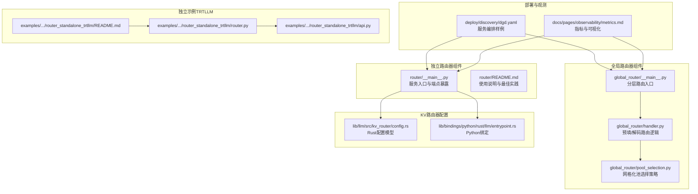
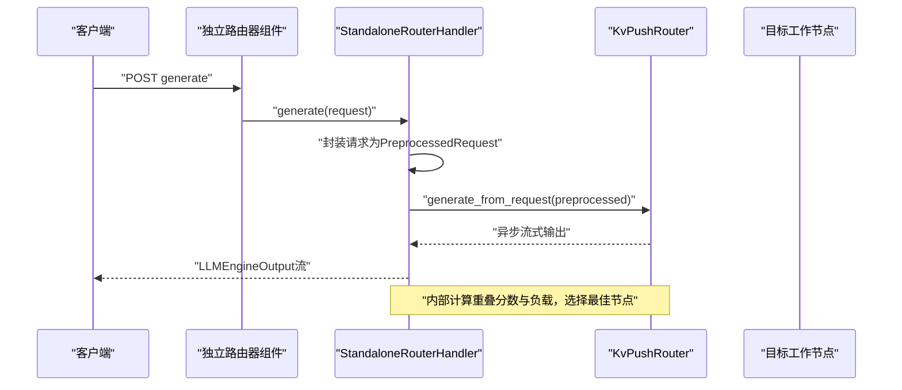
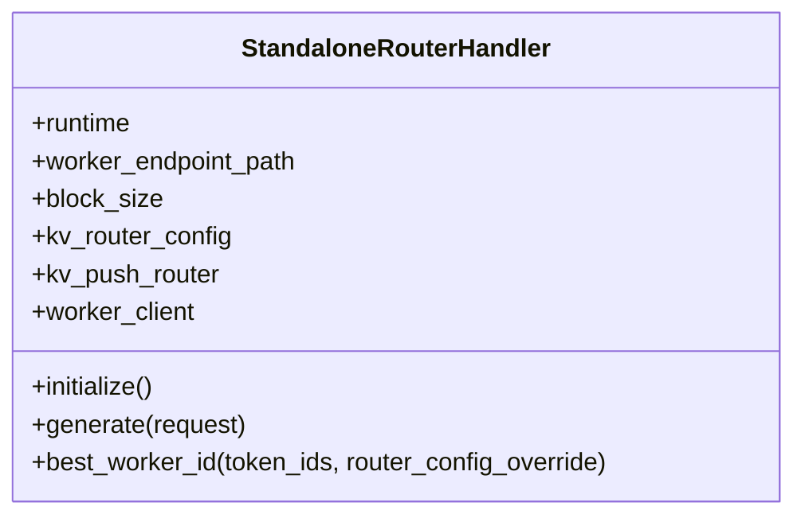
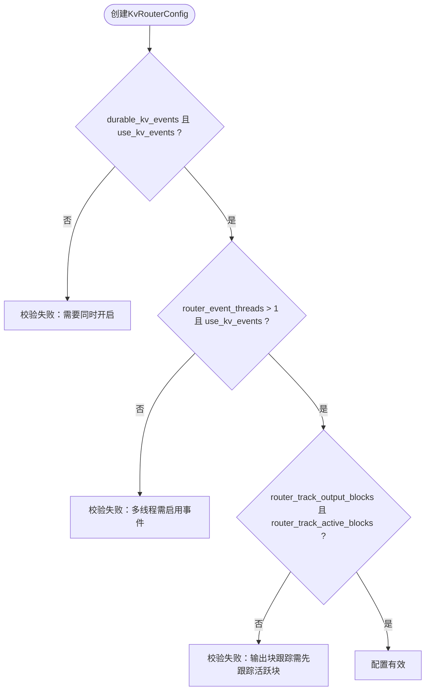
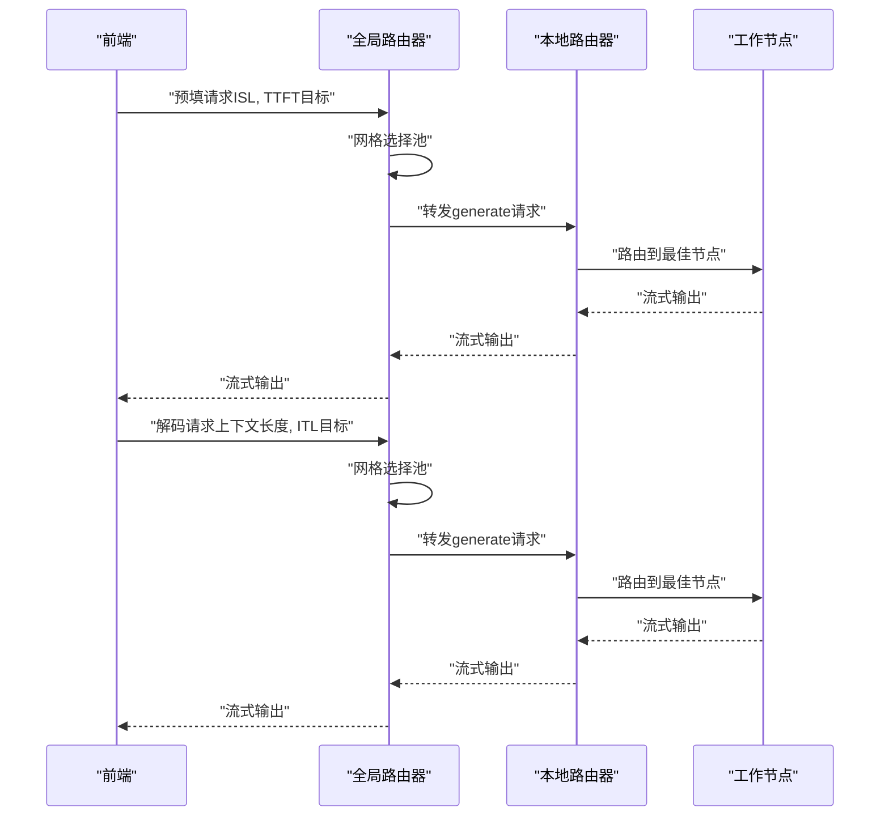
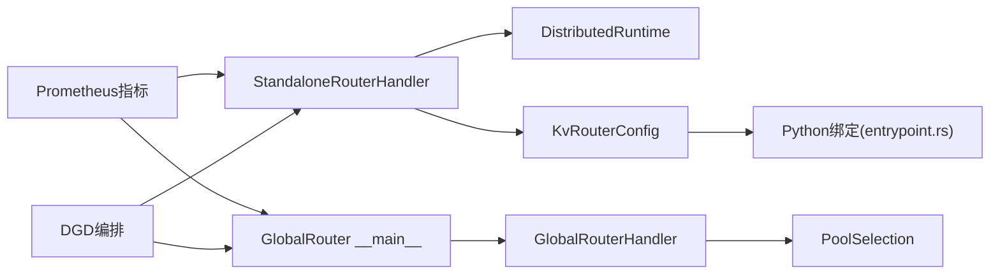

# 独立路由器服务

<cite>
**本文档引用的文件**
- [components/src/dynamo/router/__main__.py](file://components/src/dynamo/router/__main__.py)
- [components/src/dynamo/router/README.md](file://components/src/dynamo/router/README.md)
- [components/src/dynamo/global_router/__main__.py](file://components/src/dynamo/global_router/__main__.py)
- [components/src/dynamo/global_router/handler.py](file://components/src/dynamo/global_router/handler.py)
- [components/src/dynamo/global_router/pool_selection.py](file://components/src/dynamo/global_router/pool_selection.py)
- [lib/llm/src/kv_router/config.rs](file://lib/llm/src/kv_router/config.rs)
- [lib/bindings/python/rust/llm/entrypoint.rs](file://lib/bindings/python/rust/llm/entrypoint.rs)
- [docs/pages/observability/metrics.md](file://docs/pages/observability/metrics.md)
- [deploy/discovery/dgd.yaml](file://deploy/discovery/dgd.yaml)
- [examples/deployments/router_standalone_trtllm/README.md](file://examples/deployments/router_standalone_trtllm/README.md)
- [examples/deployments/router_standalone_trtllm/router.py](file://examples/deployments/router_standalone_trtllm/router.py)
- [examples/deployments/router_standalone_trtllm/api.py](file://examples/deployments/router_standalone_trtllm/api.py)
</cite>

## 目录
1. [简介](#简介)
2. [项目结构](#项目结构)
3. [核心组件](#核心组件)
4. [架构总览](#架构总览)
5. [详细组件分析](#详细组件分析)
6. [依赖关系分析](#依赖关系分析)
7. [性能考量](#性能考量)
8. [故障排查指南](#故障排查指南)
9. [结论](#结论)
10. [附录](#附录)

## 简介
本文件面向Dynamo独立路由器服务（Standalone KV-aware Router）的部署与使用，目标读者包括平台工程师、后端开发者与运维人员。该服务在Dynamo分布式推理系统中承担“分割式服务路由”和“通用KV感知路由”的职责：既可作为独立组件服务于任意后端（如vLLM、TensorRT-LLM、SGLang等），也可与全局路由器配合实现多池（prefill/decode）的分层路由。

独立路由器的核心能力：
- 基于KV缓存重叠度与负载信息选择最优工作节点
- 支持事件驱动更新或基于TTL的预测式状态维护
- 提供两个端点：generate（流式生成）、best_worker_id（仅返回最佳节点）
- 通过Dynamo分布式运行时框架进行服务注册与端点暴露

## 项目结构
围绕独立路由器服务的关键目录与文件如下：
- 组件入口与实现：components/src/dynamo/router
- 全局路由器（用于多池分层路由）：components/src/dynamo/global_router
- KV路由器配置定义：lib/llm/src/kv_router/config.rs 及其Python绑定
- 部署与发现样例：deploy/discovery/dgd.yaml
- 观测性与指标：docs/pages/observability/metrics.md
- 独立示例（TRTLLM）：examples/deployments/router_standalone_trtllm

图表来源
- [components/src/dynamo/router/__main__.py](file://components/src/dynamo/router/__main__.py#L1-L359)
- [components/src/dynamo/global_router/__main__.py](file://components/src/dynamo/global_router/__main__.py#L1-L180)
- [components/src/dynamo/global_router/handler.py](file://components/src/dynamo/global_router/handler.py#L1-L232)
- [components/src/dynamo/global_router/pool_selection.py](file://components/src/dynamo/global_router/pool_selection.py#L1-L318)
- [lib/llm/src/kv_router/config.rs](file://lib/llm/src/kv_router/config.rs#L1-L140)
- [lib/bindings/python/rust/llm/entrypoint.rs](file://lib/bindings/python/rust/llm/entrypoint.rs#L52-L92)
- [deploy/discovery/dgd.yaml](file://deploy/discovery/dgd.yaml#L1-L59)
- [docs/pages/observability/metrics.md](file://docs/pages/observability/metrics.md#L1-L224)
- [examples/deployments/router_standalone_trtllm/README.md](file://examples/deployments/router_standalone_trtllm/README.md#L1-L249)
- [examples/deployments/router_standalone_trtllm/router.py](file://examples/deployments/router_standalone_trtllm/router.py#L1-L389)
- [examples/deployments/router_standalone_trtllm/api.py](file://examples/deployments/router_standalone_trtllm/api.py#L1-L766)

章节来源
- [components/src/dynamo/router/__main__.py](file://components/src/dynamo/router/__main__.py#L1-L359)
- [components/src/dynamo/router/README.md](file://components/src/dynamo/router/README.md#L1-L110)
- [components/src/dynamo/global_router/__main__.py](file://components/src/dynamo/global_router/__main__.py#L1-L180)
- [components/src/dynamo/global_router/handler.py](file://components/src/dynamo/global_router/handler.py#L1-L232)
- [components/src/dynamo/global_router/pool_selection.py](file://components/src/dynamo/global_router/pool_selection.py#L1-L318)
- [lib/llm/src/kv_router/config.rs](file://lib/llm/src/kv_router/config.rs#L1-L140)
- [lib/bindings/python/rust/llm/entrypoint.rs](file://lib/bindings/python/rust/llm/entrypoint.rs#L52-L92)
- [deploy/discovery/dgd.yaml](file://deploy/discovery/dgd.yaml#L1-L59)
- [docs/pages/observability/metrics.md](file://docs/pages/observability/metrics.md#L1-L224)
- [examples/deployments/router_standalone_trtllm/README.md](file://examples/deployments/router_standalone_trtllm/README.md#L1-L249)
- [examples/deployments/router_standalone_trtllm/router.py](file://examples/deployments/router_standalone_trtllm/router.py#L1-L389)
- [examples/deployments/router_standalone_trtllm/api.py](file://examples/deployments/router_standalone_trtllm/api.py#L1-L766)

## 核心组件
- 独立路由器服务（StandaloneRouterHandler）
  - 负责解析目标工作节点端点路径，建立客户端连接，并通过KvPushRouter完成KV感知路由
  - 暴露两个端点：generate（流式生成）、best_worker_id（仅返回最佳节点ID）
- KV路由器配置（KvRouterConfig）
  - 控制重叠分数权重、温度采样、是否启用KV事件、副本同步、快照阈值、状态重置、活跃块跟踪、输出块跟踪、TTL、树大小与修剪比例、事件线程数等
- 全局路由器（GlobalRouterHandler）
  - 在多池场景下，根据ISL/TTFT或上下文长度/ITL进行网格化池选择，并转发到本地路由器
- Python绑定（entrypoint.rs）
  - 将Rust配置映射到Python侧，支持默认参数与校验

章节来源
- [components/src/dynamo/router/__main__.py](file://components/src/dynamo/router/__main__.py#L31-L154)
- [lib/llm/src/kv_router/config.rs](file://lib/llm/src/kv_router/config.rs#L22-L119)
- [lib/bindings/python/rust/llm/entrypoint.rs](file://lib/bindings/python/rust/llm/entrypoint.rs#L52-L92)
- [components/src/dynamo/global_router/handler.py](file://components/src/dynamo/global_router/handler.py#L23-L121)

## 架构总览
独立路由器服务通过Dynamo分布式运行时在指定命名空间内注册组件与端点；当请求到达generate端点时，内部将请求封装为预处理格式，交由KvPushRouter计算最佳工作节点并流式返回结果；best_worker_id端点则仅返回最佳节点ID而不实际路由。

图表来源
- [components/src/dynamo/router/__main__.py](file://components/src/dynamo/router/__main__.py#L80-L136)

章节来源
- [components/src/dynamo/router/__main__.py](file://components/src/dynamo/router/__main__.py#L316-L349)

## 详细组件分析

### 独立路由器服务（StandaloneRouterHandler）
- 初始化流程
  - 解析命令行参数，构建KvRouterConfig
  - 解析目标端点路径（namespace.component.endpoint），获取Client
  - 创建KvPushRouter实例并完成初始化
- 端点实现
  - generate：将请求封装为PreprocessedRequest，调用KvPushRouter生成，逐条包装为LLMEngineOutput并流式返回
  - best_worker_id：基于token_ids与可选覆盖配置，返回最佳工作节点ID（不实际路由）

图表来源
- [components/src/dynamo/router/__main__.py](file://components/src/dynamo/router/__main__.py#L31-L154)

章节来源
- [components/src/dynamo/router/__main__.py](file://components/src/dynamo/router/__main__.py#L48-L154)

### KV路由器配置（KvRouterConfig）
- 关键参数
  - overlap_score_weight：重叠分数权重，越大越偏向KV复用
  - router_temperature：softmax采样温度，越高越随机，0为确定性
  - use_kv_events：是否启用KV事件驱动更新
  - router_replica_sync：多副本一致性同步
  - router_snapshot_threshold：流消息数量达到阈值触发快照
  - router_reset_states：启动时重置状态
  - router_track_active_blocks：跟踪活跃块（解码阶段负载均衡）
  - router_track_output_blocks：生成过程中跟踪输出块
  - router_ttl_secs：禁用事件时块TTL
  - router_max_tree_size/router_prune_target_ratio：索引树大小与修剪比例
  - router_event_threads：事件处理线程数
- 参数校验
  - durable_kv_events需依赖use_kv_events
  - 多线程事件处理需启用事件
  - 输出块跟踪需先启用活跃块跟踪

图表来源
- [lib/llm/src/kv_router/config.rs](file://lib/llm/src/kv_router/config.rs#L102-L119)

章节来源
- [lib/llm/src/kv_router/config.rs](file://lib/llm/src/kv_router/config.rs#L22-L119)
- [lib/bindings/python/rust/llm/entrypoint.rs](file://lib/bindings/python/rust/llm/entrypoint.rs#L52-L92)

### 全局路由器（GlobalRouterHandler）
- 功能概述
  - 连接多个本地路由器（按命名空间划分的池）
  - 预填阶段：基于ISL与TTFT目标选择池
  - 解码阶段：基于上下文长度与ITL目标选择池
  - 将请求转发至对应池内的本地路由器并流式回传
- 池选择策略
  - 预填网格：ISL×TTFT目标映射到池索引
  - 解码网格：上下文长度×ITL目标映射到池索引

图表来源
- [components/src/dynamo/global_router/handler.py](file://components/src/dynamo/global_router/handler.py#L122-L214)
- [components/src/dynamo/global_router/pool_selection.py](file://components/src/dynamo/global_router/pool_selection.py#L22-L138)

章节来源
- [components/src/dynamo/global_router/__main__.py](file://components/src/dynamo/global_router/__main__.py#L91-L171)
- [components/src/dynamo/global_router/handler.py](file://components/src/dynamo/global_router/handler.py#L70-L231)
- [components/src/dynamo/global_router/pool_selection.py](file://components/src/dynamo/global_router/pool_selection.py#L22-L318)

### 独立示例（TRTLLM）
- 该示例展示了独立KV路由器如何与TensorRT-LLM工作节点协作，通过ZMQ订阅KV事件与负载指标，实现KV感知路由与多模态内容哈希路由
- 关键点
  - API层负责解析OpenAI格式请求、多模态输入处理与块哈希计算
  - 路由器层使用RadixTree匹配块并结合负载进行选择
  - 工作节点发布KV事件与指标，路由器后台任务持续更新状态

章节来源
- [examples/deployments/router_standalone_trtllm/README.md](file://examples/deployments/router_standalone_trtllm/README.md#L1-L249)
- [examples/deployments/router_standalone_trtllm/router.py](file://examples/deployments/router_standalone_trtllm/router.py#L87-L256)
- [examples/deployments/router_standalone_trtllm/api.py](file://examples/deployments/router_standalone_trtllm/api.py#L141-L626)

## 依赖关系分析
- 组件耦合
  - StandaloneRouterHandler依赖Dynamo分布式运行时以解析端点路径、获取Client并注册端点
  - KV路由器配置通过Python绑定映射到Rust实现，确保跨语言一致性与参数校验
  - 全局路由器依赖池选择策略模块加载JSON配置并执行网格化选择
- 外部依赖
  - 观测性：Prometheus/Grafana指标端点与标签体系
  - 部署：Kubernetes服务编排样例（DGD）

图表来源
- [components/src/dynamo/router/__main__.py](file://components/src/dynamo/router/__main__.py#L316-L349)
- [lib/bindings/python/rust/llm/entrypoint.rs](file://lib/bindings/python/rust/llm/entrypoint.rs#L52-L92)
- [components/src/dynamo/global_router/__main__.py](file://components/src/dynamo/global_router/__main__.py#L91-L171)
- [components/src/dynamo/global_router/handler.py](file://components/src/dynamo/global_router/handler.py#L70-L121)
- [docs/pages/observability/metrics.md](file://docs/pages/observability/metrics.md#L61-L124)
- [deploy/discovery/dgd.yaml](file://deploy/discovery/dgd.yaml#L15-L59)

章节来源
- [components/src/dynamo/router/__main__.py](file://components/src/dynamo/router/__main__.py#L316-L349)
- [components/src/dynamo/global_router/__main__.py](file://components/src/dynamo/global_router/__main__.py#L91-L171)
- [docs/pages/observability/metrics.md](file://docs/pages/observability/metrics.md#L61-L124)
- [deploy/discovery/dgd.yaml](file://deploy/discovery/dgd.yaml#L15-L59)

## 性能考量
- KV事件与TTL策略
  - 启用KV事件可获得更精确的状态，减少预测误差；禁用事件时需合理设置TTL与树大小，避免过期与修剪开销
- 温度与重叠权重
  - 提高overlap_score_weight可提升KV复用收益，但可能牺牲负载均衡；提高router_temperature会增加随机性，适合流量波动较大的场景
- 线程与快照
  - 增加router_event_threads可提升事件处理吞吐，但需确保use_kv_events开启；合理设置snapshot阈值可降低状态同步成本
- 活跃块与输出块跟踪
  - 解码阶段建议启用活跃块跟踪以改善负载均衡；输出块跟踪可提升生成过程中的占位与衰减效果，但需与活跃块跟踪配合

## 故障排查指南
- 端点不可用
  - 检查服务是否已正确注册命名空间与组件（router），确认端点路径与目标工作节点一致
- 请求无响应或延迟过高
  - 查看活跃块跟踪与负载指标；适当调整overlap_score_weight与router_temperature
  - 若禁用事件，检查TTL与树修剪参数是否导致频繁过期
- 最佳节点选择异常
  - 使用best_worker_id端点验证路由决策；核对token_ids与块大小是否匹配
- 指标与可观测性
  - 通过Prometheus端点收集dynamo_component_*与dynamo_frontend_*指标，定位瓶颈与异常
- 日志与调试
  - 设置日志级别并关注初始化与端点服务阶段的错误信息

章节来源
- [components/src/dynamo/router/README.md](file://components/src/dynamo/router/README.md#L14-L110)
- [docs/pages/observability/metrics.md](file://docs/pages/observability/metrics.md#L61-L156)

## 结论
独立路由器服务提供了灵活、可配置的KV感知路由能力，适用于分割式服务与多后端场景。通过与全局路由器配合，可在多池架构中实现基于SLA的智能路由；通过完善的配置项与可观测性指标，能够满足生产环境的性能优化与故障排查需求。

## 附录

### 启动与部署示例
- 命令行启动（独立路由器）
  - 指定目标工作节点端点路径与块大小，可选择重置状态、禁用活跃块跟踪等
- 编排样例（Kubernetes）
  - 使用DGD定义Frontend、预填/解码工作节点的服务规格与镜像，便于一键部署

章节来源
- [components/src/dynamo/router/README.md](file://components/src/dynamo/router/README.md#L14-L110)
- [deploy/discovery/dgd.yaml](file://deploy/discovery/dgd.yaml#L15-L59)

### 端点使用说明
- generate
  - 请求格式：包含模型名、token_ids、停止条件、采样选项、输出选项、EOS标记、注解、路由提示、覆盖配置、预填结果、引导信息与额外参数
  - 响应结构：逐条返回包含token_ids、tokens、text、累计/条件概率、finish_reason、stop_reason、索引、拆分参数、额外参数与用量统计的字典
  - 错误处理：未初始化或内部异常时返回错误
- best_worker_id
  - 输入：token_ids与可选覆盖配置
  - 输出：最佳工作节点ID
  - 错误处理：未初始化时返回错误

章节来源
- [components/src/dynamo/router/__main__.py](file://components/src/dynamo/router/__main__.py#L80-L154)