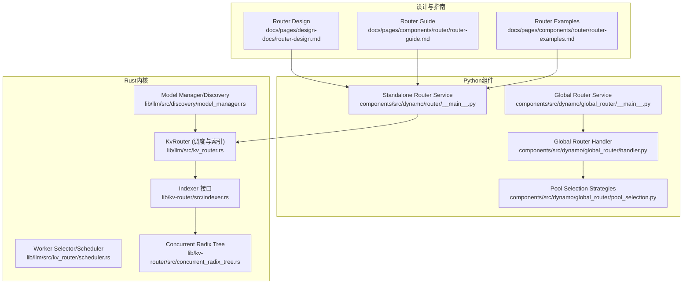
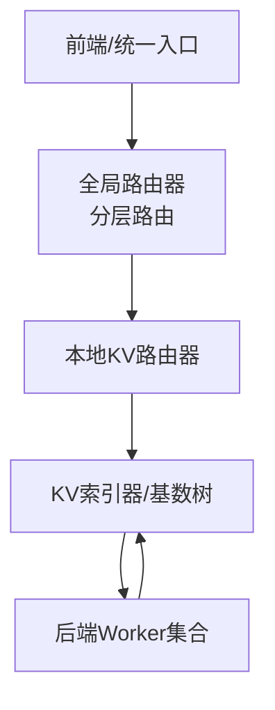
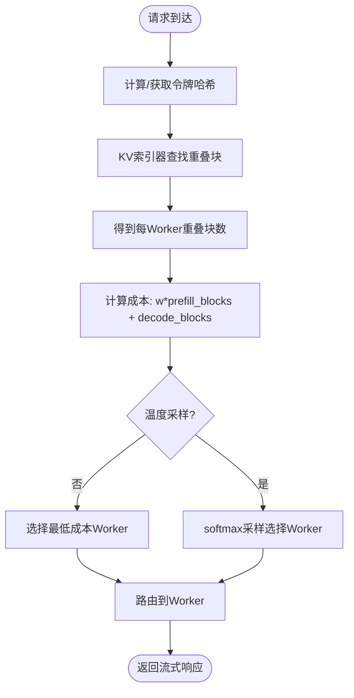
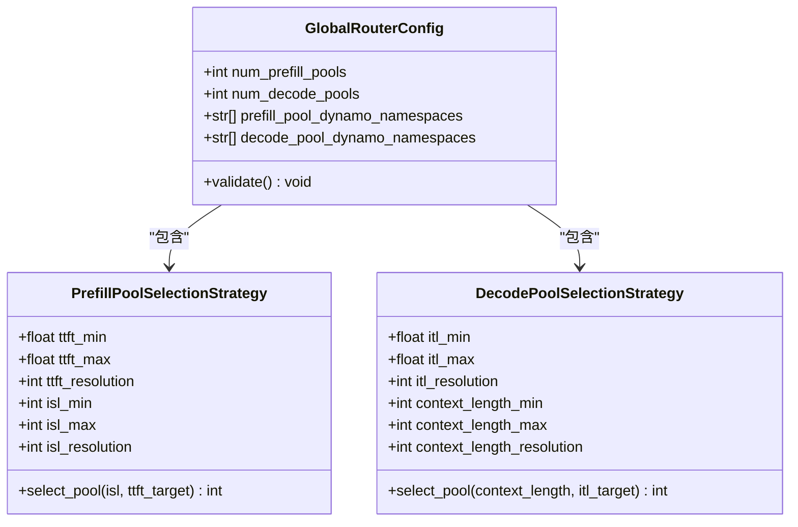
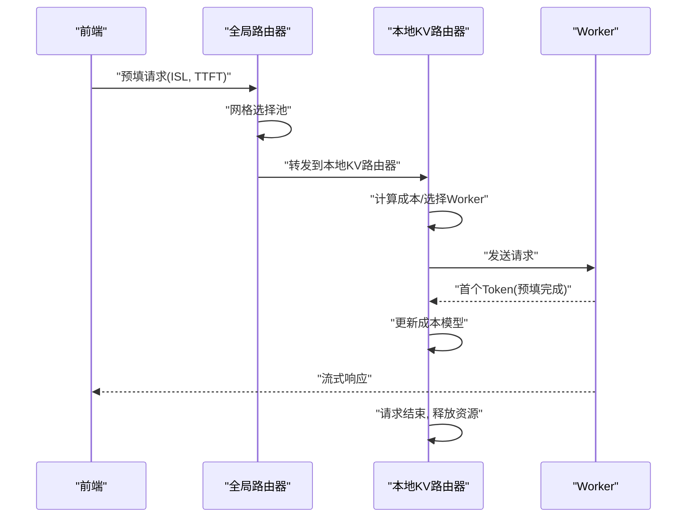
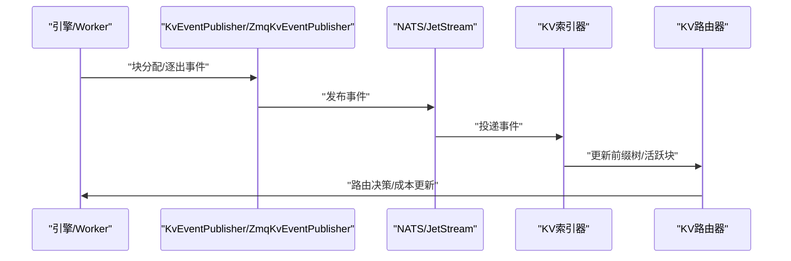
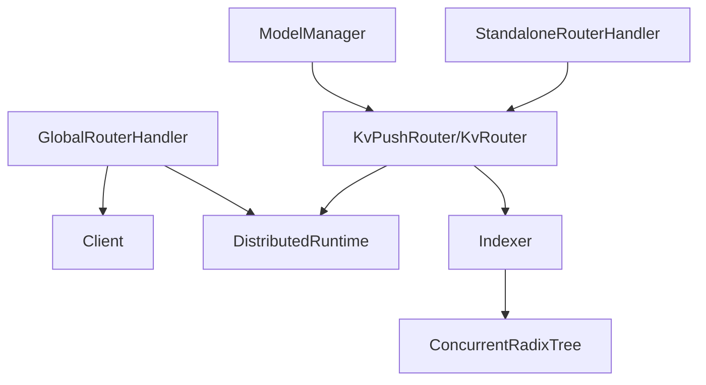

# 路由器组件

<cite>
**本文引用的文件**
- [components/src/dynamo/router/__main__.py](file://components/src/dynamo/router/__main__.py)
- [components/src/dynamo/global_router/__main__.py](file://components/src/dynamo/global_router/__main__.py)
- [components/src/dynamo/global_router/handler.py](file://components/src/dynamo/global_router/handler.py)
- [components/src/dynamo/global_router/pool_selection.py](file://components/src/dynamo/global_router/pool_selection.py)
- [docs/pages/design-docs/router-design.md](file://docs/pages/design-docs/router-design.md)
- [docs/pages/components/router/router-guide.md](file://docs/pages/components/router/router-guide.md)
- [docs/pages/components/router/router-examples.md](file://docs/pages/components/router/router-examples.md)
- [lib/llm/src/discovery/model_manager.rs](file://lib/llm/src/discovery/model_manager.rs)
- [lib/llm/src/kv_router.rs](file://lib/llm/src/kv_router.rs)
- [lib/llm/src/kv_router/scheduler.rs](file://lib/llm/src/kv_router/scheduler.rs)
- [lib/kv-router/src/indexer.rs](file://lib/kv-router/src/indexer.rs)
- [lib/kv-router/src/concurrent_radix_tree.rs](file://lib/kv-router/src/concurrent_radix_tree.rs)
- [lib/kv-router/Cargo.toml](file://lib/kv-router/Cargo.toml)
</cite>

## 目录
1. [简介](#简介)
2. [项目结构](#项目结构)
3. [核心组件](#核心组件)
4. [架构总览](#架构总览)
5. [详细组件分析](#详细组件分析)
6. [依赖关系分析](#依赖关系分析)
7. [性能考量](#性能考量)
8. [故障排查指南](#故障排查指南)
9. [结论](#结论)
10. [附录](#附录)

## 简介
本文件系统性地文档化Dynamo路由器组件，重点覆盖KV缓存感知路由算法的实现原理与工程实践，包括：
- 缓存命中率与重叠块计算、预填与解码阶段成本建模
- 负载均衡策略（确定性与温度采样）、工作池选择逻辑
- 路由决策机制、性能评估指标与动态调整策略
- 与KV缓存管理器的交互方式、事件传播机制与状态同步
- 配置参数说明、使用示例与性能调优建议
- 与前端、后端引擎及分布式运行时的集成模式与通信协议

## 项目结构
Dynamo路由器相关代码主要分布在以下位置：
- Python本地路由器服务：components/src/dynamo/router
- 全局路由器（分层路由）：components/src/dynamo/global_router
- 设计与使用指南：docs/pages/design-docs/router-design.md、docs/pages/components/router/router-guide.md、docs/pages/components/router/router-examples.md
- Rust实现的KV路由器内核：lib/llm/src/kv_router.rs、lib/llm/src/kv_router/scheduler.rs
- KV索引器与并发基数树：lib/kv-router/src/indexer.rs、lib/kv-router/src/concurrent_radix_tree.rs
- 运行时发现与注册：lib/llm/src/discovery/model_manager.rs
- KV路由器库清单：lib/kv-router/Cargo.toml

图表来源
- [components/src/dynamo/router/__main__.py](file://components/src/dynamo/router/__main__.py#L1-L359)
- [components/src/dynamo/global_router/__main__.py](file://components/src/dynamo/global_router/__main__.py#L1-L180)
- [components/src/dynamo/global_router/handler.py](file://components/src/dynamo/global_router/handler.py#L1-L232)
- [components/src/dynamo/global_router/pool_selection.py](file://components/src/dynamo/global_router/pool_selection.py#L1-L318)
- [docs/pages/design-docs/router-design.md](file://docs/pages/design-docs/router-design.md#L1-L321)
- [docs/pages/components/router/router-guide.md](file://docs/pages/components/router/router-guide.md#L1-L433)
- [docs/pages/components/router/router-examples.md](file://docs/pages/components/router/router-examples.md#L1-L559)
- [lib/llm/src/kv_router.rs](file://lib/llm/src/kv_router.rs#L267-L300)
- [lib/llm/src/kv_router/scheduler.rs](file://lib/llm/src/kv_router/scheduler.rs#L433-L482)
- [lib/kv-router/src/indexer.rs](file://lib/kv-router/src/indexer.rs#L325-L359)
- [lib/kv-router/src/concurrent_radix_tree.rs](file://lib/kv-router/src/concurrent_radix_tree.rs#L297-L337)
- [lib/llm/src/discovery/model_manager.rs](file://lib/llm/src/discovery/model_manager.rs#L357-L384)

章节来源
- [components/src/dynamo/router/__main__.py](file://components/src/dynamo/router/__main__.py#L1-L359)
- [components/src/dynamo/global_router/__main__.py](file://components/src/dynamo/global_router/__main__.py#L1-L180)
- [components/src/dynamo/global_router/handler.py](file://components/src/dynamo/global_router/handler.py#L1-L232)
- [components/src/dynamo/global_router/pool_selection.py](file://components/src/dynamo/global_router/pool_selection.py#L1-L318)
- [docs/pages/design-docs/router-design.md](file://docs/pages/design-docs/router-design.md#L1-L321)
- [docs/pages/components/router/router-guide.md](file://docs/pages/components/router/router-guide.md#L1-L433)
- [docs/pages/components/router/router-examples.md](file://docs/pages/components/router/router-examples.md#L1-L559)
- [lib/llm/src/kv_router.rs](file://lib/llm/src/kv_router.rs#L267-L300)
- [lib/llm/src/kv_router/scheduler.rs](file://lib/llm/src/kv_router/scheduler.rs#L433-L482)
- [lib/kv-router/src/indexer.rs](file://lib/kv-router/src/indexer.rs#L325-L359)
- [lib/kv-router/src/concurrent_radix_tree.rs](file://lib/kv-router/src/concurrent_radix_tree.rs#L297-L337)
- [lib/llm/src/discovery/model_manager.rs](file://lib/llm/src/discovery/model_manager.rs#L357-L384)

## 核心组件
- Standalone KV路由器服务：提供独立KV感知路由能力，支持通过命令行参数配置权重、温度、事件模式等，并暴露“generate”和“best_worker_id”端点。
- 全局路由器（分层路由）：在多工作池场景下，基于网格策略选择预填/解码头池，再转发到各池内的本地路由器。
- KV路由器内核（Rust）：封装索引器（Indexer）与调度器（Scheduler），负责根据重叠块与活跃块计算成本并选择最优Worker。
- KV索引器与并发基数树：维护全局KV缓存前缀树，支持事件订阅、TTL过期与修剪、多线程并发处理。
- 发现与注册：通过分布式运行时发现Worker端点，按需创建或复用KV路由器实例。

章节来源
- [components/src/dynamo/router/__main__.py](file://components/src/dynamo/router/__main__.py#L1-L359)
- [components/src/dynamo/global_router/__main__.py](file://components/src/dynamo/global_router/__main__.py#L1-L180)
- [components/src/dynamo/global_router/handler.py](file://components/src/dynamo/global_router/handler.py#L1-L232)
- [components/src/dynamo/global_router/pool_selection.py](file://components/src/dynamo/global_router/pool_selection.py#L1-L318)
- [lib/llm/src/kv_router.rs](file://lib/llm/src/kv_router.rs#L267-L300)
- [lib/llm/src/kv_router/scheduler.rs](file://lib/llm/src/kv_router/scheduler.rs#L433-L482)
- [lib/kv-router/src/indexer.rs](file://lib/kv-router/src/indexer.rs#L325-L359)
- [lib/kv-router/src/concurrent_radix_tree.rs](file://lib/kv-router/src/concurrent_radix_tree.rs#L297-L337)
- [lib/llm/src/discovery/model_manager.rs](file://lib/llm/src/discovery/model_manager.rs#L357-L384)

## 架构总览
Dynamo路由器采用“前端/全局路由器 → 本地KV路由器 → 后端Worker”的分层架构。KV路由器通过KV事件或近似模式维护全局前缀树，结合活跃块预测与成本函数进行路由决策；全局路由器则以网格策略在不同命名空间的工作池间做二次路由。

图表来源
- [docs/pages/design-docs/router-design.md](file://docs/pages/design-docs/router-design.md#L1-L321)
- [components/src/dynamo/global_router/handler.py](file://components/src/dynamo/global_router/handler.py#L1-L232)
- [components/src/dynamo/router/__main__.py](file://components/src/dynamo/router/__main__.py#L1-L359)

## 详细组件分析

### KV缓存感知路由算法
- 成本函数与权重
  - 预填成本：潜在新预填块数（输入令牌数减去重叠块×块大小）除以块大小。
  - 解码成本：活跃解码块数（当前生成中使用的块）。
  - 总成本 = overlap_score_weight × 预填块 + 解码块。权重越高越倾向缓存复用（改善TTFT），越低越倾向负载均衡（改善ITL）。
- 工作池选择
  - 默认选择最低成本Worker；当router_temperature > 0时，对成本进行softmax采样引入随机性，有助于避免热点。
- 重叠块与前缀匹配
  - 基于KV索引器的前缀树匹配每个Worker的缓存重叠块数，用于预填成本估算与成本计算。
- 活跃块与输出块跟踪
  - 可选跟踪活跃解码块与输出块增长（随生成进度衰减），提升长请求的负载估计精度。

图表来源
- [docs/pages/design-docs/router-design.md](file://docs/pages/design-docs/router-design.md#L56-L75)
- [lib/llm/src/kv_router/scheduler.rs](file://lib/llm/src/kv_router/scheduler.rs#L433-L482)
- [lib/kv-router/src/indexer.rs](file://lib/kv-router/src/indexer.rs#L325-L359)

章节来源
- [docs/pages/design-docs/router-design.md](file://docs/pages/design-docs/router-design.md#L56-L75)
- [lib/llm/src/kv_router/scheduler.rs](file://lib/llm/src/kv_router/scheduler.rs#L433-L482)
- [lib/kv-router/src/indexer.rs](file://lib/kv-router/src/indexer.rs#L325-L359)

### 负载均衡策略与工作池选择
- 确定性策略
  - overlap_score_weight设为正数时，优先选择重叠块多的Worker，减少预填计算。
  - 当overlap_score_weight=0时，退化为仅考虑解码负载的纯负载均衡。
- 温度采样策略
  - router_temperature>0时，对成本进行softmax归一化后采样，提高负载分布均匀性，降低热点风险。
- 工作池选择（全局路由器）
  - 基于网格策略：预填池依据输入序列长度(ISL)与目标TTFT；解码头池依据上下文长度与目标ITL，映射到不同命名空间的工作池。

图表来源
- [components/src/dynamo/global_router/pool_selection.py](file://components/src/dynamo/global_router/pool_selection.py#L22-L139)
- [components/src/dynamo/global_router/pool_selection.py](file://components/src/dynamo/global_router/pool_selection.py#L142-L253)

章节来源
- [components/src/dynamo/global_router/pool_selection.py](file://components/src/dynamo/global_router/pool_selection.py#L1-L318)
- [components/src/dynamo/global_router/handler.py](file://components/src/dynamo/global_router/handler.py#L122-L214)

### 路由决策机制与性能评估
- 决策流程
  - 输入令牌经哈希与重叠匹配，计算每Worker的成本，选择最佳Worker并建立连接。
  - 首个输出令牌到达时标记预填完成，更新成本模型（移除预填成本影响）。
  - 请求结束释放资源，更新活跃块计数。
- 关键指标
  - TTFT（首Token时间）、ITL（单Token间隔）、吞吐（tokens/sec）、命中率（重叠块/总预填块）。
  - 日志中会打印每Worker的成本分解，便于定位瓶颈。
- 动态调整
  - 通过环境变量/CLI参数实时调整overlap_score_weight与router_temperature。
  - 支持动态阈值（活跃解码块/预填令牌）以抑制过载Worker。

图表来源
- [components/src/dynamo/global_router/handler.py](file://components/src/dynamo/global_router/handler.py#L122-L214)
- [docs/pages/components/router/router-guide.md](file://docs/pages/components/router/router-guide.md#L202-L223)

章节来源
- [docs/pages/components/router/router-guide.md](file://docs/pages/components/router/router-guide.md#L232-L243)
- [docs/pages/components/router/router-guide.md](file://docs/pages/components/router/router-guide.md#L244-L259)

### 与KV缓存管理器的交互与事件传播
- 事件类型
  - BlockStored：新增缓存块
  - BlockRemoved：缓存块被逐出
  - AllBlocksCleared：缓存清空
- 事件传输模式
  - NATS Core/事件平面（默认）：Worker维护本地索引器并通过通用事件平面发布；路由器启动时查询重建状态。
  - JetStream（持久化）：KV事件写入JetStream，路由器作为持久消费者，状态保存在对象存储快照中。
- 一致性与同步
  - 多路由器副本通过AddRequest/MarkPrefillCompleted/Free事件保持活跃块视图一致。
  - 并发基数树支持多线程事件处理，但不支持TTL/修剪（与单线程模式互补）。

图表来源
- [docs/pages/components/router/router-examples.md](file://docs/pages/components/router/router-examples.md#L276-L559)
- [docs/pages/design-docs/router-design.md](file://docs/pages/design-docs/router-design.md#L111-L199)
- [lib/kv-router/src/concurrent_radix_tree.rs](file://lib/kv-router/src/concurrent_radix_tree.rs#L297-L337)

章节来源
- [docs/pages/design-docs/router-design.md](file://docs/pages/design-docs/router-design.md#L111-L199)
- [docs/pages/components/router/router-examples.md](file://docs/pages/components/router/router-examples.md#L276-L559)
- [lib/kv-router/src/concurrent_radix_tree.rs](file://lib/kv-router/src/concurrent_radix_tree.rs#L297-L337)

### 配置参数与使用示例
- Standalone KV路由器（CLI）
  - 关键参数：--endpoint、--block-size、--kv-overlap-score-weight、--router-temperature、--no-kv-events、--router-replica-sync、--router-event-threads等。
  - 端点：generate（路由生成）、best_worker_id（查询最佳Worker）。
- 全局路由器（CLI）
  - 关键参数：--config（JSON配置文件）、--model-name、--namespace、--default-ttft-target、--default-itl-target。
  - 行为：同时注册为预填与解码头池的Worker，内部按网格策略选择池。
- Python API（KvPushRouter）
  - 支持generate、best_worker、get_potential_loads、mark_prefill_complete、free等方法。
  - 支持per-request的router_config_override覆盖。

章节来源
- [components/src/dynamo/router/__main__.py](file://components/src/dynamo/router/__main__.py#L156-L359)
- [components/src/dynamo/global_router/__main__.py](file://components/src/dynamo/global_router/__main__.py#L39-L180)
- [docs/pages/components/router/router-examples.md](file://docs/pages/components/router/router-examples.md#L19-L104)

### 性能调优建议
- 预填/解码权衡
  - 预填密集型：提高overlap_score_weight，降低ITL波动。
  - 解码密集型：降低overlap_score_weight，提高负载均衡。
- 随机性与热点控制
  - 适度增加router_temperature，缓解Worker饱和。
- 事件模式选择
  - 低延迟部署：NATS Core/事件平面（默认）。
  - 生产一致性：JetStream（需前后端均启用）。
- 并发与内存
  - 多线程事件处理（--router-event-threads > 1）提升吞吐，但禁用TTL/修剪。
  - 控制最大树大小与修剪比例，避免内存膨胀。

章节来源
- [docs/pages/components/router/router-guide.md](file://docs/pages/components/router/router-guide.md#L224-L259)
- [docs/pages/components/router/router-guide.md](file://docs/pages/components/router/router-guide.md#L340-L392)
- [docs/pages/design-docs/router-design.md](file://docs/pages/design-docs/router-design.md#L133-L178)

## 依赖关系分析
- 组件耦合
  - 全局路由器依赖池选择策略与分布式运行时客户端，负责跨命名空间路由。
  - Standalone KV路由器依赖KV路由器内核与索引器，面向任意Worker端点提供KV感知路由。
- 外部依赖
  - NATS/JetStream事件平面、ZMQ事件转发、对象存储快照（JetStream模式）。
  - 分布式运行时（Dynamo Runtime）提供端点发现、组件注册与生命周期管理。
- 潜在循环依赖
  - 通过接口与异步客户端解耦，避免直接循环引用。

图表来源
- [components/src/dynamo/global_router/handler.py](file://components/src/dynamo/global_router/handler.py#L1-L232)
- [components/src/dynamo/router/__main__.py](file://components/src/dynamo/router/__main__.py#L1-L359)
- [lib/llm/src/kv_router.rs](file://lib/llm/src/kv_router.rs#L267-L300)
- [lib/llm/src/discovery/model_manager.rs](file://lib/llm/src/discovery/model_manager.rs#L357-L384)

章节来源
- [components/src/dynamo/global_router/handler.py](file://components/src/dynamo/global_router/handler.py#L1-L232)
- [components/src/dynamo/router/__main__.py](file://components/src/dynamo/router/__main__.py#L1-L359)
- [lib/llm/src/kv_router.rs](file://lib/llm/src/kv_router.rs#L267-L300)
- [lib/llm/src/discovery/model_manager.rs](file://lib/llm/src/discovery/model_manager.rs#L357-L384)

## 性能考量
- 计算复杂度
  - 重叠匹配：前缀树查找与插入，平均O(L)，L为令牌序列长度。
  - 成本计算：O(W)，W为Worker数量。
- 存储与内存
  - 单线程基数树支持TTL与修剪，适合低延迟部署。
  - 多线程基数树无TTL/修剪，吞吐更高，适合高并发场景。
- 事件开销
  - JetStream模式具备持久化与快照，重启恢复更快，但有额外延迟。
  - NATS Core模式无需JetStream，部署简单，依赖Worker可用性恢复状态。

## 故障排查指南
- KV路由器未初始化
  - 现象：无法处理请求，报“Router not initialized”。
  - 排查：确认endpoint路径格式正确、block_size与后端一致、KvRouter已创建。
- 块大小不匹配
  - 现象：日志警告“KV Router block size mismatch”，路由静默失败。
  - 排查：确保KV路由器与后端引擎使用相同块大小。
- 事件丢失与恢复
  - 现象：状态不一致或命中率异常。
  - 排查：检查事件ID单调递增、Gap检测与缺失事件补抓取是否生效；必要时切换JetStream模式。
- 负载不均
  - 现象：部分Worker过载。
  - 排查：提高router_temperature、调整overlap_score_weight、设置活跃块阈值动态调整。

章节来源
- [components/src/dynamo/router/__main__.py](file://components/src/dynamo/router/__main__.py#L48-L90)
- [lib/llm/src/discovery/model_manager.rs](file://lib/llm/src/discovery/model_manager.rs#L366-L377)
- [docs/pages/components/router/router-guide.md](file://docs/pages/components/router/router-guide.md#L393-L426)

## 结论
Dynamo路由器通过KV缓存感知路由算法，在预填与解码阶段综合考虑缓存复用与负载均衡，结合事件驱动的状态同步与多线程并发处理，实现了高性能、可扩展的分布式推理路由。全局路由器进一步支持多工作池的分层调度，满足复杂拓扑下的SLA与容量需求。通过合理的参数调优与事件模式选择，可在不同工作负载下取得更优的TTFT与ITL平衡。

## 附录
- 使用示例（Python API）
  - 参考：[Using KvPushRouter Python API](file://docs/pages/components/router/router-examples.md#L19-L104)
- 全局路由器示例
  - 参考：[Global Router (Hierarchical Routing)](file://docs/pages/components/router/router-examples.md#L547-L559)
- 库清单与特性
  - 参考：[lib/kv-router/Cargo.toml](file://lib/kv-router/Cargo.toml#L1-L70)