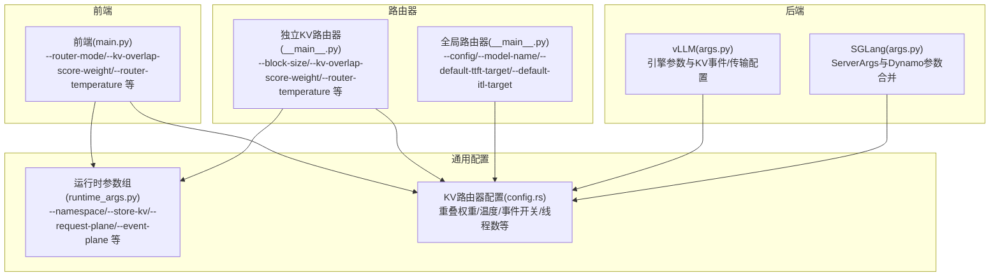
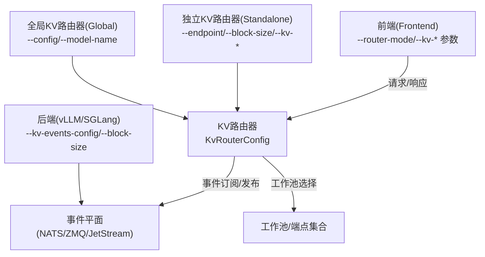
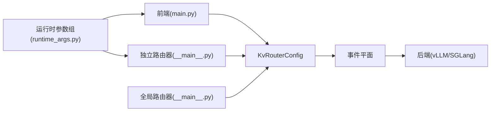

# 路由器配置与参数

<cite>
**本文引用的文件**
- [components/src/dynamo/router/__main__.py](file://components/src/dynamo/router/__main__.py)
- [components/src/dynamo/frontend/main.py](file://components/src/dynamo/frontend/main.py)
- [components/src/dynamo/common/configuration/groups/runtime_args.py](file://components/src/dynamo/common/configuration/groups/runtime_args.py)
- [components/src/dynamo/vllm/args.py](file://components/src/dynamo/vllm/args.py)
- [components/src/dynamo/sglang/args.py](file://components/src/dynamo/sglang/args.py)
- [lib/llm/src/kv_router/config.rs](file://lib/llm/src/kv_router/config.rs)
- [docs/pages/components/router/router-guide.md](file://docs/pages/components/router/router-guide.md)
</cite>

## 目录
1. [简介](#简介)
2. [项目结构](#项目结构)
3. [核心组件](#核心组件)
4. [架构总览](#架构总览)
5. [详细组件分析](#详细组件分析)
6. [依赖关系分析](#依赖关系分析)
7. [性能考量](#性能考量)
8. [故障排查指南](#故障排查指南)
9. [结论](#结论)
10. [附录](#附录)

## 简介
本文件面向Dynamo路由器组件的配置系统，系统性梳理并解释KV路由器（含前端与独立路由器）与全局路由器的关键参数，覆盖命令行参数、环境变量、默认值、参数影响、优先级与覆盖规则、最佳实践与典型部署场景，并提供常见问题排查建议。

## 项目结构
围绕路由器配置相关的核心位置如下：
- 前端KV路由器参数：components/src/dynamo/frontend/main.py
- 独立KV路由器参数：components/src/dynamo/router/__main__.py
- 全局路由器入口与参数：components/src/dynamo/global_router/__main__.py
- 运行时通用参数组（命名空间、事件平面、存储等）：components/src/dynamo/common/configuration/groups/runtime_args.py
- 后端（vLLM/SGLang）运行时参数与KV路由器集成：components/src/dynamo/vllm/args.py、components/src/dynamo/sglang/args.py
- KV路由器配置数据模型与校验：lib/llm/src/kv_router/config.rs
- 路由器使用与调优指南：docs/pages/components/router/router-guide.md

图表来源
- [components/src/dynamo/frontend/main.py](file://components/src/dynamo/frontend/main.py#L120-L319)
- [components/src/dynamo/router/__main__.py](file://components/src/dynamo/router/__main__.py#L156-L267)
- [components/src/dynamo/global_router/__main__.py](file://components/src/dynamo/global_router/__main__.py#L39-L88)
- [components/src/dynamo/common/configuration/groups/runtime_args.py](file://components/src/dynamo/common/configuration/groups/runtime_args.py#L36-L133)
- [components/src/dynamo/vllm/args.py](file://components/src/dynamo/vllm/args.py#L76-L127)
- [components/src/dynamo/sglang/args.py](file://components/src/dynamo/sglang/args.py#L308-L605)
- [lib/llm/src/kv_router/config.rs](file://lib/llm/src/kv_router/config.rs#L22-L100)

章节来源
- [components/src/dynamo/frontend/main.py](file://components/src/dynamo/frontend/main.py#L120-L319)
- [components/src/dynamo/router/__main__.py](file://components/src/dynamo/router/__main__.py#L156-L267)
- [components/src/dynamo/global_router/__main__.py](file://components/src/dynamo/global_router/__main__.py#L39-L88)
- [components/src/dynamo/common/configuration/groups/runtime_args.py](file://components/src/dynamo/common/configuration/groups/runtime_args.py#L36-L133)
- [components/src/dynamo/vllm/args.py](file://components/src/dynamo/vllm/args.py#L76-L127)
- [components/src/dynamo/sglang/args.py](file://components/src/dynamo/sglang/args.py#L308-L605)
- [lib/llm/src/kv_router/config.rs](file://lib/llm/src/kv_router/config.rs#L22-L100)

## 核心组件
- 前端KV路由器参数
  - 关键参数：--router-mode、--kv-cache-block-size、--kv-overlap-score-weight、--router-temperature、--kv-events/--no-kv-events、--durable-kv-events、--router-replica-sync、--router-snapshot-threshold、--router-reset-states、--no-track-active-blocks、--track-output-blocks、--no-assume-kv-reuse、--router-ttl、--router-max-tree-size、--router-prune-target-ratio、--router-event-threads、--active-decode-blocks-threshold、--active-prefill-tokens-threshold、--active-prefill-tokens-threshold-frac
  - 默认值与环境变量映射：如 DYN_ROUTER_MODE、DYN_KV_CACHE_BLOCK_SIZE、DYN_KV_OVERLAP_SCORE_WEIGHT、DYN_ROUTER_TEMPERATURE、DYN_KV_EVENTS、DYN_ROUTER_TTL、DYN_ROUTER_MAX_TREE_SIZE、DYN_ROUTER_PRUNE_TARGET_RATIO、DYN_ROUTER_EVENT_THREADS
- 独立KV路由器参数
  - 关键参数：--endpoint、--block-size、--kv-overlap-score-weight、--router-temperature、--no-kv-events、--router-replica-sync、--router-snapshot-threshold、--router-reset-states、--no-track-active-blocks、--track-output-blocks、--router-ttl、--router-max-tree-size、--router-prune-target-ratio、--router-event-threads
  - 默认值：block-size=128；overlap_score_weight=1.0；router_temperature=0.0；use_kv_events=true；router_event_threads=1
- 全局路由器参数
  - 关键参数：--config、--model-name、--namespace、--component-name、--default-ttft-target、--default-itl-target
- 运行时通用参数组
  - 关键参数：--namespace、--store-kv、--request-plane、--event-plane、--connector、--durable-kv-events、--dyn-tool-call-parser、--dyn-reasoning-parser、--custom-jinja-template、--endpoint-types、--dump-config-to
  - 默认值与环境变量映射：如 DYN_NAMESPACE、DYN_STORE_KV、DYN_REQUEST_PLANE、DYN_EVENT_PLANE、DYN_DURABLE_KV_EVENTS、DYN_ENDPOINT_TYPES、DYN_DUMP_CONFIG_TO
- 后端（vLLM/SGLang）参数与KV路由器集成
  - vLLM：自动设置合理的 block_size 默认值、KV事件/传输配置、分布式执行后端策略等
  - SGLang：ServerArgs与Dynamo参数合并、端点推断、自定义模板与分词器选择等
- KV路由器配置数据模型
  - 结构：overlap_score_weight、router_temperature、use_kv_events、durable_kv_events、router_replica_sync、router_track_active_blocks、router_track_output_blocks、router_assume_kv_reuse、router_snapshot_threshold、router_reset_states、router_ttl_secs、router_max_tree_size、router_prune_target_ratio、router_event_threads
  - 默认值：见默认实现与校验逻辑
  - 校验：durable_kv_events要求use_kv_events为真；多线程事件索引要求use_kv_events为真；track_output_blocks需开启track_active_blocks

章节来源
- [components/src/dynamo/frontend/main.py](file://components/src/dynamo/frontend/main.py#L120-L319)
- [components/src/dynamo/router/__main__.py](file://components/src/dynamo/router/__main__.py#L156-L267)
- [components/src/dynamo/global_router/__main__.py](file://components/src/dynamo/global_router/__main__.py#L39-L88)
- [components/src/dynamo/common/configuration/groups/runtime_args.py](file://components/src/dynamo/common/configuration/groups/runtime_args.py#L36-L133)
- [components/src/dynamo/vllm/args.py](file://components/src/dynamo/vllm/args.py#L255-L260)
- [components/src/dynamo/sglang/args.py](file://components/src/dynamo/sglang/args.py#L308-L605)
- [lib/llm/src/kv_router/config.rs](file://lib/llm/src/kv_router/config.rs#L22-L100)

## 架构总览
下图展示KV路由器在不同组件中的位置与交互：

图表来源
- [components/src/dynamo/frontend/main.py](file://components/src/dynamo/frontend/main.py#L120-L319)
- [components/src/dynamo/router/__main__.py](file://components/src/dynamo/router/__main__.py#L156-L267)
- [components/src/dynamo/global_router/__main__.py](file://components/src/dynamo/global_router/__main__.py#L39-L88)
- [components/src/dynamo/vllm/args.py](file://components/src/dynamo/vllm/args.py#L255-L260)
- [components/src/dynamo/sglang/args.py](file://components/src/dynamo/sglang/args.py#L308-L605)
- [lib/llm/src/kv_router/config.rs](file://lib/llm/src/kv_router/config.rs#L22-L100)

## 详细组件分析

### 前端KV路由器参数详解
- --router-mode
  - 取值：round-robin、random、kv
  - 默认：round_robin
  - 环境变量：DYN_ROUTER_MODE
  - 影响：决定请求路由策略；kv模式启用基于KV缓存重叠的智能选择
- --kv-cache-block-size
  - 类型：整数
  - 默认：后端特定值
  - 环境变量：DYN_KV_CACHE_BLOCK_SIZE
  - 影响：与后端一致的块大小是KV重叠计算准确性的前提
- --kv-overlap-score-weight
  - 类型：浮点数
  - 默认：1.0
  - 环境变量：DYN_KV_OVERLAP_SCORE_WEIGHT
  - 影响：平衡预填充成本与解码负载；提高该权重可优化首Token时间（TTFT），但可能增加令牌间延迟（ITL）
- --router-temperature
  - 类型：浮点数
  - 默认：0.0
  - 环境变量：DYN_ROUTER_TEMPERATURE
  - 影响：通过softmax对成本logits采样引入随机性；0为确定性选择最低成本节点
- --kv-events/--no-kv-events
  - 默认：启用KV事件
  - 环境变量：DYN_KV_EVENTS（可通过反向布尔控制）
  - 影响：启用时实时接收KV事件以精确跟踪缓存状态；禁用时采用TTL与修剪的本地预测
- --durable-kv-events
  - 行为：启用JetStream持久化事件通道
  - 影响：跨路由器实例一致性增强；需前后端同时启用
- --router-replica-sync
  - 行为：启用路由器副本同步，共享活跃序列信息
  - 影响：提升多副本间路由一致性
- --router-snapshot-threshold
  - 行为：JetStream模式下触发快照的消息阈值
  - 影响：控制流大小与重启恢复速度
- --router-reset-states
  - 行为：启动时重置状态（JetStream模式）
  - 影响：清理流与对象存储快照，谨慎使用
- --no-track-active-blocks
  - 行为：禁用活跃块跟踪
  - 影响：减少开销，适用于仅预填充场景
- --track-output-blocks
  - 行为：跟踪生成过程中的输出块
  - 影响：提升长请求负载均衡精度
- --no-assume-kv-reuse
  - 行为：不假设KV重用，生成随机哈希
  - 影响：在解码阶段避免重复块误判
- --router-ttl、--router-max-tree-size、--router-prune-target-ratio
  - 行为：当禁用KV事件时用于本地缓存管理
  - 影响：控制内存占用与过期清理
- --router-event-threads
  - 行为：事件处理线程数
  - 影响：并发索引树吞吐；>1时不支持TTL/修剪
- --active-decode-blocks-threshold、--active-prefill-tokens-threshold、--active-prefill-tokens-threshold-frac
  - 行为：动态忙碌阈值检测
  - 影响：按缓存块利用率或预填充令牌数判断繁忙

章节来源
- [components/src/dynamo/frontend/main.py](file://components/src/dynamo/frontend/main.py#L120-L319)
- [docs/pages/components/router/router-guide.md](file://docs/pages/components/router/router-guide.md#L70-L199)

### 独立KV路由器参数详解
- --endpoint
  - 必填：格式为 namespace.component.endpoint
  - 影响：指定目标工作端点
- --block-size
  - 默认：128
  - 影响：与后端一致的块大小确保重叠计算准确
- --kv-overlap-score-weight
  - 默认：1.0
  - 影响：同前端参数
- --router-temperature
  - 默认：0.0
  - 影响：同前端参数
- --no-kv-events
  - 默认：启用事件
  - 影响：同前端参数
- --router-replica-sync、--router-snapshot-threshold、--router-reset-states、--no-track-active-blocks、--track-output-blocks、--router-ttl、--router-max-tree-size、--router-prune-target-ratio、--router-event-threads
  - 影响：同前端参数

章节来源
- [components/src/dynamo/router/__main__.py](file://components/src/dynamo/router/__main__.py#L156-L267)
- [lib/llm/src/kv_router/config.rs](file://lib/llm/src/kv_router/config.rs#L22-L100)

### 全局KV路由器参数详解
- --config
  - 必填：JSON配置文件路径
  - 内容：定义池命名空间与选择策略
- --model-name
  - 必填：注册模型名
- --namespace
  - 默认：DYN_NAMESPACE
- --component-name
  - 默认：global_router
- --default-ttft-target、--default-itl-target
  - 作用：当请求未携带SLA时的默认目标

章节来源
- [components/src/dynamo/global_router/__main__.py](file://components/src/dynamo/global_router/__main__.py#L39-L88)

### 运行时通用参数组
- --namespace
  - 默认：dynamo
  - 环境变量：DYN_NAMESPACE
- --store-kv
  - 取值：etcd、file、mem
  - 环境变量：DYN_STORE_KV
- --request-plane
  - 取值：tcp、nats、http
  - 默认：tcp
  - 环境变量：DYN_REQUEST_PLANE
- --event-plane
  - 取值：nats、zmq
  - 默认：nats
  - 环境变量：DYN_EVENT_PLANE
- --connector
  - 列表：nixl、lmcache、kvbm、null、none
  - 环境变量：DYN_CONNECTOR
- --durable-kv-events
  - 默认：False
  - 环境变量：DYN_DURABLE_KV_EVENTS
- 其他：工具/推理解析器、自定义模板、端点类型、配置导出

章节来源
- [components/src/dynamo/common/configuration/groups/runtime_args.py](file://components/src/dynamo/common/configuration/groups/runtime_args.py#L36-L133)

### 后端（vLLM/SGLang）与KV路由器集成
- vLLM
  - 自动设置 block_size 默认值（如未显式提供）
  - 自动设置KV事件/传输配置（如启用前缀缓存）
  - 在特定条件下强制分布式执行后端以避免GIL竞争
- SGLang
  - ServerArgs与Dynamo参数合并
  - 端点推断与验证
  - 自定义模板与分词器选择的互斥检查

章节来源
- [components/src/dynamo/vllm/args.py](file://components/src/dynamo/vllm/args.py#L255-L260)
- [components/src/dynamo/vllm/args.py](file://components/src/dynamo/vllm/args.py#L220-L247)
- [components/src/dynamo/sglang/args.py](file://components/src/dynamo/sglang/args.py#L308-L605)

### KV路由器配置数据模型
- 字段与默认值
  - overlap_score_weight: 1.0
  - router_temperature: 0.0
  - use_kv_events: true
  - durable_kv_events: false
  - router_replica_sync: false
  - router_track_active_blocks: true
  - router_track_output_blocks: false
  - router_assume_kv_reuse: true
  - router_snapshot_threshold: 1000000
  - router_reset_states: false
  - router_ttl_secs: 120.0
  - router_max_tree_size: 2^20
  - router_prune_target_ratio: 0.8
  - router_event_threads: 1
- 校验规则
  - durable_kv_events要求use_kv_events为真
  - 多线程事件索引要求use_kv_events为真
  - track_output_blocks需开启track_active_blocks

章节来源
- [lib/llm/src/kv_router/config.rs](file://lib/llm/src/kv_router/config.rs#L22-L100)
- [lib/llm/src/kv_router/config.rs](file://lib/llm/src/kv_router/config.rs#L102-L119)

## 依赖关系分析
- 前端与独立路由器均消费KV路由器配置（KvRouterConfig），并通过事件平面与后端通信
- 全局路由器负责高层网格化路由决策，内部仍依赖KV路由器进行池内选择
- 后端（vLLM/SGLang）通过KV事件/传输配置参与KV重叠计算
- 运行时通用参数组为各组件提供统一的命名空间、事件平面与存储策略

图表来源
- [components/src/dynamo/frontend/main.py](file://components/src/dynamo/frontend/main.py#L120-L319)
- [components/src/dynamo/router/__main__.py](file://components/src/dynamo/router/__main__.py#L156-L267)
- [components/src/dynamo/global_router/__main__.py](file://components/src/dynamo/global_router/__main__.py#L39-L88)
- [components/src/dynamo/common/configuration/groups/runtime_args.py](file://components/src/dynamo/common/configuration/groups/runtime_args.py#L36-L133)
- [lib/llm/src/kv_router/config.rs](file://lib/llm/src/kv_router/config.rs#L22-L100)

章节来源
- [components/src/dynamo/frontend/main.py](file://components/src/dynamo/frontend/main.py#L120-L319)
- [components/src/dynamo/router/__main__.py](file://components/src/dynamo/router/__main__.py#L156-L267)
- [components/src/dynamo/global_router/__main__.py](file://components/src/dynamo/global_router/__main__.py#L39-L88)
- [components/src/dynamo/common/configuration/groups/runtime_args.py](file://components/src/dynamo/common/configuration/groups/runtime_args.py#L36-L133)
- [lib/llm/src/kv_router/config.rs](file://lib/llm/src/kv_router/config.rs#L22-L100)

## 性能考量
- 参数权衡
  - kv-overlap-score-weight：提高TTFT但可能增加ITL；decode-heavy场景应降低权重
  - router-temperature：引入随机性有助于避免饱和，但会牺牲部分确定性
  - use_kv_events：启用事件可获得更精确的状态，但需要事件平面与后端支持
  - durable_kv_events：在多副本一致性与持久化方面收益显著，但需要JetStream基础设施
- 线程与内存
  - router-event-threads>1时吞吐更高，但不支持TTL/修剪
  - 合理设置router-max-tree-size与router-prune-target-ratio以控制内存增长
- 后端一致性
  - block-size必须与后端一致，否则重叠计算失准
  - vLLM/SGLang在特定情况下会自动调整执行后端以避免GIL竞争

章节来源
- [docs/pages/components/router/router-guide.md](file://docs/pages/components/router/router-guide.md#L224-L259)
- [components/src/dynamo/vllm/args.py](file://components/src/dynamo/vllm/args.py#L255-L260)
- [components/src/dynamo/vllm/args.py](file://components/src/dynamo/vllm/args.py#L220-L247)

## 故障排查指南
- 无法启用KV事件
  - 检查事件平面与后端是否支持；必要时启用durable_kv_events并确保前后端一致
- 负载分布不均
  - 提高router-temperature引入随机性；检查active-decode-blocks-threshold与active-prefill-tokens-threshold配置
- 内存增长过快
  - 在禁用事件模式下，适当降低router-max-tree-size或提高router-prune-target-ratio；或启用事件模式以依赖后端驱逐事件
- 首次启动状态异常
  - JetStream模式下考虑使用router-reset-states清理状态，但需谨慎避免破坏现有副本一致性
- block-size不一致
  - 统一前端与后端的block-size配置，避免重叠计算偏差

章节来源
- [docs/pages/components/router/router-guide.md](file://docs/pages/components/router/router-guide.md#L177-L199)
- [components/src/dynamo/router/__main__.py](file://components/src/dynamo/router/__main__.py#L240-L258)

## 结论
KV路由器通过重叠权重与温度参数在TTFT与ITL之间提供灵活权衡；事件平面与持久化模式则决定了状态一致性与运维复杂度。结合后端自动配置与运行时通用参数组，可在不同部署场景中实现稳定高效的路由策略。

## 附录

### 参数优先级与覆盖规则
- CLI参数优先于环境变量
- 环境变量优先于默认值
- 前端与独立路由器的KV参数在功能上保持一致，但默认值存在差异（如block-size）
- 运行时通用参数组（namespace/store-kv/request-plane/event-plane）对所有组件生效

章节来源
- [components/src/dynamo/frontend/main.py](file://components/src/dynamo/frontend/main.py#L120-L319)
- [components/src/dynamo/router/__main__.py](file://components/src/dynamo/router/__main__.py#L156-L267)
- [components/src/dynamo/common/configuration/groups/runtime_args.py](file://components/src/dynamo/common/configuration/groups/runtime_args.py#L36-L133)

### 配置最佳实践与推荐设置
- 通用场景
  - 使用默认的kv-overlap-score-weight=1.0与router-temperature=0.0
  - 启用kv-events，若需要多副本一致性则启用durable-kv-events
- 高TTFT敏感场景
  - 适度提高kv-overlap-score-weight；保持router-temperature=0.0
- 高并发/长会话场景
  - 启用track-output-blocks；合理设置router-event-threads>1（若允许忽略TTL/修剪）
- 多副本部署
  - 启用router-replica-sync；JetStream模式下谨慎使用router-reset-states

章节来源
- [docs/pages/components/router/router-guide.md](file://docs/pages/components/router/router-guide.md#L224-L259)

### 典型部署场景与配置示例
- 前端KV路由（Python）
  - 启动：python -m dynamo.frontend --router-mode kv --http-port 8000
  - 环境变量：DYN_ROUTER_MODE=kv、DYN_KV_OVERLAP_SCORE_WEIGHT=1.0、DYN_ROUTER_TEMPERATURE=0.0
- 独立KV路由器
  - 启动：python -m dynamo.router --endpoint dynamo.prefill.generate --block-size 128 --kv-overlap-score-weight 1.0 --router-temperature 0.0
- 全局KV路由器
  - 启动：python -m dynamo.global_router --config /path/to/config.json --model-name meta-llama/Llama-2-7b-hf --default-ttft-target 100 --default-itl-target 50

章节来源
- [components/src/dynamo/frontend/main.py](file://components/src/dynamo/frontend/main.py#L18-L31)
- [components/src/dynamo/router/__main__.py](file://components/src/dynamo/router/__main__.py#L156-L180)
- [components/src/dynamo/global_router/__main__.py](file://components/src/dynamo/global_router/__main__.py#L39-L88)