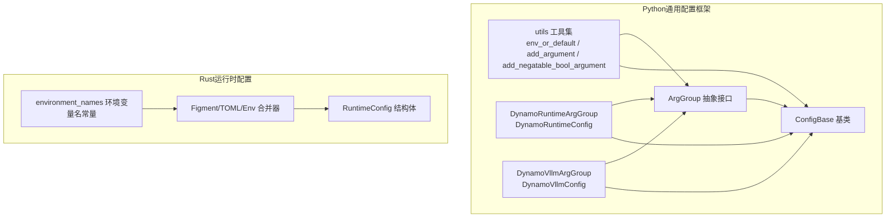
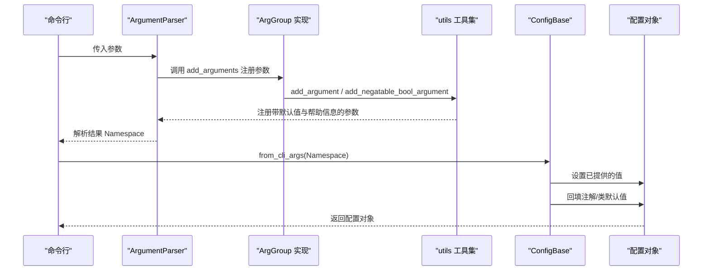
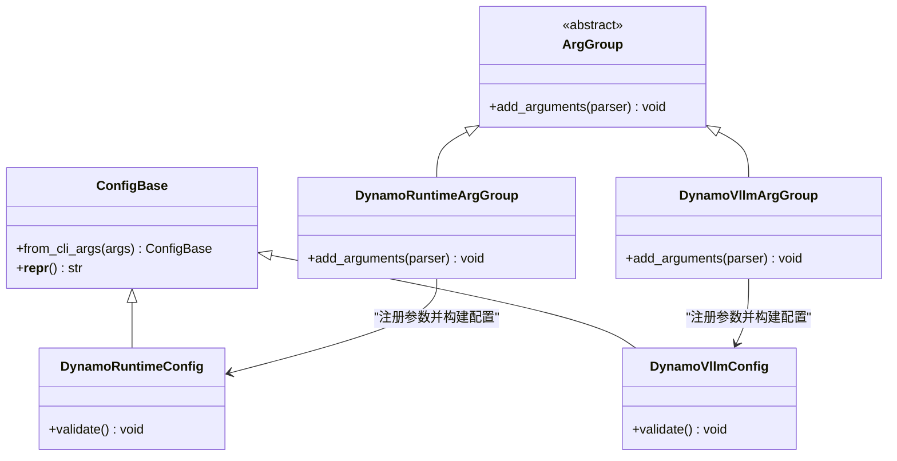
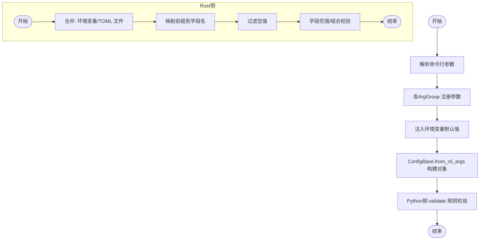
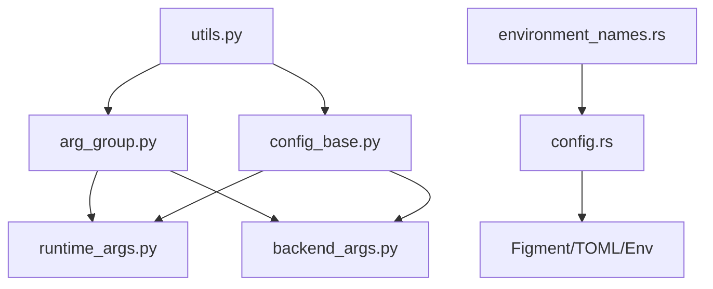

# 配置管理系统

<cite>
**本文引用的文件**
- [components/src/dynamo/common/configuration/__init__.py](file://components/src/dynamo/common/configuration/__init__.py)
- [components/src/dynamo/common/configuration/arg_group.py](file://components/src/dynamo/common/configuration/arg_group.py)
- [components/src/dynamo/common/configuration/config_base.py](file://components/src/dynamo/common/configuration/config_base.py)
- [components/src/dynamo/common/configuration/utils.py](file://components/src/dynamo/common/configuration/utils.py)
- [components/src/dynamo/common/configuration/groups/runtime_args.py](file://components/src/dynamo/common/configuration/groups/runtime_args.py)
- [components/src/dynamo/vllm/backend_args.py](file://components/src/dynamo/vllm/backend_args.py)
- [lib/runtime/src/config.rs](file://lib/runtime/src/config.rs)
- [lib/runtime/src/config/environment_names.rs](file://lib/runtime/src/config/environment_names.rs)
- [lib/config/src/lib.rs](file://lib/config/src/lib.rs)
- [components/src/dynamo/vllm/args.py](file://components/src/dynamo/vllm/args.py)
- [components/src/dynamo/sglang/args.py](file://components/src/dynamo/sglang/args.py)
</cite>

## 目录
1. [引言](#引言)
2. [项目结构](#项目结构)
3. [核心组件](#核心组件)
4. [架构总览](#架构总览)
5. [详细组件分析](#详细组件分析)
6. [依赖关系分析](#依赖关系分析)
7. [性能考量](#性能考量)
8. [故障排查指南](#故障排查指南)
9. [结论](#结论)
10. [附录](#附录)

## 引言
本文件面向Dynamo配置管理系统，系统性梳理其基于ArgGroup的模块化配置架构、参数组管理与运行时参数处理机制，涵盖配置验证、默认值设置、环境变量与命令行解析、布尔值解析策略、动态更新策略（如适用）、配置文件格式与加载优先级、继承与覆盖规则以及版本兼容性处理建议。文档同时提供可操作的最佳实践与使用示例路径，帮助开发者在不同后端（如vLLM、SGLang等）中一致地集成与扩展配置。

## 项目结构
Dynamo配置系统由Python侧的通用配置框架与Rust侧的运行时配置两部分组成：
- Python侧：以ArgGroup为抽象接口，通过ConfigBase统一从CLI参数构建配置对象，并提供env_or_default、add_argument、add_negatable_bool_argument等工具函数，支持环境变量默认值注入、帮助信息增强与弃用标志提示。
- Rust侧：提供运行时配置加载与校验能力，支持从多源合并（文件、环境变量），并对字段进行范围与组合约束校验。

图表来源
- [components/src/dynamo/common/configuration/arg_group.py](file://components/src/dynamo/common/configuration/arg_group.py#L8-L26)
- [components/src/dynamo/common/configuration/config_base.py](file://components/src/dynamo/common/configuration/config_base.py#L6-L38)
- [components/src/dynamo/common/configuration/utils.py](file://components/src/dynamo/common/configuration/utils.py#L13-L145)
- [components/src/dynamo/common/configuration/groups/runtime_args.py](file://components/src/dynamo/common/configuration/groups/runtime_args.py#L14-L133)
- [components/src/dynamo/vllm/backend_args.py](file://components/src/dynamo/vllm/backend_args.py#L15-L289)
- [lib/runtime/src/config.rs](file://lib/runtime/src/config.rs#L71-L331)
- [lib/runtime/src/config/environment_names.rs](file://lib/runtime/src/config/environment_names.rs#L66-L100)

章节来源
- [components/src/dynamo/common/configuration/__init__.py](file://components/src/dynamo/common/configuration/__init__.py#L1-L25)
- [components/src/dynamo/common/configuration/arg_group.py](file://components/src/dynamo/common/configuration/arg_group.py#L1-L27)
- [components/src/dynamo/common/configuration/config_base.py](file://components/src/dynamo/common/configuration/config_base.py#L1-L38)
- [components/src/dynamo/common/configuration/utils.py](file://components/src/dynamo/common/configuration/utils.py#L1-L145)
- [components/src/dynamo/common/configuration/groups/runtime_args.py](file://components/src/dynamo/common/configuration/groups/runtime_args.py#L1-L133)
- [components/src/dynamo/vllm/backend_args.py](file://components/src/dynamo/vllm/backend_args.py#L1-L289)
- [lib/runtime/src/config.rs](file://lib/runtime/src/config.rs#L71-L331)
- [lib/runtime/src/config/environment_names.rs](file://lib/runtime/src/config/environment_names.rs#L66-L100)

## 核心组件
- ArgGroup：定义参数组的抽象接口，要求实现add_arguments方法用于注册属于该域的CLI参数。该接口确保每个参数组职责清晰、互不耦合。
- ConfigBase：提供从argparse命名空间构建配置实例的能力，支持注解默认值与类默认值的回填，保证在未显式传入时仍能获得合理的默认值。
- utils：提供env_or_default、add_argument、add_negatable_bool_argument等工具，统一处理环境变量类型转换、帮助信息生成、弃用标志提示与dest名称推导。
- 具体参数组：如DynamoRuntimeArgGroup/DynamoRuntimeConfig负责运行时通用参数；DynamoVllmArgGroup/DynamoVllmConfig负责vLLM后端特定参数，并在validate阶段执行业务规则校验。
- 运行时配置（Rust）：RuntimeConfig通过Figment/TOML/Env多源合并，支持环境变量前缀映射与字段校验，提供从设置加载配置的统一入口。

章节来源
- [components/src/dynamo/common/configuration/arg_group.py](file://components/src/dynamo/common/configuration/arg_group.py#L8-L26)
- [components/src/dynamo/common/configuration/config_base.py](file://components/src/dynamo/common/configuration/config_base.py#L6-L38)
- [components/src/dynamo/common/configuration/utils.py](file://components/src/dynamo/common/configuration/utils.py#L13-L145)
- [components/src/dynamo/common/configuration/groups/runtime_args.py](file://components/src/dynamo/common/configuration/groups/runtime_args.py#L14-L133)
- [components/src/dynamo/vllm/backend_args.py](file://components/src/dynamo/vllm/backend_args.py#L15-L289)
- [lib/runtime/src/config.rs](file://lib/runtime/src/config.rs#L71-L331)

## 架构总览
下图展示了Python侧配置系统如何通过ArgGroup与ConfigBase构建配置对象，并结合utils完成参数注册与默认值注入；同时展示Rust侧运行时配置如何从文件与环境变量合并得到最终配置。

图表来源
- [components/src/dynamo/common/configuration/arg_group.py](file://components/src/dynamo/common/configuration/arg_group.py#L15-L26)
- [components/src/dynamo/common/configuration/utils.py](file://components/src/dynamo/common/configuration/utils.py#L50-L127)
- [components/src/dynamo/common/configuration/config_base.py](file://components/src/dynamo/common/configuration/config_base.py#L9-L33)

章节来源
- [components/src/dynamo/common/configuration/utils.py](file://components/src/dynamo/common/configuration/utils.py#L50-L127)
- [components/src/dynamo/common/configuration/config_base.py](file://components/src/dynamo/common/configuration/config_base.py#L9-L33)

## 详细组件分析

### 设计模式与参数组管理
- 模块化领域划分：每个ArgGroup代表一个配置域，职责单一且可独立扩展。例如运行时域与后端域分离，便于按需启用与维护。
- 参数注册与帮助信息：add_argument统一处理dest推导、弃用标志提示、环境变量默认值注入与帮助文本拼接，减少重复代码并提升一致性。
- 默认值回填策略：ConfigBase在from_cli_args中先写入CLI提供的值，再对未设置的字段回填注解默认或类默认，避免覆盖用户显式输入。

图表来源
- [components/src/dynamo/common/configuration/arg_group.py](file://components/src/dynamo/common/configuration/arg_group.py#L8-L26)
- [components/src/dynamo/common/configuration/config_base.py](file://components/src/dynamo/common/configuration/config_base.py#L6-L38)
- [components/src/dynamo/common/configuration/groups/runtime_args.py](file://components/src/dynamo/common/configuration/groups/runtime_args.py#L36-L133)
- [components/src/dynamo/vllm/backend_args.py](file://components/src/dynamo/vllm/backend_args.py#L15-L289)

章节来源
- [components/src/dynamo/common/configuration/arg_group.py](file://components/src/dynamo/common/configuration/arg_group.py#L8-L26)
- [components/src/dynamo/common/configuration/config_base.py](file://components/src/dynamo/common/configuration/config_base.py#L6-L38)
- [components/src/dynamo/common/configuration/groups/runtime_args.py](file://components/src/dynamo/common/configuration/groups/runtime_args.py#L14-L133)
- [components/src/dynamo/vllm/backend_args.py](file://components/src/dynamo/vllm/backend_args.py#L15-L289)

### 运行时参数处理机制
- Python侧：通过ArgGroup.add_arguments注册参数，utils根据env_var与default自动注入环境变量默认值，dest名称从flag_name派生，帮助信息包含env var与默认值提示。
- Rust侧：RuntimeConfig通过Figment合并多源配置，优先级为环境变量 > /opt/dynamo/etc/runtime.toml > /opt/dynamo/defaults/runtime.toml；环境变量前缀映射到具体字段名，支持过滤空值；提供字段范围与组合校验。

图表来源
- [components/src/dynamo/common/configuration/utils.py](file://components/src/dynamo/common/configuration/utils.py#L50-L127)
- [components/src/dynamo/common/configuration/config_base.py](file://components/src/dynamo/common/configuration/config_base.py#L9-L33)
- [lib/runtime/src/config.rs](file://lib/runtime/src/config.rs#L222-L331)

章节来源
- [components/src/dynamo/common/configuration/utils.py](file://components/src/dynamo/common/configuration/utils.py#L50-L127)
- [components/src/dynamo/common/configuration/config_base.py](file://components/src/dynamo/common/configuration/config_base.py#L9-L33)
- [lib/runtime/src/config.rs](file://lib/runtime/src/config.rs#L222-L331)

### 配置验证、默认值设置与动态更新策略
- 验证策略
  - Python侧：在对应Config类的validate中执行业务规则校验，如互斥性、依赖关系与必填条件检查。
  - Rust侧：使用结构体属性与校验宏（如range、serde等）在构建阶段进行字段范围与组合约束校验。
- 默认值设置
  - Python侧：env_or_default根据default类型进行类型转换；add_argument支持choices、nargs等丰富参数；弃用标志仅用于帮助信息提示。
  - Rust侧：通过Figment的Serialized/Env/Toml合并与字段注解提供默认值与校验。
- 动态更新策略
  - Python侧：当前实现主要在进程启动时从CLI/环境变量构建配置，未见内置热重载逻辑；如需动态更新，建议在应用层引入订阅机制并在重启或重建上下文时重新加载。
  - Rust侧：RuntimeConfig提供from_settings统一入口，适合在启动时加载并校验，未见内置热重载逻辑；可通过外部机制触发重启以应用新配置。

章节来源
- [components/src/dynamo/common/configuration/utils.py](file://components/src/dynamo/common/configuration/utils.py#L13-L48)
- [components/src/dynamo/common/configuration/utils.py](file://components/src/dynamo/common/configuration/utils.py#L50-L127)
- [components/src/dynamo/common/configuration/groups/runtime_args.py](file://components/src/dynamo/common/configuration/groups/runtime_args.py#L31-L33)
- [components/src/dynamo/vllm/backend_args.py](file://components/src/dynamo/vllm/backend_args.py#L224-L289)
- [lib/runtime/src/config.rs](file://lib/runtime/src/config.rs#L314-L331)

### 配置文件格式、命令行参数解析与环境变量处理
- 配置文件格式与加载
  - Python侧：未发现标准的配置文件格式与加载逻辑，主要依赖CLI与环境变量。
  - Rust侧：支持TOML文件（/opt/dynamo/etc/runtime.toml与/opt/dynamo/defaults/runtime.toml），并通过环境变量前缀映射到字段名。
- 命令行参数解析
  - Python侧：ArgGroup.add_arguments集中注册参数，utils统一处理dest、默认值、弃用标志与帮助信息。
  - Rust侧：通过Figment的Env适配器与前缀过滤，实现环境变量到字段的映射。
- 环境变量处理
  - Python侧：env_or_default按default类型进行布尔/整数/浮点/列表/字符串转换；布尔值接受“true/1/on/yes”等大小写无关的真值。
  - Rust侧：提供is_truthy/is_falsey与parse_bool等工具，严格区分无效布尔值并返回错误。

章节来源
- [components/src/dynamo/common/configuration/utils.py](file://components/src/dynamo/common/configuration/utils.py#L13-L48)
- [components/src/dynamo/common/configuration/utils.py](file://components/src/dynamo/common/configuration/utils.py#L50-L127)
- [lib/runtime/src/config.rs](file://lib/runtime/src/config.rs#L222-L331)
- [lib/config/src/lib.rs](file://lib/config/src/lib.rs#L11-L35)

### 使用示例与最佳实践
- 示例路径
  - Python侧：vLLM后端参数注册与配置构建
    - 参考路径：[components/src/dynamo/vllm/backend_args.py](file://components/src/dynamo/vllm/backend_args.py#L20-L191)
    - 配置对象构建：[components/src/dynamo/vllm/args.py](file://components/src/dynamo/vllm/args.py#L107-L119)
  - SGLang后端参数注册与配置构建
    - 参考路径：[components/src/dynamo/sglang/args.py](file://components/src/dynamo/sglang/args.py#L509-L541)
  - 运行时配置加载
    - 参考路径：[lib/runtime/src/config.rs](file://lib/runtime/src/config.rs#L314-L331)
- 最佳实践
  - 统一使用utils.add_argument与add_negatable_bool_argument注册参数，确保帮助信息包含环境变量与默认值。
  - 对于布尔型环境变量，遵循“true/1/on/yes”为真、“false/0/off/no”为假的约定，避免歧义。
  - 在Config.validate中集中编写业务规则校验，保持参数域内的一致性与可维护性。
  - 如需持久化配置，建议在Python侧增加配置导出功能（如dump_config_to），在Rust侧使用TOML文件作为外部配置源。

章节来源
- [components/src/dynamo/vllm/backend_args.py](file://components/src/dynamo/vllm/backend_args.py#L20-L191)
- [components/src/dynamo/vllm/args.py](file://components/src/dynamo/vllm/args.py#L107-L119)
- [components/src/dynamo/sglang/args.py](file://components/src/dynamo/sglang/args.py#L509-L541)
- [lib/runtime/src/config.rs](file://lib/runtime/src/config.rs#L314-L331)

### 继承、覆盖规则与版本兼容性
- 继承与覆盖
  - Python侧：ConfigBase在from_cli_args中遍历MRO，按顺序回填注解默认与类默认值，若CLI已提供则跳过回填，体现“CLI优先”的覆盖规则。
  - Rust侧：Figment按合并顺序叠加配置，后加入的源具有更高优先级，体现“后入为主”的覆盖规则。
- 版本兼容性
  - Python侧：弃用标志通过help信息提示，保留历史参数以便平滑迁移。
  - Rust侧：对已弃用的环境变量发出警告日志，指导用户迁移到新的字段或前缀。

章节来源
- [components/src/dynamo/common/configuration/config_base.py](file://components/src/dynamo/common/configuration/config_base.py#L19-L31)
- [components/src/dynamo/common/configuration/utils.py](file://components/src/dynamo/common/configuration/utils.py#L129-L137)
- [lib/runtime/src/config.rs](file://lib/runtime/src/config.rs#L314-L331)

## 依赖关系分析
Python侧ArgGroup与ConfigBase之间存在直接依赖，utils作为公共工具被ArgGroup与ConfigBase共同使用；具体参数组（如运行时与vLLM）分别继承自ArgGroup与ConfigBase。Rust侧RuntimeConfig依赖environment_names中的环境变量名常量，并通过Figment进行配置合并。

图表来源
- [components/src/dynamo/common/configuration/utils.py](file://components/src/dynamo/common/configuration/utils.py#L50-L127)
- [components/src/dynamo/common/configuration/arg_group.py](file://components/src/dynamo/common/configuration/arg_group.py#L8-L26)
- [components/src/dynamo/common/configuration/config_base.py](file://components/src/dynamo/common/configuration/config_base.py#L6-L38)
- [components/src/dynamo/common/configuration/groups/runtime_args.py](file://components/src/dynamo/common/configuration/groups/runtime_args.py#L14-L133)
- [components/src/dynamo/vllm/backend_args.py](file://components/src/dynamo/vllm/backend_args.py#L15-L289)
- [lib/runtime/src/config/environment_names.rs](file://lib/runtime/src/config/environment_names.rs#L66-L100)
- [lib/runtime/src/config.rs](file://lib/runtime/src/config.rs#L222-L331)

章节来源
- [components/src/dynamo/common/configuration/utils.py](file://components/src/dynamo/common/configuration/utils.py#L50-L127)
- [components/src/dynamo/common/configuration/arg_group.py](file://components/src/dynamo/common/configuration/arg_group.py#L8-L26)
- [components/src/dynamo/common/configuration/config_base.py](file://components/src/dynamo/common/configuration/config_base.py#L6-L38)
- [components/src/dynamo/common/configuration/groups/runtime_args.py](file://components/src/dynamo/common/configuration/groups/runtime_args.py#L14-L133)
- [components/src/dynamo/vllm/backend_args.py](file://components/src/dynamo/vllm/backend_args.py#L15-L289)
- [lib/runtime/src/config/environment_names.rs](file://lib/runtime/src/config/environment_names.rs#L66-L100)
- [lib/runtime/src/config.rs](file://lib/runtime/src/config.rs#L222-L331)

## 性能考量
- 参数注册与解析：ArgGroup集中注册参数，避免重复解析与冗余逻辑，有助于降低启动开销。
- 默认值注入：env_or_default按default类型进行快速转换，避免不必要的异常分支。
- Rust配置合并：Figment的合并过程在启动时完成，建议控制配置源数量与TOML文件大小，避免启动时长增长。
- 建议
  - 将大型配置拆分为多个ArgGroup，按需启用，减少不必要的参数解析。
  - 对频繁访问的布尔型环境变量，尽量使用utils.add_negatable_bool_argument，减少手动判断。

## 故障排查指南
- 常见问题
  - 布尔值解析失败：确认环境变量是否为“true/1/on/yes”或“false/0/off/no”，Rust侧parse_bool会严格校验。
  - 参数冲突：在Config.validate中检查互斥参数与依赖关系，必要时在ArgGroup中添加choices限制。
  - 环境变量未生效：检查环境变量前缀与字段映射是否正确，Rust侧会过滤空值。
- 排查步骤
  - 打印解析后的配置对象，核对CLI与环境变量的覆盖顺序。
  - 查看弃用标志的帮助信息，确认是否仍在使用旧参数。
  - 在Rust侧查看from_settings的警告日志，关注已弃用的环境变量提示。

章节来源
- [lib/config/src/lib.rs](file://lib/config/src/lib.rs#L11-L35)
- [lib/runtime/src/config.rs](file://lib/runtime/src/config.rs#L421-L440)
- [components/src/dynamo/common/configuration/utils.py](file://components/src/dynamo/common/configuration/utils.py#L129-L137)

## 结论
Dynamo配置管理系统采用模块化的ArgGroup架构，结合ConfigBase与utils工具，实现了统一的参数注册、默认值注入与验证机制。Python侧强调CLI与环境变量的灵活性，Rust侧强调配置文件与环境变量的可追溯性与校验能力。通过明确的覆盖规则与弃用策略，系统在保证易用性的同时兼顾了长期演进的稳定性。建议在实际使用中遵循统一的参数注册规范、严格的布尔值约定与集中式的验证流程，并在需要时引入持久化配置与动态更新机制。

## 附录
- 关键API与路径参考
  - Python工具函数：env_or_default、add_argument、add_negatable_bool_argument
    - 参考路径：[components/src/dynamo/common/configuration/utils.py](file://components/src/dynamo/common/configuration/utils.py#L13-L145)
  - 参数组与配置基类
    - 参考路径：[components/src/dynamo/common/configuration/arg_group.py](file://components/src/dynamo/common/configuration/arg_group.py#L8-L26)
    - 参考路径：[components/src/dynamo/common/configuration/config_base.py](file://components/src/dynamo/common/configuration/config_base.py#L6-L38)
  - 运行时配置（Rust）
    - 参考路径：[lib/runtime/src/config.rs](file://lib/runtime/src/config.rs#L71-L331)
    - 参考路径：[lib/runtime/src/config/environment_names.rs](file://lib/runtime/src/config/environment_names.rs#L66-L100)
  - 后端参数示例（vLLM/SGLang）
    - 参考路径：[components/src/dynamo/vllm/backend_args.py](file://components/src/dynamo/vllm/backend_args.py#L15-L289)
    - 参考路径：[components/src/dynamo/vllm/args.py](file://components/src/dynamo/vllm/args.py#L107-L119)
    - 参考路径：[components/src/dynamo/sglang/args.py](file://components/src/dynamo/sglang/args.py#L509-L541)