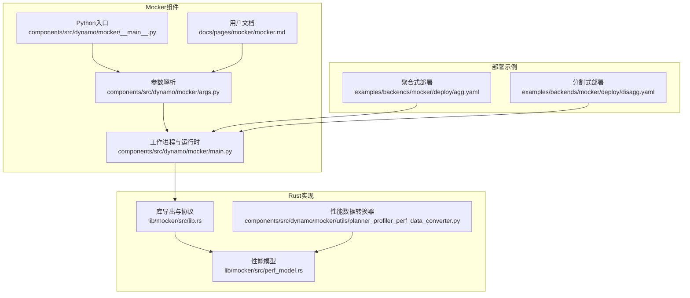
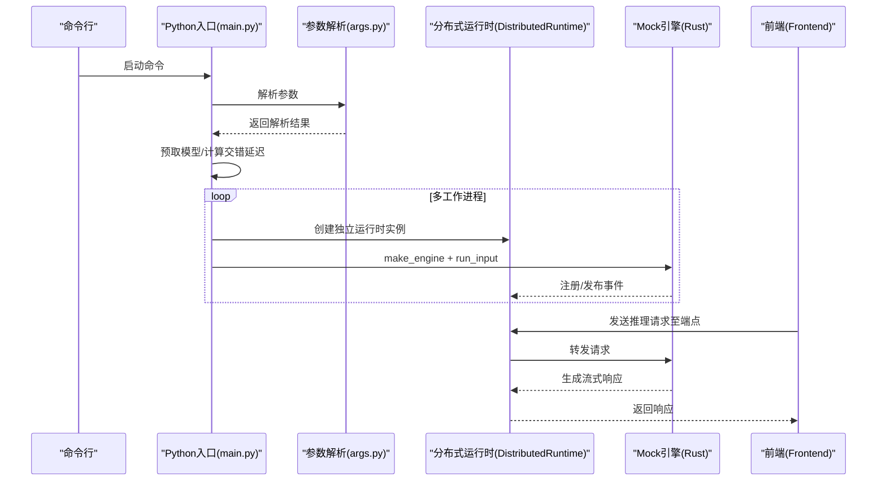
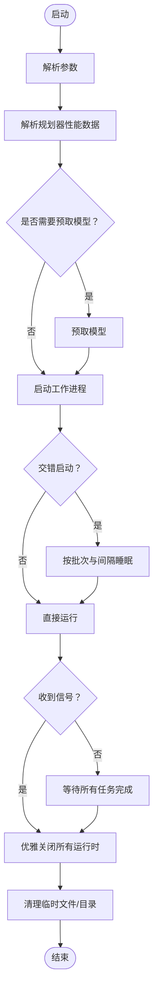
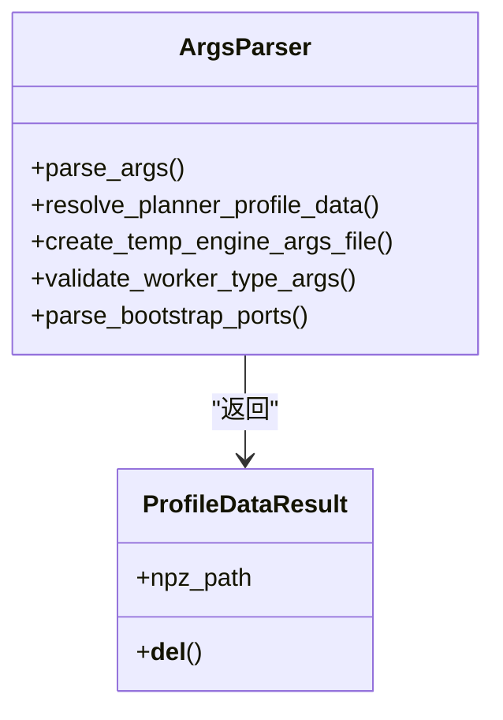
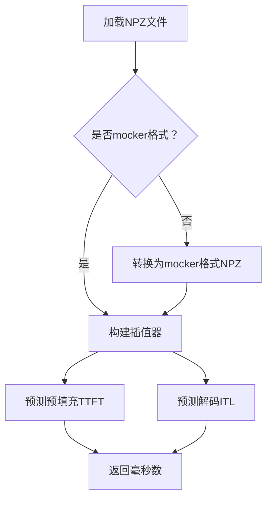
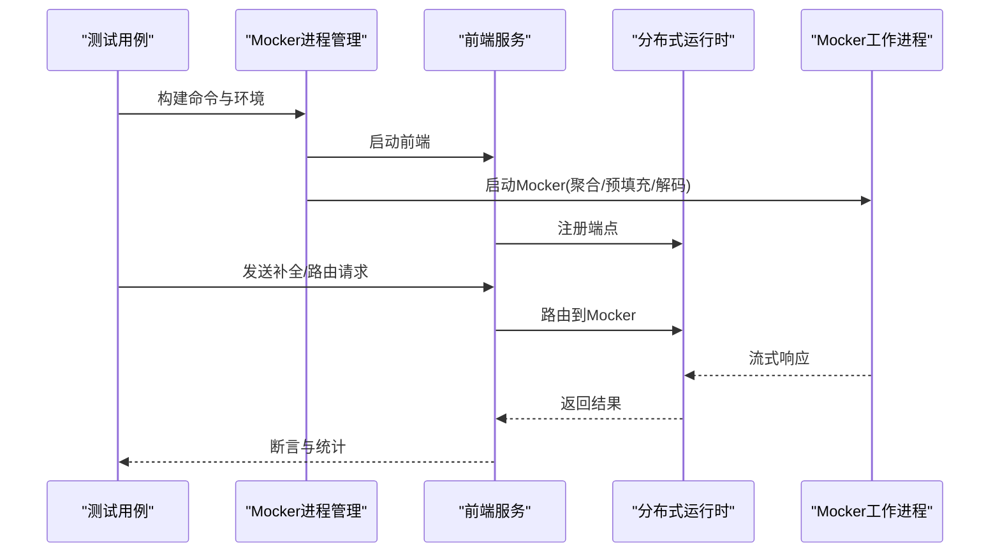
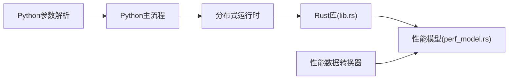

# Mocker集成示例

<cite>
**本文档引用的文件**
- [components/src/dynamo/mocker/README.md](file://components/src/dynamo/mocker/README.md)
- [components/src/dynamo/mocker/__main__.py](file://components/src/dynamo/mocker/__main__.py)
- [components/src/dynamo/mocker/main.py](file://components/src/dynamo/mocker/main.py)
- [components/src/dynamo/mocker/args.py](file://components/src/dynamo/mocker/args.py)
- [examples/backends/mocker/deploy/agg.yaml](file://examples/backends/mocker/deploy/agg.yaml)
- [examples/backends/mocker/deploy/disagg.yaml](file://examples/backends/mocker/deploy/disagg.yaml)
- [docs/pages/mocker/mocker.md](file://docs/pages/mocker/mocker.md)
- [lib/mocker/src/lib.rs](file://lib/mocker/src/lib.rs)
- [lib/mocker/src/perf_model.rs](file://lib/mocker/src/perf_model.rs)
- [components/src/dynamo/mocker/utils/planner_profiler_perf_data_converter.py](file://components/src/dynamo/mocker/utils/planner_profiler_perf_data_converter.py)
- [tests/router/test_router_e2e_with_mockers.py](file://tests/router/test_router_e2e_with_mockers.py)
- [tests/frontend/test_completion_mocker_engine.py](file://tests/frontend/test_completion_mocker_engine.py)
</cite>

## 目录
1. [简介](#简介)
2. [项目结构](#项目结构)
3. [核心组件](#核心组件)
4. [架构总览](#架构总览)
5. [详细组件分析](#详细组件分析)
6. [依赖关系分析](#依赖关系分析)
7. [性能考虑](#性能考虑)
8. [故障排查指南](#故障排查指南)
9. [结论](#结论)
10. [附录](#附录)

## 简介
本文件面向需要在Dynamo框架中集成和使用Mocker后端的开发者，提供从部署配置到测试验证的完整示例文档。Mocker是一个无GPU依赖的LLM引擎仿真器，用于测试分布式组件、基准测试基础设施与网络开销、开发与调试Dynamo组件以及进行负载与性能分析。本文将重点覆盖以下内容：
- Mocker的配置与使用方法（含聚合式与分割式部署）
- 启动脚本示例与参数说明
- 在单元测试与集成测试中的应用（错误注入、延迟模拟、负载测试）
- 性能测试配置（QPS控制、并发连接管理、资源监控）
- 与真实后端的对比测试与调试技巧

## 项目结构
Mocker位于Dynamo组件树中，核心入口与参数解析在Python侧，底层调度与性能模型在Rust侧实现。部署示例提供聚合式与分割式两种Kubernetes配置。



**图表来源**
- [components/src/dynamo/mocker/__main__.py](file://components/src/dynamo/mocker/__main__.py#L1-L8)
- [components/src/dynamo/mocker/args.py](file://components/src/dynamo/mocker/args.py#L155-L370)
- [components/src/dynamo/mocker/main.py](file://components/src/dynamo/mocker/main.py#L123-L236)
- [lib/mocker/src/lib.rs](file://lib/mocker/src/lib.rs#L1-L22)
- [lib/mocker/src/perf_model.rs](file://lib/mocker/src/perf_model.rs#L100-L189)
- [components/src/dynamo/mocker/utils/planner_profiler_perf_data_converter.py](file://components/src/dynamo/mocker/utils/planner_profiler_perf_data_converter.py#L44-L95)
- [examples/backends/mocker/deploy/agg.yaml](file://examples/backends/mocker/deploy/agg.yaml#L1-L37)
- [examples/backends/mocker/deploy/disagg.yaml](file://examples/backends/mocker/deploy/disagg.yaml#L1-L61)

**章节来源**
- [components/src/dynamo/mocker/README.md](file://components/src/dynamo/mocker/README.md#L1-L84)
- [docs/pages/mocker/mocker.md](file://docs/pages/mocker/mocker.md#L1-L206)

## 核心组件
- Python入口与主流程：负责解析命令行参数、预取模型、按需分批启动多个Mocker工作进程、优雅关闭与临时文件清理。
- 参数解析模块：支持vLLM风格CLI参数，涵盖KV缓存、批大小、前缀缓存、分块预填充、水位线、加速比、数据并行、启动时间、规划器性能数据路径、多工作进程、交错启动延迟、工作进程类型（聚合/预填充/解码）、持久化KV事件、引导端口等。
- Rust实现：提供MockEngineArgs、调度器、KV管理器、性能模型、序列跟踪、事件发布等能力；支持插值型性能模型加载NPZ数据以提升仿真精度。
- 部署示例：提供聚合式与分割式Kubernetes配置，便于在集群环境中快速拉起Mocker服务。

**章节来源**
- [components/src/dynamo/mocker/__main__.py](file://components/src/dynamo/mocker/__main__.py#L1-L8)
- [components/src/dynamo/mocker/main.py](file://components/src/dynamo/mocker/main.py#L58-L236)
- [components/src/dynamo/mocker/args.py](file://components/src/dynamo/mocker/args.py#L155-L370)
- [lib/mocker/src/lib.rs](file://lib/mocker/src/lib.rs#L1-L22)
- [lib/mocker/src/perf_model.rs](file://lib/mocker/src/perf_model.rs#L62-L189)

## 架构总览
Mocker通过分布式运行时（DistributedRuntime）为每个工作进程提供独立的注册与统计环境，同时共享同一事件循环与Tokio线程池，从而在高并发场景下保持高效与隔离性。前端通过统一的Dynamo端点与Mocker交互，Mocker内部根据MockEngineArgs配置执行调度、KV管理与性能预测。



**图表来源**
- [components/src/dynamo/mocker/main.py](file://components/src/dynamo/mocker/main.py#L123-L236)
- [components/src/dynamo/mocker/args.py](file://components/src/dynamo/mocker/args.py#L155-L370)
- [lib/mocker/src/lib.rs](file://lib/mocker/src/lib.rs#L19-L22)

## 详细组件分析

### 组件A：Mocker启动与运行时管理
- 多工作进程模式：通过--num-workers在同一进程中启动多个Mocker实例，共享Tokio运行时，降低进程开销。
- 交错启动策略：--stagger-delay支持自动/显式/禁用三种模式，避免大量实例同时注册导致etcd/NATS/frontend过载。
- 优雅关闭：捕获信号，逐个关闭分布式运行时，确保资源释放与状态一致。
- 模型预取：当存在--model-path且--num-workers>1时，先预取模型以减少重复下载带来的限速风险。



**图表来源**
- [components/src/dynamo/mocker/main.py](file://components/src/dynamo/mocker/main.py#L58-L236)
- [components/src/dynamo/mocker/args.py](file://components/src/dynamo/mocker/args.py#L101-L120)

**章节来源**
- [components/src/dynamo/mocker/main.py](file://components/src/dynamo/mocker/main.py#L58-L236)
- [components/src/dynamo/mocker/args.py](file://components/src/dynamo/mocker/args.py#L101-L120)

### 组件B：参数解析与配置
- vLLM风格CLI参数：支持num_gpu_blocks、block_size、max_num_seqs、max_num_batched_tokens、enable_prefix_caching、enable_chunked_prefill、watermark、speedup_ratio、data_parallel_size、startup_time、planner_profile_data、num_workers、is_prefill_worker、is_decode_worker、durable_kv_events、bootstrap_ports、stagger_delay、store_kv、request_plane等。
- 默认端点：聚合/解码默认端点与预填充默认端点自动选择。
- 性能数据兼容：支持mocker格式NPZ与规划器结果目录两种输入，自动转换为mocker可用的NPZ。



**图表来源**
- [components/src/dynamo/mocker/args.py](file://components/src/dynamo/mocker/args.py#L25-L134)

**章节来源**
- [components/src/dynamo/mocker/args.py](file://components/src/dynamo/mocker/args.py#L155-L370)
- [components/src/dynamo/mocker/utils/planner_profiler_perf_data_converter.py](file://components/src/dynamo/mocker/utils/planner_profiler_perf_data_converter.py#L44-L157)

### 组件C：性能模型与仿真精度
- 插值型性能模型：从NPZ文件加载预填充TTFT与解码ITL网格，构建1D/2D插值器，按输入规模预测延迟。
- 多项式模型：默认使用硬编码多项式公式，保证向后兼容。
- 数据来源：规划器性能数据转换器可将规划器输出目录转换为mocker兼容的NPZ文件。



**图表来源**
- [lib/mocker/src/perf_model.rs](file://lib/mocker/src/perf_model.rs#L100-L189)
- [components/src/dynamo/mocker/utils/planner_profiler_perf_data_converter.py](file://components/src/dynamo/mocker/utils/planner_profiler_perf_data_converter.py#L44-L95)

**章节来源**
- [lib/mocker/src/perf_model.rs](file://lib/mocker/src/perf_model.rs#L62-L238)
- [components/src/dynamo/mocker/utils/planner_profiler_perf_data_converter.py](file://components/src/dynamo/mocker/utils/planner_profiler_perf_data_converter.py#L44-L157)

### 组件D：聚合式与分割式部署
- 聚合式：前端与解码工作进程在同一部署中，适合快速验证与小规模测试。
- 分割式：预填充与解码分别作为独立服务，通过--is-prefill-worker/--is-decode-worker标识，配合--bootstrap-ports建立rendezvous通道，适合验证解耦与KV传输协调。
- Kubernetes配置：示例YAML展示了如何在K8s中部署Mocker，包含镜像、命令、参数与挂载的性能数据路径。

```mermaid
graph TB
subgraph "聚合式"
FE_Agg["Frontend"] --- Decode_Agg["Decode工作进程"]
end
subgraph "分割式"
FE_Disagg["Frontend"]
Prefill["Prefill工作进程<br/>--is-prefill-worker<br/>--bootstrap-ports"]
Decode_Disagg["Decode工作进程<br/>--is-decode-worker"]
Prefill <- --> Decode_Disagg
end
```

**图表来源**
- [examples/backends/mocker/deploy/agg.yaml](file://examples/backends/mocker/deploy/agg.yaml#L9-L37)
- [examples/backends/mocker/deploy/disagg.yaml](file://examples/backends/mocker/deploy/disagg.yaml#L9-L61)

**章节来源**
- [examples/backends/mocker/deploy/agg.yaml](file://examples/backends/mocker/deploy/agg.yaml#L1-L37)
- [examples/backends/mocker/deploy/disagg.yaml](file://examples/backends/mocker/deploy/disagg.yaml#L1-L61)

### 组件E：测试与验证场景
- 集成测试：通过测试框架管理Mocker进程生命周期，支持本地索引器与JetStream持久化KV事件两种模式，验证路由器在不同请求平面下的行为。
- 前端测试：对文本补全接口进行端到端验证，覆盖单/多提示词、空数组等边界条件。
- 调度与路由：Mocker进程封装了命令构建、端口分配、超时与日志记录，便于在CI中稳定复现。



**图表来源**
- [tests/router/test_router_e2e_with_mockers.py](file://tests/router/test_router_e2e_with_mockers.py#L170-L302)
- [tests/frontend/test_completion_mocker_engine.py](file://tests/frontend/test_completion_mocker_engine.py#L35-L128)

**章节来源**
- [tests/router/test_router_e2e_with_mockers.py](file://tests/router/test_router_e2e_with_mockers.py#L170-L378)
- [tests/frontend/test_completion_mocker_engine.py](file://tests/frontend/test_completion_mocker_engine.py#L1-L128)

## 依赖关系分析
- Python层依赖：uvloop、分布式运行时、LLM引擎工厂、日志配置。
- Rust层依赖：调度器、KV管理器、性能模型、事件发布协议。
- 数据依赖：规划器性能数据转换器与插值型性能模型形成闭环，支持从规划器结果到Mocker仿真的无缝衔接。



**图表来源**
- [components/src/dynamo/mocker/args.py](file://components/src/dynamo/mocker/args.py#L155-L370)
- [components/src/dynamo/mocker/main.py](file://components/src/dynamo/mocker/main.py#L17-L23)
- [lib/mocker/src/lib.rs](file://lib/mocker/src/lib.rs#L19-L22)
- [lib/mocker/src/perf_model.rs](file://lib/mocker/src/perf_model.rs#L100-L189)
- [components/src/dynamo/mocker/utils/planner_profiler_perf_data_converter.py](file://components/src/dynamo/mocker/utils/planner_profiler_perf_data_converter.py#L44-L95)

**章节来源**
- [components/src/dynamo/mocker/args.py](file://components/src/dynamo/mocker/args.py#L155-L370)
- [components/src/dynamo/mocker/main.py](file://components/src/dynamo/mocker/main.py#L17-L23)
- [lib/mocker/src/lib.rs](file://lib/mocker/src/lib.rs#L19-L22)
- [lib/mocker/src/perf_model.rs](file://lib/mocker/src/perf_model.rs#L100-L189)
- [components/src/dynamo/mocker/utils/planner_profiler_perf_data_converter.py](file://components/src/dynamo/mocker/utils/planner_profiler_perf_data_converter.py#L44-L95)

## 性能考虑
- QPS控制与并发连接
  - 使用--num-workers在同一进程中并行运行多个Mocker实例，共享Tokio运行时，提高吞吐与资源利用率。
  - 通过--stagger-delay自动或手动控制实例启动间隔，避免注册风暴。
  - 通过--max-num-seqs与--max-num-batched-tokens限制每轮迭代的并发序列与批令牌数，平衡延迟与吞吐。
- 延迟与仿真精度
  - 使用--speedup-ratio放大仿真速度，加速测试与调试；设置为0可实现无限加速（无仿真延迟）。
  - 使用--planner-profile-data加载规划器性能数据，启用插值型性能模型，使预填充与解码延迟更贴近目标硬件。
- 资源消耗监控
  - 通过分布式运行时的指标通道与KV事件发布，结合Dynamo可观测性组件（Prometheus/Grafana）进行资源与性能监控。
  - 在Kubernetes中可通过部署示例挂载性能数据与配置，便于在集群内统一管理Mocker资源。

[本节为通用指导，无需特定文件来源]

## 故障排查指南
- 日志分析
  - 启动阶段：关注模型预取、参数解析、运行时创建与信号处理日志，定位启动失败原因。
  - 运行阶段：关注交错启动批次、批量暂停与优雅关闭日志，确认大规模部署稳定性。
- 性能瓶颈识别
  - 若出现注册风暴或路由延迟上升，检查--stagger-delay与--num-workers设置，适当增大批次暂停或减少并发。
  - 若仿真延迟与期望偏差较大，检查--planner-profile-data路径与格式，确认NPZ文件包含必需键。
- 优化建议
  - 小规模测试优先使用聚合式部署；大规模或解耦验证使用分割式部署并配置--bootstrap-ports。
  - 对于KV事件一致性要求高的场景，启用--durable-kv-events切换到JetStream持久化模式。
  - 在CI中固定--speedup-ratio与--num-workers，确保测试结果可复现。

**章节来源**
- [components/src/dynamo/mocker/main.py](file://components/src/dynamo/mocker/main.py#L101-L121)
- [components/src/dynamo/mocker/args.py](file://components/src/dynamo/mocker/args.py#L319-L342)
- [components/src/dynamo/mocker/utils/planner_profiler_perf_data_converter.py](file://components/src/dynamo/mocker/utils/planner_profiler_perf_data_converter.py#L126-L157)

## 结论
Mocker为Dynamo生态提供了低成本、高保真的LLM推理仿真能力，既可用于快速开发与调试，也可用于大规模基准测试与集成验证。通过聚合式与分割式部署、灵活的参数配置、插值型性能模型与完善的测试工具链，开发者可以高效地评估系统行为与性能特征，并在真实后端上线前完成充分验证。

[本节为总结性内容，无需特定文件来源]

## 附录

### A. 常用启动脚本示例（路径引用）
- 聚合式启动（带规划器性能数据与速度倍率）
  - 参考路径：[examples/backends/mocker/deploy/agg.yaml](file://examples/backends/mocker/deploy/agg.yaml#L25-L37)
- 分割式启动（预填充与解码分离）
  - 参考路径：[examples/backends/mocker/deploy/disagg.yaml](file://examples/backends/mocker/deploy/disagg.yaml#L25-L61)
- 单进程多工作进程（共享Tokio运行时）
  - 参考路径：[components/src/dynamo/mocker/README.md](file://components/src/dynamo/mocker/README.md#L51-L53)
- vLLM风格CLI参数示例
  - 参考路径：[components/src/dynamo/mocker/README.md](file://components/src/dynamo/mocker/README.md#L35-L49)

### B. 关键参数速查
- KV缓存与批处理：--num-gpu-blocks-override、--block-size、--max-num-seqs、--max-num-batched-tokens
- 缓存与预填充：--enable-prefix-caching、--enable-chunked-prefill
- 仿真与时钟：--watermark、--speedup-ratio、--startup-time
- 并行与拓扑：--data-parallel-size、--num-workers、--is-prefill-worker、--is-decode-worker
- 性能数据：--planner-profile-data
- 运行时与存储：--store-kv、--request-plane、--durable-kv-events
- 引导与交错：--bootstrap-ports、--stagger-delay

**章节来源**
- [components/src/dynamo/mocker/README.md](file://components/src/dynamo/mocker/README.md#L14-L34)
- [docs/pages/mocker/mocker.md](file://docs/pages/mocker/mocker.md#L70-L94)