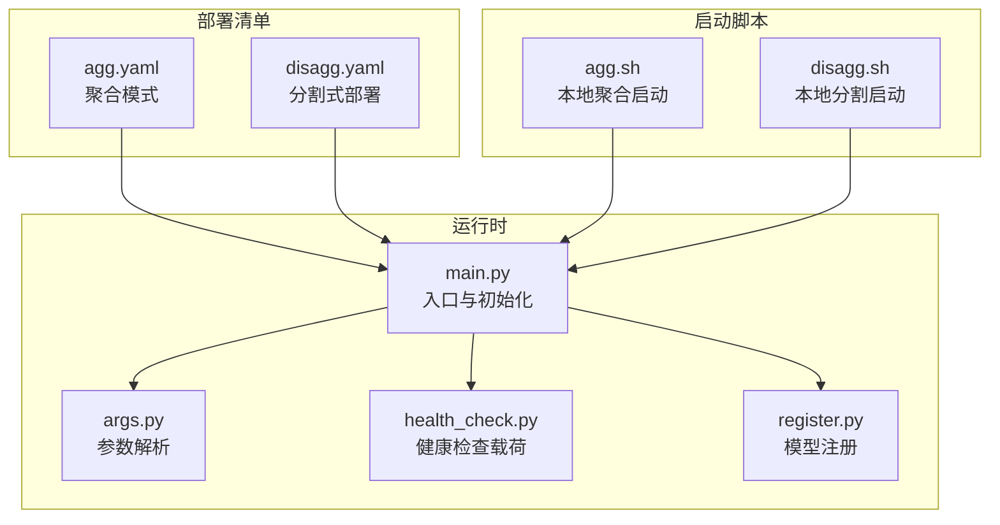
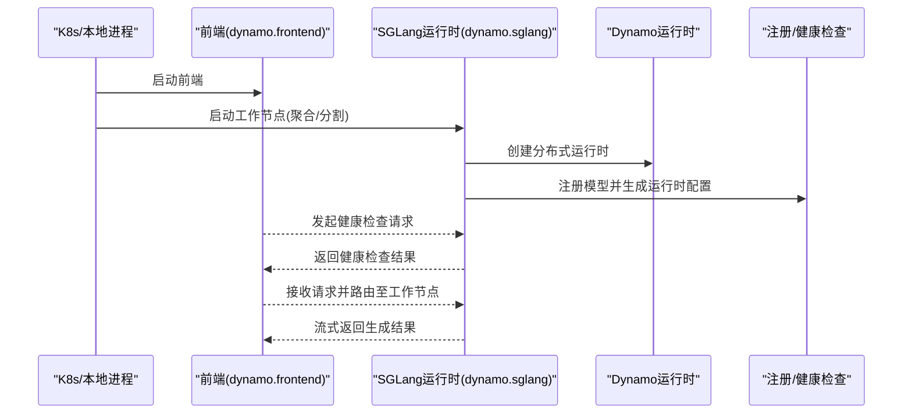
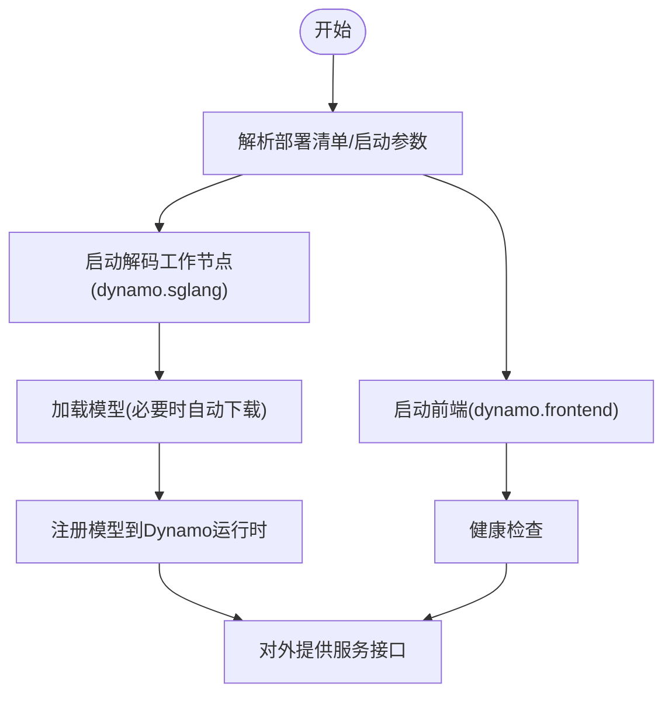
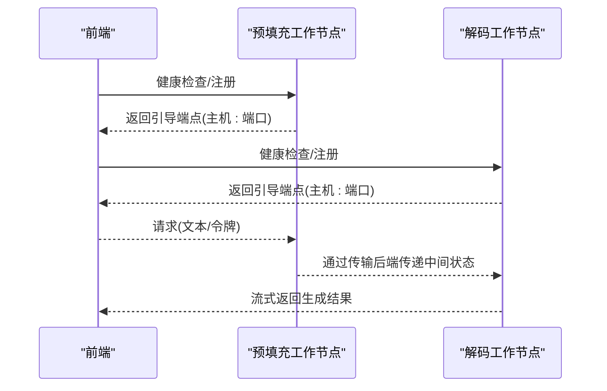
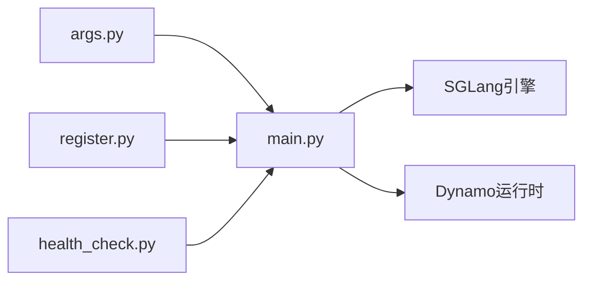

# SGLang基础部署

<cite>
**本文引用的文件**
- [examples/backends/sglang/deploy/agg.yaml](file://examples/backends/sglang/deploy/agg.yaml)
- [examples/backends/sglang/deploy/disagg.yaml](file://examples/backends/sglang/deploy/disagg.yaml)
- [examples/backends/sglang/launch/agg.sh](file://examples/backends/sglang/launch/agg.sh)
- [examples/backends/sglang/launch/disagg.sh](file://examples/backends/sglang/launch/disagg.sh)
- [components/src/dynamo/sglang/main.py](file://components/src/dynamo/sglang/main.py)
- [components/src/dynamo/sglang/args.py](file://components/src/dynamo/sglang/args.py)
- [components/src/dynamo/sglang/health_check.py](file://components/src/dynamo/sglang/health_check.py)
- [components/src/dynamo/sglang/register.py](file://components/src/dynamo/sglang/register.py)
</cite>

## 目录
1. [简介](#简介)
2. [项目结构](#项目结构)
3. [核心组件](#核心组件)
4. [架构总览](#架构总览)
5. [详细组件分析](#详细组件分析)
6. [依赖关系分析](#依赖关系分析)
7. [性能考虑](#性能考虑)
8. [故障排查指南](#故障排查指南)
9. [结论](#结论)
10. [附录](#附录)

## 简介
本文件面向SGLang在Dynamo平台上的基础部署，系统性讲解两种部署模式：聚合模式（Aggregated，简称agg）与分割式部署（Disaggregated，简称disagg）。内容覆盖YAML配置文件参数、模型加载与GPU资源分配、网络与传输后端配置、启动脚本与环境变量、健康检查与功能验证，以及常见问题排查方法。目标是帮助读者快速、正确地完成SGLang推理服务的本地或容器化部署。

## 项目结构
围绕SGLang部署的关键目录与文件如下：
- 部署清单（Kubernetes CRD）：用于定义前端与工作节点的编排
  - 聚合模式：examples/backends/sglang/deploy/agg.yaml
  - 分割式部署：examples/backends/sglang/deploy/disagg.yaml
- 启动脚本：本地多进程启动前端与工作节点
  - 聚合模式：examples/backends/sglang/launch/agg.sh
  - 分割式部署：examples/backends/sglang/launch/disagg.sh
- 运行时入口与参数解析：components/src/dynamo/sglang/main.py、components/src/dynamo/sglang/args.py
- 健康检查与注册：components/src/dynamo/sglang/health_check.py、components/src/dynamo/sglang/register.py

图表来源
- [examples/backends/sglang/deploy/agg.yaml](file://examples/backends/sglang/deploy/agg.yaml#L1-L43)
- [examples/backends/sglang/deploy/disagg.yaml](file://examples/backends/sglang/deploy/disagg.yaml#L1-L85)
- [examples/backends/sglang/launch/agg.sh](file://examples/backends/sglang/launch/agg.sh#L1-L75)
- [examples/backends/sglang/launch/disagg.sh](file://examples/backends/sglang/launch/disagg.sh#L1-L89)
- [components/src/dynamo/sglang/main.py](file://components/src/dynamo/sglang/main.py#L191-L234)
- [components/src/dynamo/sglang/args.py](file://components/src/dynamo/sglang/args.py#L308-L606)
- [components/src/dynamo/sglang/health_check.py](file://components/src/dynamo/sglang/health_check.py#L50-L147)
- [components/src/dynamo/sglang/register.py](file://components/src/dynamo/sglang/register.py#L18-L315)

章节来源
- [examples/backends/sglang/deploy/agg.yaml](file://examples/backends/sglang/deploy/agg.yaml#L1-L43)
- [examples/backends/sglang/deploy/disagg.yaml](file://examples/backends/sglang/deploy/disagg.yaml#L1-L85)
- [examples/backends/sglang/launch/agg.sh](file://examples/backends/sglang/launch/agg.sh#L1-L75)
- [examples/backends/sglang/launch/disagg.sh](file://examples/backends/sglang/launch/disagg.sh#L1-L89)
- [components/src/dynamo/sglang/main.py](file://components/src/dynamo/sglang/main.py#L191-L234)
- [components/src/dynamo/sglang/args.py](file://components/src/dynamo/sglang/args.py#L308-L606)
- [components/src/dynamo/sglang/health_check.py](file://components/src/dynamo/sglang/health_check.py#L50-L147)
- [components/src/dynamo/sglang/register.py](file://components/src/dynamo/sglang/register.py#L18-L315)

## 核心组件
- 参数解析器（args.py）
  - 支持Dynamo与SGLang双栈参数，自动合并配置文件与CLI参数；支持嵌套键抽取；自动下载模型；推断默认端点与服务模式。
- 运行时入口（main.py）
  - 初始化分布式运行时、信号处理、指标与KV事件发布；根据服务模式选择初始化流程（解码/预填充/扩散/嵌入/多模态等）；注册健康检查载荷。
- 模型注册（register.py）
  - 将模型注册到Dynamo运行时，生成运行时配置（如分页块数、最大批内token、数据并行规模、分割式引导端点等），并可选使用就绪门控制请求排队。
- 健康检查（health_check.py）
  - 提供解码、预填充、图像扩散三类健康检查载荷，确保服务可用性与最小化开销。

章节来源
- [components/src/dynamo/sglang/args.py](file://components/src/dynamo/sglang/args.py#L308-L606)
- [components/src/dynamo/sglang/main.py](file://components/src/dynamo/sglang/main.py#L191-L234)
- [components/src/dynamo/sglang/register.py](file://components/src/dynamo/sglang/register.py#L18-L315)
- [components/src/dynamo/sglang/health_check.py](file://components/src/dynamo/sglang/health_check.py#L50-L147)

## 架构总览
下图展示了从部署清单或启动脚本到运行时的总体交互：

图表来源
- [examples/backends/sglang/deploy/agg.yaml](file://examples/backends/sglang/deploy/agg.yaml#L9-L42)
- [examples/backends/sglang/deploy/disagg.yaml](file://examples/backends/sglang/deploy/disagg.yaml#L9-L85)
- [examples/backends/sglang/launch/agg.sh](file://examples/backends/sglang/launch/agg.sh#L58-L75)
- [examples/backends/sglang/launch/disagg.sh](file://examples/backends/sglang/launch/disagg.sh#L48-L89)
- [components/src/dynamo/sglang/main.py](file://components/src/dynamo/sglang/main.py#L235-L328)
- [components/src/dynamo/sglang/register.py](file://components/src/dynamo/sglang/register.py#L18-L67)
- [components/src/dynamo/sglang/health_check.py](file://components/src/dynamo/sglang/health_check.py#L50-L86)

## 详细组件分析

### 聚合模式（Aggregated，agg）配置
- 部署清单要点
  - 前端组件：单副本，使用指定镜像
  - 解码工作节点：单副本，限制GPU数量，设置工作目录、命令与参数
  - 关键参数：模型路径、服务模型名、分页大小、张量并行度、跳过分词器初始化、信任远程代码等
- 启动脚本要点
  - 启动前端进程与工作进程，开启系统指标端口，可选启用OpenTelemetry追踪
  - 默认模型名称与路径、分页大小、张量并行度等参数透传给工作节点

图表来源
- [examples/backends/sglang/deploy/agg.yaml](file://examples/backends/sglang/deploy/agg.yaml#L9-L42)
- [examples/backends/sglang/launch/agg.sh](file://examples/backends/sglang/launch/agg.sh#L58-L75)
- [components/src/dynamo/sglang/main.py](file://components/src/dynamo/sglang/main.py#L235-L328)
- [components/src/dynamo/sglang/register.py](file://components/src/dynamo/sglang/register.py#L18-L67)

章节来源
- [examples/backends/sglang/deploy/agg.yaml](file://examples/backends/sglang/deploy/agg.yaml#L1-L43)
- [examples/backends/sglang/launch/agg.sh](file://examples/backends/sglang/launch/agg.sh#L1-L75)
- [components/src/dynamo/sglang/main.py](file://components/src/dynamo/sglang/main.py#L235-L328)
- [components/src/dynamo/sglang/register.py](file://components/src/dynamo/sglang/register.py#L18-L67)

### 分割式部署（Disaggregated，disagg）配置
- 部署清单要点
  - 前端组件：单副本，使用指定镜像
  - 预填充工作节点：单副本，限制GPU数量，设置工作目录、命令与参数，启用分割式模式、传输后端与引导端口
  - 解码工作节点：单副本，限制GPU数量，设置工作目录、命令与参数，启用分割式模式、传输后端与引导端口
  - 两节点共享同一模型路径与服务模型名，通过引导端口建立连接
- 启动脚本要点
  - 启动前端进程
  - 启动预填充工作节点（设置引导端口、主机地址、端口等）
  - 启动解码工作节点（设置引导端口、主机地址、传输后端等）

图表来源
- [examples/backends/sglang/deploy/disagg.yaml](file://examples/backends/sglang/deploy/disagg.yaml#L9-L85)
- [examples/backends/sglang/launch/disagg.sh](file://examples/backends/sglang/launch/disagg.sh#L56-L89)
- [components/src/dynamo/sglang/register.py](file://components/src/dynamo/sglang/register.py#L146-L184)
- [components/src/dynamo/sglang/health_check.py](file://components/src/dynamo/sglang/health_check.py#L88-L121)

章节来源
- [examples/backends/sglang/deploy/disagg.yaml](file://examples/backends/sglang/deploy/disagg.yaml#L1-L85)
- [examples/backends/sglang/launch/disagg.sh](file://examples/backends/sglang/launch/disagg.sh#L1-L89)
- [components/src/dynamo/sglang/register.py](file://components/src/dynamo/sglang/register.py#L146-L184)
- [components/src/dynamo/sglang/health_check.py](file://components/src/dynamo/sglang/health_check.py#L88-L121)

### 参数与配置要点（YAML与CLI）
- 常用参数
  - 模型路径与服务模型名：用于定位与标识模型
  - 分页大小（page-size）：KV缓存分块大小
  - 张量并行度（tp）：控制并行规模
  - 传输后端（disaggregation-transfer-backend）：如nixl
  - 引导端口（disaggregation-bootstrap-port）：分割式节点发现与连接
  - 主机地址（host）：绑定监听地址
  - 端口（port）：仅预填充节点显式绑定
  - 跳过分词器初始化（skip-tokenizer-init）：减少初始化开销
  - 信任远程代码（trust-remote-code）：允许远程仓库代码
- 配置文件合并
  - 支持嵌套键抽取与临时文件写入，便于从复杂YAML中提取特定段落
  - 自动下载模型，避免重复路径管理

章节来源
- [examples/backends/sglang/deploy/agg.yaml](file://examples/backends/sglang/deploy/agg.yaml#L32-L42)
- [examples/backends/sglang/deploy/disagg.yaml](file://examples/backends/sglang/deploy/disagg.yaml#L32-L85)
- [components/src/dynamo/sglang/args.py](file://components/src/dynamo/sglang/args.py#L244-L306)
- [components/src/dynamo/sglang/args.py](file://components/src/dynamo/sglang/args.py#L308-L606)

### 模型加载与GPU资源分配
- 模型加载
  - 若模型路径不存在，会触发自动下载；SGLang引擎负责实际加载与并行初始化
- GPU资源分配
  - 在Kubernetes清单中通过resources.limits.gpu限制每副本使用的GPU数量
  - 启动脚本可通过CUDA_VISIBLE_DEVICES隔离设备
- 并行与拓扑
  - 通过tp与数据并行（dp）参数控制并行规模；注册阶段会记录dp_size以辅助路由跟踪

章节来源
- [components/src/dynamo/sglang/main.py](file://components/src/dynamo/sglang/main.py#L244-L247)
- [components/src/dynamo/sglang/register.py](file://components/src/dynamo/sglang/register.py#L169-L173)
- [examples/backends/sglang/launch/disagg.sh](file://examples/backends/sglang/launch/disagg.sh#L77-L88)

### 网络与传输后端
- 分割式引导端点
  - 预填充节点会向运行时发布引导主机与端口，供其他节点发现与连接
- 传输后端
  - 支持nixl等后端，用于跨节点传输中间状态
- 主机与端口
  - 工作节点需绑定host与port（预填充节点显式绑定），确保前端与路由器可达

章节来源
- [components/src/dynamo/sglang/register.py](file://components/src/dynamo/sglang/register.py#L176-L184)
- [examples/backends/sglang/deploy/disagg.yaml](file://examples/backends/sglang/deploy/disagg.yaml#L47-L51)
- [examples/backends/sglang/launch/disagg.sh](file://examples/backends/sglang/launch/disagg.sh#L67-L69)

### 启动脚本详解（环境变量、模型路径、端口绑定）
- 聚合模式
  - 启动前端与工作节点，开启系统指标端口（默认8081），可选启用OTLP追踪
  - 透传模型路径、服务模型名、分页大小、张量并行度等参数
- 分割式部署
  - 启动前端
  - 启动预填充节点：设置引导端口、主机、端口、传输后端、指标端口
  - 启动解码节点：设置引导端口、主机、传输后端、指标端口

章节来源
- [examples/backends/sglang/launch/agg.sh](file://examples/backends/sglang/launch/agg.sh#L58-L75)
- [examples/backends/sglang/launch/disagg.sh](file://examples/backends/sglang/launch/disagg.sh#L56-L89)

### 健康检查与功能验证
- 健康检查载荷
  - 解码：基于BOS token或文本输入，生成极短长度的输出
  - 预填充：封装请求与采样参数，进行最小化验证
  - 图像扩散：发送最小化生成请求，快速验证
- 验证步骤
  - 前端对工作节点发起健康检查
  - 成功后进行基本推理调用，确认流式输出与指标正常

章节来源
- [components/src/dynamo/sglang/health_check.py](file://components/src/dynamo/sglang/health_check.py#L50-L147)
- [components/src/dynamo/sglang/main.py](file://components/src/dynamo/sglang/main.py#L279-L304)

## 依赖关系分析
- 组件耦合
  - main.py依赖args.py进行参数解析与模型下载，依赖register.py进行模型注册与运行时配置，依赖health_check.py生成健康检查载荷
- 外部依赖
  - SGLang引擎负责模型加载与推理
  - Dynamo运行时负责端点、事件平面、KV事件与指标发布
  - Kubernetes/容器运行时负责资源与网络编排

图表来源
- [components/src/dynamo/sglang/args.py](file://components/src/dynamo/sglang/args.py#L308-L606)
- [components/src/dynamo/sglang/main.py](file://components/src/dynamo/sglang/main.py#L235-L328)
- [components/src/dynamo/sglang/register.py](file://components/src/dynamo/sglang/register.py#L18-L67)
- [components/src/dynamo/sglang/health_check.py](file://components/src/dynamo/sglang/health_check.py#L50-L86)

章节来源
- [components/src/dynamo/sglang/args.py](file://components/src/dynamo/sglang/args.py#L308-L606)
- [components/src/dynamo/sglang/main.py](file://components/src/dynamo/sglang/main.py#L235-L328)
- [components/src/dynamo/sglang/register.py](file://components/src/dynamo/sglang/register.py#L18-L67)
- [components/src/dynamo/sglang/health_check.py](file://components/src/dynamo/sglang/health_check.py#L50-L86)

## 性能考虑
- 分页大小与KV缓存
  - 更小的分页大小可提升内存利用率但增加分块管理开销；更大分页大小可降低分块切换成本
- 张量并行度
  - tp越大吞吐越高，但需确保显存充足与拓扑合理
- 传输后端
  - nixl等后端在分割式场景中承担中间状态传输，应确保网络带宽与延迟满足要求
- 指标与追踪
  - 开启系统指标端口与OTLP追踪有助于定位瓶颈，但会带来额外开销

## 故障排查指南
- 健康检查失败
  - 检查工作节点日志，确认模型已成功加载且未报错
  - 确认引导端口与主机配置一致，预填充节点已发布引导端点
- 分割式部署连接异常
  - 核对disaggregation-bootstrap-port是否一致
  - 核对host与端口绑定，确保前端与路由器可达
- 资源不足
  - 检查Kubernetes资源限制与CUDA_VISIBLE_DEVICES设置
  - 调整tp与分页大小以适配显存
- 模型下载失败
  - 确认模型路径可访问，或允许自动下载
  - 检查网络代理与HF缓存权限

章节来源
- [components/src/dynamo/sglang/health_check.py](file://components/src/dynamo/sglang/health_check.py#L50-L147)
- [components/src/dynamo/sglang/register.py](file://components/src/dynamo/sglang/register.py#L176-L184)
- [examples/backends/sglang/launch/disagg.sh](file://examples/backends/sglang/launch/disagg.sh#L67-L69)

## 结论
通过本文档，您可以在Kubernetes或本地环境中完成SGLang在Dynamo平台上的聚合与分割式部署。建议优先使用提供的部署清单与启动脚本作为模板，结合参数解析器与运行时注册机制，确保模型加载、资源分配与网络配置正确无误。配合健康检查与指标监控，可快速验证服务可用性并定位问题。

## 附录
- 快速对照表
  - 聚合模式：前端+单一解码工作节点，适合小模型或低并发场景
  - 分割式部署：前端+预填充+解码工作节点，适合大模型与高并发场景
  - 关键参数：模型路径、分页大小、tp、传输后端、引导端口、host与port
- 参考文件
  - 聚合模式部署清单与启动脚本
  - 分割式部署部署清单与启动脚本
  - 运行时入口、参数解析、注册与健康检查模块