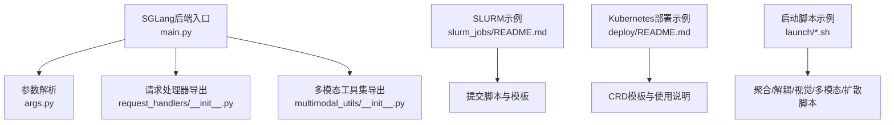
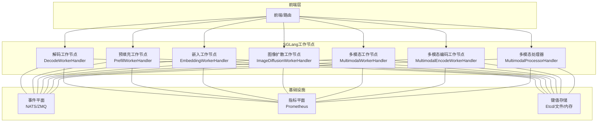
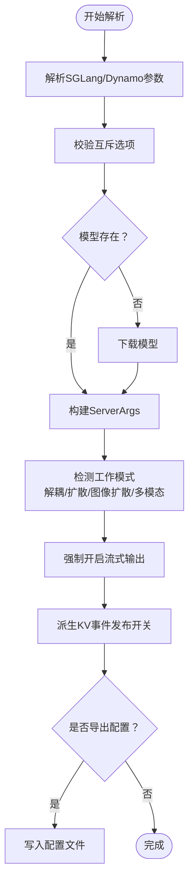
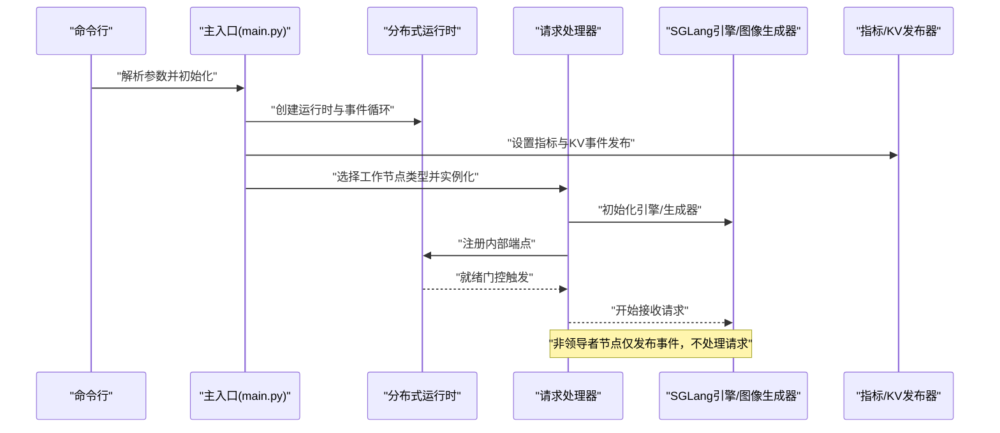
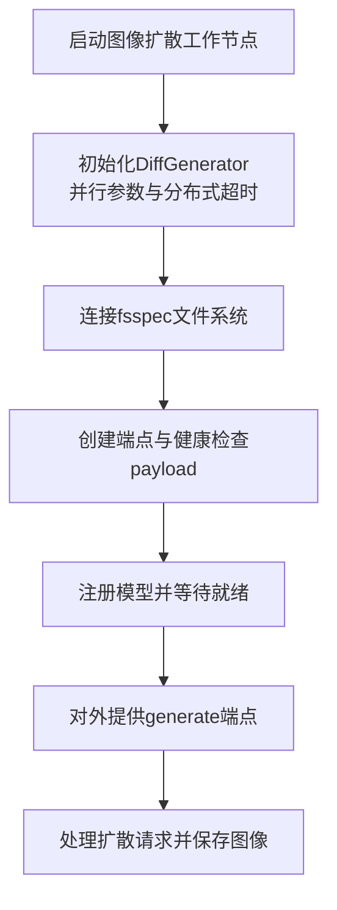
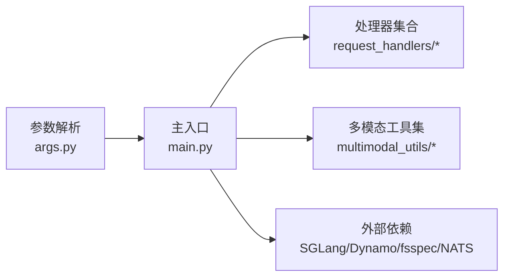

# SGLang集成示例

<cite>
**本文引用的文件**
- [components/src/dynamo/sglang/main.py](file://components/src/dynamo/sglang/main.py)
- [components/src/dynamo/sglang/args.py](file://components/src/dynamo/sglang/args.py)
- [components/src/dynamo/sglang/request_handlers/__init__.py](file://components/src/dynamo/sglang/request_handlers/__init__.py)
- [components/src/dynamo/sglang/multimodal_utils/__init__.py](file://components/src/dynamo/sglang/multimodal_utils/__init__.py)
- [examples/backends/sglang/slurm_jobs/README.md](file://examples/backends/sglang/slurm_jobs/README.md)
- [examples/backends/sglang/deploy/README.md](file://examples/backends/sglang/deploy/README.md)
- [examples/backends/sglang/launch/agg.sh](file://examples/backends/sglang/launch/agg.sh)
- [examples/backends/sglang/launch/disagg.sh](file://examples/backends/sglang/launch/disagg.sh)
- [examples/backends/sglang/launch/agg_vision.sh](file://examples/backends/sglang/launch/agg_vision.sh)
- [examples/backends/sglang/launch/multimodal_disagg.sh](file://examples/backends/sglang/launch/multimodal_disagg.sh)
- [examples/backends/sglang/launch/diffusion_llada.sh](file://examples/backends/sglang/launch/diffusion_llada.sh)
</cite>

## 目录
1. [简介](#简介)
2. [项目结构](#项目结构)
3. [核心组件](#核心组件)
4. [架构总览](#架构总览)
5. [详细组件分析](#详细组件分析)
6. [依赖关系分析](#依赖关系分析)
7. [性能考虑](#性能考虑)
8. [故障排查指南](#故障排查指南)
9. [结论](#结论)
10. [附录](#附录)

## 简介
本文件面向希望在Dynamo平台上集成SGLang后端的工程师与运维人员，提供从配置、部署到性能调优的完整示例文档。重点覆盖以下方面：
- SGLang引擎的配置与启动参数解析
- 图像扩散（Diffusion LM）与多模态处理能力
- 多节点SLURM作业调度集成与资源分配策略
- 分布式训练与推理的协调机制
- 批处理优化、内存管理与GPU利用率提升
- 启动脚本说明（模型下载、预热、监控）
- 图像扩散处理的完整流程（输入预处理到结果后处理）

## 项目结构
围绕SGLang后端的核心代码位于components/src/dynamo/sglang目录，包含主入口、参数解析、请求处理器与多模态工具集；部署与示例位于examples/backends/sglang。

**图表来源**
- [components/src/dynamo/sglang/main.py](file://components/src/dynamo/sglang/main.py#L1-L888)
- [components/src/dynamo/sglang/args.py](file://components/src/dynamo/sglang/args.py#L1-L635)
- [components/src/dynamo/sglang/request_handlers/__init__.py](file://components/src/dynamo/sglang/request_handlers/__init__.py#L1-L42)
- [components/src/dynamo/sglang/multimodal_utils/__init__.py](file://components/src/dynamo/sglang/multimodal_utils/__init__.py#L1-L19)
- [examples/backends/sglang/slurm_jobs/README.md](file://examples/backends/sglang/slurm_jobs/README.md#L1-L113)
- [examples/backends/sglang/deploy/README.md](file://examples/backends/sglang/deploy/README.md#L1-L163)

**章节来源**
- [components/src/dynamo/sglang/main.py](file://components/src/dynamo/sglang/main.py#L1-L888)
- [components/src/dynamo/sglang/args.py](file://components/src/dynamo/sglang/args.py#L1-L635)

## 核心组件
- 主入口与生命周期管理：负责信号处理、多节点非领导者节点处理、指标与KV事件发布、端点注册与就绪门控等。
- 参数解析器：统一解析SGLang与Dynamo的命令行参数，自动推断默认端点、校验互斥选项、下载模型、设置流输出模式等。
- 请求处理器：按角色划分（解码、预填充、扩散、嵌入、图像扩散、多模态编码/处理/工作节点），分别注册内部或外部服务端点。
- 多模态工具集：提供图像加载、编码、多模态请求转换与流式响应处理等实用函数。

**章节来源**
- [components/src/dynamo/sglang/main.py](file://components/src/dynamo/sglang/main.py#L191-L800)
- [components/src/dynamo/sglang/args.py](file://components/src/dynamo/sglang/args.py#L308-L605)
- [components/src/dynamo/sglang/request_handlers/__init__.py](file://components/src/dynamo/sglang/request_handlers/__init__.py#L1-L42)
- [components/src/dynamo/sglang/multimodal_utils/__init__.py](file://components/src/dynamo/sglang/multimodal_utils/__init__.py#L1-L19)

## 架构总览
下图展示了SGLang后端在Dynamo平台中的典型部署形态，涵盖前端、解码/预填充工作节点、图像扩散与多模态组件，以及指标与事件平面。

**图表来源**
- [components/src/dynamo/sglang/main.py](file://components/src/dynamo/sglang/main.py#L235-L800)
- [components/src/dynamo/sglang/args.py](file://components/src/dynamo/sglang/args.py#L33-L148)

## 详细组件分析

### 配置与参数解析（args.py）
- 功能要点
  - 统一解析SGLang与Dynamo参数，自动推断默认端点（根据工作节点类型与解耦模式）。
  - 校验互斥选项（如自定义Jinja模板与SGLang内置分词器不能同时使用）。
  - 下载模型（若路径不存在），并保留原始模型路径以供下游进程使用。
  - 强制开启流式输出（stream_output=True）以优化流式性能。
  - 自动派生是否启用KV事件发布（基于kv_events_config）。
  - 支持从嵌套YAML中提取子配置段并合并到CLI参数。
- 关键特性
  - 支持Diffusion LM模式（dllm_algorithm）与图像扩散（image_diffusion_worker）专用参数。
  - 支持多模态处理器、编码器与工作节点的组合部署。
  - 提供调试配置导出（--dump-config-to）。

**图表来源**
- [components/src/dynamo/sglang/args.py](file://components/src/dynamo/sglang/args.py#L308-L605)

**章节来源**
- [components/src/dynamo/sglang/args.py](file://components/src/dynamo/sglang/args.py#L308-L605)

### 主入口与生命周期（main.py）
- 功能要点
  - 安装优雅关闭信号处理器，支持回调链式执行。
  - 处理多节点场景：非领导者节点仅运行调度器与KV事件发布，不直接处理请求。
  - 初始化不同工作节点（解码、预填充、扩散、嵌入、图像扩散、多模态处理器/编码/工作）。
  - 设置指标与KV事件发布器，记录模型加载时间。
  - 通过就绪门控（readiness gate）确保注册完成后再接受请求。
- 关键流程
  - 解码/预填充/扩散/嵌入：注册端点、启动服务、并发注册模型。
  - 图像扩散：使用DiffGenerator而非Engine，连接文件系统存储与健康检查。
  - 多模态：处理器/编码器/工作节点之间建立客户端连接，内部端点不向前端注册。

**图表来源**
- [components/src/dynamo/sglang/main.py](file://components/src/dynamo/sglang/main.py#L191-L800)

**章节来源**
- [components/src/dynamo/sglang/main.py](file://components/src/dynamo/sglang/main.py#L191-L800)

### 请求处理器与多模态工具
- 请求处理器导出
  - 基础处理器：BaseGenerativeHandler、BaseWorkerHandler
  - LLM相关：DecodeWorkerHandler、PrefillWorkerHandler、DiffusionWorkerHandler
  - 嵌入：EmbeddingWorkerHandler
  - 图像扩散：ImageDiffusionWorkerHandler
  - 多模态：MultimodalEncodeWorkerHandler、MultimodalPrefillWorkerHandler、MultimodalProcessorHandler、MultimodalWorkerHandler
- 多模态工具集
  - 多模态请求转换与流式响应处理
  - 图像编码与嵌入
  - 图像加载器

```mermaid
classDiagram
class BaseWorkerHandler
class BaseGenerativeHandler
class DecodeWorkerHandler
class PrefillWorkerHandler
class DiffusionWorkerHandler
class EmbeddingWorkerHandler
class ImageDiffusionWorkerHandler
class MultimodalEncodeWorkerHandler
class MultimodalPrefillWorkerHandler
class MultimodalProcessorHandler
class MultimodalWorkerHandler
BaseWorkerHandler <|-- DecodeWorkerHandler
BaseWorkerHandler <|-- PrefillWorkerHandler
BaseWorkerHandler <|-- DiffusionWorkerHandler
BaseWorkerHandler <|-- EmbeddingWorkerHandler
BaseWorkerHandler <|-- ImageDiffusionWorkerHandler
BaseWorkerHandler <|-- MultimodalEncodeWorkerHandler
BaseWorkerHandler <|-- MultimodalPrefillWorkerHandler
BaseWorkerHandler <|-- MultimodalProcessorHandler
BaseWorkerHandler <|-- MultimodalWorkerHandler
BaseGenerativeHandler <|-- DecodeWorkerHandler
BaseGenerativeHandler <|-- PrefillWorkerHandler
BaseGenerativeHandler <|-- DiffusionWorkerHandler
BaseGenerativeHandler <|-- MultimodalWorkerHandler
```

**图表来源**
- [components/src/dynamo/sglang/request_handlers/__init__.py](file://components/src/dynamo/sglang/request_handlers/__init__.py#L1-L42)

**章节来源**
- [components/src/dynamo/sglang/request_handlers/__init__.py](file://components/src/dynamo/sglang/request_handlers/__init__.py#L1-L42)
- [components/src/dynamo/sglang/multimodal_utils/__init__.py](file://components/src/dynamo/sglang/multimodal_utils/__init__.py#L1-L19)

### 图像扩散处理流程
- 入口与初始化
  - 使用DiffGenerator.from_pretrained进行初始化，支持张量并行与数据并行配置。
  - 连接fsspec文件系统用于图像存储，支持S3/GCS/本地等多种后端。
- 健康检查与就绪门控
  - 发送最小化扩散请求进行健康检查。
  - 注册模型并等待就绪后对外提供服务。
- 端点与发布
  - 作为内部组件提供generate端点，不向前端注册。
  - 不使用LLM指标标签，但可扩展图像/步数相关指标。

**图表来源**
- [components/src/dynamo/sglang/main.py](file://components/src/dynamo/sglang/main.py#L562-L644)

**章节来源**
- [components/src/dynamo/sglang/main.py](file://components/src/dynamo/sglang/main.py#L562-L644)

### 多模态处理与工具调用
- 多模态处理器/编码器/工作节点
  - 处理器：接收文本/多模态请求，调用编码器获取编码特征。
  - 编码器：对图像/视频进行编码，输出特征供后续LLM使用。
  - 工作节点：执行LLM推理，支持解耦模式下的预填充与解码分离。
- 工具调用与推理解析
  - 通过Dynamo参数指定工具调用解析器与推理解析器名称，实现结构化解析与工具调用。

**章节来源**
- [components/src/dynamo/sglang/main.py](file://components/src/dynamo/sglang/main.py#L646-L800)
- [components/src/dynamo/sglang/args.py](file://components/src/dynamo/sglang/args.py#L39-L70)

## 依赖关系分析
- 组件内聚与耦合
  - main.py集中控制生命周期与节点类型分支，耦合度适中；通过处理器模块化降低耦合。
  - args.py承担参数解析与环境推断职责，为其他模块提供稳定输入。
  - 多模态工具集与处理器解耦，便于独立演进。
- 外部依赖
  - SGLang引擎与DiffGenerator
  - Dynamo运行时与事件/指标平面
  - fsspec文件系统（图像存储）
  - NATS/ZMQ事件发布（JetStream可选）

**图表来源**
- [components/src/dynamo/sglang/args.py](file://components/src/dynamo/sglang/args.py#L1-L635)
- [components/src/dynamo/sglang/main.py](file://components/src/dynamo/sglang/main.py#L1-L888)

**章节来源**
- [components/src/dynamo/sglang/args.py](file://components/src/dynamo/sglang/args.py#L1-L635)
- [components/src/dynamo/sglang/main.py](file://components/src/dynamo/sglang/main.py#L1-L888)

## 性能考虑
- 流式输出优化
  - 强制开启流式输出（stream_output=True），减少累积令牌开销，提升流式吞吐。
- 模型加载与预热
  - 预填充工作节点在领导者节点进行“dummy”预热，避免首次TTFT尖峰。
- 并行与分布式
  - 张量并行与数据并行参数（tp_size/dp_size）直接影响吞吐与显存占用。
  - 非领导者节点仅发布事件，不参与请求处理，降低跨节点同步成本。
- 指标与可观测性
  - 通过指标发布器记录模型加载时间与运行时指标，结合Prometheus/Grafana进行性能分析。
- 内存管理
  - 可结合GPU内存服务（GMS）在特定加载格式下进行内存优化（当使用相应标志时）。

**章节来源**
- [components/src/dynamo/sglang/args.py](file://components/src/dynamo/sglang/args.py#L548-L559)
- [components/src/dynamo/sglang/main.py](file://components/src/dynamo/sglang/main.py#L359-L361)
- [components/src/dynamo/sglang/main.py](file://components/src/dynamo/sglang/main.py#L257-L263)

## 故障排查指南
- 常见问题
  - 端点未注册或健康检查失败：检查就绪门控是否被触发，确认模型已成功注册。
  - 图像扩散无法保存：检查fs_url与文件系统权限，确认base_url重写配置正确。
  - 多模态链路不通：确认编码器/处理器/工作节点之间的客户端连接已等待实例可用。
  - 多节点非领导者节点无请求：确认非领导者节点仅发布事件，不处理请求。
- 排查步骤
  - 查看日志：关注模型加载时间、端点注册与健康检查payload。
  - 检查环境变量与容器挂载：确保模型路径、HuggingFace密钥、文件系统URL正确。
  - 调整并行参数：根据GPU数量调整tp_size/dp_size，避免OOM。

**章节来源**
- [components/src/dynamo/sglang/main.py](file://components/src/dynamo/sglang/main.py#L562-L644)
- [components/src/dynamo/sglang/main.py](file://components/src/dynamo/sglang/main.py#L646-L800)

## 结论
通过上述组件与流程，SGLang后端在Dynamo平台上实现了高性能、可扩展的推理服务，尤其在图像扩散与多模态处理方面具备明确优势。配合SLURM与Kubernetes部署示例，用户可在单机、多节点与云环境中快速落地。建议在生产环境中结合流式输出、预热与并行参数调优，持续监控指标以保障稳定性与性能。

## 附录

### SLURM作业调度集成示例
- 模板与脚本
  - 使用Pyxis插件的sbatch模板与Python提交脚本，自动生成并提交作业。
  - 支持预填充与解码节点分离、多前端负载均衡、性能剖析与输出收集。
- 资源分配策略
  - 通过--prefill-nodes/--decode-nodes与--prefill-workers/--decode-workers控制节点与进程比例。
  - 指定网络接口与GPU类型，确保节点间互联满足性能要求。
- 日志与输出
  - 每个作业生成唯一日志目录，便于实时跟踪与归档。

**章节来源**
- [examples/backends/sglang/slurm_jobs/README.md](file://examples/backends/sglang/slurm_jobs/README.md#L1-L113)

### Kubernetes部署示例
- 部署模式
  - 聚合部署：前端+单一解码工作节点，适合开发测试。
  - 解耦部署：前端+预填充/解码工作节点，适合高吞吐场景。
- CRD与资源配置
  - 使用DynamoGraphDeployment CRD描述服务拓扑与资源限制。
  - 支持自定义框架镜像、HuggingFace密钥与模型参数。
- 健康检查与监控
  - 前端健康端点与存活探针，结合指标平面进行观测。

**章节来源**
- [examples/backends/sglang/deploy/README.md](file://examples/backends/sglang/deploy/README.md#L1-L163)

### 启动脚本说明（示例）
- 聚合模式
  - 脚本示例：聚合解码、嵌入、视觉与多模态解耦等。
- 多模态与扩散
  - 提供多模态解耦、端到端视觉与扩散脚本，便于快速验证。
- 使用建议
  - 在脚本中设置模型路径、并行参数与端口映射，结合就绪门控与健康检查。

**章节来源**
- [examples/backends/sglang/launch/agg.sh](file://examples/backends/sglang/launch/agg.sh)
- [examples/backends/sglang/launch/disagg.sh](file://examples/backends/sglang/launch/disagg.sh)
- [examples/backends/sglang/launch/agg_vision.sh](file://examples/backends/sglang/launch/agg_vision.sh)
- [examples/backends/sglang/launch/multimodal_disagg.sh](file://examples/backends/sglang/launch/multimodal_disagg.sh)
- [examples/backends/sglang/launch/diffusion_llada.sh](file://examples/backends/sglang/launch/diffusion_llada.sh)