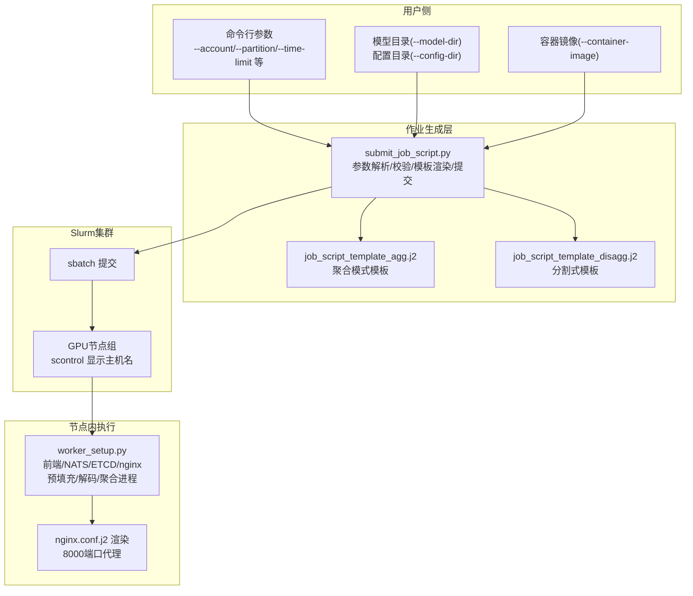
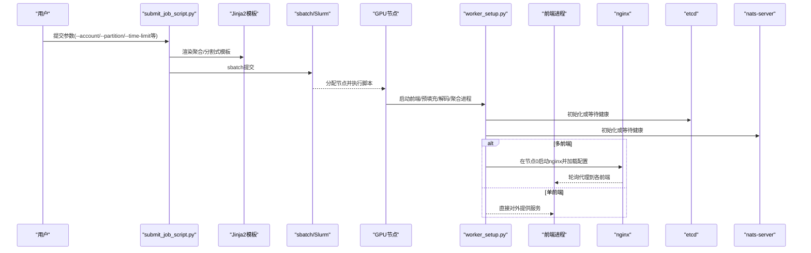
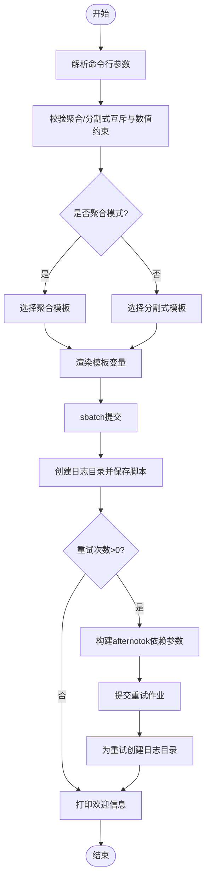
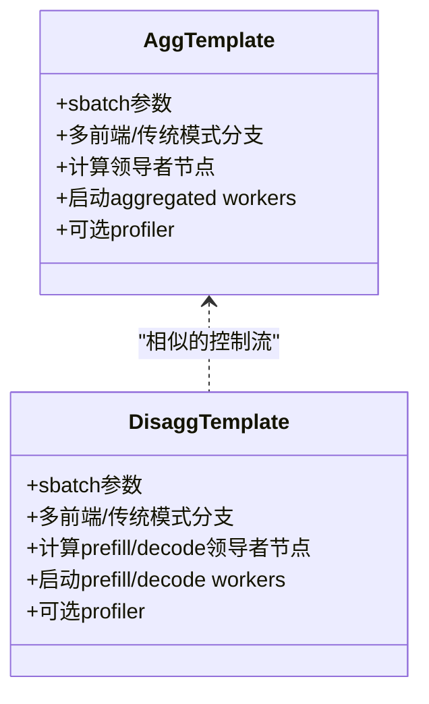
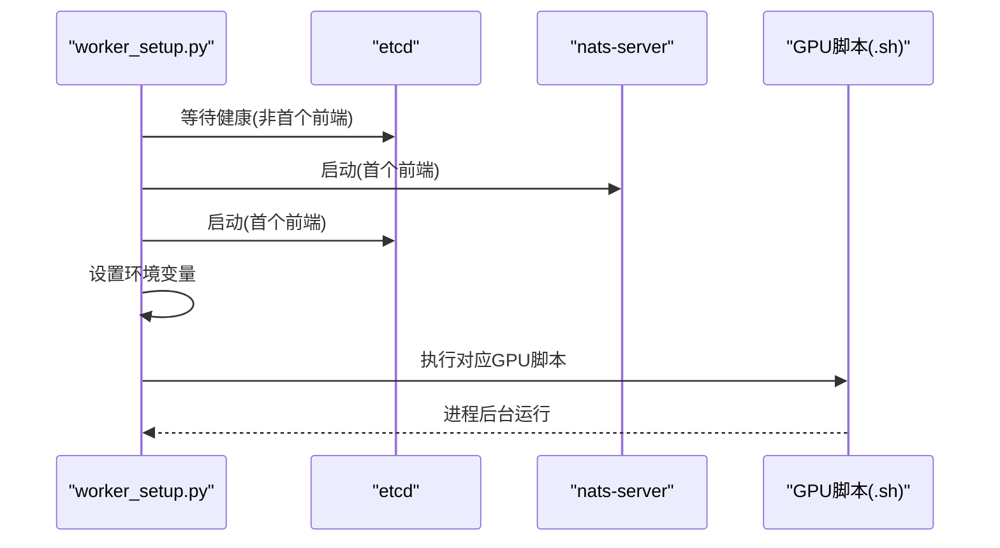
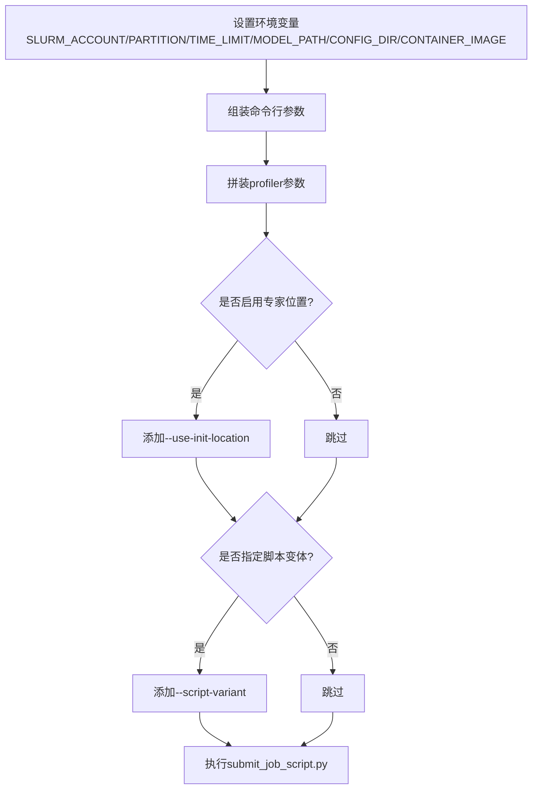
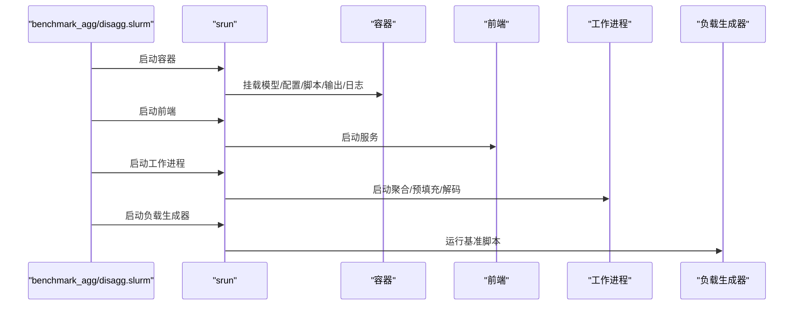
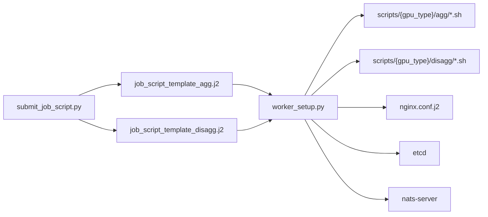

# Slurm作业调度集成

<cite>
**本文档引用的文件**
- [examples/backends/sglang/slurm_jobs/submit_job_script.py](file://examples/backends/sglang/slurm_jobs/submit_job_script.py)
- [examples/backends/sglang/slurm_jobs/job_script_template_agg.j2](file://examples/backends/sglang/slurm_jobs/job_script_template_agg.j2)
- [examples/backends/sglang/slurm_jobs/job_script_template_disagg.j2](file://examples/backends/sglang/slurm_jobs/job_script_template_disagg.j2)
- [examples/backends/sglang/slurm_jobs/README.md](file://examples/backends/sglang/slurm_jobs/README.md)
- [examples/backends/sglang/slurm_jobs/scripts/worker_setup.py](file://examples/backends/sglang/slurm_jobs/scripts/worker_setup.py)
- [examples/backends/sglang/slurm_jobs/scripts/nginx.conf.j2](file://examples/backends/sglang/slurm_jobs/scripts/nginx.conf.j2)
- [examples/backends/sglang/slurm_jobs/submit_disagg.sh](file://examples/backends/sglang/slurm_jobs/submit_disagg.sh)
- [examples/backends/trtllm/performance_sweeps/benchmark_agg.slurm](file://examples/backends/trtllm/performance_sweeps/benchmark_agg.slurm)
- [examples/backends/trtllm/performance_sweeps/benchmark_disagg.slurm](file://examples/backends/trtllm/performance_sweeps/benchmark_disagg.slurm)
- [examples/backends/trtllm/performance_sweeps/scripts/gen_yaml.py](file://examples/backends/trtllm/performance_sweeps/scripts/gen_yaml.py)
</cite>

## 目录
1. [简介](#简介)
2. [项目结构](#项目结构)
3. [核心组件](#核心组件)
4. [架构总览](#架构总览)
5. [详细组件分析](#详细组件分析)
6. [依赖关系分析](#依赖关系分析)
7. [性能考虑](#性能考虑)
8. [故障排查指南](#故障排查指南)
9. [结论](#结论)
10. [附录](#附录)

## 简介
本文件面向在Slurm集群中部署SGLang服务的工程师，提供从脚本准备、资源分配、任务调度到性能基准自动化的完整配置指南。内容覆盖：
- Slurm作业脚本模板与参数配置
- 聚合与分割式部署的节点分配与进程管理
- 作业提交流程（从脚本生成到任务执行）
- 性能基准自动化（负载生成与结果收集）
- 集群特殊配置与常见问题排查

## 项目结构
该集成主要由以下模块组成：
- 作业生成与提交：Python脚本负责解析命令行参数、渲染Jinja2模板、提交作业并管理重试
- 作业脚本模板：聚合与分割式两种模板，定义sbatch参数、容器挂载、网络接口、前端与后端进程启动
- 工作节点设置：worker_setup.py统一处理前端、预填充/解码/聚合工作进程的启动、健康检查与GPU监控
- 负载与配置：nginx.conf.j2用于多前端负载均衡；submit_disagg.sh提供一键化参数化提交
- 基准脚本：TRTLLM示例中的聚合/分割式基准脚本展示了如何在Slurm中运行容器、启动服务与负载生成器

**图表来源**
- [examples/backends/sglang/slurm_jobs/submit_job_script.py](file://examples/backends/sglang/slurm_jobs/submit_job_script.py#L134-L246)
- [examples/backends/sglang/slurm_jobs/job_script_template_agg.j2](file://examples/backends/sglang/slurm_jobs/job_script_template_agg.j2#L1-L120)
- [examples/backends/sglang/slurm_jobs/job_script_template_disagg.j2](file://examples/backends/sglang/slurm_jobs/job_script_template_disagg.j2#L1-L120)
- [examples/backends/sglang/slurm_jobs/scripts/worker_setup.py](file://examples/backends/sglang/slurm_jobs/scripts/worker_setup.py#L121-L219)
- [examples/backends/sglang/slurm_jobs/scripts/nginx.conf.j2](file://examples/backends/sglang/slurm_jobs/scripts/nginx.conf.j2#L1-L51)

**章节来源**
- [examples/backends/sglang/slurm_jobs/README.md](file://examples/backends/sglang/slurm_jobs/README.md#L1-L113)

## 核心组件
- 作业生成与提交器
  - 功能：解析参数、动态发现GPU类型、校验互斥参数、渲染模板、提交作业、重试机制、日志目录组织
  - 关键点：支持聚合与分割式互斥、多前端架构、CI模式、配置转储、profiler自动触发
- 作业脚本模板
  - 功能：定义sbatch参数、容器挂载、网络接口、前端与后端进程启动序列、GPU利用率监控、profiler调用
  - 关键点：聚合模板与分割式模板分别处理不同拓扑；多前端时在节点0启动nginx，在节点1启动NATS/ETCD
- 工作节点设置脚本
  - 功能：根据worker类型启动相应进程，等待etcd健康，设置环境变量，运行GPU脚本
  - 关键点：支持prefill/decode/aggregated/nginx/frontend；多前端模式下基础设施仅在首个前端节点初始化
- 负载与配置
  - 功能：nginx.conf.j2生成多前端代理配置；submit_disagg.sh提供一键化参数化提交
  - 关键点：多前端轮询代理后端前端；脚本变体选择与专家位置初始化开关

**章节来源**
- [examples/backends/sglang/slurm_jobs/submit_job_script.py](file://examples/backends/sglang/slurm_jobs/submit_job_script.py#L249-L329)
- [examples/backends/sglang/slurm_jobs/job_script_template_agg.j2](file://examples/backends/sglang/slurm_jobs/job_script_template_agg.j2#L120-L299)
- [examples/backends/sglang/slurm_jobs/job_script_template_disagg.j2](file://examples/backends/sglang/slurm_jobs/job_script_template_disagg.j2#L120-L342)
- [examples/backends/sglang/slurm_jobs/scripts/worker_setup.py](file://examples/backends/sglang/slurm_jobs/scripts/worker_setup.py#L310-L502)
- [examples/backends/sglang/slurm_jobs/scripts/nginx.conf.j2](file://examples/backends/sglang/slurm_jobs/scripts/nginx.conf.j2#L1-L51)
- [examples/backends/sglang/slurm_jobs/submit_disagg.sh](file://examples/backends/sglang/slurm_jobs/submit_disagg.sh#L51-L105)

## 架构总览
下图展示了从用户提交到节点进程启动的整体流程，以及多前端负载均衡路径。

**图表来源**
- [examples/backends/sglang/slurm_jobs/submit_job_script.py](file://examples/backends/sglang/slurm_jobs/submit_job_script.py#L440-L497)
- [examples/backends/sglang/slurm_jobs/job_script_template_agg.j2](file://examples/backends/sglang/slurm_jobs/job_script_template_agg.j2#L180-L272)
- [examples/backends/sglang/slurm_jobs/job_script_template_disagg.j2](file://examples/backends/sglang/slurm_jobs/job_script_template_disagg.j2#L200-L316)
- [examples/backends/sglang/slurm_jobs/scripts/worker_setup.py](file://examples/backends/sglang/slurm_jobs/scripts/worker_setup.py#L348-L377)

## 详细组件分析

### 组件A：作业生成与提交器（submit_job_script.py）
- 参数解析与校验
  - 支持聚合与分割式互斥参数，自动校验节点数与工作进程数的整除关系
  - 自动发现可用GPU类型，按目录结构扫描scripts/{gpu_type}/{agg,disagg}/*.sh
  - 支持额外Slurm参数、重试次数、profiler配置、CI模式、配置转储开关
- 模板渲染与提交
  - 根据模式选择聚合或分割式模板，传入变量如job_name、nodes、workers、gpus_per_node、network_interface、gpu_type、script_variant、partition、多前端开关、use_init_location、profiler类型与参数、时间戳、配置转储路径、CI标志
  - 使用临时文件保存渲染后的脚本，提交后立即创建日志目录并保存脚本副本
  - 支持基于“afternotok”依赖链的重试提交，并为每次重试创建独立日志目录
- 日志与欢迎信息
  - 输出作业ID、日志目录路径、tail命令示例、srun命令提示

**图表来源**
- [examples/backends/sglang/slurm_jobs/submit_job_script.py](file://examples/backends/sglang/slurm_jobs/submit_job_script.py#L134-L246)
- [examples/backends/sglang/slurm_jobs/submit_job_script.py](file://examples/backends/sglang/slurm_jobs/submit_job_script.py#L331-L337)
- [examples/backends/sglang/slurm_jobs/submit_job_script.py](file://examples/backends/sglang/slurm_jobs/submit_job_script.py#L440-L497)

**章节来源**
- [examples/backends/sglang/slurm_jobs/submit_job_script.py](file://examples/backends/sglang/slurm_jobs/submit_job_script.py#L111-L132)
- [examples/backends/sglang/slurm_jobs/submit_job_script.py](file://examples/backends/sglang/slurm_jobs/submit_job_script.py#L249-L329)
- [examples/backends/sglang/slurm_jobs/submit_job_script.py](file://examples/backends/sglang/slurm_jobs/submit_job_script.py#L440-L497)

### 组件B：作业脚本模板（聚合/分割式）
- 聚合模板（job_script_template_agg.j2）
  - 定义sbatch参数（job-name、nodes、ntasks、account、time、partition），输出到logs/%j_{workers}A_{timestamp}
  - 多前端模式：节点0启动nginx，节点1启动NATS/ETCD与第一个前端；可选额外前端均匀分布在聚合节点上
  - 传统模式：首个聚合节点同时承载前端与基础设施
  - 计算每个聚合工作进程的领导者节点，按nodes_per_worker分发节点，逐节点启动aggregated worker
  - 可选profiler：在首节点调用scripts/{profiler_type}/bench.sh
- 分割式模板（job_script_template_disagg.j2）
  - 类似逻辑，但分为prefill与decode两类领导者节点集合，分别启动prefill/decode workers
  - 多前端模式：节点0仅nginx+prefill分片，节点1为NATS/ETCD+首个前端+prefill分片，其余节点承载prefill/decode分片与可选额外前端
  - 可选profiler：在首节点调用scripts/{profiler_type}/bench.sh，传入workers与GPU数量

**图表来源**
- [examples/backends/sglang/slurm_jobs/job_script_template_agg.j2](file://examples/backends/sglang/slurm_jobs/job_script_template_agg.j2#L1-L120)
- [examples/backends/sglang/slurm_jobs/job_script_template_disagg.j2](file://examples/backends/sglang/slurm_jobs/job_script_template_disagg.j2#L1-L120)

**章节来源**
- [examples/backends/sglang/slurm_jobs/job_script_template_agg.j2](file://examples/backends/sglang/slurm_jobs/job_script_template_agg.j2#L1-L120)
- [examples/backends/sglang/slurm_jobs/job_script_template_disagg.j2](file://examples/backends/sglang/slurm_jobs/job_script_template_disagg.j2#L1-L120)

### 组件C：工作节点设置（worker_setup.py）
- 角色与职责
  - 根据worker类型启动nginx、frontend、prefill、decode、aggregated进程
  - 等待etcd健康，必要时在首个前端节点启动NATS/ETCD
  - 设置环境变量（NATS_SERVER、ETCD_ENDPOINTS、HOST_IP、PORT、TOTAL_GPUS、RANK、TOTAL_NODES、USE_INIT_LOCATIONS、RUN_IN_CI、DUMP_CONFIG_PATH）
  - 通过GPU脚本变体（scripts/{gpu_type}/{agg,disagg}/{script_variant}.sh）执行具体启动命令
- 多前端与CI模式
  - 多前端：仅在首个前端节点启动基础设施；其他前端等待etcd
  - CI模式：使用/configs/中的二进制与whl包，便于离线环境
- GPU脚本选择
  - 聚合：scripts/{gpu_type}/agg/{script_variant}.sh
  - 分割式：scripts/{gpu_type}/disagg/{script_variant}.sh {prefill|decode}

**图表来源**
- [examples/backends/sglang/slurm_jobs/scripts/worker_setup.py](file://examples/backends/sglang/slurm_jobs/scripts/worker_setup.py#L310-L377)
- [examples/backends/sglang/slurm_jobs/scripts/worker_setup.py](file://examples/backends/sglang/slurm_jobs/scripts/worker_setup.py#L406-L457)
- [examples/backends/sglang/slurm_jobs/scripts/worker_setup.py](file://examples/backends/sglang/slurm_jobs/scripts/worker_setup.py#L488-L501)

**章节来源**
- [examples/backends/sglang/slurm_jobs/scripts/worker_setup.py](file://examples/backends/sglang/slurm_jobs/scripts/worker_setup.py#L121-L219)
- [examples/backends/sglang/slurm_jobs/scripts/worker_setup.py](file://examples/backends/sglang/slurm_jobs/scripts/worker_setup.py#L250-L308)
- [examples/backends/sglang/slurm_jobs/scripts/worker_setup.py](file://examples/backends/sglang/slurm_jobs/scripts/worker_setup.py#L310-L502)

### 组件D：负载与配置（nginx.conf.j2、submit_disagg.sh）
- nginx.conf.j2
  - 定义upstream后端列表，监听8000端口，开启proxy_buffering off以降低延迟
  - 通过Jinja2模板注入前端IP列表，实现多前端轮询
- submit_disagg.sh
  - 一键化脚本，要求设置SLURM_ACCOUNT、SLURM_PARTITION、TIME_LIMIT、MODEL_PATH、CONFIG_DIR、CONTAINER_IMAGE
  - 自动拼装profiler参数（ISL/OSL/并发/请求速率），支持专家位置初始化开关与脚本变体
  - 默认重试1次，便于规避瞬时错误

**图表来源**
- [examples/backends/sglang/slurm_jobs/submit_disagg.sh](file://examples/backends/sglang/slurm_jobs/submit_disagg.sh#L51-L105)

**章节来源**
- [examples/backends/sglang/slurm_jobs/scripts/nginx.conf.j2](file://examples/backends/sglang/slurm_jobs/scripts/nginx.conf.j2#L1-L51)
- [examples/backends/sglang/slurm_jobs/submit_disagg.sh](file://examples/backends/sglang/slurm_jobs/submit_disagg.sh#L51-L105)

### 组件E：性能基准自动化（TRTLLM示例）
- 聚合/分割式基准脚本
  - 通过srun启动容器、设置clock、导出ETCD/NATS/HEAD_NODE等环境变量
  - 启动前端、聚合/预填充/解码工作进程与负载生成器
  - 支持多轮次、并发列表、流式/非流式、ISL/OSL等参数
- YAML生成与节点解析
  - 通过gen_yaml.py解析SLURM环境变量（SLURM_JOB_NODELIST、SLURM_TASKS_PER_NODE），生成实例配置
  - 支持注意力数据并行/张量并行切换、缓存传输限制、GPU内存占比等

**图表来源**
- [examples/backends/trtllm/performance_sweeps/benchmark_agg.slurm](file://examples/backends/trtllm/performance_sweeps/benchmark_agg.slurm#L52-L118)
- [examples/backends/trtllm/performance_sweeps/benchmark_disagg.slurm](file://examples/backends/trtllm/performance_sweeps/benchmark_disagg.slurm#L80-L216)
- [examples/backends/trtllm/performance_sweeps/scripts/gen_yaml.py](file://examples/backends/trtllm/performance_sweeps/scripts/gen_yaml.py#L12-L60)

**章节来源**
- [examples/backends/trtllm/performance_sweeps/benchmark_agg.slurm](file://examples/backends/trtllm/performance_sweeps/benchmark_agg.slurm#L1-L120)
- [examples/backends/trtllm/performance_sweeps/benchmark_disagg.slurm](file://examples/backends/trtllm/performance_sweeps/benchmark_disagg.slurm#L1-L220)
- [examples/backends/trtllm/performance_sweeps/scripts/gen_yaml.py](file://examples/backends/trtllm/performance_sweeps/scripts/gen_yaml.py#L12-L60)

## 依赖关系分析
- 组件耦合
  - submit_job_script.py与模板强耦合（模板变量命名需与渲染字典一致）
  - worker_setup.py依赖GPU脚本变体存在性（scripts/{gpu_type}/{agg,disagg}/{script_variant}.sh）
  - 多前端模式依赖nginx.conf.j2渲染与节点IP获取
- 外部依赖
  - Slurm插件：Pyxis提供的srun容器参数（--container-image、--container-mounts、--container-env）
  - 容器镜像：需包含Dynamo/SGLang运行时与脚本依赖
  - 网络接口：需与集群实际网卡名称一致

**图表来源**
- [examples/backends/sglang/slurm_jobs/submit_job_script.py](file://examples/backends/sglang/slurm_jobs/submit_job_script.py#L404-L433)
- [examples/backends/sglang/slurm_jobs/job_script_template_agg.j2](file://examples/backends/sglang/slurm_jobs/job_script_template_agg.j2#L164-L179)
- [examples/backends/sglang/slurm_jobs/job_script_template_disagg.j2](file://examples/backends/sglang/slurm_jobs/job_script_template_disagg.j2#L174-L195)
- [examples/backends/sglang/slurm_jobs/scripts/worker_setup.py](file://examples/backends/sglang/slurm_jobs/scripts/worker_setup.py#L284-L307)

**章节来源**
- [examples/backends/sglang/slurm_jobs/submit_job_script.py](file://examples/backends/sglang/slurm_jobs/submit_job_script.py#L404-L433)
- [examples/backends/sglang/slurm_jobs/scripts/worker_setup.py](file://examples/backends/sglang/slurm_jobs/scripts/worker_setup.py#L284-L307)

## 性能考虑
- 资源分配策略
  - 节点与工作进程：确保nodes % workers == 0，避免资源碎片化
  - GPU类型与脚本变体：根据gpu_type与script_variant选择最优脚本，平衡吞吐与延迟
  - 多前端：在高并发场景下通过nginx轮询提升连接处理能力
- 调度优化
  - 时间限制与分区：合理设置--time-limit与--partition，避免长时间占用
  - 重试机制：对瞬时失败采用afternotok依赖重试，减少人工干预
- 基准自动化
  - TRTLLM示例脚本提供ISL/OSL、并发列表、请求速率等参数化配置，便于系统性性能扫描
  - 通过输出目录与日志目录分离，便于结果归档与可视化

[本节为通用指导，无需特定文件分析]

## 故障排查指南
- 网络接口不匹配
  - 现象：无法获取master IP或节点间通信异常
  - 处理：在模板中调整network_interface参数，确保与集群实际网卡一致
- GPU脚本缺失
  - 现象：报错“GPU脚本未找到”
  - 处理：确认scripts/{gpu_type}/{agg,disagg}/{script_variant}.sh存在，且gpu_type与script_variant正确
- etcd健康检查失败
  - 现象：前端等待etcd超时
  - 处理：检查NATS/ETCD端口可达性，确认首个前端节点已成功启动基础设施
- 多前端负载不均
  - 现象：部分前端响应慢
  - 处理：调整num_additional_frontends，使前端均匀分布在聚合节点上；检查nginx.conf中upstream后端IP列表
- CI模式依赖缺失
  - 现象：CI模式下找不到二进制或wheel包
  - 处理：确保/configs/目录包含所需二进制与whl包

**章节来源**
- [examples/backends/sglang/slurm_jobs/README.md](file://examples/backends/sglang/slurm_jobs/README.md#L36-L37)
- [examples/backends/sglang/slurm_jobs/scripts/worker_setup.py](file://examples/backends/sglang/slurm_jobs/scripts/worker_setup.py#L70-L88)
- [examples/backends/sglang/slurm_jobs/submit_job_script.py](file://examples/backends/sglang/slurm_jobs/submit_job_script.py#L290-L322)

## 结论
本集成通过Python作业生成器、Jinja2模板与统一的工作节点设置脚本，实现了在Slurm上的SGLang服务自动化部署。聚合与分割式两种模式覆盖了从单节点到大规模分布式推理的多种场景；多前端架构与nginx代理提升了高并发下的连接处理能力；CI模式与配置转储增强了可重复性与可观测性。配合TRTLLM示例的基准脚本，可快速完成性能评估与参数优化。

[本节为总结，无需特定文件分析]

## 附录

### 附录A：作业提交流程（从脚本准备到任务执行）
- 准备阶段
  - 准备模型目录、配置目录、容器镜像
  - 确认Slurm账户、分区、时间限制
- 生成与提交
  - 运行submit_job_script.py，传入聚合/分割式参数、GPU类型、脚本变体、profiler配置、网络接口、多前端开关
  - 模板渲染后sbatch提交，创建日志目录并保存脚本
- 节点执行
  - worker_setup.py在各节点启动前端/预填充/解码/聚合进程，等待etcd健康，设置环境变量并运行GPU脚本
  - 多前端模式下，节点0启动nginx，节点1启动NATS/ETCD与首个前端
- 结果收集
  - 日志目录包含各节点输出与错误文件；可选profiler输出至outputs目录

**章节来源**
- [examples/backends/sglang/slurm_jobs/README.md](file://examples/backends/sglang/slurm_jobs/README.md#L39-L90)
- [examples/backends/sglang/slurm_jobs/submit_job_script.py](file://examples/backends/sglang/slurm_jobs/submit_job_script.py#L440-L497)
- [examples/backends/sglang/slurm_jobs/scripts/worker_setup.py](file://examples/backends/sglang/slurm_jobs/scripts/worker_setup.py#L515-L586)

### 附录B：聚合与分割式部署的节点分配与进程管理
- 聚合模式
  - 计算AGG_NODES_PER_WORKER，逐节点启动aggregated worker；多前端时在节点0启动nginx，节点1启动NATS/ETCD
- 分割式模式
  - 分别计算prefill与decode的leaders，按nodes_per_worker分发节点；多前端时节点0仅nginx+prefill分片，节点1为NATS/ETCD+首个前端+prefill分片
- 进程管理
  - worker_setup.py统一管理进程生命周期，支持GPU利用率监控与配置转储

**章节来源**
- [examples/backends/sglang/slurm_jobs/job_script_template_agg.j2](file://examples/backends/sglang/slurm_jobs/job_script_template_agg.j2#L132-L152)
- [examples/backends/sglang/slurm_jobs/job_script_template_disagg.j2](file://examples/backends/sglang/slurm_jobs/job_script_template_disagg.j2#L134-L159)
- [examples/backends/sglang/slurm_jobs/scripts/worker_setup.py](file://examples/backends/sglang/slurm_jobs/scripts/worker_setup.py#L380-L501)

### 附录C：性能基准自动化执行方法
- TRTLLM示例
  - 聚合：benchmark_agg.slurm启动容器、前端、聚合工作进程与负载生成器，支持ISL/OSL、并发列表、请求速率
  - 分割式：benchmark_disagg.slurm先生成YAML，再启动前端、预填充/解码工作进程与负载生成器
  - gen_yaml.py解析SLURM环境变量，生成实例配置
- 结果收集
  - 输出目录与日志目录分离，便于后续分析与可视化

**章节来源**
- [examples/backends/trtllm/performance_sweeps/benchmark_agg.slurm](file://examples/backends/trtllm/performance_sweeps/benchmark_agg.slurm#L1-L120)
- [examples/backends/trtllm/performance_sweeps/benchmark_disagg.slurm](file://examples/backends/trtllm/performance_sweeps/benchmark_disagg.slurm#L1-L220)
- [examples/backends/trtllm/performance_sweeps/scripts/gen_yaml.py](file://examples/backends/trtllm/performance_sweeps/scripts/gen_yaml.py#L12-L60)