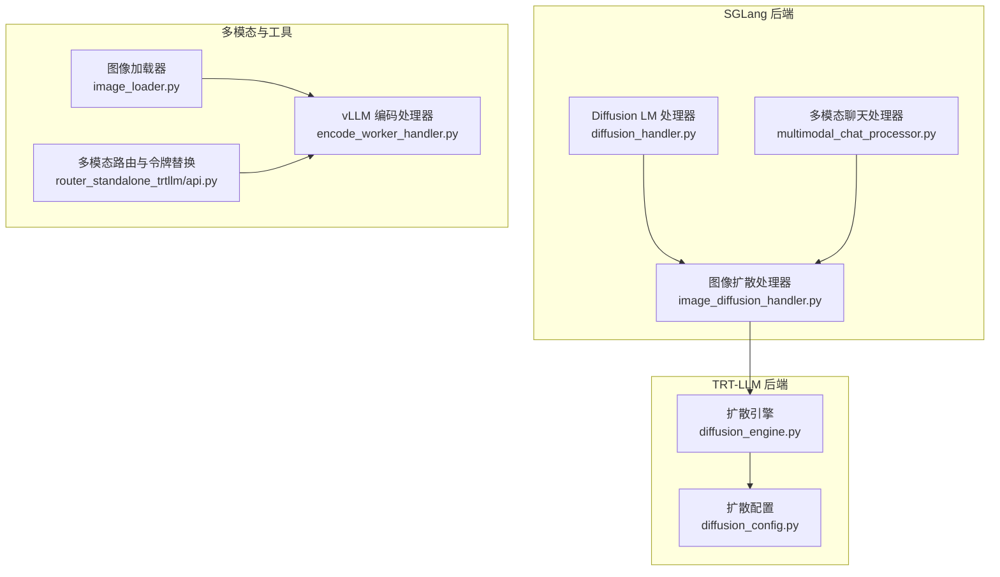
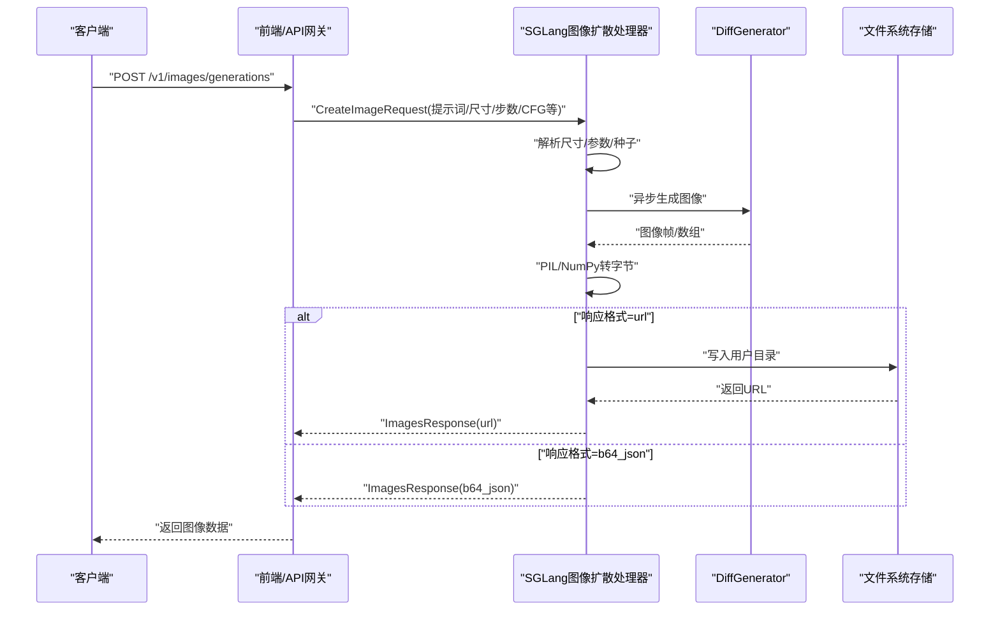
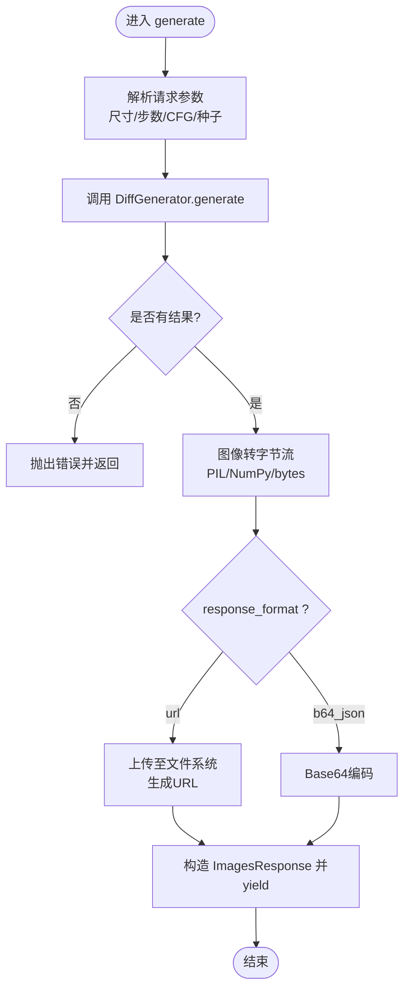
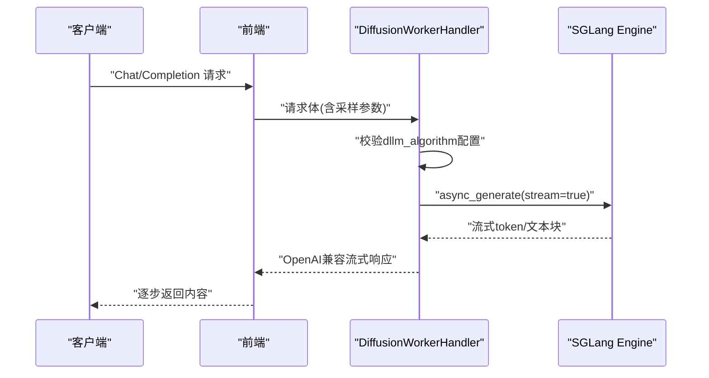
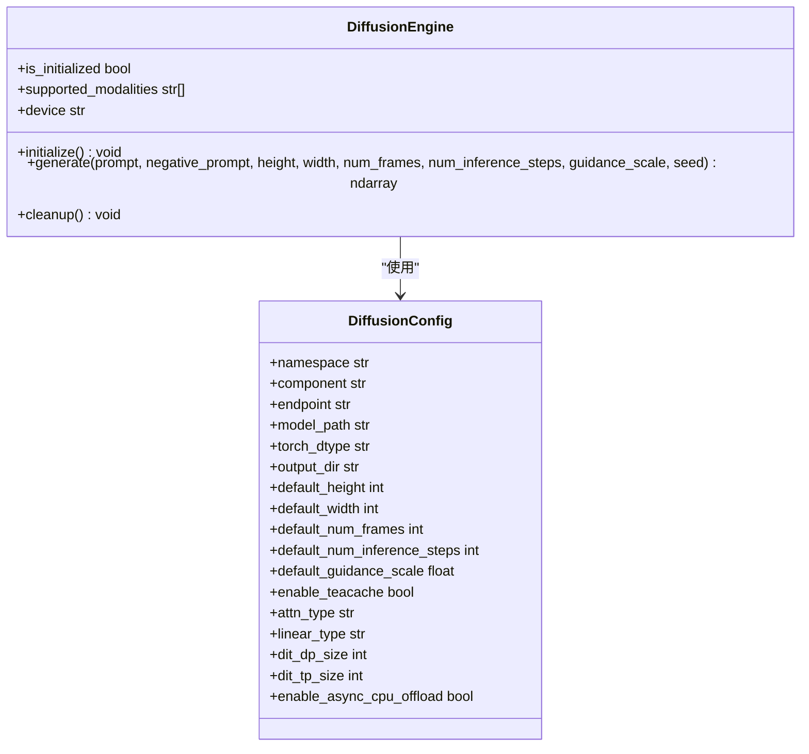
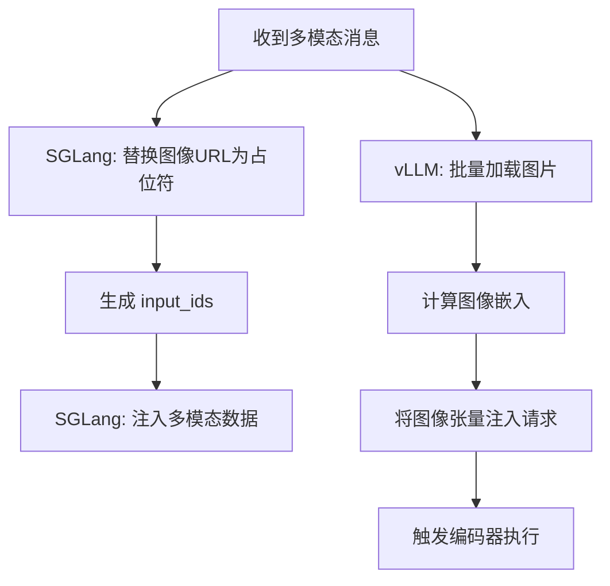
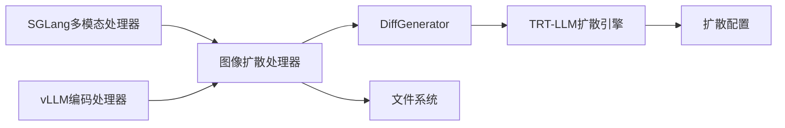

# 图像扩散处理

<cite>
**本文引用的文件**
- [components/src/dynamo/sglang/request_handlers/image_diffusion/image_diffusion_handler.py](file://components/src/dynamo/sglang/request_handlers/image_diffusion/image_diffusion_handler.py)
- [components/src/dynamo/sglang/request_handlers/llm/diffusion_handler.py](file://components/src/dynamo/sglang/request_handlers/llm/diffusion_handler.py)
- [components/src/dynamo/trtllm/engines/diffusion_engine.py](file://components/src/dynamo/trtllm/engines/diffusion_engine.py)
- [components/src/dynamo/trtllm/configs/diffusion_config.py](file://components/src/dynamo/trtllm/configs/diffusion_config.py)
- [components/src/dynamo/sglang/multimodal_utils/multimodal_chat_processor.py](file://components/src/dynamo/sglang/multimodal_utils/multimodal_chat_processor.py)
- [components/src/dynamo/vllm/multimodal_handlers/encode_worker_handler.py](file://components/src/dynamo/vllm/multimodal_handlers/encode_worker_handler.py)
- [examples/multimodal/utils/image_loader.py](file://examples/multimodal/utils/image_loader.py)
- [docs/pages/backends/sglang/diffusion-lm.md](file://docs/pages/backends/sglang/diffusion-lm.md)
- [examples/backends/sglang/launch/diffusion_llada.sh](file://examples/backends/sglang/launch/diffusion_llada.sh)
- [components/src/dynamo/sglang/main.py](file://components/src/dynamo/sglang/main.py)
- [components/src/dynamo/sglang/register.py](file://components/src/dynamo/sglang/register.py)
- [examples/deployments/router_standalone_trtllm/api.py](file://examples/deployments/router_standalone_trtllm/api.py)
</cite>

## 目录
1. [简介](#简介)
2. [项目结构](#项目结构)
3. [核心组件](#核心组件)
4. [架构总览](#架构总览)
5. [详细组件分析](#详细组件分析)
6. [依赖关系分析](#依赖关系分析)
7. [性能考量](#性能考量)
8. [故障排查指南](#故障排查指南)
9. [结论](#结论)
10. [附录：完整图像处理管道示例](#附录完整图像处理管道示例)

## 简介
本技术文档聚焦于SGLang在图像扩散（图像生成）场景下的实现与使用，涵盖以下主题：
- Diffusion LM（扩散语言模型）的工作原理与部署方式
- 图像输入的预处理与后处理流程（含多模态文本与图像融合）
- LLaDA扩散模型的使用方法、参数调优与性能优化
- 完整的图像处理管道示例（从图像加载、预处理到扩散生成）
- 多模态输入处理机制与结果质量评估方法

## 项目结构
围绕图像扩散处理的关键代码分布在如下模块：
- SGLang图像扩散工作器与Diffusion LM处理器
- TRT-LLM扩散引擎与配置
- 多模态预处理与编码（SGLang与vLLM）
- 示例工具与部署脚本

**图表来源**
- [components/src/dynamo/sglang/request_handlers/image_diffusion/image_diffusion_handler.py](file://components/src/dynamo/sglang/request_handlers/image_diffusion/image_diffusion_handler.py#L1-L236)
- [components/src/dynamo/sglang/request_handlers/llm/diffusion_handler.py](file://components/src/dynamo/sglang/request_handlers/llm/diffusion_handler.py#L1-L104)
- [components/src/dynamo/trtllm/engines/diffusion_engine.py](file://components/src/dynamo/trtllm/engines/diffusion_engine.py#L1-L359)
- [components/src/dynamo/trtllm/configs/diffusion_config.py](file://components/src/dynamo/trtllm/configs/diffusion_config.py#L1-L98)
- [components/src/dynamo/sglang/multimodal_utils/multimodal_chat_processor.py](file://components/src/dynamo/sglang/multimodal_utils/multimodal_chat_processor.py#L1-L163)
- [components/src/dynamo/vllm/multimodal_handlers/encode_worker_handler.py](file://components/src/dynamo/vllm/multimodal_handlers/encode_worker_handler.py#L137-L379)
- [examples/multimodal/utils/image_loader.py](file://examples/multimodal/utils/image_loader.py#L1-L111)
- [examples/deployments/router_standalone_trtllm/api.py](file://examples/deployments/router_standalone_trtllm/api.py#L231-L357)

**章节来源**
- [components/src/dynamo/sglang/request_handlers/image_diffusion/image_diffusion_handler.py](file://components/src/dynamo/sglang/request_handlers/image_diffusion/image_diffusion_handler.py#L1-L236)
- [components/src/dynamo/trtllm/engines/diffusion_engine.py](file://components/src/dynamo/trtllm/engines/diffusion_engine.py#L1-L359)
- [components/src/dynamo/vllm/multimodal_handlers/encode_worker_handler.py](file://components/src/dynamo/vllm/multimodal_handlers/encode_worker_handler.py#L137-L379)
- [examples/multimodal/utils/image_loader.py](file://examples/multimodal/utils/image_loader.py#L1-L111)

## 核心组件
- 图像扩散处理器（SGLang）：负责接收请求、解析尺寸与采样参数、调用DiffGenerator进行图像生成、完成图像字节转换与存储上传或Base64编码返回。
- TRT-LLM扩散引擎：自动检测模型类型并加载对应视觉生成管线，支持分布式并行与缓存优化。
- 多模态预处理（SGLang/vLLM）：将消息中的图像URL映射为特殊占位符，构建输入ID序列，并在下游编码/推理阶段注入图像嵌入。
- 图像加载器：统一处理HTTP/HTTPS与data URL，支持缓存与格式校验，保障安全与性能。

**章节来源**
- [components/src/dynamo/sglang/request_handlers/image_diffusion/image_diffusion_handler.py](file://components/src/dynamo/sglang/request_handlers/image_diffusion/image_diffusion_handler.py#L70-L196)
- [components/src/dynamo/trtllm/engines/diffusion_engine.py](file://components/src/dynamo/trtllm/engines/diffusion_engine.py#L264-L329)
- [components/src/dynamo/sglang/multimodal_utils/multimodal_chat_processor.py](file://components/src/dynamo/sglang/multimodal_utils/multimodal_chat_processor.py#L11-L48)
- [components/src/dynamo/vllm/multimodal_handlers/encode_worker_handler.py](file://components/src/dynamo/vllm/multimodal_handlers/encode_worker_handler.py#L137-L379)
- [examples/multimodal/utils/image_loader.py](file://examples/multimodal/utils/image_loader.py#L41-L111)

## 架构总览
下图展示了从请求进入、多模态预处理、扩散生成到结果返回的整体流程。

**图表来源**
- [components/src/dynamo/sglang/request_handlers/image_diffusion/image_diffusion_handler.py](file://components/src/dynamo/sglang/request_handlers/image_diffusion/image_diffusion_handler.py#L70-L196)
- [components/src/dynamo/sglang/main.py](file://components/src/dynamo/sglang/main.py#L566-L644)

## 详细组件分析

### 组件A：图像扩散处理器（SGLang）
职责与流程：
- 解析请求参数（提示词、尺寸、步数、CFG、种子、负向提示等）
- 调用DiffGenerator执行扩散生成
- 将生成的图像（PIL/NumPy/bytes）统一转为字节流
- 支持两种输出格式：URL直链或Base64字符串
- 使用fsspec文件系统进行持久化存储与URL拼接

**图表来源**
- [components/src/dynamo/sglang/request_handlers/image_diffusion/image_diffusion_handler.py](file://components/src/dynamo/sglang/request_handlers/image_diffusion/image_diffusion_handler.py#L70-L196)

**章节来源**
- [components/src/dynamo/sglang/request_handlers/image_diffusion/image_diffusion_handler.py](file://components/src/dynamo/sglang/request_handlers/image_diffusion/image_diffusion_handler.py#L70-L196)

### 组件B：Diffusion LM处理器（SGLang）
职责与流程：
- 初始化时检查是否配置了扩散算法（如LowConfidence）
- 接收输入（token_ids或文本），构建采样参数
- 通过SGLang引擎异步生成，按需选择token或文本解码路径
- 流式输出（OpenAI兼容格式）

**图表来源**
- [components/src/dynamo/sglang/request_handlers/llm/diffusion_handler.py](file://components/src/dynamo/sglang/request_handlers/llm/diffusion_handler.py#L59-L100)

**章节来源**
- [components/src/dynamo/sglang/request_handlers/llm/diffusion_handler.py](file://components/src/dynamo/sglang/request_handlers/llm/diffusion_handler.py#L1-L104)

### 组件C：TRT-LLM扩散引擎
职责与流程：
- 自动检测模型类型（基于model_index.json），注册对应视觉生成管线
- 懒加载管线类，初始化时设置并行、注意力/线性层类型、TeaCache等
- 提供同步生成接口（应在线程池中调用），返回numpy数组
- 支持CPU异步卸载与设备切换

**图表来源**
- [components/src/dynamo/trtllm/engines/diffusion_engine.py](file://components/src/dynamo/trtllm/engines/diffusion_engine.py#L52-L359)
- [components/src/dynamo/trtllm/configs/diffusion_config.py](file://components/src/dynamo/trtllm/configs/diffusion_config.py#L20-L98)

**章节来源**
- [components/src/dynamo/trtllm/engines/diffusion_engine.py](file://components/src/dynamo/trtllm/engines/diffusion_engine.py#L135-L329)
- [components/src/dynamo/trtllm/configs/diffusion_config.py](file://components/src/dynamo/trtllm/configs/diffusion_config.py#L20-L98)

### 组件D：多模态预处理（SGLang与vLLM）
- SGLang侧：将消息中的图像URL替换为模板中的图像占位符，生成token_ids，便于后续编码/推理阶段注入图像特征。
- vLLM侧：批量加载图片、计算嵌入、将图像张量注入到请求中，触发编码器执行。

**图表来源**
- [components/src/dynamo/sglang/multimodal_utils/multimodal_chat_processor.py](file://components/src/dynamo/sglang/multimodal_utils/multimodal_chat_processor.py#L11-L48)
- [components/src/dynamo/vllm/multimodal_handlers/encode_worker_handler.py](file://components/src/dynamo/vllm/multimodal_handlers/encode_worker_handler.py#L137-L379)
- [examples/deployments/router_standalone_trtllm/api.py](file://examples/deployments/router_standalone_trtllm/api.py#L231-L357)

**章节来源**
- [components/src/dynamo/sglang/multimodal_utils/multimodal_chat_processor.py](file://components/src/dynamo/sglang/multimodal_utils/multimodal_chat_processor.py#L11-L48)
- [components/src/dynamo/vllm/multimodal_handlers/encode_worker_handler.py](file://components/src/dynamo/vllm/multimodal_handlers/encode_worker_handler.py#L137-L379)
- [examples/deployments/router_standalone_trtllm/api.py](file://examples/deployments/router_standalone_trtllm/api.py#L231-L357)

### 组件E：图像加载器
- 支持HTTP/HTTPS与data URL；对data URL进行base64校验
- 使用Pillow加载并限制格式（JPEG/PNG/WEBP），统一转为RGB
- 对HTTP(S)来源启用LRU缓存，避免重复下载

**章节来源**
- [examples/multimodal/utils/image_loader.py](file://examples/multimodal/utils/image_loader.py#L41-L111)

## 依赖关系分析
- SGLang图像扩散处理器依赖DiffGenerator（非SGLang Engine），并通过文件系统进行图像持久化与URL生成。
- TRT-LLM扩散引擎通过懒加载与自动检测机制适配不同模型家族，减少环境耦合。
- 多模态预处理在SGLang与vLLM两端分别实现，确保不同后端的一致行为。

**图表来源**
- [components/src/dynamo/sglang/request_handlers/image_diffusion/image_diffusion_handler.py](file://components/src/dynamo/sglang/request_handlers/image_diffusion/image_diffusion_handler.py#L53-L60)
- [components/src/dynamo/trtllm/engines/diffusion_engine.py](file://components/src/dynamo/trtllm/engines/diffusion_engine.py#L157-L215)
- [components/src/dynamo/sglang/multimodal_utils/multimodal_chat_processor.py](file://components/src/dynamo/sglang/multimodal_utils/multimodal_chat_processor.py#L11-L48)
- [components/src/dynamo/vllm/multimodal_handlers/encode_worker_handler.py](file://components/src/dynamo/vllm/multimodal_handlers/encode_worker_handler.py#L360-L379)

**章节来源**
- [components/src/dynamo/sglang/request_handlers/image_diffusion/image_diffusion_handler.py](file://components/src/dynamo/sglang/request_handlers/image_diffusion/image_diffusion_handler.py#L53-L60)
- [components/src/dynamo/trtllm/engines/diffusion_engine.py](file://components/src/dynamo/trtllm/engines/diffusion_engine.py#L157-L215)

## 性能考量
- 并行与分布式
  - SGLang扩散LM：通过tp_size控制张量并行规模，结合禁用CUDA图与重叠调度以提升稳定性。
  - TRT-LLM扩散引擎：支持DIT的dp/tp/ulysses/ring等并行维度配置，建议根据GPU数量与显存合理分配。
- 计算与内存
  - Diffusion LM：采用低置信度迭代细化算法，建议在保证质量前提下调小步数或调整CFG以降低延迟。
  - TRT-LLM：启用TeaCache可加速推理；torch.compile与注意力/线性层类型可按硬件特性选择。
- I/O与存储
  - 图像生成后优先使用URL直链返回，减少大对象传输；必要时再使用Base64。
  - 文件系统上传应使用异步写入，避免阻塞事件循环。
- 多模态吞吐
  - vLLM编码器批量化加载与处理图像，建议按可用编码器数量动态分片，平衡负载。

[本节为通用指导，不直接分析具体文件]

## 故障排查指南
- 常见错误与定位
  - 无结果返回：检查生成器状态与异常日志，确认采样参数合法（步数上限、尺寸规格）。
  - 图像格式不支持：确保输入为JPEG/PNG/WEBP，必要时在加载器中增加容错与转换。
  - 多模态令牌替换失败：核对图像占位符与替换逻辑，确保连续区域被正确识别。
  - vLLM编码器不可用：确认编码器计数与可用性，检查批大小与分片策略。
- 日志与追踪
  - 启用分布式追踪头，结合请求ID定位端到端链路问题。
  - 关注Diffusion LM处理器对dllm_algorithm的配置校验日志。

**章节来源**
- [components/src/dynamo/sglang/request_handlers/image_diffusion/image_diffusion_handler.py](file://components/src/dynamo/sglang/request_handlers/image_diffusion/image_diffusion_handler.py#L129-L136)
- [components/src/dynamo/vllm/multimodal_handlers/encode_worker_handler.py](file://components/src/dynamo/vllm/multimodal_handlers/encode_worker_handler.py#L161-L174)
- [components/src/dynamo/sglang/request_handlers/llm/diffusion_handler.py](file://components/src/dynamo/sglang/request_handlers/llm/diffusion_handler.py#L44-L57)

## 结论
本方案在SGLang与TRT-LLM双后端上实现了图像扩散生成与多模态预处理的完整链路。通过清晰的组件边界与参数化配置，既满足了易用性也兼顾了性能与扩展性。建议在生产环境中结合硬件能力与业务需求，对并行度、缓存与I/O策略进行针对性优化。

[本节为总结性内容，不直接分析具体文件]

## 附录：完整图像处理管道示例
以下示例展示从图像加载、预处理到扩散生成的端到端流程，适用于单图与多图场景。

- 步骤1：图像加载
  - 支持HTTP/HTTPS与data URL；对data URL进行base64校验；统一转为RGB并缓存。
  - 参考：[examples/multimodal/utils/image_loader.py](file://examples/multimodal/utils/image_loader.py#L41-L111)

- 步骤2：多模态预处理（SGLang）
  - 将消息中的图像URL替换为模板占位符，生成input_ids，便于后续注入图像特征。
  - 参考：[components/src/dynamo/sglang/multimodal_utils/multimodal_chat_processor.py](file://components/src/dynamo/sglang/multimodal_utils/multimodal_chat_processor.py#L11-L48)

- 步骤3：多模态预处理（vLLM）
  - 批量加载图片，计算嵌入，将图像张量注入请求，触发编码器执行。
  - 参考：[components/src/dynamo/vllm/multimodal_handlers/encode_worker_handler.py](file://components/src/dynamo/vllm/multimodal_handlers/encode_worker_handler.py#L137-L379)

- 步骤4：图像扩散生成（SGLang）
  - 解析尺寸与采样参数，调用DiffGenerator生成图像，统一转为字节流，支持URL直链或Base64返回。
  - 参考：[components/src/dynamo/sglang/request_handlers/image_diffusion/image_diffusion_handler.py](file://components/src/dynamo/sglang/request_handlers/image_diffusion/image_diffusion_handler.py#L70-L196)

- 步骤5：TRT-LLM扩散生成（可选）
  - 自动检测模型类型，初始化并行配置，执行生成，返回numpy数组。
  - 参考：[components/src/dynamo/trtllm/engines/diffusion_engine.py](file://components/src/dynamo/trtllm/engines/diffusion_engine.py#L157-L329)

- 步骤6：部署与测试
  - 使用提供的启动脚本快速部署Diffusion LM（如LLaDA2.0），并通过OpenAI兼容接口进行测试。
  - 参考：[docs/pages/backends/sglang/diffusion-lm.md](file://docs/pages/backends/sglang/diffusion-lm.md#L14-L82)、[examples/backends/sglang/launch/diffusion_llada.sh](file://examples/backends/sglang/launch/diffusion_llada.sh#L55-L75)

- 步骤7：多模态路由与令牌替换（TRT-LLM路由示例）
  - 根据图像URL选择“image”或“multiple_image”模态，计算令牌与图像偏移，生成哈希用于路由。
  - 参考：[examples/deployments/router_standalone_trtllm/api.py](file://examples/deployments/router_standalone_trtllm/api.py#L231-L357)

- 步骤8：注册与健康检查（SGLang扩散模型）
  - 注册模型为“文本输入、图像输出”，并提供最小化健康检查负载。
  - 参考：[components/src/dynamo/sglang/register.py](file://components/src/dynamo/sglang/register.py#L285-L314)、[components/src/dynamo/sglang/main.py](file://components/src/dynamo/sglang/main.py#L614-L635)