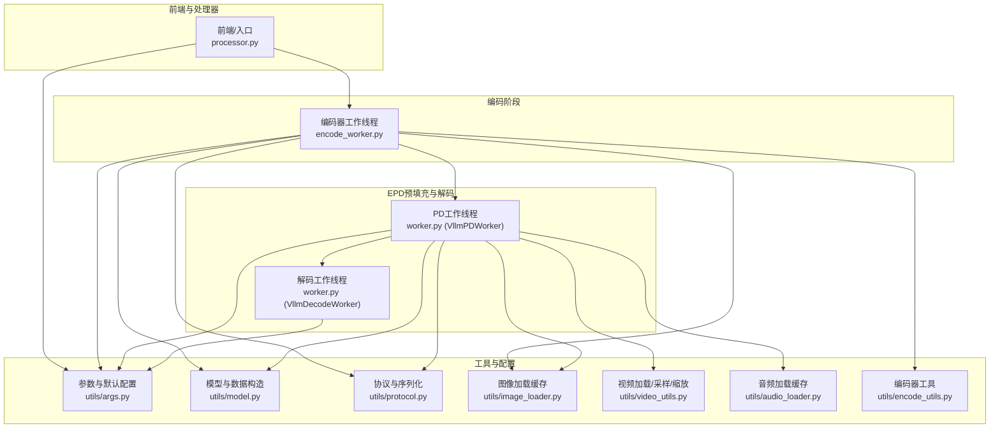
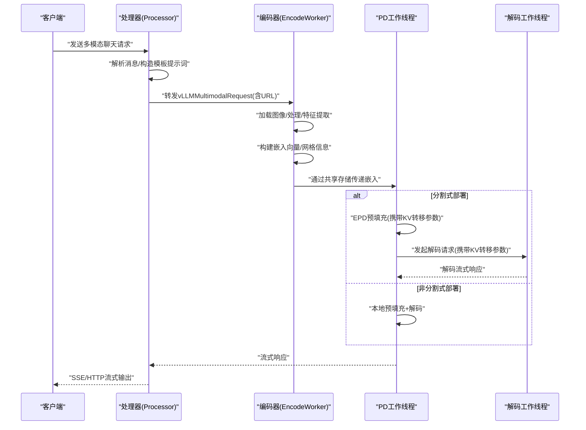
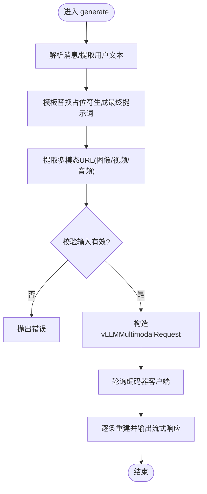
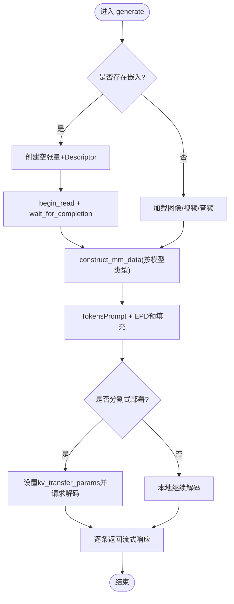
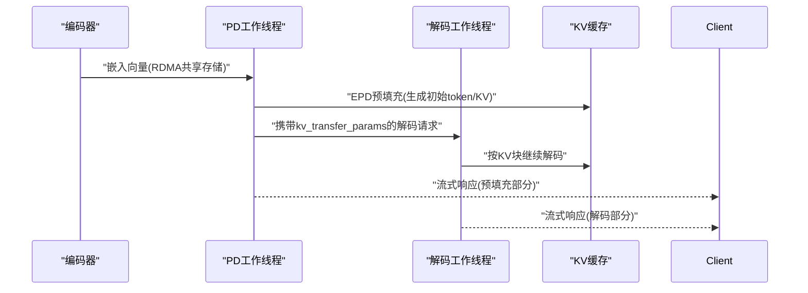
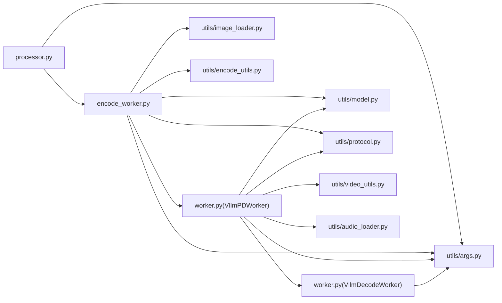

# 多模态处理示例

<cite>
**本文引用的文件**
- [examples/multimodal/components/processor.py](file://examples/multimodal/components/processor.py)
- [examples/multimodal/components/encode_worker.py](file://examples/multimodal/components/encode_worker.py)
- [examples/multimodal/components/worker.py](file://examples/multimodal/components/worker.py)
- [examples/multimodal/utils/args.py](file://examples/multimodal/utils/args.py)
- [examples/multimodal/utils/encode_utils.py](file://examples/multimodal/utils/encode_utils.py)
- [examples/multimodal/utils/image_loader.py](file://examples/multimodal/utils/image_loader.py)
- [examples/multimodal/utils/video_utils.py](file://examples/multimodal/utils/video_utils.py)
- [examples/multimodal/utils/audio_loader.py](file://examples/multimodal/utils/audio_loader.py)
- [examples/multimodal/utils/model.py](file://examples/multimodal/utils/model.py)
- [examples/multimodal/utils/protocol.py](file://examples/multimodal/utils/protocol.py)
- [examples/multimodal/deploy/agg_llava.yaml](file://examples/multimodal/deploy/agg_llava.yaml)
- [examples/multimodal/deploy/agg_qwen.yaml](file://examples/multimodal/deploy/agg_qwen.yaml)
- [components/src/dynamo/vllm/main.py](file://components/src/dynamo/vllm/main.py)
- [components/src/dynamo/trtllm/encode_helper.py](file://components/src/dynamo/trtllm/encode_helper.py)
</cite>

## 目录
1. [简介](#简介)
2. [项目结构](#项目结构)
3. [核心组件](#核心组件)
4. [架构总览](#架构总览)
5. [详细组件分析](#详细组件分析)
6. [依赖关系分析](#依赖关系分析)
7. [性能考虑](#性能考虑)
8. [故障排查指南](#故障排查指南)
9. [结论](#结论)
10. [附录](#附录)

## 简介
本示例文档面向SGLang多模态处理场景，聚焦“分割式部署”（编码器与推理解码分离）的配置与使用，覆盖文本、图像、视频与音频等多模态输入的处理流程；同时给出编码器工作线程的配置与优化策略（并行与资源分配），并通过EPD（Early Process Detection，早期处理检测）机制提升端到端吞吐与延迟表现。文档还提供多模态数据格式转换、批量处理与性能监控的实用技巧，帮助在生产环境中稳定高效地运行多模态服务。

## 项目结构
本示例围绕examples/multimodal目录下的组件与工具展开，配合components/src/dynamo中的通用多模态能力，形成从请求预处理、编码、EPD预填充、解码到响应输出的完整链路。



图表来源
- [examples/multimodal/components/processor.py](file://examples/multimodal/components/processor.py#L196-L262)
- [examples/multimodal/components/encode_worker.py](file://examples/multimodal/components/encode_worker.py#L73-L154)
- [examples/multimodal/components/worker.py](file://examples/multimodal/components/worker.py#L227-L396)
- [examples/multimodal/utils/args.py](file://examples/multimodal/utils/args.py#L148-L184)
- [examples/multimodal/utils/model.py](file://examples/multimodal/utils/model.py#L44-L91)
- [examples/multimodal/utils/protocol.py](file://examples/multimodal/utils/protocol.py#L157-L191)
- [examples/multimodal/utils/image_loader.py](file://examples/multimodal/utils/image_loader.py#L41-L111)
- [examples/multimodal/utils/video_utils.py](file://examples/multimodal/utils/video_utils.py#L37-L153)
- [examples/multimodal/utils/audio_loader.py](file://examples/multimodal/utils/audio_loader.py#L61-L81)
- [examples/multimodal/utils/encode_utils.py](file://examples/multimodal/utils/encode_utils.py#L58-L103)

章节来源
- [examples/multimodal/components/processor.py](file://examples/multimodal/components/processor.py#L1-L348)
- [examples/multimodal/components/encode_worker.py](file://examples/multimodal/components/encode_worker.py#L1-L265)
- [examples/multimodal/components/worker.py](file://examples/multimodal/components/worker.py#L1-L475)
- [examples/multimodal/utils/args.py](file://examples/multimodal/utils/args.py#L1-L185)
- [examples/multimodal/utils/encode_utils.py](file://examples/multimodal/utils/encode_utils.py#L1-L133)
- [examples/multimodal/utils/image_loader.py](file://examples/multimodal/utils/image_loader.py#L1-L111)
- [examples/multimodal/utils/video_utils.py](file://examples/multimodal/utils/video_utils.py#L1-L415)
- [examples/multimodal/utils/audio_loader.py](file://examples/multimodal/utils/audio_loader.py#L1-L81)
- [examples/multimodal/utils/model.py](file://examples/multimodal/utils/model.py#L1-L92)
- [examples/multimodal/utils/protocol.py](file://examples/multimodal/utils/protocol.py#L1-L191)

## 核心组件
- 请求处理器（Processor）
  - 负责解析用户消息，构造模板化提示词，提取多模态输入（图像/视频/音频URL），并将请求转发给编码器工作线程。
  - 关键点：支持聊天类请求，模板占位符校验，流式响应重建。
- 编码器工作线程（EncodeWorker）
  - 加载图像，调用图像处理器与视觉模型，生成嵌入向量，通过RDMA共享存储传递给后续阶段，并回传解码结果。
  - 关键点：基于模型类型选择编码路径（如LLaVA或Qwen），嵌入形状与网格信息传递。
- PD/解码工作线程（VllmPDWorker/VllmDecodeWorker）
  - PD阶段执行EPD预填充，按需将KV缓存转移至解码阶段；解码阶段仅负责token生成。
  - 关键点：根据是否启用分割式部署决定是否进行远程解码；嵌入数据类型与设备设置随模型而异。
- 工具与配置
  - 参数与默认值：统一vLLM默认、KV事件端口、前缀缓存等。
  - 模型与数据构造：根据模型类型构造多模态数据结构（图像/视频/音频）。
  - 协议与序列化：对vLLM请求/响应进行可序列化包装，兼容SamplingParams。
  - 图像/视频/音频加载：带缓存的异步加载与预处理。

章节来源
- [examples/multimodal/components/processor.py](file://examples/multimodal/components/processor.py#L48-L262)
- [examples/multimodal/components/encode_worker.py](file://examples/multimodal/components/encode_worker.py#L47-L154)
- [examples/multimodal/components/worker.py](file://examples/multimodal/components/worker.py#L194-L396)
- [examples/multimodal/utils/args.py](file://examples/multimodal/utils/args.py#L148-L184)
- [examples/multimodal/utils/model.py](file://examples/multimodal/utils/model.py#L44-L91)
- [examples/multimodal/utils/protocol.py](file://examples/multimodal/utils/protocol.py#L157-L191)

## 架构总览
下图展示了典型的多模态分割式部署链路：前端/处理器将用户消息与多模态URL交给编码器；编码器完成特征提取后，将嵌入通过共享存储传递给PD工作线程；PD工作线程进行EPD预填充并按需触发解码工作线程；最终将流式响应返回客户端。



图表来源
- [examples/multimodal/components/processor.py](file://examples/multimodal/components/processor.py#L196-L262)
- [examples/multimodal/components/encode_worker.py](file://examples/multimodal/components/encode_worker.py#L73-L154)
- [examples/multimodal/components/worker.py](file://examples/multimodal/components/worker.py#L227-L396)

章节来源
- [examples/multimodal/components/processor.py](file://examples/multimodal/components/processor.py#L196-L262)
- [examples/multimodal/components/encode_worker.py](file://examples/multimodal/components/encode_worker.py#L73-L154)
- [examples/multimodal/components/worker.py](file://examples/multimodal/components/worker.py#L227-L396)

## 详细组件分析

### 组件A：处理器（Processor）
- 功能要点
  - 解析OpenAI风格的聊天消息，提取用户文本作为模板占位符内容。
  - 将图像/视频/音频URL映射到统一的MultiModalInput结构。
  - 构造vLLMMultimodalRequest并以轮询方式转发给编码器。
  - 对编码器返回的流式响应进行重建与输出。
- 关键流程
  - 输入校验：模板必须包含占位符；三者不可混用。
  - 请求构造：生成唯一request_id，构造ChatCompletionRequest并开启流式。
  - 转发与流式聚合：通过客户端轮询接口获取编码器响应并逐条输出。



图表来源
- [examples/multimodal/components/processor.py](file://examples/multimodal/components/processor.py#L196-L262)

章节来源
- [examples/multimodal/components/processor.py](file://examples/multimodal/components/processor.py#L196-L262)

### 组件B：编码器工作线程（EncodeWorker）
- 功能要点
  - 异步加载图像，使用AutoImageProcessor与视觉模型生成嵌入。
  - 基于模型类型选择编码路径（LLaVA需要projector，Qwen直接使用视觉模型输出）。
  - 通过RDMA Descriptor将嵌入写入共享存储，并携带序列化元数据。
  - 轮询下游PD工作线程，等待其完成预填充并回传流式结果。
- 关键流程
  - 图像加载与预处理：支持HTTP/HTTPS与data URL，带缓存与格式限制。
  - 特征提取：调用encode_utils与模型组件，得到嵌入张量与网格信息。
  - 共享存储传输：创建Descriptor并等待写入完成，再发起下游请求。
  - 流式回传：逐条反序列化并返回。

```mermaid
sequenceDiagram
participant ENC as "编码器"
participant Loader as "图像加载器"
participant Proc as "图像处理器"
participant Vision as "视觉模型"
participant Proj as "投影器(LLaVA)"
participant Conn as "RDMA连接器"
participant PD as "PD工作线程"
ENC->>Loader : "加载图像(支持HTTP/data URL)"
Loader-->>ENC : "返回RGB图像"
ENC->>Proc : "图像转张量"
Proc-->>ENC : "像素值/网格信息"
ENC->>Vision : "前向得到视觉特征"
alt LLaVA
Vision-->>ENC : "last_hidden_state"
ENC->>Proj : "投影到多模态空间"
Proj-->>ENC : "嵌入向量"
else Qwen
Vision-->>ENC : "图像特征"
end
ENC->>Conn : "创建Descriptor并写入共享存储"
ENC->>PD : "携带序列化元数据的请求"
PD-->>ENC : "流式响应"
ENC-->>Caller["逐条返回"]
```

图表来源
- [examples/multimodal/components/encode_worker.py](file://examples/multimodal/components/encode_worker.py#L73-L154)
- [examples/multimodal/utils/encode_utils.py](file://examples/multimodal/utils/encode_utils.py#L58-L103)
- [examples/multimodal/utils/image_loader.py](file://examples/multimodal/utils/image_loader.py#L41-L111)

章节来源
- [examples/multimodal/components/encode_worker.py](file://examples/multimodal/components/encode_worker.py#L73-L154)
- [examples/multimodal/utils/encode_utils.py](file://examples/multimodal/utils/encode_utils.py#L58-L103)
- [examples/multimodal/utils/image_loader.py](file://examples/multimodal/utils/image_loader.py#L41-L111)

### 组件C：PD/解码工作线程（VllmPDWorker/VllmDecodeWorker）
- 功能要点
  - PD阶段：若已存在嵌入，则从共享存储读取；否则直接加载图像；随后进行EPD预填充；在分割式部署时设置KV转移参数并触发解码。
  - 解码阶段：仅接收KV转移参数，不重复处理嵌入，专注token生成。
  - 数据类型与设备：根据模型类型选择嵌入dtype与设备（如视频模型使用uint8、CPU设备）。
- 关键流程
  - 嵌入读取：创建空张量描述符，通过Connector读取并构造多模态数据。
  - 预填充：将multi_modal_data注入TokensPrompt，执行EPD预填充。
  - 远程解码：在enable_disagg模式下，将kv_transfer_params传递给解码工作线程。



图表来源
- [examples/multimodal/components/worker.py](file://examples/multimodal/components/worker.py#L227-L396)
- [examples/multimodal/utils/model.py](file://examples/multimodal/utils/model.py#L44-L91)

章节来源
- [examples/multimodal/components/worker.py](file://examples/multimodal/components/worker.py#L227-L396)
- [examples/multimodal/utils/model.py](file://examples/multimodal/utils/model.py#L44-L91)

### 组件D：EPD（Early Process Detection）实现示例
- EPD流程概述
  - 在编码器完成图像/视频/音频特征提取后，将嵌入通过RDMA共享存储传递给PD工作线程。
  - PD工作线程在本地完成EPD预填充，计算初始token与KV缓存状态，并在分割式部署时将KV转移参数传递给解码工作线程。
  - 解码工作线程仅负责后续token生成，避免重复特征提取，显著降低端到端延迟。
- 关键实现位置
  - vLLM侧：ECProcessorHandler路由逻辑，等待编码器与PD实例可用。
  - TRT-LLM侧：EncodeHelper中对EPD流程的编码与提示词一致性处理。



图表来源
- [components/src/dynamo/vllm/main.py](file://components/src/dynamo/vllm/main.py#L1103-L1142)
- [components/src/dynamo/trtllm/encode_helper.py](file://components/src/dynamo/trtllm/encode_helper.py#L334-L442)

章节来源
- [components/src/dynamo/vllm/main.py](file://components/src/dynamo/vllm/main.py#L1103-L1142)
- [components/src/dynamo/trtllm/encode_helper.py](file://components/src/dynamo/trtllm/encode_helper.py#L334-L442)

### 组件E：多模态数据格式转换与批量处理
- 数据格式转换
  - 图像：Qwen需要image_grid_thw与squeeze后的image_embeds；其他模型（如LLaVA）直接使用嵌入张量。
  - 视频：TRT-LLM EncodeHelper中对processed_prompt与tokenizer编码的一致性要求，避免特殊tokens影响token对齐。
  - 音频：Qwen2-Audio模型需要2D音频嵌入并转换为bf16。
- 批量处理与调度
  - 处理器侧可根据编码器实例数量动态计算批大小，平衡负载。
  - 视频采样：根据帧数与时长计算采样索引，确保均匀采样与边界安全。
- 性能优化建议
  - 图像/视频/音频加载采用缓存与异步I/O，避免阻塞事件循环。
  - 嵌入dtype与设备按模型特性选择，减少跨设备拷贝。

章节来源
- [examples/multimodal/utils/model.py](file://examples/multimodal/utils/model.py#L44-L91)
- [examples/multimodal/utils/encode_utils.py](file://examples/multimodal/utils/encode_utils.py#L58-L103)
- [examples/multimodal/utils/video_utils.py](file://examples/multimodal/utils/video_utils.py#L289-L355)
- [examples/multimodal/utils/image_loader.py](file://examples/multimodal/utils/image_loader.py#L41-L111)
- [examples/multimodal/utils/audio_loader.py](file://examples/multimodal/utils/audio_loader.py#L61-L81)

## 依赖关系分析
- 组件耦合
  - 处理器与编码器：通过vLLMMultimodalRequest与客户端轮询通信。
  - 编码器与PD：通过RDMA共享存储传递嵌入，降低内存复制开销。
  - PD与解码：通过kv_transfer_params传递KV缓存状态，实现解码加速。
- 外部依赖
  - vLLM引擎：AsyncLLM、SamplingParams、TokensPrompt、KV事件发布。
  - Transformers：AutoImageProcessor、AutoModel加载视觉模型。
  - PyAV/FFmpeg：视频容器打开与帧解码。
  - Librosa：音频加载与重采样。
- 配置与环境
  - vLLM默认参数、KV事件端口、前缀缓存、mm_embeds开关由utils/args.py集中管理。



图表来源
- [examples/multimodal/components/processor.py](file://examples/multimodal/components/processor.py#L1-L348)
- [examples/multimodal/components/encode_worker.py](file://examples/multimodal/components/encode_worker.py#L1-L265)
- [examples/multimodal/components/worker.py](file://examples/multimodal/components/worker.py#L1-L475)
- [examples/multimodal/utils/args.py](file://examples/multimodal/utils/args.py#L1-L185)
- [examples/multimodal/utils/model.py](file://examples/multimodal/utils/model.py#L1-L92)
- [examples/multimodal/utils/protocol.py](file://examples/multimodal/utils/protocol.py#L1-L191)
- [examples/multimodal/utils/image_loader.py](file://examples/multimodal/utils/image_loader.py#L1-L111)
- [examples/multimodal/utils/encode_utils.py](file://examples/multimodal/utils/encode_utils.py#L1-L133)
- [examples/multimodal/utils/video_utils.py](file://examples/multimodal/utils/video_utils.py#L1-L415)
- [examples/multimodal/utils/audio_loader.py](file://examples/multimodal/utils/audio_loader.py#L1-L81)

章节来源
- [examples/multimodal/components/processor.py](file://examples/multimodal/components/processor.py#L1-L348)
- [examples/multimodal/components/encode_worker.py](file://examples/multimodal/components/encode_worker.py#L1-L265)
- [examples/multimodal/components/worker.py](file://examples/multimodal/components/worker.py#L1-L475)
- [examples/multimodal/utils/args.py](file://examples/multimodal/utils/args.py#L1-L185)

## 性能考虑
- 编码器工作线程配置与优化
  - 并行度：根据GPU显存与吞吐需求增加编码器副本数；处理器侧按可用实例数动态分配批大小。
  - 资源分配：为编码器与推理工作线程分别设置独立GPU资源，避免争抢。
  - 数据传输：优先使用RDMA共享存储传递嵌入，减少网络与内存拷贝。
- EPD与KV缓存
  - 启用前缀缓存与KV事件发布，结合EPD预填充，显著降低解码阶段的KV查找成本。
  - TRT-LLM EncodeHelper中对processed_prompt与tokenizer编码的一致性处理，避免token对齐偏差导致的重复计算。
- I/O与批处理
  - 图像/视频/音频加载采用异步与缓存策略，避免阻塞事件循环。
  - 视频采样采用线性分段，保证在短视频或无帧计数场景下的稳健性。
- 监控与可观测性
  - 使用vLLM统计日志与ZMQ KV事件发布器，记录GPU块数量、请求耗时与吞吐指标。
  - 通过Dynamo运行时注册LLM端点，统一采集指标标签（如模型名）。

章节来源
- [examples/multimodal/components/worker.py](file://examples/multimodal/components/worker.py#L118-L176)
- [examples/multimodal/utils/args.py](file://examples/multimodal/utils/args.py#L148-L184)
- [components/src/dynamo/trtllm/encode_helper.py](file://components/src/dynamo/trtllm/encode_helper.py#L334-L442)

## 故障排查指南
- 常见问题与定位
  - 编码器未就绪：处理器在转发前会等待编码器实例可用，若长时间超时，检查编码器日志与镜像/密钥配置。
  - 提示词模板缺失占位符：模板必须包含占位符，否则抛出错误。
  - 多模态输入冲突：图像/视频/音频URL不可混用；同一请求只能包含一种媒体类型。
  - 嵌入读取失败：RDMA Descriptor为空或共享存储不可用，检查编码器是否成功写入。
  - 视频采样异常：当视频帧数为0且无时长时，采样逻辑会报错；请确认视频容器与索引范围。
- 日志与调试
  - 启用Dynamo日志与vLLM统计日志，关注KV事件端口与ZMQ发布器状态。
  - 在处理器与编码器中打印关键字段（如request_id、prompt_token_ids、embeddings_shape）便于追踪。

章节来源
- [examples/multimodal/components/processor.py](file://examples/multimodal/components/processor.py#L202-L250)
- [examples/multimodal/components/encode_worker.py](file://examples/multimodal/components/encode_worker.py#L128-L154)
- [examples/multimodal/utils/video_utils.py](file://examples/multimodal/utils/video_utils.py#L310-L355)

## 结论
通过将多模态编码与推理解码分离，并利用EPD预填充与RDMA共享存储，SGLang在多模态场景下实现了更优的吞吐与更低的端到端延迟。配合合理的并行与资源分配策略、稳健的数据格式转换与批处理机制，以及完善的性能监控，可在生产环境中稳定高效地支撑图像、视频与音频等多模态应用。

## 附录
- 部署示例
  - LLaVA与Qwen的聚合部署YAML示例，展示了Frontend、EncodeWorker、VLMWorker与Processor的资源配置与命令行参数。
- 快速启动建议
  - 为编码器与推理工作线程分别配置独立GPU资源；
  - 在处理器侧根据编码器实例数动态调整批大小；
  - 启用前缀缓存与KV事件发布，结合EPD预填充；
  - 使用RDMA共享存储传递嵌入，避免重复特征提取。

章节来源
- [examples/multimodal/deploy/agg_llava.yaml](file://examples/multimodal/deploy/agg_llava.yaml#L1-L64)
- [examples/multimodal/deploy/agg_qwen.yaml](file://examples/multimodal/deploy/agg_qwen.yaml#L1-L65)