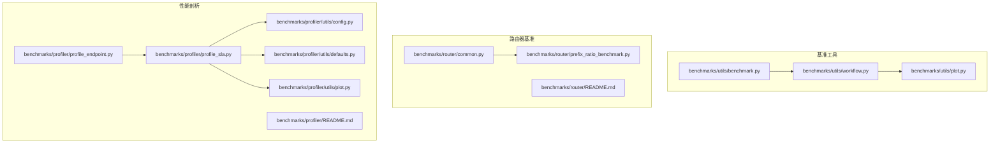
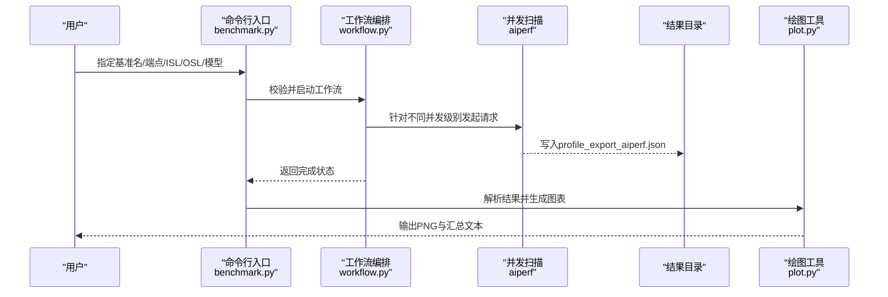
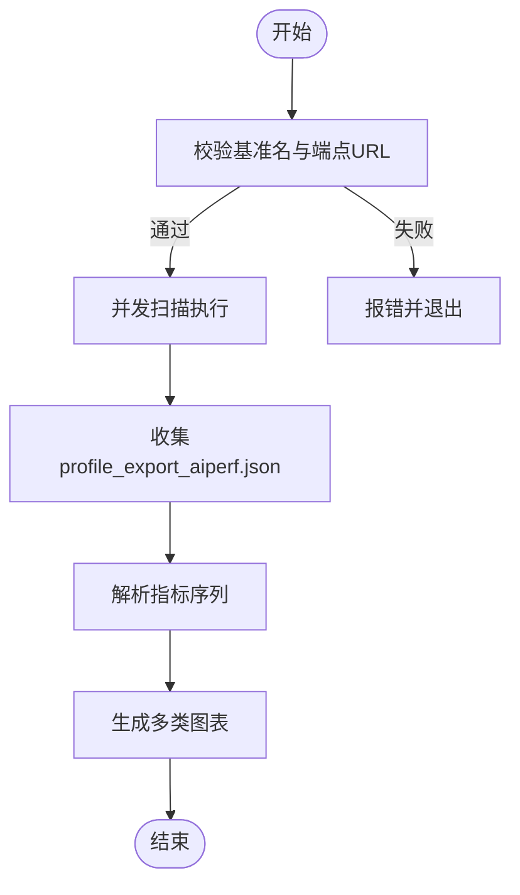
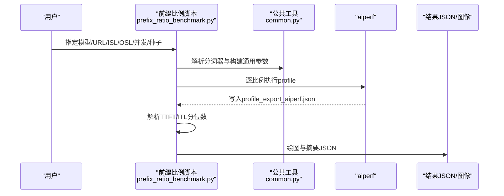
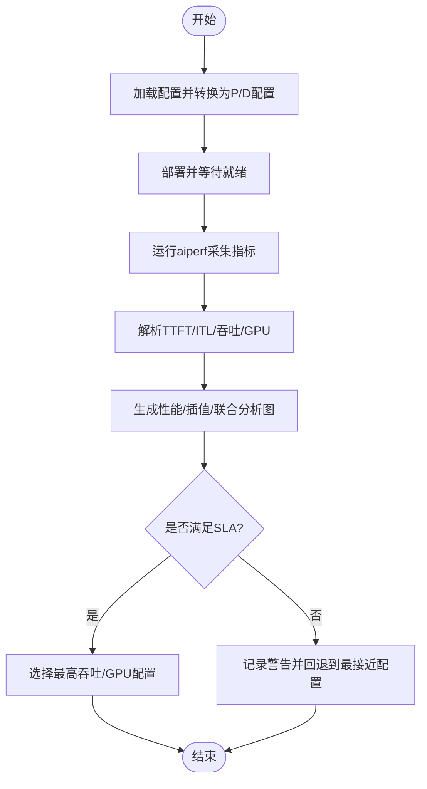
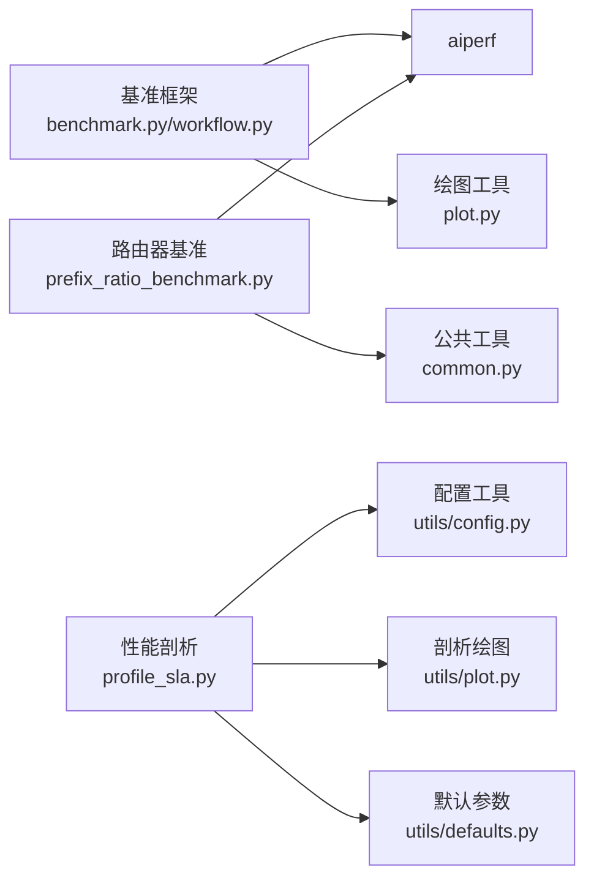

# 性能调优与基准测试

<cite>
**本文引用的文件**
- [benchmarks/README.md](file://benchmarks/README.md)
- [benchmarks/router/README.md](file://benchmarks/router/README.md)
- [benchmarks/router/common.py](file://benchmarks/router/common.py)
- [benchmarks/router/prefix_ratio_benchmark.py](file://benchmarks/router/prefix_ratio_benchmark.py)
- [benchmarks/utils/benchmark.py](file://benchmarks/utils/benchmark.py)
- [benchmarks/utils/workflow.py](file://benchmarks/utils/workflow.py)
- [benchmarks/utils/plot.py](file://benchmarks/utils/plot.py)
- [benchmarks/profiler/README.md](file://benchmarks/profiler/README.md)
- [benchmarks/profiler/profile_endpoint.py](file://benchmarks/profiler/profile_endpoint.py)
- [benchmarks/profiler/profile_sla.py](file://benchmarks/profiler/profile_sla.py)
- [benchmarks/profiler/utils/config.py](file://benchmarks/profiler/utils/config.py)
- [benchmarks/profiler/utils/defaults.py](file://benchmarks/profiler/utils/defaults.py)
- [benchmarks/profiler/utils/plot.py](file://benchmarks/profiler/utils/plot.py)
</cite>

## 目录
1. [简介](#简介)
2. [项目结构](#项目结构)
3. [核心组件](#核心组件)
4. [架构总览](#架构总览)
5. [详细组件分析](#详细组件分析)
6. [依赖关系分析](#依赖关系分析)
7. [性能考量](#性能考量)
8. [故障排查指南](#故障排查指南)
9. [结论](#结论)
10. [附录](#附录)

## 简介
本文件面向SGLang在Dynamo平台上的性能调优与基准测试，系统性介绍吞吐量、延迟与GPU利用率等关键指标的测量方法，覆盖前填充（prefill）与解码（decode）阶段的性能剖析，以及路由器KV缓存路由在多轮对话与长上下文场景下的收益。文档同时提供路由器调优策略（负载均衡与缓存共享）、端到端性能分析工具链（profiling与可视化）的使用指南，并给出多节点环境下的资源调度与优化建议。

## 项目结构
围绕性能基准与调优，仓库中与“benchmarks”和“profiler”相关的模块主要分布在以下路径：
- benchmarks：通用HTTP端点基准框架、结果解析与绘图、路由器KV缓存基准脚本
- benchmarks/profiler：端点性能剖析（prefill/decode）、SLA驱动的配置推荐、插值与可视化
- benchmarks/router：KV缓存路由的前缀比例、真实轨迹与并发会话基准脚本
- benchmarks/utils：基准工作流编排、并发扫描、结果解析与图表生成

**图表来源**
- [benchmarks/utils/benchmark.py](file://benchmarks/utils/benchmark.py#L1-L103)
- [benchmarks/utils/workflow.py](file://benchmarks/utils/workflow.py#L1-L97)
- [benchmarks/utils/plot.py](file://benchmarks/utils/plot.py#L1-L465)
- [benchmarks/router/common.py](file://benchmarks/router/common.py#L1-L87)
- [benchmarks/router/prefix_ratio_benchmark.py](file://benchmarks/router/prefix_ratio_benchmark.py#L1-L335)
- [benchmarks/profiler/profile_endpoint.py](file://benchmarks/profiler/profile_endpoint.py#L1-L124)
- [benchmarks/profiler/profile_sla.py](file://benchmarks/profiler/profile_sla.py#L1-L869)
- [benchmarks/profiler/utils/config.py](file://benchmarks/profiler/utils/config.py#L1-L389)
- [benchmarks/profiler/utils/defaults.py](file://benchmarks/profiler/utils/defaults.py#L1-L40)
- [benchmarks/profiler/utils/plot.py](file://benchmarks/profiler/utils/plot.py#L1-L347)

**章节来源**
- [benchmarks/README.md](file://benchmarks/README.md#L1-L75)
- [benchmarks/router/README.md](file://benchmarks/router/README.md#L1-L323)

## 核心组件
- HTTP端点基准框架
  - 命令行入口与参数校验：支持基准名、端点URL、输入/输出序列长度、模型名与输出目录等
  - 工作流编排：按并发级别自动扫描，生成标准JSON结果与可复用的绘图数据
- 路由器KV缓存基准
  - 前缀比例扫描：通过合成数据控制共享前缀比例，评估TTFT与ITL随前缀比例变化
  - 真实轨迹与并发会话：基于mooncake风格trace进行请求到达与会话并发模拟
- 性能剖析（profiler）
  - 单端点剖析：分别对prefill与decode阶段进行端点级性能采集
  - SLA驱动配置搜索：在给定TTFT/ITL目标下，自动筛选满足SLA且吞吐/GPU最高的并行映射
  - 插值与联合分析：对ISL、KV使用率与上下文长度进行插值拟合，生成成本-体验曲线

**章节来源**
- [benchmarks/utils/benchmark.py](file://benchmarks/utils/benchmark.py#L51-L103)
- [benchmarks/utils/workflow.py](file://benchmarks/utils/workflow.py#L77-L97)
- [benchmarks/router/prefix_ratio_benchmark.py](file://benchmarks/router/prefix_ratio_benchmark.py#L155-L335)
- [benchmarks/profiler/profile_endpoint.py](file://benchmarks/profiler/profile_endpoint.py#L22-L124)
- [benchmarks/profiler/profile_sla.py](file://benchmarks/profiler/profile_sla.py#L139-L800)

## 架构总览
下图展示了从命令行到端点扫描、再到结果解析与可视化的完整流程，以及路由器KV缓存基准与性能剖析工具链的交互关系。

**图表来源**
- [benchmarks/utils/benchmark.py](file://benchmarks/utils/benchmark.py#L51-L103)
- [benchmarks/utils/workflow.py](file://benchmarks/utils/workflow.py#L77-L97)
- [benchmarks/utils/plot.py](file://benchmarks/utils/plot.py#L263-L465)

## 详细组件分析

### 组件A：HTTP端点基准框架
- 功能要点
  - 参数校验：确保基准名合法、端点URL格式正确（含集群内服务名解析）
  - 并发扫描：按并发级别循环运行，输出每并发级别的标准JSON
  - 结果解析与绘图：支持按基准名筛选、提取P50/平均ITL、请求吞吐、TTFT等指标
- 关键流程
  - 输入校验与归一化
  - 并发扫描执行
  - 结果聚合与图表生成

**图表来源**
- [benchmarks/utils/benchmark.py](file://benchmarks/utils/benchmark.py#L15-L103)
- [benchmarks/utils/workflow.py](file://benchmarks/utils/workflow.py#L77-L97)
- [benchmarks/utils/plot.py](file://benchmarks/utils/plot.py#L12-L144)

**章节来源**
- [benchmarks/utils/benchmark.py](file://benchmarks/utils/benchmark.py#L51-L103)
- [benchmarks/utils/workflow.py](file://benchmarks/utils/workflow.py#L77-L97)
- [benchmarks/utils/plot.py](file://benchmarks/utils/plot.py#L263-L465)

### 组件B：路由器KV缓存基准
- 功能要点
  - 前缀比例扫描：通过合成输入长度与共享前缀长度控制前缀比例，记录TTFT与ITL分位数
  - 真实轨迹与并发会话：支持mooncake风格trace，按会话并发模拟多轮对话
  - 可视化：保存前缀比例-性能对比图与结果摘要JSON
- 关键流程
  - 构建aiperf命令（含期望输出长度、前缀提示数量等）
  - 执行并解析结果
  - 绘制与落盘

**图表来源**
- [benchmarks/router/prefix_ratio_benchmark.py](file://benchmarks/router/prefix_ratio_benchmark.py#L26-L153)
- [benchmarks/router/common.py](file://benchmarks/router/common.py#L32-L87)

**章节来源**
- [benchmarks/router/README.md](file://benchmarks/router/README.md#L47-L323)
- [benchmarks/router/prefix_ratio_benchmark.py](file://benchmarks/router/prefix_ratio_benchmark.py#L155-L335)
- [benchmarks/router/common.py](file://benchmarks/router/common.py#L18-L87)

### 组件C：性能剖析（单端点与SLA）
- 功能要点
  - 单端点剖析：prefill/decode模式切换，采集TTFT/ITL与吞吐/GPU
  - SLA驱动配置搜索：在TTFT/ITL目标约束下，选择吞吐/GPU最优的并行映射
  - 插值与联合分析：对ISL、KV使用率与上下文长度进行插值拟合，生成成本-体验曲线
- 关键流程
  - 读取配置并应用候选并行映射
  - 部署与等待就绪
  - 运行aiperf并解析结果
  - 生成多类图表与推荐配置

**图表来源**
- [benchmarks/profiler/profile_endpoint.py](file://benchmarks/profiler/profile_endpoint.py#L22-L124)
- [benchmarks/profiler/profile_sla.py](file://benchmarks/profiler/profile_sla.py#L139-L800)
- [benchmarks/profiler/utils/plot.py](file://benchmarks/profiler/utils/plot.py#L38-L347)

**章节来源**
- [benchmarks/profiler/README.md](file://benchmarks/profiler/README.md#L7-L14)
- [benchmarks/profiler/profile_endpoint.py](file://benchmarks/profiler/profile_endpoint.py#L22-L124)
- [benchmarks/profiler/profile_sla.py](file://benchmarks/profiler/profile_sla.py#L139-L800)
- [benchmarks/profiler/utils/config.py](file://benchmarks/profiler/utils/config.py#L1-L389)
- [benchmarks/profiler/utils/defaults.py](file://benchmarks/profiler/utils/defaults.py#L1-L40)
- [benchmarks/profiler/utils/plot.py](file://benchmarks/profiler/utils/plot.py#L1-L347)

## 依赖关系分析
- 组件耦合
  - 基准框架依赖aiperf进行端到端指标采集；结果解析依赖统一的JSON结构
  - 路由器基准依赖公共工具（common.py）统一参数与日志
  - 性能剖析依赖配置修改器（utils/config.py）生成Dynamo部署配置，并通过Kubernetes客户端管理生命周期
- 外部依赖
  - aiperf：用于并发扫描与指标采集
  - Matplotlib/Scipy：用于结果可视化与插值拟合
  - Kubernetes：用于部署与日志采集（在SLA剖析流程中）

**图表来源**
- [benchmarks/utils/benchmark.py](file://benchmarks/utils/benchmark.py#L1-L103)
- [benchmarks/utils/workflow.py](file://benchmarks/utils/workflow.py#L1-L97)
- [benchmarks/utils/plot.py](file://benchmarks/utils/plot.py#L1-L465)
- [benchmarks/router/prefix_ratio_benchmark.py](file://benchmarks/router/prefix_ratio_benchmark.py#L1-L335)
- [benchmarks/router/common.py](file://benchmarks/router/common.py#L1-L87)
- [benchmarks/profiler/profile_sla.py](file://benchmarks/profiler/profile_sla.py#L1-L869)
- [benchmarks/profiler/utils/config.py](file://benchmarks/profiler/utils/config.py#L1-L389)
- [benchmarks/profiler/utils/plot.py](file://benchmarks/profiler/utils/plot.py#L1-L347)
- [benchmarks/profiler/utils/defaults.py](file://benchmarks/profiler/utils/defaults.py#L1-L40)

**章节来源**
- [benchmarks/utils/benchmark.py](file://benchmarks/utils/benchmark.py#L1-L103)
- [benchmarks/router/prefix_ratio_benchmark.py](file://benchmarks/router/prefix_ratio_benchmark.py#L1-L335)
- [benchmarks/profiler/profile_sla.py](file://benchmarks/profiler/profile_sla.py#L1-L869)

## 性能考量
- 吞吐量与延迟
  - 通过并发扫描获取请求吞吐（req/s）与平均/分位ITL，结合TTFT评估首 token 延迟
  - 在路由器KV缓存场景下，随着共享前缀比例提升，ITL下降、吞吐提升，验证缓存复用收益
- GPU利用率与成本
  - 通过吞吐/GPU与并发水平绘制效率图，辅助权衡用户体验（tok/s/user）与硬件效率（tok/s/GPU）
  - SLA剖析可生成成本-体验曲线，帮助在不同TTFT/ITL目标下选择最优配置
- 多节点与资源调度
  - 在多节点环境中，合理设置每节点GPU数与节点计数，避免跨节点通信开销
  - 对MoE模型注意注意力数据并行度（attention_dp_size）对并发上限的影响

[本节为通用指导，无需列出具体文件来源]

## 故障排查指南
- 端点基准
  - 端点URL格式错误或集群内服务名未加协议：检查URL是否带http/https或在集群内自动补全
  - 并发过高导致超时：降低并发或减少请求总数
- 路由器基准
  - etcd/NATS未就绪：使用提供的docker-compose快速启动
  - 工作进程未启动或OOM：检查CUDA可见设备、max-num-batched-tokens与max-model-len
- 性能剖析
  - 部署超时：增大部署超时时间或减少并发
  - 无结果：确认日志采集路径与服务名解析逻辑

**章节来源**
- [benchmarks/utils/benchmark.py](file://benchmarks/utils/benchmark.py#L15-L50)
- [benchmarks/router/README.md](file://benchmarks/router/README.md#L317-L323)

## 结论
本指南提供了SGLang在Dynamo平台上的系统化性能调优与基准测试方案：通过HTTP端点基准框架与路由器KV缓存基准，量化吞吐、延迟与GPU效率；借助性能剖析工具实现prefill/decode双阶段的端点级诊断与SLA驱动的配置推荐；在多节点环境下，结合并行映射与资源调度策略，实现高性价比与低延迟的推理服务。

[本节为总结，无需列出具体文件来源]

## 附录
- 快速开始（HTTP端点基准）
  - 端口转发后运行基准脚本，随后生成绘图与汇总报告
- 路由器KV缓存基准
  - 支持前缀比例扫描、真实轨迹与并发会话三种模式，便于评估缓存复用收益
- 性能剖析
  - 提供单端点剖析与SLA驱动配置搜索，支持插值与联合分析，辅助成本-体验权衡

**章节来源**
- [benchmarks/README.md](file://benchmarks/README.md#L20-L75)
- [benchmarks/router/README.md](file://benchmarks/router/README.md#L47-L323)
- [benchmarks/profiler/README.md](file://benchmarks/profiler/README.md#L7-L14)