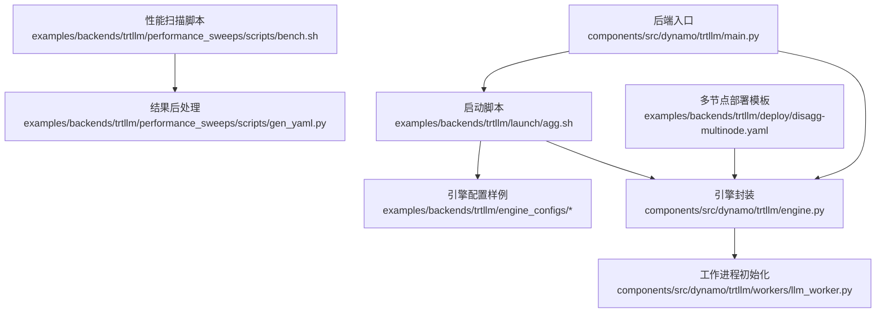
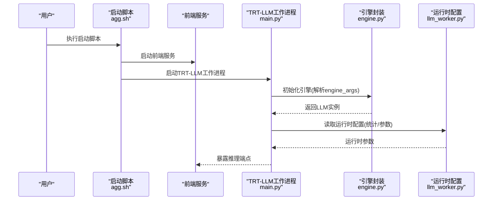
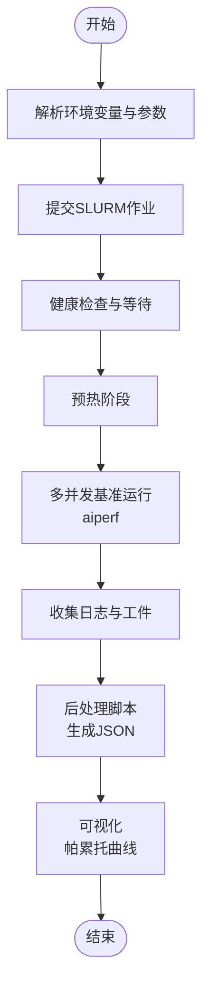
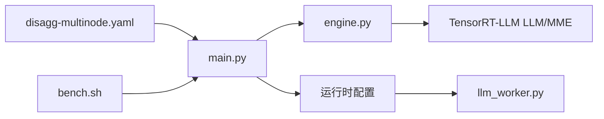

# TensorRT-LLM集成示例

<cite>
**本文引用的文件**
- [components/src/dynamo/trtllm/main.py](file://components/src/dynamo/trtllm/main.py)
- [components/src/dynamo/trtllm/engine.py](file://components/src/dynamo/trtllm/engine.py)
- [components/src/dynamo/trtllm/workers/llm_worker.py](file://components/src/dynamo/trtllm/workers/llm_worker.py)
- [examples/backends/trtllm/engine_configs/gemma3/vswa_agg.yaml](file://examples/backends/trtllm/engine_configs/gemma3/vswa_agg.yaml)
- [examples/backends/trtllm/engine_configs/llama4/eagle/eagle_agg.yml](file://examples/backends/trtllm/engine_configs/llama4/eagle/eagle_agg.yml)
- [examples/backends/trtllm/engine_configs/llava-v1.6-mistral-7b-hf/agg.yaml](file://examples/backends/trtllm/engine_configs/llava-v1.6-mistral-7b-hf/agg.yaml)
- [examples/backends/trtllm/launch/agg.sh](file://examples/backends/trtllm/launch/agg.sh)
- [examples/backends/trtllm/performance_sweeps/README.md](file://examples/backends/trtllm/performance_sweeps/README.md)
- [examples/backends/trtllm/performance_sweeps/scripts/bench.sh](file://examples/backends/trtllm/performance_sweeps/scripts/bench.sh)
- [examples/backends/trtllm/performance_sweeps/scripts/gen_yaml.py](file://examples/backends/trtllm/performance_sweeps/scripts/gen_yaml.py)
- [examples/backends/trtllm/deploy/disagg-multinode.yaml](file://examples/backends/trtllm/deploy/disagg-multinode.yaml)
- [benchmarks/llm/README.md](file://benchmarks/llm/README.md)
</cite>

## 目录
1. [简介](#简介)
2. [项目结构](#项目结构)
3. [核心组件](#核心组件)
4. [架构总览](#架构总览)
5. [详细组件分析](#详细组件分析)
6. [依赖关系分析](#依赖关系分析)
7. [性能考量](#性能考量)
8. [故障排查指南](#故障排查指南)
9. [结论](#结论)
10. [附录](#附录)

## 简介
本文件面向TensorRT-LLM后端在Dynamo平台中的集成与落地，系统性地覆盖以下主题：
- 引擎配置与部署：从单机聚合模式到多节点解耦模式，涵盖KV缓存、张量并行、流水线并行、注意力数据并行等关键参数。
- 高性能推理特性：滑动窗口注意力、Eagle推测解码、多模态处理等TensorRT-LLM特性的配置要点与最佳实践。
- 完整引擎配置示例：针对DeepSeek R1、Gemma3、LLaVA等典型模型的优化设置。
- 性能扫描与基准测试：从参数扫描、并发设置到结果后处理与可视化。
- 多节点部署：Kubernetes编排、分布式推理与负载均衡策略。
- CUDA优化与启动脚本：内存管理、内核优化、混合精度、性能监控与指标导出。

## 项目结构
围绕TensorRT-LLM后端的关键目录与文件如下：
- 后端运行入口与引擎封装：components/src/dynamo/trtllm/main.py、engine.py
- 工作进程与运行时配置：workers/llm_worker.py
- 引擎配置样例：examples/backends/trtllm/engine_configs/*
- 启动脚本：examples/backends/trtllm/launch/*
- 性能扫描与基准：examples/backends/trtllm/performance_sweeps/*
- 多节点部署模板：examples/backends/trtllm/deploy/disagg-multinode.yaml
- 基准测试说明：benchmarks/llm/README.md

**图表来源**
- [components/src/dynamo/trtllm/main.py](file://components/src/dynamo/trtllm/main.py#L1-L51)
- [components/src/dynamo/trtllm/engine.py](file://components/src/dynamo/trtllm/engine.py#L1-L171)
- [components/src/dynamo/trtllm/workers/llm_worker.py](file://components/src/dynamo/trtllm/workers/llm_worker.py#L70-L92)
- [examples/backends/trtllm/launch/agg.sh](file://examples/backends/trtllm/launch/agg.sh#L1-L71)
- [examples/backends/trtllm/performance_sweeps/scripts/bench.sh](file://examples/backends/trtllm/performance_sweeps/scripts/bench.sh#L1-L189)
- [examples/backends/trtllm/performance_sweeps/scripts/gen_yaml.py](file://examples/backends/trtllm/performance_sweeps/scripts/gen_yaml.py#L1-L427)
- [examples/backends/trtllm/deploy/disagg-multinode.yaml](file://examples/backends/trtllm/deploy/disagg-multinode.yaml#L1-L183)

**章节来源**
- [components/src/dynamo/trtllm/main.py](file://components/src/dynamo/trtllm/main.py#L1-L51)
- [components/src/dynamo/trtllm/engine.py](file://components/src/dynamo/trtllm/engine.py#L1-L171)
- [examples/backends/trtllm/launch/agg.sh](file://examples/backends/trtllm/launch/agg.sh#L1-L71)
- [examples/backends/trtllm/deploy/disagg-multinode.yaml](file://examples/backends/trtllm/deploy/disagg-multinode.yaml#L1-L183)

## 核心组件
- 后端入口与运行时
  - 入口函数负责解析命令行参数、创建运行时、初始化工作进程，并按uvloop事件循环运行。
  - 关键点：日志级别映射、运行时创建、异步生命周期管理。
- 引擎封装
  - 支持两种后端类型：PyTorch与自动部署（_autodeploy），并根据模式选择MultimodalEncoder或标准LLM实例化路径。
  - 提供注意力数据并行大小查询接口，便于路由与调度决策。
  - 上下文管理器负责初始化计时、记录加载耗时并在退出时清理资源。
- 工作进程运行时配置
  - 从引擎统计中提取KV块数量、最大批序列数、最大批内令牌数等运行时参数，用于动态调整运行配置。

**章节来源**
- [components/src/dynamo/trtllm/main.py](file://components/src/dynamo/trtllm/main.py#L1-L51)
- [components/src/dynamo/trtllm/engine.py](file://components/src/dynamo/trtllm/engine.py#L1-L171)
- [components/src/dynamo/trtllm/workers/llm_worker.py](file://components/src/dynamo/trtllm/workers/llm_worker.py#L70-L92)

## 架构总览
下图展示了从启动脚本到引擎实例化的端到端流程，以及多节点部署的组件关系。

**图表来源**
- [examples/backends/trtllm/launch/agg.sh](file://examples/backends/trtllm/launch/agg.sh#L55-L71)
- [components/src/dynamo/trtllm/main.py](file://components/src/dynamo/trtllm/main.py#L29-L46)
- [components/src/dynamo/trtllm/engine.py](file://components/src/dynamo/trtllm/engine.py#L55-L92)
- [components/src/dynamo/trtllm/workers/llm_worker.py](file://components/src/dynamo/trtllm/workers/llm_worker.py#L70-L92)

## 详细组件分析

### 引擎配置与部署
- 聚合模式配置要点
  - Gemma3滑动窗口注意力：通过KV缓存的最大注意力窗口数组实现不同层的窗口长度，以平衡长上下文与显存占用。
  - LLaVA文本-图像多模态：启用远程代码信任、分块预填充、缓存收发器后端等，确保多模态编码与解码协同。
- 推测解码配置（Eagle）
  - 在聚合配置中开启Eagle推测解码，指定草稿模型目录、最大草稿长度、是否使用单一模型等参数，结合CUDA Graph批尺寸列表提升吞吐。
- 多节点部署
  - 使用ConfigMap注入预填充与解码配置；通过DynamoGraphDeployment定义前端、预填充与解码工作进程的副本数、资源限制与多节点拓扑。
  - 通过卷挂载共享模型权重，支持从HuggingFace密钥拉取模型。

**章节来源**
- [examples/backends/trtllm/engine_configs/gemma3/vswa_agg.yaml](file://examples/backends/trtllm/engine_configs/gemma3/vswa_agg.yaml#L16-L27)
- [examples/backends/trtllm/engine_configs/llava-v1.6-mistral-7b-hf/agg.yaml](file://examples/backends/trtllm/engine_configs/llava-v1.6-mistral-7b-hf/agg.yaml#L15-L30)
- [examples/backends/trtllm/engine_configs/llama4/eagle/eagle_agg.yml](file://examples/backends/trtllm/engine_configs/llama4/eagle/eagle_agg.yml#L23-L39)
- [examples/backends/trtllm/deploy/disagg-multinode.yaml](file://examples/backends/trtllm/deploy/disagg-multinode.yaml#L8-L64)

### 启动脚本详解
- 脚本功能
  - 设置默认环境变量（模型路径、服务名、引擎参数文件、模态类型），支持可选的OpenTelemetry追踪开关。
  - 启动前端与TRT-LLM工作进程，传递模型路径、服务名、额外引擎参数及可选追踪端点。
- 性能监控
  - 当启用OTEL时，通过环境变量与引擎参数开启性能指标返回与导出端点，便于观测端到端延迟与吞吐。

**章节来源**
- [examples/backends/trtllm/launch/agg.sh](file://examples/backends/trtllm/launch/agg.sh#L1-L71)

### 性能扫描与基准测试
- 扫描流程
  - 使用SLURM提交聚合与解耦配置的基准作业，通过aiperf工具在不同并发水平下进行压力测试。
  - 健康检查确保服务就绪后再发起请求；支持流式响应与合成输入/输出令牌长度控制。
- 结果后处理与可视化
  - 生成JSON汇总文件，绘制帕累托曲线，对比聚合与解耦配置的GPU吞吐与用户吞吐表现。
- 参数生成器
  - 基于SLURM节点与任务分配信息，自动生成预填充与解码配置文件，支持注意力数据并行、MoE后端选择、MTP推测等参数组合。

**图表来源**
- [examples/backends/trtllm/performance_sweeps/README.md](file://examples/backends/trtllm/performance_sweeps/README.md#L18-L155)
- [examples/backends/trtllm/performance_sweeps/scripts/bench.sh](file://examples/backends/trtllm/performance_sweeps/scripts/bench.sh#L101-L182)
- [examples/backends/trtllm/performance_sweeps/scripts/gen_yaml.py](file://examples/backends/trtllm/performance_sweeps/scripts/gen_yaml.py#L12-L82)

**章节来源**
- [examples/backends/trtllm/performance_sweeps/README.md](file://examples/backends/trtllm/performance_sweeps/README.md#L18-L155)
- [examples/backends/trtllm/performance_sweeps/scripts/bench.sh](file://examples/backends/trtllm/performance_sweeps/scripts/bench.sh#L1-L189)
- [examples/backends/trtllm/performance_sweeps/scripts/gen_yaml.py](file://examples/backends/trtllm/performance_sweeps/scripts/gen_yaml.py#L1-L427)

### 多节点部署与负载均衡
- 组件拆分
  - 前端负责接入与路由；预填充（Prefill）与解码（Decode）工作进程分别承担上下文编码与增量生成，支持跨节点扩展。
- 资源与拓扑
  - 通过replicas与multinode.nodeCount控制规模；GPU资源限制与卷挂载保证模型权重共享。
- 负载均衡
  - 可结合MoE负载均衡槽位配置与路由策略，实现跨节点的任务均衡与容错。

**章节来源**
- [examples/backends/trtllm/deploy/disagg-multinode.yaml](file://examples/backends/trtllm/deploy/disagg-multinode.yaml#L76-L183)

### CUDA优化与运行时参数
- 内存管理
  - 通过KV缓存的GPU内存占比参数与块复用开关，平衡显存占用与访问效率。
- 内核与图优化
  - 启用CUDA Graph并配置批尺寸列表，显著降低调度开销，提升小批与尾延迟场景下的稳定吞吐。
- 混合精度
  - KV缓存与MoE后端的dtype选择（如FP8）与MoE后端切换（TRTLLM/WIDEEP/CUTLASS），在不同TP规模下取得更佳性能。

**章节来源**
- [examples/backends/trtllm/engine_configs/gemma3/vswa_agg.yaml](file://examples/backends/trtllm/engine_configs/gemma3/vswa_agg.yaml#L19-L27)
- [examples/backends/trtllm/engine_configs/llama4/eagle/eagle_agg.yml](file://examples/backends/trtllm/engine_configs/llama4/eagle/eagle_agg.yml#L34-L39)
- [examples/backends/trtllm/performance_sweeps/scripts/gen_yaml.py](file://examples/backends/trtllm/performance_sweeps/scripts/gen_yaml.py#L198-L203)

## 依赖关系分析
- 组件耦合
  - 后端入口依赖引擎封装；引擎封装根据后端类型与解耦模式选择实例化路径；工作进程从引擎统计中读取运行时参数。
- 外部依赖
  - TensorRT-LLM LLM/MultimodalEncoder、Dynamo运行时、Kubernetes CRD（DynamoGraphDeployment）、SLURM作业调度。

**图表来源**
- [components/src/dynamo/trtllm/main.py](file://components/src/dynamo/trtllm/main.py#L29-L46)
- [components/src/dynamo/trtllm/engine.py](file://components/src/dynamo/trtllm/engine.py#L55-L92)
- [components/src/dynamo/trtllm/workers/llm_worker.py](file://components/src/dynamo/trtllm/workers/llm_worker.py#L70-L92)
- [examples/backends/trtllm/deploy/disagg-multinode.yaml](file://examples/backends/trtllm/deploy/disagg-multinode.yaml#L76-L183)
- [examples/backends/trtllm/performance_sweeps/scripts/bench.sh](file://examples/backends/trtllm/performance_sweeps/scripts/bench.sh#L101-L182)

**章节来源**
- [components/src/dynamo/trtllm/main.py](file://components/src/dynamo/trtllm/main.py#L1-L51)
- [components/src/dynamo/trtllm/engine.py](file://components/src/dynamo/trtllm/engine.py#L1-L171)
- [components/src/dynamo/trtllm/workers/llm_worker.py](file://components/src/dynamo/trtllm/workers/llm_worker.py#L70-L92)
- [examples/backends/trtllm/deploy/disagg-multinode.yaml](file://examples/backends/trtllm/deploy/disagg-multinode.yaml#L1-L183)
- [examples/backends/trtllm/performance_sweeps/scripts/bench.sh](file://examples/backends/trtllm/performance_sweeps/scripts/bench.sh#L1-L189)

## 性能考量
- 并发与批大小
  - 通过CUDA Graph批尺寸列表与最大批大小、最大批内令牌数参数，适配不同并发与请求长度分布。
- 注意力数据并行
  - 启用注意力数据并行时，关注张量并行规模对路由目标的影响，合理规划节点与GPU分配。
- MoE后端选择
  - 在高TP且启用注意力数据并行时，优先考虑WIDEEP；否则在TRTLLM与CUTLASS间权衡吞吐与稳定性。
- 预分段与KV缓存
  - 分块预填充与KV缓存的dtype与内存占比直接影响长上下文与显存占用的平衡。

**章节来源**
- [examples/backends/trtllm/engine_configs/llama4/eagle/eagle_agg.yml](file://examples/backends/trtllm/engine_configs/llama4/eagle/eagle_agg.yml#L16-L39)
- [examples/backends/trtllm/performance_sweeps/scripts/gen_yaml.py](file://examples/backends/trtllm/performance_sweeps/scripts/gen_yaml.py#L198-L203)

## 故障排查指南
- 健康检查失败
  - 健康检查脚本会轮询前端健康端点，若未发现预期端点或状态不健康，将终止基准运行。请检查前端与工作进程的日志定位问题。
- OOM与超时
  - 大型模型或高并发配置可能触发显存不足或作业超时。建议降低批大小、减少并发或调整KV缓存内存占比。
- 多节点任务分配
  - 若任务节点数量不足，生成配置时会报错。请检查SLURM环境变量与节点/任务分配是否匹配。

**章节来源**
- [examples/backends/trtllm/performance_sweeps/scripts/bench.sh](file://examples/backends/trtllm/performance_sweeps/scripts/bench.sh#L101-L134)
- [examples/backends/trtllm/performance_sweeps/README.md](file://examples/backends/trtllm/performance_sweeps/README.md#L150-L155)
- [examples/backends/trtllm/performance_sweeps/scripts/gen_yaml.py](file://examples/backends/trtllm/performance_sweeps/scripts/gen_yaml.py#L107-L120)

## 结论
本示例文档基于仓库中的实际实现与配置，系统性展示了TensorRT-LLM在Dynamo平台上的集成路径：从引擎封装、启动脚本、多模态与推测解码配置，到多节点部署与性能扫描。通过合理的KV缓存、CUDA Graph与MoE后端选择，可在不同模型与硬件平台上获得稳定的高吞吐与低延迟表现。建议在生产环境中结合具体硬件与流量特征，持续进行参数扫描与结果可视化，形成可复用的优化流水线。

## 附录
- 基准测试说明：当前LLM基准模块处于待完善状态，后续将补充更多指标与可视化能力。

**章节来源**
- [benchmarks/llm/README.md](file://benchmarks/llm/README.md#L1-L16)