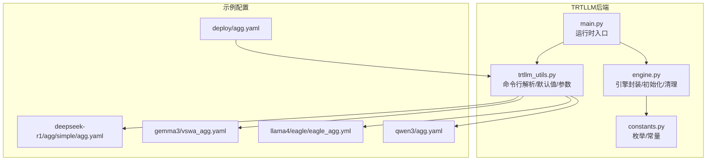
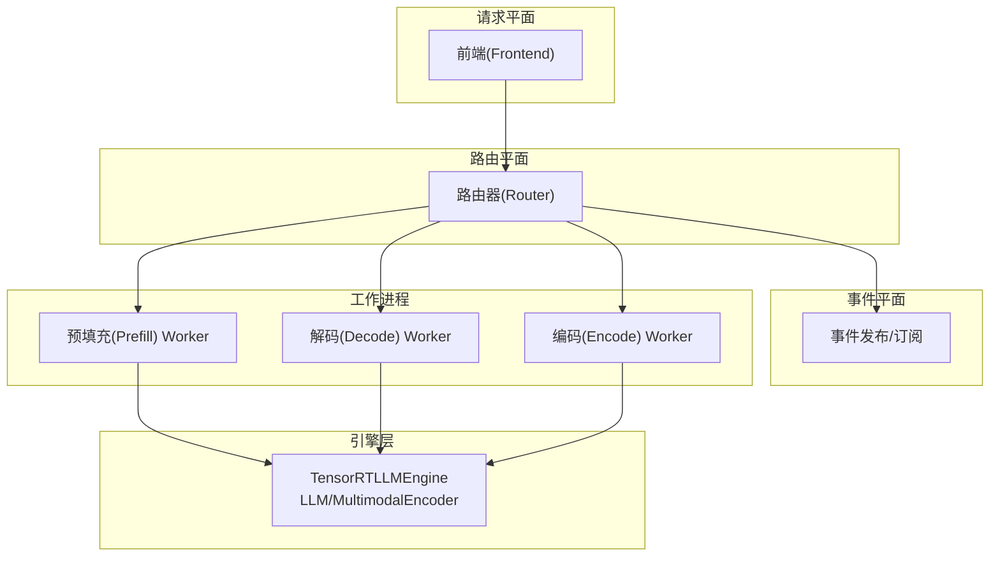
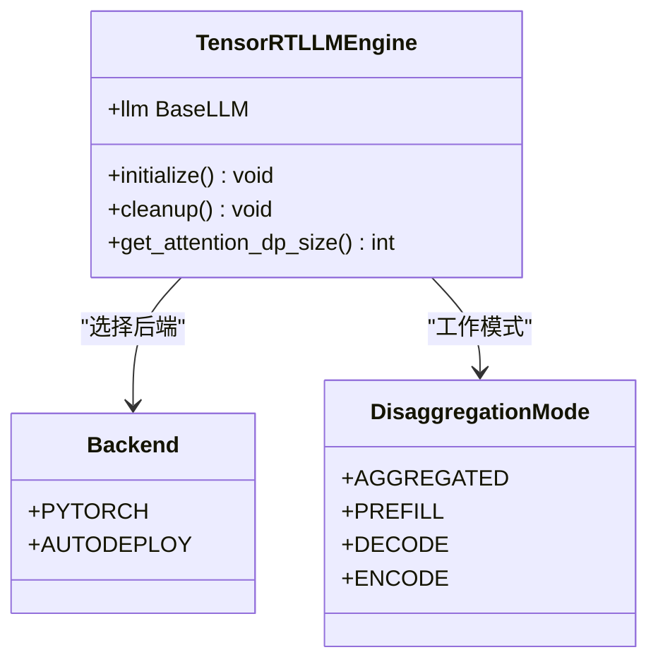
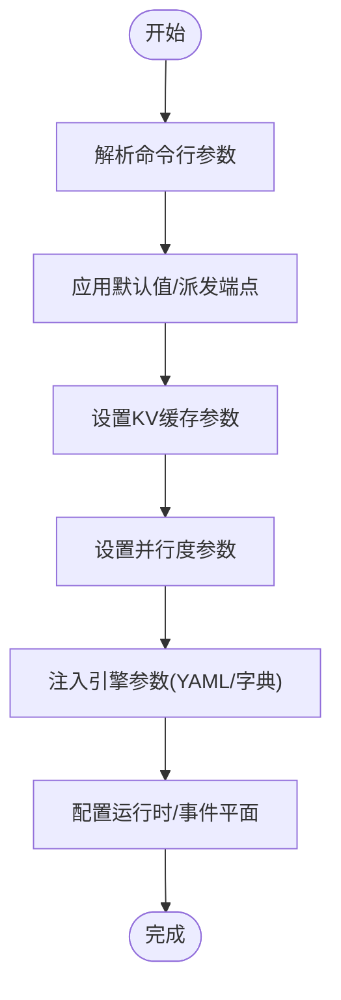
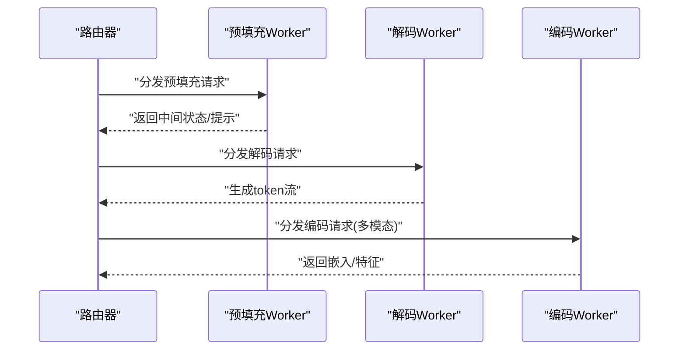
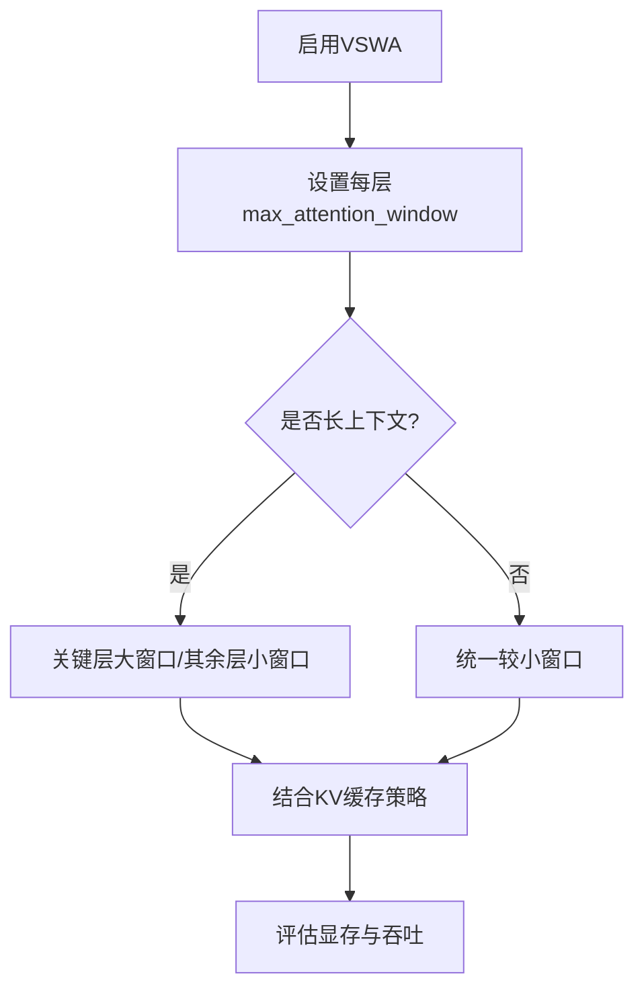
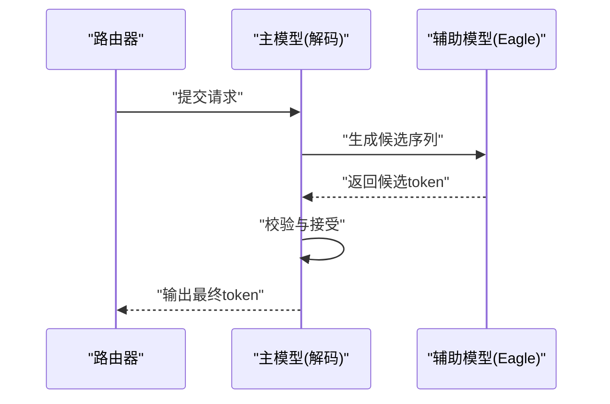
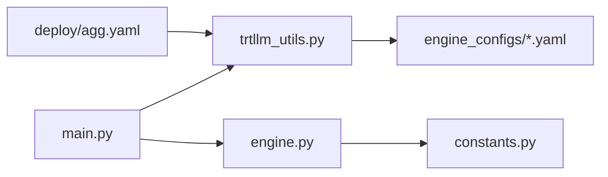

# TensorRT引擎配置

<cite>
**本文引用的文件**
- [engine.py](file://components/src/dynamo/trtllm/engine.py)
- [constants.py](file://components/src/dynamo/trtllm/constants.py)
- [trtllm_utils.py](file://components/src/dynamo/trtllm/utils/trtllm_utils.py)
- [main.py](file://components/src/dynamo/trtllm/main.py)
- [agg.yaml](file://examples/backends/trtllm/engine_configs/deepseek-r1/agg/simple/agg.yaml)
- [vswa_agg.yaml](file://examples/backends/trtllm/engine_configs/gemma3/vswa_agg.yaml)
- [eagle_agg.yml](file://examples/backends/trtllm/engine_configs/llama4/eagle/eagle_agg.yml)
- [qwen3_agg.yaml](file://examples/backends/trtllm/engine_configs/qwen3/agg.yaml)
- [agg.yaml](file://examples/backends/trtllm/deploy/agg.yaml)
</cite>

## 目录
1. [简介](#简介)
2. [项目结构](#项目结构)
3. [核心组件](#核心组件)
4. [架构总览](#架构总览)
5. [详细组件分析](#详细组件分析)
6. [依赖关系分析](#依赖关系分析)
7. [性能考量](#性能考量)
8. [故障排查指南](#故障排查指南)
9. [结论](#结论)
10. [附录：完整配置参数参考](#附录完整配置参数参考)

## 简介
本文件面向使用 TensorRT-LLM 后端的工程师与运维人员，系统化梳理在 Dynamo 平台中进行 TensorRT 引擎配置的方法论与实践。内容覆盖以下主题：
- 不同模型架构的引擎配置示例：DeepSeek R1、Gemma3、LLaMA4 等
- 聚合模式与分割式模式的区别及适用场景
- 滑动窗口注意力（VSWA）配置要点与性能影响
- Eagle 推测解码配置：主模型与辅助模型参数
- 多种精度模式（FP16、FP8、INT8）的配置与性能权衡
- 内存优化：KV 缓存大小与显存管理策略
- 多 GPU 配置：数据并行与张量并行设置
- 完整配置参数参考与调优建议（批大小、序列长度、推理参数）

## 项目结构
围绕 TensorRT-LLM 后端的关键模块与配置示例如下：
- 组件入口与运行时：main.py、trtllm_utils.py
- 引擎封装与生命周期：engine.py
- 枚举与常量：constants.py
- 示例配置：examples/backends/trtllm/engine_configs 下各模型的 YAML 配置
- 部署编排：examples/backends/trtllm/deploy 下的 Kubernetes 清单

**图表来源**
- [main.py](file://components/src/dynamo/trtllm/main.py#L1-L51)
- [trtllm_utils.py](file://components/src/dynamo/trtllm/utils/trtllm_utils.py#L1-L613)
- [engine.py](file://components/src/dynamo/trtllm/engine.py#L1-L171)
- [constants.py](file://components/src/dynamo/trtllm/constants.py#L1-L58)
- [agg.yaml](file://examples/backends/trtllm/engine_configs/deepseek-r1/agg/simple/agg.yaml#L1-L57)
- [vswa_agg.yaml](file://examples/backends/trtllm/engine_configs/gemma3/vswa_agg.yaml#L1-L27)
- [eagle_agg.yml](file://examples/backends/trtllm/engine_configs/llama4/eagle/eagle_agg.yml#L1-L40)
- [qwen3_agg.yaml](file://examples/backends/trtllm/engine_configs/qwen3/agg.yaml#L1-L34)
- [agg.yaml](file://examples/backends/trtllm/deploy/agg.yaml#L1-L38)

**章节来源**
- [main.py](file://components/src/dynamo/trtllm/main.py#L1-L51)
- [trtllm_utils.py](file://components/src/dynamo/trtllm/utils/trtllm_utils.py#L1-L613)
- [engine.py](file://components/src/dynamo/trtllm/engine.py#L1-L171)
- [constants.py](file://components/src/dynamo/trtllm/constants.py#L1-L58)
- [agg.yaml](file://examples/backends/trtllm/engine_configs/deepseek-r1/agg/simple/agg.yaml#L1-L57)
- [vswa_agg.yaml](file://examples/backends/trtllm/engine_configs/gemma3/vswa_agg.yaml#L1-L27)
- [eagle_agg.yml](file://examples/backends/trtllm/engine_configs/llama4/eagle/eagle_agg.yml#L1-L40)
- [qwen3_agg.yaml](file://examples/backends/trtllm/engine_configs/qwen3/agg.yaml#L1-L34)
- [agg.yaml](file://examples/backends/trtllm/deploy/agg.yaml#L1-L38)

## 核心组件
- 命令行与默认参数：trtllm_utils.py 提供统一的参数解析、默认端点、默认模型路径、并支持从 YAML/字典覆盖引擎参数。
- 引擎封装：engine.py 将 TRT-LLM 的 LLM/MultimodalEncoder 封装为可异步管理的引擎实例，支持聚合/预填充/解码/编码四种模式。
- 枚举与常量：constants.py 定义了聚合/预填充/解码/编码等模式，以及文本/多模态/扩散等模态类型。

关键职责与交互：
- main.py 负责解析环境日志级别、创建运行时、初始化工作进程。
- trtllm_utils.py 负责参数解析、默认值设定、端点派发、KV 事件开关、自定义模板等。
- engine.py 负责根据模式选择 LLM 或 MultimodalEncoder 初始化，支持自动部署后端参数裁剪。

**章节来源**
- [trtllm_utils.py](file://components/src/dynamo/trtllm/utils/trtllm_utils.py#L1-L613)
- [engine.py](file://components/src/dynamo/trtllm/engine.py#L1-L171)
- [constants.py](file://components/src/dynamo/trtllm/constants.py#L1-L58)
- [main.py](file://components/src/dynamo/trtllm/main.py#L1-L51)

## 架构总览
下图展示了 TRTLLM 后端在 Dynamo 中的运行时架构与关键组件交互：

**图表来源**
- [main.py](file://components/src/dynamo/trtllm/main.py#L1-L51)
- [engine.py](file://components/src/dynamo/trtllm/engine.py#L1-L171)
- [trtllm_utils.py](file://components/src/dynamo/trtllm/utils/trtllm_utils.py#L1-L613)

## 详细组件分析

### 引擎封装与生命周期（TensorRTLLMEngine）
- 支持后端类型：PyTorch 与自动部署（_autodeploy），后者会裁剪不支持的参数。
- 支持四种工作模式：聚合、预填充、解码、编码；编码模式使用 MultimodalEncoder。
- 提供注意力数据并行（attention_dp）相关查询接口，便于路由决策。
- 生命周期：异步初始化与清理，记录加载耗时并上报指标。

**图表来源**
- [engine.py](file://components/src/dynamo/trtllm/engine.py#L1-L171)
- [constants.py](file://components/src/dynamo/trtllm/constants.py#L1-L58)

**章节来源**
- [engine.py](file://components/src/dynamo/trtllm/engine.py#L1-L171)
- [constants.py](file://components/src/dynamo/trtllm/constants.py#L1-L58)

### 命令行参数与默认值（Config）
- 默认端点：根据模态与模式自动派发到 decode/aggregated、prefill、encode 或 diffusion 组件。
- 关键参数：
  - 并行度：tensor_parallel_size、pipeline_parallel_size、expert_parallel_size、enable_attention_dp
  - KV 缓存：kv_block_size、free_gpu_memory_fraction、kv_cache_config
  - 推理约束：max_batch_size、max_num_tokens、max_seq_len、max_beam_width
  - 引擎参数注入：extra_engine_args（YAML）、override_engine_args（字典字符串）
  - 运行时开关：publish_events_and_metrics、use_kv_events、store_kv、request_plane、event_plane
  - 模态与多模态：modality、encode_endpoint、allowed_local_media_path、encoder_cache_capacity_gb
  - 自定义模板：custom_jinja_template
  - 扩展：diffusion 相关参数（仅视频扩散）

**图表来源**
- [trtllm_utils.py](file://components/src/dynamo/trtllm/utils/trtllm_utils.py#L146-L597)

**章节来源**
- [trtllm_utils.py](file://components/src/dynamo/trtllm/utils/trtllm_utils.py#L1-L613)

### 聚合模式 vs 分割式模式
- 聚合模式（AGGREGATED）：预填充与解码在同一工作进程中执行，适合低延迟、小规模部署。
- 分割式模式（PREFILL/DECODE/ENCODE）：将预填充、解码、编码分别部署为独立工作进程，适合高并发、长序列、多模态场景。
- 注意：编码模式使用 MultimodalEncoder，构造参数与 LLM 不完全一致，需按模式传参。

**图表来源**
- [constants.py](file://components/src/dynamo/trtllm/constants.py#L12-L19)
- [engine.py](file://components/src/dynamo/trtllm/engine.py#L55-L78)

**章节来源**
- [constants.py](file://components/src/dynamo/trtllm/constants.py#L1-L58)
- [engine.py](file://components/src/dynamo/trtllm/engine.py#L1-L171)

### 滑动窗口注意力（VSWA）配置
- VSWA 通过 kv_cache_config 中的 max_attention_window 对每个层设置不同的注意力窗口，从而在长上下文场景下控制计算与显存开销。
- 配置要点：
  - 为关键层设置较大的窗口以保留长期依赖，其余层保持较小窗口以节省显存。
  - 结合 free_gpu_memory_fraction 与批大小、序列长度进行权衡。
- 性能影响：
  - 更大的窗口提升长程建模能力但增加显存占用与计算复杂度。
  - 在高并发场景下，需谨慎设置窗口与 free_gpu_memory_fraction，避免 OOM。

**图表来源**
- [vswa_agg.yaml](file://examples/backends/trtllm/engine_configs/gemma3/vswa_agg.yaml#L19-L27)

**章节来源**
- [vswa_agg.yaml](file://examples/backends/trtllm/engine_configs/gemma3/vswa_agg.yaml#L1-L27)

### Eagle 推测解码配置
- 主要参数：
  - decoding_type: 设置为 Eagle
  - max_draft_len: 推测长度
  - speculative_model_dir: 辅助模型目录
  - eagle3_one_model: 是否使用单体辅助模型
- 典型配置要点：
  - 适当提高 max_batch_size 与 max_num_tokens 以匹配推测解码的批处理需求。
  - 调整 cuda_graph_config 的 batch_sizes，覆盖高并发场景下的批大小。
  - 在高并发场景下调低 free_gpu_memory_fraction 以保证足够的可用显存。

**图表来源**
- [eagle_agg.yml](file://examples/backends/trtllm/engine_configs/llama4/eagle/eagle_agg.yml#L23-L38)

**章节来源**
- [eagle_agg.yml](file://examples/backends/trtllm/engine_configs/llama4/eagle/eagle_agg.yml#L1-L40)

### 不同模型架构的引擎配置示例

#### DeepSeek R1（聚合模式）
- 并行度：tensor_parallel_size、moe_expert_parallel_size
- 批处理与序列：max_batch_size、max_num_tokens、max_seq_len
- KV 缓存：free_gpu_memory_fraction、dtype（FP8）
- CUDA Graph：启用 padding，覆盖常见批大小集合
- 典型用途：大规模长序列推理，强调 FP8 降低显存占用

**章节来源**
- [agg.yaml](file://examples/backends/trtllm/engine_configs/deepseek-r1/agg/simple/agg.yaml#L1-L57)

#### Qwen3（聚合模式）
- 并行度：tensor_parallel_size、moe_expert_parallel_size
- 推理特性：enable_chunked_prefill 提升长上下文预填充效率
- KV 缓存：free_gpu_memory_fraction
- CUDA Graph：限制最大批大小
- 典型用途：中小规模部署，强调预填充分块与稳定性

**章节来源**
- [qwen3_agg.yaml](file://examples/backends/trtllm/engine_configs/qwen3/agg.yaml#L1-L34)

#### Gemma3（VSWA）
- KV 缓存：max_attention_window 逐层设置，实现滑动窗口注意力
- 典型用途：长上下文对话或检索增强场景

**章节来源**
- [vswa_agg.yaml](file://examples/backends/trtllm/engine_configs/gemma3/vswa_agg.yaml#L1-L27)

### 多 GPU 配置：数据并行与张量并行
- 张量并行（tensor_parallel_size）：将权重与计算切分到多个 GPU，提升吞吐。
- 专家并行（moe_expert_parallel_size）：MoE 模型的专家维度并行。
- 数据并行（attention_dp）：当启用时，注意力并行度等于张量并行大小，路由目标随之变化。
- 实践建议：
  - 小显存卡优先考虑张量并行与 MoE 专家并行组合。
  - 高并发场景下，注意 free_gpu_memory_fraction 与批大小的平衡。

**章节来源**
- [engine.py](file://components/src/dynamo/trtllm/engine.py#L94-L102)
- [agg.yaml](file://examples/backends/trtllm/engine_configs/deepseek-r1/agg/simple/agg.yaml#L17-L21)
- [qwen3_agg.yaml](file://examples/backends/trtllm/engine_configs/qwen3/agg.yaml#L15-L17)

### 精度模式（FP16、FP8、INT8）配置与对比
- FP8：通过 kv_cache_config.dtype 指定，显著降低显存占用，适合大规模长序列。
- INT8：通常通过构建阶段量化配置实现，仓库示例主要展示 FP8；如需 INT8，请参考 TRT-LLM 构建流程中的量化选项。
- FP16：默认精度，平衡性能与显存占用。
- 性能对比（通用指导）：
  - FP8：显存占用最低，吞吐略降，适合长上下文与高并发。
  - INT8：在部分硬件上可获得更高吞吐，但量化误差与校准成本较高。
  - FP16：最稳定，适用于对精度敏感的任务。

**章节来源**
- [agg.yaml](file://examples/backends/trtllm/engine_configs/deepseek-r1/agg/simple/agg.yaml#L34)

### 内存优化：KV 缓存与显存管理
- KV 缓存块大小（kv_block_size）：影响分配粒度与回收效率。
- 可用显存比例（free_gpu_memory_fraction）：在模型权重与缓冲之后保留的比例，用于 KV 缓存。
- 窗口与块策略：结合 VSWA 与块复用（enable_block_reuse）减少碎片化。
- 实践建议：
  - 高并发长会话：增大 free_gpu_memory_fraction，配合 VSWA 与块复用。
  - 高批处理：适当降低 free_gpu_memory_fraction，确保足够显存容纳 KV。

**章节来源**
- [trtllm_utils.py](file://components/src/dynamo/trtllm/utils/trtllm_utils.py#L199-L238)
- [vswa_agg.yaml](file://examples/backends/trtllm/engine_configs/gemma3/vswa_agg.yaml#L19-L27)
- [eagle_agg.yml](file://examples/backends/trtllm/engine_configs/llama4/eagle/eagle_agg.yml#L30-L32)

### 部署与运行时集成
- Kubernetes 清单示例：通过 extra_engine_args 指向具体 YAML 配置文件，实现一键部署。
- 运行时参数：可通过命令行覆盖 YAML 中的参数，满足不同环境差异。

**章节来源**
- [agg.yaml](file://examples/backends/trtllm/deploy/agg.yaml#L36-L37)
- [trtllm_utils.py](file://components/src/dynamo/trtllm/utils/trtllm_utils.py#L240-L251)

## 依赖关系分析
- 组件耦合：
  - main.py 依赖 trtllm_utils.py 进行参数解析与运行时创建。
  - engine.py 依赖 constants.py 的模式枚举，并根据模式选择 LLM 或 MultimodalEncoder。
  - trtllm_utils.py 提供 Config 类，承载所有运行时参数，默认值与派发逻辑。
- 外部依赖：
  - TRT-LLM LLM/MultimodalEncoder API。
  - Dynamo 运行时（请求平面、事件平面、KV 存储）。

**图表来源**
- [main.py](file://components/src/dynamo/trtllm/main.py#L1-L51)
- [trtllm_utils.py](file://components/src/dynamo/trtllm/utils/trtllm_utils.py#L1-L613)
- [engine.py](file://components/src/dynamo/trtllm/engine.py#L1-L171)
- [constants.py](file://components/src/dynamo/trtllm/constants.py#L1-L58)
- [agg.yaml](file://examples/backends/trtllm/deploy/agg.yaml#L1-L38)

**章节来源**
- [main.py](file://components/src/dynamo/trtllm/main.py#L1-L51)
- [trtllm_utils.py](file://components/src/dynamo/trtllm/utils/trtllm_utils.py#L1-L613)
- [engine.py](file://components/src/dynamo/trtllm/engine.py#L1-L171)
- [constants.py](file://components/src/dynamo/trtllm/constants.py#L1-L58)
- [agg.yaml](file://examples/backends/trtllm/deploy/agg.yaml#L1-L38)

## 性能考量
- 批大小与序列长度：
  - 增大批大小可提升吞吐，但需关注显存与 KV 缓存占用。
  - 序列长度过长会显著增加 KV 缓存与注意力计算成本，建议结合 VSWA 与块复用。
- 并行度与拓扑：
  - 张量并行与 MoE 专家并行适合大模型与长序列。
  - 启用注意力数据并行会改变路由目标数量，需相应扩展副本数。
- 精度与图优化：
  - FP8 显存收益明显，但需验证任务精度要求。
  - CUDA Graph 批大小集需覆盖峰值场景，避免频繁重编译。
- 推测解码：
  - 合理设置 max_draft_len 与辅助模型目录，平衡吞吐与延迟。
  - 高并发场景下调低 free_gpu_memory_fraction，确保主/辅模型同时运行。

## 故障排查指南
- 初始化失败：
  - 检查模型路径与 served_model_name，确认 extra_engine_args 指向的 YAML 文件存在且格式正确。
  - 若使用自动部署后端，确认被裁剪的参数（如 scheduler_config、并行度相关字段）未传入。
- 显存不足（OOM）：
  - 降低 max_batch_size、max_num_tokens 或 max_seq_len。
  - 调整 free_gpu_memory_fraction，启用 VSWA 与块复用。
- 推测解码异常：
  - 校验 speculative_model_dir 是否可达，max_draft_len 是否合理。
  - 检查 cuda_graph_config 的批大小集合是否覆盖实际峰值。
- 日志与可观测性：
  - 通过 TLLM_LOG_LEVEL 与 Dynamo 日志级别联动，定位问题。
  - 开启 publish_events_and_metrics 以便事件平面追踪。

**章节来源**
- [engine.py](file://components/src/dynamo/trtllm/engine.py#L40-L51)
- [trtllm_utils.py](file://components/src/dynamo/trtllm/utils/trtllm_utils.py#L105-L136)
- [eagle_agg.yml](file://examples/backends/trtllm/engine_configs/llama4/eagle/eagle_agg.yml#L23-L38)

## 结论
本文基于仓库中的 TRTLLM 后端实现与示例配置，系统阐述了聚合/分割式模式、VSWA、Eagle 推测解码、多精度与多 GPU 配置方法，并提供了内存优化与部署集成的最佳实践。建议在生产环境中以“先稳定、后优化”的原则逐步调整参数，结合监控与基准测试持续迭代。

## 附录：完整配置参数参考
以下参数来源于命令行解析与 YAML 注入机制，涵盖推理、并行、KV 缓存、事件平面与运行时等关键领域。请结合具体模型与硬件条件进行调优。

- 基础参数
  - --model-path：模型路径或 HuggingFace 标识符
  - --served-model-name：服务名称（可选）
  - --endpoint：端点字符串（自动根据模式与模态派发）
  - --modality：text/multimodal/video_diffusion
  - --encode-endpoint：编码端点（多模态）
  - --allowed-local-media-path：允许访问的本地媒体路径
  - --max-file-size-mb：下载文件大小上限
  - --dyn-encoder-cache-capacity-gb：编码器缓存容量（GB）

- 并行与拓扑
  - --tensor-parallel-size：张量并行大小
  - --pipeline-parallel-size：流水线并行大小（可选）
  - --expert-parallel-size：专家并行大小（可选）
  - --enable-attention-dp：启用注意力数据并行

- 推理约束
  - --max-batch-size：最大批大小
  - --max-num-tokens：每批去除填充后的输入 token 数
  - --max-seq-len：单请求最大序列长度
  - --max-beam-width：束搜索宽度

- KV 缓存与内存
  - --kv-block-size：KV 缓存块大小
  - --free-gpu-memory-fraction：模型加载后保留的显存比例

- 引擎参数注入
  - --extra-engine-args：YAML 文件路径，作为额外引擎参数
  - --override-engine-args：字典字符串，覆盖 YAML 中的特定字段

- 运行时与事件
  - --publish-events-and-metrics：发布事件与指标
  - --disaggregation-mode：prefill_and_decode/prefill/decode/encode
  - --store-kv：键值存储后端（etcd/mem/file）
  - --request-plane：请求分发平面（nats/http/tcp）
  - --event-plane：事件发布平面（nats/zmq）
  - --durable-kv-events：启用持久化 KV 事件（JetStream）

- 自定义与模板
  - --custom-jinja-template：自定义聊天模板路径
  - --dyn-endpoint-types：启用的端点类型（chat/completions）

- 扩展（视频扩散）
  - --output-dir、--default-height、--default-width、--default-num-frames、--default-num-inference-steps、--default-guidance-scale
  - --enable-teacache、--teacache-thresh、--attn-type、--linear-type
  - --disable-torch-compile、--torch-compile-mode
  - --dit-dp-size、--dit-tp-size、--dit-ulysses-size、--dit-ring-size、--dit-cfg-size、--dit-fsdp-size、--enable-async-cpu-offload

- 示例与部署
  - 通过 --extra-engine-args 指向 engine_configs 下的 YAML 文件
  - Kubernetes 清单中通过 args 注入引擎参数

**章节来源**
- [trtllm_utils.py](file://components/src/dynamo/trtllm/utils/trtllm_utils.py#L146-L597)
- [agg.yaml](file://examples/backends/trtllm/deploy/agg.yaml#L36-L37)