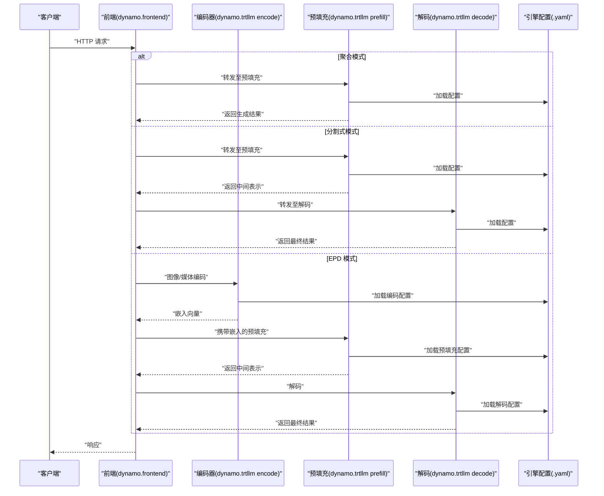
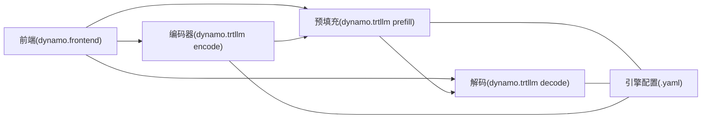

# 启动脚本详解

<cite>
**本文引用的文件**
- [examples/backends/trtllm/launch/agg.sh](file://examples/backends/trtllm/launch/agg.sh)
- [examples/backends/trtllm/launch/disagg.sh](file://examples/backends/trtllm/launch/disagg.sh)
- [examples/backends/trtllm/launch/epd_disagg.sh](file://examples/backends/trtllm/launch/epd_disagg.sh)
- [examples/backends/trtllm/launch/gpt_oss_disagg.sh](file://examples/backends/trtllm/launch/gpt_oss_disagg.sh)
- [examples/backends/trtllm/launch/agg_multimodal.sh](file://examples/backends/trtllm/launch/agg_multimodal.sh)
- [examples/backends/trtllm/launch/disagg_multimodal.sh](file://examples/backends/trtllm/launch/disagg_multimodal.sh)
- [examples/backends/trtllm/launch/epd_multimodal_image.sh](file://examples/backends/trtllm/launch/epd_multimodal_image.sh)
- [examples/backends/trtllm/launch/epd_multimodal_image_and_embeddings.sh](file://examples/backends/trtllm/launch/epd_multimodal_image_and_embeddings.sh)
- [examples/backends/trtllm/launch/agg_router.sh](file://examples/backends/trtllm/launch/agg_router.sh)
- [examples/backends/trtllm/launch/disagg_router.sh](file://examples/backends/trtllm/launch/disagg_router.sh)
- [examples/backends/trtllm/engine_configs/qwen3/agg.yaml](file://examples/backends/trtllm/engine_configs/qwen3/agg.yaml)
- [examples/backends/trtllm/engine_configs/qwen3/prefill.yaml](file://examples/backends/trtllm/engine_configs/qwen3/prefill.yaml)
- [examples/backends/trtllm/engine_configs/qwen3/decode.yaml](file://examples/backends/trtllm/engine_configs/qwen3/decode.yaml)
- [examples/backends/trtllm/engine_configs/llama4/multimodal/llama4-Scout/prefill.yaml](file://examples/backends/trtllm/engine_configs/llama4/multimodal/llama4-Scout/prefill.yaml)
- [examples/backends/trtllm/engine_configs/llama4/multimodal/llama4-Scout/decode.yaml](file://examples/backends/trtllm/engine_configs/llama4/multimodal/llama4-Scout/decode.yaml)
- [examples/backends/trtllm/engine_configs/llama4/multimodal/llama4-Scout/encode.yaml](file://examples/backends/trtllm/engine_configs/llama4/multimodal/llama4-Scout/encode.yaml)
- [examples/backends/trtllm/engine_configs/llava-v1.6-mistral-7b-hf/prefill.yaml](file://examples/backends/trtllm/engine_configs/llava-v1.6-mistral-7b-hf/prefill.yaml)
- [examples/backends/trtllm/engine_configs/llava-v1.6-mistral-7b-hf/decode.yaml](file://examples/backends/trtllm/engine_configs/llava-v1.6-mistral-7b-hf/decode.yaml)
- [examples/backends/trtllm/engine_configs/llava-v1.6-mistral-7b-hf/encode.yaml](file://examples/backends/trtllm/engine_configs/llava-v1.6-mistral-7b-hf/encode.yaml)
- [examples/backends/trtllm/engine_configs/gpt-oss-120b/prefill.yaml](file://examples/backends/trtllm/engine_configs/gpt-oss-120b/prefill.yaml)
- [examples/backends/trtllm/engine_configs/gpt-oss-120b/decode.yaml](file://examples/backends/trtllm/engine_configs/gpt-oss-120b/decode.yaml)
- [examples/backends/trtllm/templates/llava_multimodal.jinja](file://examples/backends/trtllm/templates/llava_multimodal.jinja)
</cite>

## 目录
1. [简介](#简介)
2. [项目结构](#项目结构)
3. [核心组件](#核心组件)
4. [架构总览](#架构总览)
5. [详细组件分析](#详细组件分析)
6. [依赖关系分析](#依赖关系分析)
7. [性能考虑](#性能考虑)
8. [故障排查指南](#故障排查指南)
9. [结论](#结论)
10. [附录](#附录)

## 简介
本指南面向使用 TensorRT-LLM 的工程团队与运维人员，系统讲解仓库中提供的各类启动脚本，覆盖以下主题：
- 聚合模式与分割式（解耦）模式的启动脚本差异与适用场景
- 多模态处理的启动配置，包括图像编码器与视觉模型初始化要点
- EPD（Embedding-Processing-Diffusion）模式的启动方法，涵盖嵌入处理与扩散模型配置
- GPT-OSSEngine 的启动配置，重点说明大模型推理的特殊参数
- 环境变量配置：CUDA 设备选择、内存分配与性能相关参数
- 日志级别与调试选项的配置方法
- 性能监控脚本的使用指南（GPU 利用率与显存使用）
- 错误处理与优雅重启策略
- 批量启动与并行部署的脚本编写思路

## 项目结构
本指南聚焦 examples/backends/trtllm/launch 目录下的启动脚本，以及对应 engine_configs 中的引擎配置文件。这些脚本通过统一的前端服务（dynamo.frontend）与 TRT-LLM 工作进程（dynamo.trtllm）组合，实现从预填充（prefill）到解码（decode）的完整推理链路；在多模态与 EPD 模式下，还引入了独立的 encode 工作进程。

```mermaid
graph TB
subgraph "启动脚本"
AGG["聚合模式<br/>agg.sh"]
DISAGG["分割式模式<br/>disagg.sh"]
EPD["EPD 模式<br/>epd_disagg.sh"]
GPT_OSS["GPT-OSSEngine<br/>gpt_oss_disagg.sh"]
AGG_MM["聚合多模态<br/>agg_multimodal.sh"]
DISAGG_MM["分割式多模态<br/>disagg_multimodal.sh"]
EPD_IMG["EPD 图像多模态<br/>epd_multimodal_image.sh"]
EPD_EMB["EPD 嵌入+图像<br/>epd_multimodal_image_and_embeddings.sh"]
AGG_ROUTER["聚合路由模式<br/>agg_router.sh"]
DISAGG_ROUTER["分割式路由模式<br/>disagg_router.sh"]
end
subgraph "引擎配置"
CFG_Q3_AGG["qwen3/agg.yaml"]
CFG_Q3_PREFILL["qwen3/prefill.yaml"]
CFG_Q3_DECODE["qwen3/decode.yaml"]
CFG_L4_PREFILL["llama4/multimodal/prefill.yaml"]
CFG_L4_DECODE["llama4/multimodal/decode.yaml"]
CFG_L4_ENCODE["llama4/multimodal/encode.yaml"]
CFG_L16_PREFILL["llava-v1.6-mistral-7b-hf/prefill.yaml"]
CFG_L16_DECODE["llava-v1.6-mistral-7b-hf/decode.yaml"]
CFG_L16_ENCODE["llava-v1.6-mistral-7b-hf/encode.yaml"]
CFG_GPT120_PREFILL["gpt-oss-120b/prefill.yaml"]
CFG_GPT120_DECODE["gpt-oss-120b/decode.yaml"]
TPL["llava_multimodal.jinja"]
end
AGG --> CFG_Q3_AGG
DISAGG --> CFG_Q3_PREFILL
DISAGG --> CFG_Q3_DECODE
EPD --> CFG_L4_PREFILL
EPD --> CFG_L4_DECODE
EPD --> CFG_L4_ENCODE
GPT_OSS --> CFG_GPT120_PREFILL
GPT_OSS --> CFG_GPT120_DECODE
AGG_MM --> CFG_Q3_AGG
DISAGG_MM --> CFG_L16_PREFILL
DISAGG_MM --> CFG_L16_DECODE
EPD_IMG --> CFG_L16_PREFILL
EPD_IMG --> CFG_L16_DECODE
EPD_IMG --> CFG_L16_ENCODE
EPD_EMB --> CFG_L16_PREFILL
EPD_EMB --> CFG_L16_DECODE
EPD_EMB --> CFG_L16_ENCODE
DISAGG_MM --> TPL
EPD_IMG --> TPL
EPD_EMB --> TPL
```

图示来源
- [examples/backends/trtllm/launch/agg.sh](file://examples/backends/trtllm/launch/agg.sh#L1-L71)
- [examples/backends/trtllm/launch/disagg.sh](file://examples/backends/trtllm/launch/disagg.sh#L1-L82)
- [examples/backends/trtllm/launch/epd_disagg.sh](file://examples/backends/trtllm/launch/epd_disagg.sh#L1-L66)
- [examples/backends/trtllm/launch/gpt_oss_disagg.sh](file://examples/backends/trtllm/launch/gpt_oss_disagg.sh#L1-L47)
- [examples/backends/trtllm/launch/agg_multimodal.sh](file://examples/backends/trtllm/launch/agg_multimodal.sh#L1-L35)
- [examples/backends/trtllm/launch/disagg_multimodal.sh](file://examples/backends/trtllm/launch/disagg_multimodal.sh#L1-L49)
- [examples/backends/trtllm/launch/epd_multimodal_image.sh](file://examples/backends/trtllm/launch/epd_multimodal_image.sh#L1-L63)
- [examples/backends/trtllm/launch/epd_multimodal_image_and_embeddings.sh](file://examples/backends/trtllm/launch/epd_multimodal_image_and_embeddings.sh#L1-L69)
- [examples/backends/trtllm/launch/agg_router.sh](file://examples/backends/trtllm/launch/agg_router.sh#L1-L32)
- [examples/backends/trtllm/launch/disagg_router.sh](file://examples/backends/trtllm/launch/disagg_router.sh#L1-L47)

章节来源
- [examples/backends/trtllm/launch/agg.sh](file://examples/backends/trtllm/launch/agg.sh#L1-L71)
- [examples/backends/trtllm/launch/disagg.sh](file://examples/backends/trtllm/launch/disagg.sh#L1-L82)
- [examples/backends/trtllm/launch/epd_disagg.sh](file://examples/backends/trtllm/launch/epd_disagg.sh#L1-L66)
- [examples/backends/trtllm/launch/gpt_oss_disagg.sh](file://examples/backends/trtllm/launch/gpt_oss_disagg.sh#L1-L47)
- [examples/backends/trtllm/launch/agg_multimodal.sh](file://examples/backends/trtllm/launch/agg_multimodal.sh#L1-L35)
- [examples/backends/trtllm/launch/disagg_multimodal.sh](file://examples/backends/trtllm/launch/disagg_multimodal.sh#L1-L49)
- [examples/backends/trtllm/launch/epd_multimodal_image.sh](file://examples/backends/trtllm/launch/epd_multimodal_image.sh#L1-L63)
- [examples/backends/trtllm/launch/epd_multimodal_image_and_embeddings.sh](file://examples/backends/trtllm/launch/epd_multimodal_image_and_embeddings.sh#L1-L69)
- [examples/backends/trtllm/launch/agg_router.sh](file://examples/backends/trtllm/launch/agg_router.sh#L1-L32)
- [examples/backends/trtllm/launch/disagg_router.sh](file://examples/backends/trtllm/launch/disagg_router.sh#L1-L47)

## 核心组件
- 前端服务（dynamo.frontend）：负责接收请求、路由与转发，支持普通与基于 KV 缓存的路由模式。
- TRT-LLM 工作进程（dynamo.trtllm）：执行实际的推理任务，支持聚合模式与三种解耦阶段（encode/prefill/decode）。
- 引擎配置（engine_configs/*.yaml）：定义模型路径、张量并行度、KV 缓存、批大小、最大 token 数等关键参数。
- 模板（templates/*.jinja）：用于多模态对话模板定制。

章节来源
- [examples/backends/trtllm/launch/agg.sh](file://examples/backends/trtllm/launch/agg.sh#L55-L71)
- [examples/backends/trtllm/launch/disagg.sh](file://examples/backends/trtllm/launch/disagg.sh#L58-L82)
- [examples/backends/trtllm/launch/epd_disagg.sh](file://examples/backends/trtllm/launch/epd_disagg.sh#L30-L66)
- [examples/backends/trtllm/launch/gpt_oss_disagg.sh](file://examples/backends/trtllm/launch/gpt_oss_disagg.sh#L16-L47)
- [examples/backends/trtllm/launch/agg_multimodal.sh](file://examples/backends/trtllm/launch/agg_multimodal.sh#L22-L35)
- [examples/backends/trtllm/launch/disagg_multimodal.sh](file://examples/backends/trtllm/launch/disagg_multimodal.sh#L26-L49)
- [examples/backends/trtllm/launch/epd_multimodal_image.sh](file://examples/backends/trtllm/launch/epd_multimodal_image.sh#L29-L63)
- [examples/backends/trtllm/launch/epd_multimodal_image_and_embeddings.sh](file://examples/backends/trtllm/launch/epd_multimodal_image_and_embeddings.sh#L31-L69)
- [examples/backends/trtllm/launch/agg_router.sh](file://examples/backends/trtllm/launch/agg_router.sh#L21-L32)
- [examples/backends/trtllm/launch/disagg_router.sh](file://examples/backends/trtllm/launch/disagg_router.sh#L24-L47)

## 架构总览
下图展示了不同模式下的组件交互与数据流：

图示来源
- [examples/backends/trtllm/launch/agg.sh](file://examples/backends/trtllm/launch/agg.sh#L55-L71)
- [examples/backends/trtllm/launch/disagg.sh](file://examples/backends/trtllm/launch/disagg.sh#L58-L82)
- [examples/backends/trtllm/launch/epd_disagg.sh](file://examples/backends/trtllm/launch/epd_disagg.sh#L30-L66)
- [examples/backends/trtllm/launch/epd_multimodal_image.sh](file://examples/backends/trtllm/launch/epd_multimodal_image.sh#L29-L63)
- [examples/backends/trtllm/launch/epd_multimodal_image_and_embeddings.sh](file://examples/backends/trtllm/launch/epd_multimodal_image_and_embeddings.sh#L31-L69)

## 详细组件分析

### 聚合模式（agg.sh）
- 适用场景：单机单 GPU 或小规模部署，简化部署与运维成本。
- 关键点：
  - 前端与工作进程在同一进程中运行或通过统一前端协调。
  - 通过 --extra-engine-args 指定聚合引擎配置文件。
  - 支持可选的 OpenTelemetry 追踪开关。
- 环境变量与参数：
  - DYNAMO_HOME、MODEL_PATH、SERVED_MODEL_NAME、AGG_ENGINE_ARGS、MODALITY。
  - 可选启用 OTEL 的命令行参数。
- 典型配置文件：qwen3/agg.yaml。

章节来源
- [examples/backends/trtllm/launch/agg.sh](file://examples/backends/trtllm/launch/agg.sh#L1-L71)
- [examples/backends/trtllm/engine_configs/qwen3/agg.yaml](file://examples/backends/trtllm/engine_configs/qwen3/agg.yaml)

### 分割式模式（disagg.sh）
- 适用场景：需要将预填充与解码阶段解耦，以优化吞吐与资源利用。
- 关键点：
  - 前端进程与两个独立的工作进程（prefill/decode）分别运行。
  - 通过 CUDA_VISIBLE_DEVICES 将不同阶段绑定到不同 GPU。
  - 通过 --disaggregation-mode 指定阶段。
- 环境变量与参数：
  - PREFILL_ENGINE_ARGS、DECODE_ENGINE_ARGS、PREFILL_CUDA_VISIBLE_DEVICES、DECODE_CUDA_VISIBLE_DEVICES、MODALITY。
  - 可选启用 OTEL 的命令行参数。
- 典型配置文件：qwen3/prefill.yaml、qwen3/decode.yaml。

章节来源
- [examples/backends/trtllm/launch/disagg.sh](file://examples/backends/trtllm/launch/disagg.sh#L1-L82)
- [examples/backends/trtllm/engine_configs/qwen3/prefill.yaml](file://examples/backends/trtllm/engine_configs/qwen3/prefill.yaml)
- [examples/backends/trtllm/engine_configs/qwen3/decode.yaml](file://examples/backends/trtllm/engine_configs/qwen3/decode.yaml)

### EPD 模式（epd_disagg.sh）
- 适用场景：多模态场景，需先进行嵌入（Embedding）处理，再进行扩散（Diffusion）相关的预填充与解码。
- 关键点：
  - 引入独立的 encode 工作进程，负责图像/媒体编码。
  - 通过 --encode-endpoint 将编码输出连接到预填充阶段。
  - 支持本地媒体路径与文件大小限制等安全参数。
- 环境变量与参数：
  - ENCODE_ENGINE_ARGS、ENCODE_CUDA_VISIBLE_DEVICES、ENCODE_ENDPOINT、ALLOWED_LOCAL_MEDIA_PATH、MAX_FILE_SIZE_MB、MODALITY。
- 典型配置文件：llama4/multimodal/encode.yaml、llama4/multimodal/prefill.yaml、llama4/multimodal/decode.yaml。

章节来源
- [examples/backends/trtllm/launch/epd_disagg.sh](file://examples/backends/trtllm/launch/epd_disagg.sh#L1-L66)
- [examples/backends/trtllm/engine_configs/llama4/multimodal/llama4-Scout/encode.yaml](file://examples/backends/trtllm/engine_configs/llama4/multimodal/llama4-Scout/encode.yaml)
- [examples/backends/trtllm/engine_configs/llama4/multimodal/llama4-Scout/prefill.yaml](file://examples/backends/trtllm/engine_configs/llama4/multimodal/llama4-Scout/prefill.yaml)
- [examples/backends/trtllm/engine_configs/llama4/multimodal/llama4-Scout/decode.yaml](file://examples/backends/trtllm/engine_configs/llama4/multimodal/llama4-Scout/decode.yaml)

### GPT-OSSEngine（gpt_oss_disagg.sh）
- 适用场景：大规模模型（如 gpt-oss-120B）的推理，强调工具调用解析与专家并行等高级特性。
- 关键点：
  - 使用 --dyn-reasoning-parser 与 --dyn-tool-call-parser 配置推理与工具调用解析器。
  - 通过 --max-num-tokens、--max-batch-size、--free-gpu-memory-fraction 控制资源占用与稳定性。
  - 通过 --tensor-parallel-size 与 --expert-parallel-size 控制并行度。
- 环境变量与参数：
  - MODEL_PATH、SERVED_MODEL_NAME、PREFILL_ENGINE_ARGS、DECODE_ENGINE_ARGS。
- 典型配置文件：gpt-oss-120b/prefill.yaml、gpt-oss-120b/decode.yaml。

章节来源
- [examples/backends/trtllm/launch/gpt_oss_disagg.sh](file://examples/backends/trtllm/launch/gpt_oss_disagg.sh#L1-L47)
- [examples/backends/trtllm/engine_configs/gpt-oss-120b/prefill.yaml](file://examples/backends/trtllm/engine_configs/gpt-oss-120b/prefill.yaml)
- [examples/backends/trtllm/engine_configs/gpt-oss-120b/decode.yaml](file://examples/backends/trtllm/engine_configs/gpt-oss-120b/decode.yaml)

### 聚合多模态（agg_multimodal.sh）
- 适用场景：单机多模态部署，适合中小规模与演示场景。
- 关键点：
  - 设置 MODALITY=multimodal，并通过 --publish-events-and-metrics 发布事件与指标。
  - 前端采用 KV 路由模式以提升缓存命中率。
- 环境变量与参数：
  - MODEL_PATH、SERVED_MODEL_NAME、AGG_ENGINE_ARGS、MODALITY。
- 典型配置文件：根据具体模型选择对应的聚合配置。

章节来源
- [examples/backends/trtllm/launch/agg_multimodal.sh](file://examples/backends/trtllm/launch/agg_multimodal.sh#L1-L35)

### 分割式多模态（disagg_multimodal.sh）
- 适用场景：多模态场景下的解耦部署，支持自定义 Jinja 模板。
- 关键点：
  - 通过 --custom-jinja-template 指定多模态对话模板。
  - 预填充与解码阶段分别绑定到不同 GPU。
- 环境变量与参数：
  - PREFILL_ENGINE_ARGS、DECODE_ENGINE_ARGS、PREFILL_CUDA_VISIBLE_DEVICES、DECODE_CUDA_VISIBLE_DEVICES、MODALITY、CUSTOM_TEMPLATE。
- 典型配置文件：llava-v1.6-mistral-7b-hf/prefill.yaml、llava-v1.6-mistral-7b-hf/decode.yaml。
- 模板文件：llava_multimodal.jinja。

章节来源
- [examples/backends/trtllm/launch/disagg_multimodal.sh](file://examples/backends/trtllm/launch/disagg_multimodal.sh#L1-L49)
- [examples/backends/trtllm/engine_configs/llava-v1.6-mistral-7b-hf/prefill.yaml](file://examples/backends/trtllm/engine_configs/llava-v1.6-mistral-7b-hf/prefill.yaml)
- [examples/backends/trtllm/engine_configs/llava-v1.6-mistral-7b-hf/decode.yaml](file://examples/backends/trtllm/engine_configs/llava-v1.6-mistral-7b-hf/decode.yaml)
- [examples/backends/trtllm/templates/llava_multimodal.jinja](file://examples/backends/trtllm/templates/llava_multimodal.jinja)

### EPD 多模态（图像）（epd_multimodal_image.sh）
- 适用场景：图像多模态的 EPD 流水线，编码、预填充、解码三段式。
- 关键点：
  - 三个阶段分别在不同 GPU 上运行。
  - 通过 --encode-endpoint 与 --custom-jinja-template 完成端到端集成。
- 环境变量与参数：
  - ENCODE_ENGINE_ARGS、PREFILL_ENGINE_ARGS、DECODE_ENGINE_ARGS、ENCODE_CUDA_VISIBLE_DEVICES、PREFILL_CUDA_VISIBLE_DEVICES、DECODE_CUDA_VISIBLE_DEVICES、ENCODE_ENDPOINT、MODALITY、CUSTOM_TEMPLATE。
- 典型配置文件：llava-v1.6-mistral-7b-hf/encode.yaml、prefill.yaml、decode.yaml。

章节来源
- [examples/backends/trtllm/launch/epd_multimodal_image.sh](file://examples/backends/trtllm/launch/epd_multimodal_image.sh#L1-L63)
- [examples/backends/trtllm/engine_configs/llava-v1.6-mistral-7b-hf/encode.yaml](file://examples/backends/trtllm/engine_configs/llava-v1.6-mistral-7b-hf/encode.yaml)
- [examples/backends/trtllm/engine_configs/llava-v1.6-mistral-7b-hf/prefill.yaml](file://examples/backends/trtllm/engine_configs/llava-v1.6-mistral-7b-hf/prefill.yaml)
- [examples/backends/trtllm/engine_configs/llava-v1.6-mistral-7b-hf/decode.yaml](file://examples/backends/trtllm/engine_configs/llava-v1.6-mistral-7b-hf/decode.yaml)

### EPD 多模态（嵌入+图像）（epd_multimodal_image_and_embeddings.sh）
- 适用场景：同时支持本地媒体与嵌入向量输入的多模态 EPD。
- 关键点：
  - 支持本地媒体路径与文件大小限制，增强安全性。
  - 与图像编码与解码流程一致，但增加了对嵌入输入的支持。
- 环境变量与参数：
  - ENCODE_ENGINE_ARGS、PREFILL_ENGINE_ARGS、DECODE_ENGINE_ARGS、ENCODE_CUDA_VISIBLE_DEVICES、PREFILL_CUDA_VISIBLE_DEVICES、DECODE_CUDA_VISIBLE_DEVICES、ENCODE_ENDPOINT、MODALITY、ALLOWED_LOCAL_MEDIA_PATH、MAX_FILE_SIZE_MB、CUSTOM_TEMPLATE。

章节来源
- [examples/backends/trtllm/launch/epd_multimodal_image_and_embeddings.sh](file://examples/backends/trtllm/launch/epd_multimodal_image_and_embeddings.sh#L1-L69)

### 聚合路由模式（agg_router.sh）
- 适用场景：需要发布事件与指标以便上层路由决策的聚合部署。
- 关键点：
  - 前端采用 KV 路由模式，便于缓存感知的路由。
  - 通过 --publish-events-and-metrics 发布事件与指标。
- 环境变量与参数：
  - MODEL_PATH、SERVED_MODEL_NAME、AGG_ENGINE_ARGS。

章节来源
- [examples/backends/trtllm/launch/agg_router.sh](file://examples/backends/trtllm/launch/agg_router.sh#L1-L32)

### 分割式路由模式（disagg_router.sh）
- 适用场景：预填充阶段发布事件与指标，供统一前端进行路由决策。
- 关键点：
  - 预填充阶段开启事件与指标发布，解码阶段无需重复发布。
  - 前端采用 KV 路由模式。
- 环境变量与参数：
  - PREFILL_ENGINE_ARGS、DECODE_ENGINE_ARGS、PREFILL_CUDA_VISIBLE_DEVICES、DECODE_CUDA_VISIBLE_DEVICES。

章节来源
- [examples/backends/trtllm/launch/disagg_router.sh](file://examples/backends/trtllm/launch/disagg_router.sh#L1-L47)

## 依赖关系分析
- 组件耦合：
  - 前端与工作进程之间通过统一的命名通道或内部通信机制协作。
  - EPD 模式下，encode 与 prefill 之间通过 --encode-endpoint 建立连接。
- 配置依赖：
  - 不同模型与场景对应不同的 engine_configs/*.yaml 文件。
  - 多模态场景依赖模板文件（如 llava_multimodal.jinja）。
- 并发与资源：
  - 分割式与 EPD 模式通过 CUDA_VISIBLE_DEVICES 将不同阶段绑定到不同 GPU，避免资源争用。

图示来源
- [examples/backends/trtllm/launch/disagg.sh](file://examples/backends/trtllm/launch/disagg.sh#L58-L82)
- [examples/backends/trtllm/launch/epd_disagg.sh](file://examples/backends/trtllm/launch/epd_disagg.sh#L30-L66)
- [examples/backends/trtllm/launch/epd_multimodal_image.sh](file://examples/backends/trtllm/launch/epd_multimodal_image.sh#L29-L63)

## 性能考虑
- 并行度与资源分配
  - 通过 --tensor-parallel-size 与 --expert-parallel-size 控制张量与专家并行度（适用于 GPT-OSSEngine）。
  - 通过 --free-gpu-memory-fraction 控制空闲显存比例，避免 OOM。
  - 通过 --max-num-tokens 与 --max-batch-size 控制单次推理规模。
- 设备绑定
  - 使用 CUDA_VISIBLE_DEVICES 将不同阶段绑定到不同 GPU，减少上下文切换与资源竞争。
- 路由与缓存
  - 在聚合路由模式与分割式路由模式中，启用 KV 路由可提升缓存命中率，降低重复计算。
- 监控与追踪
  - 可选启用 OTEL 追踪，导出性能指标与追踪信息，便于定位瓶颈。

章节来源
- [examples/backends/trtllm/launch/gpt_oss_disagg.sh](file://examples/backends/trtllm/launch/gpt_oss_disagg.sh#L20-L46)
- [examples/backends/trtllm/launch/disagg_router.sh](file://examples/backends/trtllm/launch/disagg_router.sh#L24-L47)
- [examples/backends/trtllm/launch/agg_router.sh](file://examples/backends/trtllm/launch/agg_router.sh#L21-L32)

## 故障排查指南
- 常见问题与建议
  - 进程退出与清理：所有脚本均设置 trap，在收到 EXIT/INT/TERM 信号时清理后台进程，确保资源释放。
  - 设备可见性：确认 CUDA_VISIBLE_DEVICES 与 GPU 卡号匹配，避免跨节点或权限问题。
  - 配置一致性：确保 --extra-engine-args 指向的 YAML 文件与模型版本一致。
  - 多模态安全：EPD 模式下合理设置 ALLOWED_LOCAL_MEDIA_PATH 与 MAX_FILE_SIZE_MB，防止异常文件导致资源耗尽。
  - OTEL 追踪：若启用 OTEL，检查导出端点与 JSONL 日志格式是否正确配置。
- 重启策略
  - 使用脚本内置的 trap 机制自动清理；生产环境建议结合外部进程管理器（如 systemd、Kubernetes）实现健康检查与自动重启。

章节来源
- [examples/backends/trtllm/launch/agg.sh](file://examples/backends/trtllm/launch/agg.sh#L14-L21)
- [examples/backends/trtllm/launch/disagg.sh](file://examples/backends/trtllm/launch/disagg.sh#L17-L24)
- [examples/backends/trtllm/launch/epd_disagg.sh](file://examples/backends/trtllm/launch/epd_disagg.sh#L20-L27)
- [examples/backends/trtllm/launch/gpt_oss_disagg.sh](file://examples/backends/trtllm/launch/gpt_oss_disagg.sh#L12-L13)

## 结论
- 聚合模式适合快速部署与小规模场景；分割式与 EPD 模式适合多模态与大规模推理，具备更强的扩展性与资源利用效率。
- 通过合理的环境变量与引擎配置，可以灵活控制并行度、内存与性能参数。
- 建议在生产环境中结合 KV 路由、事件与指标发布、OTEL 追踪与健康检查机制，构建稳定可靠的推理平台。

## 附录
- 环境变量清单（节选）
  - DYNAMO_HOME：工作目录前缀。
  - MODEL_PATH：模型路径或名称。
  - SERVED_MODEL_NAME：对外暴露的服务模型名。
  - AGG_ENGINE_ARGS/PREFILL_ENGINE_ARGS/DECODE_ENGINE_ARGS/ENCODE_ENGINE_ARGS：对应阶段的引擎配置文件路径。
  - PREFILL_CUDA_VISIBLE_DEVICES/DECODE_CUDA_VISIBLE_DEVICES/ENCODE_CUDA_VISIBLE_DEVICES：各阶段绑定的 GPU 列表。
  - MODALITY：文本或 multimodal。
  - ENCODE_ENDPOINT：编码器输出端点。
  - ALLOWED_LOCAL_MEDIA_PATH/MAX_FILE_SIZE_MB：本地媒体访问与大小限制。
  - CUSTOM_TEMPLATE：多模态对话模板路径。
  - OTEL 相关：OTEL_EXPORT_ENABLED、OTEL_EXPORTER_OTLP_TRACES_ENDPOINT、DYN_LOGGING_JSONL。
- 参数与标志（节选）
  - --disaggregation-mode：指定 prefill/decode/encode。
  - --dyn-reasoning-parser/--dyn-tool-call-parser：GPT-OSSEngine 特有解析器。
  - --max-num-tokens/--max-batch-size/--free-gpu-memory-fraction：资源与性能控制。
  - --tensor-parallel-size/--expert-parallel-size：并行度控制。
  - --encode-endpoint/--custom-jinja-template/--allowed-local-media-path/--max-file-size-mb：多模态与安全相关。
  - --publish-events-and-metrics：发布事件与指标。
  - --enable-otel：启用 OTEL 追踪。