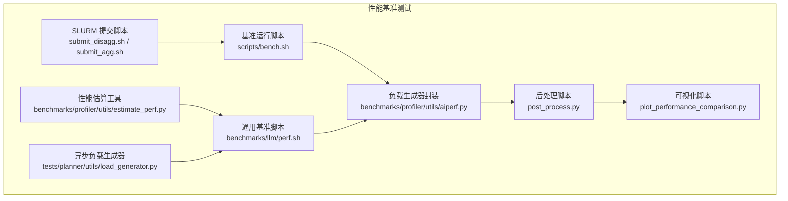
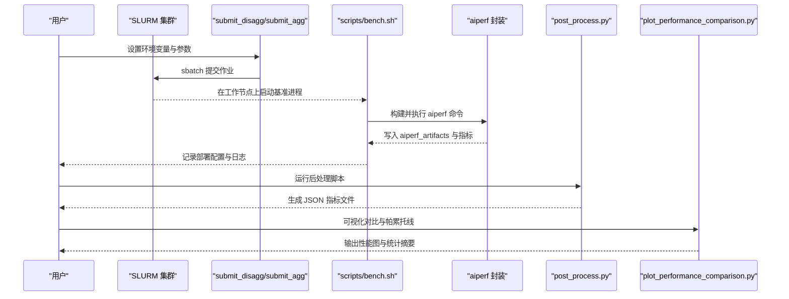
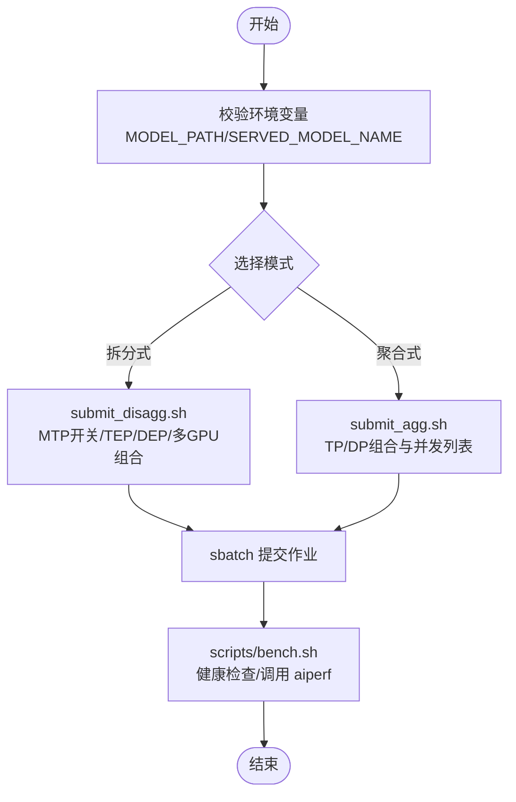
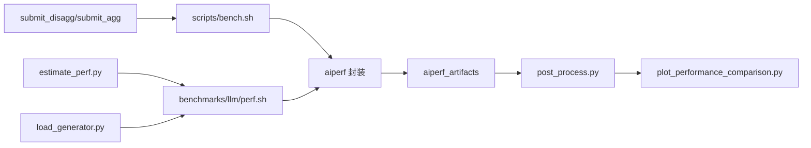

# 性能基准测试

<cite>
**本文引用的文件**
- [examples/backends/trtllm/performance_sweeps/README.md](file://examples/backends/trtllm/performance_sweeps/README.md)
- [examples/backends/trtllm/performance_sweeps/submit_disagg.sh](file://examples/backends/trtllm/performance_sweeps/submit_disagg.sh)
- [examples/backends/trtllm/performance_sweeps/submit_agg.sh](file://examples/backends/trtllm/performance_sweeps/submit_agg.sh)
- [examples/backends/trtllm/performance_sweeps/scripts/bench.sh](file://examples/backends/trtllm/performance_sweeps/scripts/bench.sh)
- [examples/backends/trtllm/performance_sweeps/post_process.py](file://examples/backends/trtllm/performance_sweeps/post_process.py)
- [examples/backends/trtllm/performance_sweeps/plot_performance_comparison.py](file://examples/backends/trtllm/performance_sweeps/plot_performance_comparison.py)
- [benchmarks/llm/perf.sh](file://benchmarks/llm/perf.sh)
- [benchmarks/profiler/utils/aiperf.py](file://benchmarks/profiler/utils/aiperf.py)
- [benchmarks/profiler/utils/estimate_perf.py](file://benchmarks/profiler/utils/estimate_perf.py)
- [tests/planner/utils/load_generator.py](file://tests/planner/utils/load_generator.py)
- [examples/backends/sglang/slurm_jobs/submit_disagg.sh](file://examples/backends/sglang/slurm_jobs/submit_disagg.sh)
- [examples/backends/sglang/slurm_jobs/parse.py](file://examples/backends/sglang/slurm_jobs/parse.py)
</cite>

## 目录
1. [简介](#简介)
2. [项目结构](#项目结构)
3. [核心组件](#核心组件)
4. [架构总览](#架构总览)
5. [详细组件分析](#详细组件分析)
6. [依赖关系分析](#依赖关系分析)
7. [性能考量](#性能考量)
8. [故障排查指南](#故障排查指南)
9. [结论](#结论)
10. [附录](#附录)

## 简介
本指南面向使用 TensorRT-LLM 的性能基准测试与参数扫描，覆盖以下目标：
- 完整的性能扫描流程：参数空间探索（并行度、批大小、并发等）与结果采集
- 聚合模式与拆分式（Disaggregated）模式的对比测试：吞吐量、延迟与 GPU 利用率测量
- SLURM 作业提交脚本详解：资源申请、任务调度与参数传递
- 性能测试脚本工作原理：负载生成器（aiperf）与结果解析
- 不同模型规模的基准测试方法：从小型到超大模型
- 多配置组合的自动化测试：配置生成与批量执行
- 结果分析：统计指标、可视化与瓶颈定位
- 测试报告模板与结果解读

## 项目结构
本仓库中与 TensorRT-LLM 性能基准测试直接相关的目录与文件如下：
- examples/backends/trtllm/performance_sweeps：包含 SLURM 提交脚本、基准运行脚本、后处理与可视化脚本
- benchmarks/llm/perf.sh：通用 LLM 基准脚本，支持聚合/拆分两种模式的参数扫描
- benchmarks/profiler/utils/aiperf.py：封装 aiperf 命令、提取指标与错误处理
- benchmarks/profiler/utils/estimate_perf.py：基于 aiconfigurator 的性能估算工具
- tests/planner/utils/load_generator.py：异步负载生成器，用于自动化测试场景
- examples/backends/sglang/slurm_jobs：其他后端（如 SGLang）的 SLURM 提交与结果解析示例，便于对比

图表来源
- [examples/backends/trtllm/performance_sweeps/submit_disagg.sh](file://examples/backends/trtllm/performance_sweeps/submit_disagg.sh#L1-L298)
- [examples/backends/trtllm/performance_sweeps/submit_agg.sh](file://examples/backends/trtllm/performance_sweeps/submit_agg.sh#L1-L111)
- [examples/backends/trtllm/performance_sweeps/scripts/bench.sh](file://examples/backends/trtllm/performance_sweeps/scripts/bench.sh#L1-L189)
- [benchmarks/profiler/utils/aiperf.py](file://benchmarks/profiler/utils/aiperf.py#L1-L374)
- [examples/backends/trtllm/performance_sweeps/post_process.py](file://examples/backends/trtllm/performance_sweeps/post_process.py#L1-L357)
- [examples/backends/trtllm/performance_sweeps/plot_performance_comparison.py](file://examples/backends/trtllm/performance_sweeps/plot_performance_comparison.py#L1-L384)
- [benchmarks/llm/perf.sh](file://benchmarks/llm/perf.sh#L1-L271)
- [benchmarks/profiler/utils/estimate_perf.py](file://benchmarks/profiler/utils/estimate_perf.py#L1-L234)
- [tests/planner/utils/load_generator.py](file://tests/planner/utils/load_generator.py#L56-L192)

章节来源
- [examples/backends/trtllm/performance_sweeps/README.md](file://examples/backends/trtllm/performance_sweeps/README.md#L1-L155)

## 核心组件
- SLURM 提交脚本
  - 拆分式：submit_disagg.sh，支持 MTP 开关、TEP/DEP 模式与多 GPU 配置组合
  - 聚合式：submit_agg.sh，按 TP/DP 组合与并发列表提交作业
- 基准运行脚本：scripts/bench.sh，负责健康检查、调用 aiperf、写入部署配置与日志归档
- 负载生成器封装：benchmarks/profiler/utils/aiperf.py，统一构建 aiperf 命令、执行与结果解析
- 后处理与可视化：post_process.py 与 plot_performance_comparison.py，提取吞吐、用户维度指标并绘制帕累托曲线
- 通用基准脚本：benchmarks/llm/perf.sh，支持聚合/拆分模式、ISL/OSL、并发列表与部署标签
- 性能估算工具：benchmarks/profiler/utils/estimate_perf.py，基于 aiconfigurator 的静态估算
- 异步负载生成器：tests/planner/utils/load_generator.py，用于自动化测试中的请求速率与持续时间控制

章节来源
- [examples/backends/trtllm/performance_sweeps/submit_disagg.sh](file://examples/backends/trtllm/performance_sweeps/submit_disagg.sh#L1-L298)
- [examples/backends/trtllm/performance_sweeps/submit_agg.sh](file://examples/backends/trtllm/performance_sweeps/submit_agg.sh#L1-L111)
- [examples/backends/trtllm/performance_sweeps/scripts/bench.sh](file://examples/backends/trtllm/performance_sweeps/scripts/bench.sh#L1-L189)
- [benchmarks/profiler/utils/aiperf.py](file://benchmarks/profiler/utils/aiperf.py#L1-L374)
- [examples/backends/trtllm/performance_sweeps/post_process.py](file://examples/backends/trtllm/performance_sweeps/post_process.py#L1-L357)
- [examples/backends/trtllm/performance_sweeps/plot_performance_comparison.py](file://examples/backends/trtllm/performance_sweeps/plot_performance_comparison.py#L1-L384)
- [benchmarks/llm/perf.sh](file://benchmarks/llm/perf.sh#L1-L271)
- [benchmarks/profiler/utils/estimate_perf.py](file://benchmarks/profiler/utils/estimate_perf.py#L1-L234)
- [tests/planner/utils/load_generator.py](file://tests/planner/utils/load_generator.py#L56-L192)

## 架构总览
下图展示了从 SLURM 提交到结果可视化的完整流程。

图表来源
- [examples/backends/trtllm/performance_sweeps/submit_disagg.sh](file://examples/backends/trtllm/performance_sweeps/submit_disagg.sh#L187-L298)
- [examples/backends/trtllm/performance_sweeps/submit_agg.sh](file://examples/backends/trtllm/performance_sweeps/submit_agg.sh#L1-L111)
- [examples/backends/trtllm/performance_sweeps/scripts/bench.sh](file://examples/backends/trtllm/performance_sweeps/scripts/bench.sh#L101-L189)
- [benchmarks/profiler/utils/aiperf.py](file://benchmarks/profiler/utils/aiperf.py#L170-L374)
- [examples/backends/trtllm/performance_sweeps/post_process.py](file://examples/backends/trtllm/performance_sweeps/post_process.py#L268-L357)
- [examples/backends/trtllm/performance_sweeps/plot_performance_comparison.py](file://examples/backends/trtllm/performance_sweeps/plot_performance_comparison.py#L165-L384)

## 详细组件分析

### SLURM 提交流程（拆分式与聚合式）
- 拆分式（Disaggregated）
  - 支持 MTP 关闭/开启、TEP/DEP 模式与多 GPU 组合（4/8/16/32 GPUs）
  - 自动计算节点数与任务数，传入基准脚本
- 聚合式（Aggregated）
  - 按 TP/DP 组合与并发列表提交作业
  - 自动计算最大生成长度与节点数

图表来源
- [examples/backends/trtllm/performance_sweeps/submit_disagg.sh](file://examples/backends/trtllm/performance_sweeps/submit_disagg.sh#L1-L298)
- [examples/backends/trtllm/performance_sweeps/submit_agg.sh](file://examples/backends/trtllm/performance_sweeps/submit_agg.sh#L1-L111)
- [examples/backends/trtllm/performance_sweeps/scripts/bench.sh](file://examples/backends/trtllm/performance_sweeps/scripts/bench.sh#L101-L189)

章节来源
- [examples/backends/trtllm/performance_sweeps/submit_disagg.sh](file://examples/backends/trtllm/performance_sweeps/submit_disagg.sh#L44-L298)
- [examples/backends/trtllm/performance_sweeps/submit_agg.sh](file://examples/backends/trtllm/performance_sweeps/submit_agg.sh#L1-L111)

### 基准运行脚本（scripts/bench.sh）
- 健康检查：轮询 /health，等待服务就绪并检测端点可用性
- 部署配置：写入 deployment_config.json（kind、model、total_gpus）
- 负载生成：调用 aiperf profile，设置合成输入/输出长度、并发、请求计数、随机种子与制品目录
- 日志与归档：记录 worker 日志片段、保存节点列表

章节来源
- [examples/backends/trtllm/performance_sweeps/scripts/bench.sh](file://examples/backends/trtllm/performance_sweeps/scripts/bench.sh#L101-L189)

### 负载生成器封装（benchmarks/profiler/utils/aiperf.py）
- 统一封装 aiperf 命令构建（预填充/解码）、执行与结果解析
- 支持 DEP 场景下的 TTFT 修正（按波次数调整）
- 解码阶段提取 ITL 与每 GPU 吞吐

章节来源
- [benchmarks/profiler/utils/aiperf.py](file://benchmarks/profiler/utils/aiperf.py#L40-L374)

### 后处理与可视化（post_process.py / plot_performance_comparison.py）
- 后处理：从 aiperf_artifacts 中提取输出吞吐、每用户吞吐、每 GPU 吞吐，并汇总到 JSON
- 可视化：绘制用户吞吐 vs 每 GPU 吞吐散点图，叠加帕累托前沿；可标注最大差异点

章节来源
- [examples/backends/trtllm/performance_sweeps/post_process.py](file://examples/backends/trtllm/performance_sweeps/post_process.py#L122-L265)
- [examples/backends/trtllm/performance_sweeps/plot_performance_comparison.py](file://examples/backends/trtllm/performance_sweeps/plot_performance_comparison.py#L165-L384)

### 通用基准脚本（benchmarks/llm/perf.sh）
- 支持聚合/拆分模式、ISL/OSL、并发列表、URL、部署标签
- 自动创建制品目录、写入部署配置 JSON
- 使用 aiperf profile 执行多并发扫描

章节来源
- [benchmarks/llm/perf.sh](file://benchmarks/llm/perf.sh#L1-L271)

### 性能估算工具（benchmarks/profiler/utils/estimate_perf.py）
- 基于 aiconfigurator 的静态估算，支持 prefill/decode/full 模式
- 提供最大批大小与 KV 缓存上限估算，辅助参数空间设计

章节来源
- [benchmarks/profiler/utils/estimate_perf.py](file://benchmarks/profiler/utils/estimate_perf.py#L1-L234)

### 异步负载生成器（tests/planner/utils/load_generator.py）
- 以异步方式生成指定请求速率与持续时间的负载
- 使用 aiperf 子进程组，避免管道阻塞；超时强制清理子树

章节来源
- [tests/planner/utils/load_generator.py](file://tests/planner/utils/load_generator.py#L66-L192)

## 依赖关系分析
- 提交脚本依赖 SLURM 环境与容器镜像，向基准脚本传递模型路径、服务名、并发列表等参数
- 基准脚本依赖 aiperf 工具与健康检查接口，产出制品目录供后处理脚本解析
- 后处理脚本依赖 aiperf 的 CSV/JSON 指标文件，生成可用于可视化的 JSON
- 可视化脚本依赖 matplotlib，绘制对比图与帕累托线
- 通用基准脚本与性能估算工具可作为参数空间探索的前置指导

图表来源
- [examples/backends/trtllm/performance_sweeps/submit_disagg.sh](file://examples/backends/trtllm/performance_sweeps/submit_disagg.sh#L187-L298)
- [examples/backends/trtllm/performance_sweeps/submit_agg.sh](file://examples/backends/trtllm/performance_sweeps/submit_agg.sh#L1-L111)
- [examples/backends/trtllm/performance_sweeps/scripts/bench.sh](file://examples/backends/trtllm/performance_sweeps/scripts/bench.sh#L101-L189)
- [benchmarks/profiler/utils/aiperf.py](file://benchmarks/profiler/utils/aiperf.py#L170-L374)
- [examples/backends/trtllm/performance_sweeps/post_process.py](file://examples/backends/trtllm/performance_sweeps/post_process.py#L268-L357)
- [examples/backends/trtllm/performance_sweeps/plot_performance_comparison.py](file://examples/backends/trtllm/performance_sweeps/plot_performance_comparison.py#L165-L384)
- [benchmarks/llm/perf.sh](file://benchmarks/llm/perf.sh#L1-L271)
- [benchmarks/profiler/utils/estimate_perf.py](file://benchmarks/profiler/utils/estimate_perf.py#L1-L234)
- [tests/planner/utils/load_generator.py](file://tests/planner/utils/load_generator.py#L66-L192)

## 性能考量
- 参数空间探索
  - 并行度：TP/DP、MTP、TEP/DEP
  - 批大小与并发：结合最大批大小估算与 KV 上限
  - 输入/输出序列长度：ISL/OSL 对 TTFT 与吞吐影响显著
- 指标采集
  - 吞吐：输出 token 吞吐、每 GPU 吞吐、每用户吞吐
  - 延迟：TTFT、ITL
  - GPU 利用率：可通过外部监控工具（如 Prometheus/Grafana）补充
- 资源规划
  - 节点与任务数：根据 TP/DP 与每节点任务数自动计算
  - 超大模型：优先使用拆分式，合理设置 MTP 与专家负载均衡

## 故障排查指南
- 作业超时
  - aiperf 完成所有并发级别耗时较长，适当增加 SLURM 时间限制或减少并发范围
- OOM 错误
  - 减小批大小、并发或启用 MTP；检查 KV 缓存上限
- 健康检查失败
  - 确认服务端口、模型路径与容器镜像；查看 /health 返回内容
- 指标缺失
  - 检查 aiperf_artifacts 是否存在；确认 CSV/JSON 文件是否生成

章节来源
- [examples/backends/trtllm/performance_sweeps/README.md](file://examples/backends/trtllm/performance_sweeps/README.md#L150-L155)
- [examples/backends/trtllm/performance_sweeps/scripts/bench.sh](file://examples/backends/trtllm/performance_sweeps/scripts/bench.sh#L101-L133)

## 结论
通过 SLURM 提交脚本、基准运行脚本与 aiperf 负载生成器的协同，本仓库提供了从参数空间探索到结果可视化的完整链路。结合后处理与可视化脚本，可高效比较聚合与拆分式模式在吞吐、延迟与 GPU 利用率方面的表现，并为超大模型的参数设计提供估算与验证依据。

## 附录

### SLURM 作业提交脚本详解
- 拆分式提交脚本（submit_disagg.sh）
  - 支持 MTP 开关、TEP/DEP 模式与多 GPU 组合
  - 自动计算节点数与任务数，传参给基准脚本
- 聚合式提交脚本（submit_agg.sh）
  - 按 TP/DP 组合与并发列表提交作业
  - 自动计算最大生成长度与节点数

章节来源
- [examples/backends/trtllm/performance_sweeps/submit_disagg.sh](file://examples/backends/trtllm/performance_sweeps/submit_disagg.sh#L187-L298)
- [examples/backends/trtllm/performance_sweeps/submit_agg.sh](file://examples/backends/trtllm/performance_sweeps/submit_agg.sh#L1-L111)

### 性能测试脚本工作原理
- 负载生成器封装（aiperf.py）
  - 统一命令构建、执行与结果解析
  - 支持 DEP 场景 TTFT 修正与解码阶段 ITL/吞吐提取
- 通用基准脚本（perf.sh）
  - 支持聚合/拆分模式、ISL/OSL、并发列表与部署标签
  - 自动创建制品目录与部署配置 JSON

章节来源
- [benchmarks/profiler/utils/aiperf.py](file://benchmarks/profiler/utils/aiperf.py#L170-L374)
- [benchmarks/llm/perf.sh](file://benchmarks/llm/perf.sh#L1-L271)

### 不同模型规模的测试方法
- 小/中模型：优先使用聚合式，快速验证参数空间
- 超大模型：使用拆分式，结合 MTP 与专家负载均衡，逐步扩大并发与批大小
- 参数估算：利用性能估算工具（estimate_perf.py）确定最大批大小与 KV 上限

章节来源
- [benchmarks/profiler/utils/estimate_perf.py](file://benchmarks/profiler/utils/estimate_perf.py#L157-L234)

### 多配置组合的自动化测试
- 配置生成：通过提交脚本的参数组合自动生成多组配置
- 批量执行：SLURM 并行调度，基准脚本统一采集指标
- 结果汇总：后处理脚本统一解析，可视化脚本对比帕累托前沿

章节来源
- [examples/backends/trtllm/performance_sweeps/submit_disagg.sh](file://examples/backends/trtllm/performance_sweeps/submit_disagg.sh#L101-L284)
- [examples/backends/trtllm/performance_sweeps/submit_agg.sh](file://examples/backends/trtllm/performance_sweeps/submit_agg.sh#L50-L111)
- [examples/backends/trtllm/performance_sweeps/post_process.py](file://examples/backends/trtllm/performance_sweeps/post_process.py#L268-L357)
- [examples/backends/trtllm/performance_sweeps/plot_performance_comparison.py](file://examples/backends/trtllm/performance_sweeps/plot_performance_comparison.py#L165-L384)

### 性能结果分析与可视化
- 指标提取：输出吞吐、每用户吞吐、每 GPU 吞吐
- 可视化：用户吞吐 vs 每 GPU 吞吐散点图与帕累托线
- 统计摘要：最大值、差异点标注与阈值过滤

章节来源
- [examples/backends/trtllm/performance_sweeps/post_process.py](file://examples/backends/trtllm/performance_sweeps/post_process.py#L122-L265)
- [examples/backends/trtllm/performance_sweeps/plot_performance_comparison.py](file://examples/backends/trtllm/performance_sweeps/plot_performance_comparison.py#L165-L384)

### 性能瓶颈识别与优化建议
- 瓶颈识别
  - 观察帕累托前沿斜率变化，判断是否存在内存/带宽限制
  - 对比聚合与拆分式模式，评估 MTP 与专家并行收益
- 优化建议
  - 调整批大小与并发，使 GPU 利用率稳定在高位
  - 合理设置 ISL/OSL，平衡 TTFT 与吞吐
  - 使用专家负载均衡与 MTP 降低尾延迟

### 测试报告模板与结果解读
- 报告模板建议字段
  - 基本信息：模型、ISL/OSL、模式（聚合/拆分）、总 GPU 数、部署标签
  - 参数配置：TP/DP、MTP、批大小、并发列表
  - 指标：每用户吞吐、每 GPU 吞吐、TTFT、ITL、吞吐曲线
  - 可视化：用户吞吐 vs 每 GPU 吞吐散点图与帕累托线
- 结果解读
  - 优先选择帕累托前沿上的配置
  - 关注高并发下的稳定性与一致性
  - 对比拆分式与聚合式的性价比与扩展性