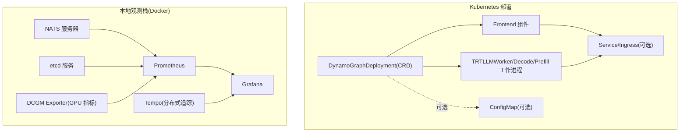
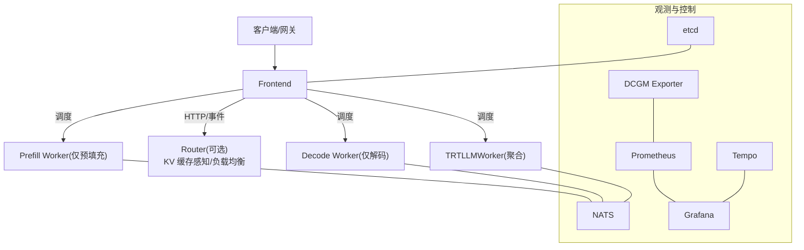
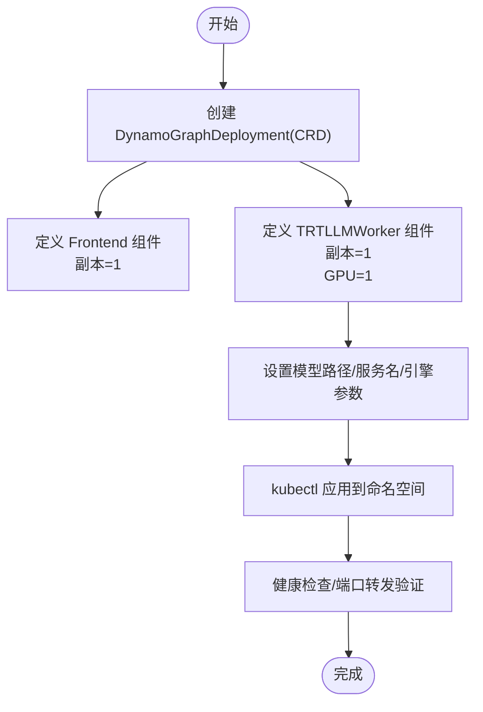
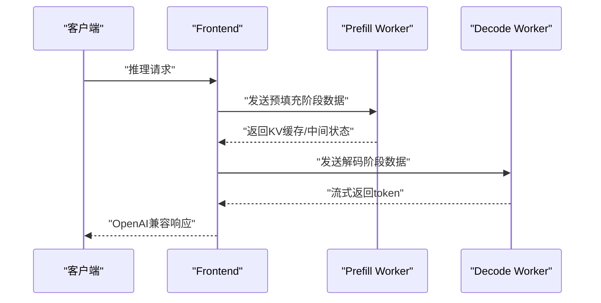
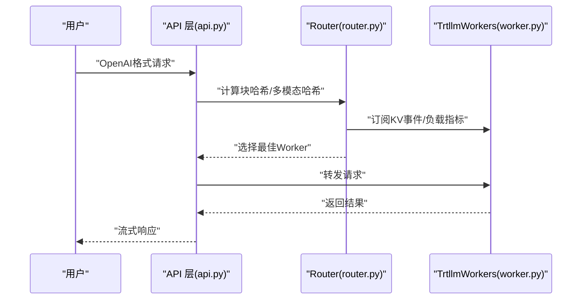
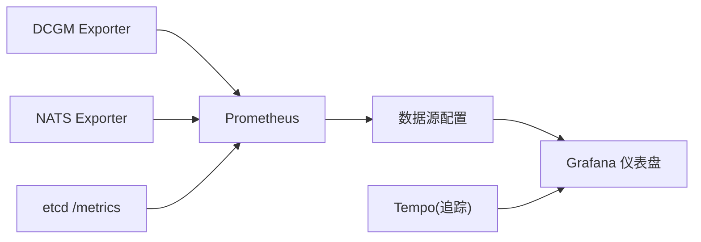
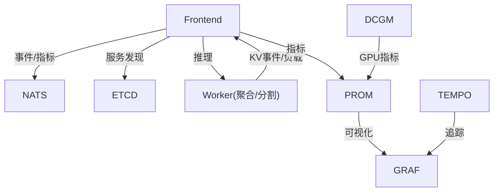

# 部署配置示例

<cite>
**本文引用的文件**
- [deploy/docker-compose.yml](file://deploy/docker-compose.yml)
- [deploy/docker-observability.yml](file://deploy/docker-observability.yml)
- [examples/backends/trtllm/deploy/README.md](file://examples/backends/trtllm/deploy/README.md)
- [examples/backends/trtllm/deploy/agg.yaml](file://examples/backends/trtllm/deploy/agg.yaml)
- [examples/backends/trtllm/deploy/disagg.yaml](file://examples/backends/trtllm/deploy/disagg.yaml)
- [examples/backends/trtllm/engine_configs/qwen3/agg.yaml](file://examples/backends/trtllm/engine_configs/qwen3/agg.yaml)
- [examples/backends/trtllm/engine_configs/qwen3/prefill.yaml](file://examples/backends/trtllm/engine_configs/qwen3/prefill.yaml)
- [examples/basics/multinode/trtllm/README.md](file://examples/basics/multinode/trtllm/README.md)
- [examples/deployments/router_standalone_trtllm/README.md](file://examples/deployments/router_standalone_trtllm/README.md)
- [deploy/operator/config/rbac/role.yaml](file://deploy/operator/config/rbac/role.yaml)
- [deploy/operator/config/rbac/role_binding.yaml](file://deploy/operator/config/rbac/role_binding.yaml)
- [deploy/observability/prometheus.yml](file://deploy/observability/prometheus.yml)
- [deploy/observability/grafana-datasources.yml](file://deploy/observability/grafana-datasources.yml)
- [deploy/inference-gateway/standalone/vllm_agg_qwen.yaml](file://deploy/inference-gateway/standalone/vllm_agg_qwen.yaml)
</cite>

## 目录
1. [简介](#简介)
2. [项目结构](#项目结构)
3. [核心组件](#核心组件)
4. [架构总览](#架构总览)
5. [详细组件分析](#详细组件分析)
6. [依赖关系分析](#依赖关系分析)
7. [性能考量](#性能考量)
8. [故障排查指南](#故障排查指南)
9. [结论](#结论)
10. [附录](#附录)

## 简介
本文件面向使用 TensorRT-LLM 的部署场景，提供从单节点到多节点的聚合与分割式部署配置示例，覆盖 Router 组件的部署要点（含负载均衡与故障转移）、Kubernetes 部署清单（Deployment、Service、ConfigMap）以及 GPU 资源管理、监控与日志、安全配置（RBAC、网络策略建议）、滚动更新与蓝绿部署方法，并给出部署验证与故障排查流程。

## 项目结构
围绕 TensorRT-LLM 的部署配置，仓库提供了两类主要路径：
- 基于 Kubernetes 的 CRD 模板：通过 DynamoGraphDeployment 定义前端与工作进程（聚合/分割/带路由器），并可挂载自定义 ConfigMap。
- 基于 Docker Compose 的本地观测栈：包含 NATS、etcd、Prometheus、Grafana、Tempo、DCGM Exporter 等，便于在本地或单机环境进行可观测性验证。

**图表来源**
- [examples/backends/trtllm/deploy/README.md](file://examples/backends/trtllm/deploy/README.md#L58-L100)
- [deploy/docker-compose.yml](file://deploy/docker-compose.yml#L11-L36)
- [deploy/docker-observability.yml](file://deploy/docker-observability.yml#L21-L138)

**章节来源**
- [examples/backends/trtllm/deploy/README.md](file://examples/backends/trtllm/deploy/README.md#L1-L289)
- [deploy/docker-compose.yml](file://deploy/docker-compose.yml#L1-L36)
- [deploy/docker-observability.yml](file://deploy/docker-observability.yml#L1-L138)

## 核心组件
- DynamoGraphDeployment(CRD)：统一描述前端与工作进程的部署拓扑、镜像、资源、命令参数等。
- Frontend：提供 OpenAI 兼容 API 或 HTTP API，负责请求编排与路由。
- TRTLLMWorker/TRTLLMPrefillWorker/TRTLLMDecodeWorker：TensorRT-LLM 推理后端，支持聚合（prefill+decode 合并在同一进程）与分割（prefill/decode 分离）两种模式。
- 观测栈：NATS/etcd 提供事件与发现，Prometheus/Grafana/Tempo/DCGM Exporter 提供指标、可视化与追踪。
- RBAC：Operator 使用 ClusterRole/ClusterRoleBinding 控制对 CRD 与集群资源的访问。

**章节来源**
- [examples/backends/trtllm/deploy/README.md](file://examples/backends/trtllm/deploy/README.md#L58-L100)
- [deploy/operator/config/rbac/role.yaml](file://deploy/operator/config/rbac/role.yaml#L17-L250)
- [deploy/operator/config/rbac/role_binding.yaml](file://deploy/operator/config/rbac/role_binding.yaml#L16-L35)

## 架构总览
下图展示了典型的聚合与分割式部署在 Kubernetes 中的交互关系，以及可选的 KV 路由能力与观测栈集成。

**图表来源**
- [examples/backends/trtllm/deploy/README.md](file://examples/backends/trtllm/deploy/README.md#L14-L56)
- [deploy/docker-observability.yml](file://deploy/docker-observability.yml#L21-L138)

## 详细组件分析

### 聚合模式部署（单节点）
- 配置要点
  - Frontend：组件类型为 frontend，副本数为 1。
  - TRTLLMWorker：组件类型为 worker，副本数为 1，显存资源限制为 1 张 GPU；通过命令行参数指定模型路径、服务名与引擎配置文件。
  - 引擎配置：通过额外参数加载 TensorRT-LLM 引擎配置（如批大小、CUDA Graph、KV Cache 内存占比等）。
- 关键文件
  - CRD 模板：[agg.yaml](file://examples/backends/trtllm/deploy/agg.yaml#L1-L38)
  - 引擎配置（聚合）：[agg.yaml](file://examples/backends/trtllm/engine_configs/qwen3/agg.yaml#L1-L34)

**图表来源**
- [examples/backends/trtllm/deploy/agg.yaml](file://examples/backends/trtllm/deploy/agg.yaml#L9-L38)
- [examples/backends/trtllm/engine_configs/qwen3/agg.yaml](file://examples/backends/trtllm/engine_configs/qwen3/agg.yaml#L15-L34)

**章节来源**
- [examples/backends/trtllm/deploy/agg.yaml](file://examples/backends/trtllm/deploy/agg.yaml#L1-L38)
- [examples/backends/trtllm/engine_configs/qwen3/agg.yaml](file://examples/backends/trtllm/engine_configs/qwen3/agg.yaml#L1-L34)

### 分割式模式部署（单节点）
- 配置要点
  - Frontend：组件类型为 frontend，副本数为 1。
  - TRTLLMPrefillWorker：组件类型为 worker，子组件类型为 prefill，副本数为 1，GPU 限制为 1。
  - TRTLLMDecodeWorker：组件类型为 worker，子组件类型为 decode，副本数为 1，GPU 限制为 1。
  - 通过命令行参数分别指定预填充与解码的引擎配置文件，并启用分割式模式标识。
- 关键文件
  - CRD 模板：[disagg.yaml](file://examples/backends/trtllm/deploy/disagg.yaml#L1-L66)
  - 引擎配置（预填充）：[prefill.yaml](file://examples/backends/trtllm/engine_configs/qwen3/prefill.yaml#L1-L30)

**图表来源**
- [examples/backends/trtllm/deploy/disagg.yaml](file://examples/backends/trtllm/deploy/disagg.yaml#L9-L66)
- [examples/backends/trtllm/engine_configs/qwen3/prefill.yaml](file://examples/backends/trtllm/engine_configs/qwen3/prefill.yaml#L15-L30)

**章节来源**
- [examples/backends/trtllm/deploy/disagg.yaml](file://examples/backends/trtllm/deploy/disagg.yaml#L1-L66)
- [examples/backends/trtllm/engine_configs/qwen3/prefill.yaml](file://examples/backends/trtllm/engine_configs/qwen3/prefill.yaml#L1-L30)

### 多节点部署（Slurm 示例）
- 场景说明
  - 在 Slurm 环境中运行多个 TRTLLM Worker，Frontend 作为协调者与入口。
  - 该示例用于演示跨节点的分割式推理与资源分配。
- 关键文件
  - 示例说明：[README.md](file://examples/basics/multinode/trtllm/README.md#L18-L21)

**章节来源**
- [examples/basics/multinode/trtllm/README.md](file://examples/basics/multinode/trtllm/README.md#L18-L21)

### Router 组件部署（负载均衡与故障转移）
- 单独 Router 实现
  - 该示例展示了不依赖 Dynamo 控制面的独立 Router，基于 KV 缓存重叠度与负载选择最优 Worker，支持多模态哈希路由。
  - 包含 API 层、Router 层、Worker 层，通过 ZMQ 发布 KV 事件与负载指标。
- 关键文件
  - 示例说明与架构：[README.md](file://examples/deployments/router_standalone_trtllm/README.md#L18-L249)

**图表来源**
- [examples/deployments/router_standalone_trtllm/README.md](file://examples/deployments/router_standalone_trtllm/README.md#L57-L80)

**章节来源**
- [examples/deployments/router_standalone_trtllm/README.md](file://examples/deployments/router_standalone_trtllm/README.md#L18-L249)

### Kubernetes 部署清单（Deployment/Service/ConfigMap）
- Deployment
  - 使用 DynamoGraphDeployment CRD 描述 Frontend 与 Worker 的拓扑、镜像、资源、命令参数与副本数。
- Service
  - 可通过 Service 暴露 Frontend，结合 Ingress 进行外部访问；也可使用端口转发进行本地验证。
- ConfigMap
  - 可将 TensorRT-LLM 引擎配置以 ConfigMap 形式挂载至 Worker，实现配置与镜像解耦。
- 关键文件
  - CRD 结构与使用说明：[README.md](file://examples/backends/trtllm/deploy/README.md#L58-L100)
  - 聚合模板：[agg.yaml](file://examples/backends/trtllm/deploy/agg.yaml#L1-L38)
  - 分割模板：[disagg.yaml](file://examples/backends/trtllm/deploy/disagg.yaml#L1-L66)
  - 独立网关默认值示例：[vllm_agg_qwen.yaml](file://deploy/inference-gateway/standalone/vllm_agg_qwen.yaml#L1-L18)

**章节来源**
- [examples/backends/trtllm/deploy/README.md](file://examples/backends/trtllm/deploy/README.md#L58-L100)
- [examples/backends/trtllm/deploy/agg.yaml](file://examples/backends/trtllm/deploy/agg.yaml#L1-L38)
- [examples/backends/trtllm/deploy/disagg.yaml](file://examples/backends/trtllm/deploy/disagg.yaml#L1-L66)
- [deploy/inference-gateway/standalone/vllm_agg_qwen.yaml](file://deploy/inference-gateway/standalone/vllm_agg_qwen.yaml#L1-L18)

### GPU 资源管理（亲和性、限制与优先级）
- 资源限制
  - 在 CRD 的 resources.limits 中设置 GPU 数量，确保每个 Worker 仅占用所需 GPU。
- 亲和性与污点容忍
  - 通过节点选择器与亲和性策略将 Frontend/Worker 调度到具备 GPU 的节点。
- 优先级与抢占
  - 通过 PodPriority/Queue 等机制在多租户环境中保障关键任务的调度优先级。
- 参考
  - 资源配置示例：[README.md](file://examples/backends/trtllm/deploy/README.md#L75-L86)

**章节来源**
- [examples/backends/trtllm/deploy/README.md](file://examples/backends/trtllm/deploy/README.md#L75-L86)

### 监控与日志（Prometheus 指标与 Grafana 可视化）
- 指标采集
  - Prometheus 抓取 NATS、etcd、DCGM Exporter、Frontend、Backend 等目标。
- 可视化
  - Grafana 作为统一仪表盘，连接 Prometheus 与 Tempo 数据源。
- 关键文件
  - Prometheus 配置：[prometheus.yml](file://deploy/observability/prometheus.yml#L20-L63)
  - Grafana 数据源：[grafana-datasources.yml](file://deploy/observability/grafana-datasources.yml#L18-L24)
  - 观测栈编排：[docker-observability.yml](file://deploy/docker-observability.yml#L21-L138)

**图表来源**
- [deploy/observability/prometheus.yml](file://deploy/observability/prometheus.yml#L20-L63)
- [deploy/observability/grafana-datasources.yml](file://deploy/observability/grafana-datasources.yml#L18-L24)
- [deploy/docker-observability.yml](file://deploy/docker-observability.yml#L21-L138)

**章节来源**
- [deploy/observability/prometheus.yml](file://deploy/observability/prometheus.yml#L1-L63)
- [deploy/observability/grafana-datasources.yml](file://deploy/observability/grafana-datasources.yml#L1-L24)
- [deploy/docker-observability.yml](file://deploy/docker-observability.yml#L1-L138)

### 安全配置（RBAC 与网络策略建议）
- RBAC
  - ClusterRole 定义了对 CRD 与多种 Kubernetes 资源的操作权限；ClusterRoleBinding 将 ServiceAccount 与角色绑定。
- 网络策略
  - 建议为 Frontend/Worker/控制面（NATS/etcd）划分命名空间与网络策略，限制入站/出站流量，仅放行必要端口。
- 关键文件
  - ClusterRole：[role.yaml](file://deploy/operator/config/rbac/role.yaml#L17-L250)
  - ClusterRoleBinding：[role_binding.yaml](file://deploy/operator/config/rbac/role_binding.yaml#L16-L35)

**章节来源**
- [deploy/operator/config/rbac/role.yaml](file://deploy/operator/config/rbac/role.yaml#L17-L250)
- [deploy/operator/config/rbac/role_binding.yaml](file://deploy/operator/config/rbac/role_binding.yaml#L16-L35)

### 滚动更新与蓝绿部署
- 滚动更新
  - 通过调整 Deployment 的滚动参数（如最大不可用/最大扩容）实现平滑升级。
- 蓝绿/金丝雀
  - 使用两套完全隔离的 Deployment（蓝/绿），通过 Service 切换或 Ingress 路由策略逐步迁移流量。
- 参考
  - 部署使用与端口转发：[README.md](file://examples/backends/trtllm/deploy/README.md#L132-L197)

**章节来源**
- [examples/backends/trtllm/deploy/README.md](file://examples/backends/trtllm/deploy/README.md#L132-L197)

## 依赖关系分析
- 组件耦合
  - Frontend 依赖 Worker（聚合/分割）执行推理；Router（可选）依赖 Worker 的 KV 事件与负载指标。
  - 控制面（NATS/etcd）与观测面（Prometheus/Grafana/Tempo/DCGM）与业务组件解耦，通过服务发现与指标暴露集成。
- 外部依赖
  - TensorRT-LLM 运行时镜像、HuggingFace Token Secret、GPU 设备插件（Device Plugins）。

**图表来源**
- [examples/backends/trtllm/deploy/README.md](file://examples/backends/trtllm/deploy/README.md#L230-L244)
- [deploy/docker-observability.yml](file://deploy/docker-observability.yml#L21-L138)

**章节来源**
- [examples/backends/trtllm/deploy/README.md](file://examples/backends/trtllm/deploy/README.md#L230-L244)
- [deploy/docker-observability.yml](file://deploy/docker-observability.yml#L21-L138)

## 性能考量
- 批处理与 CUDA Graph
  - 引擎配置中设置最大批大小与启用 CUDA Graph，有助于降低延迟与提升吞吐。
- KV Cache 管理
  - 合理设置 GPU 内存占比，避免 OOM；在分割式部署中通过 KV 事件与 Router 实现缓存复用。
- 并行与拓扑
  - 多节点场景下，合理规划 GPU 亲和性与网络拓扑，减少跨节点通信开销。
- 参考
  - 聚合引擎配置：[agg.yaml](file://examples/backends/trtllm/engine_configs/qwen3/agg.yaml#L15-L34)
  - 预填充引擎配置：[prefill.yaml](file://examples/backends/trtllm/engine_configs/qwen3/prefill.yaml#L15-L30)

**章节来源**
- [examples/backends/trtllm/engine_configs/qwen3/agg.yaml](file://examples/backends/trtllm/engine_configs/qwen3/agg.yaml#L15-L34)
- [examples/backends/trtllm/engine_configs/qwen3/prefill.yaml](file://examples/backends/trtllm/engine_configs/qwen3/prefill.yaml#L15-L30)

## 故障排查指南
- 常见问题
  - Pod 启动失败：检查镜像拉取权限与 HuggingFace Token Secret。
  - GPU 未分配：确认集群存在 GPU 节点且资源配额充足。
  - 健康检查失败：查看模型加载日志，适当增加初始延迟。
  - 内存不足：提高内存上限或减小批大小。
  - 端口转发异常：核对正确的 Pod UUID 与端口映射。
  - Git LFS 问题：构建前安装 git/git-lfs。
  - ARM 架构：使用对应平台参数构建镜像。
- 参考
  - 故障排查清单：[README.md](file://examples/backends/trtllm/deploy/README.md#L276-L289)

**章节来源**
- [examples/backends/trtllm/deploy/README.md](file://examples/backends/trtllm/deploy/README.md#L276-L289)

## 结论
通过 DynamoGraphDeployment，TensorRT-LLM 支持灵活的聚合与分割式部署，并可在 Kubernetes 上实现高可用与可观测性。结合 Router 的 KV 缓存感知与负载均衡能力，可进一步提升多模态与长序列推理的效率。配合完善的 RBAC、网络策略、监控与日志体系，以及滚动/蓝绿发布策略，可满足生产环境对稳定性与可维护性的要求。

## 附录
- 本地观测栈快速启动
  - 启动基础设施与观测栈：[docker-compose.yml](file://deploy/docker-compose.yml#L11-L36)、[docker-observability.yml](file://deploy/docker-observability.yml#L21-L138)
- 端口转发与健康检查
  - 参考：[README.md](file://examples/backends/trtllm/deploy/README.md#L190-L236)

**章节来源**
- [deploy/docker-compose.yml](file://deploy/docker-compose.yml#L11-L36)
- [deploy/docker-observability.yml](file://deploy/docker-observability.yml#L21-L138)
- [examples/backends/trtllm/deploy/README.md](file://examples/backends/trtllm/deploy/README.md#L190-L236)