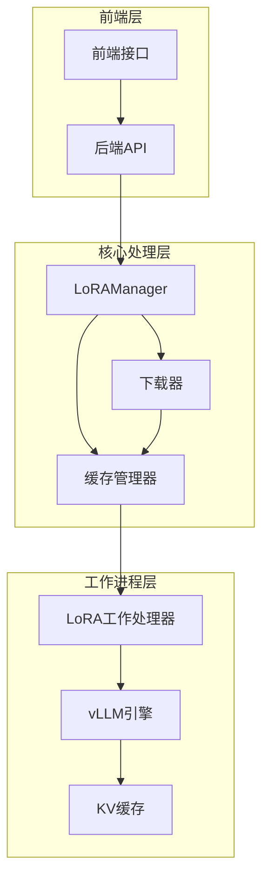
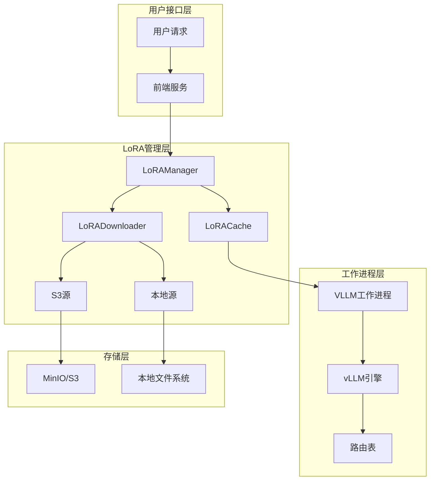
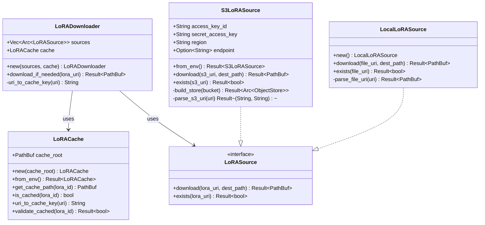
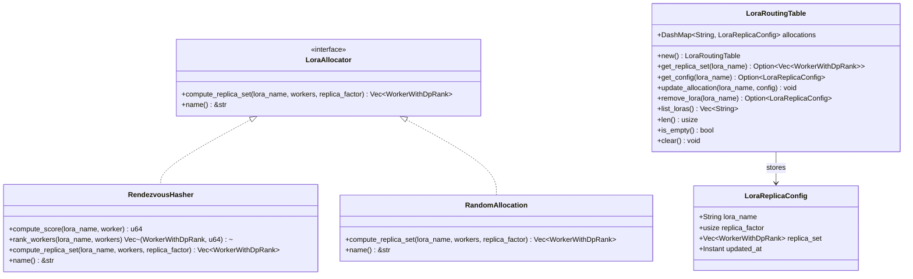
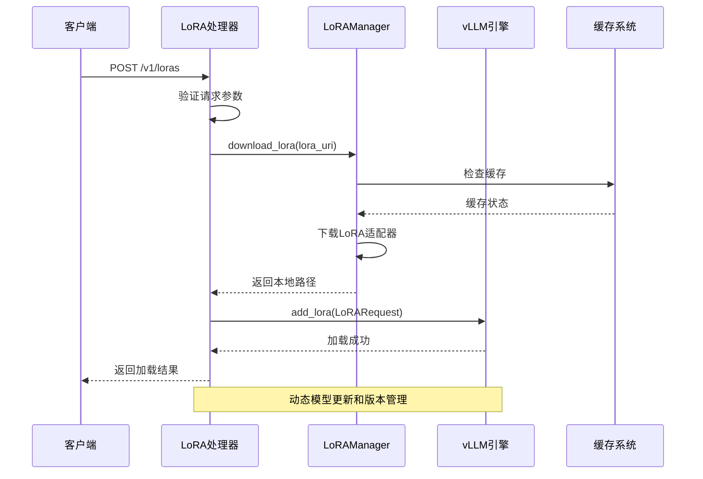
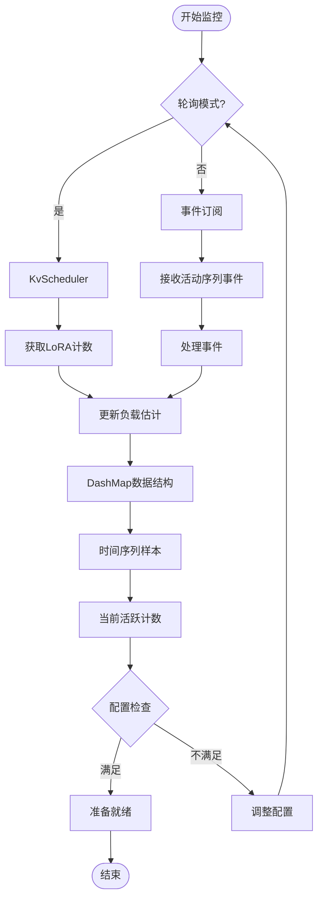
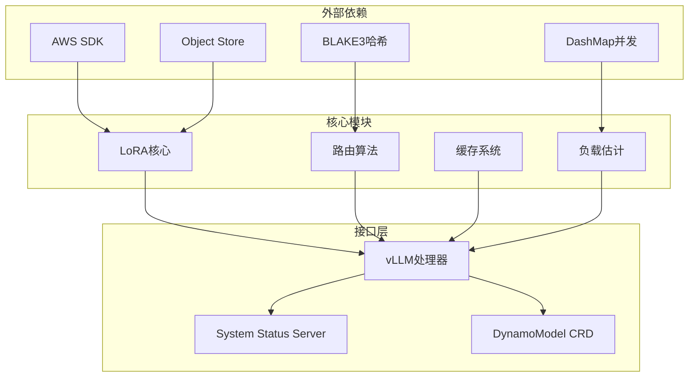

# vLLM LoRA集成示例

<cite>
**本文档引用的文件**
- [docs/pages/features/lora/README.md](file://docs/pages/features/lora/README.md)
- [examples/backends/vllm/deploy/lora/README.md](file://examples/backends/vllm/deploy/lora/README.md)
- [examples/backends/vllm/deploy/lora/agg_lora.yaml](file://examples/backends/vllm/deploy/lora/agg_lora.yaml)
- [examples/backends/vllm/deploy/lora/minio-secret.yaml](file://examples/backends/vllm/deploy/lora/minio-secret.yaml)
- [examples/backends/vllm/deploy/lora/sync-lora-job.yaml](file://examples/backends/vllm/deploy/lora/sync-lora-job.yaml)
- [components/src/dynamo/vllm/handlers.py](file://components/src/dynamo/vllm/handlers.py)
- [lib/llm/src/lora/cache.rs](file://lib/llm/src/lora/cache.rs)
- [lib/llm/src/lora/downloader.rs](file://lib/llm/src/lora/downloader.rs)
- [lib/llm/src/lora/source.rs](file://lib/llm/src/lora/source.rs)
- [lib/llm/src/lora/load_estimator.rs](file://lib/llm/src/lora/load_estimator.rs)
- [lib/llm/src/lora/routing/mod.rs](file://lib/llm/src/lora/routing/mod.rs)
- [lib/llm/src/lora/routing/hrw.rs](file://lib/llm/src/lora/routing/hrw.rs)
- [lib/llm/src/lora/routing/table.rs](file://lib/llm/src/lora/routing/table.rs)
- [lib/llm/src/model_card.rs](file://lib/llm/src/model_card.rs)
- [components/src/dynamo/common/lora/__init__.py](file://components/src/dynamo/common/lora/__init__.py)
- [lib/runtime/src/system_status_server.rs](file://lib/runtime/src/system_status_server.rs)
</cite>

## 目录
1. [简介](#简介)
2. [项目结构](#项目结构)
3. [核心组件](#核心组件)
4. [架构概览](#架构概览)
5. [详细组件分析](#详细组件分析)
6. [依赖关系分析](#依赖关系分析)
7. [性能考虑](#性能考虑)
8. [故障排除指南](#故障排除指南)
9. [结论](#结论)
10. [附录](#附录)

## 简介

本文件为vLLM LoRA（低秩适应）微调集成的详细示例文档。LoRA技术允许在不重复复制完整模型权重的情况下，高效地进行专业化模型变体的微调和推理。Dynamo提供了内置的动态LoRA适配器加载、缓存和推理路由支持。

Dynamo的LoRA实现提供以下功能：
- 动态加载：在运行时加载和卸载LoRA适配器，无需重启工作进程
- 多源支持：从本地文件系统（file://）、S3兼容存储（s3://）或Hugging Face Hub（hf://）加载
- 自动缓存：下载的适配器自动缓存，避免重复下载
- 发现集成：通过/v1/models自动注册和发现已加载的LoRA
- KV感知路由：根据请求路由到已加载适当LoRA的工作进程
- Kubernetes原生：通过DynamoModel CRD声明式管理LoRA适配器

## 项目结构

Dynamo LoRA系统的整体架构由三个主要部分组成：



**图表来源**
- [components/src/dynamo/vllm/handlers.py](file://components/src/dynamo/vllm/handlers.py#L56-L76)
- [lib/llm/src/lora/downloader.rs](file://lib/llm/src/lora/downloader.rs#L13-L16)
- [lib/llm/src/lora/cache.rs](file://lib/llm/src/lora/cache.rs#L10-L12)

**章节来源**
- [docs/pages/features/lora/README.md](file://docs/pages/features/lora/README.md#L32-L66)

## 核心组件

### LoRA管理器（LoRAManager）
LoRAManager是Python层面的LoRA管理核心，负责协调下载、缓存和加载操作。

### 下载器（LoRADownloader）
负责从各种源下载LoRA适配器，支持本地文件系统和S3兼容存储。

### 缓存管理器（LoRACache）
提供LoRA适配器的本地缓存功能，确保重复使用时的性能和可靠性。

### 工作处理器（VLLM Handlers）
集成到vLLM引擎中，处理LoRA的动态加载和卸载操作。

**章节来源**
- [components/src/dynamo/common/lora/__init__.py](file://components/src/dynamo/common/lora/__init__.py#L8-L10)
- [lib/llm/src/lora/downloader.rs](file://lib/llm/src/lora/downloader.rs#L13-L16)
- [lib/llm/src/lora/cache.rs](file://lib/llm/src/lora/cache.rs#L10-L12)
- [components/src/dynamo/vllm/handlers.py](file://components/src/dynamo/vllm/handlers.py#L56-L76)

## 架构概览

Dynamo的LoRA架构采用分层设计，确保高可用性和可扩展性：



**图表来源**
- [lib/llm/src/lora/source.rs](file://lib/llm/src/lora/source.rs#L83-L88)
- [lib/llm/src/lora/cache.rs](file://lib/llm/src/lora/cache.rs#L10-L12)
- [components/src/dynamo/vllm/handlers.py](file://components/src/dynamo/vllm/handlers.py#L56-L76)

## 详细组件分析

### LoRA缓存系统

LoRA缓存系统提供高效的本地存储和检索机制：



**图表来源**
- [lib/llm/src/lora/cache.rs](file://lib/llm/src/lora/cache.rs#L9-L75)
- [lib/llm/src/lora/downloader.rs](file://lib/llm/src/lora/downloader.rs#L8-L72)
- [lib/llm/src/lora/source.rs](file://lib/llm/src/lora/source.rs#L16-L378)

### LoRA路由算法

Dynamo实现了多种LoRA分配算法以优化负载均衡：



**图表来源**
- [lib/llm/src/lora/routing/mod.rs](file://lib/llm/src/lora/routing/mod.rs#L15-L75)
- [lib/llm/src/lora/routing/hrw.rs](file://lib/llm/src/lora/routing/hrw.rs#L7-L66)
- [lib/llm/src/lora/routing/table.rs](file://lib/llm/src/lora/routing/table.rs#L12-L86)

### LoRA工作处理器

vLLM工作处理器负责LoRA的动态管理和推理集成：



**图表来源**
- [components/src/dynamo/vllm/handlers.py](file://components/src/dynamo/vllm/handlers.py#L452-L551)
- [components/src/dynamo/vllm/handlers.py](file://components/src/dynamo/vllm/handlers.py#L642-L732)

**章节来源**
- [components/src/dynamo/vllm/handlers.py](file://components/src/dynamo/vllm/handlers.py#L452-L732)
- [lib/llm/src/lora/load_estimator.rs](file://lib/llm/src/lora/load_estimator.rs#L57-L107)

### LoRA性能监控

Dynamo提供了详细的LoRA负载监控和估计功能：



**图表来源**
- [lib/llm/src/lora/load_estimator.rs](file://lib/llm/src/lora/load_estimator.rs#L80-L154)
- [lib/llm/src/lora/load_estimator.rs](file://lib/llm/src/lora/load_estimator.rs#L156-L224)

**章节来源**
- [lib/llm/src/lora/load_estimator.rs](file://lib/llm/src/lora/load_estimator.rs#L57-L299)

## 依赖关系分析

Dynamo LoRA系统的依赖关系呈现清晰的层次化结构：



**图表来源**
- [lib/llm/src/lora/source.rs](file://lib/llm/src/lora/source.rs#L8-L13)
- [lib/llm/src/lora/routing/hrw.rs](file://lib/llm/src/lora/routing/hrw.rs#L13-L24)
- [lib/llm/src/lora/load_estimator.rs](file://lib/llm/src/lora/load_estimator.rs#L13-L16)

**章节来源**
- [lib/llm/src/lora/source.rs](file://lib/llm/src/lora/source.rs#L1-L378)
- [lib/llm/src/lora/routing/mod.rs](file://lib/llm/src/lora/routing/mod.rs#L1-L107)

## 性能考虑

### 内存管理优化

1. **缓存策略优化**
   - 使用URI到缓存键的一致映射确保跨组件一致性
   - 支持多种权重文件格式验证
   - 原子重命名避免数据损坏

2. **并发控制**
   - 基于锁的序列化操作防止竞态条件
   - DashMap提供无锁读取性能
   - 异步下载避免阻塞主线程

3. **资源管理**
   - 最大重试次数和指数退避机制
   - 超时控制和错误恢复
   - 内存友好的流式下载

### 推理加速技术

1. **路由优化**
   - HRW哈希算法提供稳定的负载分布
   - 随机分配用于测试和开发场景
   - 可配置的副本因子优化性能

2. **缓存策略**
   - 自动缓存减少网络I/O
   - 文件存在性验证避免无效下载
   - 统一的缓存键生成规则

3. **错误处理**
   - 优雅降级和回滚机制
   - 详细的日志记录便于调试
   - 连接池和超时配置

## 故障排除指南

### 常见问题诊断

1. **LoRA加载失败**
   - 检查S3连接性和凭证配置
   - 验证缓存目录权限和空间
   - 查看工作进程日志中的LoRA相关消息

2. **模型未找到**
   - 确保LoRA名称完全匹配（区分大小写）
   - 检查LoRA列表确认已加载状态
   - 验证发现注册是否成功

3. **推理返回基础模型响应**
   - 确认请求中的`model`字段与`lora_name`匹配
   - 检查处理请求的工作进程是否已加载LoRA
   - 对于解耦服务，确保预填充和解码工作进程都有LoRA

### Kubernetes部署问题

1. **MinIO连接问题**
   - 确认MinIO Pod正在运行
   - 检查MinIO服务配置
   - 验证`AWS_ENDPOINT`URL与服务名称匹配

2. **同步作业失败**
   - 检查作业日志获取详细错误信息
   - 验证HuggingFace令牌配置
   - 确认MinIO可访问性

**章节来源**
- [docs/pages/features/lora/README.md](file://docs/pages/features/lora/README.md#L276-L315)
- [examples/backends/vllm/deploy/lora/README.md](file://examples/backends/vllm/deploy/lora/README.md#L249-L292)

## 结论

Dynamo的vLLM LoRA集成提供了企业级的动态LoRA适配器管理解决方案。通过分层架构设计、智能缓存策略和高性能路由算法，该系统能够支持大规模生产环境中的LoRA部署需求。

关键优势包括：
- **灵活性**：支持多种LoRA源和部署模式
- **可靠性**：完善的错误处理和恢复机制
- **性能**：优化的缓存和路由策略
- **可扩展性**：模块化设计便于扩展和定制

建议在生产环境中结合具体的业务需求选择合适的部署模式和配置参数，以获得最佳的性能和可靠性表现。

## 附录

### 配置参考

#### 环境变量
| 变量名 | 描述 | 默认值 |
|--------|------|--------|
| `DYN_LORA_ENABLED` | 启用LoRA适配器支持 | `false` |
| `DYN_LORA_PATH` | 本地缓存目录 | `~/.cache/dynamo_loras` |
| `AWS_ACCESS_KEY_ID` | S3访问密钥 | - |
| `AWS_SECRET_ACCESS_KEY` | S3密钥 | - |
| `AWS_ENDPOINT` | 自定义S3端点 | - |
| `AWS_REGION` | AWS区域 | `us-east-1` |
| `AWS_ALLOW_HTTP` | 允许HTTP连接 | `false` |

#### vLLM参数
| 参数 | 描述 |
|------|------|
| `--enable-lora` | 在vLLM中启用LoRA适配器支持 |
| `--max-lora-rank` | LoRA最大秩（必须>=LoRA的秩） |
| `--max-loras` | 同时加载的LoRA最大数量 |

### API参考

#### 加载LoRA
```http
POST /v1/loras
```

**请求体：**
```json
{
  "lora_name": "string",
  "source": {
    "uri": "string"
  }
}
```

**响应：**
```json
{
  "status": "success",
  "message": "LoRA适配器'我的-lora'加载成功",
  "lora_name": "我的-lora",
  "lora_id": 1207343256
}
```

#### 列出LoRA
```http
GET /v1/loras
```

**响应：**
```json
{
  "status": "success",
  "loras": {
    "我的-lora": 1207343256,
    "另一个-lora": 987654321
  },
  "count": 2
}
```

#### 卸载LoRA
```http
DELETE /v1/loras/{lora_name}
```

**响应：**
```json
{
  "status": "success",
  "message": "LoRA适配器'我的-lora'卸载成功",
  "lora_name": "我的-lora",
  "lora_id": 1207343256
}
```

**章节来源**
- [docs/pages/features/lora/README.md](file://docs/pages/features/lora/README.md#L135-L224)
- [examples/backends/vllm/deploy/lora/README.md](file://examples/backends/vllm/deploy/lora/README.md#L195-L217)