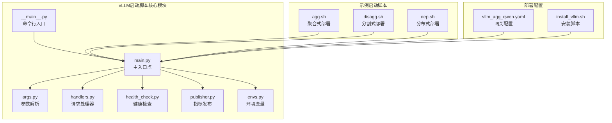
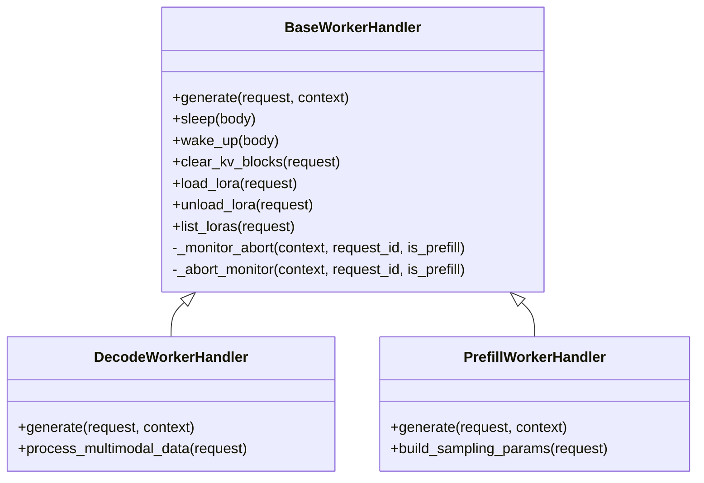
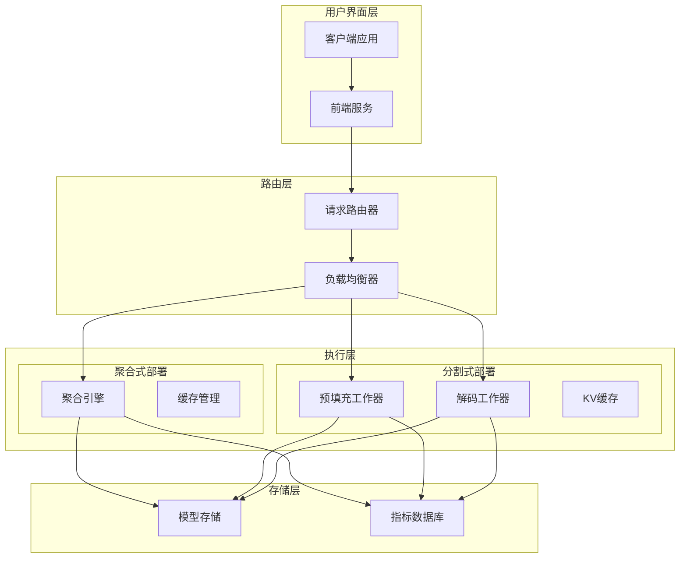
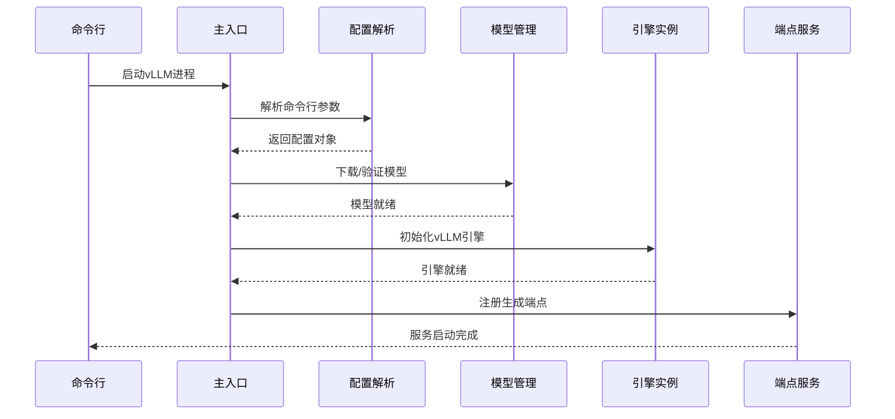
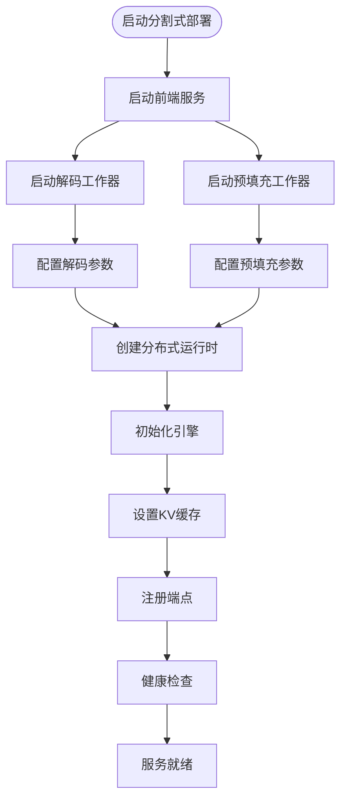
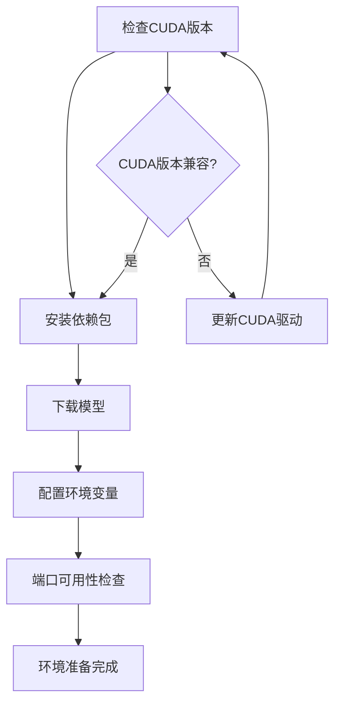
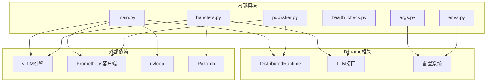
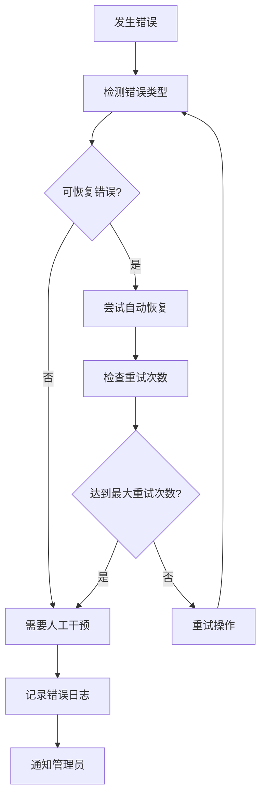

# vLLM启动脚本

<cite>
**本文档引用的文件**
- [components/src/dynamo/vllm/main.py](file://components/src/dynamo/vllm/main.py)
- [components/src/dynamo/vllm/__main__.py](file://components/src/dynamo/vllm/__main__.py)
- [components/src/dynamo/vllm/args.py](file://components/src/dynamo/vllm/args.py)
- [components/src/dynamo/vllm/envs.py](file://components/src/dynamo/vllm/envs.py)
- [components/src/dynamo/vllm/health_check.py](file://components/src/dynamo/vllm/health_check.py)
- [components/src/dynamo/vllm/publisher.py](file://components/src/dynamo/vllm/publisher.py)
- [components/src/dynamo/vllm/handlers.py](file://components/src/dynamo/vllm/handlers.py)
- [examples/backends/vllm/launch/agg.sh](file://examples/backends/vllm/launch/agg.sh)
- [examples/backends/vllm/launch/disagg.sh](file://examples/backends/vllm/launch/disagg.sh)
- [examples/backends/vllm/launch/dep.sh](file://examples/backends/vllm/launch/dep.sh)
- [deploy/inference-gateway/standalone/vllm_agg_qwen.yaml](file://deploy/inference-gateway/standalone/vllm_agg_qwen.yaml)
- [container/deps/vllm/install_vllm.sh](file://container/deps/vllm/install_vllm.sh)
</cite>

## 目录
1. [简介](#简介)
2. [项目结构](#项目结构)
3. [核心组件](#核心组件)
4. [架构概览](#架构概览)
5. [详细组件分析](#详细组件分析)
6. [依赖关系分析](#依赖关系分析)
7. [性能考虑](#性能考虑)
8. [故障排除指南](#故障排除指南)
9. [结论](#结论)
10. [附录](#附录)

## 简介

vLLM启动脚本是Dynamo平台中用于部署和管理vLLM推理引擎的核心组件。该系统支持两种主要部署模式：聚合式部署（Aggregated）和分割式部署（Disaggregated），能够灵活适应从单节点到多节点、从CPU到GPU的各种硬件配置。

vLLM启动脚本提供了完整的模型生命周期管理，包括模型下载、权重初始化、缓存预热、性能优化配置等核心功能。系统支持多种部署场景，包括单阶段和多阶段推理管道，以及复杂的多模态处理能力。

## 项目结构

vLLM启动脚本位于Dynamo项目的components/src/dynamo/vllm目录下，采用模块化设计，每个模块负责特定的功能领域：

**图表来源**
- [components/src/dynamo/vllm/main.py](file://components/src/dynamo/vllm/main.py#L1-L1373)
- [components/src/dynamo/vllm/args.py](file://components/src/dynamo/vllm/args.py#L1-L437)
- [examples/backends/vllm/launch/agg.sh](file://examples/backends/vllm/launch/agg.sh#L1-L33)

**章节来源**
- [components/src/dynamo/vllm/main.py](file://components/src/dynamo/vllm/main.py#L1-L100)
- [components/src/dynamo/vllm/args.py](file://components/src/dynamo/vllm/args.py#L1-L50)

## 核心组件

### 主入口点 (main.py)

主入口点负责协调整个vLLM启动流程，包括配置验证、模型初始化、运行时创建和端点注册。该模块实现了异步事件驱动的架构，支持优雅关闭和资源清理。

关键功能包括：
- 配置解析和验证
- 模型下载和缓存管理
- 引擎初始化和配置
- 多模态处理支持
- 性能监控和指标收集

### 参数解析器 (args.py)

参数解析器提供了完整的命令行接口，支持vLLM原生参数和Dynamo扩展参数。它实现了智能的参数验证和默认值设置。

主要特性：
- 支持多种部署模式标志
- 自动参数交叉验证
- 连接器配置管理
- 环境变量集成

### 请求处理器 (handlers.py)

请求处理器模块实现了统一的请求处理接口，支持多种工作负载类型：

**图表来源**
- [components/src/dynamo/vllm/handlers.py](file://components/src/dynamo/vllm/handlers.py#L233-L450)

**章节来源**
- [components/src/dynamo/vllm/handlers.py](file://components/src/dynamo/vllm/handlers.py#L1-L200)

## 架构概览

vLLM启动脚本采用分层架构设计，支持从简单到复杂的多种部署场景：

**图表来源**
- [components/src/dynamo/vllm/main.py](file://components/src/dynamo/vllm/main.py#L676-L800)
- [components/src/dynamo/vllm/args.py](file://components/src/dynamo/vllm/args.py#L156-L182)

## 详细组件分析

### 聚合式部署启动流程

聚合式部署将所有功能集成在一个进程中，适合单节点部署和开发测试场景：

**图表来源**
- [components/src/dynamo/vllm/main.py](file://components/src/dynamo/vllm/main.py#L99-L191)
- [components/src/dynamo/vllm/args.py](file://components/src/dynamo/vllm/args.py#L76-L127)

### 分割式部署启动流程

分割式部署将预填充和解码功能分离到不同的工作器中，支持更复杂的多节点部署：

**图表来源**
- [examples/backends/vllm/launch/disagg.sh](file://examples/backends/vllm/launch/disagg.sh#L1-L22)
- [components/src/dynamo/vllm/main.py](file://components/src/dynamo/vllm/main.py#L535-L674)

### 环境准备和依赖安装

系统提供了完整的环境准备脚本，确保运行时环境的一致性和可靠性：

**图表来源**
- [container/deps/vllm/install_vllm.sh](file://container/deps/vllm/install_vllm.sh)
- [components/src/dynamo/vllm/envs.py](file://components/src/dynamo/vllm/envs.py#L25-L56)

**章节来源**
- [examples/backends/vllm/launch/agg.sh](file://examples/backends/vllm/launch/agg.sh#L1-L33)
- [examples/backends/vllm/launch/disagg.sh](file://examples/backends/vllm/launch/disagg.sh#L1-L22)

## 依赖关系分析

vLLM启动脚本的依赖关系体现了清晰的模块化设计：

**图表来源**
- [components/src/dynamo/vllm/main.py](file://components/src/dynamo/vllm/main.py#L1-L50)
- [components/src/dynamo/vllm/handlers.py](file://components/src/dynamo/vllm/handlers.py#L1-L50)

**章节来源**
- [components/src/dynamo/vllm/main.py](file://components/src/dynamo/vllm/main.py#L1-L100)
- [components/src/dynamo/vllm/args.py](file://components/src/dynamo/vllm/args.py#L1-L50)

## 性能考虑

### 缓存预热策略

系统实现了智能的缓存预热机制，通过以下方式优化启动性能：

- **延迟加载**: 模型权重按需加载，减少初始启动时间
- **GPU内存管理**: 动态调整GPU内存分配，避免内存碎片
- **前缀缓存**: 预填充阶段的KV缓存优化
- **指标监控**: 实时监控缓存命中率和内存使用情况

### 多模态处理优化

对于多模态模型，系统提供了专门的优化策略：

- **图像解码**: 支持前端解码和后端解码两种模式
- **数据传输**: 优化多模态数据在不同组件间的传输
- **并行处理**: 利用多线程和异步I/O提高处理效率

### 性能调优建议

基于实际部署经验，推荐以下性能调优策略：

1. **内存优化**: 根据GPU显存大小调整batch size和序列长度
2. **并发控制**: 合理设置并发请求数量，避免GPU过载
3. **缓存策略**: 配置合适的缓存大小和淘汰策略
4. **网络优化**: 在多节点部署中优化网络通信参数

## 故障排除指南

### 常见问题及解决方案

#### CUDA内存不足

**症状**: 启动时出现CUDA内存错误或OOM异常

**解决方案**:
- 减少batch size和序列长度
- 启用模型量化（如FP8）
- 使用梯度检查点技术
- 调整KV缓存大小

#### 模型加载失败

**症状**: 模型下载或初始化过程中出现错误

**解决方案**:
- 检查模型路径和权限
- 验证模型格式兼容性
- 清理损坏的模型缓存
- 检查网络连接状态

#### 健康检查失败

**症状**: 服务启动但无法通过健康检查

**解决方案**:
- 验证端口连通性
- 检查依赖服务状态
- 查看日志文件获取详细错误信息
- 重新配置健康检查参数

### 错误处理机制

系统实现了多层次的错误处理机制：

**图表来源**
- [components/src/dynamo/vllm/main.py](file://components/src/dynamo/vllm/main.py#L86-L96)
- [components/src/dynamo/vllm/handlers.py](file://components/src/dynamo/vllm/handlers.py#L353-L418)

**章节来源**
- [components/src/dynamo/vllm/health_check.py](file://components/src/dynamo/vllm/health_check.py#L1-L197)
- [components/src/dynamo/vllm/handlers.py](file://components/src/dynamo/vllm/handlers.py#L353-L418)

## 结论

vLLM启动脚本提供了完整、灵活且高性能的推理引擎部署解决方案。通过支持聚合式和分割式两种部署模式，系统能够适应从简单到复杂的各种应用场景。

关键优势包括：
- **模块化设计**: 清晰的职责分离和可扩展的架构
- **多模式支持**: 灵活的部署选项满足不同需求
- **性能优化**: 智能的缓存管理和资源调度
- **可靠性保障**: 完善的错误处理和监控机制

通过遵循本文档提供的最佳实践和配置指南，用户可以成功部署和优化vLLM推理服务，获得稳定可靠的生产级性能。

## 附录

### 配置参数参考

| 参数名称 | 类型 | 默认值 | 描述 |
|---------|------|--------|------|
| --model | 字符串 | Qwen/Qwen3-0.6B | 模型标识符或路径 |
| --enforce-eager | 布尔值 | False | 强制急切执行模式 |
| --connector | 字符串列表 | [] | 连接器类型列表 |
| --enable-prefix-caching | 布尔值 | True | 启用前缀缓存 |
| --block-size | 整数 | 16 | KV缓存块大小 |

### 部署最佳实践

1. **开发环境**: 使用聚合式部署简化调试
2. **生产环境**: 根据负载选择合适的部署模式
3. **监控配置**: 建立完善的指标收集和告警机制
4. **备份策略**: 定期备份模型和配置文件
5. **安全配置**: 限制不必要的访问权限和端口暴露