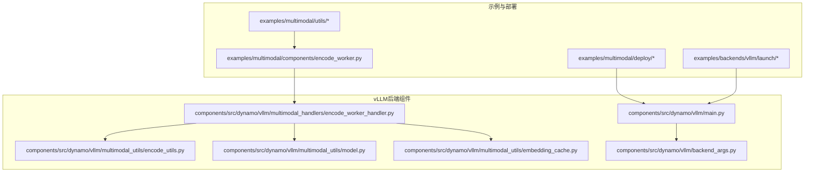
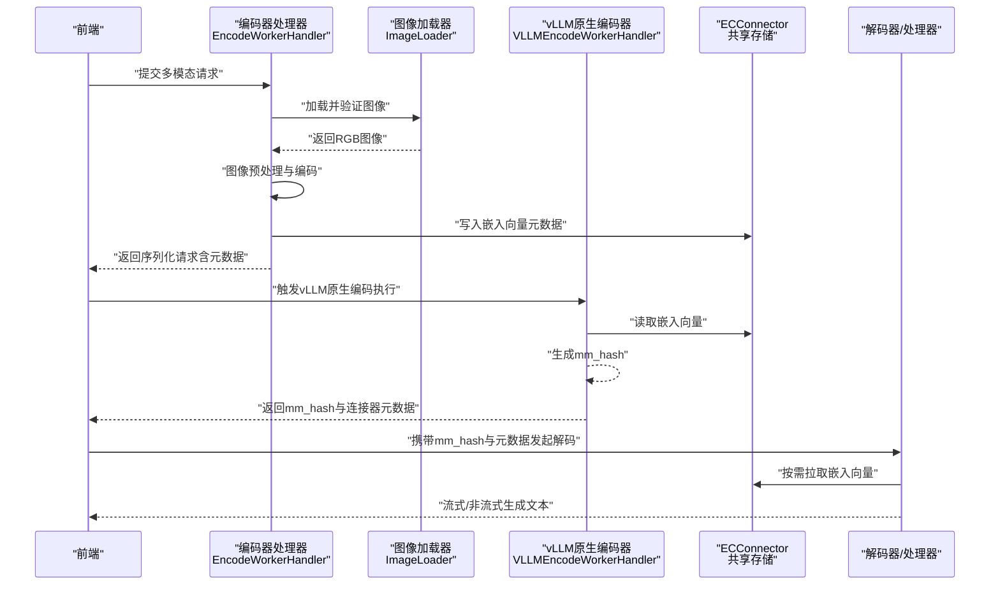
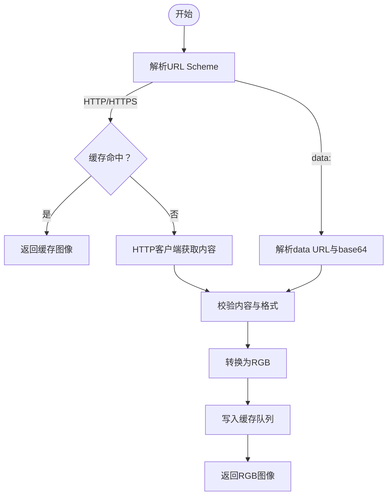
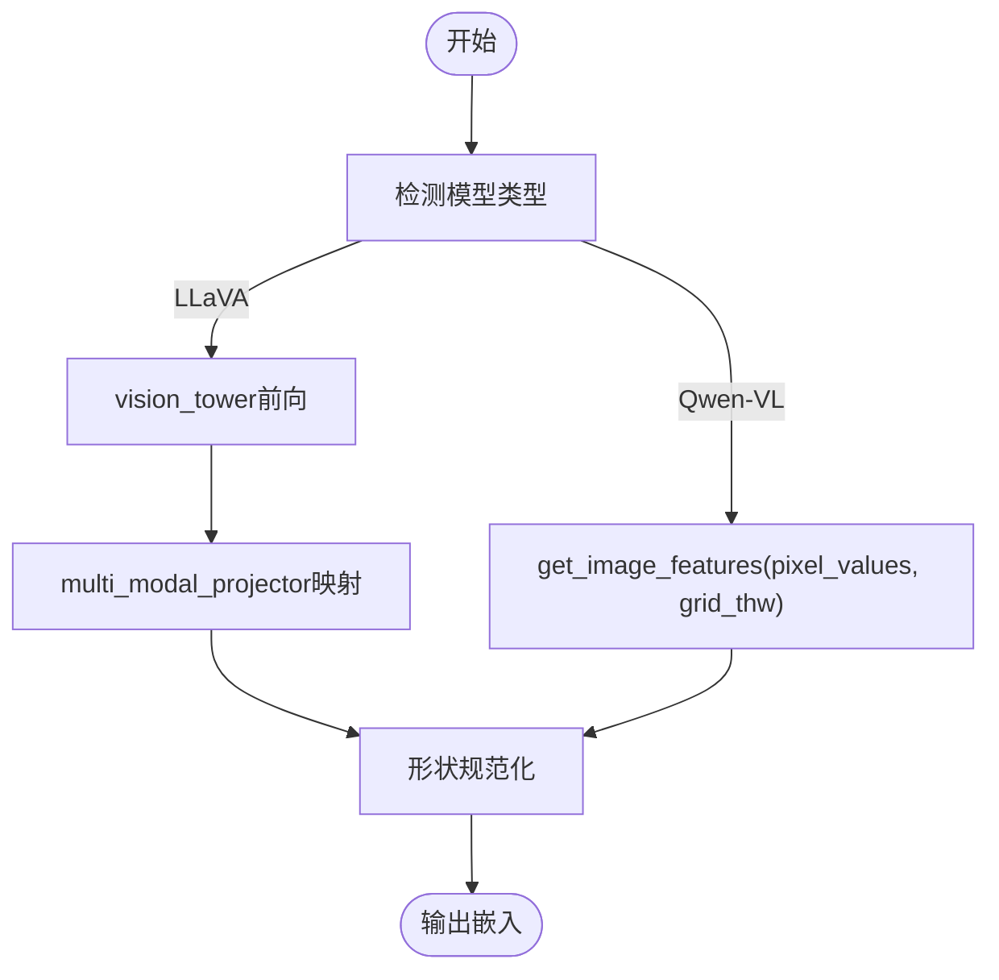
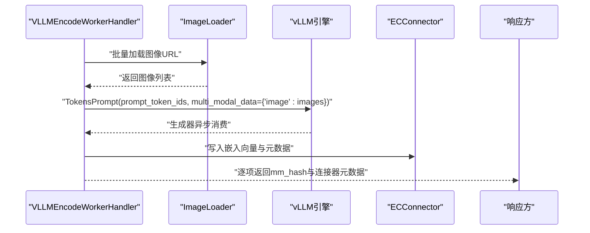
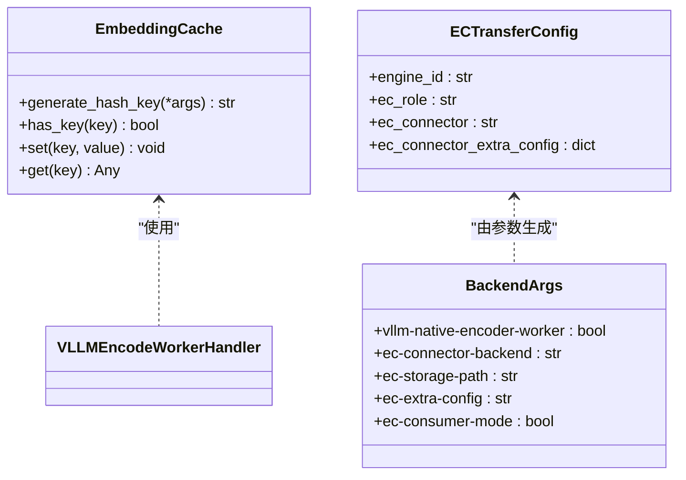
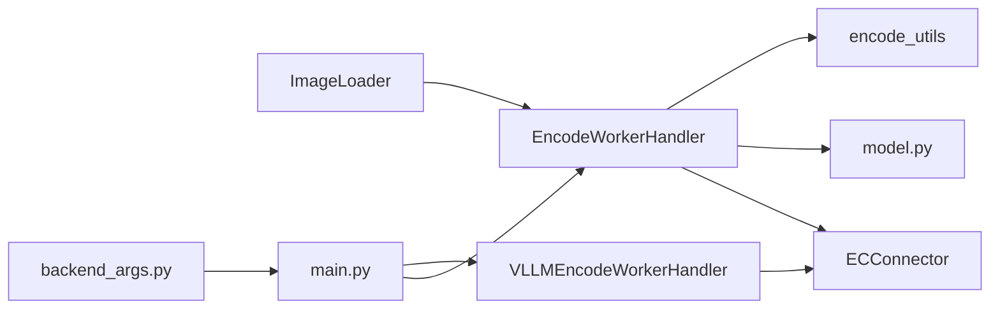

# vLLM多模态示例

<cite>
**本文档引用的文件**
- [examples/multimodal/utils/encode_utils.py](file://examples/multimodal/utils/encode_utils.py)
- [examples/multimodal/utils/image_loader.py](file://examples/multimodal/utils/image_loader.py)
- [examples/multimodal/utils/args.py](file://examples/multimodal/utils/args.py)
- [examples/multimodal/utils/protocol.py](file://examples/multimodal/utils/protocol.py)
- [examples/multimodal/utils/chat_processor.py](file://examples/multimodal/utils/chat_processor.py)
- [examples/multimodal/deploy/agg_llava.yaml](file://examples/multimodal/deploy/agg_llava.yaml)
- [examples/multimodal/deploy/agg_qwen.yaml](file://examples/multimodal/deploy/agg_qwen.yaml)
- [examples/multimodal/components/encode_worker.py](file://examples/multimodal/components/encode_worker.py)
- [components/src/dynamo/vllm/multimodal_handlers/encode_worker_handler.py](file://components/src/dynamo/vllm/multimodal_handlers/encode_worker_handler.py)
- [components/src/dynamo/vllm/multimodal_utils/encode_utils.py](file://components/src/dynamo/vllm/multimodal_utils/encode_utils.py)
- [components/src/dynamo/vllm/multimodal_utils/model.py](file://components/src/dynamo/vllm/multimodal_utils/model.py)
- [components/src/dynamo/vllm/multimodal_utils/embedding_cache.py](file://components/src/dynamo/vllm/multimodal_utils/embedding_cache.py)
- [components/src/dynamo/vllm/main.py](file://components/src/dynamo/vllm/main.py)
- [components/src/dynamo/vllm/backend_args.py](file://components/src/dynamo/vllm/backend_args.py)
- [examples/backends/vllm/launch/agg_multimodal_ec_connector.sh](file://examples/backends/vllm/launch/agg_multimodal_ec_connector.sh)
</cite>

## 目录
1. [简介](#简介)
2. [项目结构](#项目结构)
3. [核心组件](#核心组件)
4. [架构总览](#架构总览)
5. [详细组件分析](#详细组件分析)
6. [依赖关系分析](#依赖关系分析)
7. [性能考虑](#性能考虑)
8. [故障排除指南](#故障排除指南)
9. [结论](#结论)
10. [附录](#附录)

## 简介
本示例文档面向在Dynamo平台上使用vLLM进行视觉语言（多模态）推理的工程师与运维人员，系统性地介绍如何配置与使用多模态流水线，涵盖图像编码器与文本解码器的协同工作、多模态数据预处理流程、EC Connector（编码器连接器）的配置与异步处理、嵌入向量管理（EPD：Embedding Processing Daemon），以及对LLaVA、Qwen-VL等主流模型的支持方式。同时提供性能优化建议、完整的API使用示例与错误处理方法。

## 项目结构
该仓库提供了多模态服务的端到端实现，主要由以下几类文件组成：
- 示例与部署：示例脚本、Kubernetes部署清单、聚合/拆分模式的启动脚本
- 多模态工具与协议：图像加载、编码工具、请求协议定义
- vLLM后端组件：编码器处理器、模型加载与构造、EC Connector配置入口
- 运行时与参数：命令行参数解析、默认配置覆盖、KV事件与传输配置

**图表来源**
- [examples/multimodal/deploy/agg_llava.yaml](file://examples/multimodal/deploy/agg_llava.yaml#L1-L65)
- [examples/multimodal/deploy/agg_qwen.yaml](file://examples/multimodal/deploy/agg_qwen.yaml#L1-L65)
- [examples/multimodal/components/encode_worker.py](file://examples/multimodal/components/encode_worker.py#L1-L265)
- [components/src/dynamo/vllm/multimodal_handlers/encode_worker_handler.py](file://components/src/dynamo/vllm/multimodal_handlers/encode_worker_handler.py#L1-L427)
- [components/src/dynamo/vllm/multimodal_utils/encode_utils.py](file://components/src/dynamo/vllm/multimodal_utils/encode_utils.py#L1-L210)
- [components/src/dynamo/vllm/multimodal_utils/model.py](file://components/src/dynamo/vllm/multimodal_utils/model.py#L1-L305)
- [components/src/dynamo/vllm/multimodal_utils/embedding_cache.py](file://components/src/dynamo/vllm/multimodal_utils/embedding_cache.py#L1-L60)
- [components/src/dynamo/vllm/main.py](file://components/src/dynamo/vllm/main.py#L1029-L1213)
- [components/src/dynamo/vllm/backend_args.py](file://components/src/dynamo/vllm/backend_args.py#L139-L174)

**章节来源**
- [examples/multimodal/deploy/agg_llava.yaml](file://examples/multimodal/deploy/agg_llava.yaml#L1-L65)
- [examples/multimodal/deploy/agg_qwen.yaml](file://examples/multimodal/deploy/agg_qwen.yaml#L1-L65)
- [examples/multimodal/components/encode_worker.py](file://examples/multimodal/components/encode_worker.py#L1-L265)
- [components/src/dynamo/vllm/multimodal_handlers/encode_worker_handler.py](file://components/src/dynamo/vllm/multimodal_handlers/encode_worker_handler.py#L1-L427)

## 核心组件
- 图像加载器（ImageLoader）：支持HTTP/HTTPS与data URL，具备本地缓存与格式校验，避免阻塞事件循环
- 编码工具（encode_utils）：按模型类型选择编码路径，LLaVA使用projector映射，Qwen-VL直接调用视觉特征提取
- 模型工具（model.py）：支持多版本Qwen-VL与LLaVA，自动加载仅视觉编码器或完整模型，并构造多模态输入
- 协议与请求（protocol.py）：定义可序列化的vLLM请求与响应结构，兼容SamplingParams与TokensPrompt
- vLLM编码器处理器（encode_worker_handler.py）：聚合图像加载、编码、EC Connector传输与回传
- EC Connector配置（main.py、backend_args.py）：启用vLLM原生编码器（ECConnector模式）、共享存储路径与消费者模式
- 嵌入缓存（embedding_cache.py）：基于哈希键的本地内存缓存，减少重复计算

**章节来源**
- [examples/multimodal/utils/image_loader.py](file://examples/multimodal/utils/image_loader.py#L1-L111)
- [examples/multimodal/utils/encode_utils.py](file://examples/multimodal/utils/encode_utils.py#L44-L132)
- [components/src/dynamo/vllm/multimodal_utils/encode_utils.py](file://components/src/dynamo/vllm/multimodal_utils/encode_utils.py#L88-L210)
- [components/src/dynamo/vllm/multimodal_utils/model.py](file://components/src/dynamo/vllm/multimodal_utils/model.py#L33-L305)
- [examples/multimodal/utils/protocol.py](file://examples/multimodal/utils/protocol.py#L1-L191)
- [components/src/dynamo/vllm/multimodal_handlers/encode_worker_handler.py](file://components/src/dynamo/vllm/multimodal_handlers/encode_worker_handler.py#L63-L427)
- [components/src/dynamo/vllm/main.py](file://components/src/dynamo/vllm/main.py#L1029-L1213)
- [components/src/dynamo/vllm/backend_args.py](file://components/src/dynamo/vllm/backend_args.py#L139-L174)
- [components/src/dynamo/vllm/multimodal_utils/embedding_cache.py](file://components/src/dynamo/vllm/multimodal_utils/embedding_cache.py#L1-L60)

## 架构总览
下图展示了从前端到编码器再到解码器的多模态推理链路，重点体现EC Connector在编码阶段的作用与数据传输方式。

**图表来源**
- [components/src/dynamo/vllm/multimodal_handlers/encode_worker_handler.py](file://components/src/dynamo/vllm/multimodal_handlers/encode_worker_handler.py#L105-L427)
- [examples/multimodal/utils/image_loader.py](file://examples/multimodal/utils/image_loader.py#L41-L111)
- [components/src/dynamo/vllm/main.py](file://components/src/dynamo/vllm/main.py#L1029-L1213)

## 详细组件分析

### 组件A：图像加载与预处理（ImageLoader）
- 功能要点
  - 支持HTTP/HTTPS与data URL；对data URL进行base64校验
  - 使用线程池避免阻塞事件循环；限制图片格式以安全考虑
  - 基于URL的LRU缓存，控制最大缓存项数
- 关键行为
  - 解析URL Scheme，分别走HTTP客户端或data解析路径
  - 校验图片格式并统一转为RGB
  - 对HTTP来源进行缓存与淘汰

**图表来源**
- [examples/multimodal/utils/image_loader.py](file://examples/multimodal/utils/image_loader.py#L41-L111)

**章节来源**
- [examples/multimodal/utils/image_loader.py](file://examples/multimodal/utils/image_loader.py#L1-L111)

### 组件B：多模态编码与模型适配（encode_utils 与 model.py）
- 功能要点
  - LLaVA：通过vision_tower提取特征，再经projector映射到语言模型嵌入维度
  - Qwen-VL：直接调用视觉编码器的特征提取接口，支持image_grid_thw参数
  - 模型名称归一化与支持列表，便于扩展新模型
- 关键行为
  - 在无梯度环境下执行编码，避免额外开销
  - 针对Qwen-VL进行嵌入张量拆分，保证批维度正确

**图表来源**
- [examples/multimodal/utils/encode_utils.py](file://examples/multimodal/utils/encode_utils.py#L58-L132)
- [components/src/dynamo/vllm/multimodal_utils/encode_utils.py](file://components/src/dynamo/vllm/multimodal_utils/encode_utils.py#L88-L162)
- [components/src/dynamo/vllm/multimodal_utils/model.py](file://components/src/dynamo/vllm/multimodal_utils/model.py#L139-L247)

**章节来源**
- [examples/multimodal/utils/encode_utils.py](file://examples/multimodal/utils/encode_utils.py#L44-L132)
- [components/src/dynamo/vllm/multimodal_utils/encode_utils.py](file://components/src/dynamo/vllm/multimodal_utils/encode_utils.py#L88-L162)
- [components/src/dynamo/vllm/multimodal_utils/model.py](file://components/src/dynamo/vllm/multimodal_utils/model.py#L33-L305)

### 组件C：vLLM原生编码器与EC Connector（VLLMEncodeWorkerHandler）
- 功能要点
  - 接收多模态组列表，批量加载图像并一次性提交给vLLM引擎
  - 通过MultiModalHasher为每张图像生成mm_hash，用于后续KV路由与缓存
  - 支持ECConnector生产者模式，将嵌入向量写入共享存储
- 关键行为
  - 异步消费生成器以触发编码执行
  - 为每个图像项返回独立请求ID与连接器元数据

**图表来源**
- [components/src/dynamo/vllm/multimodal_handlers/encode_worker_handler.py](file://components/src/dynamo/vllm/multimodal_handlers/encode_worker_handler.py#L317-L414)

**章节来源**
- [components/src/dynamo/vllm/multimodal_handlers/encode_worker_handler.py](file://components/src/dynamo/vllm/multimodal_handlers/encode_worker_handler.py#L284-L427)

### 组件D：嵌入缓存与传输（EmbeddingCache 与 EC Connector配置）
- 功能要点
  - EmbeddingCache：基于SHA256的键值缓存，避免重复计算
  - EC Connector：通过共享存储实现编码器与解码器之间的高效传输
  - 后端参数：启用vLLM原生编码器、设置ECConnector后端与存储路径、消费者模式
- 关键行为
  - 生产者模式：编码完成后写入共享存储
  - 消费者模式：解码阶段从共享存储读取嵌入向量

**图表来源**
- [components/src/dynamo/vllm/multimodal_utils/embedding_cache.py](file://components/src/dynamo/vllm/multimodal_utils/embedding_cache.py#L1-L60)
- [components/src/dynamo/vllm/multimodal_utils/encode_utils.py](file://components/src/dynamo/vllm/multimodal_utils/encode_utils.py#L165-L210)
- [components/src/dynamo/vllm/backend_args.py](file://components/src/dynamo/vllm/backend_args.py#L139-L174)

**章节来源**
- [components/src/dynamo/vllm/multimodal_utils/embedding_cache.py](file://components/src/dynamo/vllm/multimodal_utils/embedding_cache.py#L1-L60)
- [components/src/dynamo/vllm/multimodal_utils/encode_utils.py](file://components/src/dynamo/vllm/multimodal_utils/encode_utils.py#L165-L210)
- [components/src/dynamo/vllm/backend_args.py](file://components/src/dynamo/vllm/backend_args.py#L139-L174)

### 组件E：协议与请求（protocol.py）
- 功能要点
  - 定义vLLM可序列化的请求与响应结构，兼容SamplingParams与TokensPrompt
  - 支持多模态消息内容（文本、图像URL、音频URL、视频URL）
  - 提供vLLMMultimodalRequest与MyRequestOutput，便于跨组件传递
- 关键行为
  - 通过自定义类型绕过SamplingParams的序列化限制
  - 修复TokensPrompt中multi_modal_data的泛型类型问题

**章节来源**
- [examples/multimodal/utils/protocol.py](file://examples/multimodal/utils/protocol.py#L1-L191)

### 组件F：聊天与补全预处理（chat_processor.py）
- 功能要点
  - 为OpenAI兼容的聊天与补全请求提供预处理与流式响应
  - 支持多模态场景下的prompt渲染与TokensPrompt构造
- 关键行为
  - 非流式请求聚合所有增量，流式请求按增量输出

**章节来源**
- [examples/multimodal/utils/chat_processor.py](file://examples/multimodal/utils/chat_processor.py#L1-L348)

## 依赖关系分析
- 组件耦合
  - 编码器处理器依赖图像加载器、编码工具与模型工具
  - vLLM原生编码器处理器依赖ECConnector与MultiModalHasher
  - 参数模块负责覆盖默认配置，确保多模态与KV事件开启
- 外部依赖
  - vLLM引擎与AsyncEngineArgs
  - transformers图像处理器与AutoModel
  - dynamo.nixl_connect（ECConnector）

**图表来源**
- [components/src/dynamo/vllm/multimodal_handlers/encode_worker_handler.py](file://components/src/dynamo/vllm/multimodal_handlers/encode_worker_handler.py#L24-L34)
- [components/src/dynamo/vllm/backend_args.py](file://components/src/dynamo/vllm/backend_args.py#L139-L174)
- [components/src/dynamo/vllm/main.py](file://components/src/dynamo/vllm/main.py#L1029-L1213)

**章节来源**
- [components/src/dynamo/vllm/multimodal_handlers/encode_worker_handler.py](file://components/src/dynamo/vllm/multimodal_handlers/encode_worker_handler.py#L1-L427)
- [components/src/dynamo/vllm/backend_args.py](file://components/src/dynamo/vllm/backend_args.py#L139-L174)
- [components/src/dynamo/vllm/main.py](file://components/src/dynamo/vllm/main.py#L1029-L1213)

## 性能考虑
- 批量处理
  - vLLM原生编码器支持批量图像输入，减少引擎启动与上下文切换开销
- 内存管理
  - 仅加载视觉编码器以降低显存占用；对Qwen-VL通过环境变量禁用多进程并限制max_model_len
- GPU利用率
  - 使用异步I/O与线程池避免阻塞；在ECConnector模式下利用共享存储减少显存拷贝
- 缓存策略
  - 嵌入向量缓存与图像加载缓存双层缓存，显著降低重复请求延迟
- KV事件与前缀缓存
  - 默认启用前缀缓存与KV事件，结合ECConnector实现高效的KV块传输

[本节为通用指导，无需特定文件引用]

## 故障排除指南
- 图像加载失败
  - 检查URL Scheme是否为http/https或data；确认data URL的base64编码有效
  - 校验图片格式是否为JPEG/PNG/WEBP
- 编码异常
  - LLaVA缺少projector：确认模型配置包含multi_modal_projector
  - Qwen-VL缺少image_grid_thw：确保图像预处理返回该参数
- ECConnector传输失败
  - 确认共享存储路径存在且可写；检查ECConnector后端类名与额外配置JSON格式
- vLLM原生编码器未生效
  - 检查是否启用--vllm-native-encoder-worker与--ec-storage-path；消费者模式需设置--ec-consumer-mode

**章节来源**
- [examples/multimodal/utils/image_loader.py](file://examples/multimodal/utils/image_loader.py#L51-L111)
- [examples/multimodal/utils/encode_utils.py](file://examples/multimodal/utils/encode_utils.py#L86-L95)
- [components/src/dynamo/vllm/multimodal_utils/encode_utils.py](file://components/src/dynamo/vllm/multimodal_utils/encode_utils.py#L165-L210)
- [components/src/dynamo/vllm/backend_args.py](file://components/src/dynamo/vllm/backend_args.py#L139-L174)

## 结论
通过本示例文档，您可以在Dynamo平台上完成从图像加载、多模态编码到文本解码的完整流水线配置。vLLM原生编码器与ECConnector的组合实现了高效的分布式多模态推理，配合嵌入缓存与KV事件机制，可在大规模部署中获得稳定的吞吐与低延迟表现。针对不同模型（LLaVA、Qwen-VL），系统提供了清晰的适配路径与参数配置，便于快速扩展与维护。

[本节为总结性内容，无需特定文件引用]

## 附录

### A. 多模态模型支持矩阵
- LLaVA系列：需要vision_tower与multi_modal_projector
- Qwen-VL系列：直接调用视觉编码器特征提取，支持image_grid_thw
- LLaVA NeXT Video：支持视频输入，需特殊处理

**章节来源**
- [components/src/dynamo/vllm/multimodal_utils/model.py](file://components/src/dynamo/vllm/multimodal_utils/model.py#L33-L43)
- [components/src/dynamo/vllm/multimodal_utils/model.py](file://components/src/dynamo/vllm/multimodal_utils/model.py#L203-L247)

### B. 配置与部署示例
- 聚合模式（LLaVA）
  - 参考部署清单：[examples/multimodal/deploy/agg_llava.yaml](file://examples/multimodal/deploy/agg_llava.yaml#L1-L65)
- 聚合模式（Qwen-VL）
  - 参考部署清单：[examples/multimodal/deploy/agg_qwen.yaml](file://examples/multimodal/deploy/agg_qwen.yaml#L1-L65)
- EC Connector启动脚本
  - 参考脚本：[examples/backends/vllm/launch/agg_multimodal_ec_connector.sh](file://examples/backends/vllm/launch/agg_multimodal_ec_connector.sh#L1-L92)

**章节来源**
- [examples/multimodal/deploy/agg_llava.yaml](file://examples/multimodal/deploy/agg_llava.yaml#L1-L65)
- [examples/multimodal/deploy/agg_qwen.yaml](file://examples/multimodal/deploy/agg_qwen.yaml#L1-L65)
- [examples/backends/vllm/launch/agg_multimodal_ec_connector.sh](file://examples/backends/vllm/launch/agg_multimodal_ec_connector.sh#L1-L92)

### C. API使用示例与错误处理
- 请求结构
  - vLLMMultimodalRequest：包含模型、消息、采样参数、图像网格与嵌入形状
  - vLLMGenerateRequest：封装TokensPrompt与SamplingParams
- 错误处理
  - 图像加载异常、模型不支持、ECConnector配置错误等均会抛出明确异常并记录日志
- 流式与非流式响应
  - 通过chat_processor.py提供的流式/非流式响应处理器，按需选择输出格式

**章节来源**
- [examples/multimodal/utils/protocol.py](file://examples/multimodal/utils/protocol.py#L73-L191)
- [examples/multimodal/utils/chat_processor.py](file://examples/multimodal/utils/chat_processor.py#L128-L348)