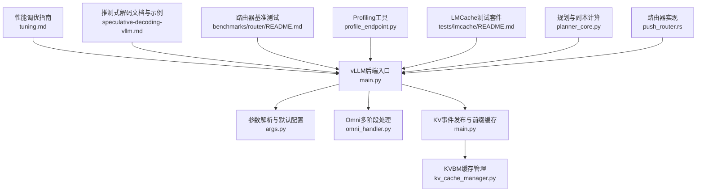
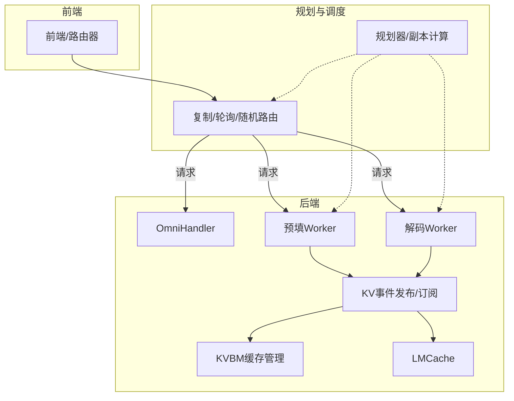
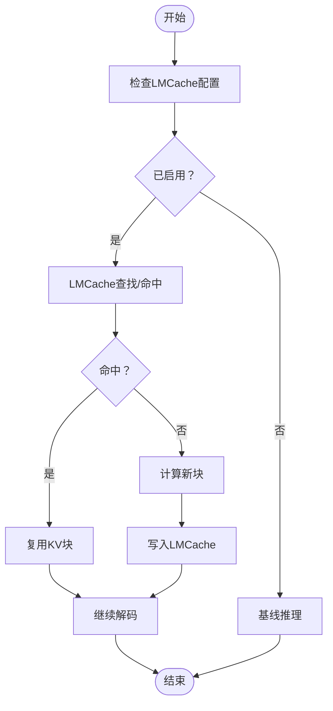
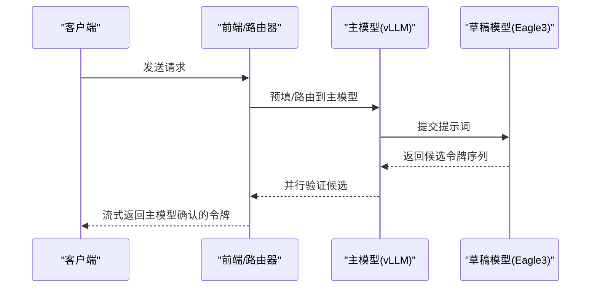
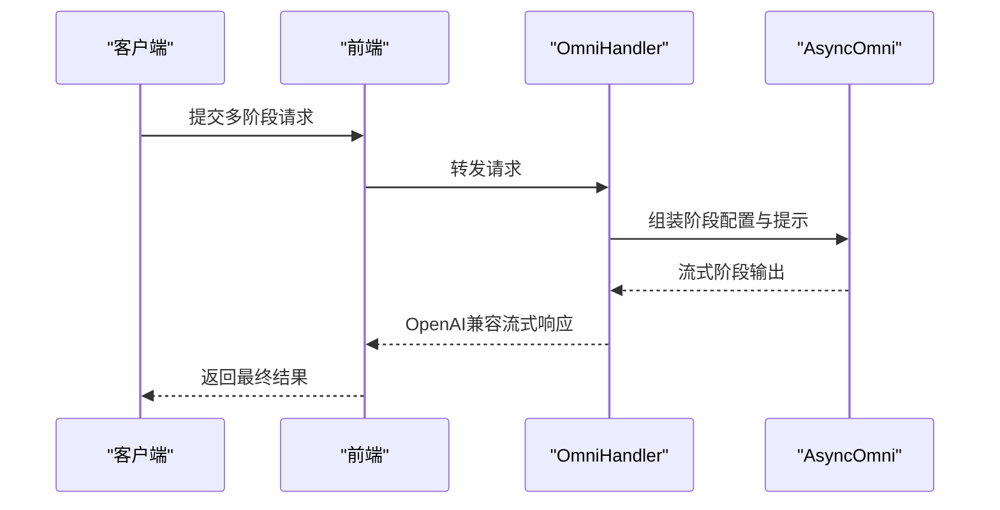
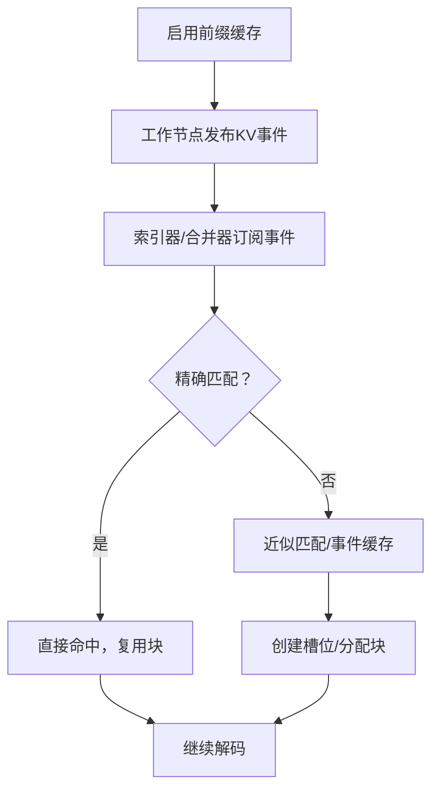
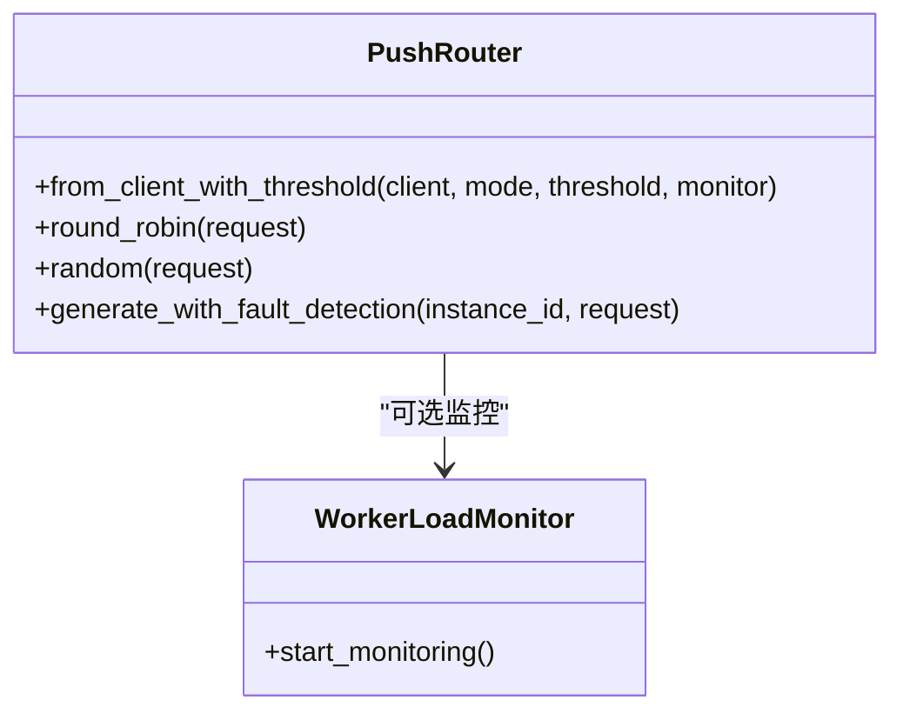
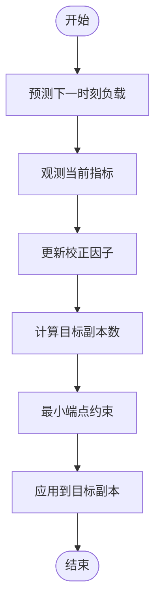
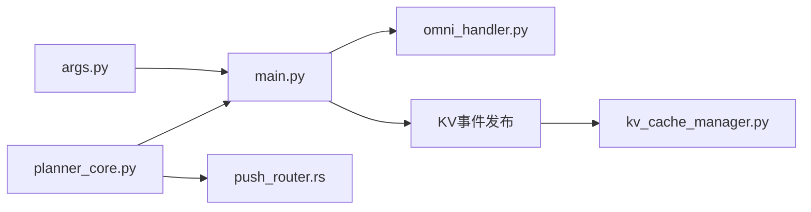

# vLLM性能优化示例

<cite>
**本文档引用的文件**
- [components/src/dynamo/vllm/main.py](file://components/src/dynamo/vllm/main.py)
- [components/src/dynamo/vllm/args.py](file://components/src/dynamo/vllm/args.py)
- [components/src/dynamo/vllm/omni/omni_handler.py](file://components/src/dynamo/vllm/omni/omni_handler.py)
- [docs/pages/performance/tuning.md](file://docs/pages/performance/tuning.md)
- [docs/pages/features/speculative-decoding/README.md](file://docs/pages/features/speculative-decoding/README.md)
- [docs/pages/features/speculative-decoding/speculative-decoding-vllm.md](file://docs/pages/features/speculative-decoding/speculative-decoding-vllm.md)
- [examples/backends/vllm/launch/agg_spec_decoding.sh](file://examples/backends/vllm/launch/agg_spec_decoding.sh)
- [benchmarks/router/README.md](file://benchmarks/router/README.md)
- [benchmarks/router/prefix_ratio_benchmark.py](file://benchmarks/router/prefix_ratio_benchmark.py)
- [benchmarks/profiler/profile_endpoint.py](file://benchmarks/profiler/profile_endpoint.py)
- [benchmarks/profiler/utils/config_modifiers/vllm.py](file://benchmarks/profiler/utils/config_modifiers/vllm.py)
- [lib/bindings/kvbm/python/kvbm/vllm_integration/kv_cache_manager.py](file://lib/bindings/kvbm/python/kvbm/vllm_integration/kv_cache_manager.py)
- [tests/lmcache/README.md](file://tests/lmcache/README.md)
- [tests/lmcache/summarize_scores_dynamo.py](file://tests/lmcache/summarize_scores_dynamo.py)
- [components/src/dynamo/planner/utils/planner_core.py](file://components/src/dynamo/planner/utils/planner_core.py)
- [tests/planner/test_replica_calculation.py](file://tests/planner/test_replica_calculation.py)
- [lib/runtime/src/pipeline/network/egress/push_router.rs](file://lib/runtime/src/pipeline/network/egress/push_router.rs)
</cite>

## 目录
1. [简介](#简介)
2. [项目结构](#项目结构)
3. [核心组件](#核心组件)
4. [架构总览](#架构总览)
5. [详细组件分析](#详细组件分析)
6. [依赖关系分析](#依赖关系分析)
7. [性能考量](#性能考量)
8. [故障排查指南](#故障排查指南)
9. [结论](#结论)
10. [附录](#附录)

## 简介
本文件面向vLLM在Dynamo平台上的性能优化与工程落地，系统性覆盖以下主题：
- LMCache集成与缓存策略、内存管理、命中率优化
- 推测式解码（Speculative Decoding）配置与效果，含主模型与草稿模型协同
- Omni处理模式（多阶段流水线）配置与多任务处理
- 近似路由（Approximate Routing）与KV事件路由的实现要点
- 路由器副本（Replicas）配置与高可用性
- 性能基准测试方法与结果分析流程
- 面向不同场景的优化建议与最佳实践

## 项目结构
围绕vLLM性能优化的关键目录与文件：
- vLLM后端入口与初始化：components/src/dynamo/vllm/main.py、components/src/dynamo/vllm/args.py
- Omni多阶段处理：components/src/dynamo/vllm/omni/omni_handler.py
- 性能调优指南：docs/pages/performance/tuning.md
- 推测式解码文档与示例脚本：docs/pages/features/speculative-decoding/*、examples/backends/vllm/launch/agg_spec_decoding.sh
- 路由器基准测试：benchmarks/router/*
- Profiling工具：benchmarks/profiler/*
- KVBM缓存管理与块分配：lib/bindings/kvbm/python/kvbm/vllm_integration/kv_cache_manager.py
- LMCache测试套件：tests/lmcache/*
- 规划与副本计算：components/src/dynamo/planner/utils/planner_core.py、tests/planner/test_replica_calculation.py
- 路由器实现（复制/轮询/随机等）：lib/runtime/src/pipeline/network/egress/push_router.rs

**图表来源**
- [components/src/dynamo/vllm/main.py](file://components/src/dynamo/vllm/main.py#L1-L120)
- [components/src/dynamo/vllm/args.py](file://components/src/dynamo/vllm/args.py#L1-L120)
- [components/src/dynamo/vllm/omni/omni_handler.py](file://components/src/dynamo/vllm/omni/omni_handler.py#L1-L60)
- [docs/pages/performance/tuning.md](file://docs/pages/performance/tuning.md#L1-L60)
- [docs/pages/features/speculative-decoding/speculative-decoding-vllm.md](file://docs/pages/features/speculative-decoding/speculative-decoding-vllm.md#L99-L121)
- [benchmarks/router/README.md](file://benchmarks/router/README.md#L1-L60)
- [benchmarks/profiler/profile_endpoint.py](file://benchmarks/profiler/profile_endpoint.py#L1-L60)
- [lib/bindings/kvbm/python/kvbm/vllm_integration/kv_cache_manager.py](file://lib/bindings/kvbm/python/kvbm/vllm_integration/kv_cache_manager.py#L105-L137)
- [tests/lmcache/README.md](file://tests/lmcache/README.md#L1-L60)
- [components/src/dynamo/planner/utils/planner_core.py](file://components/src/dynamo/planner/utils/planner_core.py#L612-L645)
- [lib/runtime/src/pipeline/network/egress/push_router.rs](file://lib/runtime/src/pipeline/network/egress/push_router.rs#L143-L209)

**章节来源**
- [components/src/dynamo/vllm/main.py](file://components/src/dynamo/vllm/main.py#L1-L120)
- [components/src/dynamo/vllm/args.py](file://components/src/dynamo/vllm/args.py#L1-L120)

## 核心组件
- vLLM引擎初始化与端点注册：负责根据配置选择预填/解码/多模态/Omni等路径，并设置指标采集、KV事件发布、睡眠唤醒路由等。
- 参数解析与默认配置：统一Dynamo运行时参数与vLLM引擎参数，自动注入KV事件、连接器配置、默认采样参数等。
- Omni多阶段处理：基于AsyncOmni编排多阶段文本到图像/文本生成，支持OpenAI兼容流式输出。
- 路由器与复制：提供轮询、随机、忙阈值等路由策略，支持副本扩展与故障检测。

**章节来源**
- [components/src/dynamo/vllm/main.py](file://components/src/dynamo/vllm/main.py#L535-L800)
- [components/src/dynamo/vllm/args.py](file://components/src/dynamo/vllm/args.py#L304-L393)
- [components/src/dynamo/vllm/omni/omni_handler.py](file://components/src/dynamo/vllm/omni/omni_handler.py#L17-L70)
- [lib/runtime/src/pipeline/network/egress/push_router.rs](file://lib/runtime/src/pipeline/network/egress/push_router.rs#L143-L209)

## 架构总览
下图展示vLLM在Dynamo中的关键交互：前端请求经路由器/复制器进入后端；后端根据配置选择不同执行路径；通过KV事件与KVBM/LMCache实现前缀共享与命中率优化；Omni支持多阶段流水线；规划器动态调整副本数以满足SLA。

**图表来源**
- [components/src/dynamo/vllm/main.py](file://components/src/dynamo/vllm/main.py#L535-L800)
- [components/src/dynamo/vllm/omni/omni_handler.py](file://components/src/dynamo/vllm/omni/omni_handler.py#L17-L70)
- [lib/bindings/kvbm/python/kvbm/vllm_integration/kv_cache_manager.py](file://lib/bindings/kvbm/python/kvbm/vllm_integration/kv_cache_manager.py#L105-L137)
- [components/src/dynamo/planner/utils/planner_core.py](file://components/src/dynamo/planner/utils/planner_core.py#L612-L645)
- [lib/runtime/src/pipeline/network/egress/push_router.rs](file://lib/runtime/src/pipeline/network/egress/push_router.rs#L143-L209)

## 详细组件分析

### LMCache使用与优化
- 启用方式：通过部署脚本开启LMCache并设置环境变量（如分块大小、本地CPU缓存上限），对比基线与启用LMCache的MMLU测试结果，差异小于1%视为正确。
- 缓存策略：LMCache将重复前缀映射为可复用的KV块，减少注意力计算与带宽占用。
- 内存管理：合理设置分块大小与本地缓存上限，避免频繁回退至磁盘或触发OOM。
- 命中率优化：通过前缀共享比例、请求长度分布与块大小进行权衡；结合路由器KV事件与KVBM索引提升重用概率。

**图表来源**
- [tests/lmcache/README.md](file://tests/lmcache/README.md#L61-L75)
- [tests/lmcache/summarize_scores_dynamo.py](file://tests/lmcache/summarize_scores_dynamo.py#L190-L216)

**章节来源**
- [tests/lmcache/README.md](file://tests/lmcache/README.md#L1-L106)
- [tests/lmcache/summarize_scores_dynamo.py](file://tests/lmcache/summarize_scores_dynamo.py#L190-L216)

### 推测式解码（Speculative Decoding）
- 模型与配置：主模型为Meta-Llama-3.1-8B-Instruct，草稿模型采用Eagle3变体；聚合模式部署，支持单GPU演示。
- 关键参数：草稿张量并行度、推测令牌数、方法类型等在启动脚本中配置。
- 效果：通过草稿模型并行验证候选令牌，显著降低主模型的解码次数，缩短TTFT与ITL。

**图表来源**
- [docs/pages/features/speculative-decoding/speculative-decoding-vllm.md](file://docs/pages/features/speculative-decoding/speculative-decoding-vllm.md#L99-L121)
- [examples/backends/vllm/launch/agg_spec_decoding.sh](file://examples/backends/vllm/launch/agg_spec_decoding.sh#L18-L29)

**章节来源**
- [docs/pages/features/speculative-decoding/README.md](file://docs/pages/features/speculative-decoding/README.md#L1-L59)
- [docs/pages/features/speculative-decoding/speculative-decoding-vllm.md](file://docs/pages/features/speculative-decoding/speculative-decoding-vllm.md#L99-L121)
- [examples/backends/vllm/launch/agg_spec_decoding.sh](file://examples/backends/vllm/launch/agg_spec_decoding.sh#L1-L29)

### Omni处理模式（多阶段流水线）
- 初始化：OmniHandler基于AsyncOmni编排多阶段生成，支持文本到文本/文本到图像等。
- 端点注册：与常规vLLM端点一致，支持健康检查与指标标签。
- 适用场景：需要多阶段处理（如检索增强、视觉理解后生成）的复杂工作流。

**图表来源**
- [components/src/dynamo/vllm/omni/omni_handler.py](file://components/src/dynamo/vllm/omni/omni_handler.py#L17-L70)
- [components/src/dynamo/vllm/main.py](file://components/src/dynamo/vllm/main.py#L1293-L1372)

**章节来源**
- [components/src/dynamo/vllm/omni/omni_handler.py](file://components/src/dynamo/vllm/omni/omni_handler.py#L1-L146)
- [components/src/dynamo/vllm/main.py](file://components/src/dynamo/vllm/main.py#L1293-L1372)

### 近似路由（Approximate Routing）与KV事件
- 近似路由：当无法精确匹配KV事件时，使用近似索引或事件缓存进行路由决策，降低一致性开销。
- KV事件发布：在启用前缀缓存时，预填/解码工作节点按数据并行维度发布KV事件，供索引器/合并器消费。
- KVBM集成：通过KVBM缓存管理器创建槽位、分配块，支持延迟缓存块等策略以平衡命中率与内存占用。

**图表来源**
- [components/src/dynamo/vllm/main.py](file://components/src/dynamo/vllm/main.py#L283-L358)
- [lib/bindings/kvbm/python/kvbm/vllm_integration/kv_cache_manager.py](file://lib/bindings/kvbm/python/kvbm/vllm_integration/kv_cache_manager.py#L105-L137)

**章节来源**
- [components/src/dynamo/vllm/main.py](file://components/src/dynamo/vllm/main.py#L283-L358)
- [lib/bindings/kvbm/python/kvbm/vllm_integration/kv_cache_manager.py](file://lib/bindings/kvbm/python/kvbm/vllm_integration/kv_cache_manager.py#L105-L137)

### 路由器副本（Replicas）配置与高可用
- 复制策略：支持轮询、随机、忙阈值等路由模式，结合实例可用列表进行选择。
- 动态监控：可选工作负载监控器，按阈值动态调整路由行为。
- 故障检测：在生成过程中启用故障检测，提升高可用性。

**图表来源**
- [lib/runtime/src/pipeline/network/egress/push_router.rs](file://lib/runtime/src/pipeline/network/egress/push_router.rs#L143-L209)

**章节来源**
- [lib/runtime/src/pipeline/network/egress/push_router.rs](file://lib/runtime/src/pipeline/network/egress/push_router.rs#L143-L209)

### 规划与副本计算（面向SLA）
- 预测与校正：基于请求数、平均序列长度、队列长度等指标预测负载，并通过校正因子调整。
- 副本计算：根据预测的吞吐与GPU资源，计算解码副本数量，考虑最小端点约束。
- 多GPU引擎：支持不同预填/解码引擎的GPU规模组合，动态调整以满足SLA。

**图表来源**
- [components/src/dynamo/planner/utils/planner_core.py](file://components/src/dynamo/planner/utils/planner_core.py#L612-L645)
- [tests/planner/test_replica_calculation.py](file://tests/planner/test_replica_calculation.py#L284-L345)

**章节来源**
- [components/src/dynamo/planner/utils/planner_core.py](file://components/src/dynamo/planner/utils/planner_core.py#L612-L645)
- [tests/planner/test_replica_calculation.py](file://tests/planner/test_replica_calculation.py#L284-L345)

## 依赖关系分析
- vLLM引擎初始化依赖参数解析模块，后者负责KV事件配置、连接器配置与默认参数注入。
- 前缀缓存与KV事件发布依赖数据并行维度，确保每个rank独立发布/订阅。
- OmniHandler不依赖于VllmEngineMonitor（因为AsyncOmni内部管理引擎），但仍遵循通用处理器模式。
- 路由器实现与规划器相互独立，但可通过规划器输出的目标副本影响路由实例选择。

**图表来源**
- [components/src/dynamo/vllm/args.py](file://components/src/dynamo/vllm/args.py#L304-L393)
- [components/src/dynamo/vllm/main.py](file://components/src/dynamo/vllm/main.py#L535-L800)
- [components/src/dynamo/vllm/omni/omni_handler.py](file://components/src/dynamo/vllm/omni/omni_handler.py#L17-L70)
- [lib/bindings/kvbm/python/kvbm/vllm_integration/kv_cache_manager.py](file://lib/bindings/kvbm/python/kvbm/vllm_integration/kv_cache_manager.py#L105-L137)
- [components/src/dynamo/planner/utils/planner_core.py](file://components/src/dynamo/planner/utils/planner_core.py#L612-L645)
- [lib/runtime/src/pipeline/network/egress/push_router.rs](file://lib/runtime/src/pipeline/network/egress/push_router.rs#L143-L209)

**章节来源**
- [components/src/dynamo/vllm/args.py](file://components/src/dynamo/vllm/args.py#L304-L393)
- [components/src/dynamo/vllm/main.py](file://components/src/dynamo/vllm/main.py#L535-L800)

## 性能考量
- 张量并行与流水并行：在Dense模型上通常采用“节点内TP、跨节点PP”的映射，具体TP/PP组合需结合模型规模与通信能力。
- 批大小与最大令牌数：预填引擎偏好小批大令牌，解码引擎偏好大批中小令牌；块大小对前缀缓存命中率与传输效率有直接影响。
- KV缓存与内存：KV缓存容量与命中率在高并发下尤为关键；可通过增加TP、增大块大小、启用前缀缓存与LMCache提升命中率。
- 路由与复制：在高负载场景下，适当增加解码副本数并启用近似路由可降低排队与尾延迟。
- Profiling与基准：使用profiler工具分别对预填与解码阶段进行性能剖析，结合路由器基准脚本评估前缀共享收益。

[本节为通用指导，无需特定文件引用]

## 故障排查指南
- 前端/路由器连接失败：检查端口、容器网络与服务发现配置。
- OOM问题：降低最大批大小、最大令牌数或模型显存利用率；必要时减少副本数。
- 命中率低：检查块大小、前缀共享比例与LMCache配置；确认KV事件发布/订阅正常。
- 推测式解码异常：核对主/草稿模型版本兼容性与启动参数；确保聚合模式部署正确。
- 规划与副本：若SLA未达标，检查预测器输入与校正因子；确认最小端点约束未过度限制。

**章节来源**
- [benchmarks/router/README.md](file://benchmarks/router/README.md#L317-L323)

## 结论
通过LMCache、KV事件与KVBM的协同，vLLM在Dynamo中实现了高效的前缀共享与命中率优化；推测式解码进一步降低了主模型负担；Omni多阶段处理满足复杂业务需求；路由器复制与规划器动态副本计算保障了高可用与SLA达成。结合profiling与路由器基准测试，可系统性地定位瓶颈并迭代优化。

[本节为总结，无需特定文件引用]

## 附录

### 完整性能基准测试方法
- 预填/解码阶段剖析：使用profiler工具分别对预填与解码阶段进行性能剖析，记录吞吐、TTFT、ITL等指标。
- 路由器基准：使用路由器基准脚本，设置不同前缀比例、并发与请求量，评估缓存感知路由的收益。
- LMCache对比：在相同模型与数据集下，对比启用/禁用LMCache的MMLU结果，确保一致性。

**章节来源**
- [benchmarks/profiler/profile_endpoint.py](file://benchmarks/profiler/profile_endpoint.py#L22-L124)
- [benchmarks/router/README.md](file://benchmarks/router/README.md#L166-L273)
- [tests/lmcache/README.md](file://tests/lmcache/README.md#L29-L48)

### 针对不同场景的优化建议
- 低负载：优先单体引擎，减少调度开销；中等负载：适度拆分预填/解码，关注ITL与TTFT平衡；高负载：最大化解码副本数，启用前缀缓存与LMCache，结合近似路由降低排队。

**章节来源**
- [docs/pages/performance/tuning.md](file://docs/pages/performance/tuning.md#L100-L137)