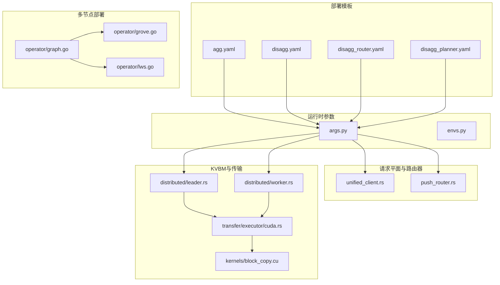
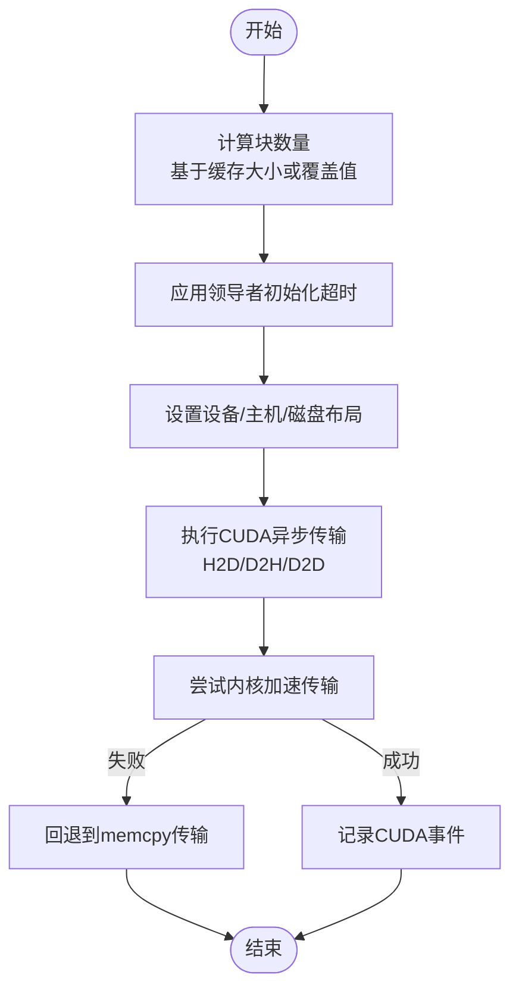
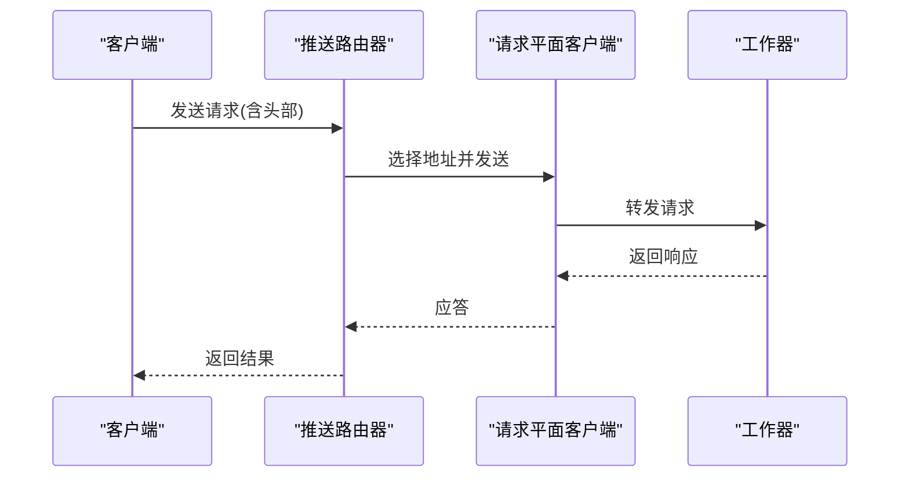
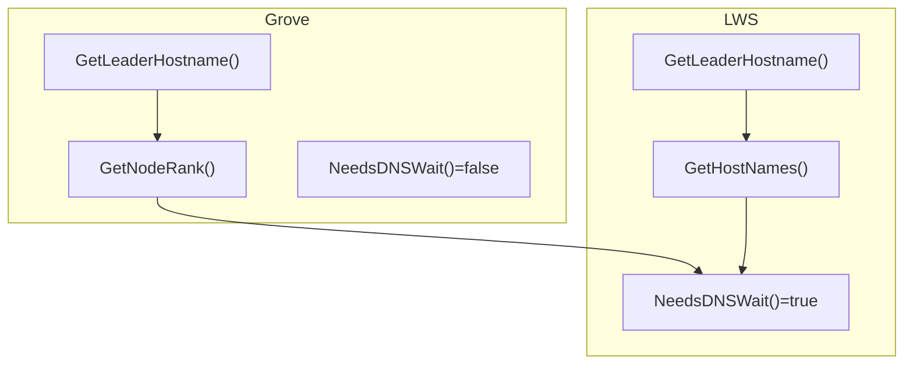
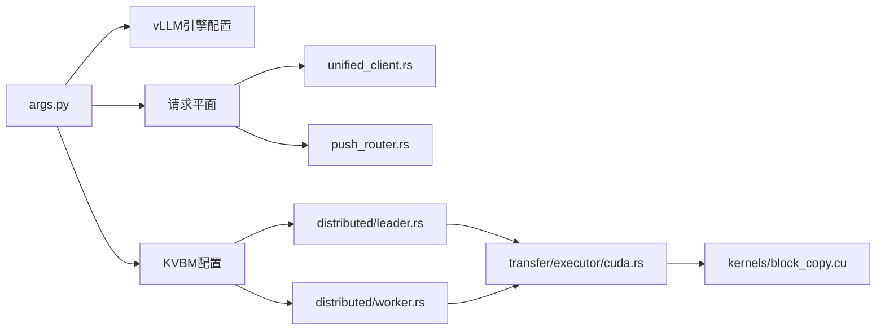

# vLLM部署配置

<cite>
**本文引用的文件**
- [examples/backends/vllm/deploy/agg.yaml](file://examples/backends/vllm/deploy/agg.yaml)
- [examples/backends/vllm/deploy/disagg.yaml](file://examples/backends/vllm/deploy/disagg.yaml)
- [examples/backends/vllm/deploy/disagg_router.yaml](file://examples/backends/vllm/deploy/disagg_router.yaml)
- [examples/backends/vllm/deploy/disagg_planner.yaml](file://examples/backends/vllm/deploy/disagg_planner.yaml)
- [examples/backends/vllm/deploy/README.md](file://examples/backends/vllm/deploy/README.md)
- [components/src/dynamo/vllm/args.py](file://components/src/dynamo/vllm/args.py)
- [components/src/dynamo/vllm/envs.py](file://components/src/dynamo/vllm/envs.py)
- [lib/runtime/src/pipeline/network/egress/unified_client.rs](file://lib/runtime/src/pipeline/network/egress/unified_client.rs)
- [lib/runtime/src/pipeline/network/egress/push_router.rs](file://lib/runtime/src/pipeline/network/egress/push_router.rs)
- [lib/llm/src/block_manager/distributed/leader.rs](file://lib/llm/src/block_manager/distributed/leader.rs)
- [lib/llm/src/block_manager/distributed/worker.rs](file://lib/llm/src/block_manager/distributed/worker.rs)
- [lib/llm/src/block_manager/v2/physical/transfer/executor/cuda.rs](file://lib/llm/src/block_manager/v2/physical/transfer/executor/cuda.rs)
- [lib/llm/src/kernels/block_copy.cu](file://lib/llm/src/kernels/block_copy.cu)
- [lib/runtime/src/config/environment_names.rs](file://lib/runtime/src/config/environment_names.rs)
- [deploy/operator/internal/dynamo/graph.go](file://deploy/operator/internal/dynamo/graph.go)
- [deploy/operator/internal/dynamo/grove.go](file://deploy/operator/internal/dynamo/grove.go)
- [deploy/operator/internal/dynamo/lws.go](file://deploy/operator/internal/dynamo/lws.go)
- [examples/basics/multinode/README.md](file://examples/basics/multinode/README.md)
- [deploy/pre-deployment/README.md](file://deploy/pre-deployment/README.md)
- [deploy/pre-deployment/pre-deployment-check.sh](file://deploy/pre-deployment/pre-deployment-check.sh)
- [deploy/sanity_check.py](file://deploy/sanity_check.py)
- [tests/fault_tolerance/deploy/scenarios.py](file://tests/fault_tolerance/deploy/scenarios.py)
- [tests/fault_tolerance/deploy/test_deployment.py](file://tests/fault_tolerance/deploy/test_deployment.py)
- [tests/planner/unit/kubernetes_connector.py](file://tests/planner/unit/kubernetes_connector.py)
</cite>

## 目录
1. [简介](#简介)
2. [项目结构](#项目结构)
3. [核心组件](#核心组件)
4. [架构总览](#架构总览)
5. [详细组件分析](#详细组件分析)
6. [依赖关系分析](#依赖关系分析)
7. [性能考量](#性能考量)
8. [故障排查指南](#故障排查指南)
9. [结论](#结论)
10. [附录](#附录)

## 简介
本文件面向在Kubernetes环境中部署vLLM的工程师与运维人员，系统性地阐述两种部署模式：聚合式（Aggregated）与分割式（Disaggregated）。内容覆盖YAML配置结构、资源与环境变量、卷挂载与网络配置、KV缓存管理（KVBM）的拓扑与并行策略、路由器配置（含近似路由与请求平面）、多节点部署与负载均衡、以及配置验证与调试方法。目标是帮助读者快速完成从单机到多节点、从简单到高性能的vLLM服务部署。

## 项目结构
围绕vLLM部署的关键目录与文件如下：
- 部署模板：examples/backends/vllm/deploy/*.yaml 提供聚合与分割两类部署模板，以及带路由器与规划器的变体。
- 运行时参数：components/src/dynamo/vllm/args.py 与 envs.py 定义了vLLM后端的命令行参数与环境变量解析逻辑。
- 请求平面与路由器：lib/runtime/src/pipeline/network/egress/* 提供统一请求平面客户端接口与推送路由器实现。
- KVBM分布式块管理：lib/llm/src/block_manager/distributed/* 与物理传输执行器、CUDA内核共同构成KV缓存分发与迁移能力。
- 多节点部署支持：deploy/operator/internal/dynamo/* 提供Grove/LWS多节点部署器，负责主机名、秩与DNS等待策略。
- 预部署检查与健康诊断：deploy/pre-deployment/* 与 deploy/sanity_check.py 提供预检脚本与系统信息检查工具。
- 测试与验证：tests/* 下包含部署场景、验证流程与Kubernetes部署校验用例。



图表来源
- [examples/backends/vllm/deploy/agg.yaml](file://examples/backends/vllm/deploy/agg.yaml#L1-L35)
- [examples/backends/vllm/deploy/disagg.yaml](file://examples/backends/vllm/deploy/disagg.yaml#L1-L56)
- [examples/backends/vllm/deploy/disagg_router.yaml](file://examples/backends/vllm/deploy/disagg_router.yaml#L1-L57)
- [examples/backends/vllm/deploy/disagg_planner.yaml](file://examples/backends/vllm/deploy/disagg_planner.yaml#L1-L81)
- [components/src/dynamo/vllm/args.py](file://components/src/dynamo/vllm/args.py#L76-L127)
- [components/src/dynamo/vllm/envs.py](file://components/src/dynamo/vllm/envs.py#L59-L84)
- [lib/runtime/src/pipeline/network/egress/unified_client.rs](file://lib/runtime/src/pipeline/network/egress/unified_client.rs#L15-L55)
- [lib/runtime/src/pipeline/network/egress/push_router.rs](file://lib/runtime/src/pipeline/network/egress/push_router.rs#L103-L141)
- [lib/llm/src/block_manager/distributed/leader.rs](file://lib/llm/src/block_manager/distributed/leader.rs#L1-L52)
- [lib/llm/src/block_manager/distributed/worker.rs](file://lib/llm/src/block_manager/distributed/worker.rs#L415-L446)
- [lib/llm/src/block_manager/v2/physical/transfer/executor/cuda.rs](file://lib/llm/src/block_manager/v2/physical/transfer/executor/cuda.rs#L68-L275)
- [lib/llm/src/kernels/block_copy.cu](file://lib/llm/src/kernels/block_copy.cu#L558-L585)
- [deploy/operator/internal/dynamo/graph.go](file://deploy/operator/internal/dynamo/graph.go#L808-L846)
- [deploy/operator/internal/dynamo/grove.go](file://deploy/operator/internal/dynamo/grove.go#L24-L40)
- [deploy/operator/internal/dynamo/lws.go](file://deploy/operator/internal/dynamo/lws.go#L9-L37)

章节来源
- [examples/backends/vllm/deploy/README.md](file://examples/backends/vllm/deploy/README.md#L111-L204)
- [examples/backends/vllm/deploy/agg.yaml](file://examples/backends/vllm/deploy/agg.yaml#L1-L35)
- [examples/backends/vllm/deploy/disagg.yaml](file://examples/backends/vllm/deploy/disagg.yaml#L1-L56)
- [examples/backends/vllm/deploy/disagg_router.yaml](file://examples/backends/vllm/deploy/disagg_router.yaml#L1-L57)
- [examples/backends/vllm/deploy/disagg_planner.yaml](file://examples/backends/vllm/deploy/disagg_planner.yaml#L1-L81)

## 核心组件
- 聚合式（Aggregated）部署：前端与解码工作器在同一图中，适合测试与轻量生产。
- 分割式（Disaggregated）部署：将预填充（prefill）与解码（decode）分离为独立工作器，提升吞吐与资源利用率。
- 带路由器的分割式：通过KV路由与近似匹配，实现跨节点的KV缓存复用与负载均衡。
- 规划器驱动的分割式：结合SLA规划器进行自动扩缩容与拓扑调整。
- 请求平面与路由器：抽象统一的请求发送接口，支持健康检查与故障检测。
- KVBM分布式块管理：支持设备/主机/磁盘三层布局，提供块数量计算与初始化超时控制。
- 多节点部署器：Grove与LWS提供Leader/Worker主机名生成、秩注入与DNS等待策略。

章节来源
- [examples/backends/vllm/deploy/README.md](file://examples/backends/vllm/deploy/README.md#L111-L204)
- [lib/runtime/src/pipeline/network/egress/unified_client.rs](file://lib/runtime/src/pipeline/network/egress/unified_client.rs#L15-L55)
- [lib/runtime/src/pipeline/network/egress/push_router.rs](file://lib/runtime/src/pipeline/network/egress/push_router.rs#L103-L141)
- [lib/llm/src/block_manager/distributed/leader.rs](file://lib/llm/src/block_manager/distributed/leader.rs#L1-L52)
- [lib/llm/src/block_manager/distributed/worker.rs](file://lib/llm/src/block_manager/distributed/worker.rs#L415-L446)
- [deploy/operator/internal/dynamo/graph.go](file://deploy/operator/internal/dynamo/graph.go#L808-L846)

## 架构总览
下图展示了vLLM在聚合与分割两种模式下的典型组件交互，以及请求平面与KVBM的集成点。

```mermaid
graph TB
FE["前端(Frontend)"]
PREF["预填充工作器(Prefill Worker)"]
DEC["解码工作器(Decode Worker)"]
KVBM_L["KVBM领导者(Leader)"]
KVBM_W["KVBM工作者(Worker)"]
REQ["请求平面客户端(Request Plane Client)"]
METRICS["指标端口/事件发布"]
FE --> |HTTP/TCP| REQ
REQ --> |路由/负载均衡| PREF
REQ --> |路由/负载均衡| DEC
PREF --> |KV事件| METRICS
DEC --> |KV事件| METRICS
PREF < --> |KVBM块管理| KVBM_L
DEC < --> |KVBM块管理| KVBM_L
KVBM_L --> |块迁移/同步| KVBM_W
```

图表来源
- [examples/backends/vllm/deploy/agg.yaml](file://examples/backends/vllm/deploy/agg.yaml#L9-L35)
- [examples/backends/vllm/deploy/disagg.yaml](file://examples/backends/vllm/deploy/disagg.yaml#L9-L56)
- [examples/backends/vllm/deploy/disagg_router.yaml](file://examples/backends/vllm/deploy/disagg_router.yaml#L9-L57)
- [lib/runtime/src/pipeline/network/egress/unified_client.rs](file://lib/runtime/src/pipeline/network/egress/unified_client.rs#L15-L55)
- [lib/llm/src/block_manager/distributed/leader.rs](file://lib/llm/src/block_manager/distributed/leader.rs#L38-L52)

## 详细组件分析

### 聚合式（Aggregated）部署配置
- YAML结构要点
  - Frontend：组件类型为frontend，副本数可按需扩展；镜像与工作目录由extraPodSpec.mainContainer指定。
  - VllmDecodeWorker：组件类型为worker，副本数为1；通过resources.limits.gpu限定GPU；命令与参数通过extraPodSpec.mainContainer.command与args传递。
  - 环境变量：可通过envFromSecret挂载HuggingFace令牌密钥。
- 关键参数
  - 模型选择：--model 指定模型名称或路径。
  - 日志级别：通过spec.services.*.envs设置DYN_LOG等级。
- 典型用途
  - 快速验证与小规模部署；无需复杂的KV路由与跨节点协调。

章节来源
- [examples/backends/vllm/deploy/agg.yaml](file://examples/backends/vllm/deploy/agg.yaml#L1-L35)
- [examples/backends/vllm/deploy/README.md](file://examples/backends/vllm/deploy/README.md#L181-L204)

### 分割式（Disaggregated）部署配置
- YAML结构要点
  - Frontend：同聚合式。
  - VllmPrefillWorker：subComponentType为prefill，args中包含--is-prefill-worker。
  - VllmDecodeWorker：subComponentType为decode，args中包含--is-decode-worker。
  - 资源限制：prefill与decode分别设置GPU限额，通常与TP大小一致。
- 并行策略
  - 通过命令行参数与部署副本数实现数据并行（DP）与张量并行（TP）组合。
  - 参考测试场景中的TP/DP组合与副本数设置。

章节来源
- [examples/backends/vllm/deploy/disagg.yaml](file://examples/backends/vllm/deploy/disagg.yaml#L1-L56)
- [tests/fault_tolerance/deploy/scenarios.py](file://tests/fault_tolerance/deploy/scenarios.py#L388-L410)

### 带路由器的分割式（KV路由）部署
- YAML结构要点
  - Frontend：新增envs设置DYN_ROUTER_MODE为kv，启用KV路由模式。
  - Prefill/Decode工作器：副本数可增加以提升吞吐与容错。
- 路由器行为
  - 支持近似路由与请求平面负载均衡；通过统一请求平面客户端接口实现不同传输（TCP/HTTP/NATS）的一致抽象。

章节来源
- [examples/backends/vllm/deploy/disagg_router.yaml](file://examples/backends/vllm/deploy/disagg_router.yaml#L1-L57)
- [lib/runtime/src/pipeline/network/egress/unified_client.rs](file://lib/runtime/src/pipeline/network/egress/unified_client.rs#L15-L55)
- [lib/runtime/src/pipeline/network/egress/push_router.rs](file://lib/runtime/src/pipeline/network/egress/push_router.rs#L103-L141)

### 规划器驱动的分割式（SLA优化）
- YAML结构要点
  - 新增Planner服务：componentType为planner，command指向planner_sla模块，并传入环境、后端、调整间隔与结果目录。
  - 通过volumeMounts与volumes挂载profiling_results目录，供规划器使用。
- 使用流程
  - 在部署前运行预部署剖析（pre-deployment profiling），生成配置数据集。
  - 部署后由规划器根据SLA动态调整拓扑与副本数。

章节来源
- [examples/backends/vllm/deploy/disagg_planner.yaml](file://examples/backends/vllm/deploy/disagg_planner.yaml#L1-L81)
- [examples/backends/vllm/deploy/README.md](file://examples/backends/vllm/deploy/README.md#L111-L114)

### KV缓存管理（KVBM）配置与拓扑
- 领导者配置
  - 初始化超时：DYN_KVBM_LEADER_WORKER_INIT_TIMEOUT_SECS 控制KVBM领导者与工作者初始化超时。
  - 块数量计算：支持基于缓存大小（GB）或显式覆盖值计算设备/主机/磁盘块数量。
- 工作者配置
  - 设备块数量必须大于0；加载与校验KV缓存张量布局维度与形状。
- 对象存储与传输
  - 对象存储桶、端点、区域、访问凭据与传输批大小等环境变量用于对象存储KV缓存的落盘与迁移。
- 传输执行器
  - CUDA异步H2D/D2H/D2D传输，支持内核加速与回退到memcpy路径；记录CUDA事件以跟踪完成状态。



图表来源
- [lib/llm/src/block_manager/distributed/leader.rs](file://lib/llm/src/block_manager/distributed/leader.rs#L27-L52)
- [lib/llm/src/block_manager/distributed/worker.rs](file://lib/llm/src/block_manager/distributed/worker.rs#L426-L446)
- [lib/runtime/src/config/environment_names.rs](file://lib/runtime/src/config/environment_names.rs#L208-L241)
- [lib/llm/src/block_manager/v2/physical/transfer/executor/cuda.rs](file://lib/llm/src/block_manager/v2/physical/transfer/executor/cuda.rs#L68-L182)

章节来源
- [lib/llm/src/block_manager/distributed/leader.rs](file://lib/llm/src/block_manager/distributed/leader.rs#L1-L52)
- [lib/llm/src/block_manager/distributed/worker.rs](file://lib/llm/src/block_manager/distributed/worker.rs#L415-L446)
- [lib/runtime/src/config/environment_names.rs](file://lib/runtime/src/config/environment_names.rs#L208-L241)
- [lib/llm/src/block_manager/v2/physical/transfer/executor/cuda.rs](file://lib/llm/src/block_manager/v2/physical/transfer/executor/cuda.rs#L184-L275)

### 路由器配置（近似路由与请求平面）
- 统一请求平面客户端
  - 抽象不同传输机制（TCP/HTTP/NATS）的一致接口，支持自定义头部、健康检查与错误处理。
- 推送路由器
  - 支持无拥塞阈值与故障检测的推送路由器；可直接使用发现实例列表或过滤后的可用列表。
- KV事件与指标
  - 解码工作者不发布KV事件；启用前缀缓存时，通过ZMQ发布KV事件至前端，端口由环境变量DYN_VLLM_KV_EVENT_PORT控制。



图表来源
- [lib/runtime/src/pipeline/network/egress/unified_client.rs](file://lib/runtime/src/pipeline/network/egress/unified_client.rs#L15-L55)
- [lib/runtime/src/pipeline/network/egress/push_router.rs](file://lib/runtime/src/pipeline/network/egress/push_router.rs#L103-L141)

章节来源
- [lib/runtime/src/pipeline/network/egress/unified_client.rs](file://lib/runtime/src/pipeline/network/egress/unified_client.rs#L15-L55)
- [lib/runtime/src/pipeline/network/egress/push_router.rs](file://lib/runtime/src/pipeline/network/egress/push_router.rs#L103-L141)
- [components/src/dynamo/vllm/args.py](file://components/src/dynamo/vllm/args.py#L304-L343)
- [components/src/dynamo/vllm/envs.py](file://components/src/dynamo/vllm/envs.py#L59-L84)

### 多节点部署与负载均衡
- 多节点部署器
  - Grove：提供Leader主机名、节点秩表达式与无需DNS等待的启动协调。
  - LWS：提供Leader地址、组大小与工作器索引，需要DNS等待。
- 启动与通信
  - 示例多节点基础要求包括etcd/NATS端口、前端HTTP端口、NIXL引导端口与高速互连。
- 数据并行混合LB
  - 通过数据并行大小、起始秩、RPC端口与Leader地址等标志实现跨节点的混合负载均衡。



图表来源
- [deploy/operator/internal/dynamo/grove.go](file://deploy/operator/internal/dynamo/grove.go#L24-L40)
- [deploy/operator/internal/dynamo/lws.go](file://deploy/operator/internal/dynamo/lws.go#L9-L37)
- [examples/basics/multinode/README.md](file://examples/basics/multinode/README.md#L93-L135)

章节来源
- [deploy/operator/internal/dynamo/graph.go](file://deploy/operator/internal/dynamo/graph.go#L808-L846)
- [deploy/operator/internal/dynamo/grove.go](file://deploy/operator/internal/dynamo/grove.go#L24-L40)
- [deploy/operator/internal/dynamo/lws.go](file://deploy/operator/internal/dynamo/lws.go#L9-L37)
- [examples/basics/multinode/README.md](file://examples/basics/multinode/README.md#L93-L135)

### 配置参数说明（CUDA图、内存、并发等）
- CUDA相关
  - 异步H2D/D2H/D2D传输与CUDA事件记录，支持内核加速与回退路径。
  - 内核对张量维度进行重排与散射拷贝，以支持TP转换。
- 内存与块管理
  - KVBM块数量计算、布局配置与初始化超时；对象存储KV缓存的桶、端点与传输批大小。
- 并发与事件
  - KV事件发布（ZMQ）与前缀缓存开关；NIXL侧通道主机确保在特定连接下避免GIL竞争。
- 环境变量
  - DYN_VLLM_KV_EVENT_PORT：KV事件发布端口。
  - DYN_KVBM_*：KVBM对象存储与传输相关环境变量。
  - DYN_LOG：日志级别。

章节来源
- [lib/llm/src/block_manager/v2/physical/transfer/executor/cuda.rs](file://lib/llm/src/block_manager/v2/physical/transfer/executor/cuda.rs#L68-L182)
- [lib/llm/src/kernels/block_copy.cu](file://lib/llm/src/kernels/block_copy.cu#L558-L585)
- [components/src/dynamo/vllm/args.py](file://components/src/dynamo/vllm/args.py#L220-L302)
- [components/src/dynamo/vllm/envs.py](file://components/src/dynamo/vllm/envs.py#L59-L84)
- [lib/runtime/src/config/environment_names.rs](file://lib/runtime/src/config/environment_names.rs#L208-L241)

## 依赖关系分析
- 组件耦合
  - vLLM后端参数解析与引擎配置相互交叉验证与更新，确保KV事件与传输配置一致性。
  - 请求平面客户端与推送路由器解耦，便于替换不同传输实现。
  - KVBM领导者/工作者与物理传输执行器紧密协作，保证块迁移与同步。
- 外部依赖
  - Kubernetes Operator与多节点部署器负责Pod启动顺序、主机名与秩注入。
  - etcd/NATS与高速互连为多节点通信提供基础设施。



图表来源
- [components/src/dynamo/vllm/args.py](file://components/src/dynamo/vllm/args.py#L130-L302)
- [lib/runtime/src/pipeline/network/egress/unified_client.rs](file://lib/runtime/src/pipeline/network/egress/unified_client.rs#L15-L55)
- [lib/runtime/src/pipeline/network/egress/push_router.rs](file://lib/runtime/src/pipeline/network/egress/push_router.rs#L103-L141)
- [lib/llm/src/block_manager/distributed/leader.rs](file://lib/llm/src/block_manager/distributed/leader.rs#L38-L52)
- [lib/llm/src/block_manager/distributed/worker.rs](file://lib/llm/src/block_manager/distributed/worker.rs#L426-L446)
- [lib/llm/src/block_manager/v2/physical/transfer/executor/cuda.rs](file://lib/llm/src/block_manager/v2/physical/transfer/executor/cuda.rs#L68-L182)
- [lib/llm/src/kernels/block_copy.cu](file://lib/llm/src/kernels/block_copy.cu#L558-L585)

章节来源
- [components/src/dynamo/vllm/args.py](file://components/src/dynamo/vllm/args.py#L130-L302)
- [lib/runtime/src/pipeline/network/egress/unified_client.rs](file://lib/runtime/src/pipeline/network/egress/unified_client.rs#L15-L55)
- [lib/runtime/src/pipeline/network/egress/push_router.rs](file://lib/runtime/src/pipeline/network/egress/push_router.rs#L103-L141)
- [lib/llm/src/block_manager/distributed/leader.rs](file://lib/llm/src/block_manager/distributed/leader.rs#L38-L52)
- [lib/llm/src/block_manager/distributed/worker.rs](file://lib/llm/src/block_manager/distributed/worker.rs#L426-L446)
- [lib/llm/src/block_manager/v2/physical/transfer/executor/cuda.rs](file://lib/llm/src/block_manager/v2/physical/transfer/executor/cuda.rs#L68-L182)
- [lib/llm/src/kernels/block_copy.cu](file://lib/llm/src/kernels/block_copy.cu#L558-L585)

## 性能考量
- CUDA图与内核优化
  - 异步CUDA传输优先尝试内核加速，失败则回退到memcpy，减少同步开销。
  - 张量维度重排与散射拷贝支持TP转换，降低跨节点KV迁移成本。
- 前缀缓存与KV事件
  - 默认启用前缀缓存，配合KV事件发布与ZMQ传输，提升重复请求命中率。
- 多节点网络
  - 高速互连（InfiniBand/RoCE/高带宽以太网）与开放端口（etcd/NATS/前端HTTP/NIXL引导）是关键。
- 并行策略
  - TP与DP组合、副本数扩展与路由器负载均衡共同决定吞吐与延迟。

[本节为通用指导，不直接分析具体文件]

## 故障排查指南
- 预部署检查
  - 使用预部署检查脚本与系统健康诊断工具，确认kubectl连通性、默认StorageClass、GPU资源与环境变量。
- 部署验证
  - Kubernetes部署校验：通过校验器验证组件子类型与副本数是否符合预期。
  - 场景化验证：测试用例中包含部署场景工厂与检查器，按阶段收集成功率与恢复时间。
- 日志与指标
  - 设置DYN_LOG为debug以观察路由决策与组件交互细节。
  - 关注KV事件端口与对象存储相关环境变量，确保KVBM正常工作。

章节来源
- [deploy/pre-deployment/README.md](file://deploy/pre-deployment/README.md#L51-L94)
- [deploy/pre-deployment/pre-deployment-check.sh](file://deploy/pre-deployment/pre-deployment-check.sh#L179-L225)
- [deploy/sanity_check.py](file://deploy/sanity_check.py#L1-L150)
- [tests/planner/unit/kubernetes_connector.py](file://tests/planner/unit/kubernetes_connector.py#L523-L565)
- [tests/fault_tolerance/deploy/test_deployment.py](file://tests/fault_tolerance/deploy/test_deployment.py#L308-L339)

## 结论
通过聚合式与分割式两种部署模式，结合KVBM与路由器的协同，vLLM可在单机与多节点环境下实现从易用到高性能的平滑过渡。合理的资源配置、并行策略与网络规划是保障吞吐与稳定性的关键。建议在生产部署前完成预部署检查与系统健康诊断，并利用规划器与验证框架持续优化拓扑与性能。

[本节为总结性内容，不直接分析具体文件]

## 附录
- 快速参考
  - 聚合式：Frontend + Decode Worker；适合测试与小规模。
  - 分割式：Frontend + Prefill + Decode；适合高吞吐与资源隔离。
  - 带路由器：Frontend + Prefill/Decode + KV路由；适合跨节点KV复用。
  - 规划器：Frontend + Planner + Prefill/Decode；适合SLA驱动的自动调优。
- 端口与网络
  - etcd/NATS/前端HTTP/NIXL引导端口与高速互连为多节点通信基础。
- 环境变量
  - DYN_LOG、DYN_VLLM_KV_EVENT_PORT、DYN_KVBM_* 等用于日志、KV事件与KVBM对象存储配置。

[本节为概览性内容，不直接分析具体文件]