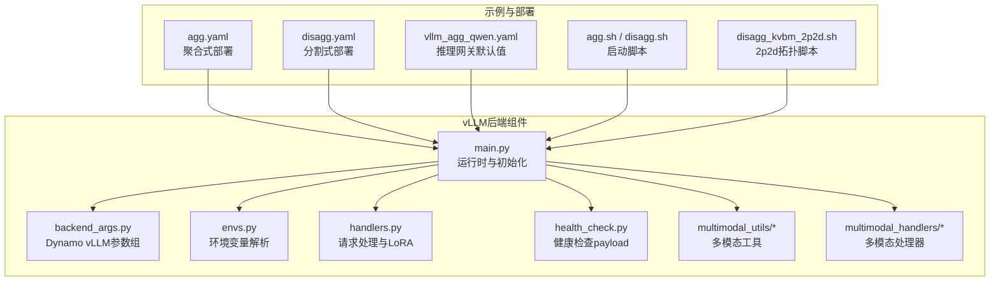
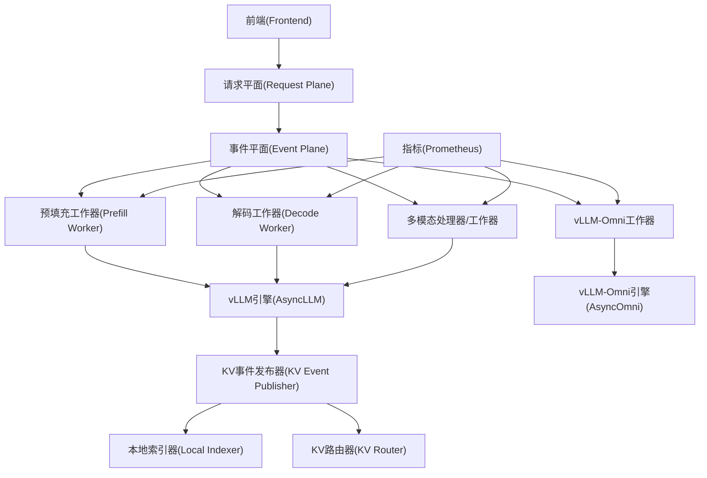
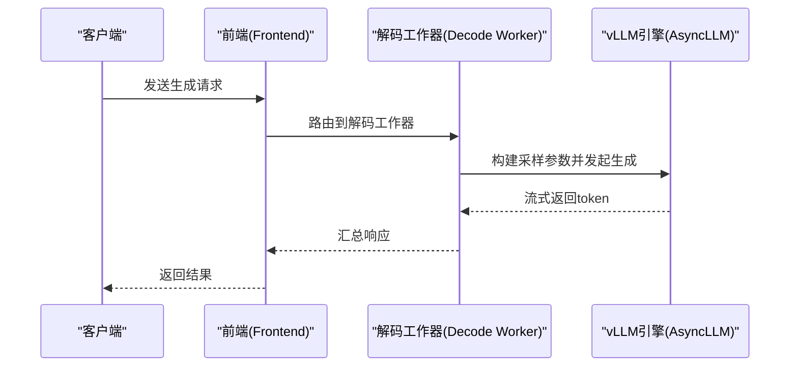
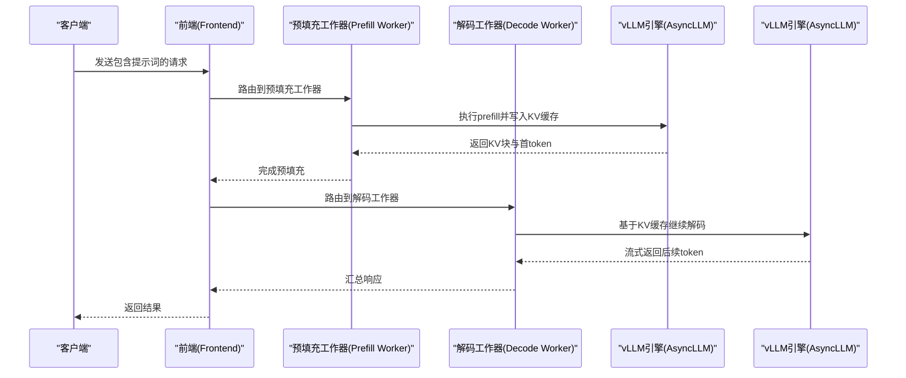
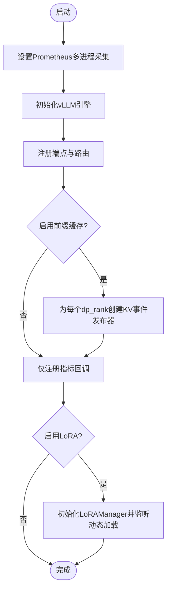
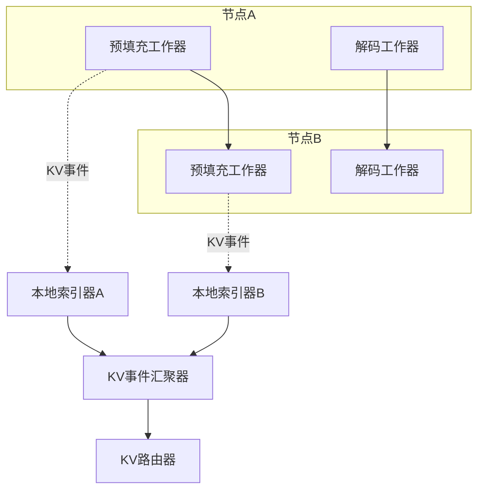
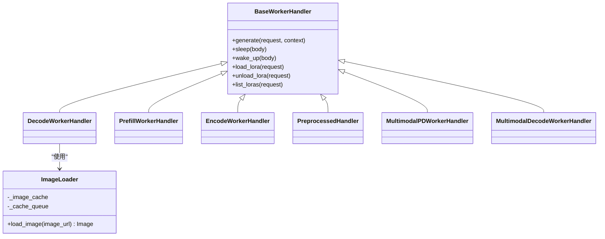
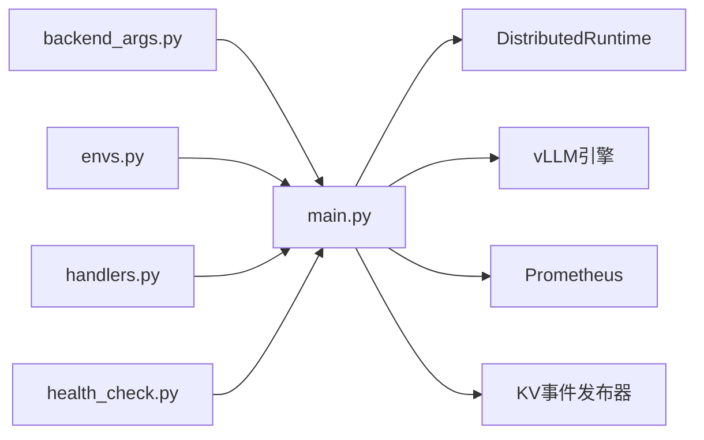

# vLLM集成示例

<cite>
**本文引用的文件**
- [components/src/dynamo/vllm/main.py](file://components/src/dynamo/vllm/main.py)
- [components/src/dynamo/vllm/backend_args.py](file://components/src/dynamo/vllm/backend_args.py)
- [components/src/dynamo/vllm/envs.py](file://components/src/dynamo/vllm/envs.py)
- [components/src/dynamo/vllm/handlers.py](file://components/src/dynamo/vllm/handlers.py)
- [components/src/dynamo/vllm/health_check.py](file://components/src/dynamo/vllm/health_check.py)
- [examples/backends/vllm/deploy/agg.yaml](file://examples/backends/vllm/deploy/agg.yaml)
- [examples/backends/vllm/deploy/disagg.yaml](file://examples/backends/vllm/deploy/disagg.yaml)
- [deploy/inference-gateway/standalone/vllm_agg_qwen.yaml](file://deploy/inference-gateway/standalone/vllm_agg_qwen.yaml)
- [examples/backends/vllm/launch/disagg_kvbm_2p2d.sh](file://examples/backends/vllm/launch/disagg_kvbm_2p2d.sh)
- [examples/backends/vllm/launch/agg_multimodal.sh](file://examples/backends/vllm/launch/agg_multimodal.sh)
- [examples/backends/vllm/launch/disagg.sh](file://examples/backends/vllm/launch/disagg.sh)
- [examples/backends/vllm/launch/agg.sh](file://examples/backends/vllm/launch/agg.sh)
- [components/src/dynamo/vllm/multimodal_utils/image_loader.py](file://components/src/dynamo/vllm/multimodal_utils/image_loader.py)
- [components/src/dynamo/vllm/multimodal_handlers/__init__.py](file://components/src/dynamo/vllm/multimodal_handlers/__init__.py)
</cite>

## 目录
1. [简介](#简介)
2. [项目结构](#项目结构)
3. [核心组件](#核心组件)
4. [架构总览](#架构总览)
5. [详细组件分析](#详细组件分析)
6. [依赖关系分析](#依赖关系分析)
7. [性能考虑](#性能考虑)
8. [故障排查指南](#故障排查指南)
9. [结论](#结论)
10. [附录](#附录)

## 简介
本文件面向在Dynamo平台上集成vLLM后端的工程实践，提供从配置到部署、从聚合式（Aggregated）到分割式（Disaggregated）部署模式的完整示例与说明。内容覆盖以下重点：
- vLLM引擎的配置与初始化流程
- 聚合式与分割式部署的YAML示例与差异
- vLLM特有配置项：CUDA图优化、多模态处理、LoRA微调、KV事件发布与前缀缓存
- 多节点部署拓扑（2p2d）与TP2并行策略
- 性能优化：KV缓存管理、请求平面配置、近似路由
- 启动脚本说明：环境准备、模型加载、健康检查
- 多模态处理示例：视觉语言模型的编码器与解码器配置

## 项目结构
围绕vLLM后端集成的关键目录与文件如下：
- 组件入口与运行时：components/src/dynamo/vllm/main.py
- 配置参数定义：components/src/dynamo/vllm/backend_args.py
- 环境变量解析：components/src/dynamo/vllm/envs.py
- 请求处理器与LoRA管理：components/src/dynamo/vllm/handlers.py
- 健康检查payload：components/src/dynamo/vllm/health_check.py
- 示例部署YAML：examples/backends/vllm/deploy/*.yaml
- 推理网关默认值：deploy/inference-gateway/standalone/vllm_agg_qwen.yaml
- 启动脚本：examples/backends/vllm/launch/*.sh
- 多模态工具与处理器：components/src/dynamo/vllm/multimodal_utils/* 与 components/src/dynamo/vllm/multimodal_handlers/*

**图表来源**
- [components/src/dynamo/vllm/main.py](file://components/src/dynamo/vllm/main.py#L1-L120)
- [components/src/dynamo/vllm/backend_args.py](file://components/src/dynamo/vllm/backend_args.py#L1-L120)
- [components/src/dynamo/vllm/envs.py](file://components/src/dynamo/vllm/envs.py#L1-L85)
- [components/src/dynamo/vllm/handlers.py](file://components/src/dynamo/vllm/handlers.py#L1-L120)
- [components/src/dynamo/vllm/health_check.py](file://components/src/dynamo/vllm/health_check.py#L1-L80)
- [examples/backends/vllm/deploy/agg.yaml](file://examples/backends/vllm/deploy/agg.yaml#L1-L35)
- [examples/backends/vllm/deploy/disagg.yaml](file://examples/backends/vllm/deploy/disagg.yaml#L1-L56)
- [deploy/inference-gateway/standalone/vllm_agg_qwen.yaml](file://deploy/inference-gateway/standalone/vllm_agg_qwen.yaml#L1-L18)
- [examples/backends/vllm/launch/agg.sh](file://examples/backends/vllm/launch/agg.sh)
- [examples/backends/vllm/launch/disagg.sh](file://examples/backends/vllm/launch/disagg.sh)
- [examples/backends/vllm/launch/disagg_kvbm_2p2d.sh](file://examples/backends/vllm/launch/disagg_kvbm_2p2d.sh)

**章节来源**
- [components/src/dynamo/vllm/main.py](file://components/src/dynamo/vllm/main.py#L1-L120)
- [examples/backends/vllm/deploy/agg.yaml](file://examples/backends/vllm/deploy/agg.yaml#L1-L35)
- [examples/backends/vllm/deploy/disagg.yaml](file://examples/backends/vllm/deploy/disagg.yaml#L1-L56)

## 核心组件
- 运行时与初始化：负责解析参数、下载模型、创建分布式运行时、注册端点、设置指标与KV事件发布器、按角色初始化不同工作流（预填充/解码/多模态/OMNI等）。
- 参数组与验证：集中定义Dynamo侧vLLM参数（如是否预填充/解码工作器、是否启用前端解码、多模态开关、EC连接器参数、OMNI阶段配置等），并在运行前进行互斥与依赖校验。
- 环境变量：提供KV事件端口解析与范围校验，支持通过环境变量控制端口。
- 请求处理器：封装生成、清空KV块、睡眠/唤醒引擎、LoRA动态加载/卸载/枚举等；支持OpenAI风格采样参数映射与结构化输出。
- 健康检查：提供标准vLLM、预填充专用与vLLM-Omni的健康检查payload，默认使用BOS token或文本输入构造最小负载请求。

**章节来源**
- [components/src/dynamo/vllm/main.py](file://components/src/dynamo/vllm/main.py#L99-L190)
- [components/src/dynamo/vllm/backend_args.py](file://components/src/dynamo/vllm/backend_args.py#L15-L191)
- [components/src/dynamo/vllm/envs.py](file://components/src/dynamo/vllm/envs.py#L25-L85)
- [components/src/dynamo/vllm/handlers.py](file://components/src/dynamo/vllm/handlers.py#L233-L448)
- [components/src/dynamo/vllm/health_check.py](file://components/src/dynamo/vllm/health_check.py#L83-L197)

## 架构总览
下图展示了vLLM后端在Dynamo中的整体交互：前端通过发现平面路由请求至相应工作器实例；工作器根据配置选择预填充或解码路径；KV事件发布器在启用前缀缓存时向索引器/路由器广播KV块变更；指标通过Prometheus收集并注入自动标签。

**图表来源**
- [components/src/dynamo/vllm/main.py](file://components/src/dynamo/vllm/main.py#L283-L358)
- [components/src/dynamo/vllm/handlers.py](file://components/src/dynamo/vllm/handlers.py#L233-L348)
- [components/src/dynamo/vllm/health_check.py](file://components/src/dynamo/vllm/health_check.py#L83-L197)

## 详细组件分析

### 聚合式部署（Aggregated）
- 特点：解码与预填充在同一进程/容器中，适合小规模或单GPU场景。
- 关键要点：
  - 使用解码工作器角色标志，避免KV事件发布（解码工作器不发布KV事件）。
  - 通过DynamoGraphDeployment声明Frontend与VllmDecodeWorker服务，设置镜像、资源与命令参数。
  - 可结合KVBM/LMCache等组件提升吞吐与延迟表现（见启动脚本示例）。

**图表来源**
- [examples/backends/vllm/deploy/agg.yaml](file://examples/backends/vllm/deploy/agg.yaml#L9-L35)
- [components/src/dynamo/vllm/handlers.py](file://components/src/dynamo/vllm/handlers.py#L233-L348)

**章节来源**
- [examples/backends/vllm/deploy/agg.yaml](file://examples/backends/vllm/deploy/agg.yaml#L1-L35)
- [examples/backends/vllm/launch/agg.sh](file://examples/backends/vllm/launch/agg.sh)

### 分割式部署（Disaggregated）
- 特点：预填充与解码分离，可独立扩展与调度，适合高并发与长上下文场景。
- 关键要点：
  - 明确声明VllmPrefillWorker与VllmDecodeWorker两类子组件类型。
  - 解码工作器需设置“解码工作器”标志，预填充工作器设置“预填充工作器”标志。
  - 支持KV事件发布与前缀缓存，提升重复前缀命中率与吞吐。

**图表来源**
- [examples/backends/vllm/deploy/disagg.yaml](file://examples/backends/vllm/deploy/disagg.yaml#L9-L56)
- [components/src/dynamo/vllm/main.py](file://components/src/dynamo/vllm/main.py#L535-L674)

**章节来源**
- [examples/backends/vllm/deploy/disagg.yaml](file://examples/backends/vllm/deploy/disagg.yaml#L1-L56)
- [examples/backends/vllm/launch/disagg.sh](file://examples/backends/vllm/launch/disagg.sh)

### vLLM特有配置与优化
- CUDA图优化：通过Prometheus多进程采集与统计日志工厂配合，确保指标一致性与可观测性。
- 多模态处理：支持前端解码（图像在Rust前端解码并通过NIXL RDMA传输）、EC连接器、多模态处理器与统一编码+解码工作器。
- LoRA微调：动态加载/卸载/枚举LoRA适配器，支持URI来源下载与注册到发现系统，保证并发安全与幂等。
- KV事件与前缀缓存：按数据并行维度为每个rank创建发布器，支持订阅KV事件汇聚器或直接订阅vLLM端点。

**图表来源**
- [components/src/dynamo/vllm/main.py](file://components/src/dynamo/vllm/main.py#L361-L457)
- [components/src/dynamo/vllm/main.py](file://components/src/dynamo/vllm/main.py#L283-L358)
- [components/src/dynamo/vllm/handlers.py](file://components/src/dynamo/vllm/handlers.py#L56-L76)

**章节来源**
- [components/src/dynamo/vllm/main.py](file://components/src/dynamo/vllm/main.py#L361-L457)
- [components/src/dynamo/vllm/handlers.py](file://components/src/dynamo/vllm/handlers.py#L440-L781)

### 多节点部署与TP2并行策略（2p2d）
- 适用场景：跨节点扩展，利用数据并行与张量并行组合提升吞吐。
- 实施要点：
  - 使用2p2d拓扑脚本启动，确保数据并行rank与张量并行维度正确配置。
  - 在分割式部署基础上，结合KVBM与事件平面路由，实现跨节点KV事件汇聚与索引。
  - 通过推理网关默认值文件指定DynamoGraphDeployment名称与模型标识，便于统一管理。

**图表来源**
- [examples/backends/vllm/launch/disagg_kvbm_2p2d.sh](file://examples/backends/vllm/launch/disagg_kvbm_2p2d.sh)
- [deploy/inference-gateway/standalone/vllm_agg_qwen.yaml](file://deploy/inference-gateway/standalone/vllm_agg_qwen.yaml#L8-L18)

**章节来源**
- [examples/backends/vllm/launch/disagg_kvbm_2p2d.sh](file://examples/backends/vllm/launch/disagg_kvbm_2p2d.sh)
- [deploy/inference-gateway/standalone/vllm_agg_qwen.yaml](file://deploy/inference-gateway/standalone/vllm_agg_qwen.yaml#L1-L18)

### 性能优化示例
- KV缓存管理：通过清空KV块端点重置prefix cache，降低内存占用；在预填充完成后立即释放无用块。
- 请求平面配置：根据流量特征调整请求队列与超时策略，减少尾延迟。
- 近似路由：在KVBM/路由器层引入近似匹配以加速路由决策，平衡准确性与延迟。
- 指标与观测：统一注册Dynamo组件指标与vLLM/LMCache指标，注入命名空间/组件/端点标签，便于多维分析。

**章节来源**
- [components/src/dynamo/vllm/handlers.py](file://components/src/dynamo/vllm/handlers.py#L419-L425)
- [components/src/dynamo/vllm/main.py](file://components/src/dynamo/vllm/main.py#L193-L281)

### 启动脚本说明
- 环境准备：设置镜像、工作目录、命令与参数；必要时挂载密钥（如Hugging Face Token）。
- 模型加载：优先从共享存储或HF缓存加载，避免重复下载；在检查点模式下提前进入睡眠模式以便持久化。
- 健康检查：根据工作器类型选择合适的健康检查payload（文本输入或token_ids），确保端点可用性。

**章节来源**
- [examples/backends/vllm/deploy/agg.yaml](file://examples/backends/vllm/deploy/agg.yaml#L14-L35)
- [examples/backends/vllm/deploy/disagg.yaml](file://examples/backends/vllm/deploy/disagg.yaml#L24-L56)
- [components/src/dynamo/vllm/health_check.py](file://components/src/dynamo/vllm/health_check.py#L83-L197)

### 多模态处理示例
- 编码器与解码器配置：
  - 前端解码：图像在Rust前端解码并通过NIXL RDMA传输至后端，降低Python端I/O开销。
  - EC连接器：支持外部编码器实现，统一编码流程并与PD工作器对接。
  - 多模态处理器：接收多模态请求，构造模板化的最终提示词，再交由LLM工作器解码。
- 图像加载与缓存：支持HTTP/HTTPS与data URL，内置缓存与格式限制，避免阻塞事件循环。

**图表来源**
- [components/src/dynamo/vllm/multimodal_utils/image_loader.py](file://components/src/dynamo/vllm/multimodal_utils/image_loader.py#L31-L111)
- [components/src/dynamo/vllm/handlers.py](file://components/src/dynamo/vllm/handlers.py#L233-L348)
- [components/src/dynamo/vllm/multimodal_handlers/__init__.py](file://components/src/dynamo/vllm/multimodal_handlers/__init__.py#L4-L24)

**章节来源**
- [examples/backends/vllm/launch/agg_multimodal.sh](file://examples/backends/vllm/launch/agg_multimodal.sh)
- [components/src/dynamo/vllm/multimodal_utils/image_loader.py](file://components/src/dynamo/vllm/multimodal_utils/image_loader.py#L1-L111)
- [components/src/dynamo/vllm/multimodal_handlers/__init__.py](file://components/src/dynamo/vllm/multimodal_handlers/__init__.py#L1-L25)

## 依赖关系分析
- 组件耦合与内聚：
  - main.py作为编排中心，依赖参数组、环境变量、处理器与健康检查模块；与运行时紧密耦合。
  - handlers.py提供通用基类与具体工作器实现，LoRA管理与多模态能力通过环境变量与配置启用。
  - backend_args.py集中定义Dynamo侧vLLM参数，含严格的互斥与依赖校验，降低误配置风险。
- 外部依赖与集成点：
  - vLLM引擎（AsyncLLM/AsyncOmni）、Prometheus多进程采集、ZMQ KV事件发布器、NIXL RDMA、KVBM/KV路由器等。
- 循环依赖：
  - 未发现直接循环导入；各模块职责清晰，通过函数/类接口交互。

**图表来源**
- [components/src/dynamo/vllm/backend_args.py](file://components/src/dynamo/vllm/backend_args.py#L15-L191)
- [components/src/dynamo/vllm/envs.py](file://components/src/dynamo/vllm/envs.py#L59-L85)
- [components/src/dynamo/vllm/handlers.py](file://components/src/dynamo/vllm/handlers.py#L233-L348)
- [components/src/dynamo/vllm/health_check.py](file://components/src/dynamo/vllm/health_check.py#L83-L197)
- [components/src/dynamo/vllm/main.py](file://components/src/dynamo/vllm/main.py#L146-L190)

**章节来源**
- [components/src/dynamo/vllm/backend_args.py](file://components/src/dynamo/vllm/backend_args.py#L224-L289)
- [components/src/dynamo/vllm/main.py](file://components/src/dynamo/vllm/main.py#L146-L190)

## 性能考虑
- 指标采集一致性：在多进程模式下，优先尝试将MultiProcessCollector加入全局REGISTRY；若冲突则使用独立CollectorRegistry读取磁盘.db文件，确保指标不陈旧。
- KV事件发布：按dp_rank创建发布器，避免跨rank冲突；在KVBM启用时订阅汇聚器端点，减少网络开销。
- LoRA动态切换：通过锁序列化同名LoRA的加载/卸载，避免并发冲突；成功后注册ModelDeploymentCard以便前端发现与路由。
- 前端解码：启用前端解码可显著降低Python端图像解码成本，结合NIXL RDMA实现高效传输。

**章节来源**
- [components/src/dynamo/vllm/main.py](file://components/src/dynamo/vllm/main.py#L193-L281)
- [components/src/dynamo/vllm/handlers.py](file://components/src/dynamo/vllm/handlers.py#L440-L781)

## 故障排查指南
- 健康检查失败：
  - 确认工作器类型与健康检查payload一致（文本输入或token_ids）。
  - 对Omni工作器使用异步方式提取BOS token。
- LoRA加载异常：
  - 检查DYN_LORA_ENABLED是否开启，确认URI可达且格式正确。
  - 查看并发锁状态与注册回滚日志，定位冲突或注册失败原因。
- KV事件发布问题：
  - 检查enable_prefix_caching与kv_events_config.enable_kv_cache_events是否启用。
  - 核对dp_rank与端口偏移，确保订阅端点正确。
- 非主节点行为：
  - 非主数据并行节点会等待信号终止，不提供端点服务，避免重复实例竞争。

**章节来源**
- [components/src/dynamo/vllm/health_check.py](file://components/src/dynamo/vllm/health_check.py#L83-L197)
- [components/src/dynamo/vllm/handlers.py](file://components/src/dynamo/vllm/handlers.py#L440-L781)
- [components/src/dynamo/vllm/main.py](file://components/src/dynamo/vllm/main.py#L73-L84)

## 结论
本文基于仓库中的vLLM后端实现与示例，系统梳理了从配置、部署到性能优化与多模态处理的完整实践路径。通过聚合式与分割式两种部署模式，结合KV事件与前缀缓存、LoRA动态适配、前端解码与2p2d多节点拓扑，可在不同规模与场景下获得稳定、可观测且高性能的推理服务。

## 附录
- 推理网关默认值：用于指定DynamoGraphDeployment名称与模型标识，便于统一管理与路由。
- 启动脚本清单：涵盖聚合式、分割式、多模态、KVBM、LMCache、近似路由等典型场景。

**章节来源**
- [deploy/inference-gateway/standalone/vllm_agg_qwen.yaml](file://deploy/inference-gateway/standalone/vllm_agg_qwen.yaml#L1-L18)
- [examples/backends/vllm/launch/agg.sh](file://examples/backends/vllm/launch/agg.sh)
- [examples/backends/vllm/launch/disagg.sh](file://examples/backends/vllm/launch/disagg.sh)
- [examples/backends/vllm/launch/agg_multimodal.sh](file://examples/backends/vllm/launch/agg_multimodal.sh)
- [examples/backends/vllm/launch/disagg_kvbm_2p2d.sh](file://examples/backends/vllm/launch/disagg_kvbm_2p2d.sh)