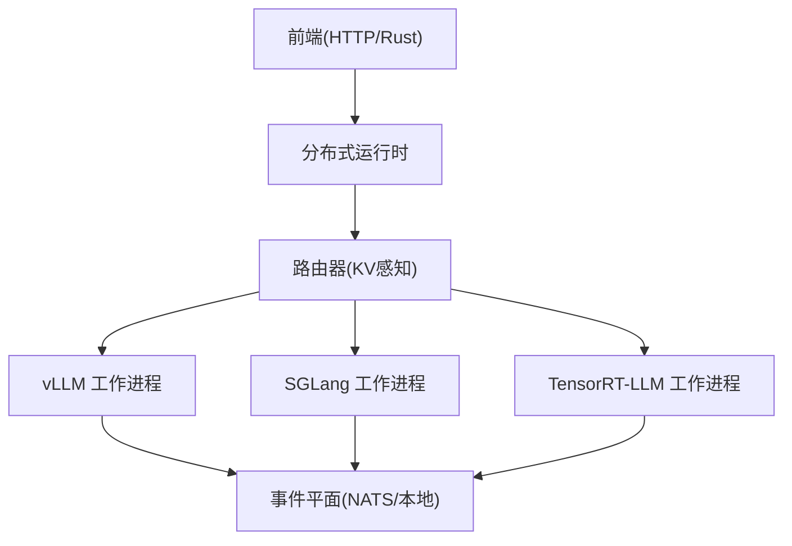
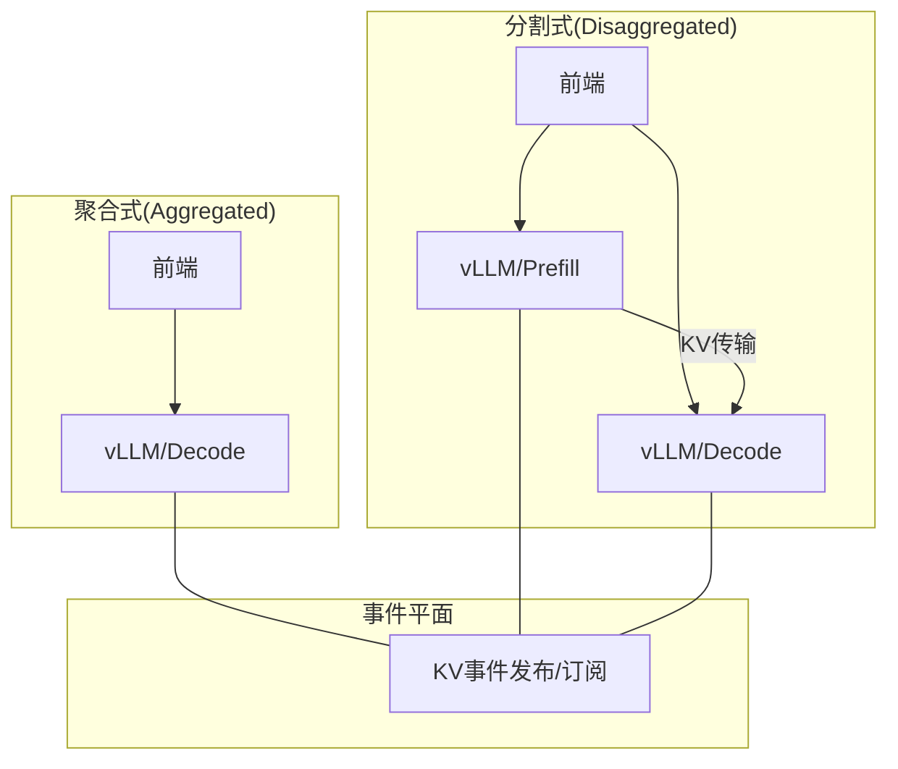
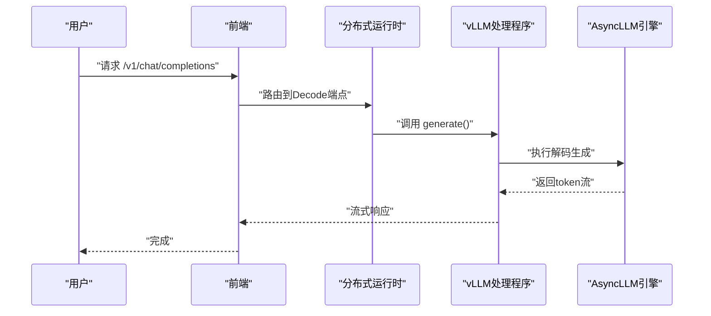
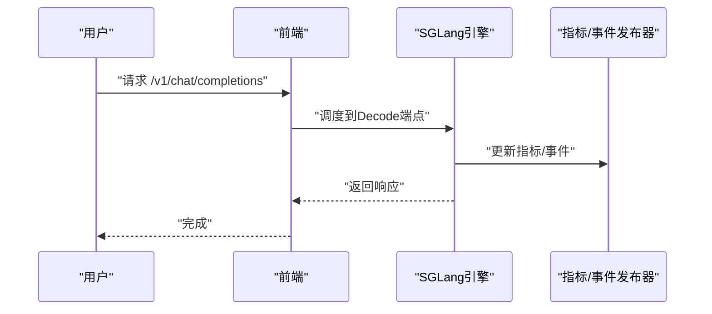
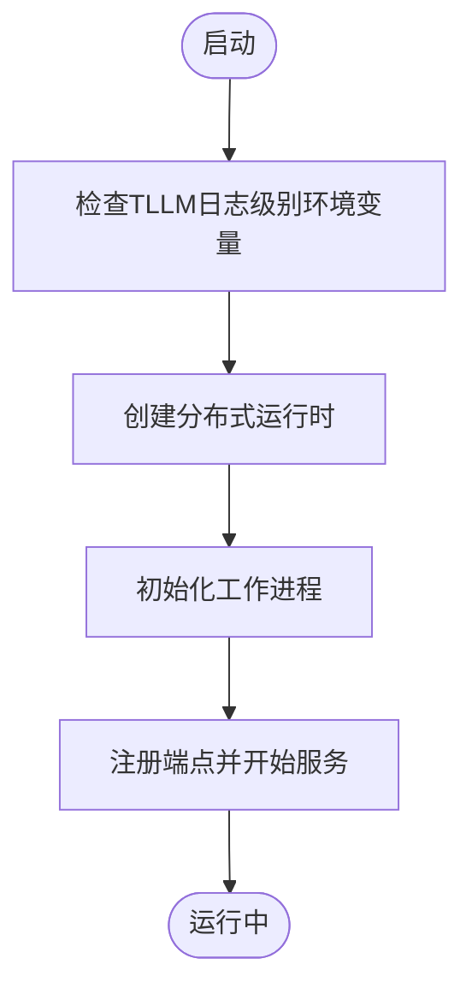
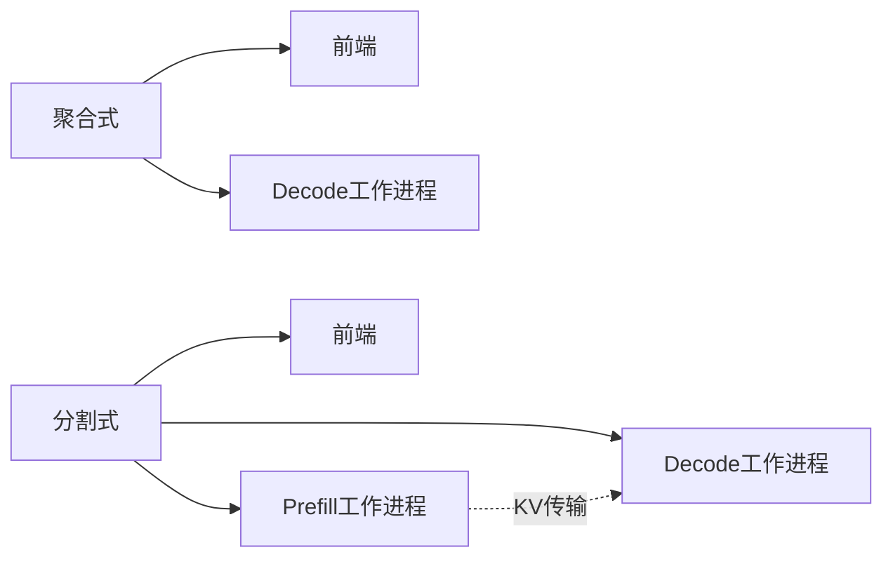
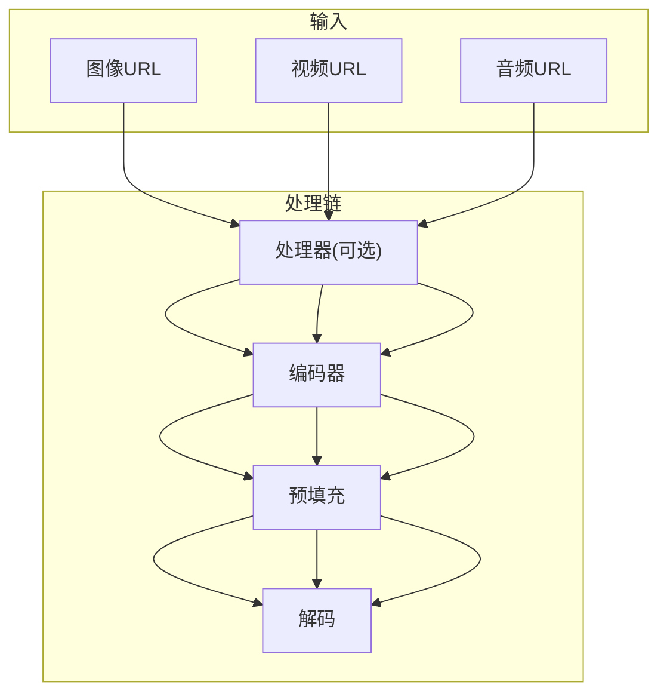
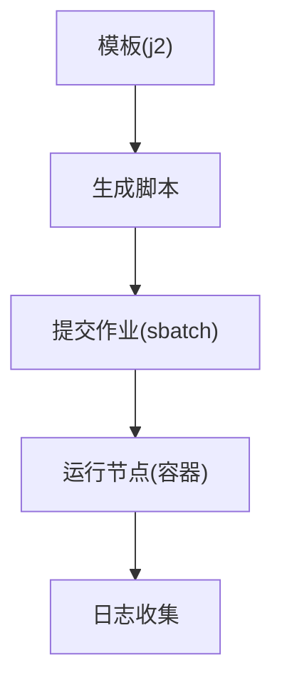
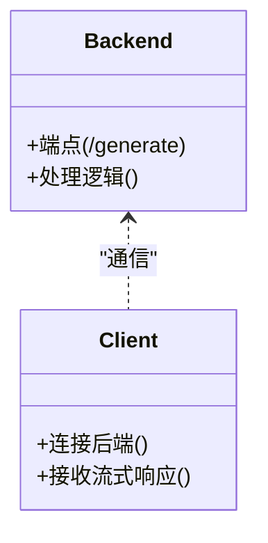
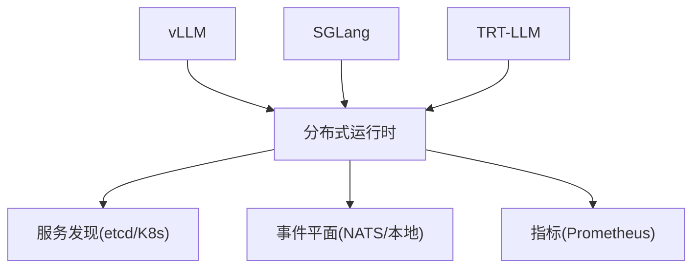

# 后端集成示例

<cite>
**本文档引用的文件**
- [README.md](file://README.md)
- [vLLM 主入口](file://components/src/dynamo/vllm/main.py)
- [SGLang 主入口](file://components/src/dynamo/sglang/main.py)
- [TensorRT-LLM 主入口](file://components/src/dynamo/trtllm/main.py)
- [vLLM 部署模板](file://examples/backends/vllm/deploy/README.md)
- [SGLang 部署模板](file://examples/backends/sglang/deploy/README.md)
- [TRT-LLM 部署模板](file://examples/backends/trtllm/deploy/README.md)
- [SGLang SLURM 示例](file://examples/backends/sglang/slurm_jobs/README.md)
- [自定义后端示例](file://examples/custom_backend/hello_world/README.md)
- [vLLM 后端文档](file://docs/pages/backends/vllm/README.md)
- [SGLang 后端文档](file://docs/pages/backends/sglang/README.md)
- [TRT-LLM 后端文档](file://docs/pages/backends/trtllm/README.md)
- [多模态特性文档](file://docs/pages/features/multimodal/README.md)
- [性能调优指南](file://docs/pages/performance/tuning.md)
</cite>

## 目录
1. [简介](#简介)
2. [项目结构](#项目结构)
3. [核心组件](#核心组件)
4. [架构总览](#架构总览)
5. [详细组件分析](#详细组件分析)
6. [依赖关系分析](#依赖关系分析)
7. [性能考虑](#性能考虑)
8. [故障排除指南](#故障排除指南)
9. [结论](#结论)
10. [附录](#附录)

## 简介
本文件面向需要在Dynamo框架中集成不同推理引擎（vLLM、SGLang、TensorRT-LLM）的工程师与运维人员，提供从本地快速启动到生产级Kubernetes部署的完整示例，涵盖聚合式（Aggregated）与分割式（Disaggregated）两种部署模式、多模态处理流程、Slurm作业调度系统集成、日志记录与监控、健康检查以及自定义后端开发的端到端指南。

## 项目结构
Dynamo采用模块化设计，核心推理引擎以独立子包形式存在，并通过统一的分布式运行时进行编排：
- 前端：Rust实现的OpenAI兼容HTTP服务，负责路由与负载均衡
- 路由器：KV感知路由与动态调度
- 引擎适配层：各后端的适配器与工作进程
- 运行时：分布式运行时、服务发现、事件平面与指标收集

**图表来源**
- [vLLM 主入口](file://components/src/dynamo/vllm/main.py#L1-L120)
- [SGLang 主入口](file://components/src/dynamo/sglang/main.py#L1-L120)
- [TensorRT-LLM 主入口](file://components/src/dynamo/trtllm/main.py#L1-L51)

**章节来源**
- [README.md](file://README.md#L31-L70)

## 核心组件
- 分布式运行时：负责服务注册、发现、健康检查与优雅停机
- 引擎适配器：封装vLLM、SGLang、TensorRT-LLM的初始化、端点注册与指标上报
- 多模态处理器：支持图像、视频、音频的编码与传输
- 事件平面：KV缓存事件发布与订阅，支撑KV感知路由
- 指标与监控：Prometheus指标收集与标签注入

**章节来源**
- [vLLM 主入口](file://components/src/dynamo/vllm/main.py#L193-L281)
- [SGLang 主入口](file://components/src/dynamo/sglang/main.py#L235-L328)
- [TensorRT-LLM 主入口](file://components/src/dynamo/trtllm/main.py#L29-L43)

## 架构总览
Dynamo支持多种部署拓扑，核心在于将“预填充（Prefill）”与“解码（Decode）”阶段分离，最大化吞吐同时控制延迟。下图展示了典型聚合与分割部署的组件交互：

**图表来源**
- [vLLM 部署模板](file://examples/backends/vllm/deploy/README.md#L7-L37)
- [SGLang 部署模板](file://examples/backends/sglang/deploy/README.md#L7-L29)
- [TRT-LLM 部署模板](file://examples/backends/trtllm/deploy/README.md#L7-L36)

## 详细组件分析

### vLLM 集成与部署
- 启动流程：解析参数、模型下载、引擎初始化、端点注册、指标与事件发布
- 端点类型：支持文本或Token输入，可启用工具调用与推理解析器
- 多模态：支持图像编码与前端解码，通过NIXL RDMA传输
- 性能优化：Prometheus多进程指标、前缀缓存事件、睡眠/唤醒引擎路由

**图表来源**
- [vLLM 主入口](file://components/src/dynamo/vllm/main.py#L676-L800)

**章节来源**
- [vLLM 主入口](file://components/src/dynamo/vllm/main.py#L99-L191)
- [vLLM 主入口](file://components/src/dynamo/vllm/main.py#L361-L457)
- [vLLM 主入口](file://components/src/dynamo/vllm/main.py#L460-L533)
- [vLLM 主入口](file://components/src/dynamo/vllm/main.py#L535-L674)
- [vLLM 主入口](file://components/src/dynamo/vllm/main.py#L676-L800)

#### vLLM 配置与调优要点
- 模型参数：--model 或 --model-path，服务名称 --served-model-name
- 多模态：--enable-multimodal，前端解码 --frontend-decoding
- 前缀缓存：--enable-prefix-caching，事件发布 --kv-events-config
- 指标：--metrics-endpoint-port，Prometheus多进程目录自动管理
- 调度：--is-prefill-worker 实现分割式部署

**章节来源**
- [vLLM 后端文档](file://docs/pages/backends/vllm/README.md#L156-L172)

### SGLang 集成与部署
- 启动流程：信号处理链、引擎初始化、端点注册、KV事件与指标发布
- 支持模式：嵌入、扩散、多模态处理器、编码器、预填充/解码工作进程
- 多模态：图像扩散、编码器-处理器-工作进程链路
- 取消与迁移：聚合/分割场景下的请求取消支持矩阵

**图表来源**
- [SGLang 主入口](file://components/src/dynamo/sglang/main.py#L235-L328)

**章节来源**
- [SGLang 主入口](file://components/src/dynamo/sglang/main.py#L191-L234)
- [SGLang 主入口](file://components/src/dynamo/sglang/main.py#L235-L328)
- [SGLang 主入口](file://components/src/dynamo/sglang/main.py#L330-L407)
- [SGLang 主入口](file://components/src/dynamo/sglang/main.py#L409-L560)
- [SGLang 主入口](file://components/src/dynamo/sglang/main.py#L562-L644)

#### SGLang 配置与调优要点
- 引擎参数：--model-path、--tp、--dp 等原生SGLang参数透传
- Dynamo参数：--endpoint、--use-sglang-tokenizer、--custom-jinja-template
- 多模态：--multimodal-processor、--multimodal-encode-worker、--multimodal-worker
- 请求取消：聚合/分割场景支持矩阵详见后端文档

**章节来源**
- [SGLang 后端文档](file://docs/pages/backends/sglang/README.md#L45-L86)

### TensorRT-LLM 集成与部署
- 启动流程：日志级别映射、运行时创建、工作进程初始化
- 多模态：图像/视频扩散支持（实验性）
- 扩展能力：Logits处理适配器、注意力数据并行路由、KVBM集成
- 性能问题：KV缓存耗尽导致死锁的缓解策略

**图表来源**
- [TensorRT-LLM 主入口](file://components/src/dynamo/trtllm/main.py#L29-L43)

**章节来源**
- [TensorRT-LLM 主入口](file://components/src/dynamo/trtllm/main.py#L29-L43)

#### TRT-LLM 配置与调优要点
- 日志：DYN_LOG 映射到 TLLM_LOG_LEVEL
- 多模态：--modality video_diffusion，输出目录 --output-dir
- 扩展：Logits处理器适配、注意力数据并行 --enable-attention-dp
- 缓存：max_tokens_in_buffer 需大于最大输入序列长度，避免死锁

**章节来源**
- [TRT-LLM 后端文档](file://docs/pages/backends/trtllm/README.md#L208-L275)
- [TRT-LLM 后端文档](file://docs/pages/backends/trtllm/README.md#L333-L361)
- [TRT-LLM 后端文档](file://docs/pages/backends/trtllm/README.md#L372-L397)

### 部署模式与拓扑
- 聚合式（Aggregated）：前端 + 单一Decode工作进程，适合简单场景
- 分割式（Disaggregated）：前端 + 预填充 + 解码工作进程，通过NIXL传输KV缓存
- 路由模式：启用KV感知路由，提升缓存复用与命中率

**图表来源**
- [vLLM 部署模板](file://examples/backends/vllm/deploy/README.md#L7-L37)
- [SGLang 部署模板](file://examples/backends/sglang/deploy/README.md#L7-L29)
- [TRT-LLM 部署模板](file://examples/backends/trtllm/deploy/README.md#L7-L36)

**章节来源**
- [vLLM 部署模板](file://examples/backends/vllm/deploy/README.md#L1-L266)
- [SGLang 部署模板](file://examples/backends/sglang/deploy/README.md#L1-L163)
- [TRT-LLM 部署模板](file://examples/backends/trtllm/deploy/README.md#L1-L289)

### 多模态处理示例
- 输入格式：HTTP/HTTPS URL、数据URL（Base64）、预计算嵌入
- 架构模式：EPD（单工作进程）、E/PD（编码分离）、E/P/D（全分割）、EP/D（传统分割）
- vLLM/SGlang/TRT-LLM支持矩阵与特性差异

**图表来源**
- [多模态特性文档](file://docs/pages/features/multimodal/README.md#L49-L185)

**章节来源**
- [多模态特性文档](file://docs/pages/features/multimodal/README.md#L1-L194)

### Slurm 作业调度系统集成
- 使用Pyxis插件的srun容器参数，支持容器镜像、挂载与环境变量
- 模板生成与提交脚本，支持多前端nginx负载均衡
- 配置目录包含专家位置、DeepGEMM内核缓存等

**图表来源**
- [SGLang SLURM 示例](file://examples/backends/sglang/slurm_jobs/README.md#L24-L81)

**章节来源**
- [SGLang SLURM 示例](file://examples/backends/sglang/slurm_jobs/README.md#L1-L113)

### 自定义后端开发示例
- 最小化服务：使用装饰器定义端点与工作进程，演示流式响应与客户端集成
- 部署到Kubernetes：通过DynamoGraphDeployment资源进行声明式部署

**图表来源**
- [自定义后端示例](file://examples/custom_backend/hello_world/README.md#L84-L94)

**章节来源**
- [自定义后端示例](file://examples/custom_backend/hello_world/README.md#L1-L114)

## 依赖关系分析
- vLLM：依赖AsyncLLM、Prometheus、ZMQ事件发布器
- SGLang：依赖sgl.Engine、指标与事件发布器
- TRT-LLM：依赖运行时工具与工作进程初始化
- 共同依赖：分布式运行时、服务发现、事件平面、指标收集

**图表来源**
- [vLLM 主入口](file://components/src/dynamo/vllm/main.py#L1-L68)
- [SGLang 主入口](file://components/src/dynamo/sglang/main.py#L17-L36)
- [TensorRT-LLM 主入口](file://components/src/dynamo/trtllm/main.py#L21-L26)

**章节来源**
- [vLLM 主入口](file://components/src/dynamo/vllm/main.py#L1-L68)
- [SGLang 主入口](file://components/src/dynamo/sglang/main.py#L17-L36)
- [TensorRT-LLM 主入口](file://components/src/dynamo/trtllm/main.py#L21-L26)

## 性能考虑
- 引擎配置：张量并行（TP）与流水线并行（PP）映射、批大小与最大token数、块大小
- 路由策略：根据负载条件选择预填充优先或分段预填充，平衡TTFT与ITL
- 资源分配：在高负载下减少预填充引擎数量，最大化解码引擎KV缓存可用性
- 缓存与传输：合理设置max_tokens_in_buffer，避免KV缓存耗尽导致死锁

**章节来源**
- [性能调优指南](file://docs/pages/performance/tuning.md#L1-L137)
- [TRT-LLM 后端文档](file://docs/pages/backends/trtllm/README.md#L372-L397)

## 故障排除指南
- 健康检查：各后端提供健康检查负载，用于存活探针与就绪探针
- 日志级别：通过DYN_LOG调整日志详细程度，映射到后端日志级别
- 事件平面：在KV感知路由场景下确保NATS/JetStream可用
- 容器与镜像：使用官方容器镜像或按模板构建自定义镜像
- Kubernetes：检查服务发现与CRD状态，确认命名空间与资源限制

**章节来源**
- [vLLM 部署模板](file://examples/backends/vllm/deploy/README.md#L230-L235)
- [SGLang 部署模板](file://examples/backends/sglang/deploy/README.md#L140-L144)
- [TRT-LLM 部署模板](file://examples/backends/trtllm/deploy/README.md#L230-L236)

## 结论
通过Dynamo的统一运行时与后端适配层，用户可以灵活地在vLLM、SGLang、TensorRT-LLM之间切换，并根据业务需求选择聚合式或分割式部署模式。结合KV感知路由、多模态处理与完善的监控体系，Dynamo能够满足从单机开发到大规模生产的多样化部署场景。

## 附录
- 快速启动：参考各后端文档中的单机示例与容器镜像
- 生产部署：使用Kubernetes CRD模板与平台安装指南
- 性能基准：使用AIPerf进行基准测试与参数调优
- 社区与支持：参阅文档与社区资源获取帮助