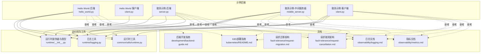
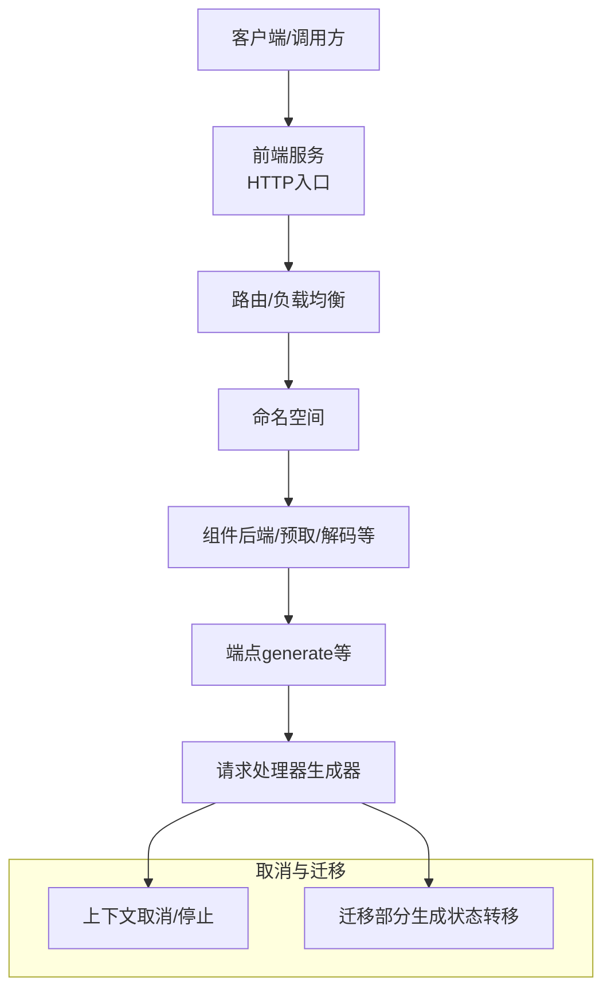
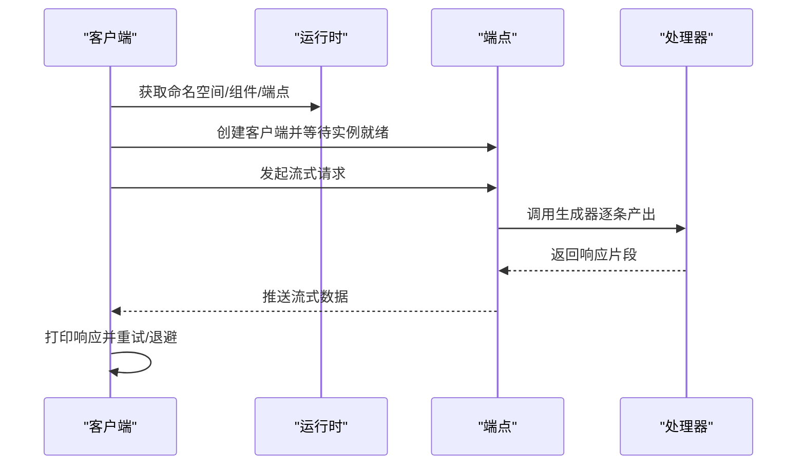
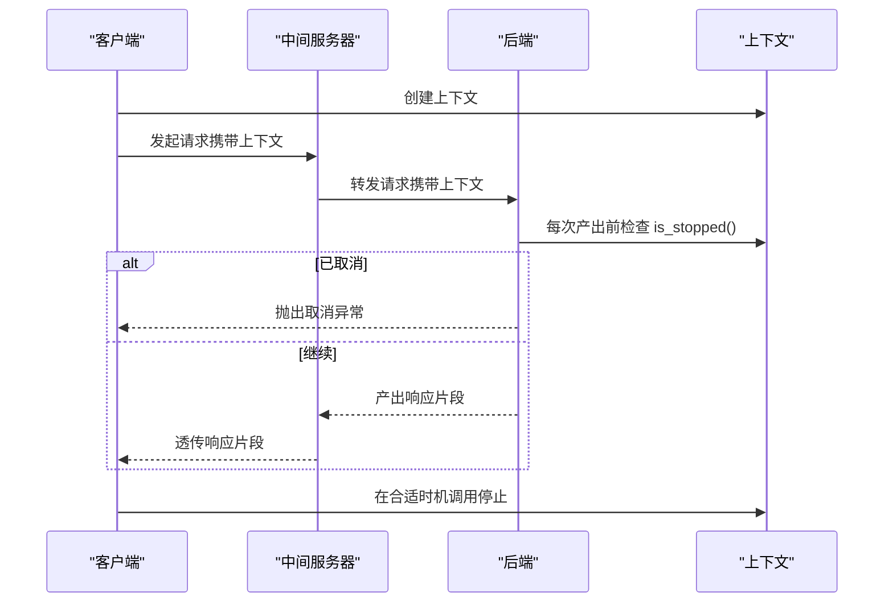
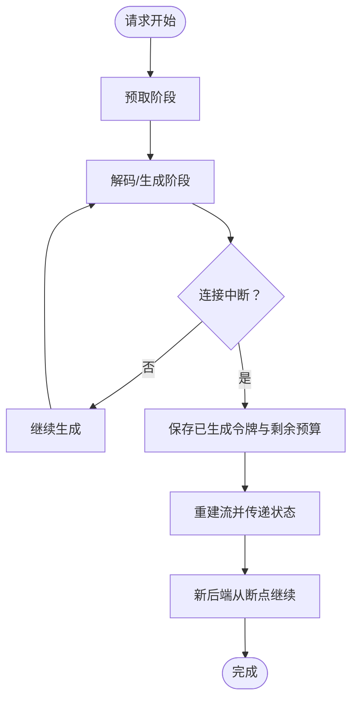
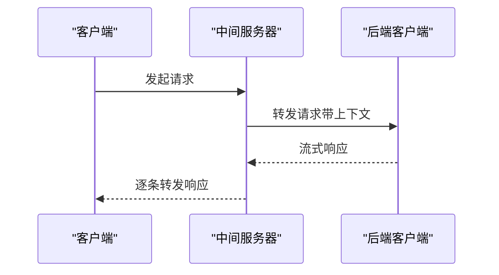
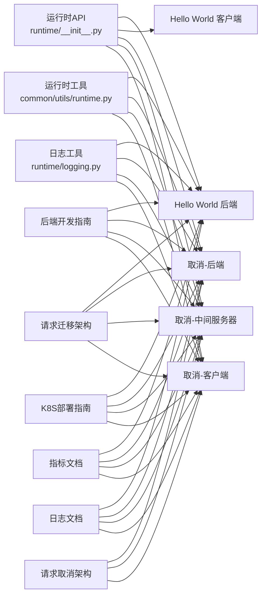

# 自定义后端开发

<cite>
**本文引用的文件**
- [examples/custom_backend/hello_world/README.md](file://examples/custom_backend/hello_world/README.md)
- [examples/custom_backend/hello_world/hello_world.py](file://examples/custom_backend/hello_world/hello_world.py)
- [examples/custom_backend/hello_world/client.py](file://examples/custom_backend/hello_world/client.py)
- [examples/custom_backend/hello_world/deploy/hello_world.yaml](file://examples/custom_backend/hello_world/deploy/hello_world.yaml)
- [examples/custom_backend/cancellation/README.md](file://examples/custom_backend/cancellation/README.md)
- [examples/custom_backend/cancellation/server.py](file://examples/custom_backend/cancellation/server.py)
- [examples/custom_backend/cancellation/middle_server.py](file://examples/custom_backend/cancellation/middle_server.py)
- [examples/custom_backend/cancellation/client.py](file://examples/custom_backend/cancellation/client.py)
- [docs/pages/development/backend-guide.md](file://docs/pages/development/backend-guide.md)
- [docs/pages/fault-tolerance/request-cancellation.md](file://docs/pages/fault-tolerance/request-cancellation.md)
- [docs/pages/fault-tolerance/request-migration.md](file://docs/pages/fault-tolerance/request-migration.md)
- [docs/pages/kubernetes/README.md](file://docs/pages/kubernetes/README.md)
- [docs/pages/observability/logging.md](file://docs/pages/observability/logging.md)
- [docs/pages/observability/metrics.md](file://docs/pages/observability/metrics.md)
- [lib/bindings/python/src/dynamo/runtime/__init__.py](file://lib/bindings/python/src/dynamo/runtime/__init__.py)
- [lib/bindings/python/src/dynamo/runtime/logging.py](file://lib/bindings/python/src/dynamo/runtime/logging.py)
- [components/src/dynamo/common/utils/runtime.py](file://components/src/dynamo/common/utils/runtime.py)
</cite>

## 目录
1. [简介](#简介)
2. [项目结构](#项目结构)
3. [核心组件](#核心组件)
4. [架构总览](#架构总览)
5. [详细组件分析](#详细组件分析)
6. [依赖关系分析](#依赖关系分析)
7. [性能考虑](#性能考虑)
8. [故障排查指南](#故障排查指南)
9. [结论](#结论)
10. [附录](#附录)

## 简介
本指南面向希望在Dynamo平台上开发与集成自定义推理后端的工程师。内容覆盖从接口规范、请求处理与响应格式、错误处理标准，到Hello World后端的完整实现、请求取消与迁移（含优雅关闭与状态保存）、中间服务器的代理与路由、客户端集成、以及部署配置（容器化、服务发现、健康检查）与可观测性（性能监控与日志）。文档以仓库中的示例与官方文档为依据，提供可直接落地的开发与运维实践。

## 项目结构
Dynamo提供了多种后端框架示例与通用运行时能力，自定义后端开发的核心位置集中在以下区域：
- 运行时装饰器与类型：Python绑定导出的运行时API（如装饰器、上下文、命名空间/组件/端点模型）
- 示例后端：Hello World与请求取消/中间服务器示例
- 文档：后端开发指南、故障容忍（取消/迁移）、Kubernetes部署、可观测性（日志/指标）

**图表来源**
- [examples/custom_backend/hello_world/hello_world.py](file://examples/custom_backend/hello_world/hello_world.py#L1-L43)
- [examples/custom_backend/hello_world/client.py](file://examples/custom_backend/hello_world/client.py#L1-L66)
- [examples/custom_backend/cancellation/server.py](file://examples/custom_backend/cancellation/server.py#L1-L53)
- [examples/custom_backend/cancellation/middle_server.py](file://examples/custom_backend/cancellation/middle_server.py#L1-L75)
- [examples/custom_backend/cancellation/client.py](file://examples/custom_backend/cancellation/client.py#L1-L78)
- [lib/bindings/python/src/dynamo/runtime/__init__.py](file://lib/bindings/python/src/dynamo/runtime/__init__.py#L1-L30)
- [lib/bindings/python/src/dynamo/runtime/__init__.py](file://lib/bindings/python/src/dynamo/runtime/__init__.py#L57-L94)
- [lib/bindings/python/src/dynamo/runtime/logging.py](file://lib/bindings/python/src/dynamo/runtime/logging.py)
- [components/src/dynamo/common/utils/runtime.py](file://components/src/dynamo/common/utils/runtime.py#L1-L43)
- [docs/pages/development/backend-guide.md](file://docs/pages/development/backend-guide.md#L1-L163)
- [docs/pages/fault-tolerance/request-cancellation.md](file://docs/pages/fault-tolerance/request-cancellation.md#L1-L92)
- [docs/pages/fault-tolerance/request-migration.md](file://docs/pages/fault-tolerance/request-migration.md#L1-L137)
- [docs/pages/kubernetes/README.md](file://docs/pages/kubernetes/README.md#L1-L242)
- [docs/pages/observability/logging.md](file://docs/pages/observability/logging.md#L1-L269)
- [docs/pages/observability/metrics.md](file://docs/pages/observability/metrics.md#L1-L224)

**章节来源**
- [examples/custom_backend/hello_world/README.md](file://examples/custom_backend/hello_world/README.md#L1-L114)
- [docs/pages/kubernetes/README.md](file://docs/pages/kubernetes/README.md#L1-L242)

## 核心组件
- 运行时装饰器与类型
  - 装饰器：用于声明worker入口与自动注入DistributedRuntime
  - 端点装饰器：对请求/响应进行校验与包装
  - 上下文：支持请求取消与异步监控
- 命名空间/组件/端点模型：通过三段式命名实现服务发现与路由
- 日志与可观测性：结构化日志、指标暴露、追踪ID关联
- 部署与健康检查：Kubernetes资源与探针配置

**章节来源**
- [lib/bindings/python/src/dynamo/runtime/__init__.py](file://lib/bindings/python/src/dynamo/runtime/__init__.py#L1-L30)
- [lib/bindings/python/src/dynamo/runtime/__init__.py](file://lib/bindings/python/src/dynamo/runtime/__init__.py#L57-L94)
- [lib/bindings/python/src/dynamo/runtime/logging.py](file://lib/bindings/python/src/dynamo/runtime/logging.py)
- [components/src/dynamo/common/utils/runtime.py](file://components/src/dynamo/common/utils/runtime.py#L22-L43)
- [docs/pages/observability/logging.md](file://docs/pages/observability/logging.md#L1-L269)
- [docs/pages/observability/metrics.md](file://docs/pages/observability/metrics.md#L1-L224)

## 架构总览
Dynamo分布式运行时将“前端（HTTP入口）—路由—后端（推理引擎）”解耦，后端通过命名空间/组件/端点注册，前端基于服务发现与负载均衡调度请求。自定义后端可按需实现请求处理、流式响应、取消与迁移支持，并通过Kubernetes进行编排与可观测性建设。

**图表来源**
- [docs/pages/development/backend-guide.md](file://docs/pages/development/backend-guide.md#L113-L163)
- [docs/pages/fault-tolerance/request-cancellation.md](file://docs/pages/fault-tolerance/request-cancellation.md#L8-L92)
- [docs/pages/fault-tolerance/request-migration.md](file://docs/pages/fault-tolerance/request-migration.md#L8-L137)

## 详细组件分析

### Hello World 后端与客户端
- 后端
  - 使用端点装饰器定义流式生成函数
  - 使用worker装饰器创建服务实例，注册端点并开始监听
  - 支持日志配置与异步事件循环
- 客户端
  - 通过命名空间/组件/端点定位后端
  - 获取客户端并等待实例就绪
  - 流式消费响应，具备指数退避与异常处理

**图表来源**
- [examples/custom_backend/hello_world/hello_world.py](file://examples/custom_backend/hello_world/hello_world.py#L16-L37)
- [examples/custom_backend/hello_world/client.py](file://examples/custom_backend/hello_world/client.py#L23-L61)

**章节来源**
- [examples/custom_backend/hello_world/README.md](file://examples/custom_backend/hello_world/README.md#L18-L114)
- [examples/custom_backend/hello_world/hello_world.py](file://examples/custom_backend/hello_world/hello_world.py#L1-L43)
- [examples/custom_backend/hello_world/client.py](file://examples/custom_backend/hello_world/client.py#L1-L66)

### 请求取消（直连与中间服务器）
- 直连模式
  - 客户端使用上下文对象发起请求
  - 后端在每次产出前检查取消状态，检测到后抛出取消异常
- 中间服务器模式
  - 中间服务器转发请求并透传上下文
  - 取消信号从客户端经中间服务器传递至后端，后端检测并终止

**图表来源**
- [examples/custom_backend/cancellation/client.py](file://examples/custom_backend/cancellation/client.py#L14-L36)
- [examples/custom_backend/cancellation/middle_server.py](file://examples/custom_backend/cancellation/middle_server.py#L31-L47)
- [examples/custom_backend/cancellation/server.py](file://examples/custom_backend/cancellation/server.py#L16-L28)

**章节来源**
- [examples/custom_backend/cancellation/README.md](file://examples/custom_backend/cancellation/README.md#L1-L92)
- [examples/custom_backend/cancellation/server.py](file://examples/custom_backend/cancellation/server.py#L1-L53)
- [examples/custom_backend/cancellation/middle_server.py](file://examples/custom_backend/cancellation/middle_server.py#L1-L75)
- [examples/custom_backend/cancellation/client.py](file://examples/custom_backend/cancellation/client.py#L1-L78)
- [docs/pages/fault-tolerance/request-cancellation.md](file://docs/pages/fault-tolerance/request-cancellation.md#L37-L92)

### 请求迁移（部分生成状态保存与无缝继续）
- 场景
  - 初始连接失败：新请求迁移
  - 中途断开：进行中请求迁移
- 行为
  - 前端检测失败并尝试重建流
  - 将已生成的令牌序列与剩余预算一并传递给新后端
  - 新后端从断点继续生成，对客户端透明

**图表来源**
- [docs/pages/fault-tolerance/request-migration.md](file://docs/pages/fault-tolerance/request-migration.md#L46-L92)

**章节来源**
- [docs/pages/fault-tolerance/request-migration.md](file://docs/pages/fault-tolerance/request-migration.md#L1-L137)

### 中间服务器（代理与负载均衡）
- 功能
  - 连接后端客户端并等待实例就绪
  - 使用轮询/随机/直连等方式转发请求
  - 透传上下文以支持取消传播
  - 流式回放响应
- 适用场景
  - 多后端实例的统一入口
  - 作为前置代理实现路由策略与可观测性采集

**图表来源**
- [examples/custom_backend/cancellation/middle_server.py](file://examples/custom_backend/cancellation/middle_server.py#L31-L47)

**章节来源**
- [examples/custom_backend/cancellation/middle_server.py](file://examples/custom_backend/cancellation/middle_server.py#L1-L75)

### 客户端集成（与Dynamo前端服务交互）
- 客户端通过运行时API定位后端端点
- 等待实例就绪后发起请求
- 流式消费响应并处理异常与重试
- 可选地在多后端场景中使用轮询/随机/直连策略

**章节来源**
- [examples/custom_backend/hello_world/client.py](file://examples/custom_backend/hello_world/client.py#L23-L61)
- [examples/custom_backend/cancellation/client.py](file://examples/custom_backend/cancellation/client.py#L39-L73)

### 部署配置（容器化、服务发现、健康检查）
- Kubernetes资源
  - 使用DynamoGraphDeployment描述前端与工作节点
  - 设置副本数、资源限制、探针（存活/就绪）
  - 命令与参数指向具体后端模块或脚本
- 服务发现
  - 通过命名空间/组件/端点实现自动发现
  - 前端根据服务发现进行路由与负载均衡
- 健康检查
  - 前端与工作节点分别配置探针
  - 通过探针状态控制滚动更新与流量切换

**章节来源**
- [examples/custom_backend/hello_world/deploy/hello_world.yaml](file://examples/custom_backend/hello_world/deploy/hello_world.yaml#L1-L88)
- [docs/pages/kubernetes/README.md](file://docs/pages/kubernetes/README.md#L156-L242)

### 性能监控与日志记录
- 指标
  - 后端组件指标：请求数、处理时延、并发、字节统计、运行时长
  - 前端指标：排队请求数、首Token时延、输出Token总量、迁移次数
  - 暴露方式：Prometheus文本格式，/metrics端点
- 日志
  - 结构化JSONL日志，支持trace_id/span_id
  - 可选开启span事件、自定义请求ID头
  - 可与Grafana Loki/Tempo集成

**章节来源**
- [docs/pages/observability/metrics.md](file://docs/pages/observability/metrics.md#L1-L224)
- [docs/pages/observability/logging.md](file://docs/pages/observability/logging.md#L1-L269)

## 依赖关系分析
- 运行时API
  - 装饰器与类型导出自运行时包，供后端与客户端使用
  - 端点装饰器负责请求/响应校验与生成器包装
- 命名空间/组件/端点解析
  - 提供三段式字符串解析与优雅关闭工具
- 示例与文档
  - Hello World与取消示例展示了典型后端开发模式
  - 文档明确了接口规范、取消与迁移语义、K8S部署与可观测性

**图表来源**
- [lib/bindings/python/src/dynamo/runtime/__init__.py](file://lib/bindings/python/src/dynamo/runtime/__init__.py#L1-L30)
- [lib/bindings/python/src/dynamo/runtime/__init__.py](file://lib/bindings/python/src/dynamo/runtime/__init__.py#L57-L94)
- [lib/bindings/python/src/dynamo/runtime/logging.py](file://lib/bindings/python/src/dynamo/runtime/logging.py)
- [components/src/dynamo/common/utils/runtime.py](file://components/src/dynamo/common/utils/runtime.py#L22-L43)
- [docs/pages/development/backend-guide.md](file://docs/pages/development/backend-guide.md#L1-L163)
- [docs/pages/fault-tolerance/request-cancellation.md](file://docs/pages/fault-tolerance/request-cancellation.md#L1-L92)
- [docs/pages/fault-tolerance/request-migration.md](file://docs/pages/fault-tolerance/request-migration.md#L1-L137)
- [docs/pages/kubernetes/README.md](file://docs/pages/kubernetes/README.md#L1-L242)
- [docs/pages/observability/metrics.md](file://docs/pages/observability/metrics.md#L1-L224)
- [docs/pages/observability/logging.md](file://docs/pages/observability/logging.md#L1-L269)

**章节来源**
- [lib/bindings/python/src/dynamo/runtime/__init__.py](file://lib/bindings/python/src/dynamo/runtime/__init__.py#L1-L30)
- [lib/bindings/python/src/dynamo/runtime/__init__.py](file://lib/bindings/python/src/dynamo/runtime/__init__.py#L57-L94)
- [components/src/dynamo/common/utils/runtime.py](file://components/src/dynamo/common/utils/runtime.py#L1-L43)

## 性能考虑
- 指标观测
  - 后端启用系统端口暴露组件级指标；前端暴露请求级指标
  - 关注并发、队列长度、首Token时延、迁移次数等关键指标
- 日志与追踪
  - 开启JSONL日志并携带trace_id/span_id，便于端到端问题定位
  - 可选开启span事件与自定义请求ID头，提升跨服务关联能力
- 取消与迁移
  - 在生成循环中定期检查取消状态，避免无效计算
  - 对于需要高可用的场景，合理设置迁移上限并监控迁移指标

[本节为通用指导，无需特定文件引用]

## 故障排查指南
- 常见问题
  - 服务未发现：确认命名空间/组件/端点三段式一致且探针正常
  - 流式响应中断：检查后端是否在生成循环中正确处理取消
  - 指标缺失：确认系统端口已配置且/或前端端口已配置
  - 日志无trace信息：确认已启用JSONL并正确传递请求ID头
- 建议步骤
  - 先验证后端端点是否就绪（等待实例）
  - 再验证前端路由与负载均衡是否生效
  - 最后结合指标与日志进行根因分析

**章节来源**
- [examples/custom_backend/hello_world/client.py](file://examples/custom_backend/hello_world/client.py#L30-L32)
- [docs/pages/observability/metrics.md](file://docs/pages/observability/metrics.md#L16-L224)
- [docs/pages/observability/logging.md](file://docs/pages/observability/logging.md#L15-L269)

## 结论
通过运行时装饰器与命名空间/组件/端点模型，Dynamo为自定义后端开发提供了清晰的接口规范与强大的分布式能力。结合请求取消、迁移、中间服务器代理、Kubernetes部署与可观测性体系，开发者可以快速构建高性能、可维护、可观测的推理后端，并在生产环境中实现平滑演进与弹性伸缩。

[本节为总结，无需特定文件引用]

## 附录

### 后端接口规范与最佳实践
- 接口定义
  - 使用端点装饰器声明请求/响应模型，自动进行校验与包装
  - 生成器应按需产出，支持流式返回
- 错误处理
  - 在生成循环中检查取消状态，及时退出并释放资源
  - 对于需要迁移的场景，遇到不可恢复错误时允许前端触发迁移
- 日志与指标
  - 使用统一的日志工具配置结构化日志
  - 暴露组件级与前端级指标，便于容量规划与故障定位

**章节来源**
- [lib/bindings/python/src/dynamo/runtime/__init__.py](file://lib/bindings/python/src/dynamo/runtime/__init__.py#L57-L94)
- [docs/pages/development/backend-guide.md](file://docs/pages/development/backend-guide.md#L113-L163)
- [docs/pages/observability/logging.md](file://docs/pages/observability/logging.md#L1-L269)
- [docs/pages/observability/metrics.md](file://docs/pages/observability/metrics.md#L1-L224)

### 部署清单（Kubernetes）
- 资源类型：DynamoGraphDeployment
- 关键字段：服务列表、镜像、命令参数、探针、副本数、资源配额
- 前端与后端分离部署，通过服务发现自动路由

**章节来源**
- [examples/custom_backend/hello_world/deploy/hello_world.yaml](file://examples/custom_backend/hello_world/deploy/hello_world.yaml#L1-L88)
- [docs/pages/kubernetes/README.md](file://docs/pages/kubernetes/README.md#L156-L242)