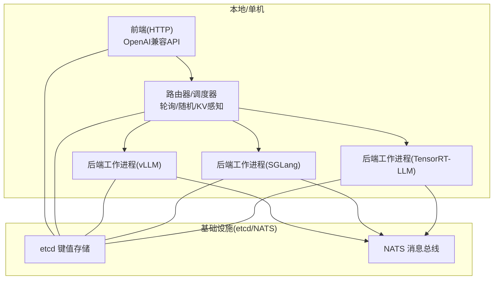
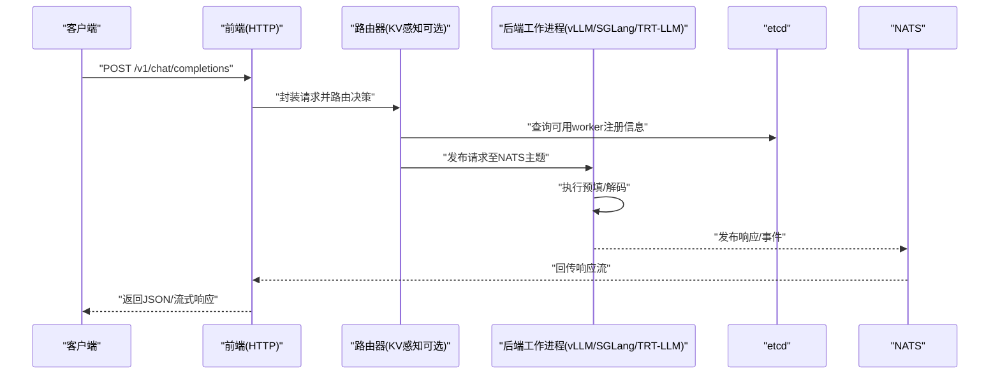
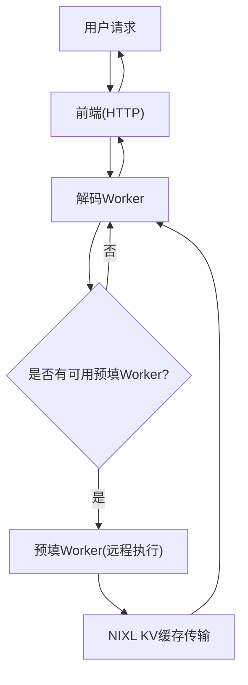
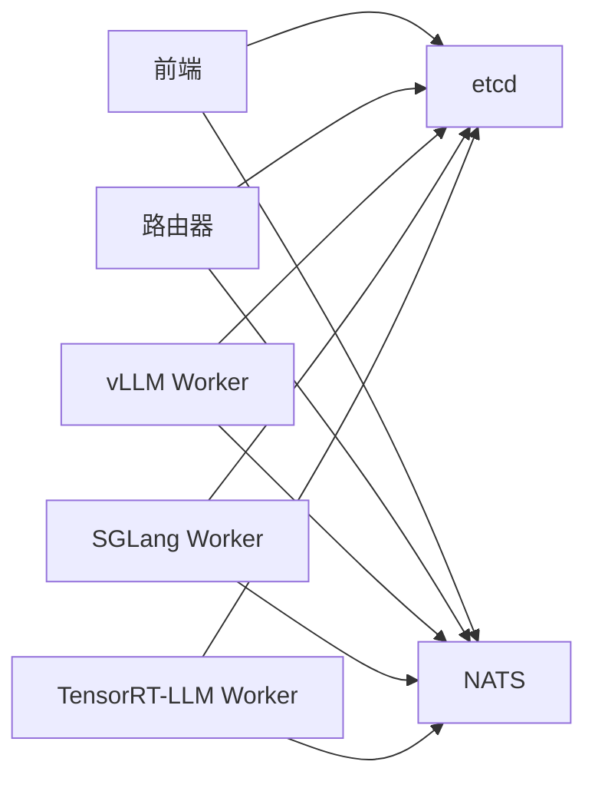

# 基础使用示例

<cite>
**本文引用的文件**
- [README.md](file://README.md)
- [examples/README.md](file://examples/README.md)
- [docs/pages/getting-started/quickstart.md](file://docs/pages/getting-started/quickstart.md)
- [docs/pages/getting-started/examples.md](file://docs/pages/getting-started/examples.md)
- [components/src/dynamo/frontend/main.py](file://components/src/dynamo/frontend/main.py)
- [components/src/dynamo/vllm/main.py](file://components/src/dynamo/vllm/main.py)
- [components/src/dynamo/sglang/main.py](file://components/src/dynamo/sglang/main.py)
- [components/src/dynamo/trtllm/main.py](file://components/src/dynamo/trtllm/main.py)
- [examples/basics/quickstart/README.md](file://examples/basics/quickstart/README.md)
- [examples/basics/disaggregated_serving/README.md](file://examples/basics/disaggregated_serving/README.md)
- [examples/basics/multinode/README.md](file://examples/basics/multinode/README.md)
- [deploy/docker-compose.yml](file://deploy/docker-compose.yml)
- [deploy/sanity_check.py](file://deploy/sanity_check.py)
- [examples/deployments/EKS/Deploy_VLLM_example.md](file://examples/deployments/EKS/Deploy_VLLM_example.md)
</cite>

## 目录
1. [简介](#简介)
2. [项目结构](#项目结构)
3. [核心组件](#核心组件)
4. [架构总览](#架构总览)
5. [详细组件分析](#详细组件分析)
6. [依赖关系分析](#依赖关系分析)
7. [性能考虑](#性能考虑)
8. [故障排查指南](#故障排查指南)
9. [结论](#结论)
10. [附录](#附录)

## 简介
本指南面向初学者，帮助你快速上手Dynamo，完成从单机到多节点再到Kubernetes集群的部署，并掌握OpenAI兼容API的基本用法。内容覆盖：
- 单机本地部署：前端+任一后端（vLLM/SGLang/TensorRT-LLM）
- 分割式预填充（Prefill）与解码（Decode）分离部署
- 多节点KV感知路由部署
- Kubernetes（EKS）平台部署示例
- OpenAI兼容API的聊天与补全调用
- 常见问题与排障建议

## 项目结构
Dynamo采用模块化设计，核心由“前端”“路由器/调度器”“后端工作进程”三部分组成，支持通过etcd/NATS进行服务发现与消息传递；同时提供多种后端引擎适配（vLLM、SGLang、TensorRT-LLM）。



图示来源
- [components/src/dynamo/frontend/main.py](file://components/src/dynamo/frontend/main.py#L1-L518)
- [components/src/dynamo/vllm/main.py](file://components/src/dynamo/vllm/main.py#L1-L800)
- [components/src/dynamo/sglang/main.py](file://components/src/dynamo/sglang/main.py#L1-L888)
- [components/src/dynamo/trtllm/main.py](file://components/src/dynamo/trtllm/main.py#L1-L51)

章节来源
- [README.md](file://README.md#L1-L398)
- [examples/README.md](file://examples/README.md#L1-L86)

## 核心组件
- 前端（Frontend）
  - 提供OpenAI兼容的HTTP API，内置预处理（提示模板、分词）、路由选择与请求转发。
  - 支持交互模式与HTTP服务模式；可配置路由策略（轮询、随机、KV感知）。
- 路由器/调度器（Router）
  - 基于etcd注册表自动发现后端实例；在KV感知模式下，依据KV缓存重用情况智能选择最优worker。
- 后端工作进程（Backend Workers）
  - vLLM/SGLang/TensorRT-LLM三种后端，分别以独立进程提供预填/解码能力，支持多副本与跨节点部署。

章节来源
- [components/src/dynamo/frontend/main.py](file://components/src/dynamo/frontend/main.py#L1-L518)
- [components/src/dynamo/vllm/main.py](file://components/src/dynamo/vllm/main.py#L1-L800)
- [components/src/dynamo/sglang/main.py](file://components/src/dynamo/sglang/main.py#L1-L888)
- [components/src/dynamo/trtllm/main.py](file://components/src/dynamo/trtllm/main.py#L1-L51)

## 架构总览
Dynamo通过分布式运行时（DistributedRuntime）连接各组件，使用etcd进行服务注册与发现，使用NATS进行请求与事件消息传递。前端负责接收HTTP请求，路由器根据策略选择目标worker，worker执行推理并将结果回传前端。



图示来源
- [components/src/dynamo/frontend/main.py](file://components/src/dynamo/frontend/main.py#L368-L518)
- [components/src/dynamo/vllm/main.py](file://components/src/dynamo/vllm/main.py#L676-L800)
- [components/src/dynamo/sglang/main.py](file://components/src/dynamo/sglang/main.py#L191-L328)
- [components/src/dynamo/trtllm/main.py](file://components/src/dynamo/trtllm/main.py#L29-L51)

## 详细组件分析

### 单机本地快速开始（容器/本地安装）
- 使用容器镜像快速启动（推荐）
  - vLLM/SGLang/TensorRT-LLM均提供官方预构建镜像，一键运行即可体验。
- 本地安装（可选）
  - 通过PyPI安装对应后端包，再启动前端与后端工作进程。
- 前端与后端启动要点
  - 前端默认监听8000端口，可通过参数调整；后端需指定模型路径或名称。
  - 在本地开发场景，可使用“文件型KV存储”避免外部etcd依赖。

章节来源
- [README.md](file://README.md#L87-L215)
- [docs/pages/getting-started/quickstart.md](file://docs/pages/getting-started/quickstart.md#L1-L151)

### 分割式预填充与解码（Prefill/Decode Disaggregation）
- 架构说明
  - 将输入预填阶段与逐字解码阶段分离，分别由专用worker承担，提升吞吐与资源利用率。
  - 可通过NIXL在GPU间高效传输KV缓存，实现跨节点的低延迟协作。
- 部署步骤
  - 启动解码worker（占用一个GPU）
  - 启动预填worker（占用另一个GPU），并设置相关端口环境变量
  - 启动前端，发送请求验证
- 关键参数
  - 解码worker：指定模型名/路径
  - 预填worker：添加“预填模式”标志与NIXL端口
  - 前端：保持默认HTTP端口或自定义



图示来源
- [examples/basics/disaggregated_serving/README.md](file://examples/basics/disaggregated_serving/README.md#L1-L223)

章节来源
- [examples/basics/disaggregated_serving/README.md](file://examples/basics/disaggregated_serving/README.md#L1-L223)

### 多节点KV感知路由（高可用与负载均衡）
- 场景说明
  - 在多节点环境中，前端启用KV感知路由，基于已缓存的token序列重用情况智能分配请求，提高命中率与整体性能。
- 部署步骤
  - 在共享节点上启动etcd与NATS
  - 在每个节点分别启动一对（预填+解码）worker
  - 启动前端并设置路由模式为“KV感知”
  - 使用OpenAI客户端或curl测试多轮对话与并发请求
- 关键点
  - 所有worker需能访问同一etcd与NATS
  - 需要正确配置NIXL以实现跨节点KV缓存传输
  - 日志中可观察到KV重叠分数与路由决策

```mermaid
graph TB
subgraph "节点A"
A1["解码Worker"]
A2["预填Worker"]
end
subgraph "节点B"
B1["解码Worker"]
B2["预填Worker"]
end
FE["前端(KV感知)"] --> A1
FE --> B1
A1 <- --> A2
B1 <- --> B2
FE --> NATS["NATS"]
A1 --> NATS
A2 --> NATS
B1 --> NATS
B2 --> NATS
FE --> ETCD["etcd"]
A1 --> ETCD
A2 --> ETCD
B1 --> ETCD
B2 --> ETCD
```

图示来源
- [examples/basics/multinode/README.md](file://examples/basics/multinode/README.md#L1-L515)

章节来源
- [examples/basics/multinode/README.md](file://examples/basics/multinode/README.md#L1-L515)

### Kubernetes（EKS）集群部署
- 部署流程
  - 准备Dynamo平台（Operator等）与基础设施（etcd/NATS）
  - 应用示例清单（如vLLM聚合路由示例）
  - 通过端口转发或Ingress暴露前端服务
  - 使用curl或OpenAI客户端进行测试
- 注意事项
  - 确保命名空间、镜像版本与GPU资源声明正确
  - 如需对外访问，配置合适的Service/Ingress

章节来源
- [examples/deployments/EKS/Deploy_VLLM_example.md](file://examples/deployments/EKS/Deploy_VLLM_example.md#L1-L48)

### OpenAI兼容API使用示例
- 基本聊天
  - 使用curl或OpenAI SDK向前端发送POST请求，指定模型、消息与生成参数。
- 补全功能
  - 与聊天接口类似，但通常用于非对话式文本生成任务。
- 流式输出
  - 设置stream=true可获得逐token的增量响应，适合长文本生成与实时反馈。

章节来源
- [README.md](file://README.md#L198-L215)
- [docs/pages/getting-started/quickstart.md](file://docs/pages/getting-started/quickstart.md#L142-L151)
- [examples/basics/quickstart/README.md](file://examples/basics/quickstart/README.md#L74-L86)

## 依赖关系分析
- 组件耦合
  - 前端与路由器通过etcd发现后端；路由器与后端通过NATS通信。
  - 后端内部可进一步拆分为预填与解码两类worker，支持跨节点协作。
- 外部依赖
  - etcd：服务注册与发现
  - NATS：请求与事件消息传递
  - 可选：NIXL（跨GPU缓存传输）



图示来源
- [deploy/docker-compose.yml](file://deploy/docker-compose.yml#L1-L36)
- [components/src/dynamo/frontend/main.py](file://components/src/dynamo/frontend/main.py#L420-L421)

章节来源
- [deploy/docker-compose.yml](file://deploy/docker-compose.yml#L1-L36)

## 性能考虑
- 路由策略
  - KV感知路由在存在共享前缀或多轮对话场景下显著提升缓存命中率。
  - 轮询/随机路由适用于简单负载分布，但可能降低缓存复用效率。
- 资源隔离
  - 预填与解码分离可针对不同计算特性优化并行度与内存占用。
- 传输优化
  - 在多节点场景下，优先使用NIXL进行GPU直连缓存传输，减少CPU拷贝与网络开销。

## 故障排查指南
- 启动前检查
  - 使用系统健康检查工具验证GPU、驱动、CUDA版本与共享内存等关键条件。
- 常见问题
  - 无法发现后端：确认etcd与NATS可达且未被防火墙阻断；检查后端是否成功注册。
  - NATS连接失败：核对NATS服务器地址与端口；在KV感知模式下确保事件通道正常。
  - KV感知不生效：确认前端启用了KV路由模式，后端发布KV事件，日志中可见重叠分数。
  - 多节点NIXL传输异常：检查GPU互联（如InfiniBand/RoCE）、CUDA IPC与跨节点带宽。
- 快速定位
  - 提升日志级别（如DYN_LOG=debug）观察路由决策与事件传播。
  - 使用健康检查端点确认前端/后端存活状态。

章节来源
- [deploy/sanity_check.py](file://deploy/sanity_check.py#L1-L800)
- [examples/basics/multinode/README.md](file://examples/basics/multinode/README.md#L437-L465)

## 结论
通过本指南，你可以从零开始在单机上快速体验Dynamo，并逐步扩展到多节点与Kubernetes集群。结合分割式预填充/解码与KV感知路由，Dynamo能够在复杂场景下实现更高的吞吐与更低的延迟。建议在生产部署前完成充分的性能与稳定性验证，并建立完善的监控与告警体系。

## 附录
- 快速命令参考（示例）
  - 容器方式启动后端（任选其一）
    - vLLM：docker run --gpus all --network host --rm -it nvcr.io/nvidia/ai-dynamo/vllm-runtime:0.8.1
    - SGLang：docker run --gpus all --network host --rm -it nvcr.io/nvidia/ai-dynamo/sglang-runtime:0.8.1
    - TensorRT-LLM：docker run --gpus all --network host --rm -it nvcr.io/nvidia/ai-dynamo/tensorrtllm-runtime:0.8.1
  - 启动前端
    - python3 -m dynamo.frontend --http-port 8000 --store-kv file
  - 启动后端（vLLM）
    - python3 -m dynamo.vllm --model Qwen/Qwen3-0.6B --store-kv file --kv-events-config '{"enable_kv_cache_events": false}'
  - 发送请求（聊天）
    - curl localhost:8000/v1/chat/completions -H "Content-Type: application/json" -d '{"model":"Qwen/Qwen3-0.6B","messages":[{"role":"user","content":"你好"}],"stream":false,"max_tokens":50}'

章节来源
- [README.md](file://README.md#L98-L197)
- [docs/pages/getting-started/quickstart.md](file://docs/pages/getting-started/quickstart.md#L104-L141)