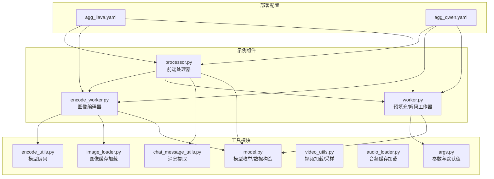
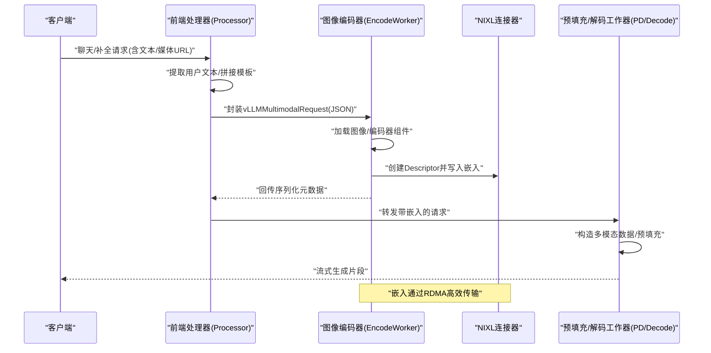
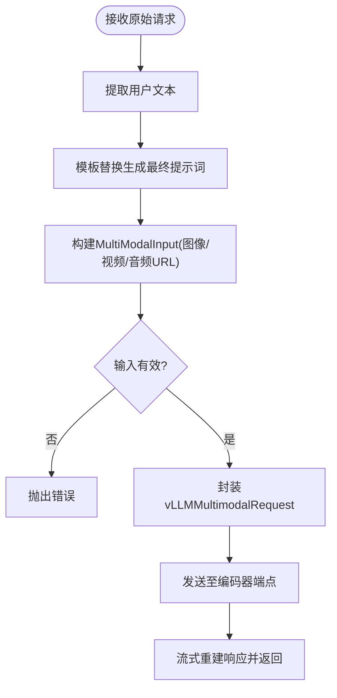
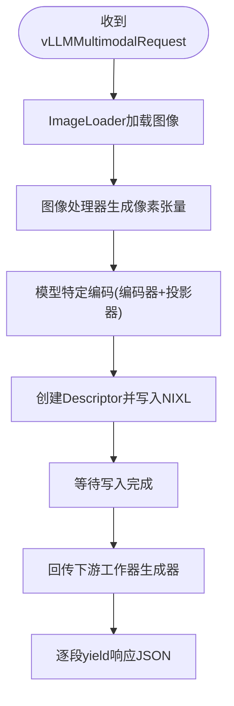
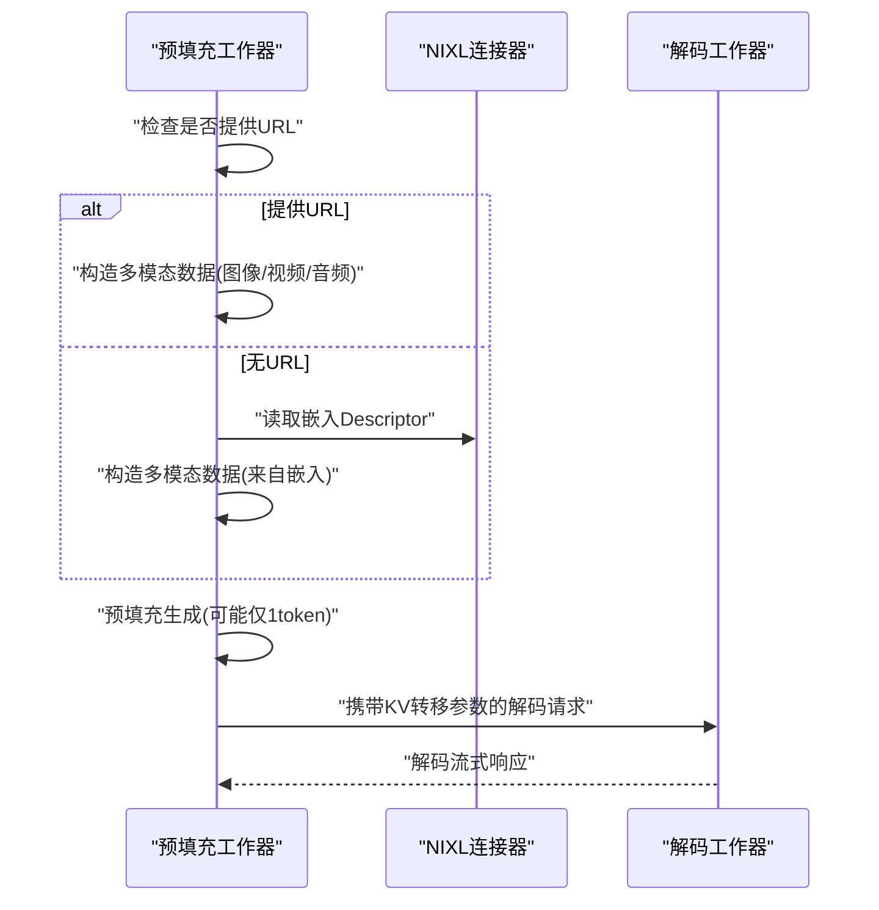
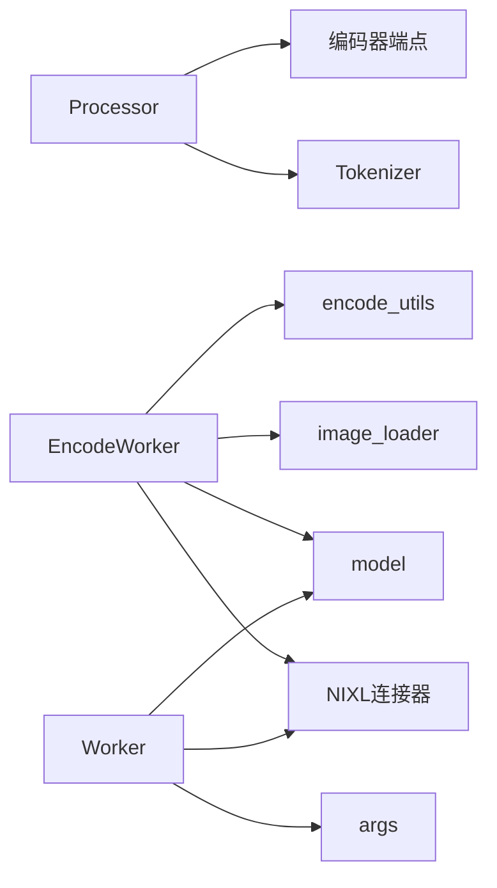
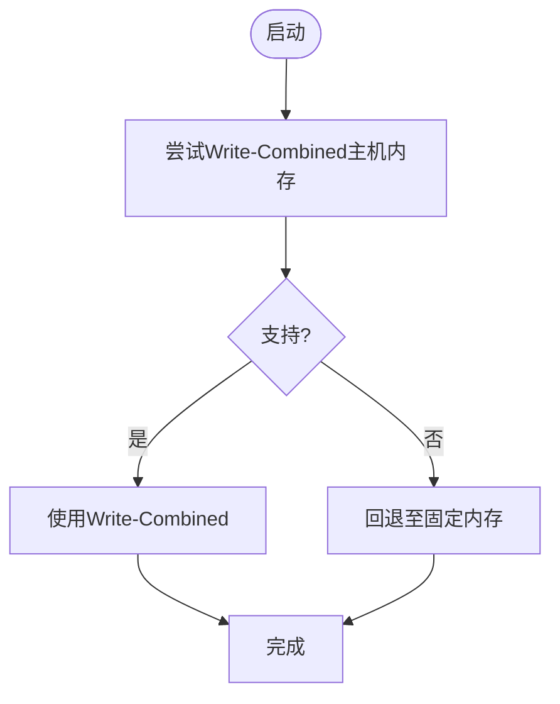

# 多模态处理示例

<cite>
**本文引用的文件**
- [examples/multimodal/deploy/agg_llava.yaml](file://examples/multimodal/deploy/agg_llava.yaml)
- [examples/multimodal/deploy/agg_qwen.yaml](file://examples/multimodal/deploy/agg_qwen.yaml)
- [examples/multimodal/components/processor.py](file://examples/multimodal/components/processor.py)
- [examples/multimodal/components/encode_worker.py](file://examples/multimodal/components/encode_worker.py)
- [examples/multimodal/components/worker.py](file://examples/multimodal/components/worker.py)
- [examples/multimodal/utils/args.py](file://examples/multimodal/utils/args.py)
- [examples/multimodal/utils/chat_message_utils.py](file://examples/multimodal/utils/chat_message_utils.py)
- [examples/multimodal/utils/encode_utils.py](file://examples/multimodal/utils/encode_utils.py)
- [examples/multimodal/utils/image_loader.py](file://examples/multimodal/utils/image_loader.py)
- [examples/multimodal/utils/video_utils.py](file://examples/multimodal/utils/video_utils.py)
- [examples/multimodal/utils/audio_loader.py](file://examples/multimodal/utils/audio_loader.py)
- [examples/multimodal/utils/model.py](file://examples/multimodal/utils/model.py)
- [components/src/dynamo/common/tests/memory/test_multimodal_embedding_cache_manager.py](file://components/src/dynamo/common/tests/memory/test_multimodal_embedding_cache_manager.py)
- [lib/llm/src/block_manager/storage/cuda.rs](file://lib/llm/src/block_manager/storage/cuda.rs)
- [lib/llm/src/block_manager/numa_allocator/worker_pool.rs](file://lib/llm/src/block_manager/numa_allocator/worker_pool.rs)
- [lib/llm/src/kernels/block_copy.cu](file://lib/llm/src/kernels/block_copy.cu)
</cite>

## 目录
1. [简介](#简介)
2. [项目结构](#项目结构)
3. [核心组件](#核心组件)
4. [架构总览](#架构总览)
5. [详细组件分析](#详细组件分析)
6. [依赖关系分析](#依赖关系分析)
7. [性能考量](#性能考量)
8. [故障排查指南](#故障排查指南)
9. [结论](#结论)
10. [附录](#附录)

## 简介
本示例文档面向希望在Dynamo平台上实现多模态（图像、音频、视频）推理与服务的工程师，系统性介绍从请求构建、编码器与处理器配置、到部署与性能优化的完整流程。文档覆盖以下关键点：
- 图像编码器、音频处理器与视频工作者的配置与使用
- 多模态请求的构建方法（文本、图像、音频组合）
- 多模态缓存管理、编码器缓存与嵌入向量处理
- 聚合式与分割式多模态部署配置
- 性能优化技巧（CUDA IPC通信、内存管理等）

## 项目结构
多模态示例位于examples/multimodal目录，包含三个核心组件与若干工具模块：
- 组件层：processor.py（前端处理器）、encode_worker.py（图像编码器）、worker.py（预填充/解码工作器）
- 工具层：args.py（参数解析与默认值设置）、chat_message_utils.py（消息提取）、encode_utils.py（模型特定编码）、image_loader.py（图像加载缓存）、video_utils.py（视频加载与采样）、audio_loader.py（音频加载缓存）、model.py（模型枚举与数据构造）
- 部署层：deploy目录下的聚合式与分割式YAML示例

**图表来源**
- [examples/multimodal/components/processor.py](file://examples/multimodal/components/processor.py#L1-L348)
- [examples/multimodal/components/encode_worker.py](file://examples/multimodal/components/encode_worker.py#L1-L265)
- [examples/multimodal/components/worker.py](file://examples/multimodal/components/worker.py#L1-L475)
- [examples/multimodal/utils/args.py](file://examples/multimodal/utils/args.py#L1-L185)
- [examples/multimodal/utils/chat_message_utils.py](file://examples/multimodal/utils/chat_message_utils.py#L1-L26)
- [examples/multimodal/utils/encode_utils.py](file://examples/multimodal/utils/encode_utils.py#L1-L133)
- [examples/multimodal/utils/image_loader.py](file://examples/multimodal/utils/image_loader.py#L1-L111)
- [examples/multimodal/utils/video_utils.py](file://examples/multimodal/utils/video_utils.py#L1-L415)
- [examples/multimodal/utils/audio_loader.py](file://examples/multimodal/utils/audio_loader.py#L1-L81)
- [examples/multimodal/utils/model.py](file://examples/multimodal/utils/model.py#L1-L92)
- [examples/multimodal/deploy/agg_llava.yaml](file://examples/multimodal/deploy/agg_llava.yaml#L1-L64)
- [examples/multimodal/deploy/agg_qwen.yaml](file://examples/multimodal/deploy/agg_qwen.yaml#L1-L65)

**章节来源**
- [examples/multimodal/components/processor.py](file://examples/multimodal/components/processor.py#L1-L348)
- [examples/multimodal/components/encode_worker.py](file://examples/multimodal/components/encode_worker.py#L1-L265)
- [examples/multimodal/components/worker.py](file://examples/multimodal/components/worker.py#L1-L475)
- [examples/multimodal/utils/args.py](file://examples/multimodal/utils/args.py#L1-L185)
- [examples/multimodal/utils/chat_message_utils.py](file://examples/multimodal/utils/chat_message_utils.py#L1-L26)
- [examples/multimodal/utils/encode_utils.py](file://examples/multimodal/utils/encode_utils.py#L1-L133)
- [examples/multimodal/utils/image_loader.py](file://examples/multimodal/utils/image_loader.py#L1-L111)
- [examples/multimodal/utils/video_utils.py](file://examples/multimodal/utils/video_utils.py#L1-L415)
- [examples/multimodal/utils/audio_loader.py](file://examples/multimodal/utils/audio_loader.py#L1-L81)
- [examples/multimodal/utils/model.py](file://examples/multimodal/utils/model.py#L1-L92)
- [examples/multimodal/deploy/agg_llava.yaml](file://examples/multimodal/deploy/agg_llava.yaml#L1-L64)
- [examples/multimodal/deploy/agg_qwen.yaml](file://examples/multimodal/deploy/agg_qwen.yaml#L1-L65)

## 核心组件
- 前端处理器（Processor）
  - 负责解析OpenAI风格请求，拼接模板化提示词，构建多模态输入，转发至编码器。
  - 关键职责：模板替换、消息提取、请求封装、流式响应重建。
- 图像编码器（VllmEncodeWorker）
  - 加载图像，调用模型特定编码器生成嵌入，通过NIXL连接器以RDMA方式传输嵌入，再回传下游工作器。
  - 关键职责：图像加载缓存、编码器组件获取、嵌入形状与网格信息传递。
- 预填充/解码工作器（VllmPDWorker/VllmDecodeWorker）
  - 支持聚合与分割两种模式；聚合时在同一组件完成预填充与解码；分割时预填充结果携带KV转移参数，交由解码器远程解码。
  - 关键职责：多模态数据构造（图像/视频/音频嵌入）、KV事件发布、拆分/合并请求。

**章节来源**
- [examples/multimodal/components/processor.py](file://examples/multimodal/components/processor.py#L48-L348)
- [examples/multimodal/components/encode_worker.py](file://examples/multimodal/components/encode_worker.py#L47-L265)
- [examples/multimodal/components/worker.py](file://examples/multimodal/components/worker.py#L47-L475)

## 架构总览
下图展示了典型的多模态请求在Dynamo中的端到端流转：前端处理器接收请求，构建多模态输入，发送给图像编码器；编码器生成嵌入并通过NIXL连接器传输；随后进入预填充/解码工作器，最终返回流式响应。

**图表来源**
- [examples/multimodal/components/processor.py](file://examples/multimodal/components/processor.py#L196-L263)
- [examples/multimodal/components/encode_worker.py](file://examples/multimodal/components/encode_worker.py#L73-L155)
- [examples/multimodal/components/worker.py](file://examples/multimodal/components/worker.py#L260-L397)

## 详细组件分析

### 前端处理器（Processor）
- 请求解析与模板化
  - 从消息中提取用户文本，使用--prompt-template参数进行占位符替换，构造最终提示词。
  - 支持多轮对话消息，按顺序拼接用户文本。
- 多模态输入构建
  - 支持image_url、video_url、audio_url三类输入；三者互斥或按模型支持组合。
  - 将消息转换为OpenAI风格的ChatCompletionRequest，并开启流式输出。
- 与编码器交互
  - 通过round_robin将vLLMMultimodalRequest发送至编码器端点，逐段重建OpenAI风格响应。

**图表来源**
- [examples/multimodal/components/processor.py](file://examples/multimodal/components/processor.py#L196-L263)
- [examples/multimodal/utils/chat_message_utils.py](file://examples/multimodal/utils/chat_message_utils.py#L7-L26)

**章节来源**
- [examples/multimodal/components/processor.py](file://examples/multimodal/components/processor.py#L48-L348)
- [examples/multimodal/utils/chat_message_utils.py](file://examples/multimodal/utils/chat_message_utils.py#L1-L26)

### 图像编码器（VllmEncodeWorker）
- 模型与组件初始化
  - 使用transformers加载图像处理器与视觉模型；根据模型类型获取视觉编码器与投影器。
- 图像处理与嵌入生成
  - 通过ImageLoader加载图像（支持HTTP/HTTPS与data URL），调用encode_utils进行模型特定编码。
- 嵌入传输与回传
  - 创建NIXL Descriptor并将嵌入写入，记录序列化元数据；等待写入完成后，回传下游工作器的生成结果。

**图表来源**
- [examples/multimodal/components/encode_worker.py](file://examples/multimodal/components/encode_worker.py#L73-L155)
- [examples/multimodal/utils/encode_utils.py](file://examples/multimodal/utils/encode_utils.py#L58-L103)
- [examples/multimodal/utils/image_loader.py](file://examples/multimodal/utils/image_loader.py#L41-L111)

**章节来源**
- [examples/multimodal/components/encode_worker.py](file://examples/multimodal/components/encode_worker.py#L47-L265)
- [examples/multimodal/utils/encode_utils.py](file://examples/multimodal/utils/encode_utils.py#L1-L133)
- [examples/multimodal/utils/image_loader.py](file://examples/multimodal/utils/image_loader.py#L1-L111)

### 预填充/解码工作器（VllmPDWorker/VllmDecodeWorker）
- 多模态数据构造
  - 若无URL输入，则从NIXL读取嵌入（CPU/指定精度），构造对应模型的数据格式（图像/视频/音频）。
  - 对于视频/音频模型，嵌入dtype与设备有特殊处理。
- 分割式模式
  - 预填充阶段仅生成一个token，携带KV转移参数；随后将KV参数回填至解码请求，由解码器执行远程解码。
- 聚合式模式
  - 预填充与解码在同一组件内完成，直接返回流式响应。

**图表来源**
- [examples/multimodal/components/worker.py](file://examples/multimodal/components/worker.py#L260-L397)

**章节来源**
- [examples/multimodal/components/worker.py](file://examples/multimodal/components/worker.py#L194-L475)

### 参数与默认值（args.py）
- 端点与命名空间
  - 默认端点遵循dyn://namespace.component.endpoint约定；可通过--endpoint覆盖。
- vLLM默认值覆盖
  - 启用前缀缓存、多模态嵌入输入、KV事件与传输配置；自动计算KV事件端口并减去数据并行偏移。
- 环境与主机
  - 自动设置侧通道主机，避免覆盖用户配置。

**章节来源**
- [examples/multimodal/utils/args.py](file://examples/multimodal/utils/args.py#L50-L185)

### 模型与数据构造（model.py）
- 支持模型枚举
  - 包含LLaVA、Qwen-VL、LLaVA-NeXT-Video、Qwen-Audio等标识。
- 数据构造
  - 根据模型类型构造多模态数据字典，处理图像网格信息、视频numpy数组、音频嵌入等。

**章节来源**
- [examples/multimodal/utils/model.py](file://examples/multimodal/utils/model.py#L25-L92)

### 编码工具（encode_utils.py）
- 模型特定编码
  - LLaVA：视觉编码器+投影器；Qwen-VL：直接使用视觉编码器并处理grid_thw。
- 编码器组件获取
  - 根据模型返回对应的vision_encoder与projector。

**章节来源**
- [examples/multimodal/utils/encode_utils.py](file://examples/multimodal/utils/encode_utils.py#L58-L133)

### 加载器与缓存
- 图像加载器（image_loader.py）
  - 支持HTTP/HTTPS与data URL；内置LRU缓存队列，避免重复下载。
- 视频加载器（video_utils.py）
  - 支持HTTP/HTTPS与本地文件；提供元数据提取、帧索引采样、帧重采样与RDMA准备。
- 音频加载器（audio_loader.py）
  - 基于librosa加载与重采样；使用LRU缓存避免重复下载。

**章节来源**
- [examples/multimodal/utils/image_loader.py](file://examples/multimodal/utils/image_loader.py#L31-L111)
- [examples/multimodal/utils/video_utils.py](file://examples/multimodal/utils/video_utils.py#L37-L415)
- [examples/multimodal/utils/audio_loader.py](file://examples/multimodal/utils/audio_loader.py#L30-L81)

## 依赖关系分析
- 组件间依赖
  - Processor依赖ChatProcessor/CompletionsProcessor与Tokenizer；依赖encode_worker端点。
  - EncodeWorker依赖encode_utils与image_loader；通过NIXL连接器与下游通信。
  - Worker依赖args与model；根据--worker-type选择不同子类。
- 外部库与集成
  - vLLM引擎、Transformers、PyAV、Librosa等。

**图表来源**
- [examples/multimodal/components/processor.py](file://examples/multimodal/components/processor.py#L92-L107)
- [examples/multimodal/components/encode_worker.py](file://examples/multimodal/components/encode_worker.py#L23-L26)
- [examples/multimodal/components/worker.py](file://examples/multimodal/components/worker.py#L104-L116)

**章节来源**
- [examples/multimodal/components/processor.py](file://examples/multimodal/components/processor.py#L1-L348)
- [examples/multimodal/components/encode_worker.py](file://examples/multimodal/components/encode_worker.py#L1-L265)
- [examples/multimodal/components/worker.py](file://examples/multimodal/components/worker.py#L1-L475)

## 性能考量
- CUDA IPC与内存管理
  - 优先尝试写组合（Write-Combined）主机内存分配，若不支持则回退至常规固定内存；减少PCIe DMA开销。
  - NUMA分配器工作池负责异步CUDA固定内存分配，失败时自动释放避免泄漏。
  - CUDA内核提供块拷贝与同步/异步复制接口，便于高效数据搬运。
- 多模态嵌入缓存
  - LRU策略管理嵌入缓存，支持命中/未命中统计与容量跟踪；对过大的张量拒绝缓存。
- RDMA传输
  - 视频帧张量在CPU上转为uint8并保证连续，满足NIXL缓冲区要求，降低跨进程/节点传输成本。

**图表来源**
- [lib/llm/src/block_manager/storage/cuda.rs](file://lib/llm/src/block_manager/storage/cuda.rs#L77-L106)
- [lib/llm/src/block_manager/numa_allocator/worker_pool.rs](file://lib/llm/src/block_manager/numa_allocator/worker_pool.rs#L112-L140)
- [lib/llm/src/kernels/block_copy.cu](file://lib/llm/src/kernels/block_copy.cu#L224-L556)

**章节来源**
- [components/src/dynamo/common/tests/memory/test_multimodal_embedding_cache_manager.py](file://components/src/dynamo/common/tests/memory/test_multimodal_embedding_cache_manager.py#L1-L224)
- [lib/llm/src/block_manager/storage/cuda.rs](file://lib/llm/src/block_manager/storage/cuda.rs#L77-L106)
- [lib/llm/src/block_manager/numa_allocator/worker_pool.rs](file://lib/llm/src/block_manager/numa_allocator/worker_pool.rs#L112-L140)
- [lib/llm/src/kernels/block_copy.cu](file://lib/llm/src/kernels/block_copy.cu#L224-L556)

## 故障排查指南
- 常见错误与定位
  - 模板缺失占位符：<prompt>必须存在于--prompt-template中。
  - 输入冲突：图像/视频/音频URL不可混用；同一请求只能提供一种媒体源。
  - 嵌入尺寸/形状：视频/音频嵌入需满足dtype/device/连续性要求；过大张量不会被缓存。
  - 端点格式：--endpoint必须符合dyn://namespace.component.endpoint格式。
- 日志与调试
  - 各组件均启用Dynamo日志配置；建议开启DEBUG级别查看请求/响应细节与NIXL传输状态。
- 运行时优雅关闭
  - 信号处理确保在处理完在途请求后停止服务，避免中断。

**章节来源**
- [examples/multimodal/components/processor.py](file://examples/multimodal/components/processor.py#L202-L251)
- [examples/multimodal/components/encode_worker.py](file://examples/multimodal/components/encode_worker.py#L96-L155)
- [examples/multimodal/utils/args.py](file://examples/multimodal/utils/args.py#L38-L47)
- [examples/multimodal/utils/encode_utils.py](file://examples/multimodal/utils/encode_utils.py#L97-L102)

## 结论
本示例文档提供了在Dynamo上实现多模态推理的完整路径：从前端请求构建、编码器嵌入生成、到预填充/解码与部署配置。通过合理的缓存策略、RDMA传输与NUMA/CUDA内存管理，可在多模态场景下获得稳定且高性能的服务体验。建议结合具体模型与硬件环境调整参数与部署策略。

## 附录

### 部署配置示例（聚合式）
- LLaVA聚合式部署
  - Frontend：前端组件
  - EncodeWorker：图像编码器，加载LLaVA模型
  - VLMWorker：预填充工作器，加载LLaVA模型
  - Processor：处理器，加载LLaVA模型并使用模板
- Qwen聚合式部署
  - 与上述类似，但模型为Qwen-VL，模板适配其格式

**章节来源**
- [examples/multimodal/deploy/agg_llava.yaml](file://examples/multimodal/deploy/agg_llava.yaml#L1-L64)
- [examples/multimodal/deploy/agg_qwen.yaml](file://examples/multimodal/deploy/agg_qwen.yaml#L1-L65)

### 多模态请求构建要点
- 文本与图像组合
  - 在消息中提供text与image_url，模板替换后形成最终提示词。
- 文本与视频/音频组合
  - 提供text与video_url或audio_url，处理器会校验输入合法性并构造相应多模态数据。
- 嵌入直传
  - 当已存在嵌入时，编码器会创建Descriptor并通过NIXL传输，避免重复下载媒体资源。

**章节来源**
- [examples/multimodal/components/processor.py](file://examples/multimodal/components/processor.py#L227-L251)
- [examples/multimodal/components/encode_worker.py](file://examples/multimodal/components/encode_worker.py#L126-L134)