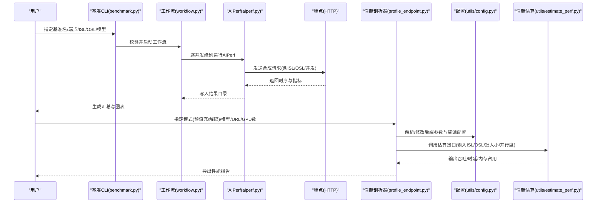
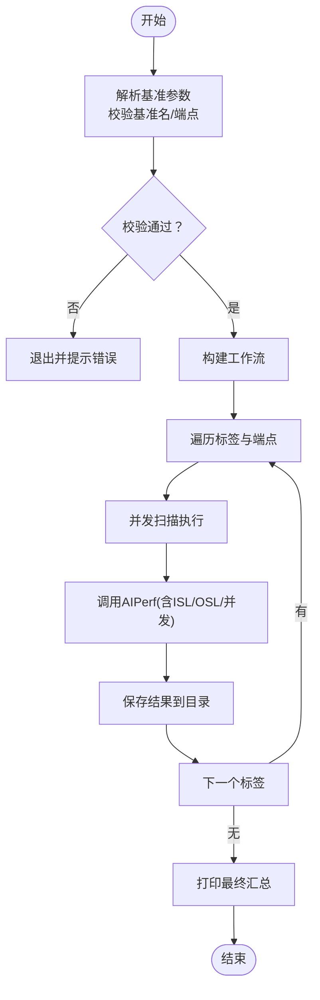
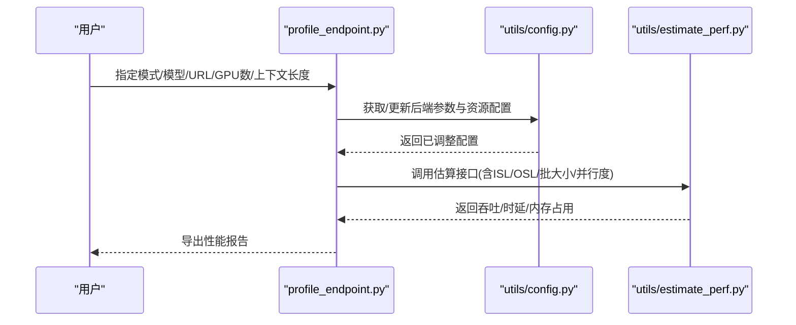
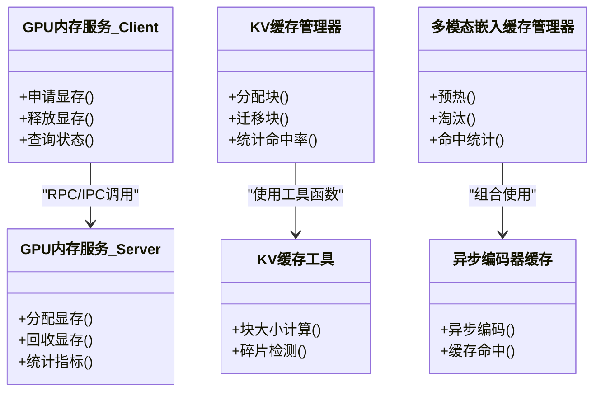
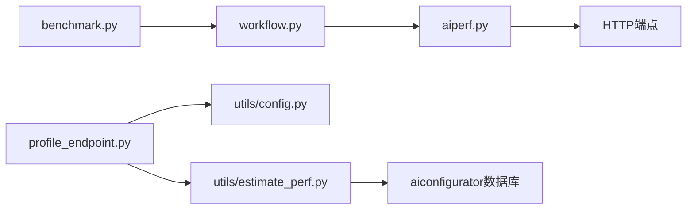

# 性能优化示例

<cite>
**本文引用的文件**   
- [benchmarks/README.md](file://benchmarks/README.md)
- [benchmarks/utils/benchmark.py](file://benchmarks/utils/benchmark.py)
- [benchmarks/utils/workflow.py](file://benchmarks/utils/workflow.py)
- [benchmarks/utils/aiperf.py](file://benchmarks/utils/aiperf.py)
- [benchmarks/profiler/profile_endpoint.py](file://benchmarks/profiler/profile_endpoint.py)
- [benchmarks/profiler/utils/config.py](file://benchmarks/profiler/utils/config.py)
- [benchmarks/profiler/utils/estimate_perf.py](file://benchmarks/profiler/utils/estimate_perf.py)
- [docs/pages/performance/tuning.md](file://docs/pages/performance/tuning.md)
- [examples/deployments/ECS/README.md](file://examples/deployments/ECS/README.md)
- [lib/gpu_memory_service/client/memory_manager.py](file://lib/gpu_memory_service/client/memory_manager.py)
- [lib/gpu_memory_service/server/memory_manager.py](file://lib/gpu_memory_service/server/memory_manager.py)
- [lib/bindings/kvbm/python/kvbm/vllm_integration/kv_cache_manager.py](file://lib/bindings/kvbm/python/kvbm/vllm_integration/kv_cache_manager.py)
- [lib/bindings/kvbm/python/kvbm/vllm_integration/kv_cache_utils.py](file://lib/bindings/kvbm/python/kvbm/vllm_integration/kv_cache_utils.py)
- [components/src/dynamo/common/memory/multimodal_embedding_cache_manager.py](file://components/src/dynamo/common/memory/multimodal_embedding_cache_manager.py)
- [components/src/dynamo/common/multimodal/async_encoder_cache.py](file://components/src/dynamo/common/multimodal/async_encoder_cache.py)
- [tests/lmcache/mmlu-lmcache_enabled-dynamo.py](file://tests/lmcache/mmlu-lmcache_enabled-dynamo.py)
- [tests/lmcache/deploy-lmcache_enabled-dynamo-disag.sh](file://tests/lmcache/deploy-lmcache_enabled-dynamo-disag.sh)
- [tests/lmcache/run_test.sh](file://tests/lmcache/run_test.sh)
</cite>

## 目录
1. [简介](#简介)
2. [项目结构](#项目结构)
3. [核心组件](#核心组件)
4. [架构总览](#架构总览)
5. [详细组件分析](#详细组件分析)
6. [依赖关系分析](#依赖关系分析)
7. [性能考量](#性能考量)
8. [故障排查指南](#故障排查指南)
9. [结论](#结论)
10. [附录](#附录)

## 简介
本文件面向Dynamo在生产环境中的性能优化实践，围绕以下目标展开：构建可复现的性能基准测试方法与结果分析；系统梳理批处理大小、序列长度、并发等关键参数对吞吐与延迟的影响；总结GPU内存优化技术（梯度检查点、混合精度、内存池）在Dynamo中的落地方式；给出多节点环境下的调优策略（网络带宽、负载均衡）；展示以SLA为驱动的自动扩缩容配置与效果评估；提供KV缓存策略（预热与淘汰）的实操建议；最后给出性能瓶颈分析方法、工具使用指南以及不同硬件配置下的对比与推荐。

## 项目结构
本仓库包含端到端的性能评测与调优能力，涵盖基准测试框架、性能剖析器、内存与KV缓存管理、多后端集成与部署示例等模块。下图概览了与性能优化直接相关的关键目录与文件：

```mermaid
graph TB
subgraph "基准测试"
B1["benchmarks/README.md"]
B2["benchmarks/utils/benchmark.py"]
B3["benchmarks/utils/workflow.py"]
B4["benchmarks/utils/aiperf.py"]
end
subgraph "性能剖析"
P1["benchmarks/profiler/profile_endpoint.py"]
P2["benchmarks/profiler/utils/config.py"]
P3["benchmarks/profiler/utils/estimate_perf.py"]
end
subgraph "内存与KV缓存"
M1["lib/gpu_memory_service/client/memory_manager.py"]
M2["lib/gpu_memory_service/server/memory_manager.py"]
K1["lib/bindings/kvbm/python/kvbm/vllm_integration/kv_cache_manager.py"]
K2["lib/bindings/kvbm/python/kvbm/vllm_integration/kv_cache_utils.py"]
C1["components/src/dynamo/common/memory/multimodal_embedding_cache_manager.py"]
C2["components/src/dynamo/common/multimodal/async_encoder_cache.py"]
end
subgraph "部署与示例"
D1["examples/deployments/ECS/README.md"]
end
subgraph "LMCache集成测试"
T1["tests/lmcache/mmlu-lmcache_enabled-dynamo.py"]
T2["tests/lmcache/deploy-lmcache_enabled-dynamo-disag.sh"]
T3["tests/lmcache/run_test.sh"]
end
B2 --> B3 --> B4
P1 --> P2
P1 --> P3
M1 --> M2
K1 --> K2
T1 --> T2 --> T3
```

**图表来源**
- [benchmarks/README.md](file://benchmarks/README.md#L1-L75)
- [benchmarks/utils/benchmark.py](file://benchmarks/utils/benchmark.py#L1-L103)
- [benchmarks/utils/workflow.py](file://benchmarks/utils/workflow.py#L1-L97)
- [benchmarks/utils/aiperf.py](file://benchmarks/utils/aiperf.py#L1-L114)
- [benchmarks/profiler/profile_endpoint.py](file://benchmarks/profiler/profile_endpoint.py#L1-L124)
- [benchmarks/profiler/utils/config.py](file://benchmarks/profiler/utils/config.py#L1-L389)
- [benchmarks/profiler/utils/estimate_perf.py](file://benchmarks/profiler/utils/estimate_perf.py#L1-L234)
- [lib/gpu_memory_service/client/memory_manager.py](file://lib/gpu_memory_service/client/memory_manager.py)
- [lib/gpu_memory_service/server/memory_manager.py](file://lib/gpu_memory_service/server/memory_manager.py)
- [lib/bindings/kvbm/python/kvbm/vllm_integration/kv_cache_manager.py](file://lib/bindings/kvbm/python/kvbm/vllm_integration/kv_cache_manager.py)
- [lib/bindings/kvbm/python/kvbm/vllm_integration/kv_cache_utils.py](file://lib/bindings/kvbm/python/kvbm/vllm_integration/kv_cache_utils.py)
- [components/src/dynamo/common/memory/multimodal_embedding_cache_manager.py](file://components/src/dynamo/common/memory/multimodal_embedding_cache_manager.py)
- [components/src/dynamo/common/multimodal/async_encoder_cache.py](file://components/src/dynamo/common/multimodal/async_encoder_cache.py)
- [tests/lmcache/mmlu-lmcache_enabled-dynamo.py](file://tests/lmcache/mmlu-lmcache_enabled-dynamo.py)
- [tests/lmcache/deploy-lmcache_enabled-dynamo-disag.sh](file://tests/lmcache/deploy-lmcache_enabled-dynamo-disag.sh)
- [tests/lmcache/run_test.sh](file://tests/lmcache/run_test.sh)
- [examples/deployments/ECS/README.md](file://examples/deployments/ECS/README.md#L1-L129)

**章节来源**
- [benchmarks/README.md](file://benchmarks/README.md#L1-L75)
- [benchmarks/utils/benchmark.py](file://benchmarks/utils/benchmark.py#L1-L103)
- [benchmarks/utils/workflow.py](file://benchmarks/utils/workflow.py#L1-L97)
- [benchmarks/utils/aiperf.py](file://benchmarks/utils/aiperf.py#L1-L114)
- [benchmarks/profiler/profile_endpoint.py](file://benchmarks/profiler/profile_endpoint.py#L1-L124)
- [benchmarks/profiler/utils/config.py](file://benchmarks/profiler/utils/config.py#L1-L389)
- [benchmarks/profiler/utils/estimate_perf.py](file://benchmarks/profiler/utils/estimate_perf.py#L1-L234)
- [docs/pages/performance/tuning.md](file://docs/pages/performance/tuning.md#L1-L137)
- [examples/deployments/ECS/README.md](file://examples/deployments/ECS/README.md#L1-L129)

## 核心组件
- 基准测试编排与执行：通过命令行入口解析参数，校验端点与名称合法性，组织并发扫描与结果落盘，并生成可视化图表。
- 并发扫描与AIPerf集成：支持从环境变量读取自定义并发集，逐级执行AIPerf性能采样，输出时延、吞吐、分位数等指标。
- 性能剖析器：按“预填充/解码”模式对端点进行离线性能建模，结合系统规格与后端数据库估算吞吐与内存占用。
- 内存与KV缓存：提供GPU内存服务客户端/服务端抽象，KV缓存管理器与工具，以及多模态嵌入缓存管理器，支撑大模型推理的内存与缓存优化。
- 部署与示例：提供AWS ECS部署示例，便于在真实多GPU环境中验证性能与资源分配策略。
- LMCache集成测试：提供启用/关闭LMCache的端到端对比脚本与部署脚本，便于评估缓存收益。

**章节来源**
- [benchmarks/utils/benchmark.py](file://benchmarks/utils/benchmark.py#L51-L98)
- [benchmarks/utils/workflow.py](file://benchmarks/utils/workflow.py#L77-L97)
- [benchmarks/utils/aiperf.py](file://benchmarks/utils/aiperf.py#L101-L114)
- [benchmarks/profiler/profile_endpoint.py](file://benchmarks/profiler/profile_endpoint.py#L22-L124)
- [benchmarks/profiler/utils/estimate_perf.py](file://benchmarks/profiler/utils/estimate_perf.py#L29-L234)
- [lib/gpu_memory_service/client/memory_manager.py](file://lib/gpu_memory_service/client/memory_manager.py)
- [lib/gpu_memory_service/server/memory_manager.py](file://lib/gpu_memory_service/server/memory_manager.py)
- [lib/bindings/kvbm/python/kvbm/vllm_integration/kv_cache_manager.py](file://lib/bindings/kvbm/python/kvbm/vllm_integration/kv_cache_manager.py)
- [lib/bindings/kvbm/python/kvbm/vllm_integration/kv_cache_utils.py](file://lib/bindings/kvbm/python/kvbm/vllm_integration/kv_cache_utils.py)
- [components/src/dynamo/common/memory/multimodal_embedding_cache_manager.py](file://components/src/dynamo/common/memory/multimodal_embedding_cache_manager.py)
- [components/src/dynamo/common/multimodal/async_encoder_cache.py](file://components/src/dynamo/common/multimodal/async_encoder_cache.py)
- [tests/lmcache/mmlu-lmcache_enabled-dynamo.py](file://tests/lmcache/mmlu-lmcache_enabled-dynamo.py)
- [tests/lmcache/deploy-lmcache_enabled-dynamo-disag.sh](file://tests/lmcache/deploy-lmcache_enabled-dynamo-disag.sh)
- [tests/lmcache/run_test.sh](file://tests/lmcache/run_test.sh)
- [examples/deployments/ECS/README.md](file://examples/deployments/ECS/README.md#L1-L129)

## 架构总览
下图展示了从用户发起基准测试到结果产出的端到端流程，以及性能剖析器与内存/KV缓存组件的协作关系：

**图表来源**
- [benchmarks/utils/benchmark.py](file://benchmarks/utils/benchmark.py#L51-L98)
- [benchmarks/utils/workflow.py](file://benchmarks/utils/workflow.py#L77-L97)
- [benchmarks/utils/aiperf.py](file://benchmarks/utils/aiperf.py#L36-L99)
- [benchmarks/profiler/profile_endpoint.py](file://benchmarks/profiler/profile_endpoint.py#L22-L124)
- [benchmarks/profiler/utils/config.py](file://benchmarks/profiler/utils/config.py#L80-L389)
- [benchmarks/profiler/utils/estimate_perf.py](file://benchmarks/profiler/utils/estimate_perf.py#L76-L234)

## 详细组件分析

### 组件A：基准测试编排与执行
- 功能要点
  - 参数校验：基准名、端点URL合法性；集群内允许无scheme内部服务URL。
  - 工作流：按标签逐个端点执行并发扫描，创建结果目录，打印进度与摘要。
  - 并发扫描：从环境变量读取并发集，默认值可覆盖；逐并发运行AIPerf。
- 关键路径
  - 入口与参数解析：[benchmarks/utils/benchmark.py](file://benchmarks/utils/benchmark.py#L51-L98)
  - 工作流编排：[benchmarks/utils/workflow.py](file://benchmarks/utils/workflow.py#L77-L97)
  - 并发扫描与AIPerf调用：[benchmarks/utils/aiperf.py](file://benchmarks/utils/aiperf.py#L101-L114)

**图表来源**
- [benchmarks/utils/benchmark.py](file://benchmarks/utils/benchmark.py#L51-L98)
- [benchmarks/utils/workflow.py](file://benchmarks/utils/workflow.py#L77-L97)
- [benchmarks/utils/aiperf.py](file://benchmarks/utils/aiperf.py#L101-L114)

**章节来源**
- [benchmarks/utils/benchmark.py](file://benchmarks/utils/benchmark.py#L15-L98)
- [benchmarks/utils/workflow.py](file://benchmarks/utils/workflow.py#L25-L97)
- [benchmarks/utils/aiperf.py](file://benchmarks/utils/aiperf.py#L13-L114)

### 组件B：性能剖析器与估算
- 功能要点
  - 模式化剖析：支持“预填充/解码”两种模式，分别估算上下文阶段与生成阶段性能。
  - 配置管理：解析/修改后端参数、资源限制、镜像版本，适配多节点场景。
  - 性能估算：基于aiconfigurator数据库与后端实现，估算吞吐、时延、内存占用；提供最大批大小与KV缓存上限估算。
- 关键路径
  - 端点剖析入口：[benchmarks/profiler/profile_endpoint.py](file://benchmarks/profiler/profile_endpoint.py#L22-L124)
  - 配置解析与资源设置：[benchmarks/profiler/utils/config.py](file://benchmarks/profiler/utils/config.py#L80-L389)
  - 性能估算与内存上限：[benchmarks/profiler/utils/estimate_perf.py](file://benchmarks/profiler/utils/estimate_perf.py#L29-L234)

**图表来源**
- [benchmarks/profiler/profile_endpoint.py](file://benchmarks/profiler/profile_endpoint.py#L22-L124)
- [benchmarks/profiler/utils/config.py](file://benchmarks/profiler/utils/config.py#L80-L389)
- [benchmarks/profiler/utils/estimate_perf.py](file://benchmarks/profiler/utils/estimate_perf.py#L76-L234)

**章节来源**
- [benchmarks/profiler/profile_endpoint.py](file://benchmarks/profiler/profile_endpoint.py#L22-L124)
- [benchmarks/profiler/utils/config.py](file://benchmarks/profiler/utils/config.py#L194-L389)
- [benchmarks/profiler/utils/estimate_perf.py](file://benchmarks/profiler/utils/estimate_perf.py#L29-L234)

### 组件C：GPU内存与KV缓存管理
- 功能要点
  - GPU内存服务：提供客户端/服务端抽象，用于统一管理GPU显存分配与回收。
  - KV缓存：提供vLLM集成的KV缓存管理器与工具，支持块级分配、迁移与统计。
  - 多模态缓存：提供异步编码器缓存与多模态嵌入缓存管理器，降低重复计算开销。
- 关键路径
  - 客户端/服务端内存管理：[lib/gpu_memory_service/client/memory_manager.py](file://lib/gpu_memory_service/client/memory_manager.py), [lib/gpu_memory_service/server/memory_manager.py](file://lib/gpu_memory_service/server/memory_manager.py)
  - KV缓存管理与工具：[lib/bindings/kvbm/python/kvbm/vllm_integration/kv_cache_manager.py](file://lib/bindings/kvbm/python/kvbm/vllm_integration/kv_cache_manager.py), [lib/bindings/kvbm/python/kvbm/vllm_integration/kv_cache_utils.py](file://lib/bindings/kvbm/python/kvbm/vllm_integration/kv_cache_utils.py)
  - 多模态缓存管理器：[components/src/dynamo/common/memory/multimodal_embedding_cache_manager.py](file://components/src/dynamo/common/memory/multimodal_embedding_cache_manager.py), [components/src/dynamo/common/multimodal/async_encoder_cache.py](file://components/src/dynamo/common/multimodal/async_encoder_cache.py)

**图表来源**
- [lib/gpu_memory_service/client/memory_manager.py](file://lib/gpu_memory_service/client/memory_manager.py)
- [lib/gpu_memory_service/server/memory_manager.py](file://lib/gpu_memory_service/server/memory_manager.py)
- [lib/bindings/kvbm/python/kvbm/vllm_integration/kv_cache_manager.py](file://lib/bindings/kvbm/python/kvbm/vllm_integration/kv_cache_manager.py)
- [lib/bindings/kvbm/python/kvbm/vllm_integration/kv_cache_utils.py](file://lib/bindings/kvbm/python/kvbm/vllm_integration/kv_cache_utils.py)
- [components/src/dynamo/common/memory/multimodal_embedding_cache_manager.py](file://components/src/dynamo/common/memory/multimodal_embedding_cache_manager.py)
- [components/src/dynamo/common/multimodal/async_encoder_cache.py](file://components/src/dynamo/common/multimodal/async_encoder_cache.py)

**章节来源**
- [lib/gpu_memory_service/client/memory_manager.py](file://lib/gpu_memory_service/client/memory_manager.py)
- [lib/gpu_memory_service/server/memory_manager.py](file://lib/gpu_memory_service/server/memory_manager.py)
- [lib/bindings/kvbm/python/kvbm/vllm_integration/kv_cache_manager.py](file://lib/bindings/kvbm/python/kvbm/vllm_integration/kv_cache_manager.py)
- [lib/bindings/kvbm/python/kvbm/vllm_integration/kv_cache_utils.py](file://lib/bindings/kvbm/python/kvbm/vllm_integration/kv_cache_utils.py)
- [components/src/dynamo/common/memory/multimodal_embedding_cache_manager.py](file://components/src/dynamo/common/memory/multimodal_embedding_cache_manager.py)
- [components/src/dynamo/common/multimodal/async_encoder_cache.py](file://components/src/dynamo/common/multimodal/async_encoder_cache.py)

### 组件D：多节点与部署示例
- 功能要点
  - 提供AWS ECS部署示例，涵盖EC2/GPU实例与Fargate服务（ETCD/NATS），以及前端与解码/预填充Worker的容器编排与端口映射。
  - 支持在单机多GPU或多机多卡环境下进行性能验证与资源分配策略评估。
- 关键路径
  - ECS部署步骤与任务定义：[examples/deployments/ECS/README.md](file://examples/deployments/ECS/README.md#L1-L129)

**章节来源**
- [examples/deployments/ECS/README.md](file://examples/deployments/ECS/README.md#L1-L129)

### 组件E：LMCache集成测试
- 功能要点
  - 提供启用/禁用LMCache的端到端测试脚本与部署脚本，便于在Dynamo上对比缓存带来的吞吐/时延改善。
- 关键路径
  - 测试脚本与部署脚本：[tests/lmcache/mmlu-lmcache_enabled-dynamo.py](file://tests/lmcache/mmlu-lmcache_enabled-dynamo.py), [tests/lmcache/deploy-lmcache_enabled-dynamo-disag.sh](file://tests/lmcache/deploy-lmcache_enabled-dynamo-disag.sh), [tests/lmcache/run_test.sh](file://tests/lmcache/run_test.sh)

**章节来源**
- [tests/lmcache/mmlu-lmcache_enabled-dynamo.py](file://tests/lmcache/mmlu-lmcache_enabled-dynamo.py)
- [tests/lmcache/deploy-lmcache_enabled-dynamo-disag.sh](file://tests/lmcache/deploy-lmcache_enabled-dynamo-disag.sh)
- [tests/lmcache/run_test.sh](file://tests/lmcache/run_test.sh)

## 依赖关系分析
- 组件耦合
  - 基准测试模块之间高内聚、低耦合：CLI负责参数与校验，workflow负责编排，aiperf负责外部进程调用。
  - 性能剖析器与配置模块强关联：profile_endpoint依赖config解析后端参数，再调用estimate_perf进行估算。
  - 内存/KV缓存模块与后端引擎深度耦合：kv_cache_manager依赖具体后端实现，内存管理器提供统一抽象。
- 外部依赖
  - AIPerf作为性能采集工具，被workflow与aiperf模块调用。
  - aiconfigurator作为性能数据库与后端工厂，被estimate_perf模块使用。
- 潜在循环依赖
  - 当前模块间未见循环导入；若后续扩展，需避免在utils中引入对高层模块的依赖。

**图表来源**
- [benchmarks/utils/benchmark.py](file://benchmarks/utils/benchmark.py#L51-L98)
- [benchmarks/utils/workflow.py](file://benchmarks/utils/workflow.py#L77-L97)
- [benchmarks/utils/aiperf.py](file://benchmarks/utils/aiperf.py#L36-L99)
- [benchmarks/profiler/profile_endpoint.py](file://benchmarks/profiler/profile_endpoint.py#L22-L124)
- [benchmarks/profiler/utils/config.py](file://benchmarks/profiler/utils/config.py#L80-L389)
- [benchmarks/profiler/utils/estimate_perf.py](file://benchmarks/profiler/utils/estimate_perf.py#L29-L133)

**章节来源**
- [benchmarks/utils/benchmark.py](file://benchmarks/utils/benchmark.py#L1-L103)
- [benchmarks/utils/workflow.py](file://benchmarks/utils/workflow.py#L1-L97)
- [benchmarks/utils/aiperf.py](file://benchmarks/utils/aiperf.py#L1-L114)
- [benchmarks/profiler/profile_endpoint.py](file://benchmarks/profiler/profile_endpoint.py#L1-L124)
- [benchmarks/profiler/utils/config.py](file://benchmarks/profiler/utils/config.py#L1-L389)
- [benchmarks/profiler/utils/estimate_perf.py](file://benchmarks/profiler/utils/estimate_perf.py#L1-L234)

## 性能考量
- 参数扫描与影响
  - 批处理大小：增大批大小通常提升GPU利用率，但会增加中间张量尺寸与KV缓存占用，需结合最大令牌数与块大小权衡。
  - 序列长度(ISL/OSL)：ISL过小导致GPU未饱和，OSL过大增加注意力计算与KV缓存压力；应结合业务场景选择。
  - 并发：并发越高，端到端延迟可能上升，但吞吐峰值出现于特定并发区间；需通过基准扫描定位最优并发。
- GPU内存优化
  - 梯度检查点：在训练场景中减少激活存储，推理场景中可类比为“激活重计算”策略，降低KV缓存占用。
  - 混合精度：在保证数值稳定的前提下显著降低显存占用与带宽消耗。
  - 内存池管理：通过统一的GPU内存服务进行块级分配与回收，减少碎片与分配开销。
- 多节点调优
  - 网络带宽：优先使用RDMA/IB等低延迟网络；确保跨节点通信路径畅通，避免热点端口。
  - 负载均衡：根据KV缓存容量与ITL目标，动态调整预填充/解码引擎数量与并行度。
- SLA驱动的自动扩缩容
  - 以TTFT/ITL/吞吐为目标，结合性能剖析器估算结果，设定扩缩容阈值与步长，持续监控并迭代。
- KV缓存策略
  - 预热：在高峰前加载热点前缀，提高命中率。
  - 淘汰：基于LRU/LFU策略或基于访问频率的自适应淘汰，平衡命中率与内存占用。
- 硬件配置对比与推荐
  - 参考性能调优指南中的TP/PP映射与GPU数量-性能曲线，结合具体后端与量化方案确定最优配置。

**章节来源**
- [docs/pages/performance/tuning.md](file://docs/pages/performance/tuning.md#L19-L137)
- [benchmarks/profiler/utils/estimate_perf.py](file://benchmarks/profiler/utils/estimate_perf.py#L157-L234)
- [benchmarks/profiler/utils/config.py](file://benchmarks/profiler/utils/config.py#L194-L332)

## 故障排查指南
- 基准测试常见问题
  - 端点不合法：集群内必须为HTTP(S)或内部服务URL；校验失败会报错并终止。
  - 并发集异常：环境变量CONCURRENCIES格式错误或包含非正整数时回退默认并发集。
  - AIPerf失败：子进程返回非零码时打印stderr并抛出异常，便于定位网络/端点/模型不匹配等问题。
- 性能剖析常见问题
  - 后端参数缺失：缺少必要参数会导致解析失败，需通过配置工具补齐。
  - 数据库不可用：aiconfigurator数据库加载失败时需确认系统/后端版本与数据库版本匹配。
- 内存/KV缓存问题
  - 显存不足：通过估算最大批大小与KV缓存上限判断是否超配，必要时降低并发或启用混合精度。
  - 缓存命中率低：检查KV块大小、淘汰策略与预热策略，结合工具统计命中率与碎片情况。

**章节来源**
- [benchmarks/utils/benchmark.py](file://benchmarks/utils/benchmark.py#L15-L33)
- [benchmarks/utils/aiperf.py](file://benchmarks/utils/aiperf.py#L13-L31)
- [benchmarks/profiler/utils/estimate_perf.py](file://benchmarks/profiler/utils/estimate_perf.py#L46-L61)
- [benchmarks/profiler/utils/config.py](file://benchmarks/profiler/utils/config.py#L334-L356)

## 结论
通过本仓库提供的基准测试框架、性能剖析器与内存/KV缓存管理能力，可以系统性地完成从参数扫描、性能估算到多节点部署与自动扩缩容的全链路优化闭环。建议在实际生产中结合业务SLA，持续迭代参数与策略，以获得最佳的吞吐与延迟表现。

## 附录
- 快速开始基准测试
  - 参考基准测试README中的步骤，先端口转发，再运行基准CLI，最后生成图表。
- 自动化基准流程建议
  - 将基准CLI封装为CI作业，固定ISL/OSL/模型，扫描并发集，收集指标并生成报告。
- 性能瓶颈分析工具
  - 使用AIPerf采集端到端时序；结合性能剖析器估算内存与吞吐；利用KV缓存工具统计命中率与碎片；通过GPU内存服务监控显存分配与回收。

**章节来源**
- [benchmarks/README.md](file://benchmarks/README.md#L20-L75)
- [benchmarks/utils/benchmark.py](file://benchmarks/utils/benchmark.py#L51-L98)
- [benchmarks/utils/workflow.py](file://benchmarks/utils/workflow.py#L77-L97)
- [benchmarks/utils/aiperf.py](file://benchmarks/utils/aiperf.py#L36-L99)
- [benchmarks/profiler/utils/estimate_perf.py](file://benchmarks/profiler/utils/estimate_perf.py#L76-L133)
- [lib/bindings/kvbm/python/kvbm/vllm_integration/kv_cache_utils.py](file://lib/bindings/kvbm/python/kvbm/vllm_integration/kv_cache_utils.py)