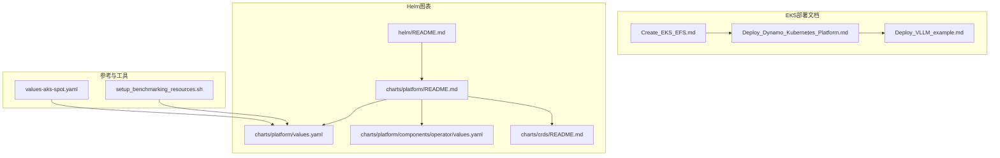
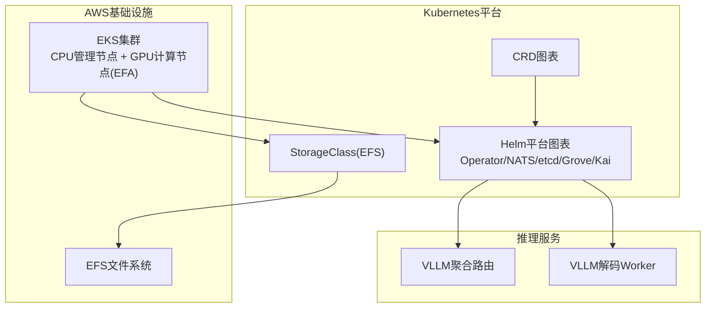
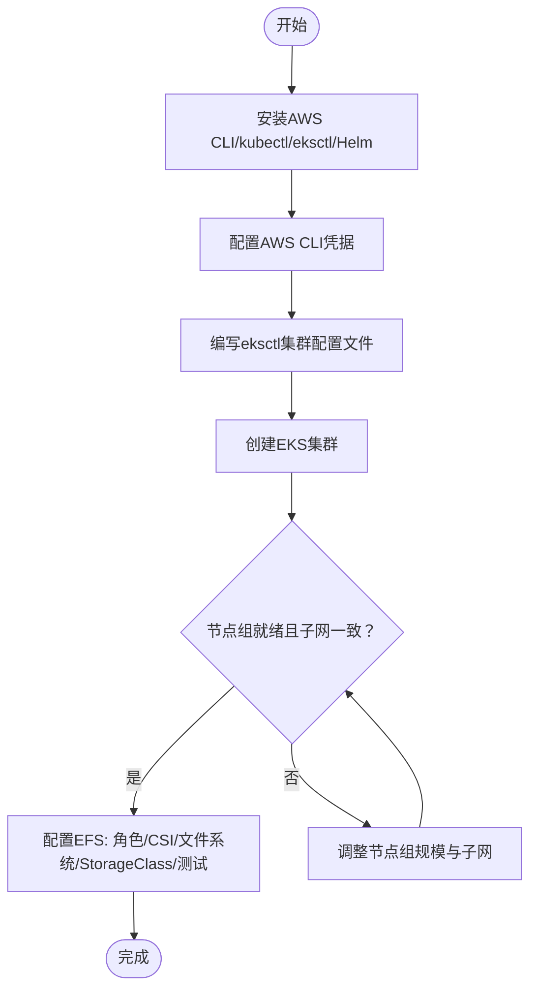
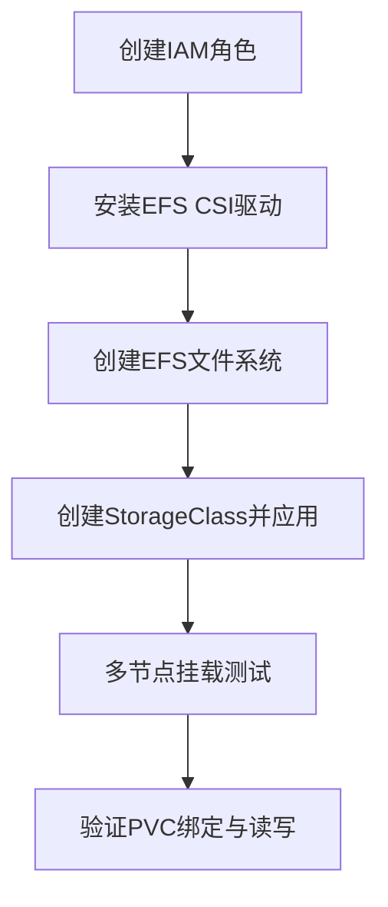
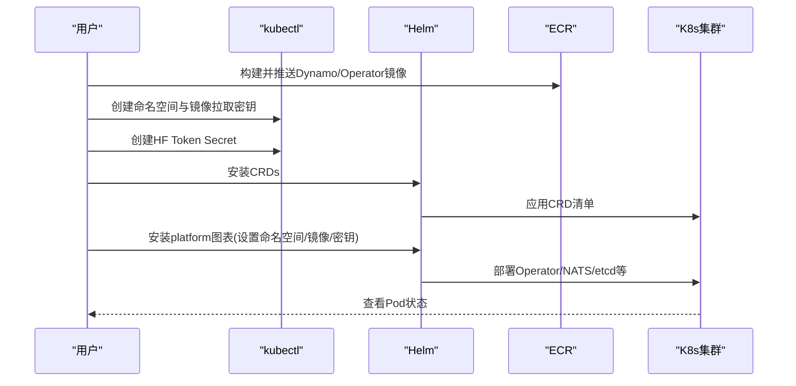
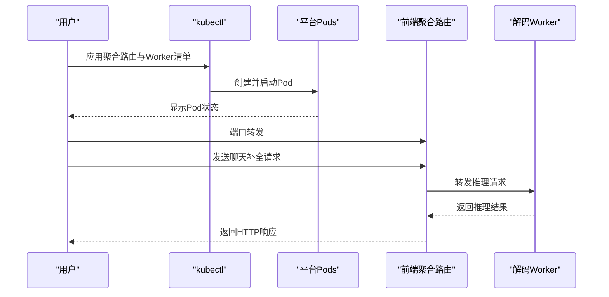
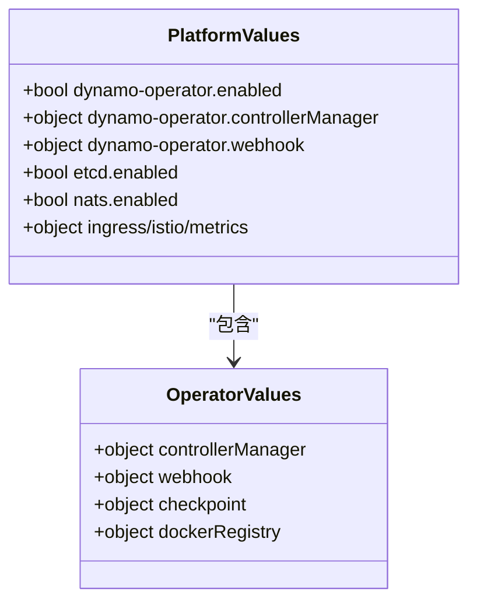
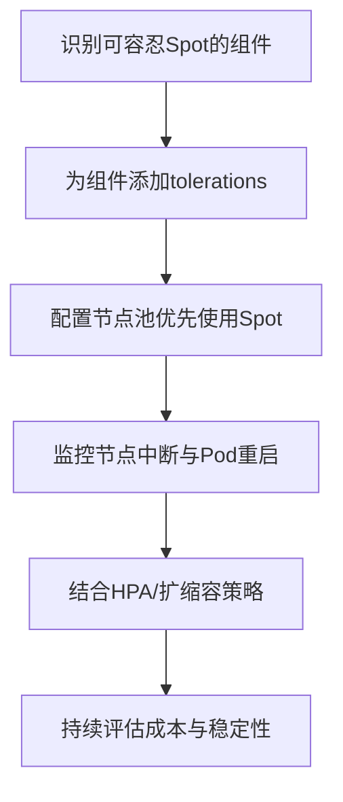
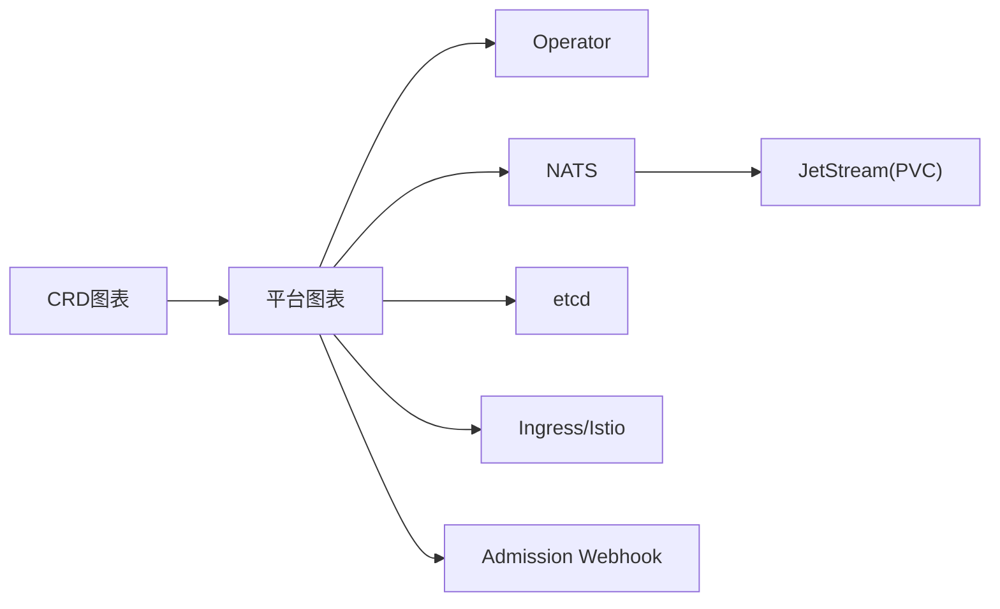

# AWS EKS部署

<cite>
**本文引用的文件**
- [examples/deployments/EKS/Create_EKS_EFS.md](file://examples/deployments/EKS/Create_EKS_EFS.md)
- [examples/deployments/EKS/Deploy_Dynamo_Kubernetes_Platform.md](file://examples/deployments/EKS/Deploy_Dynamo_Kubernetes_Platform.md)
- [examples/deployments/EKS/Deploy_VLLM_example.md](file://examples/deployments/EKS/Deploy_VLLM_example.md)
- [deploy/helm/README.md](file://deploy/helm/README.md)
- [deploy/helm/charts/platform/README.md](file://deploy/helm/charts/platform/README.md)
- [deploy/helm/charts/platform/values.yaml](file://deploy/helm/charts/platform/values.yaml)
- [deploy/helm/charts/platform/components/operator/values.yaml](file://deploy/helm/charts/platform/components/operator/values.yaml)
- [deploy/helm/charts/crds/README.md](file://deploy/helm/charts/crds/README.md)
- [examples/deployments/AKS/values-aks-spot.yaml](file://examples/deployments/AKS/values-aks-spot.yaml)
- [deploy/utils/setup_benchmarking_resources.sh](file://deploy/utils/setup_benchmarking_resources.sh)
</cite>

## 目录
1. [简介](#简介)
2. [项目结构](#项目结构)
3. [核心组件](#核心组件)
4. [架构总览](#架构总览)
5. [详细组件分析](#详细组件分析)
6. [依赖关系分析](#依赖关系分析)
7. [性能考虑](#性能考虑)
8. [故障排查指南](#故障排查指南)
9. [结论](#结论)
10. [附录](#附录)

## 简介
本指南面向在AWS EKS上部署Dynamo平台的工程实践，覆盖以下关键主题：
- EKS集群创建与节点组配置（含GPU节点与EFA）
- EFS持久化存储配置与StorageClass创建
- Dynamo平台通过Helm的安装与配置
- 持久化存储、网络策略与负载均衡的配置要点
- Spot实例优化与成本控制策略
- 故障排查与性能优化建议

本指南严格基于仓库中的现有文档与Helm配置，确保可操作性与一致性。

## 项目结构
围绕EKS部署的相关文件主要分布在以下位置：
- examples/deployments/EKS：EKS集群与EFS创建、Dynamo平台安装、VLLM示例部署的步骤文档
- deploy/helm：Dynamo平台的Helm图表与CRD说明
- examples/deployments/AKS：提供跨云平台的Spot配置参考（用于理解toleration等概念）
- deploy/utils：基准测试资源准备脚本（便于验证PVC与Secret）

**图示来源**
- [examples/deployments/EKS/Create_EKS_EFS.md](file://examples/deployments/EKS/Create_EKS_EFS.md#L1-L153)
- [examples/deployments/EKS/Deploy_Dynamo_Kubernetes_Platform.md](file://examples/deployments/EKS/Deploy_Dynamo_Kubernetes_Platform.md#L1-L97)
- [examples/deployments/EKS/Deploy_VLLM_example.md](file://examples/deployments/EKS/Deploy_VLLM_example.md#L1-L48)
- [deploy/helm/README.md](file://deploy/helm/README.md#L1-L23)
- [deploy/helm/charts/platform/README.md](file://deploy/helm/charts/platform/README.md#L1-L191)
- [deploy/helm/charts/platform/values.yaml](file://deploy/helm/charts/platform/values.yaml#L1-L778)
- [deploy/helm/charts/platform/components/operator/values.yaml](file://deploy/helm/charts/platform/components/operator/values.yaml#L1-L283)
- [deploy/helm/charts/crds/README.md](file://deploy/helm/charts/crds/README.md#L1-L20)
- [examples/deployments/AKS/values-aks-spot.yaml](file://examples/deployments/AKS/values-aks-spot.yaml#L1-L70)
- [deploy/utils/setup_benchmarking_resources.sh](file://deploy/utils/setup_benchmarking_resources.sh#L1-L107)

**章节来源**
- [examples/deployments/EKS/Create_EKS_EFS.md](file://examples/deployments/EKS/Create_EKS_EFS.md#L1-L153)
- [examples/deployments/EKS/Deploy_Dynamo_Kubernetes_Platform.md](file://examples/deployments/EKS/Deploy_Dynamo_Kubernetes_Platform.md#L1-L97)
- [examples/deployments/EKS/Deploy_VLLM_example.md](file://examples/deployments/EKS/Deploy_VLLM_example.md#L1-L48)
- [deploy/helm/README.md](file://deploy/helm/README.md#L1-L23)

## 核心组件
- EKS集群与节点组
  - 使用eksctl创建包含CPU管理节点与GPU计算节点的集群，并启用EFA以提升多节点通信性能
  - 节点组需开启EFS与ALB等附加策略，确保后续CSI与Ingress可用
- EFS持久化存储
  - 创建EFS文件系统并配置StorageClass，实现多Pod共享访问
  - 通过Helm平台配置PVC与工作负载挂载
- Dynamo平台Helm图表
  - 平台图表提供Operator、NATS、etcd、Grove、Kai调度器等组件的统一安装入口
  - CRD图表负责安装Dynamo自定义资源定义
- VLLM示例部署
  - 基于平台安装后，部署聚合路由与解码Worker进行端到端验证

**章节来源**
- [examples/deployments/EKS/Create_EKS_EFS.md](file://examples/deployments/EKS/Create_EKS_EFS.md#L42-L153)
- [examples/deployments/EKS/Deploy_Dynamo_Kubernetes_Platform.md](file://examples/deployments/EKS/Deploy_Dynamo_Kubernetes_Platform.md#L32-L97)
- [deploy/helm/README.md](file://deploy/helm/README.md#L18-L23)
- [deploy/helm/charts/platform/README.md](file://deploy/helm/charts/platform/README.md#L24-L33)

## 架构总览
下图展示了从EKS集群到Dynamo平台与后端引擎的整体架构关系：

**图示来源**
- [examples/deployments/EKS/Create_EKS_EFS.md](file://examples/deployments/EKS/Create_EKS_EFS.md#L42-L153)
- [examples/deployments/EKS/Deploy_Dynamo_Kubernetes_Platform.md](file://examples/deployments/EKS/Deploy_Dynamo_Kubernetes_Platform.md#L32-L97)
- [deploy/helm/README.md](file://deploy/helm/README.md#L18-L23)
- [deploy/helm/charts/platform/README.md](file://deploy/helm/charts/platform/README.md#L24-L33)

## 详细组件分析

### EKS集群与节点组配置
- 安装CLI：AWS CLI、kubectl、eksctl、Helm
- 配置AWS CLI凭据
- 编写eksctl集群配置文件，包含：
  - OIDC启用
  - 管理节点组（CPU）与计算节点组（GPU，启用EFA与私网）
  - 为节点组附加策略：镜像构建、自动伸缩、EBS、EFS、ALB控制器、CloudWatch
- 创建集群并确认节点组规模与子网一致以满足EFA要求
- 后续步骤包括：创建IAM角色、安装EFS CSI驱动、创建EFS文件系统、测试与创建StorageClass

**图示来源**
- [examples/deployments/EKS/Create_EKS_EFS.md](file://examples/deployments/EKS/Create_EKS_EFS.md#L3-L108)

**章节来源**
- [examples/deployments/EKS/Create_EKS_EFS.md](file://examples/deployments/EKS/Create_EKS_EFS.md#L3-L108)

### EFS持久化存储配置
- 创建IAM角色供EFS CSI使用
- 在EKS控制台通过Add-on安装EFS CSI驱动并确认状态为Active
- 创建EFS文件系统并正确挂载目标子网
- 创建StorageClass并应用，设置文件系统ID、目录权限等参数
- 通过官方示例测试多节点挂载与读写

**图示来源**
- [examples/deployments/EKS/Create_EKS_EFS.md](file://examples/deployments/EKS/Create_EKS_EFS.md#L110-L153)

**章节来源**
- [examples/deployments/EKS/Create_EKS_EFS.md](file://examples/deployments/EKS/Create_EKS_EFS.md#L110-L153)

### Dynamo平台Helm安装与配置
- 准备容器镜像：构建并推送Dynamo基础镜像与Operator镜像至ECR
- 准备密钥：创建镜像拉取密钥与HuggingFace Token Secret
- 安装CRDs与平台图表，指定命名空间与Operator镜像版本
- 验证Pod运行状态（Operator、etcd、NATS、NATS Box等）

**图示来源**
- [examples/deployments/EKS/Deploy_Dynamo_Kubernetes_Platform.md](file://examples/deployments/EKS/Deploy_Dynamo_Kubernetes_Platform.md#L32-L97)
- [deploy/helm/README.md](file://deploy/helm/README.md#L18-L23)

**章节来源**
- [examples/deployments/EKS/Deploy_Dynamo_Kubernetes_Platform.md](file://examples/deployments/EKS/Deploy_Dynamo_Kubernetes_Platform.md#L32-L97)
- [deploy/helm/README.md](file://deploy/helm/README.md#L18-L23)

### VLLM示例部署与验证
- 在平台安装完成后，部署聚合路由与解码Worker
- 通过端口转发与curl调用接口进行功能验证
- 观察Pod状态与响应结果

**图示来源**
- [examples/deployments/EKS/Deploy_VLLM_example.md](file://examples/deployments/EKS/Deploy_VLLM_example.md#L1-L48)

**章节来源**
- [examples/deployments/EKS/Deploy_VLLM_example.md](file://examples/deployments/EKS/Deploy_VLLM_example.md#L1-L48)

### Helm图表与配置要点
- 平台图表支持集群级或命名空间级Operator部署，内置冲突检测与Leader Election配置
- NATS与etcd默认启用，可按需替换为外部实例
- 提供Webhook证书管理、Ingress与Istio集成开关、Metrics导出等高级选项
- Operator子图表提供资源限制、安全上下文、SSH密钥生成等配置

**图示来源**
- [deploy/helm/charts/platform/README.md](file://deploy/helm/charts/platform/README.md#L83-L191)
- [deploy/helm/charts/platform/values.yaml](file://deploy/helm/charts/platform/values.yaml#L19-L283)
- [deploy/helm/charts/platform/components/operator/values.yaml](file://deploy/helm/charts/platform/components/operator/values.yaml#L19-L283)

**章节来源**
- [deploy/helm/charts/platform/README.md](file://deploy/helm/charts/platform/README.md#L41-L191)
- [deploy/helm/charts/platform/values.yaml](file://deploy/helm/charts/platform/values.yaml#L19-L283)
- [deploy/helm/charts/platform/components/operator/values.yaml](file://deploy/helm/charts/platform/components/operator/values.yaml#L19-L283)

### Spot实例优化与成本控制
- 参考AKS的Spot配置模式，可在EKS中通过tolerations将关键组件（Operator、etcd、NATS、NATS Box等）调度到Spot节点
- 注意：Spot节点存在中断风险，应结合Pod驱逐策略、重启机制与弹性扩缩容降低影响
- 结合集群自动伸缩与Spot节点池，实现成本优化

**图示来源**
- [examples/deployments/AKS/values-aks-spot.yaml](file://examples/deployments/AKS/values-aks-spot.yaml#L17-L70)
- [deploy/helm/charts/platform/values.yaml](file://deploy/helm/charts/platform/values.yaml#L52-L65)

**章节来源**
- [examples/deployments/AKS/values-aks-spot.yaml](file://examples/deployments/AKS/values-aks-spot.yaml#L17-L70)
- [deploy/helm/charts/platform/values.yaml](file://deploy/helm/charts/platform/values.yaml#L52-L65)

## 依赖关系分析
- 平台图表依赖CRD图表先期安装
- Operator需要NATS与etcd（或外部实例）进行协调与状态存储
- NATS可启用JetStream持久化存储（PVC），提升消息可靠性
- Ingress/Istio用于对外暴露服务；Webhook用于资源校验

**图示来源**
- [deploy/helm/README.md](file://deploy/helm/README.md#L18-L23)
- [deploy/helm/charts/platform/README.md](file://deploy/helm/charts/platform/README.md#L24-L33)
- [deploy/helm/charts/platform/values.yaml](file://deploy/helm/charts/platform/values.yaml#L280-L334)

**章节来源**
- [deploy/helm/README.md](file://deploy/helm/README.md#L18-L23)
- [deploy/helm/charts/platform/README.md](file://deploy/helm/charts/platform/README.md#L24-L33)
- [deploy/helm/charts/platform/values.yaml](file://deploy/helm/charts/platform/values.yaml#L280-L334)

## 性能考虑
- 网络：GPU节点启用EFA并保持同一子网，减少跨子网通信开销
- 存储：EFS适用于共享模型权重等静态数据；对高吞吐日志/临时中间结果，可结合本地SSD与PVC策略
- 调度：为关键组件配置亲和/反亲和与容忍，避免热点与资源争用
- 指标：启用Prometheus指标导出与Grafana可视化，持续观测延迟、吞吐与资源利用率
- 扩缩容：结合HPA与集群自动伸缩，动态适配流量波动

[本节为通用指导，不直接分析具体文件]

## 故障排查指南
- PVC与Secret验证
  - 使用基准测试资源脚本检查PVC与HF Token Secret是否存在
  - 若缺失，按脚本提示创建或修正命名空间
- Operator冲突
  - 平台图表内置冲突检测，避免重复安装或混合部署模式
  - 如遇冲突，根据错误提示调整Operator作用域（集群级/命名空间级）
- NATS与etcd
  - 检查JetStream PVC是否成功绑定与容量是否充足
  - 若启用TLS/认证，核对证书与CA配置
- Ingress与负载均衡
  - 确认ALB控制器已安装并具备相应IAM策略
  - 检查Ingress类名与TLS Secret名称
- Spot节点稳定性
  - 关注节点中断事件与Pod驱逐记录，必要时提高重启策略与副本数

**章节来源**
- [deploy/utils/setup_benchmarking_resources.sh](file://deploy/utils/setup_benchmarking_resources.sh#L49-L107)
- [deploy/helm/charts/platform/README.md](file://deploy/helm/charts/platform/README.md#L62-L82)
- [deploy/helm/charts/platform/values.yaml](file://deploy/helm/charts/platform/values.yaml#L335-L483)

## 结论
通过以上步骤，可在AWS EKS上完成Dynamo平台的端到端部署：从EKS集群与EFS存储准备，到Helm图表安装与示例验证，并结合Spot优化与成本控制策略实现稳定高效的推理服务。建议在生产环境中进一步完善网络策略、安全上下文与可观测性体系，持续优化资源利用率与SLA表现。

[本节为总结性内容，不直接分析具体文件]

## 附录
- 相关文档与图表
  - 平台图表说明与配置项概览
  - CRD图表说明
  - Helm图表索引

**章节来源**
- [deploy/helm/charts/platform/README.md](file://deploy/helm/charts/platform/README.md#L182-L191)
- [deploy/helm/charts/crds/README.md](file://deploy/helm/charts/crds/README.md#L18-L20)
- [deploy/helm/README.md](file://deploy/helm/README.md#L18-L23)