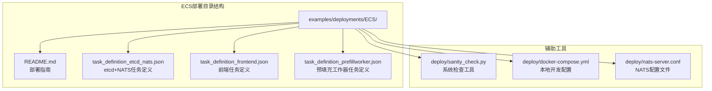
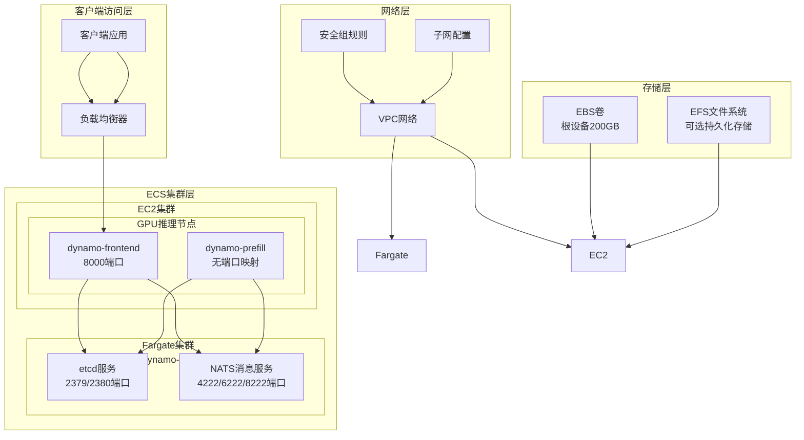
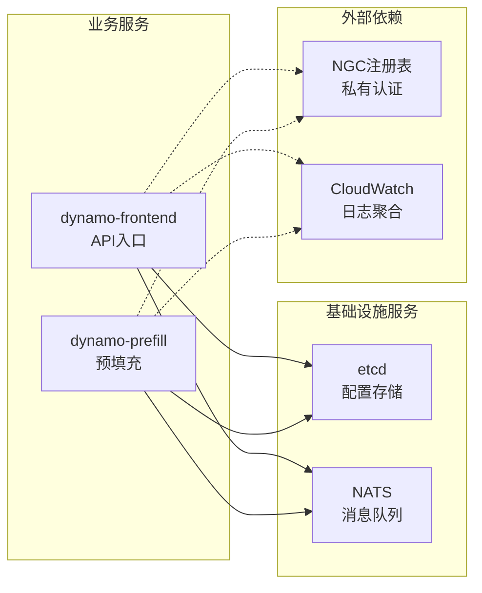
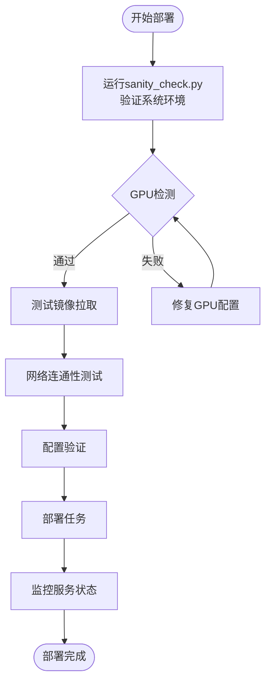

# Amazon ECS部署

<cite>
**本文档引用的文件**
- [README.md](file://examples/deployments/ECS/README.md)
- [task_definition_etcd_nats.json](file://examples/deployments/ECS/task_definition_etcd_nats.json)
- [task_definition_frontend.json](file://examples/deployments/ECS/task_definition_frontend.json)
- [task_definition_prefillworker.json](file://examples/deployments/ECS/task_definition_prefillworker.json)
- [sanity_check.py](file://deploy/sanity_check.py)
- [docker-compose.yml](file://deploy/docker-compose.yml)
- [nats-server.conf](file://deploy/nats-server.conf)
</cite>

## 目录
1. [简介](#简介)
2. [项目结构](#项目结构)
3. [核心组件](#核心组件)
4. [架构概览](#架构概览)
5. [详细组件分析](#详细组件分析)
6. [依赖关系分析](#依赖关系分析)
7. [性能考虑](#性能考虑)
8. [故障排查指南](#故障排查指南)
9. [结论](#结论)
10. [附录](#附录)

## 简介
本指南详细介绍Dynamo在Amazon ECS（Elastic Container Service）上的完整部署流程。该部署方案采用混合架构：使用EC2集群承载GPU推理工作负载（vLLM前端和解码器），使用Fargate集群运行无状态基础设施服务（etcd和NATS）。文档涵盖ECS集群创建、任务定义配置、IAM角色和安全组设置、网络配置、存储挂载策略、服务部署、负载均衡和自动扩缩容等关键环节。

## 项目结构
ECS部署相关的文件主要位于`examples/deployments/ECS/`目录下，包含完整的部署说明和任务定义模板：



**图表来源**
- [README.md](file://examples/deployments/ECS/README.md#L1-L129)
- [task_definition_etcd_nats.json](file://examples/deployments/ECS/task_definition_etcd_nats.json#L1-L112)

**章节来源**
- [README.md](file://examples/deployments/ECS/README.md#L1-L129)

## 核心组件
ECS部署包含三个核心组件，每个组件都有独立的任务定义和配置要求：

### 1. etcd + NATS 基础设施服务
- 运行在Fargate集群上，提供分布式键值存储和消息传递服务
- 使用AWS ECS-optimized GPU AMI，内置NVIDIA驱动和Docker GPU运行时
- 支持多GPU实例类型（g6e.2xlarge到g6e.12xlarge）

### 2. Dynamo vLLM 前端服务
- 运行在EC2集群上，使用host网络模式以充分利用GPU资源
- 配置1个GPU资源限制，支持高性能推理
- 提供统一的API入口点（端口8000）

### 3. Dynamo vLLM 预填充工作器
- 专门处理模型预填充阶段的工作器
- 可独立部署在其他GPU实例上
- 与前端服务共享相同的etcd和NATS配置

**章节来源**
- [README.md](file://examples/deployments/ECS/README.md#L62-L111)
- [task_definition_frontend.json](file://examples/deployments/ECS/task_definition_frontend.json#L1-L79)
- [task_definition_prefillworker.json](file://examples/deployments/ECS/task_definition_prefillworker.json#L1-L71)

## 架构概览
ECS部署采用分层架构设计，确保服务间的高可用性和可扩展性：



**图表来源**
- [README.md](file://examples/deployments/ECS/README.md#L2-L21)
- [task_definition_etcd_nats.json](file://examples/deployments/ECS/task_definition_etcd_nats.json#L1-L112)
- [task_definition_frontend.json](file://examples/deployments/ECS/task_definition_frontend.json#L1-L79)

## 详细组件分析

### etcd + NATS 任务定义配置
etcd和NATS作为基础设施服务，需要在Fargate集群上运行，具有以下关键配置：

#### etcd配置要点
- **容器名称**: etcd
- **镜像**: bitnamilegacy/etcd
- **端口映射**: 2379/TCP (客户端), 2380/TCP (成员通信)
- **环境变量**: ALLOW_NONE_AUTHENTICATION=YES（开发环境）
- **日志配置**: awslogs驱动，支持非阻塞模式

#### NATS配置要点
- **容器名称**: nats
- **镜像**: nats
- **端口映射**: 4222/TCP (客户端), 6222/TCP (集群), 8222/TCP (管理)
- **启动参数**: -js --trace（JetStream和调试跟踪）
- **日志配置**: awslogs驱动

#### 任务定义特性
- **网络模式**: awsvpc（启用VPC网络功能）
- **兼容性**: FARGATE（无服务器计算）
- **资源**: CPU 1024, 内存 3072
- **IAM角色**: ecsTaskExecutionRole（执行权限）

**章节来源**
- [task_definition_etcd_nats.json](file://examples/deployments/ECS/task_definition_etcd_nats.json#L1-L112)

### Dynamo vLLM 前端任务定义
前端服务是用户请求的主要入口点，具有以下配置特点：

#### 容器配置
- **容器名称**: dynamo-vllm-frontend
- **镜像**: nvcr.io/nvidia/ai-dynamo/vllm-runtime:my-tag
- **网络模式**: host（直接访问宿主机网络）
- **GPU资源**: 1个GPU
- **端口映射**: 8000/TCP (HTTP API)

#### 启动命令
- **入口点**: sh -c
- **命令**: 
  ```
  cd examples/backends/vllm && 
  python -m dynamo.frontend --router-mode kv & 
  python3 -m dynamo.vllm --model Qwen/Qwen3-0.6B --enforce-eager
  ```

#### 环境变量
- **ETCD_ENDPOINTS**: http://IP_ADDRESS:2379
- **NATS_SERVER**: nats://IP_ADDRESS:4222

#### 资源规格
- **兼容性**: EC2（专用实例）
- **CPU**: 2048
- **内存**: 40960
- **日志配置**: awslogs驱动

**章节来源**
- [task_definition_frontend.json](file://examples/deployments/ECS/task_definition_frontend.json#L1-L79)

### Dynamo vLLM 预填充工作器任务定义
预填充工作器专门处理模型的预填充阶段：

#### 关键差异
- **容器名称**: dynamo-prefill
- **网络模式**: bridge（容器网络）
- **端口映射**: 无（仅内部通信）
- **启动参数**: --is-prefill-worker

#### 资源配置
- **GPU资源**: 1个GPU
- **兼容性**: EC2
- **CPU**: 2048
- **内存**: 40960

**章节来源**
- [task_definition_prefillworker.json](file://examples/deployments/ECS/task_definition_prefillworker.json#L1-L71)

## 依赖关系分析

### 服务间依赖关系


**图表来源**
- [task_definition_frontend.json](file://examples/deployments/ECS/task_definition_frontend.json#L7-L9)
- [task_definition_prefillworker.json](file://examples/deployments/ECS/task_definition_prefillworker.json#L6-L8)

### 网络依赖分析
- **VPC网络**: 所有服务必须在同一VPC内通信
- **安全组**: 允许服务间通信和外部访问
- **子网**: 公共和私有子网的正确配置
- **路由表**: 确保互联网访问和NAT网关配置

**章节来源**
- [README.md](file://examples/deployments/ECS/README.md#L8-L21)

## 性能考虑

### GPU资源优化
- **实例选择**: g6e系列提供最佳GPU性价比
- **多GPU配置**: 支持g6e.12xlarge（4 GPU）进行分布式推理
- **资源隔离**: 每个任务明确的GPU配额分配

### 网络性能优化
- **host网络模式**: 前端服务使用host网络减少网络开销
- **桥接网络模式**: 工作器使用bridge网络提高安全性
- **端口映射**: 最小化端口暴露以降低攻击面

### 存储性能
- **根卷大小**: 200GB EBS卷满足GPU推理需求
- **临时存储**: 利用实例存储提高I/O性能
- **持久化选项**: 可选EFS用于数据持久化

## 故障排查指南

### 常见部署问题及解决方案

#### 1. 任务启动失败
**症状**: 任务状态显示PROVISIONING或RUNNING但很快停止
**排查步骤**:
1. 检查CloudWatch日志中的错误信息
2. 验证IAM角色权限配置
3. 确认镜像URL和认证信息正确
4. 检查资源配额是否充足

#### 2. GPU资源不足
**症状**: 任务无法分配到GPU资源
**排查步骤**:
1. 验证实例类型支持GPU
2. 检查GPU驱动安装
3. 确认任务定义中的GPU配额设置
4. 查看集群的GPU资源使用情况

#### 3. 网络连接问题
**症状**: 服务间通信失败或超时
**排查步骤**:
1. 验证VPC和子网配置
2. 检查安全组规则
3. 确认DNS解析正常
4. 测试端口连通性

#### 4. 认证和授权问题
**症状**: 无法从NGC或其他私有仓库拉取镜像
**排查步骤**:
1. 验证Secret Manager中的认证信息
2. 检查IAM角色策略
3. 确认ARN格式正确
4. 测试手动拉取镜像

### 系统健康检查
使用Dynamo提供的系统检查工具进行预部署验证：



**图表来源**
- [sanity_check.py](file://deploy/sanity_check.py#L1-L150)

### 监控和日志
- **CloudWatch Logs**: 配置awslogs驱动收集容器日志
- **指标监控**: 使用Prometheus格式的指标端点
- **健康检查**: 实现/health和/live端点进行服务健康监控
- **告警设置**: 基于CPU使用率、内存使用率和错误率设置告警

**章节来源**
- [sanity_check.py](file://deploy/sanity_check.py#L1-L200)

## 结论
Dynamo在ECS上的部署提供了高度可扩展和可靠的推理服务架构。通过将基础设施服务（etcd、NATS）与业务服务分离，采用Fargate和EC2的不同计算模式，实现了成本优化和性能平衡。完善的IAM角色配置、网络安全组设置和日志监控机制确保了生产环境的安全性和可观测性。

该部署方案特别适合需要高性能GPU推理能力的企业级应用场景，支持从单节点到多节点的弹性扩展，能够有效应对不同规模的推理需求。

## 附录

### AWS CLI命令参考
以下是一些常用的AWS CLI命令，用于ECS集群管理和监控：

```bash
# 创建ECS集群
aws ecs create-cluster --cluster-name dynamo-GPU

# 注册任务定义
aws ecs register-task-definition --cli-input-json file://task_definition_frontend.json

# 创建服务
aws ecs create-service --cluster dynamo-GPU --service-name dynamo-frontend --task-definition Dynamo-frontend --desired-count 1

# 更新服务
aws ecs update-service --cluster dynamo-GPU --service-name dynamo-frontend --desired-count 2

# 查看任务状态
aws ecs describe-tasks --cluster dynamo-GPU --tasks <task-arn>

# 获取任务日志
aws ecs execute-command --cluster dynamo-GPU --task <task-arn> --container dynamo-vllm-frontend --command "/bin/bash"
```

### 安全最佳实践
1. **最小权限原则**: 为ecsTaskExecutionRole配置最严格的必要权限
2. **网络隔离**: 使用VPC和安全组限制不必要的网络访问
3. **密钥管理**: 使用AWS Secrets Manager管理敏感信息
4. **镜像安全**: 从可信源拉取镜像并定期更新
5. **日志审计**: 启用CloudTrail记录所有ECS操作

### 自动扩缩容配置
虽然当前示例未包含自动扩缩容配置，但可以基于以下指标设置：
- **CPU利用率**: >70%时自动扩展
- **内存利用率**: >80%时自动扩展  
- **请求延迟**: >500ms时自动扩展
- **队列长度**: >100个待处理请求时自动扩展