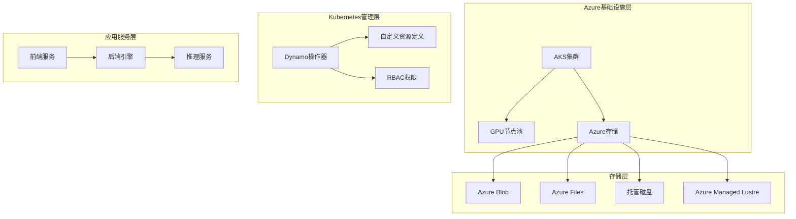
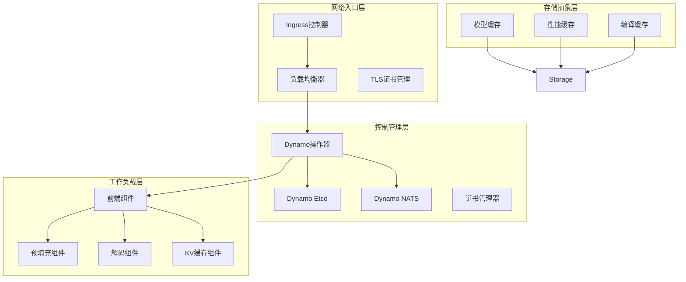
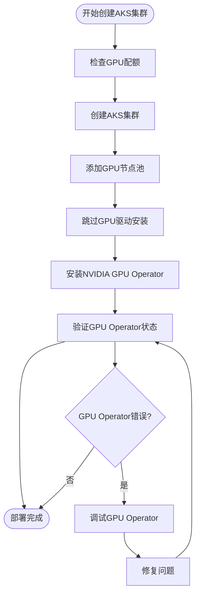
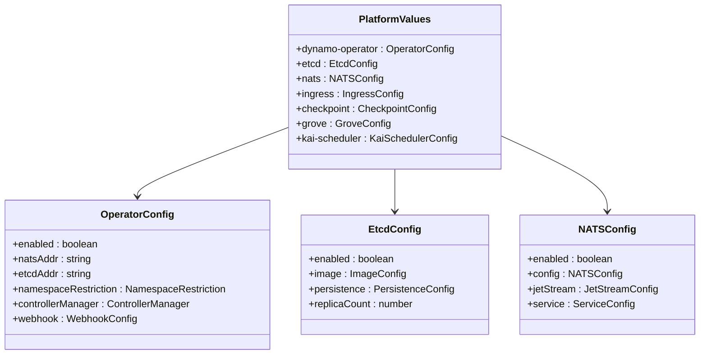
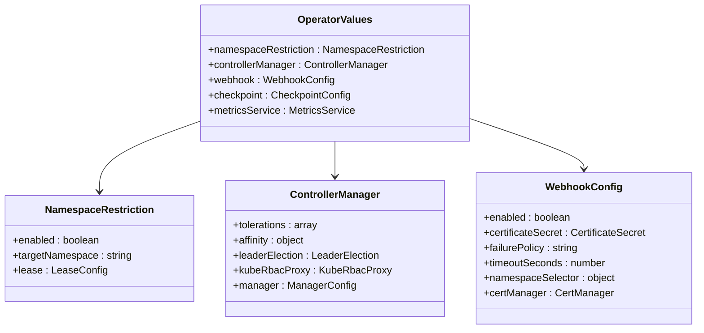
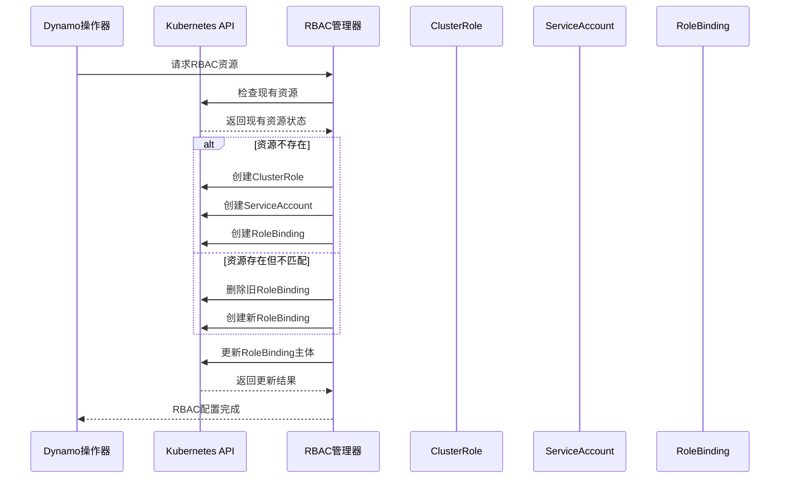
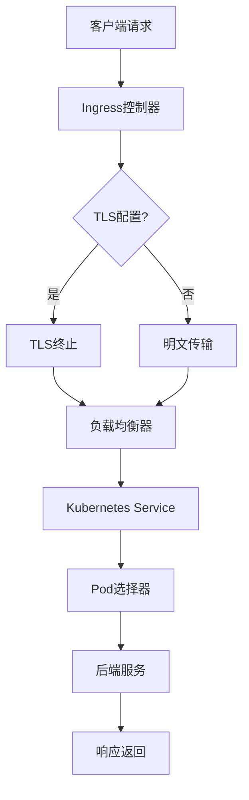
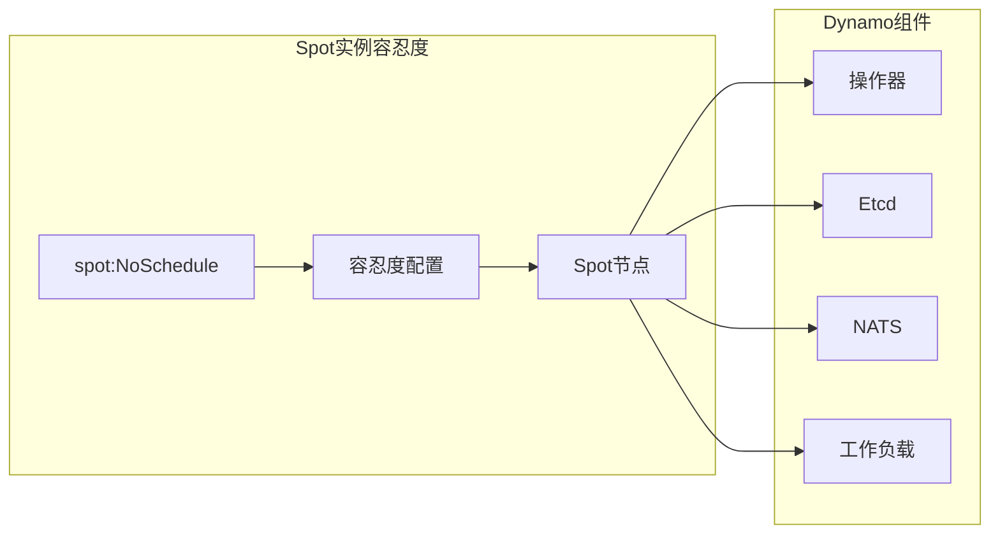
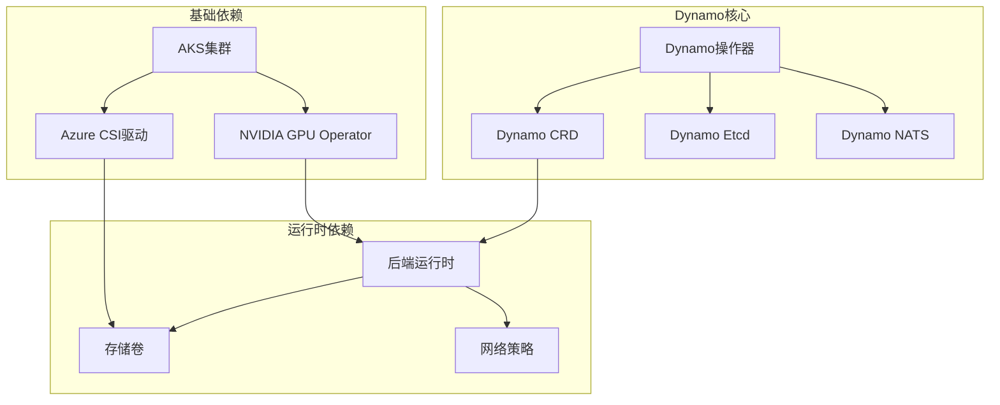

# Azure AKS部署

<cite>
**本文档引用的文件**
- [AKS部署指南](file://examples/deployments/AKS/AKS-deployment.md)
- [AKS Spot实例值覆盖](file://examples/deployments/AKS/values-aks-spot.yaml)
- [平台Helm值配置](file://deploy/helm/charts/platform/values.yaml)
- [操作器Helm值配置](file://deploy/helm/charts/platform/components/operator/values.yaml)
- [Chrek检查点值配置](file://deploy/helm/charts/chrek/values.yaml)
- [Dynamo组件部署控制器](file://deploy/operator/internal/controller/dynamocomponentdeployment_controller.go)
- [RBAC管理器](file://deploy/operator/internal/rbac/manager.go)
- [RBAC测试](file://deploy/operator/internal/rbac/manager_test.go)
- [Kubernetes连接器测试](file://tests/planner/unit/kubernetes_connector.py)
</cite>

## 目录
1. [简介](#简介)
2. [项目结构](#项目结构)
3. [核心组件](#核心组件)
4. [架构概览](#架构概览)
5. [详细组件分析](#详细组件分析)
6. [依赖关系分析](#依赖关系分析)
7. [性能考虑](#性能考虑)
8. [故障排除指南](#故障排除指南)
9. [结论](#结论)
10. [附录](#附录)

## 简介

本指南详细介绍Dynamo在Azure Kubernetes Service (AKS)上的完整部署流程。涵盖AKS集群创建、Azure存储配置、Dynamo部署、RBAC权限配置、网络安全设置以及Azure Spot实例优化等关键主题。

Dynamo是一个分布式推理服务框架，支持多种后端引擎（vLLM、TensorRT-LLM、SGLang），通过Kubernetes原生CRD进行编排管理。在Azure环境中，Dynamo充分利用AKS的GPU节点池、Azure CSI存储驱动和Azure特定的优化功能。

## 项目结构

Dynamo的Azure AKS部署涉及多个层次的配置和组件：



**图表来源**
- [AKS部署指南](file://examples/deployments/AKS/AKS-deployment.md#L1-L201)
- [平台Helm值配置](file://deploy/helm/charts/platform/values.yaml#L1-L778)

**章节来源**
- [AKS部署指南](file://examples/deployments/AKS/AKS-deployment.md#L1-L201)
- [平台Helm值配置](file://deploy/helm/charts/platform/values.yaml#L1-L778)

## 核心组件

### NVIDIA GPU Operator
NVIDIA GPU Operator是AKS GPU节点池的关键组件，负责自动化部署和管理所有NVIDIA软件组件，包括：
- GPU驱动程序
- 容器工具包
- 设备插件
- 监控工具

### Dynamo Kubernetes Operator
Dynamo操作器提供Kubernetes原生的推理服务编排能力：
- 自定义资源定义（CRD）管理
- 工作负载自动扩缩容
- 健康检查和故障恢复
- 多后端引擎支持

### 存储解决方案
Azure提供了多种CSI存储选项，适用于不同的缓存需求：
- **Local CSI (Ephemeral)**：本地临时存储，适合快速模型缓存
- **Azure Managed Lustre**：高性能并行文件系统，适合大型多节点模型
- **Azure Disk**：托管磁盘，适合持久化单写者缓存
- **Azure Files**：文件共享，适合小型/中型共享模型
- **Azure Blob**：对象存储，适合冷启动下载

**章节来源**
- [AKS部署指南](file://examples/deployments/AKS/AKS-deployment.md#L61-L146)
- [平台Helm值配置](file://deploy/helm/charts/platform/values.yaml#L115-L141)

## 架构概览

Dynamo在AKS上的整体架构采用分层设计，确保高可用性和可扩展性：



**图表来源**
- [Dynamo组件部署控制器](file://deploy/operator/internal/controller/dynamocomponentdeployment_controller.go#L969-L997)
- [平台Helm值配置](file://deploy/helm/charts/platform/values.yaml#L280-L334)

## 详细组件分析

### AKS集群创建与配置

#### GPU节点池设置
创建支持GPU的AKS集群需要特别注意以下配置：



**图表来源**
- [AKS部署指南](file://examples/deployments/AKS/AKS-deployment.md#L14-L38)

#### Azure存储配置策略

针对不同缓存需求选择合适的Azure存储类型：

| 存储类型 | 性能等级 | 推荐场景 | 存储类名称 |
|---------|---------|---------|-----------|
| Local CSI (Ephemeral) | 非常高 | 快速模型缓存、热重启 | local-ephemeral |
| Azure Managed Lustre | 极高 | 大型多节点模型、共享缓存 | sc.azurelustre.csi.azure.com |
| Azure Disk | 高 | 持久化单写者模型缓存 | managed-csi |
| Azure Files | 中等 | 共享小型/中型模型 | azurefile-csi |
| Azure Blob | 低-中等 | 冷模型存储、引导下载 | azureblob-csi |

**章节来源**
- [AKS部署指南](file://examples/deployments/AKS/AKS-deployment.md#L61-L146)

### Helm配置文件详解

#### 平台级Helm配置
平台级配置文件提供了Dynamo核心组件的全面控制：



**图表来源**
- [平台Helm值配置](file://deploy/helm/charts/platform/values.yaml#L19-L334)

#### 操作器级Helm配置
操作器专用配置专注于CRD管理和Webhook集成：



**图表来源**
- [操作器Helm值配置](file://deploy/helm/charts/platform/components/operator/values.yaml#L19-L283)

**章节来源**
- [平台Helm值配置](file://deploy/helm/charts/platform/values.yaml#L19-L334)
- [操作器Helm值配置](file://deploy/helm/charts/platform/components/operator/values.yaml#L19-L283)

### RBAC权限配置

Dynamo操作器实现了动态RBAC管理，确保最小权限原则：



**图表来源**
- [RBAC管理器](file://deploy/operator/internal/rbac/manager.go#L27-L43)
- [RBAC测试](file://deploy/operator/internal/rbac/manager_test.go#L39-L314)

RBAC管理器的核心功能包括：
- 动态创建和更新ClusterRole
- 管理ServiceAccount绑定
- 处理RoleRef变更的重新创建
- 支持命名空间范围和集群范围权限

**章节来源**
- [RBAC管理器](file://deploy/operator/internal/rbac/manager.go#L1-L43)
- [RBAC测试](file://deploy/operator/internal/rbac/manager_test.go#L1-L314)

### Ingress和负载均衡配置

Dynamo支持多种入口控制器和负载均衡策略：



**图表来源**
- [Dynamo组件部署控制器](file://deploy/operator/internal/controller/dynamocomponentdeployment_controller.go#L969-L997)

**章节来源**
- [Dynamo组件部署控制器](file://deploy/operator/internal/controller/dynamocomponentdeployment_controller.go#L969-L997)

### Azure Spot实例优化

Azure Spot实例提供显著的成本节约，但需要特殊的容忍度配置：



**图表来源**
- [AKS Spot实例值覆盖](file://examples/deployments/AKS/values-aks-spot.yaml#L19-L70)

关键配置要点：
- 操作器控制器管理器容忍度
- etcd容忍度配置
- NATS和NATS Box容忍度
- MPI SSH密钥生成容忍度

**章节来源**
- [AKS Spot实例值覆盖](file://examples/deployments/AKS/values-aks-spot.yaml#L19-L70)

## 依赖关系分析

Dynamo在AKS部署中的组件依赖关系如下：



**图表来源**
- [平台Helm值配置](file://deploy/helm/charts/platform/values.yaml#L280-L334)
- [Chrek检查点值配置](file://deploy/helm/charts/chrek/values.yaml#L20-L50)

**章节来源**
- [平台Helm值配置](file://deploy/helm/charts/platform/values.yaml#L280-L334)
- [Chrek检查点值配置](file://deploy/helm/charts/chrek/values.yaml#L20-L50)

## 性能考虑

### 存储性能优化

针对不同使用场景的存储性能建议：

1. **模型缓存**：优先使用Azure Managed Lustre或Azure Disk
2. **编译缓存**：使用Local CSI或Azure Disk
3. **性能缓存**：使用Local CSI（临时存储）

### 网络优化

- 启用适当的网络策略限制
- 配置合理的超时参数
- 使用连接池优化后端通信

### 成本优化策略

1. **Spot实例使用**：在非生产环境或批处理任务中使用
2. **资源请求限制**：合理设置CPU和内存请求
3. **自动扩缩容**：根据流量模式调整副本数
4. **存储生命周期管理**：定期清理冷数据

## 故障排除指南

### 常见问题诊断

#### GPU Operator问题
- 检查GPU Operator Pod状态
- 验证GPU驱动版本兼容性
- 确认节点选择器配置正确

#### 存储挂载问题
- 检查StorageClass可用性
- 验证PVC绑定状态
- 确认CSI驱动版本兼容

#### Ingress访问问题
- 检查Ingress控制器状态
- 验证TLS证书配置
- 确认防火墙规则允许

### 监控和日志

推荐的监控指标：
- Pod重启次数
- CPU和内存使用率
- 存储I/O延迟
- 网络连接成功率

**章节来源**
- [AKS部署指南](file://examples/deployments/AKS/AKS-deployment.md#L183-L201)

## 结论

Dynamo在Azure AKS上的部署提供了企业级的推理服务解决方案。通过合理配置GPU节点池、Azure存储和网络策略，可以实现高性能、高可用的AI推理服务。

关键成功因素包括：
- 正确的基础设施规划和资源配置
- 适当的存储策略选择
- 有效的成本管理策略
- 完善的监控和故障排除机制

## 附录

### 安装命令参考

```bash
# 创建AKS集群
az aks create \
    --resource-group myResourceGroup \
    --name myAKSCluster \
    --node-count 3 \
    --enable-addons omsagent \
    --generate-ssh-keys

# 安装NVIDIA GPU Operator
kubectl create namespace gpu-operator
helm repo add nvidia https://nvidia.github.io/k8s-device-plugin
helm install gpu-operator nvidia/gpu-operator \
    --namespace gpu-operator \
    --set toolkit.version=24.9.0

# 部署Dynamo平台
helm install dynamo-platform ./deploy/helm/charts/platform \
    --namespace dynamo-system \
    --create-namespace
```

### 配置文件模板

完整的Helm配置文件应包含：
- 基础设施配置（GPU节点池、存储类）
- 应用配置（资源限制、探针配置）
- 网络配置（Ingress、TLS、防火墙）
- 安全配置（RBAC、证书管理）