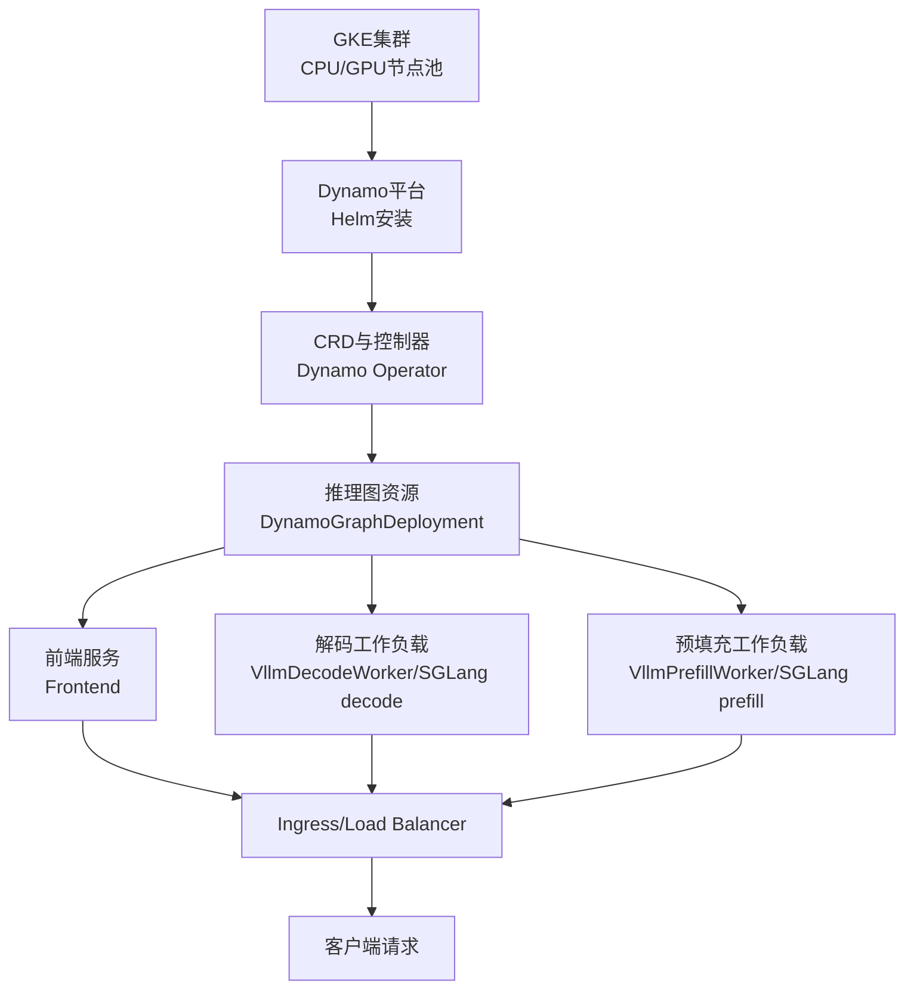
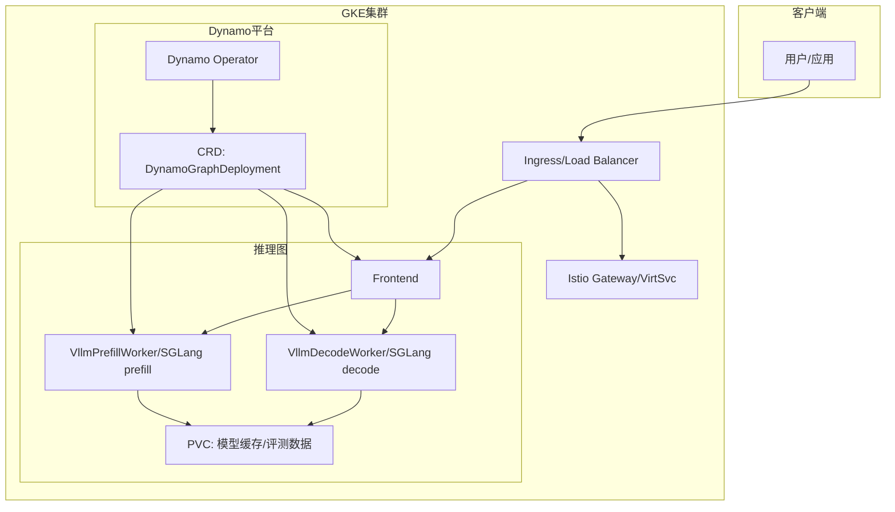
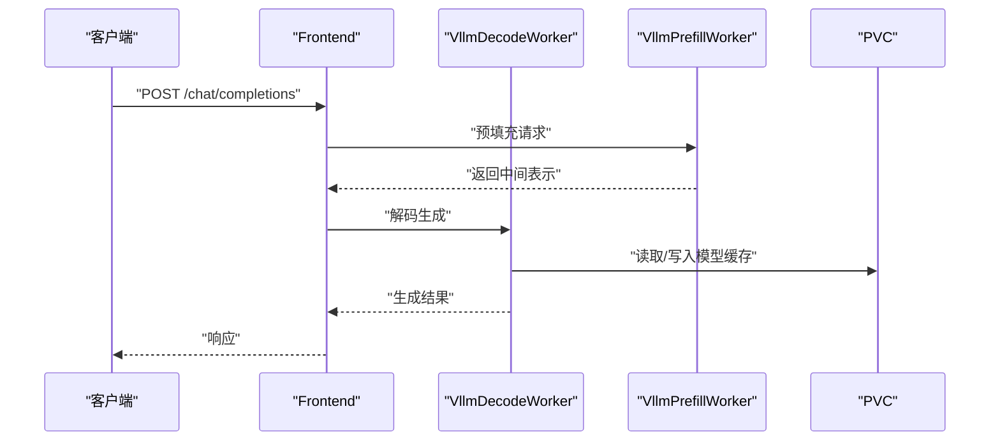
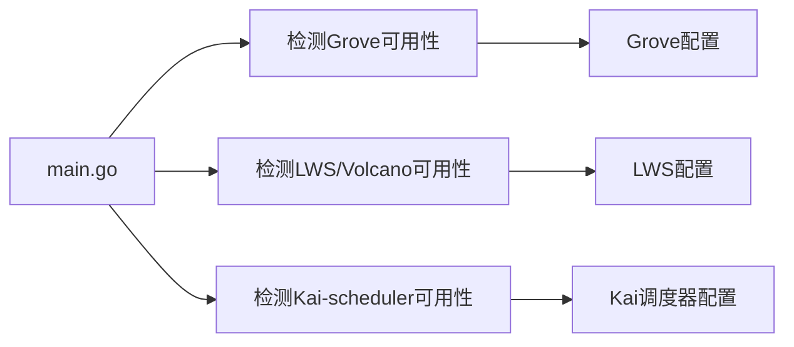

# Google GKE部署

<cite>
**本文引用的文件**
- [examples/deployments/GKE/README.md](file://examples/deployments/GKE/README.md)
- [examples/deployments/GKE/vllm/disagg.yaml](file://examples/deployments/GKE/vllm/disagg.yaml)
- [examples/deployments/GKE/sglang/disagg.yaml](file://examples/deployments/GKE/sglang/disagg.yaml)
- [docs/pages/kubernetes/installation-guide.md](file://docs/pages/kubernetes/installation-guide.md)
- [deploy/utils/manifests/pvc.yaml](file://deploy/utils/manifests/pvc.yaml)
- [deploy/utils/manifests/pvc-access-pod.yaml](file://deploy/utils/manifests/pvc-access-pod.yaml)
- [deploy/utils/setup_benchmarking_resources.sh](file://deploy/utils/setup_benchmarking_resources.sh)
- [deploy/operator/cmd/main.go](file://deploy/operator/cmd/main.go)
</cite>

## 目录
1. [简介](#简介)
2. [项目结构](#项目结构)
3. [核心组件](#核心组件)
4. [架构总览](#架构总览)
5. [详细组件分析](#详细组件分析)
6. [依赖关系分析](#依赖关系分析)
7. [性能考虑](#性能考虑)
8. [故障排查指南](#故障排查指南)
9. [结论](#结论)
10. [附录](#附录)

## 简介
本指南面向在Google GKE（Google Kubernetes Engine）上部署Dynamo平台与推理图（Inference Graph），覆盖以下关键主题：
- GKE集群创建与节点池配置（含GPU节点池）
- Persistent Disk与PVC配置
- Dynamo平台安装与验证
- vLLM与SGLang的Disaggregated部署配置
- Cloud Load Balancing与Ingress/网关集成
- Istio服务网格支持与流量管理
- 监控与可观测性（Prometheus/Grafana）
- GCP Spot VM优化与成本控制策略
- GCP特定故障排查与性能调优建议

## 项目结构
围绕GKE部署的相关文件主要分布在以下位置：
- GKE部署说明与示例：examples/deployments/GKE
- 平台安装指南：docs/pages/kubernetes/installation-guide.md
- 基础设施与PVC工具：deploy/utils/manifests 与 deploy/utils/setup_benchmarking_resources.sh
- 运行时与控制器入口：deploy/operator/cmd/main.go

图表来源
- [examples/deployments/GKE/README.md](file://examples/deployments/GKE/README.md#L8-L46)
- [docs/pages/kubernetes/installation-guide.md](file://docs/pages/kubernetes/installation-guide.md#L121-L137)
- [examples/deployments/GKE/vllm/disagg.yaml](file://examples/deployments/GKE/vllm/disagg.yaml#L9-L59)
- [examples/deployments/GKE/sglang/disagg.yaml](file://examples/deployments/GKE/sglang/disagg.yaml#L8-L57)

章节来源
- [examples/deployments/GKE/README.md](file://examples/deployments/GKE/README.md#L1-L189)
- [docs/pages/kubernetes/installation-guide.md](file://docs/pages/kubernetes/installation-guide.md#L1-L374)

## 核心组件
- GKE集群与节点池
  - 使用gcloud创建共享子网的GKE集群，包含CPU节点池与GPU节点池；GPU节点池启用自动伸缩与最新驱动版本。
- Dynamo平台
  - 通过Helm从NGC发布制品安装CRD与平台组件；支持集群级或命名空间限制模式。
- 推理图（DynamoGraphDeployment）
  - 定义Frontend与Worker（解码/预填充）服务，按需挂载PVC与HuggingFace令牌密钥。
- 持久化存储
  - PVC用于模型缓存与评测数据；可选使用RWX存储类以满足多副本访问需求。
- 可观测性
  - Prometheus与Grafana仪表盘配置，便于监控Dynamo与后端引擎指标。

章节来源
- [examples/deployments/GKE/README.md](file://examples/deployments/GKE/README.md#L8-L46)
- [docs/pages/kubernetes/installation-guide.md](file://docs/pages/kubernetes/installation-guide.md#L121-L137)
- [examples/deployments/GKE/vllm/disagg.yaml](file://examples/deployments/GKE/vllm/disagg.yaml#L1-L60)
- [examples/deployments/GKE/sglang/disagg.yaml](file://examples/deployments/GKE/sglang/disagg.yaml#L1-L58)
- [deploy/utils/manifests/pvc.yaml](file://deploy/utils/manifests/pvc.yaml#L1-L17)

## 架构总览
下图展示了Dynamo在GKE上的典型部署拓扑：前端负责接入与路由，解码/预填充Worker分别处理生成与编码阶段，Ingress/负载均衡器对外暴露服务，Istio可选用于精细化流量治理。

图表来源
- [examples/deployments/GKE/vllm/disagg.yaml](file://examples/deployments/GKE/vllm/disagg.yaml#L9-L59)
- [examples/deployments/GKE/sglang/disagg.yaml](file://examples/deployments/GKE/sglang/disagg.yaml#L8-L57)
- [deploy/operator/cmd/main.go](file://deploy/operator/cmd/main.go#L194-L203)

## 详细组件分析

### GKE集群与节点池配置
- 集群创建要点
  - 指定项目、区域/可用区、集群名称与机器类型
  - 子网使用默认子网；设置磁盘大小与节点数量
- GPU节点池
  - 指定GPU类型与数量，启用自动伸缩（最小/最大节点数）
  - 使用最新GPU驱动版本，确保容器运行时与内核模块匹配

章节来源
- [examples/deployments/GKE/README.md](file://examples/deployments/GKE/README.md#L10-L46)

### Persistent Disk与PVC配置
- PVC清单
  - 命名与命名空间固定，请求容量50Gi
  - 可选storageClassName指定RWX存储类（如NFS）以支持多副本挂载
- PVC访问Pod
  - 提供临时Pod用于直接访问PVC中的数据，便于评测与调试

章节来源
- [deploy/utils/manifests/pvc.yaml](file://deploy/utils/manifests/pvc.yaml#L1-L17)
- [deploy/utils/manifests/pvc-access-pod.yaml](file://deploy/utils/manifests/pvc-access-pod.yaml#L1-L41)

### Dynamo平台安装与验证
- 安装路径
  - 生产路径：从NGC Helm制品安装CRD与平台
  - 自定义构建路径：从源码构建并推送镜像后安装
- 验证步骤
  - 检查CRD是否存在
  - 查看平台Pod状态（Operator/etcd/NATS）

章节来源
- [docs/pages/kubernetes/installation-guide.md](file://docs/pages/kubernetes/installation-guide.md#L121-L137)
- [docs/pages/kubernetes/installation-guide.md](file://docs/pages/kubernetes/installation-guide.md#L253-L262)

### vLLM与SGLang Disaggregated部署
- 共同要求
  - 在Worker容器中设置LD_LIBRARY_PATH与PATH，确保GKE正确加载GPU驱动
  - 指定后端镜像（NGC）与模型名称
  - Frontend与Worker均需正确命名空间与资源限制
- vLLM配置要点
  - 解码/预填充Worker分别设置不同的资源上限
  - Worker通过envFromSecret挂载HuggingFace令牌
- SGLang配置要点
  - 明确区分decode与prefill模式参数
  - 启用disaggregation传输后端（如nixl）与引导端口

图表来源
- [examples/deployments/GKE/vllm/disagg.yaml](file://examples/deployments/GKE/vllm/disagg.yaml#L16-L59)

章节来源
- [examples/deployments/GKE/vllm/disagg.yaml](file://examples/deployments/GKE/vllm/disagg.yaml#L1-L60)
- [examples/deployments/GKE/sglang/disagg.yaml](file://examples/deployments/GKE/sglang/disagg.yaml#L1-L58)

### Cloud Load Balancing与Ingress/网关
- Ingress控制器类名与TLS密钥
  - 通过启动参数指定Ingress控制器类名与TLS密钥名称
- Istio虚拟服务网关
  - 支持通过istio-virtual-service-gateway参数绑定到指定网关
  - 可配置虚拟服务是否支持HTTPS端点

章节来源
- [deploy/operator/cmd/main.go](file://deploy/operator/cmd/main.go#L194-L203)

### Istio服务网格与流量管理
- 控制器初始化时导入istio客户端方案，支持在集群中创建与管理VirtualService等资源
- 结合Ingress控制器类名与TLS密钥，实现统一入口与安全传输

章节来源
- [deploy/operator/cmd/main.go](file://deploy/operator/cmd/main.go#L73-L74)
- [deploy/operator/cmd/main.go](file://deploy/operator/cmd/main.go#L194-L203)

### 监控与可观测性
- Prometheus端点
  - 通过prometheus-endpoint参数注入Prometheus抓取地址
- Grafana仪表盘
  - 提供Dynamo与KVBM等组件的仪表盘配置，便于查看关键指标

章节来源
- [deploy/operator/cmd/main.go](file://deploy/operator/cmd/main.go#L208-L209)
- [docs/pages/kubernetes/installation-guide.md](file://docs/pages/kubernetes/installation-guide.md#L281-L283)

## 依赖关系分析
Dynamo Operator在启动时会检测并启用多种编排与调度能力，从而影响多节点部署与资源管理：

图表来源
- [deploy/operator/cmd/main.go](file://deploy/operator/cmd/main.go#L503-L523)

章节来源
- [deploy/operator/cmd/main.go](file://deploy/operator/cmd/main.go#L503-L523)

## 性能考虑
- GPU驱动与库路径
  - 在Worker容器中显式设置LD_LIBRARY_PATH与PATH，并执行动态链接器配置，确保GPU驱动被正确加载
- 资源配额与扩缩容
  - 为解码/预填充Worker分别设置GPU上限，结合自动伸缩策略应对突发流量
- 存储I/O
  - 使用PVC挂载模型缓存目录，避免重复下载；必要时选择具备更高吞吐的RWX存储类
- 网络与入口
  - 使用Ingress/Load Balancer统一入口，结合Istio进行限流与熔断，提升整体稳定性

章节来源
- [examples/deployments/GKE/vllm/disagg.yaml](file://examples/deployments/GKE/vllm/disagg.yaml#L34-L38)
- [examples/deployments/GKE/sglang/disagg.yaml](file://examples/deployments/GKE/sglang/disagg.yaml#L31-L36)

## 故障排查指南
- 集群与平台检查
  - 确认CRD存在且平台Pod处于Running状态
- 安装验证
  - 使用脚本一键部署评测资源与PVC，校验HuggingFace令牌密钥是否存在
- 常见问题定位
  - Pod未启动：查看Pod描述与日志
  - etcd镜像不兼容：添加位面仓库与安全策略参数
  - 清理卸载：先卸载平台，再逐个删除CRD

章节来源
- [docs/pages/kubernetes/installation-guide.md](file://docs/pages/kubernetes/installation-guide.md#L285-L344)
- [deploy/utils/setup_benchmarking_resources.sh](file://deploy/utils/setup_benchmarking_resources.sh#L1-L107)

## 结论
通过本指南，您可以在GKE上完成Dynamo平台的安装与推理图部署，涵盖集群创建、存储配置、服务暴露、服务网格与监控等关键环节。结合Spot VM与自动伸缩策略，可在保证性能的同时有效控制成本。

## 附录

### GCP Spot VM优化与成本控制策略
- 节点池使用Spot实例
  - 在GPU节点池启用自动伸缩，结合Spot实例降低计算成本
- 资源预留与抢占
  - 对关键任务使用预留实例，对突发任务使用Spot实例
- 存储成本优化
  - 使用PVC缓存模型权重，减少重复下载；根据访问模式选择合适存储类

章节来源
- [examples/deployments/GKE/README.md](file://examples/deployments/GKE/README.md#L43-L45)